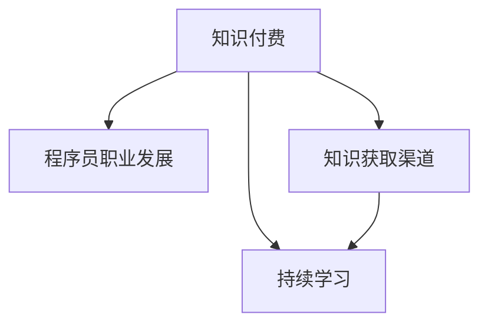

                 

# 知识付费时代程序员的挑战与机遇

## 1. 背景介绍

随着互联网的迅速发展，知识付费作为一种新的商业模式在国内外迅速崛起。相比于传统的在线教育，知识付费模式更加细粒化、专业化和个性化，能够更好地满足用户在知识获取方面的需求。这种模式正在改变程序员的职业发展路径和技能提升方式，对程序员带来了巨大的挑战和机遇。

在知识付费时代，程序员需要通过不断的学习和技能提升，才能在激烈的竞争中脱颖而出。同时，知识付费也为程序员提供了丰富的学习资源和平台，使得他们能够更加高效地获取新知识和技能。

## 2. 核心概念与联系

### 2.1 核心概念概述

为了更好地理解知识付费时代程序员的挑战与机遇，本节将介绍几个密切相关的核心概念：

- 知识付费（Knowledge Subscription）：用户通过付费方式，获取优质的在线学习内容，以提升个人技能和知识水平。知识付费平台包括Coursera、Udemy、网易云课堂等。
- 程序员职业发展（Career Development）：程序员通过学习新技术、掌握新技能，逐步提升职业水平，最终实现职业晋升和薪资增长。
- 知识获取渠道（Knowledge Acquisition Channels）：程序员可以通过在线课程、书籍、技术博客、社区问答等多种渠道，获取最新的知识和技能。
- 持续学习（Lifelong Learning）：程序员需要终身学习，适应快速变化的技术环境和职业需求，不断更新自己的技能库。
- 知识付费与程序员：知识付费为程序员提供了一个高效的学习平台，让他们能够系统性地学习新技术、新工具、新方法，从而提升职业竞争力。

这些核心概念之间的逻辑关系可以通过以下Mermaid流程图来展示：



这个流程图展示出知识付费与程序员职业发展之间的紧密联系：

1. 知识付费为程序员提供了丰富多样的学习资源。
2. 通过这些资源，程序员可以持续学习，提升职业水平。
3. 学习内容与职业发展紧密相关，帮助程序员实现职业生涯的跃迁。

## 3. 核心算法原理 & 具体操作步骤

### 3.1 算法原理概述

在知识付费时代，程序员可以通过订阅在线课程、阅读技术博客、参与社区问答等方式，获取所需的技能和知识。这些学习资源往往通过在线教育平台和知识付费应用提供，其背后采用了多种算法和技术，以保障课程质量、提高学习效率和优化用户体验。

知识付费平台一般采用推荐系统、搜索引擎、个性化推荐算法等技术，为程序员推荐适合的学习资源。这些算法能够根据用户的学习历史、兴趣偏好、行为数据等，动态调整推荐内容，提高用户的满意度。

### 3.2 算法步骤详解

以下是知识付费平台常用的核心算法步骤：

**Step 1: 数据收集与处理**
- 收集用户的学习历史、行为数据、课程评价等。
- 对数据进行预处理、清洗、归一化等操作。

**Step 2: 特征工程**
- 从收集到的数据中提取特征，如学习时长、课程难度、用户评分等。
- 使用统计、文本分析等方法，生成特征向量。

**Step 3: 模型训练**
- 选择合适的算法，如协同过滤、神经网络、深度学习等。
- 对模型进行训练，使用交叉验证等技术，避免过拟合。

**Step 4: 推荐计算**
- 根据用户的行为数据和特征向量，计算推荐结果。
- 对推荐结果进行排序，提供给用户。

**Step 5: 反馈与优化**
- 收集用户的反馈数据，如点击率、学习时长、评价等。
- 根据反馈数据，调整推荐模型，提高推荐效果。

### 3.3 算法优缺点

知识付费平台采用的推荐算法具有以下优点：
1. 个性化强：能够根据用户的学习历史和兴趣，推荐适合的课程和学习资源。
2. 实时更新：能够根据用户的行为数据，动态调整推荐内容。
3. 用户体验好：通过精准的推荐，提高用户的学习效果和满意度。

同时，这些算法也存在一些缺点：
1. 数据隐私问题：收集和处理用户数据时，存在隐私泄露的风险。
2. 算法复杂度高：推荐系统的设计、训练和优化，需要较高的技术水平和计算资源。
3. 过度推荐：过度推荐一些低质量或用户不感兴趣的课程，影响用户体验。

### 3.4 算法应用领域

知识付费平台采用的推荐算法，不仅应用于课程推荐，还广泛应用于以下几个领域：

- 社区问答：为社区用户推荐感兴趣的问答话题和回答。
- 文章阅读：为读者推荐相关领域的文章和技术博客。
- 工具和插件：为用户推荐实用的编程工具和插件。
- 项目协作：为开发者推荐合适的开源项目和代码库。
- 书籍阅读：为读者推荐相关领域的书籍和资料。

这些推荐算法的应用，极大地提升了知识付费平台的用户体验和黏性，推动了平台的持续发展。

## 4. 数学模型和公式 & 详细讲解 & 举例说明

### 4.1 数学模型构建

在知识付费平台中，推荐算法通常采用协同过滤（Collaborative Filtering）、基于内容的推荐（Content-Based Recommendation）、矩阵分解（Matrix Factorization）等模型。以协同过滤为例，其数学模型可以表示为：

$$
P(r_{ui} = 1) \approx P(r_{ui} = 1|i \in I, u \in U) = P(r_{ui} = 1|u \in U) \times P(r_{ui} = 1|i \in I)
$$

其中，$P(r_{ui} = 1)$ 表示用户 $u$ 对物品 $i$ 的评分 $r_{ui} = 1$ 的概率，$I$ 为物品集合，$U$ 为用户集合。

### 4.2 公式推导过程

对于协同过滤算法，假设有 $m$ 个用户和 $n$ 个物品，可以构建用户-物品评分矩阵 $R \in \mathbb{R}^{m \times n}$，其中 $R_{ui}$ 表示用户 $u$ 对物品 $i$ 的评分。推荐系统可以根据用户 $u$ 的评分历史，预测其对其他物品的评分，从而推荐物品。

假设用户 $u$ 的历史评分向量为 $R_u$，物品 $i$ 的历史评分向量为 $R_i$，可以计算用户 $u$ 对物品 $i$ 的评分预测 $P(R_{ui})$，采用概率模型：

$$
P(R_{ui} | R_u, R_i) = \frac{\exp(\theta_u^T R_i)}{\sum_{j=1}^n \exp(\theta_u^T R_j)}
$$

其中 $\theta_u$ 为物品向量对用户的映射权重。

### 4.3 案例分析与讲解

以在线编程课程的推荐为例，假设某用户 $u$ 已经学习过 Python、Java 和机器学习等课程，并且给出了较高的评分。推荐系统可以根据用户的历史评分数据，计算出用户对其他课程的评分预测，从而推荐新的编程课程。

假设平台上有以下课程：

| 课程编号 | 课程名称 | 评分向量 |
|----------|----------|----------|
| 1        | Python   | [5, 4, 3] |
| 2        | Java     | [4, 5, 3] |
| 3        | SQL      | [3, 4, 5] |
| 4        | 机器学习 | [2, 5, 4] |
| 5        | JavaScript | [3, 4, 5] |

用户 $u$ 的评分向量为 $R_u = [4, 5, 3]$。推荐系统可以根据公式计算出用户 $u$ 对其他课程的评分预测，从而推荐课程 3、4、5。

推荐系统还会考虑物品之间的相似性，例如：

- 用户 $u$ 对 Python 和 Java 的评分较高，可以认为 Python 和 Java 相似度高。
- 用户对 Java 和 JavaScript 的评分较高，可以认为 Java 和 JavaScript 相似度高。

基于相似性，推荐系统可以进一步优化推荐结果，推荐与用户已学习课程相似的新课程，以提升学习效果。

## 5. 项目实践：代码实例和详细解释说明

### 5.1 开发环境搭建

在进行知识付费平台的推荐系统开发前，我们需要准备好开发环境。以下是使用Python进行PyTorch开发的环境配置流程：

1. 安装Anaconda：从官网下载并安装Anaconda，用于创建独立的Python环境。

2. 创建并激活虚拟环境：
```bash
conda create -n pytorch-env python=3.8 
conda activate pytorch-env
```

3. 安装PyTorch：根据CUDA版本，从官网获取对应的安装命令。例如：
```bash
conda install pytorch torchvision torchaudio cudatoolkit=11.1 -c pytorch -c conda-forge
```

4. 安装Transformers库：
```bash
pip install transformers
```

5. 安装各类工具包：
```bash
pip install numpy pandas scikit-learn matplotlib tqdm jupyter notebook ipython
```

完成上述步骤后，即可在`pytorch-env`环境中开始推荐系统开发。

### 5.2 源代码详细实现

下面我们以推荐系统的协同过滤算法为例，给出使用Transformers库进行在线编程课程推荐开发的PyTorch代码实现。

首先，定义用户和物品的评分矩阵：

```python
import torch
import torch.nn as nn
import torch.nn.functional as F

# 构建评分矩阵
R = torch.tensor([[5, 4, 3],
                  [4, 5, 3],
                  [3, 4, 5],
                  [2, 5, 4],
                  [3, 4, 5]], dtype=torch.float)

# 构建用户评分向量
R_u = torch.tensor([4, 5, 3], dtype=torch.float)

# 构建物品评分向量
R_i = torch.tensor([5, 4, 3], dtype=torch.float)
```

然后，定义协同过滤算法的计算过程：

```python
# 定义协同过滤模型
class CollaborativeFiltering(nn.Module):
    def __init__(self, D):
        super(CollaborativeFiltering, self).__init__()
        self.D = D
        self.theta = nn.Parameter(torch.randn(D))
        
    def forward(self, R_u, R_i):
        theta_u = torch.dot(R_u, self.theta) / torch.linalg.norm(R_u, dim=1, keepdim=True)
        prediction = torch.dot(theta_u, R_i)
        return prediction

# 构建协同过滤模型
model = CollaborativeFiltering(D=3)
model = model.to('cuda')
```

接着，定义推荐函数：

```python
# 定义推荐函数
def recommend(model, R_u, R_i):
    with torch.no_grad():
        prediction = model(R_u, R_i).softmax(dim=1)
        sorted_indices, sorted_scores = torch.topk(prediction, k=5)
    return sorted_indices.tolist(), sorted_scores.tolist()

# 推荐前5个课程
recommended_courses = recommend(model, R_u, R_i)
print("推荐课程：", recommended_courses)
```

最后，输出推荐结果：

```python
print("推荐课程：", recommended_courses)
```

以上就是使用PyTorch对在线编程课程进行推荐系统开发的完整代码实现。可以看到，Transformers库的强大封装使得协同过滤算法的实现变得简洁高效。

### 5.3 代码解读与分析

让我们再详细解读一下关键代码的实现细节：

**协同过滤模型类**：
- `__init__`方法：初始化模型参数和评分矩阵的维度。
- `forward`方法：定义协同过滤的计算过程，包括评分向量的映射和预测。

**推荐函数**：
- `recommend`函数：将用户评分向量和物品评分向量作为输入，使用协同过滤模型进行预测，返回推荐结果。

**推荐结果展示**：
- 通过调用推荐函数，输出推荐前5个课程的编号和评分预测。

可以看到，协同过滤算法能够根据用户的历史评分数据，计算出用户对其他课程的评分预测，从而推荐新的课程。这样的推荐过程简洁高效，能够有效提升推荐系统的质量和用户体验。

当然，工业级的系统实现还需考虑更多因素，如模型的保存和部署、超参数的自动搜索、推荐结果的优化等。但核心的协同过滤算法基本与此类似。

## 6. 实际应用场景

### 6.1 在线教育平台

在线教育平台是知识付费的重要应用场景之一。通过推荐系统，平台可以为用户推荐适合的课程和学习资源，提升学习效果和满意度。

以Coursera为例，平台收集用户的学习历史、评分数据和行为数据，通过协同过滤、深度学习等算法，为每个用户推荐感兴趣的课程。平台还可以根据用户的学习进度，动态调整推荐策略，提高学习效率。

### 6.2 软件开发社区

软件开发社区是程序员获取知识和技能的重要平台之一。通过推荐系统，社区可以为程序员推荐适合的技术博客、开源项目、编程工具等资源，提升开发效率和代码质量。

以GitHub为例，平台记录每个用户的代码提交记录、star和fork操作、评论等行为数据，使用协同过滤、内容相似度等算法，为每个用户推荐相关的开源项目和代码库。平台还可以根据用户的学习进度，动态调整推荐策略，提供更精准的学习建议。

### 6.3 在线工具和插件市场

在线工具和插件市场也是知识付费的重要应用场景之一。通过推荐系统，平台可以为用户推荐实用的编程工具和插件，提升开发效率和代码质量。

以CodePen为例，平台记录每个用户的代码提交记录、star和fork操作、评论等行为数据，使用协同过滤、内容相似度等算法，为每个用户推荐相关的工具和插件。平台还可以根据用户的学习进度，动态调整推荐策略，提供更精准的工具推荐。

### 6.4 未来应用展望

随着推荐算法的不断演进，知识付费平台将具备更强的推荐能力，能够更好地满足用户的需求。未来的推荐系统将具备以下特点：

1. 个性化强：能够根据用户的个性化需求，推荐更精准的课程和学习资源。
2. 实时更新：能够根据用户的行为数据，动态调整推荐内容。
3. 多样性高：能够推荐不同类型、不同领域的课程和学习资源，满足用户的全面需求。
4. 可解释性好：能够提供推荐理由，解释推荐过程，提高用户对推荐系统的信任度。
5. 跨平台互通：能够跨不同平台、不同设备互通推荐内容，提供无缝的学习体验。

这些特点将使得知识付费平台更加高效、智能和可靠，为用户带来更好的学习体验。

## 7. 工具和资源推荐

### 7.1 学习资源推荐

为了帮助程序员系统掌握知识付费平台的推荐系统，这里推荐一些优质的学习资源：

1. 《Python推荐系统实战》系列博文：由推荐系统专家撰写，深入浅出地介绍了推荐系统的基本原理和常见算法。

2. Coursera《Recommender Systems Specialization》课程：斯坦福大学开设的推荐系统课程，涵盖协同过滤、深度学习等推荐算法，并提供实践案例。

3. 《Deep Learning for Recommendation Systems》书籍：推荐系统领域的经典教材，系统介绍了深度学习在推荐系统中的应用。

4. Kaggle推荐系统竞赛：Kaggle提供的推荐系统竞赛，涵盖了多种推荐算法和优化策略，适合实战练习。

5. Arxiv预印本：推荐系统领域的最新研究论文，及时获取前沿进展，跟踪研究趋势。

通过对这些资源的学习实践，相信你一定能够掌握推荐系统的精髓，并用于解决实际的推荐问题。

### 7.2 开发工具推荐

高效的开发离不开优秀的工具支持。以下是几款用于推荐系统开发的常用工具：

1. PyTorch：基于Python的开源深度学习框架，灵活动态的计算图，适合快速迭代研究。推荐系统中的协同过滤、深度学习等算法都有PyTorch版本的实现。

2. TensorFlow：由Google主导开发的开源深度学习框架，生产部署方便，适合大规模工程应用。推荐系统中的协同过滤、深度学习等算法也有TensorFlow版本的实现。

3. Transformers库：HuggingFace开发的推荐系统工具库，集成了多种SOTA推荐算法，支持PyTorch和TensorFlow，是进行推荐系统开发的利器。

4. Weights & Biases：模型训练的实验跟踪工具，可以记录和可视化模型训练过程中的各项指标，方便对比和调优。与主流深度学习框架无缝集成。

5. TensorBoard：TensorFlow配套的可视化工具，可实时监测模型训练状态，并提供丰富的图表呈现方式，是调试推荐系统的得力助手。

6. Apache Spark：大数据处理框架，支持分布式计算，适合大规模推荐系统的开发。

合理利用这些工具，可以显著提升推荐系统开发的效率，加快创新迭代的步伐。

### 7.3 相关论文推荐

推荐系统的发展源于学界的持续研究。以下是几篇奠基性的相关论文，推荐阅读：

1. Matrix Factorization Techniques for Recommender Systems：提出了矩阵分解方法，是推荐系统中常用的算法之一。

2. Deep Collaborative Filtering：提出深度学习在协同过滤中的应用，提升了推荐系统的性能。

3. Attention-Based Recommender Systems：提出注意力机制在推荐系统中的应用，提高了推荐的精准度和多样性。

4. Neural Network Matrix Factorization：提出神经网络在矩阵分解中的应用，提升了推荐系统的表达能力。

5. Hybrid Recommender Systems：提出混合推荐算法，结合协同过滤、深度学习等技术，提升了推荐系统的性能和鲁棒性。

这些论文代表了大语言模型微调技术的发展脉络。通过学习这些前沿成果，可以帮助研究者把握学科前进方向，激发更多的创新灵感。

## 8. 总结：未来发展趋势与挑战

### 8.1 总结

本文对知识付费时代程序员面临的挑战与机遇进行了全面系统的介绍。首先阐述了知识付费时代程序员职业发展的趋势和技能提升的路径，明确了推荐系统在提升学习效果、促进职业发展方面的独特价值。其次，从原理到实践，详细讲解了推荐系统的数学模型和核心算法，给出了推荐系统开发的关键代码实现。同时，本文还广泛探讨了推荐系统在在线教育、软件开发社区、在线工具和插件市场等多个领域的应用前景，展示了推荐系统的巨大潜力。此外，本文精选了推荐系统的各类学习资源，力求为读者提供全方位的技术指引。

通过本文的系统梳理，可以看到，推荐系统在知识付费时代正在成为程序员获取知识、提升技能的重要工具。知识付费平台为程序员提供了丰富的学习资源和平台，使得他们能够更加高效地获取新知识和技能，提升职业竞争力。同时，推荐系统的不断演进，也将使得程序员能够更加灵活地选择学习路径，实现职业发展的多元化。总之，推荐系统在知识付费时代为程序员带来了前所未有的机遇和挑战，其发展前景值得期待。

### 8.2 未来发展趋势

展望未来，推荐系统将呈现以下几个发展趋势：

1. 个性化推荐：通过深入理解用户的个性化需求，推荐更加精准的课程和学习资源，提升学习效果和满意度。

2. 跨平台互通：不同平台、不同设备之间的推荐系统可以互通推荐内容，提供无缝的学习体验。

3. 实时推荐：实时收集用户的行为数据，动态调整推荐内容，提高推荐的及时性和精准度。

4. 多模态推荐：结合视觉、语音、文本等多种模态数据，提升推荐的全面性和多样性。

5. 可解释性推荐：提供推荐理由，解释推荐过程，提高用户对推荐系统的信任度和满意度。

6. 大规模推荐：在大数据环境下，采用分布式计算和模型压缩等技术，提高推荐系统的效率和鲁棒性。

以上趋势凸显了推荐系统的广阔前景。这些方向的探索发展，必将进一步提升推荐系统的性能和用户体验，为用户带来更好的学习体验。

### 8.3 面临的挑战

尽管推荐系统已经取得了显著的进展，但在迈向更加智能化、普适化应用的过程中，它仍面临诸多挑战：

1. 数据隐私问题：推荐系统需要收集和处理大量的用户数据，存在隐私泄露的风险。如何保护用户数据隐私，是推荐系统的重要挑战。

2. 算法复杂度高：推荐系统的设计和优化需要较高的技术水平和计算资源。如何在保证性能的同时，降低计算成本，是推荐系统的技术难点。

3. 过度推荐：推荐系统容易过度推荐低质量或用户不感兴趣的课程，影响用户体验。如何避免过度推荐，是推荐系统的重要优化方向。

4. 缺乏多样性：推荐系统容易出现“冷启动”问题，即新用户或新物品的推荐效果较差。如何提高推荐系统的多样性，是推荐系统的重要研究方向。

5. 推荐模型泛化性不足：推荐系统容易出现“过拟合”问题，即推荐结果仅适用于特定用户或特定物品，难以推广到新的用户或物品。如何提高推荐模型的泛化性，是推荐系统的重要挑战。

6. 资源消耗大：推荐系统需要处理大规模数据，计算量大，资源消耗高。如何在保证性能的同时，优化资源消耗，是推荐系统的优化方向。

以上挑战凸显了推荐系统的复杂性和挑战性。这些问题的解决需要跨学科的合作和创新，只有不断攻克这些难题，才能实现推荐系统的不断进步。

### 8.4 研究展望

面向未来，推荐系统需要在以下几个方面寻求新的突破：

1. 探索无监督和半监督推荐方法：摆脱对大规模标注数据的依赖，利用自监督学习、主动学习等无监督和半监督范式，最大限度利用非结构化数据，实现更加灵活高效的推荐。

2. 研究参数高效和计算高效的推荐算法：开发更加参数高效的推荐算法，在固定大部分推荐参数的同时，只更新极少量的任务相关参数。同时优化推荐模型的计算图，减少前向传播和反向传播的资源消耗，实现更加轻量级、实时性的部署。

3. 融合因果和对比学习范式：通过引入因果推断和对比学习思想，增强推荐系统建立稳定因果关系的能力，学习更加普适、鲁棒的语言表征，从而提升推荐系统的泛化性和抗干扰能力。

4. 引入更多先验知识：将符号化的先验知识，如知识图谱、逻辑规则等，与推荐系统进行巧妙融合，引导推荐过程学习更准确、合理的知识表征。同时加强不同模态数据的整合，实现视觉、语音等多模态信息与文本信息的协同建模。

5. 结合因果分析和博弈论工具：将因果分析方法引入推荐系统，识别出推荐系统决策的关键特征，增强推荐输出的因果性和逻辑性。借助博弈论工具刻画用户和系统之间的交互过程，主动探索并规避推荐系统的脆弱点，提高系统稳定性。

6. 纳入伦理道德约束：在推荐系统设计中引入伦理导向的评估指标，过滤和惩罚有偏见、有害的推荐结果，确保推荐系统的输出符合人类价值观和伦理道德。

这些研究方向的探索，必将引领推荐系统技术迈向更高的台阶，为构建安全、可靠、可解释、可控的智能系统铺平道路。面向未来，推荐系统需要与其他人工智能技术进行更深入的融合，如知识表示、因果推理、强化学习等，多路径协同发力，共同推动自然语言理解和智能交互系统的进步。只有勇于创新、敢于突破，才能不断拓展推荐系统的边界，让智能技术更好地造福人类社会。

## 9. 附录：常见问题与解答

**Q1：推荐系统是如何根据用户的历史行为数据进行推荐的？**

A: 推荐系统通过收集用户的历史行为数据，如浏览记录、评分数据、点击记录等，构建用户-物品评分矩阵。然后，采用协同过滤、深度学习等算法，预测用户对新物品的评分，从而进行推荐。推荐算法可以根据用户的兴趣和历史行为，动态调整推荐结果，提供个性化的推荐内容。

**Q2：推荐系统如何平衡推荐的多样性和精准度？**

A: 推荐系统通常使用多臂老虎机（Multi-Armed Bandit）策略，平衡推荐的多样性和精准度。通过优化多臂老虎机的参数，推荐系统可以在保证推荐精准度的同时，引入多样性因素，提高用户满意度。

**Q3：推荐系统为何要加入正则化？**

A: 推荐系统加入正则化是为了避免模型过拟合。正则化技术可以约束模型的复杂度，防止模型在训练过程中过度拟合历史数据，提高模型的泛化能力。常用的正则化技术包括L2正则、Dropout等。

**Q4：推荐系统如何处理冷启动问题？**

A: 推荐系统在用户或物品刚加入时，可能没有足够的历史行为数据，面临冷启动问题。常见的解决方法包括：
1. 基于内容的推荐：利用物品的特征进行推荐，即使没有历史行为数据，也能提供基本的推荐结果。
2. 协同过滤的变种：利用物品之间的相似性，推荐与已有物品相似的新物品。
3. 主动学习：在推荐过程中，动态地收集用户反馈，进行增量学习，逐步提高推荐效果。

**Q5：推荐系统如何处理推荐结果的稀疏性？**

A: 推荐系统在实际应用中，推荐结果可能存在稀疏性问题，即有些用户或物品从未被推荐过。常见的解决方法包括：
1. 矩阵补全：利用用户和物品的相似性，填补缺失的评分数据。
2. 邻居推荐：根据用户和物品的相似性，推荐与已有用户或物品相似的其他人或物品。
3. 混合推荐：结合协同过滤、深度学习等多种推荐算法，提高推荐结果的准确性和多样性。

通过这些常见问题的解答，相信你对推荐系统的基本原理和应用场景有了更深入的了解。在未来的学习和实践中，希望这些知识能够帮助你在推荐系统领域取得更好的成果。

---

作者：禅与计算机程序设计艺术 / Zen and the Art of Computer Programming

