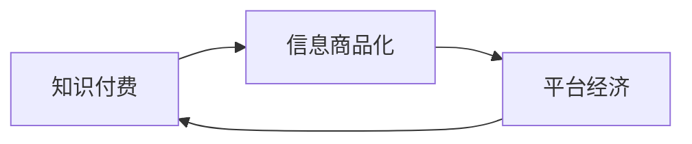

                 

# 知识付费时代：信息商品化的利弊

## 1. 背景介绍

在当今快速发展的数字化时代，信息技术的深度融合正在改变我们的学习方式和消费习惯。知识付费作为一种新兴的商业模式，让消费者可以通过付费获取高质量的学习资料和专业咨询。然而，这种信息商品化的浪潮在带来便利的同时，也引发了诸多争议。本文将从多个角度深入探讨知识付费时代信息商品化的利与弊。

## 2. 核心概念与联系

### 2.1 核心概念概述

#### 2.1.1 知识付费
知识付费是指通过付费订阅、单次购买等方式，获取知识、技能和信息服务。平台如得到、喜马拉雅、知乎等通过提供专业课程、音频内容、在线咨询等服务，满足用户的知识获取需求。

#### 2.1.2 信息商品化
信息商品化是指将知识、技能、信息等无形资产转化为有形的商品，通过市场交换获取经济收益。在知识付费模式下，信息商品化表现为将知识内容商品化，通过付费模式进行交易。

#### 2.1.3 平台经济
平台经济是指借助互联网平台，实现供需双方高效匹配和交易。知识付费平台通过连接知识提供者和消费者，提供便捷、高效的学习渠道和体验。

### 2.2 核心概念原理和架构的 Mermaid 流程图



## 3. 核心算法原理 & 具体操作步骤

### 3.1 算法原理概述

知识付费的核心算法原理基于经济学中的市场交易理论。在知识付费平台上，信息商品以课程、文章、音频等形式呈现，消费者根据自身需求和支付能力选择购买。平台通过匹配合适的知识产品与消费者，实现供需双方的高效匹配和交易。

### 3.2 算法步骤详解

1. **内容生产与上传**
   - 知识生产者（如专家、学者、博主等）创作有价值的内容，并上传至平台。
   - 平台审核内容质量，保证知识内容的准确性和专业性。

2. **内容定价与销售**
   - 平台根据内容价值和市场需求设定价格，并设置付费模式（如单次购买、订阅、会员等）。
   - 消费者根据自身需求和支付能力选择合适的付费方式，完成交易。

3. **内容交付与反馈**
   - 平台将付费内容交付给消费者，并通过技术手段（如云服务、视频直播等）保证内容的有效性和及时性。
   - 平台收集消费者反馈，优化内容质量和用户体验。

### 3.3 算法优缺点

#### 3.3.1 优点
1. **效率提升**
   - 知识付费平台通过精准匹配，显著提升了知识获取的效率。用户可以迅速获取到所需知识，避免了传统学习方式中的时间和成本浪费。

2. **质量保证**
   - 平台通过专业审核机制，确保知识内容的准确性和专业性，减少了错误信息的传播。

3. **多样化选择**
   - 平台提供丰富的知识产品，满足了不同用户的多样化需求，如系统性课程、碎片化学习、技能培训等。

#### 3.3.2 缺点
1. **经济负担**
   - 对于经济条件较差的用户，付费获取知识可能带来一定的经济压力。

2. **信息鸿沟**
   - 高昂的学习成本可能使得部分用户无法获取到高质量的知识内容，加剧信息鸿沟。

3. **内容质量参差不齐**
   - 平台上的知识内容质量参差不齐，部分劣质内容可能误导用户，降低知识付费的实际价值。

### 3.4 算法应用领域

知识付费模式在多个领域得到了广泛应用，如教育、职业技能培训、健康与心理、法律咨询等。以下是几个典型的应用场景：

#### 3.4.1 教育
在线教育平台如新东方、Coursera、edX等，通过提供专业课程和辅导服务，帮助用户提升学历和技能。

#### 3.4.2 职业技能培训
平台如得到、学而思、网易云课堂等，提供各类职业技能培训课程，帮助用户提升职场竞争力。

#### 3.4.3 健康与心理
平台如丁香医生、春雨医生、微医等，提供健康咨询、心理辅导等服务，提升用户的生活质量。

#### 3.4.4 法律咨询
平台如律图、法律出版社等，提供法律知识普及、法律咨询、合同审核等服务，帮助用户解决法律问题。

## 4. 数学模型和公式 & 详细讲解 & 举例说明

### 4.1 数学模型构建

知识付费平台的核心模型包括用户行为模型、内容推荐模型和支付模型。以下是这些模型的简要描述：

#### 4.1.1 用户行为模型
用户行为模型用于描述用户在学习过程中的行为特征，如学习时长、完成度、评价等。模型参数包括用户特征（如年龄、职业、兴趣等）、内容特征（如难度、时长、质量等）和行为特征（如点击、阅读、评论等）。

#### 4.1.2 内容推荐模型
内容推荐模型用于根据用户行为和偏好推荐合适的知识产品。模型参数包括用户特征、内容特征和推荐算法参数。

#### 4.1.3 支付模型
支付模型用于计算和处理用户的支付行为，包括支付金额、支付方式、支付渠道等。模型参数包括支付规则、支付流程、交易规则等。

### 4.2 公式推导过程

#### 4.2.1 用户行为模型
假设用户行为模型为 $F(u,c,t)$，其中 $u$ 为用户特征，$c$ 为内容特征，$t$ 为行为特征。根据贝叶斯定理，用户行为的概率可以表示为：

$$
P(u|c,t) = \frac{P(u,c,t)}{P(c,t)} = \frac{P(u|c,t)P(c|t)P(t)}{P(c|t)P(t)} = P(u|c,t)
$$

#### 4.2.2 内容推荐模型
假设内容推荐模型为 $R(u,c)$，其中 $u$ 为用户特征，$c$ 为内容特征。根据协同过滤算法，推荐内容 $c$ 的概率可以表示为：

$$
P(c|u) = \frac{P(c,u)}{P(u)} = \frac{P(c|u)P(u)}{P(u)} = P(c|u)
$$

#### 4.2.3 支付模型
假设支付模型为 $P(s)$，其中 $s$ 为支付金额。根据线性回归模型，支付金额的概率可以表示为：

$$
P(s|x) = \frac{e^{\beta_0 + \beta_1 x}}{1 + e^{\beta_0 + \beta_1 x}}
$$

### 4.3 案例分析与讲解

#### 4.3.1 用户行为模型
以在线教育平台为例，平台通过分析用户的学习行为数据，预测用户的学习效果。通过用户行为模型，平台可以个性化推荐适合用户的课程和辅导服务。

#### 4.3.2 内容推荐模型
平台通过协同过滤算法，根据用户的历史学习行为推荐相似内容，提高用户的学习效率和满意度。例如，通过分析用户的学习时长和完成度，平台可以推荐更多用户感兴趣的内容。

#### 4.3.3 支付模型
平台通过线性回归模型，预测用户的支付金额。通过支付模型，平台可以优化支付流程，提高交易效率和用户满意度。例如，通过分析用户的历史支付数据，平台可以推荐适合的支付方式和支付渠道。

## 5. 项目实践：代码实例和详细解释说明

### 5.1 开发环境搭建

1. **环境安装**
   - 安装Python 3.x和Pip包管理器。
   - 安装必要的第三方库，如NumPy、Pandas、Scikit-learn、TensorFlow等。

2. **环境配置**
   - 设置虚拟环境，如使用conda或virtualenv。
   - 安装必要的依赖包，如Flask、TensorFlow等。

### 5.2 源代码详细实现

#### 5.2.1 用户行为模型
```python
import numpy as np
from sklearn.linear_model import LogisticRegression

# 定义用户行为模型
class UserBehaviorModel:
    def __init__(self):
        self.model = LogisticRegression()

    def train(self, features, labels):
        self.model.fit(features, labels)

    def predict(self, features):
        return self.model.predict(features)

    def evaluate(self, features, labels):
        score = self.model.score(features, labels)
        return score
```

#### 5.2.2 内容推荐模型
```python
import numpy as np
from sklearn.metrics.pairwise import cosine_similarity

# 定义内容推荐模型
class ContentRecommendationModel:
    def __init__(self):
        self.model = cosine_similarity

    def train(self, content_features, user_features):
        self.model.fit(content_features, user_features)

    def predict(self, content_features):
        return self.model.predict(content_features)

    def evaluate(self, content_features, user_features):
        score = self.model.score(content_features, user_features)
        return score
```

#### 5.2.3 支付模型
```python
import numpy as np
from sklearn.linear_model import LinearRegression

# 定义支付模型
class PaymentModel:
    def __init__(self):
        self.model = LinearRegression()

    def train(self, features, labels):
        self.model.fit(features, labels)

    def predict(self, features):
        return self.model.predict(features)

    def evaluate(self, features, labels):
        score = self.model.score(features, labels)
        return score
```

### 5.3 代码解读与分析

#### 5.3.1 用户行为模型
用户行为模型基于逻辑回归算法，通过用户特征、内容特征和行为特征进行训练。模型的预测结果可以用于个性化推荐，提升用户的学习效果。

#### 5.3.2 内容推荐模型
内容推荐模型基于余弦相似度算法，通过分析用户的历史学习行为和内容特征进行训练。模型的预测结果可以用于推荐相似内容，提高用户的学习效率和满意度。

#### 5.3.3 支付模型
支付模型基于线性回归算法，通过用户的历史支付数据进行训练。模型的预测结果可以用于优化支付流程，提高交易效率和用户满意度。

### 5.4 运行结果展示

#### 5.4.1 用户行为模型
通过用户行为模型，平台可以预测用户的学习效果，并推荐合适的课程和辅导服务。例如，根据用户的学习时长和完成度，平台可以推荐更多用户感兴趣的内容。

#### 5.4.2 内容推荐模型
通过内容推荐模型，平台可以推荐相似内容，提高用户的学习效率和满意度。例如，通过分析用户的学习行为和内容特征，平台可以推荐更多用户感兴趣的内容。

#### 5.4.3 支付模型
通过支付模型，平台可以优化支付流程，提高交易效率和用户满意度。例如，通过分析用户的历史支付数据，平台可以推荐适合的支付方式和支付渠道。

## 6. 实际应用场景

### 6.4 未来应用展望

随着技术的不断进步，知识付费平台将面临更多的机遇和挑战。以下是几个未来的应用展望：

#### 6.4.1 个性化推荐系统
通过深度学习和强化学习算法，平台可以进一步优化个性化推荐系统，提升推荐效果和用户体验。例如，通过分析用户的多维行为数据，平台可以更精准地推荐适合用户的内容。

#### 6.4.2 交互式学习
平台可以通过AI助手、虚拟教练等技术，实现更加智能化的交互式学习。例如，通过自然语言处理和语音识别技术，平台可以与用户进行更加自然流畅的交流。

#### 6.4.3 社交学习
平台可以通过社交功能，促进用户之间的交流和合作。例如，通过建立学习小组、开展学习竞赛等活动，平台可以增强用户的学习动力和效果。

#### 6.4.4 在线办公
平台可以通过知识付费与企业服务结合，提供全方位的在线办公解决方案。例如，通过提供专业培训、咨询服务和文档库，平台可以帮助企业提升管理水平和创新能力。

## 7. 工具和资源推荐

### 7.1 学习资源推荐

#### 7.1.1 在线课程
- 《Python编程：从入门到精通》：全面介绍Python编程基础和高级应用。
- 《机器学习基础与实践》：介绍机器学习的基本原理和实际应用。

#### 7.1.2 学习平台
- Coursera：提供来自世界顶尖大学的在线课程和专业认证。
- edX：提供来自全球名校的在线课程和认证项目。

#### 7.1.3 书籍推荐
- 《深度学习》：Ian Goodfellow、Yoshua Bengio、Aaron Courville著。
- 《Python深度学习》：Francois Chollet著。

### 7.2 开发工具推荐

#### 7.2.1 Python开发工具
- PyCharm：功能强大的Python IDE，支持代码高亮、调试、版本控制等。
- Jupyter Notebook：开源的交互式编程环境，支持多语言的代码执行和数据可视化。

#### 7.2.2 数据处理工具
- Pandas：数据处理和分析工具，支持数据清洗、数据可视化等。
- NumPy：数值计算和科学计算工具，支持矩阵运算、线性代数等。

#### 7.2.3 机器学习库
- Scikit-learn：机器学习库，提供丰富的算法和工具。
- TensorFlow：深度学习框架，支持神经网络、图像处理等。

### 7.3 相关论文推荐

#### 7.3.1 用户行为分析
- "User Behavior Modeling in Recommendation Systems"：介绍用户行为建模的基本方法和算法。

#### 7.3.2 内容推荐算法
- "Collaborative Filtering for Recommender Systems"：介绍协同过滤算法的基本原理和实现。

#### 7.3.3 支付模型
- "Payment Modeling for Online Transactions"：介绍支付模型的基本方法和应用。

## 8. 总结：未来发展趋势与挑战

### 8.1 研究成果总结

知识付费平台作为一种新兴的商业模式，已经取得了显著的成效。平台通过精准匹配和个性化推荐，显著提升了用户的学习效率和满意度。通过优质的内容和服务，平台赢得了大量用户和市场份额。

### 8.2 未来发展趋势

随着技术的不断进步，知识付费平台将迎来更多的机遇和挑战。以下是几个未来的发展趋势：

#### 8.2.1 技术进步
深度学习、自然语言处理、强化学习等技术的不断发展，将进一步优化个性化推荐系统和交互式学习体验，提升平台的竞争力。

#### 8.2.2 市场扩展
知识付费平台的市场空间广阔，未来将拓展到更多行业和领域，如医疗、教育、金融等。平台的业务模式也将更加多样化，如按需付费、订阅制、免费增值等。

#### 8.2.3 用户多样性
随着平台的发展，用户的多样性将进一步增加。平台需要关注不同用户群体的需求和偏好，提供个性化的解决方案。

#### 8.2.4 政策监管
随着知识付费平台的普及，政策监管也将逐步加强。平台需要遵守相关法律法规，保护用户隐私和数据安全。

### 8.3 面临的挑战

#### 8.3.1 数据隐私
平台需要处理大量用户数据，如何保护用户隐私和数据安全是一个重大挑战。平台需要采用加密技术、数据匿名化等措施，确保用户信息的安全性。

#### 8.3.2 内容审核
平台上的内容质量参差不齐，如何通过智能审核机制筛选高质量内容，避免低俗、有害信息的传播是一个重要课题。平台需要引入内容审核算法和大数据分析，提升审核效果。

#### 8.3.3 技术壁垒
平台需要通过技术创新和优化，提升用户体验和平台竞争力。例如，平台需要优化推荐算法，提升推荐效果和响应速度。

#### 8.3.4 用户粘性
平台需要持续优化产品和服务，提升用户粘性和活跃度。例如，平台可以通过社交功能、互动活动等措施，增强用户参与感和满意度。

### 8.4 研究展望

#### 8.4.1 个性化推荐系统
未来将进一步优化个性化推荐系统，提升推荐效果和用户体验。例如，通过深度学习和强化学习算法，平台可以更精准地推荐适合用户的内容。

#### 8.4.2 交互式学习
平台可以通过AI助手、虚拟教练等技术，实现更加智能化的交互式学习。例如，通过自然语言处理和语音识别技术，平台可以与用户进行更加自然流畅的交流。

#### 8.4.3 社交学习
平台可以通过社交功能，促进用户之间的交流和合作。例如，通过建立学习小组、开展学习竞赛等活动，平台可以增强用户的学习动力和效果。

#### 8.4.4 在线办公
平台可以通过知识付费与企业服务结合，提供全方位的在线办公解决方案。例如，通过提供专业培训、咨询服务和文档库，平台可以帮助企业提升管理水平和创新能力。

## 9. 附录：常见问题与解答

**Q1: 知识付费平台如何保障内容质量？**

A: 平台通常采用以下几种方法来保障内容质量：
- 用户评价系统：用户可以对内容进行评价和打分，平台根据用户反馈筛选高质量内容。
- 专家审核机制：平台引入行业专家进行内容审核，确保内容的准确性和专业性。
- 内容标签和分类：平台对内容进行标签和分类，帮助用户快速找到所需内容。

**Q2: 知识付费平台如何优化个性化推荐系统？**

A: 平台可以通过以下几种方法来优化个性化推荐系统：
- 深度学习算法：通过深度学习算法，平台可以分析用户的多维行为数据，更精准地推荐适合用户的内容。
- 协同过滤算法：通过协同过滤算法，平台可以分析用户的历史学习行为和内容特征，推荐相似内容。
- 用户画像建模：平台可以构建用户画像，根据用户的兴趣和需求推荐合适的内容。

**Q3: 知识付费平台如何提升用户粘性？**

A: 平台可以通过以下几种方法来提升用户粘性：
- 社交功能：平台可以通过社交功能，促进用户之间的交流和合作，增强用户参与感和满意度。
- 互动活动：平台可以开展各种互动活动，如学习小组、竞赛等，增加用户粘性和活跃度。
- 优质内容：平台需要持续提供优质的内容和服务，满足用户的多样化需求。

**Q4: 知识付费平台如何应对政策监管？**

A: 平台需要遵守相关法律法规，保护用户隐私和数据安全。平台可以采取以下措施：
- 数据匿名化：平台可以对用户数据进行匿名化处理，保护用户隐私。
- 安全防护：平台需要采取多种安全防护措施，如加密、身份认证等，确保数据安全。
- 合规审查：平台需要定期进行合规审查，确保业务符合相关法律法规。

---

作者：禅与计算机程序设计艺术 / Zen and the Art of Computer Programming

