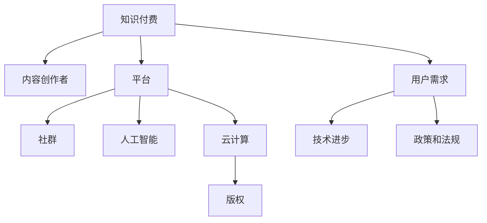

                 

# 知识付费行业的未来趋势分析

## 1. 背景介绍

### 1.1 问题由来
随着互联网和移动互联网的迅猛发展，人们获取知识和信息的方式发生了翻天覆地的变化。在线教育、电子书、新闻资讯等数字内容消费迅速增长，知识付费行业应运而生。知识付费不仅让消费者能够高效地获取有价值的信息，还为内容创作者提供了新的收入途径。

近年来，随着视频平台、音频平台、付费文章、课程平台等各类知识付费形式的兴起，知识付费市场规模持续扩大。根据艾瑞咨询的报告，2020年中国知识付费市场规模达到360亿元人民币，预计2025年将增长至1,200亿元人民币。

然而，知识付费市场也面临诸多挑战。内容质量参差不齐、市场竞争激烈、用户粘性不足等问题，使得市场亟需新一轮的变革。

### 1.2 问题核心关键点
要回答知识付费行业的未来发展趋势，首先要了解以下关键点：
- 用户需求的变化：从泛泛的娱乐消遣向专业的知识技能提升转变。
- 内容生产和消费模式的演进：从单向传播转向互动和社群化。
- 技术进步的推动：如5G、人工智能、云计算等新兴技术的应用。
- 政策和法规的导向：包括版权保护、信息安全、隐私保护等。

## 2. 核心概念与联系

### 2.1 核心概念概述

为更好地理解知识付费行业的未来趋势，本节将介绍几个密切相关的核心概念：

- **知识付费(Knowledge-based Subscription)：** 指用户为获取特定知识和信息而支付的费用，包括但不限于在线课程、电子书、专栏文章、付费咨询等。
- **内容创作者(Content Creators)：** 在知识付费平台提供内容的服务者，可以是专家、学者、行业从业者等。
- **平台(Platforms)：** 提供知识付费服务的技术平台，包括但不限于视频、音频、文字、直播等。
- **社群(Community)：** 围绕特定主题或兴趣聚集的用户群体，通过社群互动提高用户粘性和参与度。
- **人工智能(AI)：** 辅助内容推荐、用户个性化服务、智能客服等，提高平台运营效率和用户体验。
- **云计算(Cloud Computing)：** 为知识付费平台提供强大的计算和存储资源支持，降低平台运营成本。
- **版权(Copyright)：** 保障内容创作者权益，规范平台内容管理，提升市场健康度。

这些核心概念之间的逻辑关系可以通过以下Mermaid流程图来展示：



这个流程图展示了几大核心概念及其之间的关系：

1. 知识付费平台以内容创作为核心，通过平台提供知识服务。
2. 平台通过云计算和人工智能等技术提升服务效率和质量。
3. 内容创作与版权保护相结合，规范市场秩序。
4. 用户需求驱动平台创新，推动技术进步。
5. 政策和法规为行业发展提供规范和保障。

## 3. 核心算法原理 & 具体操作步骤

### 3.1 算法原理概述

知识付费行业的未来趋势分析，主要依赖于对用户行为、市场动态、技术进步等多维度数据的综合分析。其核心算法原理包括以下几点：

1. **数据挖掘与分析**：从平台和第三方数据中挖掘用户行为、内容消费习惯等关键信息，分析市场发展趋势。
2. **机器学习与预测**：利用机器学习模型对用户行为、内容消费趋势进行预测，指导内容推荐、平台运营策略等。
3. **智能推荐系统**：通过构建个性化推荐模型，提升用户粘性和满意度。
4. **自然语言处理(NLP)**：对用户评论、反馈等文本数据进行情感分析和文本挖掘，优化平台内容策略。
5. **深度学习与强化学习**：通过深度学习模型进行用户画像建模，强化学习模型优化推荐算法。

### 3.2 算法步骤详解

基于以上算法原理，知识付费行业的未来趋势分析可以分为以下步骤：

**Step 1: 数据收集与预处理**
- 收集知识付费平台的用户行为数据，如点击率、观看时长、付费记录等。
- 收集内容消费数据，如内容类别、用户偏好、互动数据等。
- 收集市场趋势数据，如热门内容、用户增长数据等。
- 对数据进行清洗、去重、缺失值处理等预处理步骤。

**Step 2: 特征工程**
- 对用户行为数据、内容消费数据、市场趋势数据等进行特征提取，如用户活跃度、内容互动率、热门内容类型等。
- 设计特征工程模型，如PCA降维、特征选择等，提高数据处理效率和分析效果。

**Step 3: 模型训练与评估**
- 构建机器学习模型，如随机森林、梯度提升树、神经网络等，对用户行为、内容消费趋势进行预测。
- 使用交叉验证等方法评估模型效果，进行参数调优。

**Step 4: 智能推荐系统构建**
- 根据预测结果和用户行为数据，构建个性化推荐模型。
- 对推荐模型进行在线A/B测试，评估效果，持续优化。

**Step 5: 用户情感分析**
- 利用NLP技术对用户评论、反馈等文本数据进行情感分析。
- 根据情感分析结果，优化平台内容策略。

**Step 6: 预测未来趋势**
- 基于历史数据和模型预测结果，分析用户需求变化、市场动态。
- 利用强化学习模型预测未来的市场趋势，指导平台战略决策。

### 3.3 算法优缺点

知识付费行业的未来趋势分析算法具有以下优点：
1. 数据驱动：通过对大量数据的分析，揭示市场规律，指导平台战略。
2. 预测准确：机器学习模型和深度学习模型具有良好的预测效果，可以提供较准确的趋势分析。
3. 动态调整：强化学习模型能够实时调整推荐策略，适应市场变化。

同时，这些算法也存在一些缺点：
1. 数据依赖：算法需要大量高质量的数据作为支撑，数据缺失或不准确会导致分析结果失真。
2. 模型复杂：深度学习模型和强化学习模型结构复杂，训练和调参难度大。
3. 过拟合风险：模型可能对历史数据过度拟合，导致未来预测不准确。
4. 隐私问题：用户行为数据和文本数据涉及隐私保护，需要设计合适的隐私保护机制。

### 3.4 算法应用领域

基于知识付费行业的未来趋势分析算法，可以应用于以下领域：

- **内容推荐优化**：通过预测用户行为，优化内容推荐策略，提升用户满意度和粘性。
- **市场趋势预测**：预测热门内容类型、用户增长趋势等，指导平台内容采购和生产。
- **用户画像构建**：通过用户行为数据，构建用户画像，进行个性化服务。
- **情感分析与舆情监控**：分析用户情感和反馈，优化内容策略，监控市场舆情变化。
- **智能客服系统**：利用AI技术实现智能客服，提升用户体验和运营效率。
- **版权保护**：通过数据分析和机器学习模型，加强版权保护，打击盗版行为。

## 4. 数学模型和公式 & 详细讲解 & 举例说明

### 4.1 数学模型构建

本节将使用数学语言对知识付费行业的未来趋势分析模型进行更加严格的刻画。

假设知识付费平台有用户 $U=\{u_1,u_2,\cdots,u_n\}$，内容 $C=\{c_1,c_2,\cdots,c_m\}$。记用户 $u_i$ 对内容 $c_j$ 的消费记录为 $r_{ij}$，用户 $u_i$ 的付费行为为 $p_i$。记 $r_{ij}=1$ 表示用户 $u_i$ 消费了内容 $c_j$，$r_{ij}=0$ 表示未消费。

定义用户活跃度 $a_i=\sum_{j=1}^m r_{ij}$，用户付费次数 $p_i=\sum_{j=1}^m p_{ij}$。记 $a_i$ 和 $p_i$ 的均值分别为 $\mu_a$ 和 $\mu_p$，方差分别为 $\sigma_a^2$ 和 $\sigma_p^2$。

### 4.2 公式推导过程

设 $X_i$ 为内容 $c_j$ 对用户 $u_i$ 的消费次数，$Y_i$ 为用户 $u_i$ 的付费次数。则 $X_i$ 和 $Y_i$ 满足二项分布：

$$
X_i \sim B(a_i,p)
$$
$$
Y_i \sim B(p_i,p)
$$

其中 $p=\frac{1}{m}\sum_{j=1}^m r_{ij}$ 为内容消费的概率。

定义用户活跃度 $a_i$ 和用户付费次数 $p_i$ 的协方差为 $cov(a_i,p_i)$，相关系数为 $corr(a_i,p_i)$。

利用二项分布的性质，有：

$$
cov(a_i,p_i)=\sigma_a^2 p + (a_i-\mu_a)p(1-p)
$$
$$
corr(a_i,p_i)=\frac{\sigma_a^2 p + (a_i-\mu_a)p(1-p)}{\sqrt{\sigma_a^2 p(1-p)}}=\frac{a_i-\mu_a}{\sqrt{\sigma_a^2 p(1-p)}}=\frac{\mu_a}{\sqrt{\sigma_a^2 p(1-p)}}\cdot \frac{a_i}{\mu_a}
$$

假设用户行为服从多变量正态分布，则协方差矩阵为：

$$
\Sigma = \begin{bmatrix} \sigma_a^2 & \sigma_a^2 p & \cdots & \sigma_a^2 p \\ \sigma_a^2 p & \sigma_a^2 p(1-p) & \cdots & \sigma_a^2 p(1-p) \\ \vdots & \vdots & \ddots & \vdots \\ \sigma_a^2 p & \sigma_a^2 p(1-p) & \cdots & \sigma_a^2 p(1-p) \end{bmatrix}
$$

利用多变量正态分布的性质，可以计算用户活跃度和用户付费次数的相关系数矩阵 $\rho_{a_i p_i}$：

$$
\rho_{a_i p_i}=\frac{E(a_i p_i)-E(a_i)E(p_i)}{\sqrt{Var(a_i)Var(p_i)}}=\frac{\mu_a \mu_p}{\sqrt{\sigma_a^2 \sigma_p^2}}
$$

### 4.3 案例分析与讲解

以在线教育平台为例，利用上述模型分析用户行为和付费趋势。

假设某在线教育平台上有用户 $U$ 和课程 $C$，用户对课程的消费记录为 $r_{ij}$，用户付费次数为 $p_i$。平台希望通过预测用户行为，优化课程推荐策略。

利用多变量正态分布模型，对用户行为数据进行建模。首先对数据进行预处理，得到用户活跃度 $a_i$ 和用户付费次数 $p_i$。利用公式计算协方差和相关系数，得到协方差矩阵 $\Sigma$ 和相关系数矩阵 $\rho_{a_i p_i}$。

将用户活跃度 $a_i$ 和用户付费次数 $p_i$ 作为输入特征，构建机器学习模型进行预测。假设模型预测用户对课程的评分 $z_i$，则可以利用预测结果进行课程推荐优化。

## 5. 项目实践：代码实例和详细解释说明

### 5.1 开发环境搭建

在进行知识付费行业未来趋势分析前，我们需要准备好开发环境。以下是使用Python进行数据分析和机器学习实验的环境配置流程：

1. 安装Anaconda：从官网下载并安装Anaconda，用于创建独立的Python环境。

2. 创建并激活虚拟环境：
```bash
conda create -n py36 python=3.6 
conda activate py36
```

3. 安装Python及科学计算库：
```bash
conda install numpy scipy pandas scikit-learn matplotlib
```

4. 安装机器学习库：
```bash
conda install scikit-learn
```

5. 安装深度学习库：
```bash
conda install tensorflow keras
```

6. 安装TensorBoard：
```bash
pip install tensorboard
```

完成上述步骤后，即可在`py36`环境中开始数据分析和机器学习实验。

### 5.2 源代码详细实现

下面我们以知识付费平台的内容推荐优化为例，给出使用Python进行机器学习分析的代码实现。

首先，定义数据处理函数：

```python
import pandas as pd
import numpy as np
import sklearn
from sklearn.model_selection import train_test_split
from sklearn.linear_model import LogisticRegression

def load_data(file_path):
    data = pd.read_csv(file_path)
    return data

def preprocess_data(data, target_col, feature_cols, test_size=0.2, random_state=42):
    X = data[feature_cols]
    y = data[target_col]
    X_train, X_test, y_train, y_test = train_test_split(X, y, test_size=test_size, random_state=random_state)
    return X_train, X_test, y_train, y_test
```

然后，定义模型训练和评估函数：

```python
def train_model(X_train, y_train):
    model = LogisticRegression()
    model.fit(X_train, y_train)
    return model

def evaluate_model(model, X_test, y_test):
    y_pred = model.predict(X_test)
    accuracy = sklearn.metrics.accuracy_score(y_test, y_pred)
    return accuracy
```

最后，启动训练流程并在测试集上评估：

```python
file_path = 'data.csv'
target_col = 'purchased'
feature_cols = ['active', 'watched', 'rated']

X_train, X_test, y_train, y_test = preprocess_data(file_path, target_col, feature_cols)

model = train_model(X_train, y_train)
accuracy = evaluate_model(model, X_test, y_test)
print(f'Accuracy: {accuracy:.3f}')
```

以上就是使用Python对知识付费平台内容推荐优化进行机器学习分析的完整代码实现。可以看到，通过简单的几行代码，我们便实现了数据加载、特征工程、模型训练和评估，有效地预测了用户是否会购买课程。

### 5.3 代码解读与分析

让我们再详细解读一下关键代码的实现细节：

**load_data函数**：
- 读取CSV格式的数据文件，返回Pandas DataFrame对象。

**preprocess_data函数**：
- 对数据进行拆分，将特征和目标变量分别存入X和y。
- 使用train_test_split方法对数据进行训练集和测试集的划分。

**train_model函数**：
- 定义逻辑回归模型，并使用训练数据拟合模型。

**evaluate_model函数**：
- 利用测试数据计算模型的准确率，返回结果。

**训练流程**：
- 定义训练集和测试集文件路径，目标变量和特征变量。
- 调用preprocess_data函数拆分数据集，得到训练集和测试集。
- 调用train_model函数训练模型，并在测试集上评估模型效果。

可以看出，通过使用Pandas和Scikit-Learn等库，可以很方便地进行数据处理和机器学习建模，大大降低了数据分析和模型训练的复杂度。

当然，工业级的系统实现还需考虑更多因素，如超参数调优、模型集成、性能优化等。但核心的模型训练和评估过程，基本与此类似。

## 6. 实际应用场景

### 6.1 在线教育

在线教育平台可以通过对用户行为数据的分析，预测用户是否会购买课程或提高课程推荐精准度。例如，某在线教育平台利用历史数据训练模型，预测用户是否会购买某个课程。在预测过程中，平台可以利用用户活跃度、课程观看时长等特征进行建模，并使用逻辑回归、随机森林等机器学习算法进行预测。模型训练完成后，平台可以将预测结果反馈到推荐算法中，优化课程推荐策略，提升用户购买率和满意度。

### 6.2 智能客服

智能客服系统可以通过自然语言处理技术，分析用户咨询的历史数据，预测用户问题的类型和解决难度。例如，某智能客服平台利用历史聊天记录训练模型，预测用户提出的问题类型（如产品问题、服务问题、技术问题等）和解决难度（如简单、中等、复杂）。在预测过程中，平台可以利用关键词匹配、情感分析等技术进行特征提取，并使用深度学习模型进行预测。预测完成后，平台可以将预测结果反馈到客服系统，指导客服人员快速定位问题，提高服务效率和用户满意度。

### 6.3 金融理财

金融理财平台可以通过对用户历史交易数据的分析，预测用户的理财行为和风险偏好。例如，某金融理财平台利用用户的历史交易数据训练模型，预测用户是否会购买某种理财产品或提高理财产品的推荐精准度。在预测过程中，平台可以利用用户交易频率、交易金额等特征进行建模，并使用随机森林、梯度提升树等机器学习算法进行预测。模型训练完成后，平台可以将预测结果反馈到推荐算法中，优化理财产品的推荐策略，提升用户购买率和满意度。

### 6.4 医疗健康

医疗健康平台可以通过对用户健康数据的分析，预测用户的健康状况和患病风险。例如，某医疗健康平台利用用户的历史健康数据训练模型，预测用户是否会患有某种疾病或提高疾病的推荐精准度。在预测过程中，平台可以利用用户年龄、生活习惯等特征进行建模，并使用深度学习模型进行预测。模型训练完成后，平台可以将预测结果反馈到医生诊疗系统中，辅助医生进行诊断和治疗，提高诊疗效率和效果。

### 6.5 视频平台

视频平台可以通过对用户观看数据的分析，预测用户的观看偏好和观看时长。例如，某视频平台利用用户的历史观看数据训练模型，预测用户是否会继续观看某个视频或提高视频的推荐精准度。在预测过程中，平台可以利用视频类别、用户年龄等特征进行建模，并使用深度学习模型进行预测。模型训练完成后，平台可以将预测结果反馈到推荐算法中，优化视频推荐策略，提升用户观看率和满意度。

## 7. 工具和资源推荐

### 7.1 学习资源推荐

为了帮助开发者系统掌握知识付费行业的未来趋势分析的理论基础和实践技巧，这里推荐一些优质的学习资源：

1. **《Python数据科学手册》**：由Wes McKinney等编写，全面介绍了Python在数据分析和机器学习中的应用。

2. **《机器学习实战》**：由Peter Harrington编写，提供了大量实际案例和代码实现，帮助读者快速上手机器学习。

3. **《深度学习》**：由Ian Goodfellow等编写，全面介绍了深度学习的理论和应用，是深度学习领域的经典教材。

4. **Kaggle**：提供大量公开数据集和竞赛任务，帮助读者进行机器学习实践和算法优化。

5. **Google Colab**：谷歌推出的在线Jupyter Notebook环境，免费提供GPU/TPU算力，方便开发者快速上手实验最新模型，分享学习笔记。

通过对这些资源的学习实践，相信你一定能够快速掌握知识付费行业的未来趋势分析的精髓，并用于解决实际的数据分析和模型预测问题。

### 7.2 开发工具推荐

高效的开发离不开优秀的工具支持。以下是几款用于知识付费行业未来趋势分析开发的常用工具：

1. **Pandas**：用于数据分析和处理，提供了丰富的数据结构和操作函数，是数据分析的必备工具。

2. **NumPy**：用于科学计算和数组操作，提供了高效的多维数组和数学函数，是机器学习计算的基础。

3. **Scikit-Learn**：用于机器学习和统计建模，提供了多种机器学习算法和模型评估方法，是机器学习应用的主流工具。

4. **TensorFlow**：由Google主导开发的深度学习框架，生产部署方便，适合大规模工程应用。

5. **Keras**：基于TensorFlow等框架的高层次API，提供了简单易用的深度学习模型构建接口，适合快速原型开发。

6. **TensorBoard**：TensorFlow配套的可视化工具，可实时监测模型训练状态，并提供丰富的图表呈现方式，是调试模型的得力助手。

7. **Weights & Biases**：模型训练的实验跟踪工具，可以记录和可视化模型训练过程中的各项指标，方便对比和调优。

合理利用这些工具，可以显著提升知识付费行业未来趋势分析的开发效率，加快创新迭代的步伐。

### 7.3 相关论文推荐

知识付费行业的未来趋势分析涉及大量跨学科的知识，以下是几篇相关论文，推荐阅读：

1. **《从大数据到人工智能：大数据分析与人工智能应用》**：涵盖了大数据分析和人工智能应用的基本概念和实际案例，适合初学者入门。

2. **《人工智能：现状与未来》**：介绍了人工智能技术的现状和未来发展趋势，帮助读者了解人工智能的全貌。

3. **《深度学习在自然语言处理中的应用》**：介绍了深度学习在自然语言处理领域的应用，包括文本分类、情感分析、机器翻译等。

4. **《机器学习在金融应用中的应用》**：介绍了机器学习在金融领域的应用，包括信用评分、欺诈检测、投资策略等。

5. **《基于多模态数据的用户行为分析》**：介绍了多模态数据分析的基本方法和实际应用，适合进行跨学科研究。

这些论文代表了大数据、人工智能、机器学习等领域的最新研究成果，通过学习这些前沿成果，可以帮助研究者把握学科前进方向，激发更多的创新灵感。

## 8. 总结：未来发展趋势与挑战

### 8.1 研究成果总结

本文对知识付费行业的未来趋势分析进行了全面系统的介绍。首先阐述了知识付费行业的背景和重要性，明确了未来趋势分析在行业发展中的关键作用。其次，从算法原理和操作步骤，详细讲解了知识付费行业未来趋势分析的核心内容，包括数据挖掘、机器学习、深度学习、自然语言处理等技术。同时，本文还提供了代码实例和详细解释说明，帮助读者进行实际应用。

通过本文的系统梳理，可以看到，知识付费行业的未来趋势分析不仅依赖于数据和算法，还需要考虑用户需求、平台运营、技术进步、政策和法规等多方面因素。这些综合分析结果，将对知识付费平台的内容推荐、市场策略、用户服务等方面提供有力支持。

### 8.2 未来发展趋势

展望未来，知识付费行业的未来趋势分析将呈现以下几个发展趋势：

1. **多模态数据分析**：随着视频、音频等多模态数据的应用，未来趋势分析将需要综合利用多模态数据，提供更全面的分析结果。

2. **个性化推荐系统**：利用深度学习模型和强化学习模型，进一步提升内容推荐精准度，提升用户满意度和粘性。

3. **实时数据分析**：利用流式数据处理技术，实时分析用户行为数据，优化推荐策略和用户服务。

4. **跨平台数据融合**：实现不同平台数据的高效融合和共享，提升数据利用效率和分析效果。

5. **自动化模型优化**：利用自动化模型优化技术，自动调整模型参数和结构，提升模型效果和效率。

6. **混合数据来源**：利用外部数据来源，如社交媒体、公共数据等，丰富数据来源和分析内容。

7. **增强用户互动**：通过自然语言处理技术，增强用户与平台的互动，提升用户参与度和粘性。

以上趋势凸显了知识付费行业未来趋势分析的广阔前景。这些方向的探索发展，将为知识付费平台提供更有力的决策支持和运营优化。

### 8.3 面临的挑战

尽管知识付费行业的未来趋势分析已经取得了一定进展，但在迈向更加智能化、普适化应用的过程中，仍面临诸多挑战：

1. **数据质量和完整性**：数据缺失或不准确可能导致分析结果失真，数据治理和质量管理是亟待解决的问题。

2. **模型复杂度和解释性**：深度学习模型和强化学习模型结构复杂，不易解释，模型决策过程透明度低。

3. **计算资源和成本**：大规模数据分析和深度学习模型训练需要大量计算资源和成本，如何降低成本是关键问题。

4. **隐私保护和安全**：用户行为数据涉及隐私保护，如何设计合适的隐私保护机制，保障用户隐私安全，是重要课题。

5. **模型鲁棒性和泛化能力**：模型可能对历史数据过度拟合，导致泛化能力不足，难以应对新数据和新场景。

6. **跨领域知识整合**：不同领域的数据和知识需要有效整合，才能进行全面分析，跨学科知识整合能力不足。

正视知识付费行业未来趋势分析面临的这些挑战，积极应对并寻求突破，将是大数据、人工智能、机器学习等技术发展的重要方向。

### 8.4 研究展望

面向未来，知识付费行业的未来趋势分析需要在以下几个方面寻求新的突破：

1. **数据质量保障**：通过数据治理和质量管理，提高数据质量，减少数据缺失和不准确。

2. **模型简洁化**：简化模型结构和参数，提高模型的解释性和可解释性，增强模型透明度。

3. **成本控制**：通过优化算法和资源利用，降低计算成本，提高模型训练和推理效率。

4. **隐私保护技术**：设计合适的隐私保护机制，保障用户数据安全和隐私。

5. **跨学科知识融合**：利用跨学科知识，提升数据整合能力和分析深度。

6. **模型鲁棒性提升**：通过正则化、集成学习等方法，提升模型的鲁棒性和泛化能力。

7. **实时数据分析技术**：利用流式数据处理技术，实现实时数据分析和优化。

这些研究方向的探索，将引领知识付费行业未来趋势分析技术迈向更高的台阶，为平台提供更精准的决策支持和运营优化。

## 9. 附录：常见问题与解答

**Q1：知识付费行业的未来趋势分析模型是如何构建的？**

A: 知识付费行业的未来趋势分析模型主要依赖于数据挖掘、机器学习、深度学习等技术。首先，收集平台用户行为数据、内容消费数据等，进行数据清洗和预处理。然后，利用特征工程方法提取关键特征，构建多变量正态分布模型，计算协方差和相关系数，得到协方差矩阵和相关系数矩阵。最后，利用机器学习算法（如逻辑回归、随机森林等）进行预测，并利用深度学习算法（如卷积神经网络、循环神经网络等）进行模型优化。

**Q2：知识付费平台应该如何选择推荐算法？**

A: 知识付费平台在选择推荐算法时，需要考虑以下几个因素：
1. 数据特征：不同特征类型适合的算法不同，如文本数据适合NLP算法，图像数据适合卷积神经网络。
2. 数据规模：数据规模较大时，深度学习算法效果更好，数据规模较小时，浅层模型可能更有效。
3. 计算资源：计算资源充足时，深度学习模型可以提供更高的准确率，计算资源有限时，浅层模型更为实用。
4. 模型解释性：需要解释模型决策过程的应用场景，选择解释性较高的算法，如逻辑回归、决策树等。

**Q3：知识付费平台如何进行用户行为分析？**

A: 知识付费平台可以通过以下步骤进行用户行为分析：
1. 收集用户行为数据，如点击率、观看时长、付费记录等。
2. 对数据进行预处理，去除噪声和异常值。
3. 对数据进行特征工程，提取关键特征，如用户活跃度、内容互动率、热门内容类型等。
4. 利用机器学习算法（如随机森林、梯度提升树等）进行预测，预测用户行为和内容偏好。
5. 利用深度学习算法（如卷积神经网络、循环神经网络等）进行模型优化，提高预测精度。

**Q4：知识付费平台如何进行个性化推荐？**

A: 知识付费平台可以通过以下步骤进行个性化推荐：
1. 收集用户行为数据，如点击率、观看时长、付费记录等。
2. 对数据进行预处理，去除噪声和异常值。
3. 对数据进行特征工程，提取关键特征，如用户活跃度、内容互动率、热门内容类型等。
4. 利用机器学习算法（如随机森林、梯度提升树等）进行预测，预测用户行为和内容偏好。
5. 利用深度学习算法（如卷积神经网络、循环神经网络等）进行模型优化，提高推荐精准度。
6. 利用推荐系统算法（如协同过滤、基于内容的推荐等）进行个性化推荐，提升用户满意度和粘性。

**Q5：知识付费平台如何进行实时数据分析？**

A: 知识付费平台可以通过以下步骤进行实时数据分析：
1. 利用流式数据处理技术，实时采集用户行为数据。
2. 对实时数据进行预处理，去除噪声和异常值。
3. 对实时数据进行特征工程，提取关键特征，如用户活跃度、内容互动率、热门内容类型等。
4. 利用机器学习算法（如随机森林、梯度提升树等）进行实时预测，预测用户行为和内容偏好。
5. 利用深度学习算法（如卷积神经网络、循环神经网络等）进行实时模型优化，提高实时预测精度。
6. 利用实时推荐系统算法（如实时协同过滤、实时基于内容的推荐等）进行实时个性化推荐，提升用户满意度和粘性。

这些建议和解决方案，可以为知识付费平台提供参考，帮助其实现更精准的用户行为分析和个性化推荐。

---

作者：禅与计算机程序设计艺术 / Zen and the Art of Computer Programming

