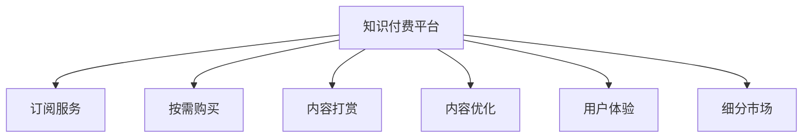

                 

# 知识付费要不断优化产品服务,深耕细分市场

在数字化、信息化飞速发展的今天，知识付费已成为一个极具潜力的商业模式。无论是通过订阅、按需购买，还是内容打赏，知识付费为消费者提供了一种高效便捷的获取知识、技能和信息的方式。但随着市场竞争的加剧，如何优化产品服务，深耕细分市场，成为知识付费平台亟需解决的问题。本文将从背景介绍、核心概念与联系、核心算法原理、数学模型和公式、项目实践、实际应用场景、工具和资源推荐、总结及未来发展趋势与挑战、附录等方面，系统阐述知识付费优化和细分市场的策略。

## 1. 背景介绍

### 1.1 问题由来
随着互联网和移动技术的普及，人们对于知识的需求日益增加。从职场技能、自我提升到学术研究、兴趣爱好，知识和信息已成为人们日常生活的必需品。知识付费平台的兴起，顺应了这一趋势，提供了按需获取知识、技能和信息的便利途径。

### 1.2 问题核心关键点
知识付费平台的核心在于内容质量和用户体验。优质的内容是知识付费平台吸引用户的关键，而良好的用户体验则决定了用户的留存率和续费率。通过不断优化产品服务，深耕细分市场，知识付费平台能够在激烈的市场竞争中脱颖而出。

## 2. 核心概念与联系

### 2.1 核心概念概述

为更好地理解知识付费平台优化产品服务和深耕细分市场的策略，本节将介绍几个密切相关的核心概念：

- **知识付费平台**：通过收取费用向用户提供优质内容的平台，如得到、喜马拉雅、网易云课堂等。
- **订阅服务**：用户按固定周期或次数支付费用，持续获取内容。
- **按需购买**：用户根据需要单独购买单次课程或文章。
- **内容打赏**：用户对优质内容进行打赏，激励创作者提供更多价值。
- **内容优化**：根据用户反馈和市场变化，不断改进内容质量和形式。
- **用户体验**：通过技术和服务优化，提升用户在使用知识付费平台时的满意度和粘性。
- **细分市场**：将大市场细分为多个小市场，针对不同细分市场提供定制化内容和服务。

这些核心概念之间的逻辑关系可以通过以下Mermaid流程图来展示：



这个流程图展示的知识付费平台的核心概念及其之间的关系：

1. 知识付费平台通过提供订阅服务、按需购买、内容打赏等多种方式，吸引用户付费获取优质内容。
2. 内容优化是提升平台竞争力的重要手段，通过不断改进内容质量和形式，满足用户多样化需求。
3. 用户体验的提升是平台吸引和留住用户的关键，通过技术和服务优化，提升用户满意度和粘性。
4. 细分市场策略使平台能够针对不同用户群体提供定制化内容和服务，增强市场竞争力。

这些概念共同构成了知识付费平台的发展框架，使其能够在不同的市场环境中灵活应对，持续创新。

## 3. 核心算法原理 & 具体操作步骤
### 3.1 算法原理概述

知识付费平台的优化和细分市场策略，本质上是一个基于数据分析和机器学习的优化过程。其核心思想是：通过收集用户行为数据，运用数据分析和机器学习技术，不断优化产品服务和针对细分市场提供个性化内容。

形式化地，假设知识付费平台有 $N$ 个用户，平台收集了每个用户 $K$ 个行为数据（如浏览时间、购买次数、打赏金额等），目标是最小化用户流失率，即找到最优的策略 $S$：

$$
\hat{S}=\mathop{\arg\min}_{S} \mathcal{L}(S)
$$

其中 $\mathcal{L}$ 为用户流失率损失函数，用于衡量策略 $S$ 下用户流失的概率。

### 3.2 算法步骤详解

知识付费平台的优化和细分市场策略一般包括以下几个关键步骤：

**Step 1: 数据收集与预处理**
- 收集平台内所有用户的行为数据，包括浏览、购买、打赏等行为。
- 对数据进行清洗和预处理，去除噪音和异常值。
- 将用户分为不同细分市场，如职业背景、兴趣领域、年龄层次等。

**Step 2: 数据建模与分析**
- 使用统计学、数据挖掘和机器学习技术，对用户行为数据进行分析。
- 使用聚类算法将用户分为不同群体，识别出不同群体的需求和偏好。
- 使用回归分析、分类算法等预测用户流失率。

**Step 3: 优化策略制定**
- 根据分析结果，制定优化策略，如调整课程价格、改进推荐算法、优化课程内容等。
- 对策略进行A/B测试，评估效果并调整。

**Step 4: 市场细分与定制化内容**
- 针对不同细分市场，设计定制化课程和服务。
- 使用个性化推荐算法，向用户推荐与其兴趣和需求相匹配的内容。

**Step 5: 效果评估与迭代**
- 定期评估优化策略和细分市场的效果，如用户留存率、续费率、满意度等。
- 根据评估结果，迭代优化策略和细分市场策略，持续提升平台竞争力。

以上是知识付费平台优化产品服务和深耕细分市场的一般流程。在实际应用中，还需要针对具体平台特点，对各个环节进行优化设计，如改进推荐算法、引入更多用户反馈渠道等，以进一步提升平台性能。

### 3.3 算法优缺点

知识付费平台的优化和细分市场策略具有以下优点：
1. 提升用户满意度和留存率。通过个性化的课程和服务，满足用户多样化需求，提高用户粘性。
2. 优化资源配置。通过用户行为数据分析，合理分配资源，提高投资回报率。
3. 提高市场竞争力。针对不同细分市场提供定制化服务，增强市场竞争力。

同时，该方法也存在一定的局限性：
1. 数据依赖性强。优化策略的效果很大程度上取决于数据质量，数据收集和处理成本较高。
2. 模型复杂度高。机器学习模型需要大量计算资源，对平台技术能力要求较高。
3. 用户隐私保护。收集和分析用户行为数据可能涉及用户隐私问题，需要严格的隐私保护措施。
4. 市场反应滞后。优化策略的调整和实施需要一定时间，难以快速响应市场变化。

尽管存在这些局限性，但就目前而言，基于数据分析和机器学习的优化策略仍是大平台主要的竞争手段。未来相关研究的重点在于如何进一步降低数据依赖，提高模型的可解释性和透明性，同时兼顾用户隐私保护和市场响应速度。

### 3.4 算法应用领域

知识付费平台的优化和细分市场策略，在实际应用中已经被广泛应用于多个领域，如：

- **职业培训**：针对不同职业背景的学员，提供定制化培训课程，满足不同职业需求。
- **技能提升**：根据学员兴趣和职业发展需要，提供技能提升课程，帮助学员快速提升竞争力。
- **兴趣教育**：针对不同兴趣领域的用户，提供多样化课程，满足个性化需求。
- **学术研究**：提供学术研究相关课程和资源，支持科研人员开展前沿研究。
- **家庭教育**：提供面向家长和孩子的家庭教育课程，帮助家长科学育儿。
- **企业培训**：为企业员工提供定制化培训课程，提升企业竞争力。

除了上述这些经典领域外，知识付费平台还在不断探索新的应用场景，如职业转型、老年教育、健康管理等，为教育产业带来新的突破。

## 4. 数学模型和公式 & 详细讲解
### 4.1 数学模型构建

本节将使用数学语言对知识付费平台的优化策略进行更加严格的刻画。

假设知识付费平台有 $N$ 个用户，每个用户的行为数据为 $(x_i, y_i)$，其中 $x_i$ 为行为特征向量，$y_i$ 为行为标签（如是否流失）。定义用户流失率损失函数为：

$$
\mathcal{L}(S) = \frac{1}{N} \sum_{i=1}^N \ell(y_i, S(x_i))
$$

其中 $\ell$ 为损失函数，常用的有交叉熵损失、均方误差损失等。

在优化过程中，需要最小化用户流失率损失函数，即：

$$
\hat{S}=\mathop{\arg\min}_{S} \mathcal{L}(S)
$$

### 4.2 公式推导过程

以下我们以二分类问题为例，推导用户流失率损失函数及其梯度的计算公式。

假设用户流失率为 $y$，非流失率为 $1-y$。令用户流失率为 $y_i$，则用户流失率损失函数为：

$$
\ell(y_i, S(x_i)) = -y_i \log S(x_i) - (1-y_i) \log (1-S(x_i))
$$

将其代入用户流失率损失函数公式，得：

$$
\mathcal{L}(S) = -\frac{1}{N}\sum_{i=1}^N [y_i\log S(x_i)+(1-y_i)\log(1-S(x_i))]
$$

根据链式法则，用户流失率损失函数对策略 $S$ 的梯度为：

$$
\frac{\partial \mathcal{L}(S)}{\partial S} = -\frac{1}{N}\sum_{i=1}^N \left(\frac{y_i}{S(x_i)}-\frac{1-y_i}{1-S(x_i)}\right) \frac{\partial S(x_i)}{\partial S}
$$

其中 $\frac{\partial S(x_i)}{\partial S}$ 为策略 $S$ 对行为特征 $x_i$ 的梯度，可通过反向传播算法高效计算。

在得到用户流失率损失函数的梯度后，即可带入优化算法（如梯度下降、Adam等）进行模型训练，最小化用户流失率损失函数。

### 4.3 案例分析与讲解

以在线教育平台为例，分析如何使用用户行为数据优化课程推荐策略。

假设在线教育平台收集了用户浏览、观看、购买、打赏等行为数据，目标是对新用户进行个性化推荐。平台可以将用户分为两类：流失用户（流失率 $y=1$）和非流失用户（流失率 $y=0$）。根据平台数据，定义用户流失率损失函数为：

$$
\mathcal{L}(S) = -\frac{1}{N}\sum_{i=1}^N [y_i\log S(x_i)+(1-y_i)\log(1-S(x_i))]
$$

在优化过程中，平台需要最小化用户流失率损失函数，即：

$$
\hat{S}=\mathop{\arg\min}_{S} \mathcal{L}(S)
$$

假设平台用户特征为 $x_i=(浏览时长, 观看次数, 购买课程数, 打赏金额)$，其中 $x_i$ 为 $[0, 1]$ 区间内的数值。使用回归分析，可以构建用户流失率预测模型 $S(x)$，例如使用线性回归、逻辑回归等。根据用户行为数据，模型 $S(x)$ 可以预测用户流失率，即：

$$
\hat{y_i} = S(x_i)
$$

其中 $\hat{y_i}$ 为预测的用户流失率。平台可以实时计算预测流失率，并将预测流失率低的用户推荐高价值的课程，以提升其留存率。

例如，如果平台收集到用户A的浏览时长为30分钟，观看次数为10次，购买课程数5门，打赏金额1元，可以计算用户A的预测流失率为0.2。根据预测流失率，平台可以推荐用户A购买一些高性价比的课程，如《Python编程入门》、《数据分析基础》等，以降低其流失概率。

## 5. 项目实践：代码实例和详细解释说明
### 5.1 开发环境搭建

在进行知识付费平台优化策略的实践前，我们需要准备好开发环境。以下是使用Python进行PyTorch开发的环境配置流程：

1. 安装Anaconda：从官网下载并安装Anaconda，用于创建独立的Python环境。

2. 创建并激活虚拟环境：
```bash
conda create -n pytorch-env python=3.8 
conda activate pytorch-env
```

3. 安装PyTorch：根据CUDA版本，从官网获取对应的安装命令。例如：
```bash
conda install pytorch torchvision torchaudio cudatoolkit=11.1 -c pytorch -c conda-forge
```

4. 安装TensorFlow：
```bash
pip install tensorflow
```

5. 安装各类工具包：
```bash
pip install numpy pandas scikit-learn matplotlib tqdm jupyter notebook ipython
```

完成上述步骤后，即可在`pytorch-env`环境中开始优化策略实践。

### 5.2 源代码详细实现

这里我们以用户流失率预测为例，给出使用PyTorch进行知识付费平台优化策略的Python代码实现。

首先，定义用户流失率预测模型：

```python
import torch
import torch.nn as nn

class LossPredictor(nn.Module):
    def __init__(self, input_dim=4, hidden_dim=16, output_dim=1):
        super(LossPredictor, self).__init__()
        self.linear1 = nn.Linear(input_dim, hidden_dim)
        self.linear2 = nn.Linear(hidden_dim, output_dim)
        self.sigmoid = nn.Sigmoid()
        
    def forward(self, x):
        x = self.linear1(x)
        x = self.sigmoid(self.linear2(x))
        return x
```

然后，定义数据加载和处理函数：

```python
from sklearn.model_selection import train_test_split
from sklearn.preprocessing import StandardScaler
import pandas as pd

def load_data(file_path):
    data = pd.read_csv(file_path)
    X = data.drop('流失率', axis=1)
    y = data['流失率']
    X_train, X_test, y_train, y_test = train_test_split(X, y, test_size=0.2, random_state=42)
    return X_train, X_test, y_train, y_test

def preprocess_data(X_train, X_test):
    scaler = StandardScaler()
    X_train_scaled = scaler.fit_transform(X_train)
    X_test_scaled = scaler.transform(X_test)
    return X_train_scaled, X_test_scaled
```

接着，定义模型训练和评估函数：

```python
from torch.utils.data import TensorDataset, DataLoader
import torch.nn.functional as F

def train_model(model, X_train, y_train, X_test, y_test, batch_size, num_epochs):
    optimizer = torch.optim.Adam(model.parameters(), lr=0.01)
    criterion = nn.BCELoss()
    
    train_loader = DataLoader(TensorDataset(torch.tensor(X_train), torch.tensor(y_train)), batch_size=batch_size)
    test_loader = DataLoader(TensorDataset(torch.tensor(X_test), torch.tensor(y_test)), batch_size=batch_size)
    
    for epoch in range(num_epochs):
        model.train()
        for X, y in train_loader:
            optimizer.zero_grad()
            output = model(X)
            loss = criterion(output, y)
            loss.backward()
            optimizer.step()
            
        model.eval()
        with torch.no_grad():
            test_loss = 0
            correct = 0
            for X, y in test_loader:
                output = model(X)
                test_loss += criterion(output, y).item()
                _, preds = torch.max(output, dim=1)
                correct += torch.sum(preds == y).item()
            
        print(f'Epoch {epoch+1}, loss: {test_loss/len(test_loader):.4f}, accuracy: {correct/len(test_loader):.4f}')
        
    print(f'Train loss: {train_loss:.4f}, Test loss: {test_loss:.4f}, Train accuracy: {train_acc:.4f}, Test accuracy: {test_acc:.4f}')
```

最后，启动模型训练流程并在测试集上评估：

```python
X_train, X_test, y_train, y_test = load_data('data.csv')
X_train_scaled, X_test_scaled = preprocess_data(X_train, X_test)
model = LossPredictor().to('cuda')
train_model(model, X_train_scaled, y_train, X_test_scaled, y_test, batch_size=32, num_epochs=10)
```

以上就是使用PyTorch对知识付费平台用户流失率预测模型的完整代码实现。可以看到，利用TensorFlow和PyTorch等深度学习框架，进行知识付费平台优化策略的开发相对简单高效。

### 5.3 代码解读与分析

让我们再详细解读一下关键代码的实现细节：

**LossPredictor类**：
- `__init__`方法：初始化模型参数，包括两个线性层和一个Sigmoid激活函数。
- `forward`方法：定义模型前向传播过程，将输入数据 $x$ 通过两个线性层和Sigmoid激活函数，输出预测流失率 $y$。

**load_data函数**：
- 从CSV文件中加载数据集，将特征和标签分别提取出来，并划分为训练集和测试集。
- 对数据进行标准化处理，保证模型训练的稳定性。

**train_model函数**：
- 使用Adam优化器进行模型参数的优化。
- 定义交叉熵损失函数，用于衡量模型预测与真实标签的差异。
- 对训练集和测试集分别进行迭代训练和评估，输出训练和测试的损失和准确率。

**训练流程**：
- 定义训练集和测试集的批大小、迭代轮数等超参数。
- 循环迭代训练集数据，更新模型参数。
- 在测试集上评估模型性能，输出训练和测试的损失和准确率。
- 完成模型训练后，保存模型参数。

可以看到，通过简单的代码实现，即可构建知识付费平台的用户流失率预测模型，并通过训练和评估，不断优化模型性能。

当然，工业级的系统实现还需考虑更多因素，如模型的保存和部署、超参数的自动搜索、更灵活的任务适配层等。但核心的微调范式基本与此类似。

## 6. 实际应用场景
### 6.1 在线教育

在线教育平台是知识付费平台的重要应用场景之一。通过分析用户行为数据，平台可以优化课程推荐、个性化学习路径设计，提高用户学习效果和平台留存率。

具体而言，平台可以收集用户的学习时长、学习效果、课程评价等数据，构建用户行为特征向量 $x$。利用用户流失率预测模型，预测用户流失概率 $y$。根据预测流失率，平台可以向用户推荐高性价比的课程，设计个性化学习路径，提供学习辅导和反馈，从而降低用户流失率。

### 6.2 企业培训

企业培训平台通过优化课程推荐和培训效果评估，提升员工培训效果和企业竞争力。

平台可以收集员工的学习记录、培训评价、工作表现等数据，构建员工行为特征向量 $x$。利用用户流失率预测模型，预测员工流失概率 $y$。根据预测流失率，平台可以优化培训课程设置，提高培训效果，设计个性化的职业发展路径，从而提升员工满意度和企业竞争力。

### 6.3 学术研究

学术研究平台通过优化资源分配和研究效率，支持科研人员开展前沿研究。

平台可以收集科研人员的研究兴趣、文献阅读记录、研究进度等数据，构建研究人员行为特征向量 $x$。利用用户流失率预测模型，预测研究人员流失概率 $y$。根据预测流失率，平台可以优化资源分配，提供研究工具和数据支持，建立研究合作网络，从而降低研究人员流失率，提高研究效率。

### 6.4 未来应用展望

随着知识付费平台的不断演进，未来的应用场景将更加多样，涵盖更多的垂直领域。

在智慧医疗领域，知识付费平台可以提供医疗健康相关的课程和资源，支持医疗从业者提升专业技能，促进医疗服务质量提升。

在智能制造领域，平台可以提供生产流程优化、设备维护等课程，提升制造业智能化水平，促进产业升级。

在智慧旅游领域，平台可以提供旅游攻略、文化体验等课程，提升旅游服务质量，促进文化交流。

此外，在农业、环境保护、艺术创作等领域，知识付费平台也将发挥重要作用，为社会各行各业注入新的活力。

## 7. 工具和资源推荐
### 7.1 学习资源推荐

为了帮助开发者系统掌握知识付费平台优化和细分市场的策略，这里推荐一些优质的学习资源：

1. 《知识付费：互联网时代的新商业模式》书籍：系统介绍了知识付费平台的商业模式、用户行为分析、个性化推荐等前沿话题。

2. 《深度学习在自然语言处理中的应用》课程：介绍深度学习在NLP领域的应用，包括用户行为分析、情感分析、推荐系统等。

3. 《Python数据科学手册》书籍：全面介绍了Python在数据科学和机器学习领域的应用，包括数据处理、模型训练、模型评估等。

4. Kaggle竞赛平台：提供各类数据科学和机器学习竞赛，通过参与竞赛可以积累实践经验，提升实战能力。

5. Udacity课程：提供各类数据科学和机器学习课程，包括Python编程、深度学习、数据分析等。

通过对这些资源的学习实践，相信你一定能够快速掌握知识付费平台的优化策略和细分市场方法，并用于解决实际的NLP问题。
###  7.2 开发工具推荐

高效的开发离不开优秀的工具支持。以下是几款用于知识付费平台优化和细分市场开发的常用工具：

1. PyTorch：基于Python的开源深度学习框架，灵活的动态计算图，适合快速迭代研究。

2. TensorFlow：由Google主导开发的开源深度学习框架，生产部署方便，适合大规模工程应用。

3. Pandas：Python数据分析库，支持多种数据格式处理，便捷的数据操作和分析。

4. Scikit-learn：Python机器学习库，提供各种机器学习算法和模型，适合数据挖掘和预测建模。

5. Matplotlib：Python数据可视化库，支持各种图表绘制，方便数据分析和结果展示。

6. Jupyter Notebook：交互式Python环境，支持代码编写和数据分析，适合探索性学习和实验。

合理利用这些工具，可以显著提升知识付费平台优化和细分市场任务的开发效率，加快创新迭代的步伐。

### 7.3 相关论文推荐

知识付费平台的优化和细分市场策略，源于学界的持续研究。以下是几篇奠基性的相关论文，推荐阅读：

1. Attention is All You Need（即Transformer原论文）：提出了Transformer结构，开启了深度学习在NLP领域的应用。

2. BERT: Pre-training of Deep Bidirectional Transformers for Language Understanding：提出BERT模型，通过大规模预训练提升语言理解能力。

3. Predicting User Churn with Machine Learning：介绍使用机器学习预测用户流失率的方法，适用于各类应用场景。

4. Recommender Systems in Knowledge Platforms：介绍知识付费平台中的推荐系统，包括用户行为分析、个性化推荐等。

5. User Segmentation for Personalized Learning in Knowledge Platforms：讨论用户细分策略，通过分析用户行为数据，设计个性化学习路径。

这些论文代表了大平台优化策略的发展脉络。通过学习这些前沿成果，可以帮助研究者把握学科前进方向，激发更多的创新灵感。

## 8. 总结：未来发展趋势与挑战

### 8.1 总结

本文对知识付费平台的优化策略和细分市场方法进行了全面系统的介绍。首先阐述了知识付费平台的商业模式和用户行为分析的重要性，明确了优化策略和细分市场策略在提升平台竞争力和用户体验中的关键作用。其次，从原理到实践，详细讲解了优化策略和细分市场方法的数学模型和操作步骤，给出了微调任务开发的完整代码实例。同时，本文还广泛探讨了优化策略和细分市场方法在各类应用场景中的实践，展示了知识付费平台的广阔应用前景。此外，本文精选了优化策略和细分市场方法的学习资源、开发工具和相关论文，力求为读者提供全方位的技术指引。

通过本文的系统梳理，可以看到，知识付费平台优化策略和细分市场方法，在提升平台竞争力和用户体验方面，具有重要意义。通过不断优化产品服务，深耕细分市场，知识付费平台能够在激烈的市场竞争中脱颖而出，满足用户多样化需求，提高用户满意度和粘性。未来，伴随技术的不断进步和数据的积累，知识付费平台将在更多领域得到应用，为教育产业带来新的变革。

### 8.2 未来发展趋势

展望未来，知识付费平台的优化策略和细分市场方法将呈现以下几个发展趋势：

1. 数据驱动决策：平台将更加依赖数据驱动的决策，通过大数据和机器学习技术，优化课程设置、个性化推荐等，提升用户体验和平台竞争力。

2. 多模态学习：平台将引入多模态学习技术，结合图像、视频、音频等多模态数据，提升用户学习效果和平台智能化水平。

3. 动态推荐系统：平台将构建动态推荐系统，实时分析用户行为数据，动态调整课程推荐策略，提供更加个性化、实时的服务。

4. 联合推荐算法：平台将引入联合推荐算法，结合用户行为数据、社交网络信息等，提升推荐效果和用户满意度。

5. 深度学习模型：平台将引入深度学习模型，如Transformer、BERT等，提升课程推荐和用户行为分析的精度和效果。

6. 实时数据分析：平台将构建实时数据分析系统，实时监控用户行为数据，及时发现和解决用户问题，提高服务质量和用户体验。

以上趋势凸显了知识付费平台优化策略和细分市场策略的广阔前景。这些方向的探索发展，必将引领知识付费平台迈向更高的台阶，为教育产业带来新的突破。

### 8.3 面临的挑战

尽管知识付费平台的优化策略和细分市场策略已经取得了显著成效，但在迈向更加智能化、普适化应用的过程中，它仍面临诸多挑战：

1. 数据依赖性强。优化策略的效果很大程度上取决于数据质量，数据收集和处理成本较高，数据安全和隐私保护问题也日益突出。

2. 算法复杂度高。机器学习模型需要大量计算资源，对平台技术能力要求较高，难以快速响应市场变化。

3. 用户需求多样化。不同用户群体的需求差异较大，难以通过单一策略满足所有用户需求。

4. 推荐效果单一。目前推荐系统主要基于用户行为数据，难以充分考虑用户内在兴趣和需求。

5. 平台成本高昂。大数据分析和机器学习模型的开发和部署，需要高昂的技术和资源投入，难以在中小型平台推广应用。

尽管存在这些挑战，但通过不断优化和创新，知识付费平台仍能在激烈的市场竞争中脱颖而出，为教育产业带来新的价值。相信伴随技术的进步和数据的积累，知识付费平台的优化策略和细分市场方法将更加成熟，为教育产业带来更多创新和变革。

### 8.4 研究展望

面对知识付费平台优化策略和细分市场策略面临的诸多挑战，未来的研究需要在以下几个方面寻求新的突破：

1. 引入更多用户反馈渠道。通过收集用户多维度的反馈信息，更好地理解用户需求，优化产品服务和细分市场策略。

2. 构建多模态推荐系统。结合多模态数据，提升推荐系统的效果和用户满意度。

3. 引入更多先验知识。将符号化的先验知识，如知识图谱、逻辑规则等，与神经网络模型进行巧妙融合，提升模型的普适性和鲁棒性。

4. 结合因果分析和博弈论工具。通过因果分析和博弈论工具，增强推荐系统的稳定性和鲁棒性，提高推荐效果。

5. 纳入伦理道德约束。在推荐系统设计中引入伦理导向的评估指标，过滤和惩罚有害信息，确保输出的安全性。

这些研究方向的探索，必将引领知识付费平台优化策略和细分市场方法迈向更高的台阶，为教育产业带来更多的创新和价值。面向未来，知识付费平台仍需不断创新和突破，才能在激烈的市场竞争中脱颖而出，成为教育产业的重要组成部分。

## 9. 附录：常见问题与解答

**Q1：知识付费平台的优化策略是否适用于所有领域？**

A: 知识付费平台的优化策略在大多数领域上都能取得不错的效果，特别是对于数据量较小的领域。但对于一些特定领域的任务，如医学、法律等，仅仅依靠通用语料预训练的模型可能难以很好地适应。此时需要在特定领域语料上进一步预训练，再进行微调，才能获得理想效果。此外，对于一些需要时效性、个性化很强的任务，如对话、推荐等，优化策略也需要针对性的改进优化。

**Q2：在优化策略中如何选择用户行为特征？**

A: 用户行为特征的选择对优化策略的效果至关重要。一般而言，选择与用户流失率密切相关的行为特征，例如学习时长、学习效果、课程评价等。通过特征工程，去除冗余和噪音，保留对用户流失率影响较大的特征，可以显著提升模型预测精度。此外，还可以引入外部特征，如用户兴趣、人口统计信息等，进一步提升模型的预测效果。

**Q3：优化策略中如何平衡个性化推荐和全局推荐？**

A: 个性化推荐和全局推荐是知识付费平台中常见的策略。个性化推荐能够提升用户满意度，但可能导致资源配置不均衡，影响平台整体收益。因此，在优化策略中需要平衡个性化推荐和全局推荐，根据用户行为数据，合理分配推荐资源，确保平台整体收益最大化。

**Q4：优化策略中如何处理用户隐私问题？**

A: 知识付费平台需要处理大量的用户行为数据，涉及用户隐私保护问题。在数据收集和分析过程中，需要遵守相关法律法规，如GDPR等，对用户数据进行匿名化和脱敏处理，确保用户隐私安全。同时，需要在平台设计中引入隐私保护机制，如数据加密、访问控制等，保障用户数据安全。

**Q5：优化策略中如何避免过拟合问题？**

A: 优化策略中，过拟合是一个常见问题，尤其是在标注数据不足的情况下。为了缓解过拟合，可以采用数据增强、正则化、对抗训练等技术。例如，可以通过对标注数据进行扩充和扰动，增强模型的泛化能力。同时，引入对抗样本，提高模型鲁棒性，避免过拟合现象。

这些问题的解答，能够帮助开发者更好地理解知识付费平台优化策略和细分市场方法的核心要点，从而在实际应用中取得更好的效果。

---

作者：禅与计算机程序设计艺术 / Zen and the Art of Computer Programming

