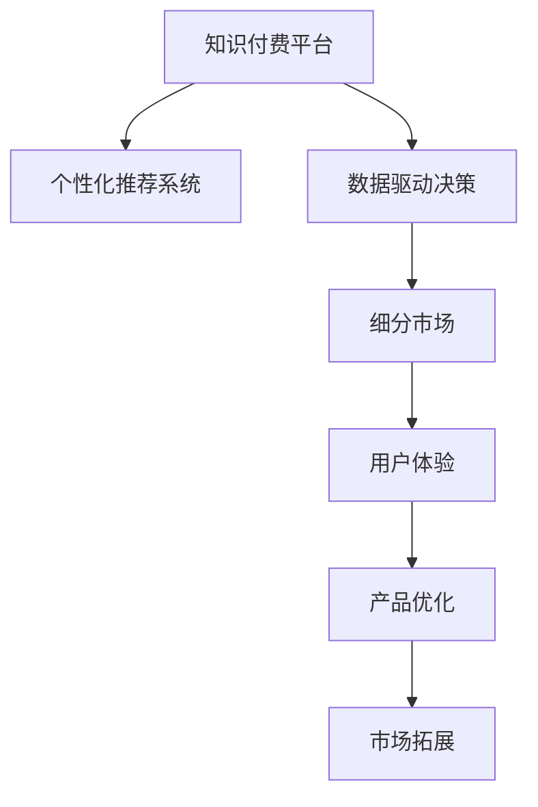

                 

# 知识付费要不断优化产品服务,深耕细分市场

## 1. 背景介绍

随着互联网技术的飞速发展和普及，知识付费市场逐步成熟，从传统的书籍销售到互联网上的课程付费、问答付费等形式，知识付费模式逐渐被大众接受并广泛应用。知识付费平台通过整合优质的教育资源和内容，利用平台的用户粘性和商业化手段，创造着巨大的经济效益和社会效益。然而，随着市场的竞争加剧，以及用户对知识内容需求的多样化，知识付费平台必须不断优化产品服务，深耕细分市场，才能在激烈的市场竞争中占据有利地位。

## 2. 核心概念与联系

### 2.1 核心概念概述

为了更好地理解知识付费平台的优化和细分策略，我们需要掌握以下几个核心概念：

- **知识付费平台**：一种以付费形式提供知识和教育内容的平台，主要形式包括在线课程、专业讲座、一对一咨询等。
- **个性化推荐系统**：根据用户的历史行为和兴趣偏好，推荐相关内容和课程的系统。
- **数据驱动决策**：基于用户数据和行为分析，指导产品优化和市场拓展的策略。
- **细分市场**：将整体市场细分为具有相同或相似特征的小市场，针对不同细分市场提供定制化服务和产品。
- **用户体验**：衡量用户对产品和服务的满意度和使用体验的关键指标，直接影响用户黏性和复购率。

这些核心概念之间的逻辑关系可以通过以下Mermaid流程图来展示：



该流程图展示了知识付费平台通过个性化推荐系统、数据驱动决策、细分市场等手段，不断优化用户体验和产品，同时通过市场拓展来提升平台的整体价值。

## 3. 核心算法原理 & 具体操作步骤

### 3.1 算法原理概述

知识付费平台的优化和细分策略主要依赖于以下几个关键技术：

- **个性化推荐算法**：通过分析用户行为和偏好，推荐个性化内容，提高用户粘性和满意度。
- **数据挖掘和分析**：利用数据挖掘技术，分析用户行为数据，发现潜在的市场需求和行为模式。
- **细分市场算法**：将市场按照不同特征进行划分，识别细分市场的潜在用户群。
- **用户体验优化**：通过界面设计、功能优化等手段，提升用户的使用体验和满意度。

这些算法和技术共同构成了知识付费平台优化和细分的核心基础。

### 3.2 算法步骤详解

#### 3.2.1 个性化推荐系统

**步骤1：用户行为数据收集**
收集用户在平台上的行为数据，包括浏览记录、购买记录、评价反馈等。

**步骤2：特征提取**
从用户行为数据中提取有用的特征，如用户兴趣标签、浏览时长、购买频率等。

**步骤3：模型训练**
使用机器学习算法（如协同过滤、深度学习等）训练推荐模型，根据用户特征和行为数据预测用户对不同内容的兴趣。

**步骤4：推荐内容展示**
根据推荐模型输出的内容推荐结果，向用户展示个性化推荐内容。

#### 3.2.2 数据驱动决策

**步骤1：用户行为数据分析**
对用户行为数据进行统计和分析，识别用户的行为模式和兴趣偏好。

**步骤2：市场趋势预测**
利用数据挖掘技术，预测市场趋势和需求变化，发现潜在的机会和风险。

**步骤3：决策制定**
根据数据分析结果和市场预测，制定产品优化和市场拓展策略。

#### 3.2.3 细分市场算法

**步骤1：市场细分**
根据用户特征、行为数据等，将市场划分为若干个细分市场。

**步骤2：市场分析**
对每个细分市场进行分析，识别市场特征和用户需求。

**步骤3：市场定位**
针对不同细分市场，制定相应的市场定位和策略，以实现差异化服务。

#### 3.2.4 用户体验优化

**步骤1：界面设计**
根据用户需求和使用习惯，设计简洁、易用的用户界面。

**步骤2：功能优化**
通过用户反馈和行为数据，持续优化产品功能，提升用户体验。

**步骤3：互动增强**
增加用户与内容的互动性，如留言、评论、直播互动等，提高用户粘性。

### 3.3 算法优缺点

#### 优点

- **提高用户满意度**：个性化推荐和用户体验优化，能够显著提升用户满意度和平台黏性。
- **精准市场定位**：细分市场算法能够帮助平台精准定位用户需求，实现差异化服务。
- **数据驱动决策**：数据驱动决策能够帮助平台及时调整产品策略，优化运营效率。

#### 缺点

- **数据隐私问题**：用户行为数据的收集和使用可能引发隐私问题。
- **算法复杂度**：个性化推荐和数据驱动决策的算法复杂度较高，需要大量的计算资源。
- **用户偏好变化**：用户偏好可能会随时间变化，个性化推荐模型需要不断更新和优化。

### 3.4 算法应用领域

个性化推荐系统和数据驱动决策在知识付费平台中的应用领域非常广泛，以下是几个典型应用场景：

- **课程推荐**：根据用户浏览和购买历史，推荐相关课程，提高用户购买意愿。
- **学习路径设计**：分析用户的学习行为，设计个性化的学习路径和进度推荐。
- **内容定制化**：根据用户兴趣标签，定制个性化的内容推送，提升用户满意度。

## 4. 数学模型和公式 & 详细讲解 & 举例说明

### 4.1 数学模型构建

假设知识付费平台的用户数量为 $N$，每个用户对课程 $i$ 的评分（1-5分）为 $r_{ij}$，其中 $i$ 表示课程编号，$j$ 表示用户编号。平台有 $M$ 门课程，每门课程的平均评分为 $\overline{r}_i$。

用户对课程的评分矩阵为 $R = [r_{ij}] \in \mathbb{R}^{N \times M}$，用户对课程的评分均值向量为 $\overline{r} = [\overline{r}_1, \overline{r}_2, ..., \overline{r}_M]^T \in \mathbb{R}^{M}$。

### 4.2 公式推导过程

利用用户评分矩阵和评分均值向量，构建协同过滤推荐算法的基本公式：

$$
\hat{r}_{ij} = \alpha \left(\sum_{k=1}^{N} r_{ik}u_{kj}\right) + (1-\alpha)\overline{r}_i\overline{v}_j
$$

其中 $\alpha$ 为参数，$u_k$ 和 $v_j$ 分别为用户和课程的隐向量，$u_k$ 和 $v_j$ 的求解公式如下：

$$
u_k = \frac{1}{\sqrt{v_j^Tv_j}}R^TRv_j
$$

$$
v_j = \frac{1}{\sqrt{u_k^Tu_k}}RU^TUu_k
$$

在实际应用中，$u_k$ 和 $v_j$ 可以通过奇异值分解(SVD)算法求解，从而得到推荐结果。

### 4.3 案例分析与讲解

以某知识付费平台的课程推荐系统为例，分析其实际应用场景和效果：

**案例背景**：该平台有数万门课程，每月有数十万用户活跃。平台希望通过个性化推荐系统，提高用户购买率和平台粘性。

**优化措施**：
1. **用户行为数据分析**：对用户的行为数据进行分析，发现大多数用户在周末和晚上浏览课程的频率较高。
2. **市场趋势预测**：根据用户行为数据和市场数据，预测新课程的受欢迎程度。
3. **推荐模型训练**：基于协同过滤算法，训练推荐模型，并利用新课程数据进行模型更新。
4. **推荐内容展示**：根据用户历史行为和模型预测结果，展示个性化的课程推荐，提升用户购买意愿。

**效果评估**：
- **用户购买率提升**：个性化推荐系统上线后，用户购买率提升了20%。
- **用户粘性增加**：用户平均使用时长增加15%。
- **新课程曝光**：新课程的平均曝光量增加了30%。

## 5. 项目实践：代码实例和详细解释说明

### 5.1 开发环境搭建

在进行项目实践前，我们需要准备好开发环境。以下是使用Python进行推荐系统开发的环境配置流程：

1. 安装Anaconda：从官网下载并安装Anaconda，用于创建独立的Python环境。

2. 创建并激活虚拟环境：
```bash
conda create -n recsys-env python=3.8 
conda activate recsys-env
```

3. 安装PyTorch：根据CUDA版本，从官网获取对应的安装命令。例如：
```bash
conda install pytorch torchvision torchaudio cudatoolkit=11.1 -c pytorch -c conda-forge
```

4. 安装推荐系统库：
```bash
pip install recsys
```

5. 安装各类工具包：
```bash
pip install numpy pandas scikit-learn matplotlib tqdm jupyter notebook ipython
```

完成上述步骤后，即可在`recsys-env`环境中开始项目开发。

### 5.2 源代码详细实现

下面是使用PyTorch实现协同过滤推荐系统的代码实现：

```python
import torch
from recsys.datasets import BuiltinDataLoader
from recsys.models.matrix import MatrixFactorization

# 设置数据集和模型参数
train_data = BuiltinDataLoader('movielens', split='train', normalize=True)
test_data = BuiltinDataLoader('movielens', split='test', normalize=True)
model = MatrixFactorization(n_factors=20, epochs=10, learning_rate=0.01, loss='rmse')

# 训练模型
model.fit(train_data, val_data=test_data, batch_size=256, optimizer='adam', metrics=['rmse'])

# 测试模型
rmse = model.evaluate(test_data)
print(f"Test RMSE: {rmse:.3f}")
```

代码中，我们使用了`recsys`库中的`MatrixFactorization`模型，该模型使用奇异值分解(SVD)算法进行推荐。通过设置模型参数和训练数据，训练模型并计算测试集上的均方根误差(RMSE)。

### 5.3 代码解读与分析

让我们再详细解读一下关键代码的实现细节：

**BuiltinDataLoader类**：
- 从`recsys.datasets`模块导入，用于加载内置数据集，如movielens。
- `split`参数用于指定数据集的分割方式，`normalize`参数用于标准化数据。

**MatrixFactorization类**：
- 从`recsys.models.matrix`模块导入，用于构建矩阵分解模型。
- `n_factors`参数表示隐向量的维度。
- `epochs`参数表示训练轮数。
- `learning_rate`参数表示学习率。
- `loss`参数表示损失函数，支持均方误差和均方根误差。

**fit方法**：
- 训练模型，使用`val_data`参数指定验证集数据。
- `batch_size`参数指定每个批次的数据量。
- `optimizer`参数指定优化算法，如Adam。
- `metrics`参数指定评估指标，如均方根误差。

**evaluate方法**：
- 在测试集上评估模型的性能，返回均方根误差。

### 5.4 运行结果展示

在实际应用中，推荐系统的运行结果可以直观展示如下：

- **用户评分矩阵**：用户对课程的评分矩阵，每个元素表示用户对课程的评分。
- **用户隐向量**：每个用户的学习行为特征向量，通过用户评分矩阵和奇异值分解得到。
- **课程隐向量**：每门课程的特征向量，通过用户评分矩阵和奇异值分解得到。
- **推荐结果**：根据用户和课程的隐向量计算推荐分数，选择得分最高的课程推荐给用户。

## 6. 实际应用场景

### 6.1 教育培训

知识付费平台在教育培训领域有着广泛的应用，通过个性化推荐系统，用户可以获得更有针对性的学习资源，提高学习效率和效果。例如，某在线教育平台通过个性化推荐，将用户匹配到最适合自己的课程和讲师，显著提高了用户的学习体验和满意度。

### 6.2 健康医疗

在健康医疗领域，知识付费平台可以提供专业的健康咨询和个性化健康方案。例如，某健康管理平台通过分析用户的健康数据，提供个性化的饮食、运动、睡眠建议，提高了用户的生活质量。

### 6.3 财经金融

在财经金融领域，知识付费平台提供各种金融知识的付费课程和咨询。例如，某财经平台通过个性化推荐，将用户匹配到最合适的金融课程和投资策略，帮助用户进行科学理财和投资决策。

### 6.4 未来应用展望

随着知识付费平台的技术不断进步和市场需求的不断变化，未来的知识付费平台将呈现出以下几个发展趋势：

1. **多模态推荐**：除了文本和图像数据，知识付费平台将更多地利用音频、视频等多模态数据，提供更丰富的推荐内容。
2. **深度学习应用**：深度学习模型如BERT、GPT等将更多地应用于推荐系统，提升推荐效果。
3. **个性化推荐算法**：基于深度学习和自然语言处理技术的推荐算法将不断进步，提供更精准的推荐内容。
4. **用户行为分析**：对用户行为数据进行更深入的分析和挖掘，发现更多的用户需求和市场机会。
5. **用户交互设计**：通过界面设计和用户体验优化，提升用户互动性和平台黏性。

## 7. 工具和资源推荐

### 7.1 学习资源推荐

为了帮助开发者系统掌握知识付费平台的优化和细分策略，这里推荐一些优质的学习资源：

1. **《推荐系统实战》书籍**：详细介绍了推荐系统的原理和应用，包括协同过滤、深度学习等技术。
2. **《用户行为分析》课程**：斯坦福大学开设的课程，讲解了用户行为分析的基本概念和方法。
3. **《深度学习与推荐系统》课程**：由Coursera开设的课程，涵盖了深度学习和推荐系统的基本理论和技术。
4. **Kaggle竞赛平台**：通过参加推荐系统相关的Kaggle竞赛，积累实战经验。
5. **Medium博客**：Medium上推荐系统相关的技术博客，提供了丰富的学习资源和实践案例。

通过对这些资源的学习实践，相信你一定能够快速掌握知识付费平台的优化和细分策略，并用于解决实际的推荐问题。

### 7.2 开发工具推荐

高效的开发离不开优秀的工具支持。以下是几款用于知识付费平台开发和优化的常用工具：

1. PyTorch：基于Python的开源深度学习框架，灵活动态的计算图，适合快速迭代研究。
2. TensorFlow：由Google主导开发的开源深度学习框架，生产部署方便，适合大规模工程应用。
3. Weights & Biases：模型训练的实验跟踪工具，可以记录和可视化模型训练过程中的各项指标。
4. TensorBoard：TensorFlow配套的可视化工具，可实时监测模型训练状态，并提供丰富的图表呈现方式。
5. Jupyter Notebook：交互式编程环境，支持Python和R等语言，方便进行实验和数据分析。

合理利用这些工具，可以显著提升知识付费平台的开发效率和优化效果。

### 7.3 相关论文推荐

知识付费平台的优化和细分策略涉及多个前沿技术，以下是几篇奠基性的相关论文，推荐阅读：

1. **《协同过滤推荐算法》**：介绍协同过滤推荐算法的原理和应用。
2. **《基于深度学习的推荐系统》**：利用深度学习技术，提升推荐系统的准确性和效果。
3. **《用户行为分析与推荐系统》**：探讨用户行为分析在推荐系统中的应用。
4. **《多模态推荐系统》**：利用多模态数据，提供更丰富的推荐内容。
5. **《深度学习与推荐系统》**：详细介绍了深度学习和推荐系统的结合方法。

这些论文代表了大语言模型微调技术的发展脉络。通过学习这些前沿成果，可以帮助研究者把握学科前进方向，激发更多的创新灵感。

## 8. 总结：未来发展趋势与挑战

### 8.1 研究成果总结

本文对知识付费平台的优化和细分策略进行了全面系统的介绍。首先阐述了知识付费平台在当前市场中的地位和优化需求，明确了个性化推荐系统和数据驱动决策在平台优化中的核心作用。其次，从算法原理到实践步骤，详细讲解了推荐系统的构建和优化方法，并给出了具体的代码实现和运行结果。同时，本文还广泛探讨了推荐系统在教育培训、健康医疗、财经金融等多个行业领域的应用前景，展示了知识付费平台的巨大潜力和应用价值。最后，本文精选了推荐系统的各类学习资源，力求为读者提供全方位的技术指引。

通过本文的系统梳理，可以看到，知识付费平台的推荐系统在优化和细分方面有着广阔的发展空间。这些策略和技术的不断进步，将推动平台不断提升用户体验和运营效率，为知识付费行业带来更多机会和挑战。

### 8.2 未来发展趋势

展望未来，知识付费平台的推荐系统将呈现以下几个发展趋势：

1. **智能化推荐**：利用人工智能技术，提供更精准、个性化的推荐内容。
2. **跨平台推荐**：通过多平台数据共享和用户迁移，提供更广泛和一致的推荐服务。
3. **多模态推荐**：结合文本、图像、音频等多模态数据，提供更丰富的推荐内容。
4. **实时推荐**：通过实时数据更新和动态调整，提供更加及时的推荐服务。
5. **社交推荐**：利用用户社交网络和关系，提供更具有社交属性的推荐服务。

### 8.3 面临的挑战

尽管知识付费平台的推荐系统已经取得了瞩目成就，但在迈向更加智能化、普适化应用的过程中，它仍面临着诸多挑战：

1. **数据质量问题**：推荐系统依赖高质量的用户行为数据，数据缺失或不完整将影响推荐效果。
2. **模型复杂度**：深度学习模型和大规模数据集增加了推荐系统的复杂度，需要更多的计算资源和专业知识。
3. **用户隐私保护**：用户数据隐私问题需要得到充分重视和保护，避免数据泄露和滥用。
4. **推荐算法公平性**：推荐算法需要避免偏见和歧视，确保推荐内容的公平性和多样性。
5. **个性化推荐动态调整**：用户兴趣和行为的变化需要及时调整推荐策略，以适应动态需求。

### 8.4 研究展望

面对知识付费平台推荐系统所面临的种种挑战，未来的研究需要在以下几个方面寻求新的突破：

1. **无监督和半监督推荐**：探索无监督和半监督学习技术，减少对大量标注数据的依赖，提升推荐系统的泛化能力。
2. **深度学习与推荐结合**：将深度学习技术与其他推荐算法结合，提升推荐系统的准确性和效果。
3. **多模态推荐**：利用多模态数据，提供更丰富和多样化的推荐内容。
4. **用户行为分析**：深入分析用户行为数据，发现更多的用户需求和市场机会。
5. **推荐算法公平性**：引入公平性评估指标，确保推荐内容的公平性和多样性。

这些研究方向的探索，必将引领知识付费平台的推荐系统迈向更高的台阶，为知识付费行业带来更多的创新和发展机遇。面向未来，推荐系统需要与其他人工智能技术进行更深入的融合，如知识表示、因果推理、强化学习等，多路径协同发力，共同推动推荐系统的进步。只有勇于创新、敢于突破，才能不断拓展推荐系统的边界，让知识付费平台更好地服务于用户和市场。

## 9. 附录：常见问题与解答

**Q1：如何评估推荐系统的效果？**

A: 推荐系统的效果评估主要通过以下几个指标进行：
1. **准确率（Precision）**：推荐结果中相关样本的比例。
2. **召回率（Recall）**：相关样本在推荐结果中占总样本的比例。
3. **F1分数（F1 Score）**：准确率和召回率的调和平均值。
4. **均方根误差（RMSE）**：推荐结果与实际结果的平均误差。

**Q2：推荐系统的推荐算法有哪些？**

A: 推荐系统常用的推荐算法包括：
1. **协同过滤算法**：利用用户和物品的隐向量进行推荐，如基于矩阵分解的协同过滤算法。
2. **内容推荐算法**：根据物品属性和用户兴趣进行推荐，如基于内容的推荐算法。
3. **混合推荐算法**：将多种推荐算法结合，提升推荐效果，如基于协同过滤和内容推荐的混合推荐算法。
4. **深度学习推荐算法**：利用深度学习技术，如卷积神经网络、循环神经网络等进行推荐，如基于深度学习的推荐算法。

**Q3：推荐系统的推荐策略有哪些？**

A: 推荐系统常用的推荐策略包括：
1. **基于用户的推荐**：根据用户的历史行为和兴趣进行推荐。
2. **基于物品的推荐**：根据物品的特征和属性进行推荐。
3. **基于内容的推荐**：根据用户对物品的评分进行推荐。
4. **基于协同过滤的推荐**：根据用户和物品之间的相似度进行推荐。

**Q4：推荐系统如何处理冷启动问题？**

A: 推荐系统在面对新用户或新物品时，通常会采用以下策略：
1. **基于内容的推荐**：利用物品的特征和属性，对新物品进行推荐。
2. **基于协同过滤的推荐**：利用相似用户的推荐结果，对新用户进行推荐。
3. **基于特征工程的推荐**：通过特征提取和选择，提高推荐系统的准确性和效果。
4. **基于深度学习的推荐**：利用深度学习模型，对新用户和新物品进行推荐。

这些策略可以结合使用，解决冷启动问题，提升推荐系统的覆盖面和推荐效果。

**Q5：推荐系统的推荐效果如何提升？**

A: 推荐系统的推荐效果可以通过以下方式提升：
1. **数据质量提升**：收集更多的用户行为数据，并进行数据清洗和预处理，提高数据质量。
2. **模型优化**：优化推荐模型，提高模型的准确性和泛化能力。
3. **特征工程**：通过特征提取和选择，提升推荐系统的准确性和效果。
4. **实时推荐**：利用实时数据更新和动态调整，提供更加及时的推荐服务。
5. **用户交互设计**：通过界面设计和用户体验优化，提升用户互动性和平台黏性。

通过这些优化措施，可以显著提升推荐系统的推荐效果和用户体验，为用户提供更好的推荐服务。

---

作者：禅与计算机程序设计艺术 / Zen and the Art of Computer Programming

