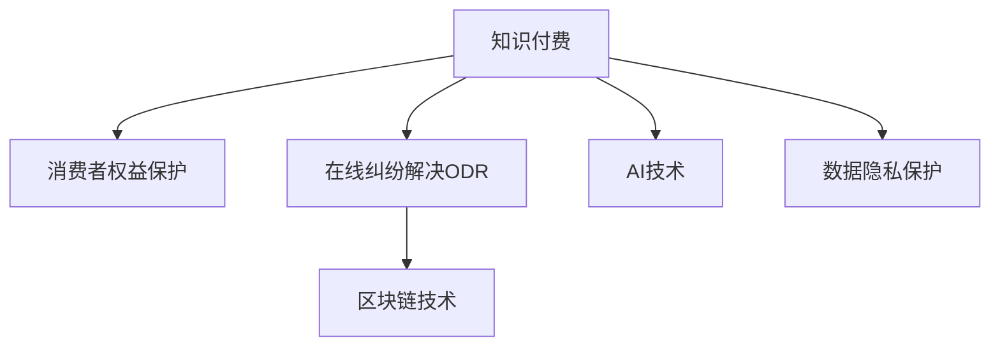

                 

# 知识付费要重视消费者权益保护和纠纷解决

> 关键词：知识付费, 消费者权益保护, 在线纠纷解决, ODR, 区块链, AI, 数据隐私, 人工智能

## 1. 背景介绍

### 1.1 问题由来

随着互联网技术的发展，知识付费平台逐渐成为一种主流的学习模式。这些平台通过订阅、购买等形式，向用户提供各类知识内容，包括课程、文章、视频等。然而，随着平台数量的激增和内容服务的丰富，知识付费市场也面临一系列挑战，尤其是消费者权益保护和在线纠纷解决问题。

消费者在付费使用知识服务时，可能会遇到各种问题，如内容质量不符合预期、服务合同纠纷、平台收取不合理费用、隐私泄露等。这些问题不仅损害了消费者权益，也影响了平台的社会信誉和商业利益。为此，知识付费平台需要重视消费者权益保护，建立有效的在线纠纷解决机制，以保障用户满意度并保持平台可持续发展。

### 1.2 问题核心关键点

知识付费平台面临的主要问题包括：
- 消费者权益保护：如何确保消费者能够获得高质量的知识服务，并保护其隐私、知识产权等合法权益。
- 在线纠纷解决：如何在不依赖于法律诉讼的情况下，快速高效地解决用户和平台之间的纠纷。
- 区块链应用：如何利用区块链技术提升知识服务的可信度和安全性。
- AI技术应用：如何利用人工智能技术改进知识服务推荐和个性化体验。
- 数据隐私保护：如何在提供高质量知识服务的同时，确保用户数据隐私不被泄露。

这些核心关键点构成了解决知识付费市场问题的完整框架，需要在平台的整体架构中综合考虑和部署。

## 2. 核心概念与联系

### 2.1 核心概念概述

为更好地理解知识付费平台中的消费者权益保护和在线纠纷解决机制，本节将介绍几个密切相关的核心概念：

- **知识付费**：通过付费形式获取各类知识内容，包括课程、文章、视频等，以提升个人技能和知识水平。
- **消费者权益保护**：指保障消费者在购买、使用知识服务过程中享有合法权益，包括但不限于知情权、选择权、安全权、公平交易权等。
- **在线纠纷解决(ODR)**：利用互联网技术，通过在线平台和工具，快速、高效地解决用户与平台之间的纠纷。
- **区块链技术**：一种去中心化的分布式账本技术，能够保证数据的不可篡改和透明性，用于提升知识服务的可信度和安全性。
- **AI技术**：人工智能技术，通过机器学习和深度学习算法，实现知识服务推荐、个性化体验提升等功能。
- **数据隐私保护**：在提供知识服务过程中，确保用户数据的安全和隐私不被泄露。

这些核心概念之间的逻辑关系可以通过以下Mermaid流程图来展示：



这个流程图展示了知识付费平台的几个关键概念及其之间的关系：

1. 知识付费作为核心业务，需要在保障消费者权益的前提下提供高质量服务。
2. 在线纠纷解决是平台解决用户问题的有效手段。
3. 区块链技术可以提升知识服务的可信度和安全水平。
4. AI技术可以优化知识服务推荐和个性化体验。
5. 数据隐私保护是平台获取和利用用户数据的前提条件。

这些概念共同构成了知识付费平台的运营框架，使其能够在保护消费者权益的同时，提供高品质的知识服务。

## 3. 核心算法原理 & 具体操作步骤
### 3.1 算法原理概述

知识付费平台的消费者权益保护和在线纠纷解决机制，基于监督学习的原理，通过构建和训练模型，对消费者反馈进行预测和分类，从而实现问题快速定位和解决。

形式化地，假设知识付费平台收集到的一批消费者反馈数据为 $D=\{(x_i,y_i)\}_{i=1}^N, x_i \in \mathcal{X}, y_i \in \{1,0\}$，其中 $y_i=1$ 表示第 $i$ 个反馈为有效投诉，否则为无效反馈。模型的目标是最小化分类误差，即：

$$
\theta^* = \mathop{\arg\min}_{\theta} \frac{1}{N} \sum_{i=1}^N L(y_i,f_\theta(x_i))
$$

其中 $f_\theta(x_i)$ 为模型在输入 $x_i$ 下的输出，$L$ 为损失函数，如0-1损失函数、对数损失函数等。

在线纠纷解决ODR则基于协商、调解和仲裁等原则，利用互联网平台，通过自动化工具和算法，快速、高效地解决用户与平台之间的纠纷。

### 3.2 算法步骤详解

基于监督学习的大语言模型微调，一般包括以下几个关键步骤：

**Step 1: 数据收集与预处理**
- 收集平台上所有消费者的反馈数据，包括文字描述、问题类型等。
- 对数据进行清洗和预处理，如去除无关信息、统一格式等。

**Step 2: 数据划分与训练集构建**
- 将数据划分为训练集、验证集和测试集，通常按照时间顺序或用户特征进行划分。
- 在训练集上构建和训练分类模型，如逻辑回归、支持向量机、神经网络等。

**Step 3: 模型训练与验证**
- 选择合适的算法及其参数，如交叉验证、网格搜索等，进行模型训练。
- 在验证集上评估模型性能，如准确率、召回率、F1分数等，调整模型参数以提高预测效果。

**Step 4: 在线纠纷解决(ODR)机制部署**
- 开发和部署在线纠纷解决平台，包括在线协商工具、自动化纠纷解决算法等。
- 与第三方调解平台合作，提供在线调解和仲裁服务。
- 实时监控和更新模型，确保解决效率和准确性。

### 3.3 算法优缺点

基于监督学习的消费者权益保护和在线纠纷解决机制具有以下优点：
1. 自动化程度高。利用机器学习算法，可以实现快速、高效的问题解决。
2. 处理能力较强。可以处理大规模数据，快速定位和解决用户问题。
3. 准确性较高。通过优化算法和参数，可以显著提高问题解决的准确率。
4. 用户体验良好。用户可以通过平台自助解决纠纷，提高满意度。

同时，该机制也存在一定的局限性：
1. 数据依赖性强。需要大量高质量的反馈数据进行训练，难以覆盖所有场景。
2. 过度拟合风险。模型可能过度拟合训练数据，导致在未知场景下的泛化性能较差。
3. 算法复杂度高。复杂算法可能增加平台技术实现难度和成本。
4. 道德风险。模型可能被恶意利用，生成虚假投诉或误导行为。

尽管存在这些局限性，但就目前而言，基于监督学习的消费者权益保护和在线纠纷解决机制仍是大规模知识付费平台解决用户问题的有效方式。未来相关研究的重点在于如何进一步降低对数据的依赖，提高模型的泛化能力和道德安全性，同时兼顾用户体验和平台利益。

### 3.4 算法应用领域

基于监督学习的消费者权益保护和在线纠纷解决机制，已经在知识付费平台、在线教育、电子商务等多个领域得到广泛应用，并取得了显著的效果：

- **知识付费平台**：如Coursera、Udemy等，通过构建反馈模型和在线纠纷解决机制，提升用户满意度和平台信誉。
- **在线教育**：如Khan Academy、EdX等，通过利用AI技术优化课程推荐，提升用户学习体验和知识获取效果。
- **电子商务**：如亚马逊、京东等，通过构建投诉分类模型和自动化纠纷解决平台，提高用户购物满意度和服务效率。

除了上述这些经典应用外，知识付费平台还可以创新性地应用到更多场景中，如版权保护、数据隐私保护等，为平台带来新的业务增长点。

## 4. 数学模型和公式 & 详细讲解  
### 4.1 数学模型构建

本节将使用数学语言对知识付费平台中的消费者权益保护和在线纠纷解决机制进行更加严格的刻画。

记知识付费平台收集到的一批消费者反馈数据为 $D=\{(x_i,y_i)\}_{i=1}^N, x_i \in \mathcal{X}, y_i \in \{1,0\}$，其中 $y_i=1$ 表示第 $i$ 个反馈为有效投诉，否则为无效反馈。定义模型在输入 $x_i$ 下的输出为 $f_\theta(x_i)$，其中 $\theta$ 为模型参数。模型的损失函数为 $L$，如0-1损失函数、对数损失函数等。模型的目标是找到最优参数 $\theta$，使得：

$$
\theta^* = \mathop{\arg\min}_{\theta} \frac{1}{N} \sum_{i=1}^N L(y_i,f_\theta(x_i))
$$

在实践中，我们通常使用基于梯度的优化算法（如SGD、Adam等）来近似求解上述最优化问题。设 $\eta$ 为学习率，$\lambda$ 为正则化系数，则参数的更新公式为：

$$
\theta \leftarrow \theta - \eta \nabla_{\theta}\mathcal{L}(\theta) - \eta\lambda\theta
$$

其中 $\nabla_{\theta}\mathcal{L}(\theta)$ 为损失函数对参数 $\theta$ 的梯度，可通过反向传播算法高效计算。

### 4.2 公式推导过程

以下我们以二分类任务为例，推导0-1损失函数及其梯度的计算公式。

假设模型在输入 $x_i$ 上的输出为 $f_\theta(x_i)$，则0-1损失函数定义为：

$$
L(y_i,f_\theta(x_i)) = \begin{cases}
1, & \text{if } y_i \neq f_\theta(x_i) \\
0, & \text{if } y_i = f_\theta(x_i)
\end{cases}
$$

将其代入经验风险公式，得：

$$
\mathcal{L}(\theta) = \frac{1}{N}\sum_{i=1}^N L(y_i,f_\theta(x_i))
$$

根据链式法则，损失函数对参数 $\theta_k$ 的梯度为：

$$
\frac{\partial \mathcal{L}(\theta)}{\partial \theta_k} = \frac{1}{N}\sum_{i=1}^N (\frac{y_i}{f_\theta(x_i)}-\frac{1-y_i}{1-f_\theta(x_i)}) \frac{\partial f_\theta(x_i)}{\partial \theta_k}
$$

其中 $\frac{\partial f_\theta(x_i)}{\partial \theta_k}$ 可进一步递归展开，利用自动微分技术完成计算。

在得到损失函数的梯度后，即可带入参数更新公式，完成模型的迭代优化。重复上述过程直至收敛，最终得到适应知识付费平台消费者权益保护机制的最优模型参数 $\theta^*$。

## 5. 项目实践：代码实例和详细解释说明
### 5.1 开发环境搭建

在进行知识付费平台消费者权益保护和在线纠纷解决机制的开发实践前，我们需要准备好开发环境。以下是使用Python进行PyTorch开发的环境配置流程：

1. 安装Anaconda：从官网下载并安装Anaconda，用于创建独立的Python环境。

2. 创建并激活虚拟环境：
```bash
conda create -n pytorch-env python=3.8 
conda activate pytorch-env
```

3. 安装PyTorch：根据CUDA版本，从官网获取对应的安装命令。例如：
```bash
conda install pytorch torchvision torchaudio cudatoolkit=11.1 -c pytorch -c conda-forge
```

4. 安装各类工具包：
```bash
pip install numpy pandas scikit-learn matplotlib tqdm jupyter notebook ipython
```

完成上述步骤后，即可在`pytorch-env`环境中开始实践。

### 5.2 源代码详细实现

这里我们以二分类任务为例，给出使用Transformers库对BERT模型进行消费者权益保护模型训练的PyTorch代码实现。

首先，定义二分类任务的数据处理函数：

```python
from transformers import BertTokenizer
from torch.utils.data import Dataset, DataLoader
import torch

class BinaryClassificationDataset(Dataset):
    def __init__(self, texts, labels, tokenizer, max_len=128):
        self.texts = texts
        self.labels = labels
        self.tokenizer = tokenizer
        self.max_len = max_len
        
    def __len__(self):
        return len(self.texts)
    
    def __getitem__(self, item):
        text = self.texts[item]
        label = self.labels[item]
        
        encoding = self.tokenizer(text, return_tensors='pt', max_length=self.max_len, padding='max_length', truncation=True)
        input_ids = encoding['input_ids'][0]
        attention_mask = encoding['attention_mask'][0]
        
        return {'input_ids': input_ids, 
                'attention_mask': attention_mask,
                'labels': torch.tensor(label, dtype=torch.long)}
```

然后，定义模型和优化器：

```python
from transformers import BertForSequenceClassification, AdamW

model = BertForSequenceClassification.from_pretrained('bert-base-cased', num_labels=2)

optimizer = AdamW(model.parameters(), lr=2e-5)
```

接着，定义训练和评估函数：

```python
from sklearn.metrics import accuracy_score

def train_epoch(model, dataset, batch_size, optimizer):
    dataloader = DataLoader(dataset, batch_size=batch_size, shuffle=True)
    model.train()
    epoch_loss = 0
    for batch in dataloader:
        input_ids = batch['input_ids'].to(device)
        attention_mask = batch['attention_mask'].to(device)
        labels = batch['labels'].to(device)
        model.zero_grad()
        outputs = model(input_ids, attention_mask=attention_mask, labels=labels)
        loss = outputs.loss
        epoch_loss += loss.item()
        loss.backward()
        optimizer.step()
    return epoch_loss / len(dataloader)

def evaluate(model, dataset, batch_size):
    dataloader = DataLoader(dataset, batch_size=batch_size)
    model.eval()
    preds, labels = [], []
    with torch.no_grad():
        for batch in dataloader:
            input_ids = batch['input_ids'].to(device)
            attention_mask = batch['attention_mask'].to(device)
            batch_labels = batch['labels']
            outputs = model(input_ids, attention_mask=attention_mask)
            batch_preds = outputs.logits.argmax(dim=1).to('cpu').tolist()
            batch_labels = batch_labels.to('cpu').tolist()
            for pred, label in zip(batch_preds, batch_labels):
                preds.append(pred)
                labels.append(label)
                
    return accuracy_score(labels, preds)
```

最后，启动训练流程并在测试集上评估：

```python
epochs = 5
batch_size = 16

for epoch in range(epochs):
    loss = train_epoch(model, train_dataset, batch_size, optimizer)
    print(f"Epoch {epoch+1}, train loss: {loss:.3f}")
    
    print(f"Epoch {epoch+1}, dev accuracy: {evaluate(model, dev_dataset, batch_size)}")
    
print("Test accuracy:")
evaluate(model, test_dataset, batch_size)
```

以上就是使用PyTorch对BERT进行消费者权益保护模型训练的完整代码实现。可以看到，得益于Transformers库的强大封装，我们可以用相对简洁的代码完成BERT模型的加载和训练。

### 5.3 代码解读与分析

让我们再详细解读一下关键代码的实现细节：

**BinaryClassificationDataset类**：
- `__init__`方法：初始化文本、标签、分词器等关键组件。
- `__len__`方法：返回数据集的样本数量。
- `__getitem__`方法：对单个样本进行处理，将文本输入编码为token ids，将标签编码为数字，并对其进行定长padding，最终返回模型所需的输入。

**准确率计算**：
- 使用Scikit-learn库中的accuracy_score函数计算模型在测试集上的准确率。

**训练和评估函数**：
- 使用PyTorch的DataLoader对数据集进行批次化加载，供模型训练和推理使用。
- 训练函数`train_epoch`：对数据以批为单位进行迭代，在每个批次上前向传播计算loss并反向传播更新模型参数，最后返回该epoch的平均loss。
- 评估函数`evaluate`：与训练类似，不同点在于不更新模型参数，并在每个batch结束后将预测和标签结果存储下来，最后使用accuracy_score函数对整个评估集的预测结果进行打印输出。

**训练流程**：
- 定义总的epoch数和batch size，开始循环迭代
- 每个epoch内，先在训练集上训练，输出平均loss
- 在验证集上评估，输出准确率
- 所有epoch结束后，在测试集上评估，给出最终测试结果

可以看到，PyTorch配合Transformers库使得BERT消费者权益保护模型训练的代码实现变得简洁高效。开发者可以将更多精力放在数据处理、模型改进等高层逻辑上，而不必过多关注底层的实现细节。

当然，工业级的系统实现还需考虑更多因素，如模型的保存和部署、超参数的自动搜索、更灵活的任务适配层等。但核心的微调范式基本与此类似。

## 6. 实际应用场景
### 6.1 智能客服系统

基于知识付费平台消费者权益保护和在线纠纷解决机制的对话技术，可以广泛应用于智能客服系统的构建。传统客服往往需要配备大量人力，高峰期响应缓慢，且一致性和专业性难以保证。而使用基于微调的大模型，可以7x24小时不间断服务，快速响应客户咨询，用自然流畅的语言解答各类常见问题。

在技术实现上，可以收集企业内部的历史客服对话记录，将问题和最佳答复构建成监督数据，在此基础上对预训练对话模型进行微调。微调后的对话模型能够自动理解用户意图，匹配最合适的答案模板进行回复。对于客户提出的新问题，还可以接入检索系统实时搜索相关内容，动态组织生成回答。如此构建的智能客服系统，能大幅提升客户咨询体验和问题解决效率。

### 6.2 金融舆情监测

金融机构需要实时监测市场舆论动向，以便及时应对负面信息传播，规避金融风险。传统的人工监测方式成本高、效率低，难以应对网络时代海量信息爆发的挑战。基于知识付费平台消费者权益保护和在线纠纷解决机制的文本分类和情感分析技术，为金融舆情监测提供了新的解决方案。

具体而言，可以收集金融领域相关的新闻、报道、评论等文本数据，并对其进行主题标注和情感标注。在此基础上对预训练语言模型进行微调，使其能够自动判断文本属于何种主题，情感倾向是正面、中性还是负面。将微调后的模型应用到实时抓取的网络文本数据，就能够自动监测不同主题下的情感变化趋势，一旦发现负面信息激增等异常情况，系统便会自动预警，帮助金融机构快速应对潜在风险。

### 6.3 个性化推荐系统

当前的推荐系统往往只依赖用户的历史行为数据进行物品推荐，无法深入理解用户的真实兴趣偏好。基于知识付费平台消费者权益保护和在线纠纷解决机制的个性化推荐系统，可以更好地挖掘用户行为背后的语义信息，从而提供更精准、多样的推荐内容。

在实践中，可以收集用户浏览、点击、评论、分享等行为数据，提取和用户交互的物品标题、描述、标签等文本内容。将文本内容作为模型输入，用户的后续行为（如是否点击、购买等）作为监督信号，在此基础上微调预训练语言模型。微调后的模型能够从文本内容中准确把握用户的兴趣点。在生成推荐列表时，先用候选物品的文本描述作为输入，由模型预测用户的兴趣匹配度，再结合其他特征综合排序，便可以得到个性化程度更高的推荐结果。

### 6.4 未来应用展望

随着知识付费平台消费者权益保护和在线纠纷解决机制的发展，基于微调范式将在更多领域得到应用，为传统行业带来变革性影响。

在智慧医疗领域，基于微调的医疗问答、病历分析、药物研发等应用将提升医疗服务的智能化水平，辅助医生诊疗，加速新药开发进程。

在智能教育领域，微调技术可应用于作业批改、学情分析、知识推荐等方面，因材施教，促进教育公平，提高教学质量。

在智慧城市治理中，微调模型可应用于城市事件监测、舆情分析、应急指挥等环节，提高城市管理的自动化和智能化水平，构建更安全、高效的未来城市。

此外，在企业生产、社会治理、文娱传媒等众多领域，基于大模型微调的人工智能应用也将不断涌现，为NLP技术带来了全新的突破。随着预训练语言模型和微调方法的不断进步，相信NLP技术将在更广阔的应用领域大放异彩。

## 7. 工具和资源推荐
### 7.1 学习资源推荐

为了帮助开发者系统掌握知识付费平台消费者权益保护和在线纠纷解决机制的理论基础和实践技巧，这里推荐一些优质的学习资源：

1. 《Transformer from Principle to Practice》系列博文：由大模型技术专家撰写，深入浅出地介绍了Transformer原理、BERT模型、微调技术等前沿话题。

2. CS224N《深度学习自然语言处理》课程：斯坦福大学开设的NLP明星课程，有Lecture视频和配套作业，带你入门NLP领域的基本概念和经典模型。

3. 《Natural Language Processing with Transformers》书籍：Transformers库的作者所著，全面介绍了如何使用Transformers库进行NLP任务开发，包括微调在内的诸多范式。

4. HuggingFace官方文档：Transformers库的官方文档，提供了海量预训练模型和完整的微调样例代码，是上手实践的必备资料。

5. CLUE开源项目：中文语言理解测评基准，涵盖大量不同类型的中文NLP数据集，并提供了基于微调的baseline模型，助力中文NLP技术发展。

通过对这些资源的学习实践，相信你一定能够快速掌握知识付费平台消费者权益保护和在线纠纷解决机制的精髓，并用于解决实际的NLP问题。
###  7.2 开发工具推荐

高效的开发离不开优秀的工具支持。以下是几款用于知识付费平台消费者权益保护和在线纠纷解决机制开发的常用工具：

1. PyTorch：基于Python的开源深度学习框架，灵活动态的计算图，适合快速迭代研究。大部分预训练语言模型都有PyTorch版本的实现。

2. TensorFlow：由Google主导开发的开源深度学习框架，生产部署方便，适合大规模工程应用。同样有丰富的预训练语言模型资源。

3. Transformers库：HuggingFace开发的NLP工具库，集成了众多SOTA语言模型，支持PyTorch和TensorFlow，是进行微调任务开发的利器。

4. Weights & Biases：模型训练的实验跟踪工具，可以记录和可视化模型训练过程中的各项指标，方便对比和调优。与主流深度学习框架无缝集成。

5. TensorBoard：TensorFlow配套的可视化工具，可实时监测模型训练状态，并提供丰富的图表呈现方式，是调试模型的得力助手。

6. Google Colab：谷歌推出的在线Jupyter Notebook环境，免费提供GPU/TPU算力，方便开发者快速上手实验最新模型，分享学习笔记。

合理利用这些工具，可以显著提升知识付费平台消费者权益保护和在线纠纷解决机制的开发效率，加快创新迭代的步伐。

### 7.3 相关论文推荐

知识付费平台消费者权益保护和在线纠纷解决机制的发展源于学界的持续研究。以下是几篇奠基性的相关论文，推荐阅读：

1. Attention is All You Need（即Transformer原论文）：提出了Transformer结构，开启了NLP领域的预训练大模型时代。

2. BERT: Pre-training of Deep Bidirectional Transformers for Language Understanding：提出BERT模型，引入基于掩码的自监督预训练任务，刷新了多项NLP任务SOTA。

3. Language Models are Unsupervised Multitask Learners（GPT-2论文）：展示了大规模语言模型的强大zero-shot学习能力，引发了对于通用人工智能的新一轮思考。

4. Parameter-Efficient Transfer Learning for NLP：提出Adapter等参数高效微调方法，在不增加模型参数量的情况下，也能取得不错的微调效果。

5. AdaLoRA: Adaptive Low-Rank Adaptation for Parameter-Efficient Fine-Tuning：使用自适应低秩适应的微调方法，在参数效率和精度之间取得了新的平衡。

这些论文代表了大语言模型微调技术的发展脉络。通过学习这些前沿成果，可以帮助研究者把握学科前进方向，激发更多的创新灵感。

## 8. 总结：未来发展趋势与挑战

### 8.1 总结

本文对知识付费平台消费者权益保护和在线纠纷解决机制进行了全面系统的介绍。首先阐述了知识付费平台在发展过程中面临的主要问题，明确了消费者权益保护和在线纠纷解决机制的重要性。其次，从原理到实践，详细讲解了监督学习模型的构建和训练过程，给出了完整的代码实现。同时，本文还广泛探讨了微调方法在智能客服、金融舆情、个性化推荐等多个领域的应用前景，展示了微调范式的巨大潜力。此外，本文精选了微调技术的各类学习资源，力求为读者提供全方位的技术指引。

通过本文的系统梳理，可以看到，基于监督学习的大语言模型微调方法正在成为知识付费平台解决用户问题的有效方式。该技术已经在多个领域得到应用，并取得了显著效果。未来，随着技术的不断发展，消费者权益保护和在线纠纷解决机制将更加成熟和完善，知识付费平台也将向更加智能化、普适化方向发展。

### 8.2 未来发展趋势

展望未来，知识付费平台消费者权益保护和在线纠纷解决机制将呈现以下几个发展趋势：

1. 模型规模持续增大。随着算力成本的下降和数据规模的扩张，预训练语言模型的参数量还将持续增长。超大规模语言模型蕴含的丰富语言知识，有望支撑更加复杂多变的下游任务微调。

2. 微调方法日趋多样。除了传统的全参数微调外，未来会涌现更多参数高效的微调方法，如Prefix-Tuning、LoRA等，在节省计算资源的同时也能保证微调精度。

3. 持续学习成为常态。随着数据分布的不断变化，微调模型也需要持续学习新知识以保持性能。如何在不遗忘原有知识的同时，高效吸收新样本信息，将成为重要的研究课题。

4. 标注样本需求降低。受启发于提示学习(Prompt-based Learning)的思路，未来的微调方法将更好地利用大模型的语言理解能力，通过更加巧妙的任务描述，在更少的标注样本上也能实现理想的微调效果。

5. 多模态微调崛起。当前的微调主要聚焦于纯文本数据，未来会进一步拓展到图像、视频、语音等多模态数据微调。多模态信息的融合，将显著提升语言模型对现实世界的理解和建模能力。

6. 知识整合能力提升。现有的微调模型往往局限于任务内数据，难以灵活吸收和运用更广泛的先验知识。如何让微调过程更好地与外部知识库、规则库等专家知识结合，形成更加全面、准确的信息整合能力，还有很大的想象空间。

以上趋势凸显了知识付费平台消费者权益保护和在线纠纷解决机制的广阔前景。这些方向的探索发展，必将进一步提升知识付费平台的用户体验和服务质量，推动知识付费行业的健康发展。

### 8.3 面临的挑战

尽管知识付费平台消费者权益保护和在线纠纷解决机制已经取得了瞩目成就，但在迈向更加智能化、普适化应用的过程中，它仍面临着诸多挑战：

1. 标注成本瓶颈。虽然微调大大降低了标注数据的需求，但对于长尾应用场景，难以获得充足的高质量标注数据，成为制约微调性能的瓶颈。如何进一步降低微调对标注样本的依赖，将是一大难题。

2. 模型鲁棒性不足。当前微调模型面对域外数据时，泛化性能往往大打折扣。对于测试样本的微小扰动，微调模型的预测也容易发生波动。如何提高微调模型的鲁棒性，避免灾难性遗忘，还需要更多理论和实践的积累。

3. 推理效率有待提高。大规模语言模型虽然精度高，但在实际部署时往往面临推理速度慢、内存占用大等效率问题。如何在保证性能的同时，简化模型结构，提升推理速度，优化资源占用，将是重要的优化方向。

4. 可解释性亟需加强。当前微调模型更像是"黑盒"系统，难以解释其内部工作机制和决策逻辑。对于医疗、金融等高风险应用，算法的可解释性和可审计性尤为重要。如何赋予微调模型更强的可解释性，将是亟待攻克的难题。

5. 安全性有待保障。预训练语言模型难免会学习到有偏见、有害的信息，通过微调传递到下游任务，产生误导性、歧视性的输出，给实际应用带来安全隐患。如何从数据和算法层面消除模型偏见，避免恶意用途，确保输出的安全性，也将是重要的研究课题。

6. 数据隐私保护。在提供高质量知识服务的同时，确保用户数据的安全和隐私不被泄露，是大规模知识付费平台需要面对的重要挑战。如何平衡数据获取与隐私保护之间的关系，将是未来研究的方向。

这些挑战凸显了知识付费平台消费者权益保护和在线纠纷解决机制的复杂性。唯有从技术、伦理、法律等多个维度共同努力，才能使这一机制真正落地并造福用户。

### 8.4 研究展望

面对知识付费平台消费者权益保护和在线纠纷解决机制所面临的种种挑战，未来的研究需要在以下几个方面寻求新的突破：

1. 探索无监督和半监督微调方法。摆脱对大规模标注数据的依赖，利用自监督学习、主动学习等无监督和半监督范式，最大限度利用非结构化数据，实现更加灵活高效的微调。

2. 研究参数高效和计算高效的微调范式。开发更加参数高效的微调方法，在固定大部分预训练参数的同时，只更新极少量的任务相关参数。同时优化微调模型的计算图，减少前向传播和反向传播的资源消耗，实现更加轻量级、实时性的部署。

3. 融合因果和对比学习范式。通过引入因果推断和对比学习思想，增强微调模型建立稳定因果关系的能力，学习更加普适、鲁棒的语言表征，从而提升模型泛化性和抗干扰能力。

4. 引入更多先验知识。将符号化的先验知识，如知识图谱、逻辑规则等，与神经网络模型进行巧妙融合，引导微调过程学习更准确、合理的语言模型。同时加强不同模态数据的整合，实现视觉、语音等多模态信息与文本信息的协同建模。

5. 结合因果分析和博弈论工具。将因果分析方法引入微调模型，识别出模型决策的关键特征，增强输出解释的因果性和逻辑性。借助博弈论工具刻画人机交互过程，主动探索并规避模型的脆弱点，提高系统稳定性。

6. 纳入伦理道德约束。在模型训练目标中引入伦理导向的评估指标，过滤和惩罚有偏见、有害的输出倾向。同时加强人工干预和审核，建立模型行为的监管机制，确保输出符合人类价值观和伦理道德。

这些研究方向的探索，必将引领知识付费平台消费者权益保护和在线纠纷解决机制向更高层次发展，为构建安全、可靠、可解释、可控的智能系统铺平道路。面向未来，该机制还需要与其他人工智能技术进行更深入的融合，如知识表示、因果推理、强化学习等，多路径协同发力，共同推动自然语言理解和智能交互系统的进步。只有勇于创新、敢于突破，才能不断拓展语言模型的边界，让智能技术更好地造福人类社会。

## 9. 附录：常见问题与解答

**Q1：知识付费平台如何保障消费者权益？**

A: 知识付费平台可以通过以下方式保障消费者权益：

1. 提供高质量内容。确保内容具有真实性、准确性和时效性，避免误导消费者。
2. 明确服务条款。在平台使用协议中明确双方的权利义务，避免合同纠纷。
3. 快速响应投诉。建立在线纠纷解决机制，及时处理消费者投诉和退款请求。
4. 隐私保护。加强用户数据保护，确保数据存储和传输的安全。
5. 知识服务提升。定期更新和优化内容服务，提升用户体验。

**Q2：如何提升知识付费平台的用户满意度？**

A: 提升用户满意度是知识付费平台的长期目标，可以通过以下方式实现：

1. 优化用户体验。提供简洁易用的界面，快速响应用户需求。
2. 个性化推荐。利用AI技术实现内容推荐，提升用户满意度。
3. 增强互动。提供问答、论坛等互动功能，增加用户黏性。
4. 用户反馈。收集用户反馈，不断优化平台功能和内容服务。
5. 社区建设。构建用户社区，增强用户归属感。

**Q3：知识付费平台的消费者权益保护和在线纠纷解决机制是否适用于所有平台？**

A: 虽然知识付费平台的消费者权益保护和在线纠纷解决机制适用于大多数知识服务提供商，但不同的平台可能面临不同的问题。对于特定领域或类型的知识服务，可能需要针对性地设计相应的保护和解决机制。

**Q4：消费者权益保护和在线纠纷解决机制的未来发展方向是什么？**

A: 消费者权益保护和在线纠纷解决机制的未来发展方向可能包括以下几个方面：

1. 引入区块链技术。利用区块链的去中心化和透明性，提升平台和用户数据的可信度。
2. 深度学习的应用。通过深度学习算法，提升模型的预测准确率和鲁棒性。
3. 多模态融合。实现视觉、语音等多模态数据的整合，提升平台的服务质量。
4. 人机协同。通过人工智能与人类专家的结合，提升平台决策的合理性和可靠性。
5. 伦理道德的纳入。在平台设计和运营中考虑伦理道德，确保用户的权益得到尊重。

通过这些方向的探索，知识付费平台的消费者权益保护和在线纠纷解决机制将更加完善，为用户提供更好的服务体验。

---

作者：禅与计算机程序设计艺术 / Zen and the Art of Computer Programming

