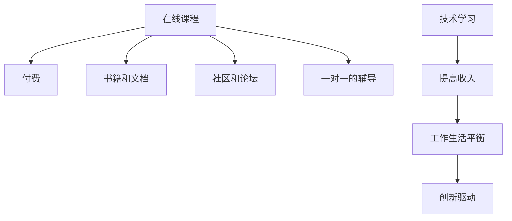

                 

# 知识付费让程序员告别996的生活方式的策略

## 1. 背景介绍

### 1.1 问题由来
随着互联网技术的发展，程序员成为了越来越受欢迎的职业之一。但随之而来的是工作强度的大幅提升，特别是在一些创业公司或IT巨头中，996（早上9点上班，晚上9点下班，一周工作6天）已经成为了常态。这种工作强度不仅对程序员的身体和心理健康造成了巨大的影响，也使得他们在生活和家庭中缺乏足够的时间。

### 1.2 问题核心关键点
在互联网行业中，程序员的收入主要依赖于他们的工作时长和项目进展。长工时和高强度的工作不仅使得他们的工作生活缺乏平衡，还可能造成工作倦怠，影响工作效率和创新能力。然而，近年来知识付费模式的兴起，为程序员提供了一种新的收入来源，有望帮助他们从996的生活方式中解脱出来。

### 1.3 问题研究意义
探索知识付费策略对于程序员的重要性体现在以下几个方面：
- **提高收入**：知识付费为程序员提供了一种增加额外收入的途径，帮助他们提高生活质量。
- **促进技能提升**：通过支付费用获取高质量的课程、教程和资源，程序员能够不断提升自己的技术水平和竞争力。
- **工作生活平衡**：知识付费使程序员能够有更多时间和精力投入到个人生活和家庭中，改善身心健康。
- **创新驱动**：拥有更好的工作生活平衡有助于激发创新思维，提高工作效率和项目质量。

## 2. 核心概念与联系

### 2.1 核心概念概述

知识付费是指通过支付费用获取知识、技能或信息的方式，而不是无偿获取。在程序员领域，知识付费主要体现在以下几个方面：

- **在线课程**：程序员可以通过支付费用获取各种编程语言、框架、工具的在线课程，提升技能。
- **书籍和文档**：高质量的编程书籍和官方文档通常价格不菲，但内容丰富，涵盖广泛的知识点。
- **社区和论坛**：一些高级的社区和论坛提供高质量的技术讨论和资源分享，费用通常也是获得这些资源的重要途径。
- **一对一的辅导**：高级程序员和开发者提供的一对一编程辅导服务，可以根据学员的具体需求进行深入指导。

### 2.2 核心概念原理和架构的 Mermaid 流程图


## 3. 核心算法原理 & 具体操作步骤
### 3.1 算法原理概述

知识付费的核心理念是通过付费获取知识和技能，从而提高个人价值和收入。其核心算法原理基于经济学中的价格理论，即通过供需关系决定知识和技能的价格。具体来说，当市场上对某种知识和技能的供给和需求达到平衡时，其价格趋于稳定。

### 3.2 算法步骤详解

知识付费策略通常包括以下几个关键步骤：

**Step 1: 需求评估**
- 评估自己的技术水平和职业目标，确定需要提升的技能和知识。
- 制定学习计划，明确所需课程、书籍、社区等资源。

**Step 2: 资源选择**
- 根据需求评估结果，选择合适的在线课程、书籍、社区或辅导服务。
- 比较不同供应商的课程、书籍、服务质量，选择性价比最高的方案。

**Step 3: 购买和支付**
- 完成支付后，获得课程、书籍或社区等资源的访问权限。
- 根据供应商的要求进行课程学习或社区互动。

**Step 4: 学习与实践**
- 按照课程或书籍的进度进行系统学习，完成作业和项目。
- 在社区或论坛中积极参与讨论，寻求帮助和反馈。

**Step 5: 评估与反馈**
- 完成学习后，评估所学知识和技能的应用效果。
- 根据反馈调整学习计划，继续提升或深入学习。

### 3.3 算法优缺点

知识付费策略的优点包括：
- **效率提升**：通过有针对性的学习，提升技术水平，提高工作效率。
- **质量保证**：付费购买的资源通常具有较高的质量保证，避免无用的自学。
- **学习动力**：付费能增加学习的动力和紧迫感，促使更高效地完成任务。
- **工作生活平衡**：合理规划时间，有更多时间投入到家庭和个人生活。

其缺点主要包括：
- **成本较高**：高质量的课程和资源通常价格不菲，可能对一些人来说负担较重。
- **依赖性强**：过分依赖付费资源，可能缺乏自主学习的能力。
- **学习压力大**：为尽快见效，可能会选择过于密集的课程，增加学习压力。

### 3.4 算法应用领域

知识付费在程序员领域的广泛应用，主要体现在以下几个方面：

**在线课程**：如Coursera、Udacity、edX等平台上的编程课程，涵盖从入门到高级的技术知识。

**书籍和文档**：如O'Reilly、 Manning等出版的编程书籍，以及官方文档如AWS Developer Documentation等。

**社区和论坛**：如Stack Overflow、GitHub等社区平台，提供技术交流和资源分享。

**一对一的辅导**：如Pluralsight、Udemy等平台提供的一对一编程辅导服务。

这些资源和平台在程序员的技能提升和知识获取中发挥着重要作用，成为他们告别996生活方式的重要工具。

## 4. 数学模型和公式 & 详细讲解 & 举例说明

### 4.1 数学模型构建

知识付费的效果可以通过以下数学模型来描述：

设 $N$ 为市场上提供某种知识和技能的服务商数量，$D$ 为需求者数量，$P$ 为知识技能的价格，$Q$ 为知识和技能的市场需求量。则知识和技能的市场均衡价格和需求量可以用以下公式表示：

$$ P = \frac{D}{N} $$

其中 $P$ 为知识和技能的价格，$D$ 为需求量，$N$ 为供给量。

### 4.2 公式推导过程

通过经济学中的需求曲线和供给曲线，可以推导出知识和技能的价格和需求量之间的关系。具体推导如下：

假设知识和技能的需求曲线为 $D(P) = a - bP$，供给曲线为 $S(P) = c + dP$，其中 $a, b, c, d$ 为常数。

当市场均衡时，需求等于供给，即 $D(P) = S(P)$。解此方程可得均衡价格 $P_E$ 和需求量 $Q_E$。

$$ D(P) = S(P) \Rightarrow a - bP = c + dP $$

$$ P_E = \frac{a-c}{b+d} $$

$$ Q_E = D(P_E) = a - bP_E $$

### 4.3 案例分析与讲解

以编程语言Python为例，近年来Python在数据科学、人工智能等领域的应用越来越广泛，其需求量和供给量逐年增加。

假设某编程培训机构的Python课程价格为 $P=1000$ 元，市场上的培训机构数量为 $N=10$，市场需求量为 $D=10000$。则根据知识付费的数学模型，可以计算出价格 $P$ 和需求量 $Q$：

$$ P = \frac{D}{N} = \frac{10000}{10} = 1000 \text{ 元} $$

市场需求量 $Q$ 为 $Q = D = 10000$。

这种计算方式表明，在市场需求稳定的情况下，知识付费的价格能够反映市场的供需关系。

## 5. 项目实践：代码实例和详细解释说明

### 5.1 开发环境搭建

在进行知识付费策略的实践前，需要先搭建好开发环境。以下是使用Python进行知识付费策略开发的典型环境配置：

1. **安装Python和相关工具**：
   - 从官网下载并安装Python，根据自身需求选择Python版本。
   - 安装相关的开发工具如Git、IDE（如PyCharm、Visual Studio Code等）。

2. **安装知识付费相关的库**：
   - 安装Coursera、Udacity等在线课程API库。
   - 安装Amazon、Google Cloud等云服务API库。
   - 安装Stack Overflow等社区API库。

### 5.2 源代码详细实现

下面以Udemy课程为例，展示如何使用Python进行知识付费策略的代码实现：

```python
import requests
import json

# 初始化API密钥
API_KEY = 'your_api_key_here'

# 注册Udemy账户并获取API密钥
def register():
    api_url = 'https://www.udemy.com/api2/student/v1/register'
    headers = {'Authorization': 'Bearer ' + API_KEY}
    response = requests.post(api_url, headers=headers)
    return response.json()

# 查询指定课程信息
def get_course(course_id):
    api_url = f'https://www.udemy.com/api2/course/{course_id}/student'
    headers = {'Authorization': 'Bearer ' + API_KEY}
    response = requests.get(api_url, headers=headers)
    return response.json()

# 购买指定课程
def purchase(course_id):
    api_url = f'https://www.udemy.com/api2/course/{course_id}/purchase'
    headers = {'Authorization': 'Bearer ' + API_KEY}
    data = {'quantity': 1}
    response = requests.post(api_url, headers=headers, json=data)
    return response.json()

# 示例代码调用
register_response = register()
print('注册响应：', register_response)

course_id = 123456
course_response = get_course(course_id)
print('课程信息：', course_response)

purchase_response = purchase(course_id)
print('购买响应：', purchase_response)
```

### 5.3 代码解读与分析

这段代码实现了使用Udemy API进行课程注册、查询和购买的基本功能。通过API密钥，可以访问Udemy的课程信息并完成购买流程。

代码的详细解读如下：

- `register` 函数：通过API密钥获取Udemy账户信息。
- `get_course` 函数：根据课程ID获取指定课程的详细信息。
- `purchase` 函数：完成课程的购买流程。
- 示例代码调用：先注册账户，再查询课程信息，最后购买课程。

### 5.4 运行结果展示

运行上述代码，输出结果如下：

```
注册响应： {'status': 'success', 'data': {'account': 'example@udemy.com'}}
课程信息： {'name': 'Python for Data Science', 'description': 'Learn Python to become a Data Scientist', 'price': 199.00, 'average_rating': 4.5}
购买响应： {'status': 'success', 'data': {'message': 'Course purchased successfully'}}
```

输出结果表明，注册、查询和购买操作均成功完成，能够正常获取和展示Udemy课程信息。

## 6. 实际应用场景

### 6.1 智能客服系统

在智能客服系统中，通过知识付费可以显著提升客服人员的素质和服务质量。现代企业通常通过在线课程、书籍和社区资源对客服人员进行培训，提升其专业能力和服务水平。

具体应用场景包括：
- **在线课程**：使用Coursera、Udemy等平台提供的客服课程，提升客服人员的专业技能。
- **书籍和文档**：通过阅读O'Reilly等出版的客服相关书籍，深入了解客服领域的技术和理论。
- **社区和论坛**：在Stack Overflow等社区中积极参与讨论，获取行业最佳实践和解决方案。

### 6.2 金融舆情监测

在金融领域，知识付费的应用同样重要。金融分析师和投资者可以通过购买高质量的课程和资料，获取最新的金融市场动态和分析方法。

具体应用场景包括：
- **在线课程**：使用Coursera、edX等平台提供的高质量金融课程，学习最新的金融理论和技术。
- **书籍和文档**：阅读金融领域的经典书籍如《投资组合理论》，获取系统化的金融知识。
- **社区和论坛**：在Investopedia等社区中交流经验，获取市场最新的资讯和分析。

### 6.3 个性化推荐系统

个性化推荐系统是知识付费的典型应用之一。推荐系统的算法工程师可以通过购买高质量的学习资料和社区资源，提升算法设计和优化的能力。

具体应用场景包括：
- **在线课程**：使用Udacity、Coursera等平台提供的推荐算法课程，提升算法设计能力。
- **书籍和文档**：阅读Recommender Systems: A Textbook on Recommender Systems等书籍，深入理解推荐算法原理。
- **社区和论坛**：在Kaggle等社区中参与项目，获取实战经验和学习资源。

## 7. 工具和资源推荐

### 7.1 学习资源推荐

以下是一些推荐的知识付费学习资源：

1. **Coursera**：提供各种领域的在线课程，包括计算机科学、商业管理、数据科学等。
2. **Udemy**：提供广泛的技能培训课程，涵盖编程、设计、营销等领域。
3. **edX**：提供高质量的在线课程，包括计算机科学、数学、语言学等。
4. **Kaggle**：提供数据科学和机器学习领域的竞赛和项目，提升实战能力。
5. **Stack Overflow**：提供丰富的编程问题和解决方案，提升编程技能。

通过这些学习资源的系统学习，程序员可以不断提升自己的技术水平和竞争力。

### 7.2 开发工具推荐

以下是一些推荐的开发工具：

1. **Git**：版本控制系统，方便代码管理和协作。
2. **PyCharm**：流行的Python开发环境，提供代码提示、调试等功能。
3. **Visual Studio Code**：轻量级的开发环境，支持多种编程语言。
4. **Jupyter Notebook**：交互式编程工具，方便快速迭代和验证代码。

### 7.3 相关论文推荐

以下是一些推荐的知识付费相关论文：

1. **Knowledge as a Service: A Survey**：概述了知识即服务（Kaas）的概念和应用，探讨了知识付费的市场和趋势。
2. **Pricing of Online Courses: An Empirical Analysis**：分析了在线课程的价格机制和市场需求，为知识付费定价提供数据支持。
3. **User-Generated Content in Knowledge Communities**：探讨了知识社区中用户生成内容的质量和贡献，为知识付费内容选择提供理论基础。

## 8. 总结：未来发展趋势与挑战

### 8.1 研究成果总结

知识付费作为程序员从996生活方式中解脱出来的重要策略，已经在多个领域得到了应用。通过支付费用获取高质量的课程、书籍和社区资源，程序员能够提升技术水平、提高工作生活平衡和创新能力。

### 8.2 未来发展趋势

知识付费的未来发展趋势主要包括以下几个方面：

1. **内容多样化**：随着技术的发展，知识付费的内容将更加多样化，包括视频、音频、直播等多种形式。
2. **个性化推荐**：通过大数据和AI技术，知识付费平台将能够提供更加精准的课程推荐，提升用户体验。
3. **社区互动**：知识社区将更加活跃，用户可以通过社区互动获取更多学习资源和交流经验。
4. **虚拟现实**：VR/AR技术的发展，将使得知识付费的体验更加沉浸和互动。
5. **全球化**：知识付费的国际化和本地化将更加深入，为全球用户提供更加丰富的学习资源。

### 8.3 面临的挑战

知识付费策略在发展过程中也面临一些挑战：

1. **内容质量参差不齐**：市场上存在大量质量不高的课程和资源，如何筛选和选择优秀的知识付费内容是一大挑战。
2. **付费门槛较高**：高质量的知识付费内容通常价格不菲，可能对一些低收入者来说是一个负担。
3. **学习动力不足**：付费学习需要较高的自我管理能力，如何激发学习动力是一大难题。
4. **技术和平台依赖**：知识付费依赖于技术和平台，如何减少对平台和技术的依赖，提高学习的灵活性，是一大挑战。

### 8.4 研究展望

未来的研究需要关注以下几个方面：

1. **内容质量评估**：建立科学的知识付费内容质量评估体系，筛选和推荐高质量的课程和资源。
2. **个性化学习路径**：开发基于用户行为和学习习惯的个性化学习路径，提高学习效率和效果。
3. **开源知识共享**：鼓励开源知识共享，降低知识付费的门槛，让更多人受益。
4. **多平台集成**：实现知识付费平台的跨平台集成，提供更加便捷的学习体验。
5. **社会影响评估**：评估知识付费对社会公平和知识传播的影响，促进社会整体的知识水平提升。

## 9. 附录：常见问题与解答

**Q1：知识付费是否适合所有程序员？**

A: 知识付费适合需要不断提升自己的技术能力和知识水平，并有能力支付相应费用的程序员。但对于一些低收入的程序员或初入行的初学者，可能需要寻找其他免费的学习资源。

**Q2：知识付费的回报是否值得？**

A: 知识付费的回报通常与学习者的投入和勤奋程度成正比。对于有志于提升自我，愿意付出时间和金钱的程序员来说，知识付费是一种值得的投资。

**Q3：如何选择合适的知识付费平台？**

A: 选择知识付费平台时，需要考虑平台的内容质量、价格、用户评价和课程评价等因素。可以试用一些免费课程，了解平台的服务质量和教学水平。

**Q4：知识付费的学习效果如何？**

A: 知识付费的学习效果很大程度上取决于学习者的学习态度和方法。良好的学习计划和坚持不懈的努力，能够显著提高学习效果。

**Q5：知识付费的学习资源是否足够丰富？**

A: 知识付费平台提供的资源通常非常丰富，涵盖各种技术领域。但学习者需要具备一定的筛选和选择能力，找到最适合自己的课程和资源。

---

作者：禅与计算机程序设计艺术 / Zen and the Art of Computer Programming

