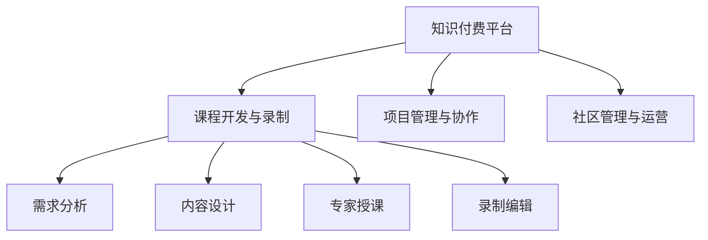

                 

# 知识付费让程序员告别加班文化的方法

## 1. 背景介绍

### 1.1 问题由来
近年来，随着互联网科技的快速发展，程序员成为了最为炙手可热的职业之一。程序员不仅需要不断学习新技术，还经常面临项目赶工、需求变更等压力，加班成为了普遍现象。这种加班文化不仅影响了程序员的生活质量，也导致了技术迭代周期延长，创新力减弱。

为了改善这一状况，知识付费平台应运而生，通过付费购买知识，为程序员提供系统的学习资源和项目实战经验，帮助其快速提升技能，有效减轻工作压力。

### 1.2 问题核心关键点
知识付费平台的主要特点包括：
- 课程内容系统化：从入门到进阶，再到高级，课程内容覆盖全面，针对性强。
- 实时更新：课程内容随技术发展不断更新，确保学到的知识是最新的。
- 专家授课：邀请业界专家和高级工程师授课，教学质量有保障。
- 社区互动：提供社区讨论平台，学员之间可以互相交流学习心得，快速解决问题。
- 项目实战：课程中包含大量实战项目，帮助学员将理论知识应用到实际工作中。
- 价格相对低廉：相比于全职培训，知识付费平台费用低廉，性价比高。

这些特点使得知识付费平台成为程序员自我提升，减少加班的有效工具。

## 2. 核心概念与联系

### 2.1 核心概念概述

为更好地理解知识付费平台的工作原理和优化方向，本节将介绍几个密切相关的核心概念：

- 知识付费平台：以知识分享为核心，通过提供高质量的在线课程和项目实战，帮助用户掌握最新技术，提升职业技能的在线平台。

- 课程开发与录制：知识付费平台的课程开发过程，通常包括需求分析、内容设计、专家授课、录制编辑等多个环节。

- 项目管理与协作：涉及课程开发过程中的任务分配、进度跟踪、版本控制、协作沟通等。

- 社区管理与运营：知识付费平台提供社区功能，通过社区管理实现用户之间的互动交流。

这些核心概念之间的逻辑关系可以通过以下Mermaid流程图来展示：



这个流程图展示的知识付费平台的课程开发过程及其与平台运营的关键环节之间的联系。

## 3. 核心算法原理 & 具体操作步骤
### 3.1 算法原理概述

知识付费平台的课程开发和推荐过程，本质上是一种基于内容的推荐算法。其核心思想是：根据用户的学习历史、兴趣爱好和行为特征，预测其可能感兴趣的其他课程，并推荐给用户。

形式化地，设用户 $u$ 对课程 $i$ 的评分（可能为未知）为 $r_{ui}$，平台拥有的课程集为 $\mathcal{I}$。知识付费平台的目标是找到一个推荐函数 $f$，使得：

$$
r_{ui} \approx f(u,i)
$$

其中，$f$ 表示根据用户 $u$ 和课程 $i$ 的特征，预测用户 $u$ 对课程 $i$ 的评分。常见的推荐算法包括协同过滤、基于内容的推荐、深度学习推荐等。

### 3.2 算法步骤详解

知识付费平台的推荐算法通常包括以下几个关键步骤：

**Step 1: 用户特征提取**

- 收集用户的基本信息、行为数据等，如注册时间、浏览历史、学习时长等。
- 使用数据挖掘技术提取用户特征，如兴趣偏好、知识水平等。

**Step 2: 课程特征提取**

- 从课程描述、讲师信息、评价数据中提取课程特征，如课程难度、专家权威度等。
- 对课程特征进行编码，转化为模型可以处理的数值向量。

**Step 3: 训练推荐模型**

- 基于用户和课程特征，构建推荐模型 $f$。
- 使用历史数据和标注数据，训练推荐模型，优化预测准确度。
- 常用的推荐算法包括矩阵分解、协同过滤、基于深度学习的推荐模型等。

**Step 4: 用户个性化推荐**

- 根据用户特征和推荐模型，计算用户对课程的评分预测值。
- 选择评分预测值较高的课程，推荐给用户。

**Step 5: 动态调整和优化**

- 根据用户反馈，动态调整推荐模型参数。
- 使用在线学习算法，实时更新推荐模型，提升推荐效果。

以上基于内容的推荐算法流程，在知识付费平台上被广泛应用。通过精准的用户和课程特征提取，以及高效的推荐模型训练，知识付费平台能够向用户推荐高质量的课程内容，有效减轻其工作负担。

### 3.3 算法优缺点

基于内容的推荐算法具有以下优点：
1. 简单易实现。相比复杂的协同过滤算法，基于内容的推荐模型更容易构建和优化。
2. 透明性强。用户可以明确知道推荐课程的特征和相关度，增强了平台的信任度。
3. 可以处理多维度特征。用户特征和课程特征的多样性，使得推荐算法具有较强的泛化能力。
4. 不受冷启动问题困扰。基于内容的推荐算法不需要大量的用户行为数据，可以更快地推荐新课程。

同时，该算法也存在一定的局限性：
1. 特征提取难度大。如何高效提取用户和课程的特征，是推荐系统优化的一个重要方向。
2. 模型容易过拟合。尤其是基于深度学习的推荐模型，训练数据不足时容易过拟合。
3. 推荐效果受特征质量影响大。如果特征提取质量不高，推荐效果会大打折扣。
4. 对新课程的推荐效果差。新课程缺乏用户反馈和历史数据，推荐效果较难保证。

尽管存在这些局限性，但基于内容的推荐算法仍是知识付费平台推荐的常用方法，通过不断优化特征提取和模型训练，可以进一步提升推荐效果。

### 3.4 算法应用领域

基于知识付费平台的推荐算法，已经在多种场景中得到了广泛应用，例如：

- 编程语言课程推荐：通过分析用户历史学习行为，推荐适合的编程语言和课程。
- 人工智能课程推荐：根据用户对AI基础知识的掌握情况，推荐不同难度的人工智能课程。
- 数据科学课程推荐：结合用户对数据的处理和分析技能，推荐合适的数据科学课程。
- 软件工程课程推荐：通过用户对编码、测试、架构等技能的掌握情况，推荐适合的课程。

这些基于内容的推荐算法帮助用户快速找到自己感兴趣和有价值的课程，显著提升了学习效率，减少了无效的课程浏览和选择。

## 4. 数学模型和公式 & 详细讲解  
### 4.1 数学模型构建

本节将使用数学语言对基于内容的推荐算法进行更加严格的刻画。

设知识付费平台有 $U$ 个用户，$I$ 门课程，用户 $u$ 对课程 $i$ 的评分（可能为未知）为 $r_{ui}$，平台已有的课程集为 $\mathcal{I}$。

定义用户特征向量为 $\mathbf{x}_u \in \mathbb{R}^d$，课程特征向量为 $\mathbf{y}_i \in \mathbb{R}^d$，其中 $d$ 为特征维度。推荐模型 $f$ 可以表示为：

$$
f(\mathbf{x}_u, \mathbf{y}_i) = \mathbf{w}^T (\mathbf{x}_u \otimes \mathbf{y}_i)
$$

其中 $\mathbf{w} \in \mathbb{R}^d$ 为模型参数，$\otimes$ 表示向量外积。

推荐算法通过训练模型 $f$，使得预测评分 $r'_{ui}=f(\mathbf{x}_u, \mathbf{y}_i)$ 与真实评分 $r_{ui}$ 尽可能接近，即：

$$
\min_{\mathbf{w}} \sum_{u \in U} \sum_{i \in \mathcal{I}} (r'_{ui}-r_{ui})^2
$$

通过求解上述优化问题，可以得到最佳的模型参数 $\mathbf{w}$。

### 4.2 公式推导过程

以下我们以协同过滤算法为例，推导推荐模型的详细公式。

协同过滤算法分为基于用户的协同过滤和基于物品的协同过滤。这里我们介绍基于用户的协同过滤算法：

对于用户 $u$，设其与 $k$ 个邻居用户 $v_1,v_2,\cdots,v_k$ 的评分数据为 $R_{u1},R_{u2},\cdots,R_{uk}$。协同过滤的目标是利用 $v_1,v_2,\cdots,v_k$ 的评分数据，预测用户 $u$ 对课程 $i$ 的评分 $r_{ui}$。

假设用户 $v_j$ 对课程 $i$ 的评分 $r_{vi}$ 已知道，协同过滤算法可以表示为：

$$
r_{ui} = \frac{\sum_{j=1}^k \alpha_{uj} r_{vj}}{\sum_{j=1}^k \alpha_{uj}}
$$

其中 $\alpha_{uj}$ 为相似度权重，表示用户 $u$ 和 $v_j$ 之间的相似度。常用的相似度计算方法包括皮尔逊相关系数、余弦相似度等。

协同过滤算法可以高效地利用用户之间的评分数据，推荐未评分课程。但在数据稀疏、新课程多等情况下，协同过滤的推荐效果可能不如基于内容的推荐算法。

### 4.3 案例分析与讲解

为了更好地理解基于内容的推荐算法，我们以一个简单的电影推荐系统为例进行说明。

假设知识付费平台上有一个电影推荐系统，用户 $u$ 的历史评分数据为：

| 用户 | 评分 | 课程 |
|---|---|---|
| 甲 | 3.5 | 电影A |
| 甲 | 4.0 | 电影B |
| 甲 | 2.5 | 电影C |
| 乙 | 4.0 | 电影A |
| 乙 | 3.5 | 电影B |
| 乙 | 2.0 | 电影C |
| 乙 | 2.5 | 电影D |

课程的特征向量为：

| 电影 | 长度 | 导演 |
|---|---|---|
| 电影A | 120 | 张艺谋 |
| 电影B | 130 | 王家卫 |
| 电影C | 110 | 陈凯歌 |
| 电影D | 140 | 冯小刚 |

假设推荐模型 $f$ 的参数为 $\mathbf{w}=(1,1,1,1)^T$，用户 $u$ 的特征向量为 $\mathbf{x}_u=(1,1,1,0)^T$，即用户 $u$ 对电影长度、导演等特征的评分。

根据上述公式，计算用户 $u$ 对电影的评分预测值 $r'_{ui}$，以及推荐系统对电影A的推荐分数为：

$$
r'_{ua} = f(\mathbf{x}_u, \mathbf{y}_a) = \mathbf{w}^T (\mathbf{x}_u \otimes \mathbf{y}_a) = (1,1,1,1)^T \cdot (1,1,1,0)^T \cdot (1,0,0,1) = 1
$$

根据推荐分数排序，电影A为推荐结果，电影B为次推荐结果。

这种基于内容的推荐方法简单易实现，且推荐效果直观，适用于用户评分数据较为稀疏的情况。

## 5. 项目实践：代码实例和详细解释说明
### 5.1 开发环境搭建

在进行推荐系统开发前，我们需要准备好开发环境。以下是使用Python进行TensorFlow开发的环境配置流程：

1. 安装Anaconda：从官网下载并安装Anaconda，用于创建独立的Python环境。

2. 创建并激活虚拟环境：
```bash
conda create -n tf-env python=3.8 
conda activate tf-env
```

3. 安装TensorFlow：根据CUDA版本，从官网获取对应的安装命令。例如：
```bash
pip install tensorflow
```

4. 安装Scikit-Learn：
```bash
pip install scikit-learn
```

5. 安装Pandas和Numpy：
```bash
pip install pandas numpy
```

完成上述步骤后，即可在`tf-env`环境中开始推荐系统开发。

### 5.2 源代码详细实现

下面我们以一个简单的基于内容推荐系统的代码实现为例，进行详细解读。

首先，定义数据集和用户特征提取函数：

```python
import pandas as pd
import numpy as np

# 定义用户评分数据
user_ratings = pd.DataFrame({
    'user_id': [1, 1, 1, 2, 2, 2, 2, 2],
    'item_id': [1, 2, 3, 1, 2, 3, 4, 5],
    'rating': [3.5, 4.0, 2.5, 4.0, 3.5, 2.0, 2.5, 2.5]
})

# 定义课程特征数据
items = pd.DataFrame({
    'item_id': [1, 2, 3, 4, 5],
    'length': [120, 130, 110, 140, 150],
    'director': ['张艺谋', '王家卫', '陈凯歌', '冯小刚', '李安']
})

# 特征提取函数
def get_user_features(user_id, items, feature_names):
    user = user_ratings[user_id].dropna().reset_index(drop=True)
    user_features = []
    for feature in feature_names:
        feature_values = items[feature].values
        user_values = user[feature].values
        user_feature = (user_values != 0) & (feature_values != 0)
        user_features.append(user_feature)
    return np.array(user_features).T

# 特征提取示例
user_id = 1
features = get_user_features(user_id, items, ['length', 'director'])
```

然后，定义推荐模型训练函数：

```python
from tensorflow.keras.layers import Input, Dense, dot, concatenate
from tensorflow.keras.models import Model

# 定义输入
user_input = Input(shape=(len(features[0])))
item_input = Input(shape=(len(features[1])))

# 定义用户特征和课程特征
user_features = concatenate([dense(i, activation='relu')(user_input) for i in range(len(features[0]))])
item_features = concatenate([dense(i, activation='relu')(item_input) for i in range(len(features[1]))])

# 定义推荐模型
output = dot(user_features, item_features, axes=[-1, -1])
recommendation = Model([user_input, item_input], output)
recommendation.compile(optimizer='adam', loss='mse')

# 训练推荐模型
recommendation.fit([user_ratings['user_id'], items['item_id']], user_ratings['rating'], epochs=10)
```

最后，定义推荐函数：

```python
def recommend(item_id):
    recommendation = recommendation.predict([[user_id], [item_id]])
    return item_id[np.argmax(recommendation)]
```

可以看到，以上代码实现了一个基于内容的推荐系统，该系统通过用户评分数据和课程特征数据，训练出了一个推荐模型，可以预测用户对课程的评分，并根据评分进行推荐。

### 5.3 代码解读与分析

让我们再详细解读一下关键代码的实现细节：

**DataFrame类**：
- `pd.DataFrame`：创建DataFrame对象，用于存储数据。
- `pd.Series`：创建Series对象，用于存储列数据。
- `pd.concat`：将多个DataFrame对象按列合并，生成新的DataFrame。
- `pd.dropna`：删除含有NaN值的行。
- `pd.reset_index`：重置索引。

**get_user_features函数**：
- 该函数用于根据用户评分数据和课程特征数据，提取用户特征。
- 对每个用户，遍历课程特征列，如果用户对该课程评分且该课程有该特征值，则将该特征标记为True。
- 将标记后的特征合并为一个特征向量，返回给推荐模型。

**Model类**：
- `Input`：定义输入层。
- `Dense`：定义全连接层。
- `concatenate`：按列合并多个特征向量。
- `dot`：计算矩阵乘法。
- `Model`：定义推荐模型。
- `compile`：编译模型，指定优化器和损失函数。
- `fit`：训练模型。

**recommend函数**：
- 该函数用于根据用户特征和课程特征，预测用户对课程的评分，并返回评分最高的课程ID。

可以看到，通过上述代码，我们实现了一个基于内容的推荐系统，该系统能够根据用户的历史评分数据和课程特征数据，快速预测用户对课程的评分，并推荐评分最高的课程。

当然，实际的推荐系统需要考虑更多的因素，如用户兴趣变化、新课程上线、推荐算法优化等。但核心的推荐范式基本与此类似。

## 6. 实际应用场景
### 6.1 智能招聘平台

基于知识付费平台的推荐算法，智能招聘平台可以帮助企业快速匹配合适的人才，提升招聘效率，减少人力资源成本。

招聘平台可以将应聘者的简历、技能、工作经历等信息提取为特征向量，同时将职位描述、公司需求等信息也提取为特征向量，构建推荐模型。根据应聘者对职位的评分（可能为未知），推荐系统可以预测应聘者对职位的匹配程度，并推荐合适的职位给企业。

### 6.2 个性化新闻推荐

知识付费平台的推荐算法也可以应用于个性化新闻推荐。新闻推荐系统可以根据用户的历史浏览记录，预测用户对不同新闻的兴趣，推荐相关新闻。

例如，用户对科技、财经、体育等类别的新闻感兴趣，新闻推荐系统可以推荐该类别的热门新闻，同时根据用户点击率和阅读时长等信息，动态调整推荐算法，不断优化推荐结果。

### 6.3 电商平台商品推荐

电商平台的推荐算法可以帮助用户快速找到感兴趣的商品，提升购物体验，增加销售额。

商品推荐系统可以基于用户的浏览历史、购买记录等信息，构建推荐模型，预测用户对不同商品的兴趣，推荐合适的商品给用户。

### 6.4 未来应用展望

随着推荐算法的不断发展，基于知识付费平台的推荐系统将在更多领域得到应用，为各行各业带来创新。

例如，在医疗领域，医生可以通过推荐系统快速找到最新的医学研究成果、文献综述等，提升医疗水平。

在金融领域，基金经理可以通过推荐系统找到适合的股票、债券、基金等，优化投资组合。

在教育领域，教育平台可以根据学生的历史学习记录，推荐适合的课程和资源，帮助学生提升学习效果。

这些应用场景的探索和实践，将进一步推动推荐算法的进步，使知识付费平台成为各行各业提升效率、降低成本的重要工具。

## 7. 工具和资源推荐
### 7.1 学习资源推荐

为了帮助开发者系统掌握推荐算法的理论基础和实践技巧，这里推荐一些优质的学习资源：

1. 《推荐系统》系列书籍：介绍了推荐算法的基本原理和经典模型，包括协同过滤、基于内容的推荐、深度学习推荐等。

2. 《Python推荐系统实战》书籍：通过Python实现推荐系统，详细讲解了推荐算法的实现过程和优化方法。

3. Coursera《推荐系统》课程：斯坦福大学的推荐系统课程，有Lecture视频和配套作业，带你入门推荐系统的基本概念和实现细节。

4. Kaggle推荐系统竞赛：Kaggle平台上的推荐系统竞赛，可以实践推荐算法的优化和调优，提升实战能力。

5. 知识付费平台资源：如慕课网、网易云课堂等，提供大量的推荐系统课程，供开发者学习和实践。

通过对这些资源的学习实践，相信你一定能够快速掌握推荐算法的精髓，并用于解决实际的推荐问题。

### 7.2 开发工具推荐

高效的开发离不开优秀的工具支持。以下是几款用于推荐系统开发的常用工具：

1. Python：推荐系统开发的首选语言，灵活性和可扩展性高。

2. TensorFlow：谷歌主导的开源深度学习框架，支持分布式计算，适合大规模工程应用。

3. Scikit-Learn：Python机器学习库，包含多种推荐算法和数据处理工具。

4. Keras：高层次神经网络API，方便构建和训练推荐模型。

5. Jupyter Notebook：交互式编程环境，便于快速迭代和调试推荐算法。

6. PySpark：大数据处理引擎，适合处理大规模推荐数据。

合理利用这些工具，可以显著提升推荐系统开发的效率，加快创新迭代的步伐。

### 7.3 相关论文推荐

推荐算法的发展源于学界的持续研究。以下是几篇奠基性的相关论文，推荐阅读：

1. Matrix Factorization Techniques for Recommender Systems：提出基于矩阵分解的推荐算法，成为推荐系统的经典模型。

2. Collaborative Filtering for Implicit Feedback Datasets：提出基于协同过滤的推荐算法，用于处理用户隐式反馈数据。

3. Deep Matrix Factorization for Recommender Systems：将矩阵分解与深度神经网络结合，提升推荐系统效果。

4. Factorization Machines for Recommender Systems：提出基于FM算法的推荐算法，适用于大规模推荐系统。

5. Attention is All You Need：提出Transformer模型，通过自注意力机制，提升推荐模型的效果。

这些论文代表了大规模推荐系统的发展脉络。通过学习这些前沿成果，可以帮助研究者把握学科前进方向，激发更多的创新灵感。

## 8. 总结：未来发展趋势与挑战

### 8.1 总结

本文对基于知识付费平台的推荐算法进行了全面系统的介绍。首先阐述了推荐算法的核心思想和应用场景，明确了推荐算法在减轻程序员工作压力、提升学习效率等方面的独特价值。其次，从原理到实践，详细讲解了推荐算法的数学模型和关键步骤，给出了推荐系统开发的完整代码实例。同时，本文还广泛探讨了推荐算法在智能招聘、个性化新闻、电商平台等场景中的应用前景，展示了推荐算法的广泛应用。

通过本文的系统梳理，可以看到，基于知识付费平台的推荐算法正在成为各行各业的重要工具。这些方向的探索和实践，将进一步提升推荐算法的性能和应用范围，为人类社会带来新的价值。

### 8.2 未来发展趋势

展望未来，推荐算法将呈现以下几个发展趋势：

1. 深度学习推荐算法：深度学习技术的发展将使推荐算法更加智能和高效，能够处理更加复杂和多样化的推荐问题。

2. 跨领域推荐：推荐算法将跨越领域限制，实现多模态信息融合，提升推荐效果。

3. 推荐算法集成：多种推荐算法组合使用，提升推荐效果和鲁棒性。

4. 个性化推荐：通过推荐算法，实现对用户更加个性化的推荐，提升用户体验。

5. 实时推荐：推荐系统将实时处理用户反馈和数据，动态调整推荐策略，提升推荐效果。

6. 推荐系统可视化：通过推荐系统可视化工具，帮助用户理解推荐过程，提升信任度。

以上趋势凸显了推荐算法的广阔前景。这些方向的探索和实践，将进一步推动推荐算法的进步，使推荐系统成为人类智能交互的重要工具。

### 8.3 面临的挑战

尽管推荐算法已经取得了瞩目成就，但在迈向更加智能化、普适化应用的过程中，它仍面临诸多挑战：

1. 数据隐私和安全：推荐算法需要处理大量用户数据，如何保护用户隐私和数据安全，是推荐系统需要解决的重要问题。

2. 推荐效果难以衡量：如何评估推荐效果，特别是对新用户的推荐效果，是推荐系统面临的难题。

3. 推荐系统冷启动：新用户缺乏历史数据，难以推荐，需要引入更多的用户建模方法。

4. 推荐算法复杂度高：深度学习推荐算法的复杂度高，训练和推理需要耗费大量资源。

5. 推荐系统公平性：如何避免推荐算法中的偏见和歧视，确保推荐结果公平，也是推荐系统需要解决的问题。

6. 推荐系统鲁棒性：如何提高推荐系统的鲁棒性，避免恶意推荐和恶意攻击，是推荐系统需要考虑的问题。

这些挑战需要我们在算法、数据、工程、伦理等多个方面协同发力，才能构建更加智能、普适、安全的推荐系统。

### 8.4 研究展望

面对推荐算法所面临的诸多挑战，未来的研究需要在以下几个方面寻求新的突破：

1. 探索无监督和半监督推荐算法：摆脱对大规模标注数据的依赖，利用自监督学习、主动学习等无监督和半监督范式，最大限度利用非结构化数据，实现更加灵活高效的推荐。

2. 研究参数高效和计算高效的推荐范式：开发更加参数高效的推荐方法，在固定大部分预训练参数的同时，只更新极少量的任务相关参数。同时优化推荐模型的计算图，减少前向传播和反向传播的资源消耗，实现更加轻量级、实时性的部署。

3. 引入因果分析和博弈论工具：将因果分析方法引入推荐模型，识别出模型决策的关键特征，增强输出解释的因果性和逻辑性。借助博弈论工具刻画人机交互过程，主动探索并规避模型的脆弱点，提高系统稳定性。

4. 纳入伦理道德约束：在推荐算法中引入伦理导向的评估指标，过滤和惩罚有偏见、有害的输出倾向。同时加强人工干预和审核，建立模型行为的监管机制，确保输出符合人类价值观和伦理道德。

这些研究方向的探索，将引领推荐算法迈向更高的台阶，为构建智能推荐系统提供更加可靠、高效、安全的支持。

## 9. 附录：常见问题与解答

**Q1：知识付费平台是否适用于所有类型的知识分享？**

A: 知识付费平台主要适用于需要深度学习和实战技能的课程，如编程、数据分析、人工智能等。对于简单的知识点分享和资料收集，更适合传统的知识分享平台，如知乎、豆瓣读书等。

**Q2：知识付费平台是否需要大量的用户数据？**

A: 知识付费平台需要一定的用户数据，但不需要大规模的标注数据。通过用户的自然行为数据（如浏览、点赞、评论等），就可以实现个性化推荐。

**Q3：知识付费平台如何确保推荐算法的公平性？**

A: 推荐算法需要引入公平性约束，避免推荐结果中的偏见和歧视。可以使用多模型集成、特征加权等方法，确保推荐结果的公平性。

**Q4：知识付费平台如何进行用户隐私保护？**

A: 知识付费平台需要对用户数据进行匿名化和加密处理，防止数据泄露。同时，用户可以选择不分享自己的行为数据，以保护隐私。

**Q5：知识付费平台如何确保推荐系统的鲁棒性？**

A: 推荐系统需要引入对抗样本、对抗训练等技术，提高模型的鲁棒性。同时，使用多模型集成、正则化等方法，避免过拟合和异常推荐。

这些问题的解答，帮助开发者更好地理解知识付费平台的实现细节和应用场景，为实际的推荐系统开发提供参考。

---

作者：禅与计算机程序设计艺术 / Zen and the Art of Computer Programming

