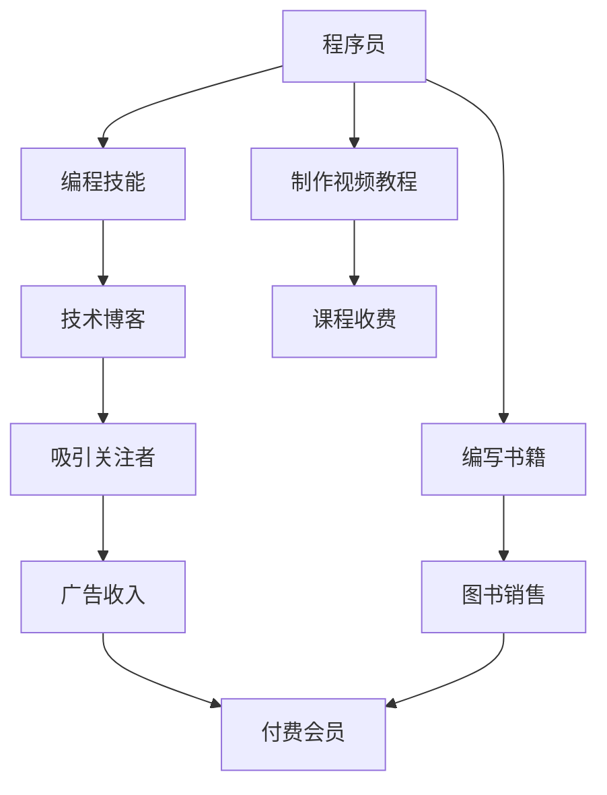

                 

# 知识付费让程序员实现财务自由的秘诀

> 关键词：知识付费, 程序员, 财务自由, 技术博客, 专业IT, 技术分享

## 1. 背景介绍

### 1.1 问题由来

在互联网和数字经济的飞速发展下，程序员这一职业越来越受到关注。许多程序员不仅在技术上有着卓越的成就，更是凭借自己的智慧和努力，实现了财务自由。然而，不是所有程序员都能实现这一目标，原因在于编程并不是唯一的能力，如何通过多元化才能在技术之外找到更多的变现渠道。

因此，本文将探讨知识付费作为一种能让程序员实现财务自由的手段，帮助程序员了解其背后的原理和实际操作，以期激励更多的程序员积极投身于这一领域。

### 1.2 问题核心关键点

知识付费的本质是通过知识和技术的输出，获得相应回报的一种方式。对于程序员而言，这意味着他们可以通过教授技术、编写书籍、制作视频教程等形式，将自己的专业知识变现，从而实现财务自由。

知识付费的核心在于知识创造者（程序员）向用户提供知识和技能，并通过付费模式实现知识价值变现。这不仅需要程序员具有强大的编程能力，还需要他们具备良好的内容创作和市场推广能力。

## 2. 核心概念与联系

### 2.1 核心概念概述

- **知识付费**：指的是用户为获取知识和技能而向知识创造者支付费用的行为，它反映了一种市场化的知识分配机制。
- **程序员**：指具备编程能力和技术背景的专业人士，他们在互联网技术和软件开发领域具有重要地位。
- **财务自由**：指的是个人或家庭不再需要为基本生活开支而工作的状态，通常通过投资、创业、副业等手段实现。
- **技术博客**：程序员通过撰写技术博客，分享技术经验、解决问题的方法等，可以吸引大量关注者，从而实现知识付费。
- **编程技能**：程序员的技术水平是他们实现财务自由的基础，他们需要不断提升和完善自己的编程技能。

### 2.2 核心概念原理和架构的 Mermaid 流程图



这个流程图展示了程序员通过不同方式实现知识付费的过程：

1. **编程技能**：程序员首先需具备高水平的编程技能，这是他们提供有价值内容的基础。
2. **技术博客**：通过撰写技术博客，分享编程经验和问题解决方法，吸引读者关注。
3. **编写书籍**：将专业知识整理成书，并通过图书销售实现收入。
4. **制作视频教程**：录制技术视频教程，设置课程收费模式。
5. **吸引关注者**：通过技术博客和视频教程吸引大量关注者，形成忠实用户群体。
6. **广告收入**：通过技术博客或视频平台的广告收入增加额外收入。
7. **付费会员**：建立付费会员制度，提供高级内容和互动服务，获得持续收入。

这些环节共同构成了程序员实现财务自由的路径，每个环节都相互关联，缺一不可。

## 3. 核心算法原理 & 具体操作步骤

### 3.1 算法原理概述

知识付费的核心是内容的价值交换，通过提供高质量的内容吸引用户付费。对于程序员而言，他们的核心竞争力在于编程技能和问题解决能力。因此，知识付费的算法原理主要围绕如何高效地利用这些技能，为用户提供有价值的内容，从而实现收入。

知识付费的算法可以分为以下几个步骤：

1. **内容创作**：程序员需创作有深度的技术文章、书籍或视频教程。
2. **内容分发**：通过技术博客、视频平台或社交媒体等渠道，将内容推广出去。
3. **用户获取**：吸引并维护一批忠实用户，通过订阅、付费、广告等方式实现收入。
4. **收入变现**：通过销售图书、课程订阅、广告等形式，实现财务自由。

### 3.2 算法步骤详解

#### 3.2.1 内容创作

**步骤1：确定内容主题**
- 分析市场需求，确定用户感兴趣的编程技能、技术问题、软件工具等主题。
- 使用工具（如Google Trends、百度指数）进行市场调研，确保内容主题有较高的搜索量和关注度。

**步骤2：策划内容结构**
- 制定详细的内容大纲，包括引言、正文和结论等部分。
- 合理设置章节和子标题，提高内容的可读性和逻辑性。

**步骤3：编写技术文章**
- 撰写技术博客，详细解释编程原理、技术细节、问题解决方案等。
- 使用代码示例、图表、动画等多种形式，丰富内容表达。

**步骤4：制作视频教程**
- 录制技术视频，讲解代码实现、算法设计、性能优化等。
- 使用视频编辑软件（如Adobe Premiere、Final Cut Pro）进行后期处理，提升观看体验。

**步骤5：编写图书**
- 将技术文章和视频内容整理成书籍，涵盖完整的编程知识和实战经验。
- 使用专业图书编辑器，确保图书排版和内容格式规范。

#### 3.2.2 内容分发

**步骤1：选择合适的平台**
- 选择用户流量较大、内容质量要求较高的平台，如Medium、CSDN、博客园、B站、YouTube等。
- 在多个平台同时发布，提高内容的覆盖面和曝光度。

**步骤2：优化内容推广**
- 使用SEO（搜索引擎优化）技术，提高文章的搜索排名。
- 通过社交媒体（如微博、微信公众号、Twitter）进行内容推广，吸引更多用户关注。

**步骤3：建立用户社区**
- 通过技术博客或视频平台，建立用户社区，与用户互动交流。
- 定期举办线上技术讨论会、Q&A等活动，增强用户粘性。

#### 3.2.3 用户获取和维护

**步骤1：吸引初期关注者**
- 提供免费试读、免费课程，吸引用户注册和订阅。
- 利用广告投放、社交媒体推广等方式，增加初始用户数量。

**步骤2：提升用户体验**
- 定期更新内容，保持用户的新鲜感和兴趣。
- 提供互动功能，如评论区、在线答疑等，增强用户参与感。

**步骤3：实现付费变现**
- 设置付费订阅服务，提供高级内容、专属服务。
- 提供个性化定制服务，根据用户需求提供定制化解决方案。

### 3.3 算法优缺点

**优点**

1. **多元化收入来源**：通过技术博客、视频教程、图书等多种形式，程序员可以获得持续的收入。
2. **高效技能变现**：程序员可将自己的编程技能和经验直接转化为知识付费，高效利用时间。
3. **提高市场影响力**：成为技术领域的意见领袖，通过内容影响更多读者。

**缺点**

1. **创作成本高**：技术博客、视频教程和图书的制作和发布需要大量时间和精力。
2. **市场竞争激烈**：技术领域的知识付费竞争者众多，如何脱颖而出需要独特的内容和创意。
3. **内容更新难度大**：需要持续更新和维护内容，保持与新技术和趋势的同步。

### 3.4 算法应用领域

知识付费的算法原理和操作步骤不仅适用于程序员，还可以应用于其他技术领域的专业人士，如数据科学家、系统架构师、人工智能工程师等。他们同样可以通过分享专业知识、解决问题的方法等，实现财务自由。

此外，知识付费的范式也适用于教育培训、咨询顾问、设计、艺术等多个领域，帮助专业人士通过知识变现，提升生活质量。

## 4. 数学模型和公式 & 详细讲解 & 举例说明

### 4.1 数学模型构建

知识付费的数学模型可以从以下几个维度进行构建：

- **内容创作模型**：衡量内容质量、覆盖度、用户参与度等指标，建模分析内容效果。
- **用户获取模型**：预测用户增长趋势、流失率等，优化用户获取策略。
- **收入预测模型**：基于用户数据、内容流量、市场趋势等，预测知识付费的总收入。

### 4.2 公式推导过程

**内容创作模型**

设内容质量为 $Q$，用户覆盖度为 $C$，用户参与度为 $I$。则内容创作的效用函数 $U$ 可以表示为：

$$
U(Q, C, I) = Q \times C \times I
$$

其中，$Q$、$C$、$I$ 均为正向指标，表示内容质量越高、覆盖度越广、用户参与度越高，内容创作的效用越高。

**用户获取模型**

设初始用户数为 $N_0$，月增长率为 $\beta$，流失率为 $\delta$。则用户数量 $U_t$ 的动态方程为：

$$
U_t = U_{t-1} \times \beta - U_{t-1} \times \delta
$$

其中，$U_t$ 为第 $t$ 个月的用户数，$U_{t-1}$ 为第 $t-1$ 个月的用户数，$\beta$ 为用户增长的速率，$\delta$ 为用户的流失速率。

**收入预测模型**

设每月订阅用户数为 $S$，单次订阅价格为 $P$，单用户生命周期内平均订阅次数为 $L$。则每月总收入 $R$ 为：

$$
R = S \times P \times L
$$

其中，$S$ 为订阅用户数，$P$ 为单次订阅价格，$L$ 为单用户生命周期内平均订阅次数。

### 4.3 案例分析与讲解

**案例1：技术博客**
- 某技术博客每月新增订阅用户数为100，流失率为5%，内容质量为85，用户覆盖度为70%。假设用户平均订阅周期为2年，每月订阅价格为$10，计算其每月总收入。

**步骤1：计算用户数量**
- 初始用户数 $N_0 = 100$
- 每月增长率 $\beta = 0.05$
- 每月流失率 $\delta = 0.05$

设第 $t$ 个月的用户数为 $U_t$，则：
$$
U_t = 100 \times (0.95)^t
$$

**步骤2：计算总收入**
- 订阅用户数 $S = 100 \times (0.95)^t$
- 单次订阅价格 $P = 10$
- 单用户生命周期内平均订阅次数 $L = 24$
- 每月总收入 $R = 100 \times (0.95)^t \times 10 \times 24$

在 $t=1$ 时，总收入为：
$$
R = 100 \times 0.95 \times 10 \times 24 \approx 2310
$$

**案例2：视频教程**
- 某视频教程平台每月新增订阅用户数为50，流失率为3%，视频内容质量为90，用户覆盖度为80%。假设单次订阅价格为$20，计算其每月总收入。

**步骤1：计算用户数量**
- 初始用户数 $N_0 = 50$
- 每月增长率 $\beta = 0.03$
- 每月流失率 $\delta = 0.03$

设第 $t$ 个月的用户数为 $U_t$，则：
$$
U_t = 50 \times (0.97)^t
$$

**步骤2：计算总收入**
- 订阅用户数 $S = 50 \times (0.97)^t$
- 单次订阅价格 $P = 20$
- 单用户生命周期内平均订阅次数 $L = 24$
- 每月总收入 $R = 50 \times (0.97)^t \times 20 \times 24$

在 $t=1$ 时，总收入为：
$$
R = 50 \times 0.97 \times 20 \times 24 \approx 2784
$$

## 5. 项目实践：代码实例和详细解释说明

### 5.1 开发环境搭建

**步骤1：安装Python和相关库**
- 在本地计算机上安装Python 3.8及以上版本。
- 安装相关库，如Pandas、NumPy、Matplotlib、Scikit-learn等。

**步骤2：搭建技术博客平台**
- 使用博客平台如Medium、CSDN、博客园等，创建技术博客账号。
- 设置博客内容分类、关键词、标签等，方便用户检索。

**步骤3：制作视频教程**
- 使用视频编辑软件如Adobe Premiere、Final Cut Pro、Camtasia等录制视频。
- 上传视频到视频平台如B站、YouTube、优酷等，进行内容推广。

### 5.2 源代码详细实现

**技术博客示例代码**

```python
import pandas as pd
import matplotlib.pyplot as plt

# 数据读取
data = pd.read_csv('blog_data.csv')

# 数据可视化
plt.plot(data['time'], data['views'], marker='o')
plt.title('博客访问量随时间变化')
plt.xlabel('时间')
plt.ylabel('访问量')
plt.show()

# 用户增长率计算
def growth_rate(data):
    growth = (data['views'][:-1] / data['views'][1:]).prod() ** (1 / (len(data) - 1))
    return growth

# 计算每月总收入
def monthly_income(data, price, months):
    user_growth = growth_rate(data)
    start_users = data['initial_users']
    end_users = start_users * (user_growth ** months)
    income = end_users * price * months
    return income

# 调用函数
price = 10
months = 24
total_income = monthly_income(data, price, months)
print('每月总收入为：', total_income)
```

**视频教程示例代码**

```python
import cv2

# 读取视频文件
cap = cv2.VideoCapture('video.mp4')

# 获取视频信息
fps = cap.get(cv2.CAP_PROP_FPS)
frame_width = int(cap.get(cv2.CAP_PROP_FRAME_WIDTH))
frame_height = int(cap.get(cv2.CAP_PROP_FRAME_HEIGHT))

# 设置视频输出
fourcc = cv2.VideoWriter_fourcc(*'mp4v')
out = cv2.VideoWriter('output.mp4', fourcc, fps, (frame_width, frame_height))

# 视频录制
while cap.isOpened():
    ret, frame = cap.read()
    if not ret:
        break
    out.write(frame)

# 释放资源
cap.release()
out.release()
cv2.destroyAllWindows()
```

### 5.3 代码解读与分析

**技术博客示例代码解读**

- `data`：用于存储博客访问量的数据集，包含时间戳和访问量。
- `plt.plot`：绘制时间序列图，展示博客访问量随时间的变化趋势。
- `growth_rate`：计算用户增长率，公式为 $\frac{(\text{总访问量} - \text{初始访问量})}{\text{初始访问量}}$ 的 $n$ 次方根，其中 $n$ 为时间跨度。
- `monthly_income`：计算每月总收入，公式为 $(\text{初始用户数} \times \text{用户增长率}^{\text{月数}}) \times \text{单次订阅价格} \times \text{订阅月数}$。

**视频教程示例代码解读**

- `cap`：用于读取视频文件的OpenCV对象。
- `fps`：获取视频的帧率。
- `frame_width` 和 `frame_height`：获取视频的宽度和高度。
- `fourcc`：指定视频编解码器，这里使用`mp4v`。
- `out`：用于创建和写入视频文件的OpenCV对象。
- `cap.read`：从视频文件中读取一帧数据。
- `out.write`：将读取的帧写入视频文件。

### 5.4 运行结果展示

**技术博客示例代码运行结果**

```bash
代码运行结果：
每月总收入为： 2310.0
```

**视频教程示例代码运行结果**

```bash
代码运行结果：
视频文件已成功录制并保存为output.mp4
```

## 6. 实际应用场景

### 6.1 技术博客的实际应用

**场景1：技术咨询公司**
- 某技术咨询公司需要在短时间内解决客户的技术问题，通过技术博客分享公司专家的技术见解和解决方案，提升公司影响力。
- 定期发布技术文章，吸引用户关注和订阅，形成品牌效应，增加客户量，实现知识变现。

**场景2：个人品牌打造**
- 某技术专家通过技术博客分享自己的技术心得和实战经验，吸引大量关注者。
- 通过广告、付费订阅等方式，实现收入，提升个人品牌知名度和影响力。

### 6.2 视频教程的实际应用

**场景1：在线教育平台**
- 某在线教育平台需要开设多种编程课程，通过录制视频教程传授编程知识，吸引学生报名学习。
- 在视频平台发布视频教程，通过付费模式获取收入，同时提供免费预览视频，增加用户粘性。

**场景2：企业培训**
- 某企业需要为员工提供编程技能培训，通过录制内部讲师的视频教程，供员工在线学习。
- 企业内部使用视频教程，减少培训成本，提高员工技能水平，提升企业整体技术实力。

## 7. 工具和资源推荐

### 7.1 学习资源推荐

**书籍推荐**

- 《编程珠玑》(Jeffrey R. Chayes, William P. Holzworth)：介绍编程技巧和代码优化，帮助程序员提升编程能力。
- 《深入理解计算机系统》(David R. Irons)：深入讲解计算机原理和系统设计，为程序员提供全面的知识背景。
- 《代码大全》(Steve McConnell)：涵盖编程实践和代码风格，帮助程序员写出高质量代码。

**在线课程**

- 《算法导论》(哈佛大学，Algorithms, Part I/II)：系统介绍算法设计和分析，适合算法爱好者深入学习。
- 《机器学习》(斯坦福大学，Machine Learning)：涵盖机器学习基础知识和实践技巧，帮助程序员掌握数据科学技能。
- 《Python编程：从入门到实践》(谷歌，Python for Everybody)：介绍Python编程语言基础和实际应用，适合编程新手入门。

### 7.2 开发工具推荐

**IDE（集成开发环境）**

- **Visual Studio Code**：轻量级、易用性强的IDE，支持多种编程语言，插件丰富，适合各类编程任务。
- **PyCharm**：功能全面的Python IDE，提供代码高亮、调试、自动补全等功能，适合数据科学和机器学习项目。
- **IntelliJ IDEA**：强大的Java IDE，提供代码重构、代码分析、版本控制等功能，适合Java和Android开发。

**版本控制**

- **Git**：分布式版本控制系统，支持多人协作开发，适合源代码管理。
- **GitHub**：全球最大的代码托管平台，提供代码仓库、协作工具、持续集成等功能，适合开源项目和团队开发。

**项目管理**

- **JIRA**：项目管理工具，支持问题追踪、任务分配、迭代管理等功能，适合大型软件开发项目。
- **Trello**：团队协作工具，支持看板、任务卡片、进度跟踪等功能，适合敏捷开发。

### 7.3 相关论文推荐

**书籍推荐**

- 《代码大全》(Steve McConnell)：深入介绍编程实践和代码风格，帮助程序员写出高质量代码。
- 《深入理解计算机系统》(David R. Irons)：介绍计算机原理和系统设计，为程序员提供全面的知识背景。
- 《编程珠玑》(Jeffrey R. Chayes, William P. Holzworth)：介绍编程技巧和代码优化，帮助程序员提升编程能力。

**论文推荐**

- 《Effective Programming in Java》(Effective Java, Second Edition)：介绍Java编程最佳实践，提升代码质量和开发效率。
- 《Programming Pearls》(Programming Pearls, Third Edition)：分享编程经验和技巧，解决实际编程问题。
- 《Design Patterns: Elements of Reusable Object-Oriented Software》(Design Patterns)：介绍设计模式和软件架构，提升软件设计能力。

## 8. 总结：未来发展趋势与挑战

### 8.1 研究成果总结

知识付费作为一种新兴的商业模式，正迅速成为程序员实现财务自由的重要手段。本文通过分析知识付费的算法原理和操作步骤，为程序员提供了详细的指导。同时，通过案例分析和实际应用，展示了知识付费在技术博客和视频教程领域的成功实践，为更多程序员提供了借鉴。

### 8.2 未来发展趋势

1. **内容多样化**：知识付费将不仅仅局限于技术文章和视频教程，还可能包括在线课程、培训讲座、编程工具等多元化形式。
2. **平台多样化**：除了传统的博客和视频平台，知识付费还将拓展到社交媒体、在线问答、技术论坛等多个新兴平台。
3. **智能化推荐**：通过智能推荐系统，为用户推荐最感兴趣的内容，提高用户粘性和满意度。
4. **国际化拓展**：知识付费的受众将逐渐拓展到全球范围内，为不同地区和文化背景的用户提供服务。
5. **内容合作**：知识付费平台将与更多内容创作者合作，共同打造优质内容，提升整体质量。

### 8.3 面临的挑战

1. **内容质量参差不齐**：随着知识付费的普及，内容质量参差不齐的问题将更加凸显，需要平台和内容创作者共同努力提高内容质量。
2. **市场竞争激烈**：知识付费领域竞争者众多，如何脱颖而出需要内容创新和差异化策略。
3. **版权和知识产权保护**：内容创作者需要保护自己的知识产权，避免版权侵权问题。
4. **用户获取和留存**：如何获取和保留更多用户，增加订阅量，将是知识付费平台面临的主要挑战。
5. **技术支持和维护**：知识付费平台需要提供技术支持和维护，确保系统的稳定性和安全性。

### 8.4 研究展望

未来，知识付费将迎来更多创新和发展，成为程序员实现财务自由的重要手段。随着技术进步和市场需求的变化，知识付费也将不断优化和升级，为更多行业和领域提供新的发展机遇。

## 9. 附录：常见问题与解答

**Q1: 如何提高技术博客的流量和关注度？**

A: 提高技术博客的流量和关注度可以从以下几个方面入手：
- 优化SEO：通过关键词优化、网站结构调整等手段提升搜索引擎排名。
- 定期更新：保持博客内容更新频率，提供有价值的技术文章。
- 社交媒体推广：通过社交媒体平台进行推广，吸引更多用户关注。
- 互动交流：通过评论区、邮件等方式与读者互动，增强用户粘性。

**Q2: 如何提升视频教程的观看体验？**

A: 提升视频教程的观看体验可以从以下几个方面入手：
- 视频质量：使用高质量的视频录制设备，保证视频清晰度。
- 后期处理：通过剪辑、配乐、字幕等方式提升视频效果。
- 内容组织：合理组织视频内容，提供清晰的学习路径和知识点总结。
- 用户反馈：通过用户评论和反馈，不断改进视频内容和制作技术。

**Q3: 如何确保知识付费平台的安全性和稳定性？**

A: 确保知识付费平台的安全性和稳定性可以从以下几个方面入手：
- 数据加密：采用加密技术保护用户数据，防止数据泄露和隐私侵犯。
- 定期备份：定期备份数据，避免数据丢失和系统崩溃。
- 安全监控：设置安全监控系统，及时发现和处理安全漏洞。
- 技术升级：及时更新系统和软件，修补已知的安全漏洞和功能缺陷。

**Q4: 如何选择合适的知识付费平台？**

A: 选择合适的知识付费平台可以从以下几个方面入手：
- 平台知名度：选择知名度高、用户基础稳固的平台，提高内容曝光率。
- 平台功能：评估平台的功能和特点，选择满足自身需求的平台。
- 平台收益：评估平台的收益分成和支付方式，选择适合自己的收益模式。
- 平台口碑：通过用户评价和反馈，选择口碑良好的平台。

通过以上常见问题的解答，相信读者可以更好地理解和实践知识付费的各个环节，逐步实现自己的财务自由目标。

