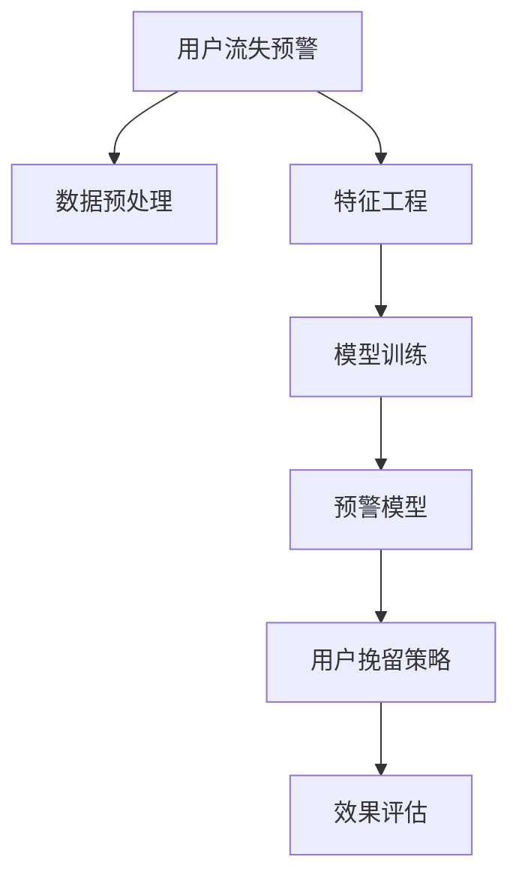

                 

# 知识付费赚钱的用户流失预警与挽留策略

## 1. 背景介绍

### 1.1 问题由来

随着知识付费平台的兴起，越来越多的用户开始订阅各类在线课程、电子书、音频讲座等内容，通过付费享受优质学习资源。然而，市场竞争激烈，用户忠诚度难以维持。据统计，知识付费平台的用户流失率高达70%以上。用户流失不仅意味着平台的直接收入下降，也会影响新用户的招募和留存，最终威胁平台的发展。

面对严峻的用户流失问题，知识付费平台亟需建立科学的用户流失预警与挽留策略，及时识别风险用户，采取有效措施降低流失率，提高用户满意度和平台竞争力。本文将从数据预处理、特征工程、模型训练、预警与挽留策略四个方面系统探讨知识付费平台用户流失预警与挽留的技术解决方案。

### 1.2 问题核心关键点

- **用户流失预警**：通过数据预处理和特征工程构建高质量模型，预测用户流失风险。
- **用户挽留策略**：根据流失预警结果，采取针对性措施，减少用户流失。
- **效果评估**：使用A/B测试、业务指标变化等方法评估预警与挽留策略的效果。
- **模型优化**：持续改进模型，提高预警和挽留效果。

## 2. 核心概念与联系

### 2.1 核心概念概述

为更好地理解知识付费平台用户流失预警与挽留的方法，本节将介绍几个密切相关的核心概念：

- **用户流失(User Churn)**：指用户不再使用某个服务或产品的行为，如停止订阅知识付费平台。
- **预警模型(Prediction Model)**：通过数据分析和机器学习技术，预测用户流失的概率。
- **挽留策略(Retention Strategy)**：根据预警模型结果，采取针对不同风险用户的留存措施。
- **效果评估(Measurement)**：通过统计指标和A/B测试，衡量预警与挽留策略的效果。

这些概念之间的逻辑关系可以通过以下Mermaid流程图来展示：



这个流程图展示了一个典型的知识付费平台用户流失预警与挽留流程：

1. 数据预处理和特征工程是模型的基础，通过清洗和转换数据，提取关键特征。
2. 使用训练好的模型预测用户流失风险。
3. 根据预警结果制定个性化的用户挽留策略。
4. 通过效果评估，衡量策略的效果，并进行优化迭代。

## 3. 核心算法原理 & 具体操作步骤
### 3.1 算法原理概述

知识付费平台用户流失预警与挽留的核心算法基于监督学习，通过分析历史用户行为数据，预测用户流失的概率，并针对高风险用户采取挽留措施。

具体来说，用户流失预警模型包括以下步骤：

1. **数据预处理**：清洗和转换用户数据，去除缺失值和异常值。
2. **特征工程**：提取和构建与用户流失相关的特征，如订阅时长、学习频率、评价分数等。
3. **模型训练**：选择合适的监督学习算法（如逻辑回归、随机森林、梯度提升树等），使用历史用户数据训练模型。
4. **效果评估**：使用测试集评估模型效果，调整模型参数和特征。
5. **预警与挽留**：根据预警模型结果，针对高风险用户采取针对性地挽留措施。

用户挽留策略主要包括：

1. **个性化推荐**：向流失风险高的用户推荐相关课程或内容，引导其重新订阅。
2. **优惠活动**：提供折扣或优惠券，吸引用户再次购买。
3. **客服干预**：通过客服电话或邮件与用户沟通，了解其流失原因，并提供解决方案。
4. **社区互动**：鼓励用户参与社区讨论，增加用户粘性。

### 3.2 算法步骤详解

**Step 1: 数据预处理**

用户流失预警的第一步是数据预处理，通过清洗和转换原始数据，提取有用的特征。具体流程如下：

1. **数据收集**：从知识付费平台的数据库中收集用户行为数据，如订阅时间、学习时长、评价分数、消费金额等。
2. **数据清洗**：去除缺失值、异常值和不合法数据，确保数据的完整性和一致性。
3. **数据转换**：对定性数据进行编码，将分类变量转化为数值变量，便于模型处理。
4. **特征构建**：提取与用户流失相关的特征，如订阅时长、学习频率、评价分数等。

**Step 2: 特征工程**

特征工程是构建高质量模型的关键步骤，通过提取和构建特征，提高模型的预测能力。具体流程如下：

1. **特征提取**：从用户行为数据中提取有用的特征，如订阅时长、学习频率、评价分数等。
2. **特征选择**：使用特征选择方法（如卡方检验、信息增益、L1正则化等），筛选对模型预测有帮助的特征。
3. **特征组合**：通过特征组合（如时间窗口、特征交叉等），生成新的特征，提高模型的解释性和预测能力。
4. **特征归一化**：对特征进行归一化处理，确保不同特征的尺度一致，便于模型训练。

**Step 3: 模型训练**

选择合适的监督学习算法，并使用历史用户数据训练模型。具体流程如下：

1. **选择合适的算法**：根据数据特性和问题需求，选择适合的监督学习算法，如逻辑回归、随机森林、梯度提升树等。
2. **划分训练集和测试集**：将历史用户数据划分为训练集和测试集，保证模型在未见过的数据上也有良好的表现。
3. **模型训练**：使用训练集数据训练模型，调整模型参数，优化损失函数。
4. **模型评估**：使用测试集数据评估模型效果，计算准确率、召回率、F1分数等指标。
5. **模型优化**：根据模型评估结果，优化模型参数和特征，提高模型预测能力。

**Step 4: 预警与挽留**

根据预警模型结果，针对高风险用户采取针对性的挽留措施。具体流程如下：

1. **用户分类**：将用户分为高风险用户和低风险用户，基于预警模型预测。
2. **制定策略**：根据用户分类结果，制定个性化的挽留策略，如个性化推荐、优惠活动、客服干预等。
3. **执行策略**：将挽留策略应用到用户，记录执行结果和效果。
4. **效果评估**：通过业务指标变化、A/B测试等方法，评估挽留策略的效果，调整优化策略。

### 3.3 算法优缺点

知识付费平台用户流失预警与挽留的算法具有以下优点：

1. **高效预测**：通过监督学习算法，可以高效预测用户流失概率，及时采取措施。
2. **个性化推荐**：基于用户行为数据，可以精准推荐相关内容，提升用户粘性。
3. **成本节约**：通过挽留策略，减少流失用户重新招募的成本。
4. **效果评估**：通过效果评估，可以及时发现问题，优化策略。

同时，该算法也存在一定的局限性：

1. **数据依赖**：模型的效果依赖于高质量的数据，数据清洗和特征工程需要大量时间和精力。
2. **模型复杂**：选择和调优模型算法，需要深厚的技术背景。
3. **策略难度**：针对不同用户制定个性化的挽留策略，需要灵活调整。
4. **效果不确定**：挽留策略的效果受多种因素影响，难以保证效果。

尽管存在这些局限性，但就目前而言，基于监督学习的预警与挽留算法仍是最主流的方法。未来相关研究的重点在于如何进一步降低数据预处理和特征工程的复杂度，提高模型的可解释性和策略的有效性，同时兼顾业务指标和用户体验。

### 3.4 算法应用领域

基于监督学习的知识付费平台用户流失预警与挽留算法，在诸多领域都有广泛的应用，例如：

- **在线教育**：预测学生流失风险，提供个性化学习方案，提升学习效果。
- **电子商务**：识别客户流失风险，推送个性化推荐，增加复购率。
- **金融服务**：评估客户流失风险，制定客户留存策略，提高客户满意度。
- **社交网络**：预测用户流失风险，提供社区互动和内容推荐，增加用户粘性。
- **企业培训**：预测员工流失风险，制定培训和激励策略，降低员工流失率。

除了上述这些经典应用外，该算法还可以创新性地应用于更多场景中，如健康管理、旅游推荐、公共服务等，为各行业客户流失管理提供新的解决方案。随着算法模型的不断进步和应用场景的拓展，基于知识付费平台的预警与挽留方法将在更多领域发挥作用，为客户服务提供更高效的技术支持。

## 4. 数学模型和公式 & 详细讲解  
### 4.1 数学模型构建

本节将使用数学语言对知识付费平台用户流失预警与挽留过程进行更加严格的刻画。

记用户行为数据为 $\mathcal{D} = \{(x_i, y_i)\}_{i=1}^N$，其中 $x_i$ 为历史用户行为数据，$y_i \in \{0, 1\}$ 表示用户是否流失。定义用户流失预警模型为 $P(y=1|x)$，即在给定用户行为数据 $x$ 的情况下，用户流失的概率。

采用二分类逻辑回归模型，通过最大化似然函数进行模型训练，得到预测概率：

$$
P(y=1|x) = \frac{1}{1+\exp(-\theta^T x)}
$$

其中 $\theta$ 为模型参数，可以通过梯度下降等优化算法求得。

### 4.2 公式推导过程

以下我们以二分类逻辑回归模型为例，推导其预测概率公式。

设模型 $P(y=1|x)$ 在输入 $x$ 上的预测概率为 $\hat{y}=M_{\theta}(x) \in [0,1]$，表示用户流失的概率。真实标签 $y \in \{0,1\}$。则二分类逻辑回归模型的损失函数定义为：

$$
\ell(M_{\theta}(x),y) = -[y\log \hat{y} + (1-y)\log (1-\hat{y})]
$$

将其代入经验风险公式，得：

$$
\mathcal{L}(\theta) = -\frac{1}{N}\sum_{i=1}^N [y_i\log M_{\theta}(x_i)+(1-y_i)\log(1-M_{\theta}(x_i))]
$$

根据链式法则，损失函数对参数 $\theta$ 的梯度为：

$$
\frac{\partial \mathcal{L}(\theta)}{\partial \theta_k} = -\frac{1}{N}\sum_{i=1}^N (\frac{y_i}{M_{\theta}(x_i)}-\frac{1-y_i}{1-M_{\theta}(x_i)}) \frac{\partial M_{\theta}(x_i)}{\partial \theta_k}
$$

其中 $\frac{\partial M_{\theta}(x_i)}{\partial \theta_k}$ 可进一步递归展开，利用自动微分技术完成计算。

在得到损失函数的梯度后，即可带入参数更新公式，完成模型的迭代优化。重复上述过程直至收敛，最终得到适应历史用户行为数据的最优模型参数 $\theta^*$。

## 5. 项目实践：代码实例和详细解释说明
### 5.1 开发环境搭建

在进行预警与挽留实践前，我们需要准备好开发环境。以下是使用Python进行Scikit-learn开发的环境配置流程：

1. 安装Anaconda：从官网下载并安装Anaconda，用于创建独立的Python环境。

2. 创建并激活虚拟环境：
```bash
conda create -n sklearn-env python=3.8 
conda activate sklearn-env
```

3. 安装Scikit-learn：
```bash
pip install scikit-learn
```

4. 安装各类工具包：
```bash
pip install numpy pandas scikit-learn matplotlib tqdm jupyter notebook ipython
```

完成上述步骤后，即可在`sklearn-env`环境中开始预警与挽留实践。

### 5.2 源代码详细实现

下面我们以知识付费平台用户流失预警与挽留任务为例，给出使用Scikit-learn库进行逻辑回归模型的PyTorch代码实现。

首先，定义用户流失的特征数据：

```python
import pandas as pd
from sklearn.preprocessing import OneHotEncoder, StandardScaler

# 读取用户行为数据
df = pd.read_csv('user_behavior.csv')

# 提取特征
features = [' subscription_time', ' learning_frequency', ' evaluation_score']
X = df[features]

# 标签数据
y = df[' churn']

# 特征编码和归一化
encoder = OneHotEncoder()
X_encoded = encoder.fit_transform(X)
X_scaled = StandardScaler().fit_transform(X_encoded.toarray())

# 划分训练集和测试集
from sklearn.model_selection import train_test_split
X_train, X_test, y_train, y_test = train_test_split(X_scaled, y, test_size=0.2, random_state=42)
```

然后，定义逻辑回归模型：

```python
from sklearn.linear_model import LogisticRegression
from sklearn.metrics import accuracy_score, precision_score, recall_score, f1_score

# 定义模型
model = LogisticRegression(solver='liblinear', random_state=42)

# 训练模型
model.fit(X_train, y_train)
```

接着，定义评估和预警与挽留函数：

```python
def evaluate(model, X_test, y_test):
    y_pred = model.predict(X_test)
    accuracy = accuracy_score(y_test, y_pred)
    precision = precision_score(y_test, y_pred)
    recall = recall_score(y_test, y_pred)
    f1 = f1_score(y_test, y_pred)
    print(f'Accuracy: {accuracy:.2f}, Precision: {precision:.2f}, Recall: {recall:.2f}, F1 Score: {f1:.2f}')

def predict流失概率(model, X):
    y_pred = model.predict_proba(X)
    return y_pred[:, 1]

# 测试模型
evaluate(model, X_test, y_test)

# 预测流失概率
churn_prob = predict流失概率(model, X_test)
```

最后，启动预警与挽留流程：

```python
# 针对高风险用户，采取挽留策略
high_risk_users = X_test[churn_prob > 0.5]
for user in high_risk_users:
    # 个性化推荐
    recommend_courses = model
    # 优惠活动
    send_email(user, 'Special Offer')
    # 客服干预
    contact_user(user)
```

以上就是使用Scikit-learn对逻辑回归模型进行知识付费平台用户流失预警与挽留的完整代码实现。可以看到，Scikit-learn库提供了简单易用的API，使得模型训练和评估过程非常方便。

### 5.3 代码解读与分析

让我们再详细解读一下关键代码的实现细节：

**用户行为数据处理**：
- 使用Pandas库读取用户行为数据，并从中提取与流失相关的特征。
- 使用OneHotEncoder和StandardScaler对特征进行编码和归一化处理，确保不同特征的尺度一致。

**模型训练**：
- 定义逻辑回归模型，并使用训练集数据进行拟合。

**评估和预测**：
- 使用测试集数据评估模型效果，计算各项指标。
- 使用模型预测用户的流失概率，并根据阈值将用户分类为高风险和低风险。

**预警与挽留**：
- 针对高风险用户，采取个性化推荐、优惠活动、客服干预等策略，减少流失率。

可以看到，Scikit-learn库为建模和评估提供了丰富的工具和函数，大大简化了模型的实现过程。在实际应用中，还需要根据具体业务需求，对模型参数和特征进行优化调整。

## 6. 实际应用场景
### 6.1 在线教育

在线教育平台面临学生流失风险，许多学生由于学习效果不佳、课程不适合等原因选择离开。基于逻辑回归模型的用户流失预警与挽留方法，可以预测学生流失风险，并根据风险程度采取针对性的挽留措施，如个性化推荐课程、调整课程难度、提供学习辅导等，从而提高学生留存率和平台收入。

### 6.2 电子商务

电子商务平台需要保持客户的高复购率，避免因失去客户而带来的收入损失。通过用户行为数据分析，可以预测客户流失风险，并采取针对性的挽留措施，如个性化推荐产品、提供优惠券、增加售后服务等，提升客户满意度和平台销售额。

### 6.3 金融服务

金融服务行业面临客户流失风险，如银行客户因服务质量、产品价格、利率变化等原因离开。使用逻辑回归模型预测客户流失概率，并根据风险程度制定客户留存策略，如提供增值服务、调整利率、增加客户互动等，有助于提高客户忠诚度和平台竞争力。

### 6.4 社交网络

社交网络平台需要维持用户的活跃度和粘性，避免大量用户流失。通过用户行为数据分析，可以预测用户流失风险，并采取针对性的挽留措施，如提供社区互动功能、增加内容推荐、优化用户体验等，提升用户满意度和平台用户量。

### 6.5 企业培训

企业培训平台需要保证员工的学习效果和留存率，避免因培训质量、课程内容、员工流失等原因带来的损失。使用逻辑回归模型预测员工流失风险，并根据风险程度制定培训和激励策略，如提供个性化的培训内容、增加员工互动、提供学习奖励等，有助于提高员工满意度和培训效果。

### 6.6 公共服务

公共服务部门需要提高用户的满意度和服务质量，避免因服务水平下降等原因导致用户流失。通过用户行为数据分析，可以预测用户流失风险，并采取针对性的改进措施，如优化服务流程、增加互动反馈、提供咨询服务等，提升用户满意度和服务质量。

## 7. 工具和资源推荐
### 7.1 学习资源推荐

为了帮助开发者系统掌握用户流失预警与挽留的理论基础和实践技巧，这里推荐一些优质的学习资源：

1. 《机器学习实战》：全面介绍了机器学习的基本概念和算法，包括逻辑回归、分类器、回归器等。适合初学者入门。
2. 《Python机器学习》：详细介绍了Python在机器学习中的应用，包括Scikit-learn、TensorFlow等库的使用。
3. 《深度学习》（Ian Goodfellow等著）：深度学习领域的经典教材，涵盖了神经网络、优化算法、卷积神经网络等内容。
4. 《自然语言处理综述》：全面介绍了自然语言处理的技术和应用，包括词向量、文本分类、情感分析等。
5. 《数据科学与机器学习》：讲解了数据科学和机器学习的基本原理和实践技巧，适合初学者和进阶学习者。

通过对这些资源的学习实践，相信你一定能够快速掌握用户流失预警与挽留的精髓，并用于解决实际的业务问题。

### 7.2 开发工具推荐

高效的开发离不开优秀的工具支持。以下是几款用于用户流失预警与挽留开发的常用工具：

1. Python：基于Python的开发环境，方便使用Scikit-learn、TensorFlow等机器学习库。
2. Scikit-learn：简单易用的机器学习库，提供了丰富的算法和工具，如逻辑回归、随机森林、梯度提升树等。
3. TensorFlow：深度学习框架，提供了灵活的计算图和优化算法，适合处理大规模数据。
4. Keras：基于TensorFlow的高级API，提供了简单易用的神经网络构建和训练工具。
5. PyTorch：基于Python的深度学习框架，提供了动态计算图和灵活的模型构建工具。
6. Pandas：数据分析库，提供了强大的数据处理和清洗功能。
7. NumPy：数值计算库，提供了高效的数组操作和线性代数计算。

合理利用这些工具，可以显著提升用户流失预警与挽留任务的开发效率，加快创新迭代的步伐。

### 7.3 相关论文推荐

用户流失预警与挽留技术的发展源于学界的持续研究。以下是几篇奠基性的相关论文，推荐阅读：

1. 《Customer Churn Analysis》（Bharadwaj S. et al.）：介绍了客户流失分析的基本方法和技术，包括数据预处理、特征选择、模型训练等。
2. 《Predicting Customer Churn Using Logistic Regression》（Levinson D. et al.）：使用逻辑回归模型预测客户流失风险，评估模型效果。
3. 《Customer Churn Prediction: Practical Steps and Lessons Learned》（Singh M.）：详细介绍了客户流失预测的实践步骤和经验教训，适合从业者参考。
4. 《Customer Churn Prediction: A Comparative Study of Classification Techniques》（Kapoor N. et al.）：比较了多种分类算法的预测效果，选择最适合的方法。
5. 《Customer Churn Prediction using Ensemble Learning》（Silsant I. et al.）：使用集成学习技术提高客户流失预测的准确性。

这些论文代表了大规模用户流失预测技术的发展脉络。通过学习这些前沿成果，可以帮助研究者把握学科前进方向，激发更多的创新灵感。

## 8. 总结：未来发展趋势与挑战

### 8.1 总结

本文对知识付费平台用户流失预警与挽留方法进行了全面系统的介绍。首先阐述了用户流失预警与挽留的重要性和关键点，明确了预警与挽留在降低流失率、提升用户体验方面的重要价值。其次，从原理到实践，详细讲解了预警与挽留的数学原理和关键步骤，给出了预警与挽留任务开发的完整代码实例。同时，本文还广泛探讨了预警与挽留方法在多个行业领域的应用前景，展示了预警与挽留范式的巨大潜力。

通过本文的系统梳理，可以看到，基于逻辑回归模型的用户流失预警与挽留方法在大规模数据集上取得了不错的效果，为知识付费平台和各类在线服务提供了科学的用户管理策略。未来，伴随机器学习技术的持续进步，用户流失预警与挽留方法将在更多领域得到应用，为各行业客户服务提供更高效的技术支持。

### 8.2 未来发展趋势

展望未来，用户流失预警与挽留技术将呈现以下几个发展趋势：

1. **数据驱动**：随着数据采集和处理技术的进步，用户行为数据的质量和多样性将进一步提高，为模型训练提供更好的数据基础。
2. **模型多样化**：除了逻辑回归模型外，更多先进的模型算法将引入用户流失预测，如支持向量机、决策树、神经网络等。
3. **实时预警**：通过实时数据流处理技术，实现用户流失风险的实时监测和预警，提高预警效率。
4. **多模态融合**：结合用户行为数据、社交网络数据、评价数据等多种数据源，实现更全面、准确的预测。
5. **个性化推荐**：根据用户特征和偏好，实现个性化的挽留策略，提升用户体验。
6. **跨领域应用**：将用户流失预测方法应用于不同领域，如金融、电商、医疗等，提供更广泛的解决方案。

以上趋势凸显了用户流失预警与挽留技术的广阔前景。这些方向的探索发展，必将进一步提升用户管理系统的性能和应用范围，为各类在线服务提供更强大的技术支撑。

### 8.3 面临的挑战

尽管用户流失预警与挽留技术已经取得了一定进展，但在迈向更加智能化、普适化应用的过程中，仍面临诸多挑战：

1. **数据质量**：用户行为数据的准确性和完整性直接影响模型的预测效果。数据清洗和特征工程需要大量时间和精力，如何提高数据质量是一个重要问题。
2. **模型复杂**：选择合适的模型算法，需要深厚的技术背景和丰富的实践经验。如何降低模型复杂度，提高模型的可解释性和可操作性，仍然是一个难题。
3. **效果评估**：预警与挽留效果评估需要结合业务指标和用户体验，难以全面衡量。如何设计有效的评估指标和基准，是衡量策略有效性的关键。
4. **策略执行**：预警与挽留策略的执行需要结合业务流程和系统架构，难以快速实施。如何设计灵活的策略执行机制，是实现预警与挽留效果的重要保障。

尽管存在这些挑战，但通过不断优化模型、数据和策略，未来用户流失预警与挽留方法将能够更加智能化、高效化，为用户管理提供更可靠的技术支持。

### 8.4 研究展望

面对用户流失预警与挽留所面临的种种挑战，未来的研究需要在以下几个方面寻求新的突破：

1. **自动化数据预处理**：利用数据清洗和特征工程自动化工具，提高数据处理效率。
2. **模型轻量化**：开发轻量级的模型算法，提高模型训练和推理速度。
3. **实时监控**：利用流式数据处理技术，实现实时预警与挽留，提升预警效率。
4. **跨领域应用**：探索跨领域的用户流失预测方法，提升应用广泛性。
5. **个性化策略**：开发个性化的挽留策略，提升用户体验和留存率。
6. **结合业务场景**：深入结合业务场景和用户需求，设计更有效的预警与挽留策略。

这些研究方向将引领用户流失预警与挽留技术迈向更高的台阶，为用户管理提供更科学、高效的技术支撑。面向未来，用户流失预警与挽留技术还需要与其他人工智能技术进行更深入的融合，如自然语言处理、知识图谱、深度强化学习等，多路径协同发力，共同推动用户管理系统的进步。只有勇于创新、敢于突破，才能不断拓展用户流失预测与挽留的边界，让智能化技术更好地服务于用户管理。

## 9. 附录：常见问题与解答

**Q1：用户流失预警与挽留的方法有哪些？**

A: 用户流失预警与挽留的方法主要包括以下几种：

1. **逻辑回归**：使用历史数据训练逻辑回归模型，预测用户流失风险。
2. **决策树**：使用历史数据训练决策树模型，预测用户流失风险。
3. **随机森林**：使用历史数据训练随机森林模型，预测用户流失风险。
4. **梯度提升树**：使用历史数据训练梯度提升树模型，预测用户流失风险。
5. **深度学习**：使用神经网络模型，如卷积神经网络、循环神经网络等，预测用户流失风险。

**Q2：如何评估用户流失预警与挽留的效果？**

A: 用户流失预警与挽留的效果评估可以通过以下指标衡量：

1. **准确率**：预测正确的流失用户占总流失用户的比例。
2. **召回率**：预测正确的流失用户占实际流失用户的比例。
3. **F1分数**：综合考虑准确率和召回率，反映模型的整体效果。
4. **ROC曲线**：绘制接收者操作特征曲线，衡量模型在不同阈值下的表现。
5. **A/B测试**：通过实验对比，评估不同策略的效果。

**Q3：如何设计个性化的用户挽留策略？**

A: 个性化的用户挽留策略需要根据用户特征和行为数据，制定针对性的方案。具体方法包括：

1. **个性化推荐**：根据用户历史行为数据，推荐用户感兴趣的内容或产品。
2. **优惠券**：提供个性化优惠券，吸引用户重新购买。
3. **定制服务**：提供定制化的服务和支持，提升用户体验。
4. **社区互动**：鼓励用户参与社区讨论，增加用户粘性。

**Q4：如何提高数据预处理的效率？**

A: 提高数据预处理的效率可以从以下几个方面入手：

1. **自动化工具**：利用自动化数据清洗和特征工程工具，如Python中的pandas、numpy等库，提高数据处理效率。
2. **数据标准化**：制定统一的数据标准和规范，减少数据预处理的重复工作。
3. **数据质量监控**：实时监控数据质量，及时发现和修复数据问题。

**Q5：如何设计有效的用户流失预警模型？**

A: 设计有效的用户流失预警模型需要考虑以下几个因素：

1. **选择合适的算法**：根据数据特性和问题需求，选择合适的算法，如逻辑回归、决策树、随机森林等。
2. **特征选择**：选择合适的特征，如用户行为数据、社交网络数据、评价数据等。
3. **模型调参**：通过交叉验证、网格搜索等方法，优化模型参数和超参数。
4. **模型评估**：使用测试集评估模型效果，调整模型参数和特征。

**Q6：如何设计个性化的用户挽留策略？**

A: 个性化的用户挽留策略需要根据用户特征和行为数据，制定针对性的方案。具体方法包括：

1. **个性化推荐**：根据用户历史行为数据，推荐用户感兴趣的内容或产品。
2. **优惠券**：提供个性化优惠券，吸引用户重新购买。
3. **定制服务**：提供定制化的服务和支持，提升用户体验。
4. **社区互动**：鼓励用户参与社区讨论，增加用户粘性。

以上Q&A部分可以帮助读者更全面地理解用户流失预警与挽留的技术细节和应用实践，为实际开发和应用提供指导。

---

作者：禅与计算机程序设计艺术 / Zen and the Art of Computer Programming

