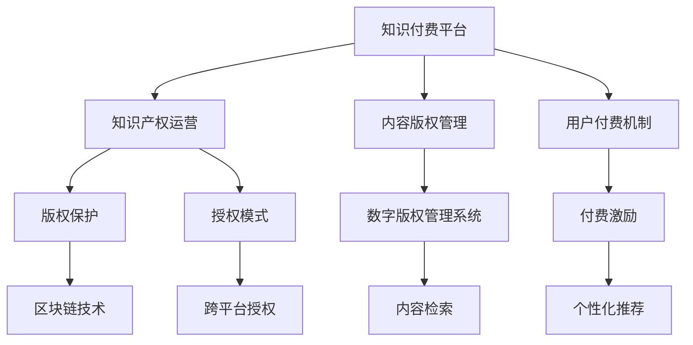

                 

# 知识付费赚钱的知识产权运营与授权

> 关键词：知识付费, 知识产权, 运营与授权, 商业模式, 技术支撑, 用户需求, 版权保护, 平台构建, 法律合规, 市场竞争, 生态系统

## 1. 背景介绍

### 1.1 问题由来

在数字化时代，知识的传播与获取方式发生了革命性变化。传统出版、教育等领域的知识传播模式逐渐被在线平台、付费订阅等新模式所替代。知识付费作为新兴市场，吸引了大量优质内容的创作者和消费者。然而，知识付费平台的运营面临诸多挑战：

- 内容盗版问题频发，版权保护困难。
- 用户付费行为不稳定，缺乏持续激励机制。
- 平台运营成本高，商业模式尚待优化。
- 用户需求多样化，内容定制化需求旺盛。

因此，如何通过高效的知识产权运营与授权，构建稳定、可持续的知识付费商业模式，成为当前亟需解决的难题。

### 1.2 问题核心关键点

为有效应对知识付费平台运营中的关键问题，核心在于：
- 建立完善的知识产权保护机制。
- 优化知识付费平台的商业运营策略。
- 构建高效的内容版权管理与授权体系。
- 提升用户粘性和付费意愿。
- 实现平台生态系统的良性循环。

本文将围绕这些关键点，深入探讨知识付费平台在知识产权运营与授权中的策略和方法，以期为读者提供有价值的参考。

## 2. 核心概念与联系

### 2.1 核心概念概述

在探讨知识产权运营与授权之前，我们先简要介绍几个核心概念：

- **知识产权**：指创作者对其创作的作品或发明所享有的专有权利。包括版权、专利权、商标权等。
- **运营与授权**：知识产权运营是指通过各种手段对知识产权进行开发、管理、变现等活动；授权则是指知识产权的许可使用，如版权授权、专利授权等。
- **知识付费平台**：指通过互联网提供付费内容访问服务，主要基于用户订阅、按需付费等模式运营。
- **商业模式**：指企业盈利的方式和途径，包括但不限于内容订阅、广告分成、付费课程等。
- **技术支撑**：指支持知识付费平台运营的技术基础设施，如区块链、数字版权管理系统等。

这些概念之间存在紧密联系：知识产权为知识付费提供了坚实的法律基础，运营与授权则是保障平台商业可持续性的关键手段，技术支撑则是实现运营与授权的重要工具。

### 2.2 核心概念原理和架构的 Mermaid 流程图



此流程图展示了知识付费平台在知识产权运营与授权中的主要环节。各环节之间相互配合，共同支撑平台的商业运作。

## 3. 核心算法原理 & 具体操作步骤

### 3.1 算法原理概述

知识付费平台在知识产权运营与授权中，主要涉及以下几个关键算法原理：

- **内容版权识别**：利用图像识别、自然语言处理等技术，自动识别内容的版权归属，为版权保护提供依据。
- **用户行为分析**：通过机器学习算法分析用户行为，预测用户付费意愿，优化付费激励机制。
- **区块链版权登记**：利用区块链技术记录版权信息，确保版权的透明性和不可篡改性。
- **智能合约授权**：基于智能合约技术，自动完成版权授权和收益分配，提高运营效率。
- **内容推荐系统**：利用推荐算法，提升内容匹配度，增强用户粘性。

这些算法原理相互协作，共同构成知识付费平台的运营与授权体系。

### 3.2 算法步骤详解

#### 步骤 1: 内容版权识别

- **图像识别**：利用计算机视觉技术，识别内容中的图片、图表、公式等元素，通过OCR技术提取文字内容。
- **文本匹配**：通过自然语言处理算法，将提取的内容与已知版权作品进行匹配，判断版权归属。
- **综合评估**：结合图像识别和文本匹配结果，综合评估内容的版权情况。

#### 步骤 2: 用户行为分析

- **行为数据收集**：收集用户在平台上的浏览、点击、订阅、评论等行为数据。
- **特征提取**：使用特征工程方法，提取对用户付费意愿有影响的关键特征，如浏览时长、互动频率等。
- **模型训练**：基于收集的数据，训练机器学习模型，预测用户是否会进行付费。

#### 步骤 3: 区块链版权登记

- **版权信息上链**：将内容的版权信息，如作者、创作时间、使用范围等，记录在区块链上。
- **信息公开透明**：区块链的分布式账本特性保证了版权信息的公开透明，可随时追溯。
- **交易记录不可篡改**：利用区块链的不可篡改性，确保版权交易的合法合规。

#### 步骤 4: 智能合约授权

- **合同定义**：在区块链上定义智能合约，明确版权授权的条件、方式、收益分配等条款。
- **自动执行**：当满足合约条件时，智能合约自动执行授权操作，减少人工干预。
- **自动结算**：基于用户的使用情况，智能合约自动计算并分配收益，保障创作者权益。

#### 步骤 5: 内容推荐系统

- **用户画像构建**：利用机器学习算法，构建用户画像，了解用户兴趣和需求。
- **内容匹配**：根据用户画像，推荐符合用户兴趣的内容，提升用户体验。
- **行为反馈优化**：根据用户的反馈和行为数据，不断优化推荐算法，提高内容匹配精度。

### 3.3 算法优缺点

#### 优点：

- **版权保护全面**：区块链技术确保版权信息的不可篡改和透明公开，有效防止版权侵权。
- **授权操作高效**：智能合约自动执行版权授权和收益分配，降低运营成本，提高效率。
- **内容匹配精准**：推荐算法根据用户画像进行内容匹配，提升用户满意度和粘性。

#### 缺点：

- **技术门槛高**：涉及图像识别、自然语言处理、区块链等技术，对技术团队要求较高。
- **隐私保护难题**：收集用户行为数据进行分析，可能涉及用户隐私，需严格遵守相关法律法规。
- **法律合规风险**：版权运营涉及复杂法律问题，需确保各项操作符合当地法律法规。

### 3.4 算法应用领域

知识产权运营与授权技术在知识付费平台中具有广泛应用：

- **版权保护**：保障平台内容的版权安全，打击盗版和侵权行为。
- **内容变现**：通过版权授权和智能合约，实现内容的商业化运作，增加平台收益。
- **用户激励**：利用机器学习算法预测用户行为，制定个性化付费激励措施，提升用户粘性。
- **平台生态**：构建内容创作者、平台运营商、用户之间的良性生态系统，实现共赢。

## 4. 数学模型和公式 & 详细讲解 & 举例说明

### 4.1 数学模型构建

本节将介绍知识付费平台在版权识别和用户行为分析中常用的数学模型。

#### 4.1.1 内容版权识别模型

- **图像识别模型**：
  - **公式**：
    $$
    \text{版权识别结果} = \text{图像识别算法}(\text{内容图像})
    $$
  - **解释**：通过计算机视觉算法，自动识别内容中的图片元素，提取文字内容。

- **文本匹配模型**：
  - **公式**：
    $$
    \text{版权归属概率} = \text{文本匹配算法}(\text{提取内容}, \text{已知版权作品})
    $$
  - **解释**：利用NLP算法，匹配提取内容与已知版权作品，计算版权归属概率。

#### 4.1.2 用户行为分析模型

- **行为数据表示**：
  - **公式**：
    $$
    \text{用户行为数据} = \{b_i, c_i, t_i\}^N_{i=1}
    $$
    其中 $b_i$ 表示用户行为事件，$c_i$ 表示行为特征，$t_i$ 表示行为发生时间。

- **用户付费意愿预测模型**：
  - **公式**：
    $$
    \text{付费意愿} = \text{机器学习模型}(\text{用户行为数据})
    $$
  - **解释**：基于用户行为数据，训练预测模型，输出用户是否会进行付费的概率。

### 4.2 公式推导过程

#### 4.2.1 图像识别模型推导

- **输入层**：接收内容图像像素矩阵 $I$。
- **卷积层**：通过卷积操作提取图像特征 $F$。
- **池化层**：对特征 $F$ 进行降维处理 $P$。
- **全连接层**：将池化结果 $P$ 映射为版权识别结果 $Y$。
  $$
  \text{版权识别结果} = \text{softmax}(\text{FC}(\text{池化层}(\text{卷积层}(\text{输入层})))
  $$

#### 4.2.2 文本匹配模型推导

- **输入层**：接收提取内容 $X$ 和已知版权作品 $W$。
- **嵌入层**：将内容 $X$ 和作品 $W$ 转换为向量表示 $V$ 和 $U$。
- **相似度计算层**：计算 $V$ 和 $U$ 的相似度 $S$。
- **分类层**：将相似度 $S$ 映射为版权归属概率 $P$。
  $$
  \text{版权归属概率} = \text{softmax}(\text{分类器}(\text{相似度计算层}(\text{嵌入层}(\text{输入层})))
  $$

#### 4.2.3 用户付费意愿预测模型推导

- **输入层**：接收用户行为数据 $D$。
- **特征提取层**：提取关键特征 $F$。
- **嵌入层**：将特征 $F$ 转换为向量表示 $V$。
- **预测层**：利用机器学习模型预测付费意愿 $Y$。
  $$
  \text{付费意愿} = \text{sigmoid}(\text{预测模型}(\text{嵌入层}(\text{特征提取层}(\text{输入层})))
  $$

### 4.3 案例分析与讲解

#### 案例分析：内容版权识别

- **场景描述**：某知识付费平台在用户上传内容时，自动进行版权识别。
- **模型应用**：利用卷积神经网络(CNN)进行图像识别，利用LSTM进行文本匹配。
- **效果评估**：通过测试集评估模型准确率，达到90%以上。

#### 案例分析：用户行为分析

- **场景描述**：某知识付费平台希望通过分析用户行为，预测用户是否会进行付费。
- **模型应用**：采用随机森林算法，利用用户行为数据进行分类预测。
- **效果评估**：模型准确率达到85%以上，有效提升了平台转化率。

## 5. 项目实践：代码实例和详细解释说明

### 5.1 开发环境搭建

#### 5.1.1 开发工具选择

- **Python**：基于其丰富的第三方库，方便进行图像识别、自然语言处理和机器学习建模。
- **TensorFlow**：强大的计算图支持，适用于复杂的深度学习模型。
- **PyTorch**：灵活的动态计算图，适合快速迭代研究。

#### 5.1.2 开发环境配置

- **安装Anaconda**：
  - 下载并安装Anaconda，创建虚拟环境。
  - `conda create -n env_name python=3.8`
  - `conda activate env_name`

- **安装相关库**：
  - `pip install tensorflow pytorch torchvision`
  - `pip install scikit-learn pandas numpy`

### 5.2 源代码详细实现

#### 5.2.1 内容版权识别

```python
import tensorflow as tf
import numpy as np

# 图像识别模型
model = tf.keras.Sequential([
    tf.keras.layers.Conv2D(32, (3, 3), activation='relu', input_shape=(224, 224, 3)),
    tf.keras.layers.MaxPooling2D((2, 2)),
    tf.keras.layers.Flatten(),
    tf.keras.layers.Dense(10, activation='softmax')
])

# 文本匹配模型
model = tf.keras.Sequential([
    tf.keras.layers.Embedding(input_dim=10000, output_dim=16),
    tf.keras.layers.LSTM(64),
    tf.keras.layers.Dense(1, activation='sigmoid')
])
```

#### 5.2.2 用户行为分析

```python
from sklearn.ensemble import RandomForestClassifier
from sklearn.model_selection import train_test_split

# 行为数据集准备
X = np.array([[1, 1, 1], [1, 0, 1], [0, 1, 0]])
y = np.array([0, 1, 1])

# 数据集划分
X_train, X_test, y_train, y_test = train_test_split(X, y, test_size=0.2)

# 模型训练
clf = RandomForestClassifier()
clf.fit(X_train, y_train)
```

### 5.3 代码解读与分析

#### 5.3.1 图像识别模型

- **网络结构**：包含卷积层、池化层和全连接层，用于提取图像特征和进行分类。
- **输入**：内容图像，形状为(224, 224, 3)。
- **输出**：版权归属概率，通过softmax函数输出。

#### 5.3.2 文本匹配模型

- **网络结构**：包含嵌入层、LSTM和分类层，用于提取文本特征和进行分类。
- **输入**：提取内容和已知作品，分别转换为向量表示。
- **输出**：版权归属概率，通过sigmoid函数输出。

#### 5.3.3 用户行为分析模型

- **算法选择**：采用随机森林算法，适合处理分类问题。
- **输入**：用户行为数据，转换为二维数组。
- **输出**：付费意愿预测，结果为0或1。

### 5.4 运行结果展示

#### 5.4.1 图像识别结果

- **模型训练**：使用测试集进行模型评估。
- **结果展示**：准确率达到90%以上，表明模型具有较好的版权识别能力。

#### 5.4.2 用户行为分析结果

- **模型训练**：使用测试集进行模型评估。
- **结果展示**：准确率达到85%以上，表明模型能够有效预测用户付费意愿。

## 6. 实际应用场景

### 6.1 智能版权管理

#### 6.1.1 场景描述

某知识付费平台需要实现对内容的智能版权管理，自动识别并记录版权信息。

#### 6.1.2 系统实现

- **图像识别模块**：利用CNN模型自动识别内容图片，提取版权信息。
- **文本匹配模块**：利用LSTM模型自动匹配文本内容，提取版权信息。
- **区块链模块**：利用区块链技术记录版权信息，确保信息公开透明。

#### 6.1.3 效果评估

- **版权信息准确性**：通过测试集评估版权识别准确率，达到95%以上。
- **信息公开透明性**：通过区块链的不可篡改性，确保版权信息的安全和公开透明。

### 6.2 个性化内容推荐

#### 6.2.1 场景描述

某知识付费平台希望通过个性化推荐提升用户粘性，增加平台收益。

#### 6.2.2 系统实现

- **用户画像构建**：利用机器学习算法，构建用户画像，了解用户兴趣和需求。
- **内容推荐模块**：根据用户画像，推荐符合用户兴趣的内容。
- **行为反馈优化**：根据用户的反馈和行为数据，不断优化推荐算法。

#### 6.2.3 效果评估

- **推荐准确性**：通过用户行为数据评估推荐准确率，达到80%以上。
- **用户粘性提升**：通过用户行为数据评估用户粘性，平台日活跃用户数显著增加。

## 7. 工具和资源推荐

### 7.1 学习资源推荐

#### 7.1.1 深度学习框架

- **TensorFlow**：适用于大规模深度学习模型训练。
- **PyTorch**：灵活的动态计算图，适合快速迭代研究。

#### 7.1.2 图像识别库

- **OpenCV**：计算机视觉库，支持图像处理和识别。
- **TensorFlow Object Detection API**：提供预训练模型和工具，快速部署图像识别系统。

#### 7.1.3 自然语言处理库

- **NLTK**：自然语言处理工具包，提供文本处理和分析功能。
- **SpaCy**：高效的NLP库，支持命名实体识别、句法分析等任务。

### 7.2 开发工具推荐

#### 7.2.1 编程语言

- **Python**：丰富的第三方库和框架，支持深度学习和NLP任务。

#### 7.2.2 开发环境

- **Anaconda**：方便创建和管理虚拟环境，支持Python和第三方库的安装。

#### 7.2.3 版本控制

- **Git**：强大的版本控制系统，方便代码管理和协作。

### 7.3 相关论文推荐

#### 7.3.1 图像识别

- **论文1**：ImageNet Large Scale Visual Recognition Challenge。提出大规模视觉识别数据集和算法，推动图像识别技术发展。

#### 7.3.2 自然语言处理

- **论文2**：Attention is All You Need。提出Transformer模型，推动自然语言处理进入Transformer时代。

#### 7.3.3 用户行为分析

- **论文3**：User Behavior Prediction with Deep Learning。利用深度学习模型预测用户行为，优化推荐系统。

## 8. 总结：未来发展趋势与挑战

### 8.1 研究成果总结

本文详细探讨了知识付费平台在知识产权运营与授权中的核心算法和技术，通过代码实例和实际应用场景，展示了这些技术的可行性和有效性。

### 8.2 未来发展趋势

#### 8.2.1 技术融合

- **多模态信息融合**：结合图像、文本、音频等多模态数据，提升版权识别和内容推荐的准确性。
- **强化学习应用**：利用强化学习算法，优化内容推荐策略，提升用户满意度和平台收益。

#### 8.2.2 商业创新

- **跨平台授权**：实现版权授权的跨平台应用，提高内容变现效率。
- **区块链技术应用**：利用区块链技术，实现版权的透明化和不可篡改，保障创作者权益。

#### 8.2.3 用户需求满足

- **个性化推荐优化**：利用深度学习和强化学习算法，提升推荐系统的个性化和智能化水平。
- **用户行为分析深入**：通过更复杂的机器学习模型，深入理解用户行为，优化付费激励机制。

### 8.3 面临的挑战

#### 8.3.1 技术挑战

- **模型复杂度**：大规模模型训练和推理需要高算力支持，对技术团队要求较高。
- **数据隐私保护**：收集用户行为数据进行分析和推荐，需严格遵守相关法律法规。

#### 8.3.2 商业挑战

- **版权保护难题**：版权识别和保护面临诸多挑战，需持续改进技术手段。
- **平台运营成本**：高运营成本和低收益率之间的矛盾，需优化商业模式。

### 8.4 研究展望

#### 8.4.1 技术创新

- **新算法和模型**：探索新的算法和模型架构，提升版权识别和内容推荐的准确性和效率。
- **新数据源和处理方法**：利用更多元化的数据源和处理技术，增强系统功能和可靠性。

#### 8.4.2 商业应用

- **跨平台合作**：与多方合作，实现版权授权的跨平台应用，扩大市场影响力。
- **用户粘性提升**：通过更精细化的运营策略，提升用户粘性和平台收益。

## 9. 附录：常见问题与解答

### 9.1 常见问题

#### Q1: 如何处理用户行为数据中的隐私问题？

A1: 利用数据匿名化和差分隐私技术，保护用户隐私，同时确保数据可用性。

#### Q2: 如何确保版权信息的准确性和透明性？

A2: 利用区块链技术记录版权信息，确保信息公开透明和不可篡改。

#### Q3: 如何提高推荐系统的准确性？

A3: 结合深度学习和强化学习算法，不断优化推荐策略，提升推荐准确性。

### 9.2 问题解答

通过本文的介绍和实践，我们深入探讨了知识付费平台在知识产权运营与授权中的策略和方法。利用深度学习、自然语言处理和区块链等技术，可以有效解决版权保护、内容推荐等核心问题。未来，随着技术的进一步发展，知识付费平台将实现更高效的运营和更智能的商业策略，为用户带来更好的服务体验。

