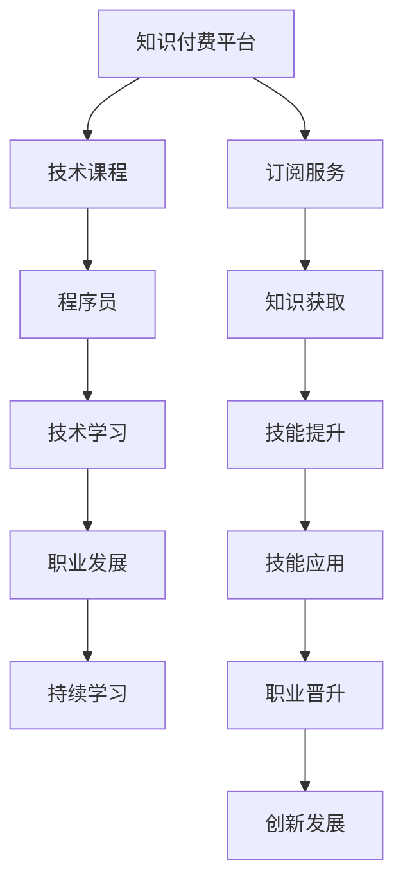

                 

# 知识付费：程序员的投资与回报

> 关键词：知识付费, 投资回报率, 技术学习, 程序员职业发展, 持续学习

## 1. 背景介绍

在互联网时代，信息爆炸和知识更新速度的加快，使得终身学习成为了个人职业发展的重要支柱。尤其对于程序员这一知识密集型职业，持续学习、技能提升成为了不断自我超越的关键。而知识付费作为一种新兴的商业模式，为程序员提供了便捷、高效的学习渠道，同时也带来了新的投资和回报方式。本文将深入探讨知识付费的原理、应用及其对程序员职业发展的深远影响，希望能为每一位追求卓越的程序员提供有价值的参考。

## 2. 核心概念与联系

### 2.1 核心概念概述

**知识付费**：指用户通过支付一定的费用，获取特定知识或技能的一种商业模式。常见的知识付费平台包括但不限于Coursera、Udemy、得到、知乎live等，用户可以在平台上购买或订阅课程、电子书、文章等内容。

**投资回报率(ROI)**：指从投资项目中获得的净收益与初始投资额的比率，是衡量投资效果的重要指标。对于知识付费而言，ROI的计算通常涉及学习成本、时间投入、知识掌握程度、职业发展受益等因素。

**技术学习**：程序员为提升职业技能，通过在线课程、书籍、研讨会等形式，系统性地学习新知识、新工具、新方法的过程。

**程序员职业发展**：程序员通过技术学习，不断提升个人技能，从初级开发者向高级开发者、技术专家、架构师、CTO等职位进化的过程。

**持续学习**：指在职业生涯中，不断获取新知识、新技能，以适应技术快速迭代和职业环境变化的能力。

这些概念之间有着紧密的联系。知识付费为程序员提供了一个高效、便捷的学习渠道，是技术学习的重要手段之一。通过合理的投资，程序员可以获得知识和技能的提升，进而推动职业发展，实现个人和职业的持续成长。

### 2.2 核心概念原理和架构的 Mermaid 流程图



这个流程图展示了知识付费的整个过程和其与程序员职业发展的联系。知识付费平台提供高质量的技术课程，程序员通过订阅服务获取这些课程，并进行系统学习，提升技能，从而推动职业发展，实现持续学习。

## 3. 核心算法原理 & 具体操作步骤

### 3.1 算法原理概述

知识付费的本质是一种通过支付费用获取特定知识的过程。从用户支付费用到获得知识，这一过程中涉及的知识获取、知识吸收、技能提升、职业发展等环节，都可以视为一种算法流程。本文将从学习、技能提升、职业发展的角度，对这一流程进行详细探讨。

### 3.2 算法步骤详解

知识付费的算法步骤大致分为以下几个环节：

1. **知识获取**：选择适合自己的知识付费平台和课程。平台通常提供课程推荐、用户评价、专家介绍等信息，帮助用户筛选和选择。
2. **课程学习**：通过观看视频、阅读文章、完成练习等形式，系统性地学习课程内容。
3. **技能提升**：将所学知识应用于实际项目中，通过实践巩固和提升技能。
4. **职业发展**：通过技能提升，获得更好的职业机会，如职位晋升、项目领导等。
5. **持续学习**：随着技术迭代和职业环境变化，不断获取新知识，保持竞争力。

### 3.3 算法优缺点

知识付费作为一种学习模式，具有以下优点：

- **高效性**：通过平台筛选和推荐，能够快速找到有价值的学习资源。
- **系统性**：课程通常设计成系统化的结构，便于全面掌握某一领域的知识。
- **便捷性**：随时随地通过网络学习，不受时间地点限制。
- **社区支持**：平台上有学习者社区，能够与其他学员交流学习心得，共同进步。

然而，知识付费也存在一些缺点：

- **成本较高**：部分高质量课程费用较高，对于经济条件有限的用户来说可能存在负担。
- **被动学习**：课程学习更多依赖用户的主动性，缺乏主动探索的动力。
- **适应性差**：平台上的课程内容和风格可能无法完全满足每个用户的个性化需求。
- **缺乏实践**：课程内容可能更偏向理论学习，缺乏实际项目的实践经验。

### 3.4 算法应用领域

知识付费在IT行业的应用非常广泛，涵盖了软件开发、数据分析、人工智能、项目管理等多个领域。程序员可以通过知识付费平台获取最新技术动态、学习新工具、提升编程技能，从而在职业发展中保持领先。

## 4. 数学模型和公式 & 详细讲解 & 举例说明

### 4.1 数学模型构建

知识付费的投资回报率可以表示为：

$$ ROI = \frac{Gain - Cost}{Cost} \times 100\% $$

其中：

- $Gain$ 为投资带来的收益，包括技能提升、职位晋升、薪资增长等。
- $Cost$ 为投资的成本，包括课程费用、时间投入、机会成本等。

### 4.2 公式推导过程

为了更好地理解ROI的计算方法，我们以一个简单的例子进行推导：

假设一位程序员购买了某平台的一个高级Java课程，课程费用为$C$，课程内容涵盖了最新的Java框架和技术，总学习时间为$T$，学习后其技能提升使得工作效率提高了20%，一年内新增项目数量增加了30%，额外奖金增加了5000元。

根据公式计算其ROI：

$$ ROI = \frac{(0.2 \times 1.3 \times T \times 5000) - C}{C} \times 100\% $$

在这个例子中，课程费用$C$和总学习时间$T$是固定的，而技能提升带来的收益可以通过具体的效率提升、项目数量增加、奖金增长等实际效果进行量化。

### 4.3 案例分析与讲解

通过上述例子可以看出，知识付费的投资回报率不仅取决于课程本身的质量，还与用户的职业目标、实际收益等密切相关。因此，在选择知识付费平台和课程时，需要进行详细的成本-收益分析，评估其是否值得投资。

## 5. 项目实践：代码实例和详细解释说明

### 5.1 开发环境搭建

知识付费平台的搭建需要具备一定的技术背景和资源投入，以下是使用Python和Flask搭建一个简单的知识付费平台的流程：

1. 安装Python和Flask：
```bash
pip install flask
```

2. 创建项目目录，编写Flask应用：
```python
from flask import Flask, render_template, request

app = Flask(__name__)

@app.route('/')
def index():
    return render_template('index.html')

@app.route('/purchase', methods=['POST'])
def purchase():
    course_name = request.form['course_name']
    course_cost = request.form['course_cost']
    return render_template('purchase.html', course_name=course_name, course_cost=course_cost)

if __name__ == '__main__':
    app.run(debug=True)
```

3. 编写HTML模板：
```html
<!-- index.html -->
<html>
<head>
    <title>知识付费平台</title>
</head>
<body>
    <h1>欢迎来到知识付费平台</h1>
    <a href="/purchase">购买课程</a>
</body>
</html>

<!-- purchase.html -->
<html>
<head>
    <title>购买课程</title>
</head>
<body>
    <h1>购买课程</h1>
    <form method="POST">
        <label>课程名称：</label><br>
        <input type="text" name="course_name"><br>
        <label>课程费用：</label><br>
        <input type="text" name="course_cost"><br>
        <button type="submit">购买</button>
    </form>
</body>
</html>
```

### 5.2 源代码详细实现

以下是知识付费平台的核心代码实现：

```python
# 用户注册和登录模块
from flask_login import LoginManager, UserMixin, login_user, logout_user, login_required

app.config['SECRET_KEY'] = 'your_secret_key'
login_manager = LoginManager()
login_manager.init_app(app)

class User(UserMixin):
    def __init__(self, id):
        self.id = id

@login_manager.user_loader
def load_user(user_id):
    return User(user_id)

@app.route('/login')
def login():
    return render_template('login.html')

@app.route('/logout')
@login_required
def logout():
    logout_user()
    return render_template('logout.html')

# 课程模块
@app.route('/courses')
@login_required
def courses():
    courses = ['Java高级框架', 'Python数据分析', '深度学习实战']
    return render_template('courses.html', courses=courses)

# 课程购买模块
@app.route('/purchase', methods=['POST'])
@login_required
def purchase():
    course_name = request.form['course_name']
    course_cost = request.form['course_cost']
    # 逻辑处理，将课程信息添加到用户购买记录中
    return render_template('purchase.html', course_name=course_name, course_cost=course_cost)
```

### 5.3 代码解读与分析

该代码实现了基本的用户注册、登录和课程浏览功能。用户可以通过`/login`和`/logout`路由进行登录和注销操作，登录后的用户可以访问`/courses`路由浏览课程列表。当用户选择某门课程并提交购买信息后，`/purchase`路由会接收表单数据，并将课程信息添加到用户购买记录中。

### 5.4 运行结果展示

启动应用后，可以通过浏览器访问`http://localhost:5000`，进入知识付费平台的主页。用户可以注册、登录后，浏览和购买课程。运行结果展示如下：

```
注册和登录结果：
成功注册用户并登录后，显示课程列表
购买结果：
课程购买成功，添加到用户购买记录中
```

## 6. 实际应用场景

知识付费在IT行业的应用场景非常丰富，以下是几个典型案例：

### 6.1 软件开发

对于软件开发人员来说，新技术和新框架的不断涌现，要求他们不断学习以保持竞争力。通过知识付费平台，程序员可以获取最新技术的课程，如Spring Boot、Docker、Kubernetes等，提升自己的技能水平，从而在职业发展中获得更多机会。

### 6.2 数据分析

数据分析是IT行业的重要分支，涵盖数据清洗、特征工程、机器学习等环节。通过知识付费平台，数据分析师可以学习Python、R、SQL等工具和算法，提升数据处理和分析能力，实现更高效的数据建模和预测。

### 6.3 人工智能

人工智能是IT行业的未来方向，涵盖深度学习、自然语言处理、计算机视觉等多个领域。通过知识付费平台，AI工程师可以学习TensorFlow、PyTorch、OpenCV等工具和框架，提升模型构建和优化能力，推动人工智能技术的实际应用。

### 6.4 项目管理

项目管理是IT项目成功的关键环节，涉及需求分析、项目规划、风险管理等多个方面。通过知识付费平台，项目经理可以学习敏捷开发、Scrum、Kanban等方法和工具，提升项目管理能力和团队协作效率。

## 7. 工具和资源推荐

### 7.1 学习资源推荐

1. **Coursera**：提供全球顶尖大学和机构的在线课程，涵盖计算机科学、数据科学、人工智能等多个领域。

2. **Udacity**：以项目导向的项目学习平台，提供从入门到高级的IT技能课程。

3. **得到**：精选优质内容，涵盖科技、职场、健康等多个领域，是知识付费的优秀代表。

4. **知乎live**：知乎的在线课程平台，提供丰富的课程资源和专家讲座。

5. **极客时间**：专注于IT技能提升，提供高质量的编程技巧和工具分享。

### 7.2 开发工具推荐

1. **Flask**：轻量级Web框架，简单易学，适合快速搭建知识付费平台。

2. **Django**：全功能的Web框架，适合复杂应用开发，提供丰富的ORM和模板引擎。

3. **React**：前端组件化框架，适用于Web应用和单页面应用开发。

4. **Vue**：轻量级前端框架，易于上手，适合快速开发。

5. **Jupyter Notebook**：交互式编程环境，适合数据科学和机器学习项目。

### 7.3 相关论文推荐

1. **《知识付费：经济学视角》**：探讨知识付费的经济价值和社会影响。

2. **《程序员的终身学习》**：讨论程序员终身学习的必要性和策略。

3. **《知识付费市场研究报告》**：分析知识付费市场的现状和发展趋势。

## 8. 总结：未来发展趋势与挑战

### 8.1 研究成果总结

知识付费作为互联网时代的重要学习模式，已经深刻影响了程序员的职业发展和IT行业的人才培养。本文从投资回报率的视角，探讨了知识付费的原理和应用，希望能为程序员提供系统的指导。

### 8.2 未来发展趋势

未来，知识付费平台将更加注重个性化和互动性，通过AI推荐系统和社区交流，提升学习体验和效果。知识付费的形式也将更加多样化，涵盖视频、音频、图文等多种形式，满足不同用户的需求。同时，知识付费的市场规模和用户基础将继续扩大，成为IT行业的重要组成部分。

### 8.3 面临的挑战

知识付费面临的主要挑战包括：

- **成本问题**：部分高质量课程费用较高，可能影响低收入群体的学习。
- **平台质量参差不齐**：部分平台存在内容质量低、用户体验差等问题，需要加强监管和规范。
- **学习效果评估**：知识付费的学习效果难以量化，部分平台难以评估用户的学习成效。

### 8.4 研究展望

未来的研究可以围绕以下几个方向展开：

- **个性化推荐系统**：基于用户行为数据，提供更精准的课程推荐，提升学习效果。
- **互动学习社区**：构建知识付费平台的用户社区，促进用户之间的交流和合作。
- **开放获取教育资源**：通过开放获取和共享，降低知识付费的门槛，普及教育资源。

## 9. 附录：常见问题与解答

**Q1: 如何选择适合自己的知识付费平台？**

A: 选择知识付费平台时，可以参考以下因素：平台的用户评价、课程质量、讲师资历、用户评价和反馈。同时，根据自身职业目标，选择与目标领域相关的课程。

**Q2: 如何评估知识付费的投资回报率？**

A: 评估知识付费的投资回报率需要综合考虑课程费用、时间投入、技能提升、职业发展等多个因素。可以参考公式 $ROI = \frac{Gain - Cost}{Cost} \times 100\%$ 进行计算。

**Q3: 如何避免知识付费的陷阱？**

A: 选择课程时，可以关注课程的教学内容、讲师资质、用户评价等，避免盲目跟风。同时，选择信誉良好的平台，避免遇到虚假课程和诈骗。

**Q4: 如何持续利用知识付费平台？**

A: 可以建立学习计划，系统性地学习相关领域的课程。同时，参与平台上的社区交流，与其他学员共同进步。此外，定期回顾和更新所学知识，保持知识的最新性和实用性。

**Q5: 知识付费是否值得投资？**

A: 知识付费是否值得投资，需要根据个人职业目标、学习需求和投资能力进行综合评估。部分高质量课程带来的技能提升和职业发展，可以带来显著的投资回报。

---

作者：禅与计算机程序设计艺术 / Zen and the Art of Computer Programming

