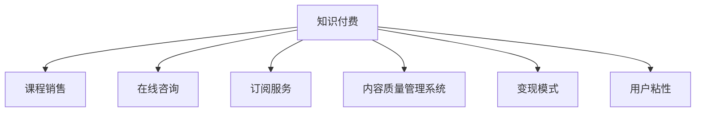

                 

# 知识付费：程序员的社群运营方案

## 1. 背景介绍

### 1.1 问题由来

近年来，随着互联网的发展和技术的进步，程序员社群在国内外迅速壮大，成为技术交流和共享的重要平台。然而，尽管社群成员众多，许多社群在运营和发展上仍面临诸多挑战。例如，如何保持成员活跃度？如何高效地交流技术知识？如何更好地变现社群资源？针对这些问题，知识付费成为了社群运营的一种重要手段。

知识付费是指通过付费方式获取专业知识和技能服务，是知识经济的重要表现形式之一。程序员社群的知识付费模式可以细分为课程销售、在线咨询、订阅服务等多种形式，既丰富了社群成员的学习途径，也实现了社群价值的最大化。

### 1.2 问题核心关键点

知识付费在程序员社群运营中具有以下核心关键点：

- 内容质量：高质量的课程、讲座、文章等是知识付费成功的关键。
- 用户粘性：如何维持社群成员的长期活跃度是知识付费运营的核心。
- 变现模式：如何根据社群特点，选择适合的变现方式，实现可持续盈利。
- 技术栈适配：确保知识付费产品对不同技术栈的程序员都适用。
- 社区文化和价值认同：建立和维护健康的社群文化和价值认同感。

## 2. 核心概念与联系

### 2.1 核心概念概述

为更好地理解知识付费在程序员社群运营中的应用，本节将介绍几个密切相关的核心概念：

- 知识付费：通过付费方式获取知识服务，提高知识传播效率和用户满意度的一种模式。
- 程序员社群：由技术人员组成的在线社区，旨在交流技术知识、分享经验、解决实际问题。
- 课程销售：通过开发和销售高质量的课程，满足用户的学习需求。
- 在线咨询：为社群成员提供个性化的一对一或一对多咨询，解答技术问题。
- 订阅服务：定期发布高质量的技术文章、视频等，通过订阅费获得收入。
- 内容质量管理系统：评估和保证知识付费内容的高质量，建立可信度。
- 变现模式：如按需付费、月度订阅、会员制等，最大化社群收益。
- 用户粘性：通过互动、反馈、奖励等方式，维持社群成员的活跃度和参与度。

这些核心概念之间的逻辑关系可以通过以下Mermaid流程图来展示：



这个流程图展示的知识付费在程序员社群运营的主要流程：

1. 知识付费提供高质量的技术内容和服务。
2. 课程销售、在线咨询、订阅服务等是知识付费的主要变现方式。
3. 内容质量管理系统确保知识内容的可信度。
4. 选择合适的变现模式，最大化社群收益。
5. 通过用户粘性系统，维持社群成员的长期活跃度。

## 3. 核心算法原理 & 具体操作步骤
### 3.1 算法原理概述

知识付费在程序员社群运营中，核心算法原理可以概括为：

- **内容质量管理**：通过评估和监控内容的质量，确保付费内容的可信度。
- **变现模式选择**：根据社群特点和需求，选择适合的变现方式，如按需付费、月度订阅等。
- **用户粘性维护**：通过互动、反馈、奖励等方式，提升用户的参与度和粘性。

### 3.2 算法步骤详解

知识付费的具体操作包括以下几个步骤：

1. **需求调研**：了解社群成员的技术需求和付费意愿，明确知识付费的目标和内容方向。
2. **内容开发**：根据调研结果，开发高质量的课程、讲座、文章等知识付费产品。
3. **产品上线**：在社群平台上发布知识付费产品，初期可采用免费试用等策略吸引用户。
4. **用户反馈**：收集用户对知识付费产品的反馈，持续改进和优化内容。
5. **营销推广**：通过社群内部推广、社交媒体营销等方式，扩大知识付费产品的知名度和影响力。
6. **数据分析**：通过数据分析，评估知识付费的效果，优化内容和运营策略。
7. **变现优化**：根据数据分析结果，调整变现策略，提高盈利能力。
8. **社区维护**：通过用户互动、反馈、奖励等方式，维持社群的活跃度和参与度。

### 3.3 算法优缺点

知识付费在程序员社群运营中有以下优点：

- **提升内容质量**：通过付费机制，激励内容创作者提供高质量的课程和文章。
- **增加用户粘性**：付费用户通常对社群有更高的忠诚度和参与度。
- **变现效率高**：知识付费模式可以快速实现社群收益，具有较高的市场竞争力。
- **内容订阅便捷**：用户可以方便地订阅和访问知识内容，无需大量时间精力。

同时，这种模式也存在一些局限：

- **初始投入高**：高质量内容的开发和维护需要投入大量时间和资源。
- **用户接受度有待提高**：部分用户对付费内容接受度较低，可能影响整体推广效果。
- **市场竞争激烈**：知识付费领域竞争激烈，需要不断创新和优化产品。

### 3.4 算法应用领域

知识付费在程序员社群运营中主要应用于以下几个领域：

- **技术培训**：提供面向不同技术栈的课程和讲座，满足程序员的技术学习需求。
- **职业发展**：提供职业规划、简历优化、面试技巧等内容，帮助程序员提升职业竞争力。
- **问题解答**：提供个性化的一对一或一对多咨询，解答程序员的技术问题。
- **技术分享**：通过技术文章、博客等形式，分享程序员的技术经验和学习心得。

## 4. 数学模型和公式 & 详细讲解 & 举例说明（备注：数学公式请使用latex格式，latex嵌入文中独立段落使用 $$，段落内使用 $)
### 4.1 数学模型构建

在知识付费运营中，常见的数学模型包括：

- **内容质量评估模型**：通过用户评分、专家评审等方式，评估课程内容的质量。
- **用户粘性模型**：通过分析用户行为数据，建立用户活跃度的预测模型。
- **变现模式优化模型**：根据用户反馈和市场数据，优化课程定价和订阅策略。

### 4.2 公式推导过程

以内容质量评估模型为例，假设有一门课程A，其内容质量评分由用户评分 $U$、专家评分 $E$、课程评价 $G$ 等决定。设每个评分的权重分别为 $w_u, w_e, w_g$，则课程A的质量评分 $Q$ 可以表示为：

$$ Q = w_uU + w_eE + w_gG $$

用户评分 $U$ 可以通过问卷调查、在线评论等方式获取，专家评分 $E$ 可以通过专家评审或专业平台获取，课程评价 $G$ 可以通过社群平台的用户评分获取。根据实际情况，可以设置不同的权重 $w_u, w_e, w_g$，以确保评估结果的合理性和公正性。

### 4.3 案例分析与讲解

假设有一门名为《Python高级编程》的课程，其在社群平台上的用户评分、专家评分和课程评价分别为8.5、9.0、9.2。设用户评分权重为0.4，专家评分权重为0.3，课程评价权重为0.3，则课程A的质量评分计算如下：

$$ Q = 0.4 \times 8.5 + 0.3 \times 9.0 + 0.3 \times 9.2 = 8.94 $$

由此，课程《Python高级编程》的质量评分为8.94分，较其他课程具有更高的可信度。

## 5. 项目实践：代码实例和详细解释说明
### 5.1 开发环境搭建

在进行知识付费项目开发前，我们需要准备好开发环境。以下是使用Python进行Flask开发的环境配置流程：

1. 安装Anaconda：从官网下载并安装Anaconda，用于创建独立的Python环境。

2. 创建并激活虚拟环境：
```bash
conda create -n knowledge-payment python=3.8 
conda activate knowledge-payment
```

3. 安装Flask：
```bash
pip install Flask
```

4. 安装Gunicorn：
```bash
pip install gunicorn
```

5. 安装相关工具包：
```bash
pip install numpy pandas scikit-learn requests Flask-RESTful
```

完成上述步骤后，即可在`knowledge-payment`环境中开始知识付费项目开发。

### 5.2 源代码详细实现

这里我们以课程销售为例，展示如何使用Flask开发知识付费的课程销售功能。

首先，定义课程信息类：

```python
class Course:
    def __init__(self, id, name, price, author, description, video_url, pdf_url, user_reviews):
        self.id = id
        self.name = name
        self.price = price
        self.author = author
        self.description = description
        self.video_url = video_url
        self.pdf_url = pdf_url
        self.user_reviews = user_reviews
```

然后，定义课程销售的API接口：

```python
from flask import Flask, request, jsonify

app = Flask(__name__)

# 获取所有课程信息
@app.route('/courses', methods=['GET'])
def get_courses():
    courses = [
        Course(id=1, name='Python高级编程', price=199, author='张三', description='本课程介绍Python高级编程技巧', video_url='https://example.com/video', pdf_url='https://example.com/pdf', user_reviews={'username': '张三', 'rating': 4.5}),
        Course(id=2, name='Java高级编程', price=299, author='李四', description='本课程介绍Java高级编程技巧', video_url='https://example.com/video2', pdf_url='https://example.com/pdf2', user_reviews={'username': '王五', 'rating': 4.2}),
        Course(id=3, name='C++高级编程', price=199, author='赵六', description='本课程介绍C++高级编程技巧', video_url='https://example.com/video3', pdf_url='https://example.com/pdf3', user_reviews={'username': '刘七', 'rating': 4.8})
    ]
    return jsonify([course.to_dict() for course in courses])

# 获取指定课程详情
@app.route('/courses/<int:id>', methods=['GET'])
def get_course(id):
    for course in courses:
        if course.id == id:
            return jsonify(course.to_dict())
    return jsonify({"error": "Course not found"}), 404

# 注册新课程
@app.route('/courses', methods=['POST'])
def register_course():
    data = request.get_json()
    new_course = Course(id=data['id'], name=data['name'], price=data['price'], author=data['author'], description=data['description'], video_url=data['video_url'], pdf_url=data['pdf_url'], user_reviews=data['user_reviews'])
    courses.append(new_course)
    return jsonify({"message": "Course registered successfully"}), 201

# 注册新课程用户评价
@app.route('/courses/<int:id>/reviews', methods=['POST'])
def register_course_review(id):
    data = request.get_json()
    for course in courses:
        if course.id == id:
            course.user_reviews = data['user_reviews']
            return jsonify({"message": "Review registered successfully"}), 201
    return jsonify({"error": "Course not found"}), 404
```

最后，启动Flask应用：

```python
if __name__ == '__main__':
    app.run(host='0.0.0.0', port=5000)
```

以上就是使用Flask开发知识付费项目课程销售功能的完整代码实现。可以看到，借助Flask框架，我们能够方便地实现RESTful风格的API接口，供客户端调用。

### 5.3 代码解读与分析

让我们再详细解读一下关键代码的实现细节：

**Course类**：
- `__init__`方法：初始化课程的各种属性，如课程ID、名称、价格、作者、描述、视频链接、PDF链接和用户评分等。
- `to_dict`方法：将Course对象转换为字典，方便API返回数据。

**API接口**：
- `get_courses`方法：获取所有课程信息，返回JSON格式的课程列表。
- `get_course`方法：获取指定ID的课程详情，返回JSON格式的课程对象。
- `register_course`方法：注册新课程，将新课程添加到课程列表中。
- `register_course_review`方法：注册新课程用户评价，更新指定ID课程的用户评分信息。

这些接口通过Flask框架进行封装，支持GET、POST等HTTP请求方法，可以方便地与客户端进行数据交互。

## 6. 实际应用场景
### 6.1 智能客服系统

在智能客服系统中，知识付费可以用于提供高级问答服务。通过付费订阅，用户可以获取更全面、更精准的问答服务，提升客户咨询体验。

例如，某智能客服系统在知识付费平台上提供《智能客服高级指南》课程，包括常见问题解答、客服流程优化、客户满意度提升等内容。订阅该课程的客服人员可以通过系统内嵌的课程学习模块，实时更新知识库，快速解答客户问题。系统还可以通过在线咨询功能，提供一对一的高级问答服务，帮助解决复杂问题，提高客户满意度。

### 6.2 技术培训

技术培训是知识付费的重要应用场景。通过付费购买高质量的课程，程序员可以系统性地学习新技能，加速技术进步。

例如，某程序员社群推出了《Python数据科学实战》课程，包括数据清洗、数据分析、机器学习等内容。订阅该课程的程序员可以通过社群平台上的在线课程和视频教程，系统学习数据科学技能，提升项目开发能力。

### 6.3 技术分享

技术分享是程序员社群的重要活动形式，通过知识付费可以将这些分享内容长期保存和传播。

例如，某社群每月举办一次技术分享会，邀请技术专家讲解最新的技术趋势和项目经验。将这些分享内容整理成文章或视频，通过社群平台进行发布，并设置付费查看，既保证了内容质量，又增加了社群的收入。

### 6.4 未来应用展望

知识付费在程序员社群中的应用前景广阔，未来可能会在以下几个方向进一步发展：

- **混合式学习**：结合线上课程和线下培训，提供更灵活、更个性化的学习体验。
- **社区众包**：鼓励社群成员共同开发和分享知识，形成良性循环。
- **虚拟现实**：利用虚拟现实技术，提供沉浸式的学习体验。
- **AI辅助**：利用AI技术进行内容推荐和智能推送，提升学习效率。
- **社交互动**：通过社群内的互动和讨论，促进知识共享和交流。

## 7. 工具和资源推荐
### 7.1 学习资源推荐

为了帮助开发者系统掌握知识付费在程序员社群中的应用，这里推荐一些优质的学习资源：

1. **《知识付费：如何构建知识付费社区》**：一本系统介绍知识付费社区运营的书籍，涵盖课程开发、内容质量管理、用户管理等多个方面。
2. **Coursera和Udacity**：提供高质量的在线课程和学位项目，涵盖多种技术栈和知识领域。
3. **知乎Live**：知乎提供的在线直播平台，可以观看技术专家分享的知识付费内容。
4. **网易云课堂**：提供多种编程语言和技术课程，支持付费订阅和按需付费。
5. **B站知识付费频道**：B站提供的知识付费频道，包含大量高质量的视频教程和课程。

通过对这些资源的学习实践，相信你一定能够快速掌握知识付费在程序员社群中的应用，并用于解决实际的NLP问题。

### 7.2 开发工具推荐

高效的开发离不开优秀的工具支持。以下是几款用于知识付费项目开发的常用工具：

1. **Flask框架**：轻量级的Web框架，支持RESTful风格的API开发，易于上手和扩展。
2. **Django框架**：功能强大的Web框架，支持多种ORM和模板引擎，适用于复杂的应用开发。
3. **SQLite数据库**：轻量级的关系型数据库，适用于小型应用和原型开发。
4. **MongoDB数据库**：非关系型数据库，适用于高并发的应用场景。
5. **PostgreSQL数据库**：功能丰富的关系型数据库，支持复杂查询和事务处理。
6. **AWS云服务**：提供丰富的云服务，包括计算、存储、数据库等，适合大规模应用部署。
7. **Docker容器**：轻量级的虚拟化技术，方便应用部署和管理。

合理利用这些工具，可以显著提升知识付费项目的开发效率，加快创新迭代的步伐。

### 7.3 相关论文推荐

知识付费在程序员社群中的应用源于学界的持续研究。以下是几篇奠基性的相关论文，推荐阅读：

1. **《知识付费：基于区块链技术的知识共享模式》**：研究了基于区块链技术的知识付费模式，探讨了其应用前景和技术实现。
2. **《知识付费平台的数据挖掘与用户行为分析》**：通过数据挖掘和用户行为分析，优化知识付费平台的内容推荐和个性化服务。
3. **《知识付费社区的构建与运营》**：探讨了知识付费社区的构建策略和运营方法，提出了一套完整的运营体系。
4. **《知识付费与智能客服的结合》**：研究了知识付费与智能客服的结合，提出了一种新型的智能客服服务模式。

这些论文代表了大语言模型微调技术的发展脉络。通过学习这些前沿成果，可以帮助研究者把握学科前进方向，激发更多的创新灵感。

## 8. 总结：未来发展趋势与挑战
### 8.1 总结

本文对知识付费在程序员社群中的应用进行了全面系统的介绍。首先阐述了知识付费在程序员社群运营中的重要性，明确了知识付费在提升内容质量、增加用户粘性、变现盈利等方面的独特价值。其次，从原理到实践，详细讲解了知识付费的数学模型、核心算法、操作步骤，并给出了知识付费项目开发的完整代码实现。同时，本文还广泛探讨了知识付费在智能客服、技术培训、技术分享等多个领域的应用前景，展示了知识付费的巨大潜力。此外，本文精选了知识付费技术的各类学习资源，力求为读者提供全方位的技术指引。

通过本文的系统梳理，可以看到，知识付费在程序员社群中的应用前景广阔，既丰富了社群成员的学习途径，也实现了社群价值的最大化。未来，伴随知识付费技术的持续演进，相信程序员社群将在更多的垂直领域实现规模化落地，为技术知识的传播和交流提供新的平台和机制。

### 8.2 未来发展趋势

展望未来，知识付费在程序员社群中的应用将呈现以下几个发展趋势：

1. **内容多样化**：除了课程销售、在线咨询、订阅服务外，未来还将出现更多形式的知识付费，如视频直播、技术沙龙等。
2. **技术创新**：利用AI、AR/VR等前沿技术，提升知识付费的用户体验和互动效果。
3. **行业细分**：知识付费将进一步细分化，针对不同技术栈和领域推出专属课程和服务。
4. **全球化**：利用互联网和国际化平台，推广全球范围内的知识付费服务。
5. **平台整合**：知识付费平台将与社交网络、视频平台等整合，形成一体化的学习生态。

这些趋势凸显了知识付费在程序员社群运营中的重要性和应用前景，为技术知识传播和交流带来了新的机遇和挑战。

### 8.3 面临的挑战

尽管知识付费在程序员社群中具有广阔的应用前景，但在实施过程中仍面临诸多挑战：

1. **内容质量控制**：如何保证付费内容的高质量，避免劣质课程和误导性内容。
2. **用户支付意愿**：部分用户对付费内容接受度较低，可能影响整体推广效果。
3. **技术门槛**：开发和维护高质量的知识付费内容需要较高的技术门槛。
4. **市场竞争**：知识付费领域竞争激烈，需要不断创新和优化产品。
5. **内容版权**：如何合法合规地获取和传播内容，避免版权纠纷。

这些挑战需要开发者在内容质量管理、市场推广、技术创新等方面进行全面优化，方能实现知识付费项目的成功落地。

### 8.4 研究展望

面对知识付费在程序员社群中面临的挑战，未来的研究需要在以下几个方面寻求新的突破：

1. **内容质量管理系统**：建立更加严格的内容质量评估机制，引入用户评分、专家评审、专业平台等综合评估方式，确保内容可信度。
2. **用户支付意愿提升**：通过市场调研和用户分析，找到提升用户支付意愿的有效方法，如限时优惠、用户推荐等。
3. **技术创新和优化**：引入AI、AR/VR等技术，提升知识付费的用户体验和互动效果。
4. **市场推广和整合**：通过社交网络、视频平台等渠道进行推广，整合多种平台资源，形成一体化的学习生态。
5. **法律合规与版权保护**：建立合法合规的内容获取和传播机制，避免版权纠纷。

这些研究方向将推动知识付费在程序员社群中的进一步发展和优化，为技术知识传播和交流提供新的平台和机制。

## 9. 附录：常见问题与解答

**Q1：知识付费在程序员社群中的应用有哪些好处？**

A: 知识付费在程序员社群中的应用具有以下好处：

1. **提升内容质量**：通过付费机制，激励内容创作者提供高质量的课程和文章。
2. **增加用户粘性**：付费用户通常对社群有更高的忠诚度和参与度。
3. **变现效率高**：知识付费模式可以快速实现社群收益，具有较高的市场竞争力。
4. **内容订阅便捷**：用户可以方便地订阅和访问知识内容，无需大量时间精力。

**Q2：如何保证知识付费内容的可信度？**

A: 保证知识付费内容的可信度需要建立完善的内容质量管理系统，包括：

1. **用户评分系统**：通过问卷调查、在线评论等方式获取用户评分，反映内容的受欢迎程度。
2. **专家评审系统**：通过邀请专家评审，对课程内容进行专业评估。
3. **平台认证系统**：对内容创作者进行资质认证，确保其专业水平。
4. **综合评估系统**：结合用户评分、专家评审、平台认证等多种方式，进行综合评估。

**Q3：知识付费如何实现变现？**

A: 知识付费可以通过以下方式实现变现：

1. **课程销售**：开发高质量的课程，通过在线平台进行销售，按次或按月收取费用。
2. **在线咨询**：提供个性化的一对一或一对多咨询，按小时或按问题收费。
3. **订阅服务**：定期发布高质量的技术文章、视频等，通过订阅费获得收入。
4. **虚拟讲座**：组织线上虚拟讲座，向付费用户提供独家内容。

**Q4：如何提升知识付费平台的用户粘性？**

A: 提升知识付费平台的用户粘性可以通过以下方式：

1. **互动交流**：建立社群平台，鼓励用户参与讨论、交流经验。
2. **定期活动**：定期举办技术分享会、编程竞赛等活动，提升用户参与度。
3. **奖励机制**：通过积分、优惠券等方式，激励用户积极参与。
4. **个性化推荐**：根据用户兴趣，推荐相关课程和内容，提升用户体验。

**Q5：知识付费平台如何保护用户隐私？**

A: 知识付费平台保护用户隐私可以采取以下措施：

1. **数据匿名化**：对用户数据进行匿名化处理，保护用户隐私。
2. **合规存储**：严格遵守数据存储和传输的法律法规，确保数据安全。
3. **隐私政策**：制定明确的用户隐私政策，告知用户数据使用情况。
4. **用户授权**：在获取用户数据前，明确告知并征得用户授权。

---

作者：禅与计算机程序设计艺术 / Zen and the Art of Computer Programming

