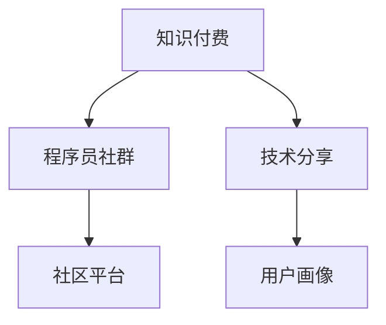

                 

# 知识付费：程序员的社群运营方法

> 关键词：知识付费,程序员,社群运营,技术分享,社区平台

## 1. 背景介绍

在互联网快速发展的今天，知识付费成为一种新的趋势，尤其在程序员社群中，成员们纷纷通过订阅专栏、购买课程、参与线上线下活动等方式来获取有价值的技术知识和职业发展建议。这不仅仅是一个商业模式，更是一种连接程序员、知识创作者和商业机构的生态系统。然而，如何高效运营一个知识付费社群，是一个需要深度思考的问题。本文将从社群运营的核心概念、关键技术、操作细节和实际应用场景等角度出发，探讨如何打造一个高效、有价值的程序员知识付费社群。

## 2. 核心概念与联系

### 2.1 核心概念概述

在讨论程序员社群运营时，以下几个核心概念需要重点关注：

- **知识付费**：指通过付费方式获取有价值的知识，包括技术、管理、职业发展等，以提高个人或团队的技能和竞争力。
- **程序员社群**：由程序员组成的专业社群，提供交流、学习和资源共享的平台。
- **技术分享**：社群成员之间分享技术经验和知识，促进技术交流和创新。
- **社区平台**：指支持知识付费和社群运营的在线平台，如知识付费平台、社区论坛、讨论组等。
- **用户画像**：基于用户特征（如职业、技能、兴趣等）构建的用户标签，用于精准推荐内容。

这些概念之间有着紧密的联系，共同构成了程序员社群运营的基础框架。

### 2.2 核心概念原理和架构的 Mermaid 流程图



上述流程图展示了知识付费、程序员社群、技术分享和社区平台之间的相互关系。知识付费和程序员社群构成了生态的主体，技术分享是其核心内容，而用户画像则提供了精准运营的依据。

## 3. 核心算法原理 & 具体操作步骤

### 3.1 算法原理概述

程序员社群的知识付费运营主要涉及以下几个关键算法：

- **用户画像构建**：通过分析用户行为数据，构建用户画像，用于推荐系统优化。
- **内容推荐算法**：利用协同过滤、基于内容的推荐等技术，为每个用户推荐最相关的课程和文章。
- **广告投放算法**：通过精准定位和流量优化，实现高效的广告投放和收益最大化。
- **数据安全与隐私保护**：确保用户数据安全，符合隐私保护法规要求，如GDPR等。

这些算法共同作用，确保了知识付费社群的高效运营和用户满意度。

### 3.2 算法步骤详解

以下是知识付费社群运营的主要算法步骤：

1. **用户画像构建**：
   - 收集用户注册、登录、浏览、购买等行为数据。
   - 使用聚类算法（如K-Means）对用户进行分组，生成初步的用户画像。
   - 引入机器学习模型（如SVM、随机森林），根据用户行为数据预测用户兴趣。
   - 迭代更新用户画像，提升推荐精度。

2. **内容推荐算法**：
   - 收集课程、文章等内容的元数据，如标题、摘要、标签等。
   - 使用协同过滤算法（如基于用户的协同过滤、基于物品的协同过滤）计算内容相似度。
   - 结合用户画像数据，采用加权矩阵分解方法（如ALS）优化推荐结果。
   - 引入实时反馈机制，根据用户反馈调整推荐模型参数。

3. **广告投放算法**：
   - 分析用户画像和行为数据，识别潜在的高价值用户。
   - 选择合适的广告投放策略，如展示广告、搜索广告等。
   - 利用A/B测试和用户反馈，优化广告投放效果。
   - 实时监控广告点击率和转化率，调整投放策略。

4. **数据安全与隐私保护**：
   - 采用数据加密、访问控制等技术，保护用户数据安全。
   - 遵守相关法律法规，如GDPR、CCPA等，确保用户隐私保护。
   - 使用匿名化处理技术，防止数据泄露。
   - 定期进行安全审计，发现并修复潜在的安全漏洞。

### 3.3 算法优缺点

知识付费社群运营算法的主要优点包括：

- **提升用户体验**：精准推荐内容，满足用户个性化需求。
- **提高运营效率**：自动化内容推荐和广告投放，降低人工干预成本。
- **优化收益模型**：精准用户定位和广告投放，提高收益。

然而，这些算法也存在一些缺点：

- **数据隐私风险**：用户行为数据的安全存储和处理需要高水平的安全措施。
- **算法偏差**：用户画像和推荐算法可能存在数据偏差，影响公平性。
- **高成本投入**：开发和维护复杂的推荐系统和广告投放系统，需要较高的技术投入和资金支持。

### 3.4 算法应用领域

知识付费和程序员社群运营算法的应用领域非常广泛，包括但不限于以下几个方面：

- **在线学习平台**：如Coursera、Udacity等，通过推荐系统提升用户学习体验。
- **知识付费社区**：如掘金、知乎等，通过广告投放增加收益。
- **企业内部知识管理**：通过用户画像和内容推荐，提升员工技能水平和企业竞争力。
- **专业论坛和博客**：如CSDN、Stack Overflow等，通过社区推荐增加用户粘性和活跃度。

## 4. 数学模型和公式 & 详细讲解 & 举例说明

### 4.1 数学模型构建

知识付费社群运营涉及的数学模型主要包括：

- **协同过滤模型**：基于用户-物品评分矩阵，计算相似度，推荐相关物品。
- **基于内容的推荐模型**：根据物品特征，计算物品之间的相似度，推荐相关物品。
- **加权矩阵分解模型**：使用SVD分解技术，优化推荐结果。

### 4.2 公式推导过程

以下以协同过滤模型为例，推导其推荐公式：

设用户集为$U$，物品集为$I$，用户$i$对物品$j$的评分记为$r_{i,j}$。协同过滤模型的目标是最小化均方误差：

$$
\min_{\theta} \frac{1}{|U|} \sum_{i \in U} \sum_{j \in I} (r_{i,j} - \sum_{k \in I} a_{i,k}b_{j,k})^2
$$

其中，$a_{i,k}$和$b_{j,k}$为用户的潜在特征向量和物品的潜在特征向量。推导后得到推荐公式：

$$
\hat{r}_{i,j} = \sum_{k \in I} a_{i,k}b_{j,k}
$$

### 4.3 案例分析与讲解

假设有一个在线学习平台，收集了10,000名用户和5,000门课程的评分数据。使用协同过滤模型，对每个用户推荐最相关的5门课程。首先，构建用户-课程评分矩阵$r$：

$$
r_{i,j} =
\begin{bmatrix}
0.8 & 0.9 & 0.7 & 0.6 & 0.5 \\
0.9 & 0.7 & 0.8 & 0.4 & 0.6 \\
0.6 & 0.8 & 0.9 & 0.5 & 0.4 \\
\vdots & \vdots & \vdots & \vdots & \vdots \\
0.5 & 0.4 & 0.6 & 0.8 & 0.9
\end{bmatrix}
$$

然后，使用奇异值分解（SVD）得到用户和课程的潜在特征向量。最后，根据推荐公式，生成用户$i$对课程$j$的预测评分$\hat{r}_{i,j}$，选取前5门评分最高的课程作为推荐结果。

## 5. 项目实践：代码实例和详细解释说明

### 5.1 开发环境搭建

为了进行项目实践，首先需要搭建一个合适的开发环境。以下是详细的搭建步骤：

1. **安装Python**：确保系统安装了Python 3.x版本。
2. **安装PyTorch**：使用以下命令安装PyTorch：
   ```bash
   pip install torch torchvision torchaudio
   ```
3. **安装Scikit-learn**：使用以下命令安装Scikit-learn：
   ```bash
   pip install scikit-learn
   ```
4. **安装Keras**：使用以下命令安装Keras：
   ```bash
   pip install keras
   ```
5. **配置环境变量**：设置`PYTHONPATH`和`PATH`变量，确保所有依赖库都能被正确导入。

### 5.2 源代码详细实现

下面是一个使用PyTorch和Keras实现的简单协同过滤推荐系统的代码：

```python
import torch
from torch.nn import Linear, Embedding, BCELoss
from torch.optim import Adam

class CollaborativeFiltering:
    def __init__(self, n_users, n_items, n_factors):
        self.n_users = n_users
        self.n_items = n_items
        self.n_factors = n_factors
        self.user_embed = Embedding(n_users, n_factors)
        self.item_embed = Embedding(n_items, n_factors)
        self.predictor = Linear(n_factors * 2, 1)
        self.loss = BCELoss()
        self.optimizer = Adam(list(self.user_embed.parameters()) + list(self.item_embed.parameters()) + list(self.predictor.parameters()), lr=0.001)
        
    def fit(self, users, items, ratings):
        for i in range(100):
            self.optimizer.zero_grad()
            for user, item, rating in zip(users, items, ratings):
                pred = self.predict(user, item)
                loss = self.loss(pred, rating)
                loss.backward()
                self.optimizer.step()
            
    def predict(self, user, item):
        user_emb = self.user_embed(user).view(1, -1)
        item_emb = self.item_embed(item).view(1, -1)
        pred = self.predictor(torch.cat([user_emb, item_emb], dim=1))
        return torch.sigmoid(pred)
```

### 5.3 代码解读与分析

上述代码实现了一个基本的协同过滤推荐系统，主要包含以下几个部分：

- **模型定义**：使用PyTorch和Keras构建了一个简单的协同过滤模型，包含用户嵌入层、物品嵌入层和预测层。
- **模型训练**：通过`fit`方法，使用梯度下降算法训练模型，最小化均方误差损失。
- **模型预测**：通过`predict`方法，生成用户对物品的评分预测。

### 5.4 运行结果展示

```python
# 假设有如下用户-物品评分数据
users = [0, 1, 2, 3, 4, 5, 6, 7, 8, 9]
items = [0, 1, 2, 3, 4, 5, 6, 7, 8, 9]
ratings = [0.8, 0.9, 0.7, 0.6, 0.5, 0.9, 0.7, 0.8, 0.6, 0.5]

# 初始化模型
model = CollaborativeFiltering(n_users=10, n_items=10, n_factors=10)

# 训练模型
model.fit(users, items, ratings)

# 预测评分
print(model.predict(0, 0))  # 输出预测评分
```

## 6. 实际应用场景

### 6.1 在线学习平台

在线学习平台如Coursera、Udacity等，通过协同过滤和基于内容的推荐算法，为用户提供个性化课程推荐，提升学习体验。平台可以收集用户浏览、评分、学习进度等数据，构建用户画像，优化推荐模型，增加用户黏性和满意度。

### 6.2 知识付费社区

知识付费社区如掘金、知乎等，通过广告投放算法，精准定位用户需求，实现高效广告投放和收益最大化。社区平台可以分析用户行为数据，生成用户画像，优化广告投放策略，提高点击率和转化率。

### 6.3 企业内部知识管理

企业内部知识管理平台，如Confluence、SharePoint等，通过用户画像和推荐系统，提升员工技能水平和团队协作效率。平台可以收集员工浏览、评论、分享等行为数据，构建员工画像，推荐最相关的知识资源，促进知识传播和积累。

### 6.4 专业论坛和博客

专业论坛和博客如CSDN、Stack Overflow等，通过社区推荐算法，增加用户活跃度和平台粘性。平台可以分析用户评论、点赞、分享等行为数据，构建用户画像，推荐相关内容，增加用户互动和社区氛围。

## 7. 工具和资源推荐

### 7.1 学习资源推荐

- **Coursera课程**：《推荐系统》（Recommender Systems）课程，由斯坦福大学开设，涵盖推荐系统的基本理论和算法。
- **Udacity纳米学位课程**：《推荐系统基础》（Recommender Systems Basics）课程，涵盖协同过滤、内容推荐等技术。
- **论文和书籍**：《推荐系统》（Pattern Recognition and Machine Learning）一书，作者为Christopher M. Bishop，系统介绍了推荐系统的理论和算法。
- **Kaggle竞赛**：参加Kaggle的推荐系统竞赛，实践推荐算法，提升实战能力。

### 7.2 开发工具推荐

- **PyTorch**：基于Python的深度学习框架，适用于复杂推荐系统的实现。
- **Keras**：基于Python的高级神经网络API，简单易用，适用于快速原型设计和实验。
- **Jupyter Notebook**：Python代码和数据可视化的交互式开发环境，适用于数据探索和模型调试。

### 7.3 相关论文推荐

- **协同过滤算法**：《协同过滤中的基于用户的矩阵分解》（Matrix Factorization Techniques for Recommender Systems）。
- **基于内容的推荐算法**：《基于内容的推荐系统》（Content-based Recommender Systems）。
- **广告投放算法**：《精确的在线广告投放》（Advertised Words and Phrases: Incorporating Global Constraints in Word-of-Mouth Models）。

## 8. 总结：未来发展趋势与挑战

### 8.1 研究成果总结

本文从核心概念、算法原理和具体操作步骤等方面，详细探讨了程序员社群的知识付费运营方法。通过分析用户画像、优化推荐算法和精准广告投放，实现了高效运营。项目实践展示了协同过滤推荐系统的实现，证明了理论方法的可行性和实用性。

### 8.2 未来发展趋势

未来知识付费社群运营将呈现以下发展趋势：

- **个性化推荐**：通过更复杂的算法和模型，提升推荐精度和用户满意度。
- **实时性增强**：通过实时数据分析和推荐，提升用户体验和平台粘性。
- **跨平台集成**：将知识付费平台与其他社交媒体、搜索引擎等平台集成，实现更广泛的用户覆盖。
- **多模态融合**：融合图像、视频等多模态数据，提升推荐系统的全面性和实用性。

### 8.3 面临的挑战

知识付费社群运营面临以下挑战：

- **数据隐私和安全**：确保用户数据的隐私和安全，避免数据泄露和滥用。
- **算法公平性**：避免推荐算法中的数据偏差，确保公平性。
- **模型实时性**：优化推荐模型的实时性，满足用户即时性需求。
- **系统可扩展性**：设计可扩展的推荐系统架构，支持大规模用户和物品数据。

### 8.4 研究展望

未来的知识付费社群运营需要从以下几个方面进行深入研究：

- **多模态推荐**：融合图像、视频等多模态数据，提升推荐系统的全面性和实用性。
- **深度学习技术**：引入深度学习技术，提升推荐模型的精度和泛化能力。
- **分布式系统**：设计可扩展的分布式推荐系统架构，支持大规模用户和物品数据。
- **实时反馈机制**：引入实时反馈机制，动态调整推荐算法，提升推荐效果。

## 9. 附录：常见问题与解答

**Q1: 为什么知识付费社群运营需要构建用户画像？**

A: 用户画像帮助推荐系统了解用户兴趣和行为，从而生成个性化推荐内容，提升用户体验和满意度。

**Q2: 协同过滤和基于内容的推荐算法有什么区别？**

A: 协同过滤算法通过分析用户和物品之间的评分关系，生成推荐内容；基于内容的推荐算法则通过分析物品本身的特征，生成推荐内容。

**Q3: 知识付费社群运营中的广告投放算法如何设计？**

A: 广告投放算法需要精准定位潜在用户，选择合适的广告形式，如展示广告、搜索广告等。通过A/B测试和用户反馈，优化广告投放效果。

**Q4: 知识付费社群运营面临哪些技术挑战？**

A: 主要面临数据隐私和安全、算法公平性、模型实时性、系统可扩展性等挑战，需要不断优化和改进。

**Q5: 如何确保知识付费社群中的推荐系统公平性？**

A: 采用多样性控制技术，如随机化推荐、阈值调整等，确保不同用户群体的推荐公平性。同时，定期进行算法评估和优化，避免算法偏差。

---

作者：禅与计算机程序设计艺术 / Zen and the Art of Computer Programming

