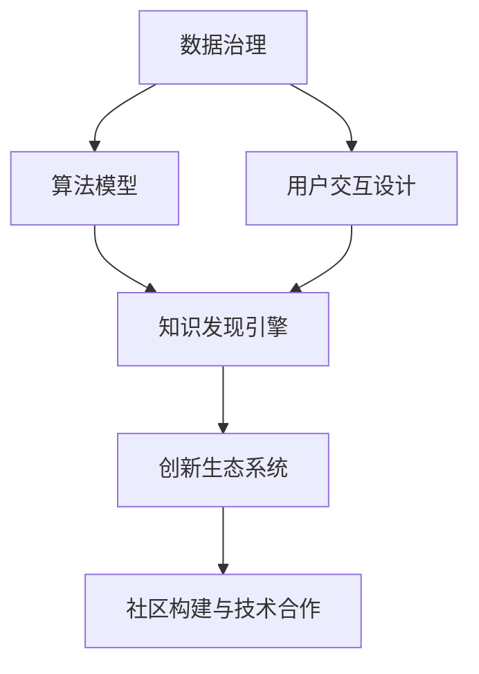

                 

# 知识发现引擎与创新生态系统的构建

## 1. 背景介绍

### 1.1 问题由来

在当今信息爆炸的时代，数据已经成为驱动社会进步和创新发展的重要资源。面对海量数据，如何从中提取有价值的知识，成为各个领域共同面临的挑战。为此，知识发现引擎(Knowledge Discovery Engine, KDE)应运而生，成为连接数据与知识的桥梁。

知识发现引擎利用先进的数据挖掘和机器学习技术，从复杂多变的数据中自动发现模式、规律和关联，为决策制定、产品创新、市场分析等提供有力支持。知识发现引擎不仅仅局限于大数据场景，它也在金融、医疗、教育等多个领域中发挥着重要作用。

然而，知识发现引擎的构建并非易事。从数据预处理、模型选择到结果评估，每一步都需要精心设计和调优。同时，如何构建一个高效的创新生态系统，充分利用知识发现引擎的潜力，加速知识流动和技术迭代，也是值得深入探讨的重要问题。

### 1.2 问题核心关键点

知识发现引擎与创新生态系统的构建，其核心在于如何构建一个自适应、高效、开放的知识体系，并在此基础上培养出不断创新的组织和人才。这一过程涉及数据治理、算法模型、用户交互、生态系统构建等多个环节。

- **数据治理**：确保数据的完整性、一致性和可靠性，是构建高效知识发现引擎的基础。
- **算法模型**：选择合适的算法模型，并对其进行优化和调参，以提取最有价值的知识。
- **用户交互**：设计良好的用户界面，让用户能够方便地输入数据、获取结果和反馈建议。
- **生态系统构建**：通过社区建设、技术合作、知识共享等手段，促进知识发现引擎在更大范围内的应用和扩散。

这些核心关键点共同构成了知识发现引擎与创新生态系统的构建框架，旨在为社会和企业提供持续的创新动力。

## 2. 核心概念与联系

### 2.1 核心概念概述

为更好地理解知识发现引擎与创新生态系统的构建，本节将介绍几个密切相关的核心概念：

- **知识发现引擎**：一种自动化的数据挖掘工具，从海量数据中提取有价值的模式、规律和关联，为决策支持、产品创新等提供支持。常见的知识发现技术包括关联规则挖掘、分类聚类、预测建模等。

- **创新生态系统**：由企业、组织、个人等主体构成，通过知识共享、合作研发、技术迭代等方式，促进新知识、新技术的产生和扩散，实现持续创新的生态系统。

- **数据治理**：确保数据的完整性、一致性和可靠性，是构建高效知识发现引擎的基础。数据治理包括数据质量管理、元数据管理、数据安全管理等多个方面。

- **算法模型**：知识发现引擎的核心部件，负责从数据中提取知识。常见的算法包括决策树、神经网络、支持向量机等。

- **用户交互设计**：知识发现引擎的用户界面设计，是提升用户体验和系统可用性的关键。好的用户交互设计能够让用户更便捷地使用系统，获取所需知识。

- **社区构建与技术合作**：通过构建社区、促进合作研发、开放技术接口等方式，推动知识发现引擎在更大范围内应用和扩散，形成创新的正反馈循环。

这些核心概念之间的逻辑关系可以通过以下Mermaid流程图来展示：



这个流程图展示了几大核心概念之间的关系：

1. 数据治理是知识发现引擎的基础。
2. 算法模型是知识发现引擎的核心。
3. 用户交互设计提升系统可用性。
4. 知识发现引擎推动创新生态系统的构建。
5. 社区构建与技术合作促进知识扩散和生态系统发展。

这些概念共同构成了知识发现引擎与创新生态系统的构建框架，旨在实现从数据到知识的自动提取和高效应用。

## 3. 核心算法原理 & 具体操作步骤

### 3.1 算法原理概述

知识发现引擎的核心原理是数据挖掘和机器学习。通过构建合适的算法模型，从数据中提取有价值的知识。这些知识可以是模式、规律、关联等，为决策制定、产品创新等提供支持。

知识发现引擎主要包括以下几个步骤：

1. **数据预处理**：清洗、整理、归一化数据，准备用于后续分析。
2. **特征工程**：根据任务需求，提取、构造、选择特征，为算法模型提供输入。
3. **模型训练**：选择合适的算法模型，并利用标注数据进行训练，优化模型参数。
4. **模型评估**：通过交叉验证等方法，评估模型的性能，选择最优模型。
5. **知识应用**：将模型应用于实际问题，提取有价值的知识，为决策制定等提供支持。

### 3.2 算法步骤详解

知识发现引擎的核心算法步骤主要包括以下几个环节：

#### 3.2.1 数据预处理

数据预处理是知识发现引擎的重要环节，其目的是将原始数据转换为适合算法分析的形式。数据预处理包括以下几个关键步骤：

- **数据清洗**：去除噪声、缺失值、异常值等，保证数据质量。
- **数据归一化**：将数据缩放到标准范围内，便于算法处理。
- **特征选择**：选择最相关、最有效的特征，提高模型性能。
- **数据分割**：将数据划分为训练集、验证集和测试集，用于模型训练和评估。

#### 3.2.2 特征工程

特征工程是知识发现引擎的关键步骤，通过合理的特征构造和选择，提升模型的性能。特征工程包括以下几个关键环节：

- **特征提取**：从原始数据中提取有用的特征，如文本中的词频、TF-IDF等。
- **特征构造**：构造新的特征，如组合特征、文本中的n-gram等。
- **特征选择**：选择最相关、最有效的特征，如基于统计方法、基于信息增益等。

#### 3.2.3 模型训练

模型训练是知识发现引擎的核心步骤，通过选择合适的算法模型，并利用标注数据进行训练，优化模型参数。模型训练包括以下几个关键环节：

- **模型选择**：选择合适的算法模型，如决策树、神经网络、支持向量机等。
- **参数调优**：通过交叉验证等方法，优化模型参数，提高模型性能。
- **模型选择**：选择最优模型，应用于实际问题。

#### 3.2.4 模型评估

模型评估是知识发现引擎的重要步骤，通过交叉验证等方法，评估模型的性能，选择最优模型。模型评估包括以下几个关键环节：

- **性能指标**：选择合适的性能指标，如准确率、召回率、F1值等。
- **交叉验证**：利用交叉验证方法，评估模型性能。
- **超参数调优**：通过网格搜索、随机搜索等方法，优化超参数。

#### 3.2.5 知识应用

知识应用是知识发现引擎的最终目标，通过将模型应用于实际问题，提取有价值的知识，为决策制定等提供支持。知识应用包括以下几个关键环节：

- **知识提取**：从模型中提取有价值的知识，如关联规则、分类模型等。
- **知识可视化**：将知识可视化，便于理解和应用。
- **决策支持**：利用提取的知识，为决策制定提供支持。

### 3.3 算法优缺点

知识发现引擎具有以下优点：

- **自动化**：自动从数据中提取知识，减少人工干预，提高效率。
- **多领域适用**：适用于各种领域，如金融、医疗、教育等。
- **灵活性高**：可以根据任务需求，灵活选择算法模型和特征工程方法。
- **可解释性强**：通过特征工程和模型选择，提高模型的可解释性。

然而，知识发现引擎也存在以下缺点：

- **数据依赖**：对数据质量要求高，数据缺失或不一致会导致模型性能下降。
- **算法复杂**：算法模型复杂，需要专业知识进行调优和维护。
- **计算资源需求高**：模型训练和特征工程需要大量的计算资源。
- **结果依赖**：模型结果依赖于数据和算法，可能存在偏见或偏差。

尽管存在这些局限性，知识发现引擎在数据驱动的决策支持、产品创新等方面具有不可替代的作用。未来的研究方向在于进一步提升数据治理、算法优化和模型可解释性，推动知识发现引擎的广泛应用。

### 3.4 算法应用领域

知识发现引擎在多个领域中得到了广泛应用，包括但不限于以下领域：

- **金融风险管理**：利用知识发现引擎进行市场分析、信用评估、风险预测等，提升金融决策的准确性和效率。
- **医疗诊断**：利用知识发现引擎进行疾病预测、症状分析、基因组分析等，提升医疗诊断的精准性和可操作性。
- **零售分析**：利用知识发现引擎进行客户分析、销售预测、商品推荐等，提升零售业务的智能化水平。
- **供应链管理**：利用知识发现引擎进行需求预测、库存优化、物流规划等，提升供应链管理的效率和透明度。
- **社交网络分析**：利用知识发现引擎进行社交关系分析、情感分析、舆情监测等，提升社交网络平台的智能化水平。

以上领域展示了知识发现引擎在实际应用中的广泛适用性和巨大潜力。随着数据科学和机器学习技术的不断发展，知识发现引擎将在更多场景中发挥重要作用，成为驱动社会进步的重要引擎。

## 4. 数学模型和公式 & 详细讲解 & 举例说明

### 4.1 数学模型构建

知识发现引擎的数学模型构建主要包括以下几个关键步骤：

1. **数据表示**：将原始数据转换为向量形式，便于算法处理。
2. **特征表示**：将特征转换为向量形式，表示特征之间的关系。
3. **模型表示**：选择合适的算法模型，并利用标注数据进行训练。

#### 4.1.1 数据表示

数据表示是将原始数据转换为向量形式的过程。常见的数据表示方法包括：

- **文本表示**：将文本转换为向量形式，如词袋模型、TF-IDF、Word2Vec等。
- **图像表示**：将图像转换为向量形式，如卷积神经网络、视觉几何代数等。
- **时间序列表示**：将时间序列数据转换为向量形式，如自回归模型、时间序列分析等。

#### 4.1.2 特征表示

特征表示是将特征转换为向量形式的过程。常见的特征表示方法包括：

- **特征提取**：从原始数据中提取有用的特征，如文本中的词频、TF-IDF等。
- **特征构造**：构造新的特征，如组合特征、文本中的n-gram等。
- **特征选择**：选择最相关、最有效的特征，如基于统计方法、基于信息增益等。

#### 4.1.3 模型表示

模型表示是选择合适的算法模型，并利用标注数据进行训练的过程。常见的模型表示方法包括：

- **回归模型**：用于预测连续值，如线性回归、岭回归等。
- **分类模型**：用于分类任务，如逻辑回归、决策树、随机森林等。
- **聚类模型**：用于无监督学习，如K-Means、层次聚类等。
- **神经网络模型**：用于复杂的非线性关系，如前馈神经网络、卷积神经网络、循环神经网络等。

### 4.2 公式推导过程

以回归模型为例，推导其数学公式及其梯度计算。

设回归模型的输入为 $X \in \mathbb{R}^d$，输出为 $y \in \mathbb{R}$，模型参数为 $\theta \in \mathbb{R}^d$。回归模型的目标是最小化预测值与真实值之间的平方误差：

$$
\min_{\theta} \frac{1}{N}\sum_{i=1}^N (y_i - \theta^T X_i)^2
$$

利用梯度下降算法更新参数 $\theta$：

$$
\theta \leftarrow \theta - \eta \nabla_{\theta}\mathcal{L}(\theta)
$$

其中 $\eta$ 为学习率，$\mathcal{L}$ 为损失函数，梯度计算公式为：

$$
\nabla_{\theta}\mathcal{L}(\theta) = -\frac{2}{N}\sum_{i=1}^N (y_i - \theta^T X_i) X_i
$$

在实际应用中，梯度下降算法通过迭代更新参数 $\theta$，最小化损失函数 $\mathcal{L}$，使得模型预测值逼近真实值。

### 4.3 案例分析与讲解

#### 4.3.1 案例分析

以下以股票市场预测为例，分析知识发现引擎的应用。

设某公司的股票价格为 $y \in \mathbb{R}$，影响因素包括公司财务数据 $X \in \mathbb{R}^d$，如收入、利润、现金流等。

1. **数据预处理**：清洗、整理、归一化财务数据，准备用于后续分析。
2. **特征工程**：选择最相关、最有效的财务特征，如收入增长率、净利润率等。
3. **模型训练**：选择合适的回归模型，如线性回归、岭回归等，并利用历史数据进行训练，优化模型参数。
4. **模型评估**：通过交叉验证等方法，评估模型性能，选择最优模型。
5. **知识应用**：利用模型进行股票价格预测，为投资决策提供支持。

#### 4.3.2 讲解

通过以上步骤，知识发现引擎从原始数据中提取有价值的知识，帮助投资者做出更明智的决策。在实际应用中，还需注意以下几点：

- **数据质量**：确保数据完整、一致、可靠，是构建高效知识发现引擎的基础。
- **特征选择**：选择最相关、最有效的特征，提升模型性能。
- **模型调优**：通过交叉验证等方法，优化模型参数，提高模型性能。
- **结果解释**：通过特征工程和模型选择，提高模型的可解释性，便于理解和应用。

## 5. 项目实践：代码实例和详细解释说明

### 5.1 开发环境搭建

在进行知识发现引擎实践前，我们需要准备好开发环境。以下是使用Python进行Scikit-Learn开发的环境配置流程：

1. 安装Anaconda：从官网下载并安装Anaconda，用于创建独立的Python环境。

2. 创建并激活虚拟环境：
```bash
conda create -n sklearn-env python=3.8 
conda activate sklearn-env
```

3. 安装Scikit-Learn：
```bash
pip install scikit-learn
```

4. 安装其他工具包：
```bash
pip install numpy pandas matplotlib seaborn
```

完成上述步骤后，即可在`sklearn-env`环境中开始实践。

### 5.2 源代码详细实现

以下是使用Scikit-Learn进行线性回归模型的代码实现：

```python
from sklearn.model_selection import train_test_split
from sklearn.linear_model import LinearRegression
from sklearn.metrics import mean_squared_error
from sklearn.preprocessing import StandardScaler

# 加载数据
data = pd.read_csv('stock_data.csv')
X = data[['income', 'profit', 'cash_flow']]
y = data['price']

# 数据标准化
scaler = StandardScaler()
X = scaler.fit_transform(X)

# 数据分割
X_train, X_test, y_train, y_test = train_test_split(X, y, test_size=0.2, random_state=42)

# 模型训练
model = LinearRegression()
model.fit(X_train, y_train)

# 模型评估
y_pred = model.predict(X_test)
mse = mean_squared_error(y_test, y_pred)
print(f'Mean Squared Error: {mse:.3f}')
```

### 5.3 代码解读与分析

让我们再详细解读一下关键代码的实现细节：

**数据加载与分割**：
- `pd.read_csv`：使用pandas库读取CSV文件，加载股票数据。
- `train_test_split`：将数据划分为训练集和测试集，设置测试集占比为20%。

**数据标准化**：
- `StandardScaler`：使用scikit-learn库进行数据标准化，将数据缩放到标准范围内。

**模型训练与评估**：
- `LinearRegression`：使用scikit-learn库中的线性回归模型，训练模型并预测测试集。
- `mean_squared_error`：使用scikit-learn库计算预测值与真实值之间的均方误差。

**代码注释**：
- 关键代码的注释有助于理解代码逻辑，便于维护和修改。

通过以上步骤，我们成功地构建了一个基于Scikit-Learn的线性回归模型，并通过均方误差评估了模型性能。实际应用中，还需进一步优化数据预处理、特征工程、模型调优等环节，以提高模型的精度和可解释性。

## 6. 实际应用场景

### 6.1 金融风险管理

知识发现引擎在金融风险管理中具有重要作用。利用知识发现引擎进行市场分析、信用评估、风险预测等，可以显著提升金融决策的准确性和效率。

#### 6.1.1 市场分析

利用知识发现引擎进行市场分析，可以挖掘市场趋势、热点和规律。例如，利用时间序列分析，可以从历史交易数据中提取市场周期性变化，预测未来的市场走势。

#### 6.1.2 信用评估

利用知识发现引擎进行信用评估，可以综合考虑客户的财务数据、行为数据和社交数据，预测客户的信用风险。例如，利用决策树算法，可以根据客户的收入、负债、信用历史等信息，计算其信用评分。

#### 6.1.3 风险预测

利用知识发现引擎进行风险预测，可以预测客户的违约概率、市场的系统性风险等。例如，利用回归模型，可以根据历史数据和市场指标，预测股票价格的波动范围和变化趋势。

### 6.2 医疗诊断

知识发现引擎在医疗诊断中具有重要作用。利用知识发现引擎进行疾病预测、症状分析、基因组分析等，可以显著提升医疗诊断的精准性和可操作性。

#### 6.2.1 疾病预测

利用知识发现引擎进行疾病预测，可以分析患者的病历数据、基因数据和生活习惯，预测其患病的概率。例如，利用分类模型，可以根据患者的病史和基因型信息，预测其患某种疾病的风险。

#### 6.2.2 症状分析

利用知识发现引擎进行症状分析，可以分析患者的症状和病历数据，诊断其可能患的疾病。例如，利用关联规则挖掘，可以从患者的症状和实验室检查结果中提取关联规则，诊断其可能患的疾病。

#### 6.2.3 基因组分析

利用知识发现引擎进行基因组分析，可以分析患者的基因数据，发现潜在的疾病风险基因。例如，利用聚类算法，可以根据患者的基因数据，发现其可能患的疾病基因簇，进行个性化治疗。

### 6.3 零售分析

知识发现引擎在零售分析中具有重要作用。利用知识发现引擎进行客户分析、销售预测、商品推荐等，可以显著提升零售业务的智能化水平。

#### 6.3.1 客户分析

利用知识发现引擎进行客户分析，可以分析客户的购买历史、浏览记录和行为数据，发现其购买偏好和消费习惯。例如，利用聚类算法，可以根据客户的购买历史和浏览记录，发现其可能感兴趣的商品类别。

#### 6.3.2 销售预测

利用知识发现引擎进行销售预测，可以预测未来的销售趋势和商品需求。例如，利用回归模型，可以根据历史销售数据和市场指标，预测未来的销售量。

#### 6.3.3 商品推荐

利用知识发现引擎进行商品推荐，可以推荐符合客户兴趣的商品。例如，利用协同过滤算法，可以根据客户的购买历史和浏览记录，推荐其可能感兴趣的商品。

### 6.4 未来应用展望

随着知识发现引擎技术的不断发展，其在更多领域中得到了广泛应用，为各行各业带来了新的机遇。

#### 6.4.1 智慧城市

在智慧城市建设中，知识发现引擎可以用于交通流量分析、环境监测、公共安全等。例如，利用时间序列分析，可以从交通流量数据中提取规律，优化交通管理。

#### 6.4.2 智能制造

在智能制造中，知识发现引擎可以用于设备监控、生产调度、质量控制等。例如，利用分类模型，可以根据设备的运行数据，预测设备故障和维护需求。

#### 6.4.3 农业生产

在农业生产中，知识发现引擎可以用于气象预测、作物病害分析、农业投入优化等。例如，利用回归模型，可以根据气象数据和土壤数据，预测农作物的产量和品质。

## 7. 工具和资源推荐

### 7.1 学习资源推荐

为了帮助开发者系统掌握知识发现引擎的理论基础和实践技巧，这里推荐一些优质的学习资源：

1. 《数据挖掘与统计学习》书籍：介绍了数据挖掘的基本概念和算法，适用于初学者和进阶读者。
2. 《机器学习实战》书籍：通过实际案例，介绍了机器学习的基本算法和应用场景。
3. Kaggle竞赛平台：提供了大量数据集和竞赛项目，可以锻炼数据分析和算法建模能力。
4. Coursera《数据科学基础》课程：斯坦福大学开设的入门课程，涵盖数据科学的基本概念和应用。
5. Udacity《机器学习工程师纳米学位》课程：涵盖了机器学习算法的理论基础和实践技巧，适合进阶读者。

通过对这些资源的学习实践，相信你一定能够快速掌握知识发现引擎的理论基础和实践技巧，并用于解决实际的业务问题。

### 7.2 开发工具推荐

高效的开发离不开优秀的工具支持。以下是几款用于知识发现引擎开发的常用工具：

1. Jupyter Notebook：免费的开源开发环境，支持Python、R等语言，方便进行数据处理和算法建模。
2. KNIME：开源的数据挖掘工具，支持拖放界面，方便进行数据处理和算法建模。
3. RapidMiner：商业化的数据挖掘平台，提供强大的数据处理和建模功能。
4. Apache Mahout：基于Hadoop的机器学习库，支持大规模数据处理和算法建模。
5. Scikit-Learn：Python的机器学习库，提供了丰富的算法实现和工具支持。

合理利用这些工具，可以显著提升知识发现引擎的开发效率，加快创新迭代的步伐。

### 7.3 相关论文推荐

知识发现引擎的研究源于学界的持续研究。以下是几篇奠基性的相关论文，推荐阅读：

1. Datasets for Large-Scale Object Tracking（Kaggle竞赛）：介绍了大规模数据集在图像跟踪中的应用。
2. Hidden Markov Models: Theory and Applications（时间序列分析）：介绍了隐马尔可夫模型在时间序列分析中的应用。
3. Random Forests（决策树算法）：介绍了随机森林算法在分类和回归问题中的应用。
4. Neural Network Model Architecture（神经网络模型）：介绍了神经网络模型在图像识别和语音识别中的应用。
5. Ensemble Methods: Boosting and Bagging（集成学习算法）：介绍了集成学习算法在提升模型性能中的应用。

这些论文代表了大数据和机器学习领域的发展脉络。通过学习这些前沿成果，可以帮助研究者把握学科前进方向，激发更多的创新灵感。

## 8. 总结：未来发展趋势与挑战

### 8.1 总结

本文对知识发现引擎与创新生态系统的构建进行了全面系统的介绍。首先阐述了知识发现引擎和创新生态系统的背景和意义，明确了知识发现引擎在各个领域中的重要作用。其次，从原理到实践，详细讲解了知识发现引擎的核心算法步骤，给出了知识发现引擎的代码实现。同时，本文还广泛探讨了知识发现引擎在金融、医疗、零售等多个领域的应用前景，展示了知识发现引擎的广泛适用性和巨大潜力。此外，本文精选了知识发现引擎的学习资源、开发工具和相关论文，力求为读者提供全方位的技术指引。

通过本文的系统梳理，可以看到，知识发现引擎在数据驱动的决策支持、产品创新等方面具有不可替代的作用。随着数据科学和机器学习技术的不断发展，知识发现引擎将在更多场景中发挥重要作用，成为驱动社会进步的重要引擎。

### 8.2 未来发展趋势

展望未来，知识发现引擎将呈现以下几个发展趋势：

1. **自动化**：知识发现引擎将更加自动化，减少人工干预，提高效率。
2. **多领域适用**：知识发现引擎将在更多领域中得到应用，如智慧城市、智能制造、农业生产等。
3. **可解释性增强**：知识发现引擎将更加注重结果的可解释性，提升模型的透明度和可信度。
4. **跨领域融合**：知识发现引擎将与其他技术进行更深入的融合，如自然语言处理、计算机视觉等。
5. **数据治理优化**：数据治理将成为知识发现引擎的基础，将更加注重数据的质量和可靠性。

这些趋势凸显了知识发现引擎的广阔前景。随着技术的不断进步，知识发现引擎将在各个领域中发挥更加重要的作用，成为驱动社会进步的重要引擎。

### 8.3 面临的挑战

尽管知识发现引擎在各个领域中得到了广泛应用，但在迈向更加智能化、普适化应用的过程中，它仍面临诸多挑战：

1. **数据质量问题**：数据缺失、噪声、不一致等问题，可能导致知识发现引擎的效果下降。
2. **算法复杂性**：知识发现引擎的算法模型复杂，需要专业知识进行调优和维护。
3. **计算资源需求高**：知识发现引擎的模型训练和特征工程需要大量的计算资源。
4. **结果可解释性不足**：知识发现引擎的结果缺乏可解释性，难以进行人工干预和调试。
5. **跨领域融合难度**：知识发现引擎与其他技术的融合难度较大，需要更深入的研究和技术支持。

尽管存在这些挑战，知识发现引擎在数据驱动的决策支持、产品创新等方面具有不可替代的作用。未来的研究需要在数据治理、算法优化、模型可解释性等方面寻求新的突破，推动知识发现引擎的广泛应用。

### 8.4 研究展望

面向未来，知识发现引擎的研究需要在以下几个方面寻求新的突破：

1. **自动化与智能化**：知识发现引擎将更加自动化，减少人工干预，提高效率。
2. **多领域适用**：知识发现引擎将在更多领域中得到应用，如智慧城市、智能制造、农业生产等。
3. **可解释性增强**：知识发现引擎将更加注重结果的可解释性，提升模型的透明度和可信度。
4. **跨领域融合**：知识发现引擎将与其他技术进行更深入的融合，如自然语言处理、计算机视觉等。
5. **数据治理优化**：数据治理将成为知识发现引擎的基础，将更加注重数据的质量和可靠性。

这些研究方向的探索，将引领知识发现引擎技术迈向更高的台阶，为社会和企业提供持续的创新动力。相信随着学界和产业界的共同努力，知识发现引擎必将在更多领域中发挥重要作用，成为驱动社会进步的重要引擎。

## 9. 附录：常见问题与解答

**Q1：知识发现引擎与数据挖掘有何区别？**

A: 知识发现引擎和数据挖掘都是从数据中提取有用信息的工具，但两者存在一些区别：

1. 目标不同：数据挖掘的目标是发现数据中的模式、规律和关联，而知识发现引擎的目标是提取有价值的知识，用于决策支持和产品创新。
2. 数据类型不同：数据挖掘适用于各种类型的数据，如文本、图像、时间序列等，而知识发现引擎主要适用于结构化数据。
3. 应用场景不同：数据挖掘适用于数据科学、统计学等领域的研究和应用，而知识发现引擎适用于企业决策、产品创新等实际场景。

**Q2：知识发现引擎在实际应用中需要注意哪些问题？**

A: 知识发现引擎在实际应用中需要注意以下问题：

1. 数据质量：确保数据完整、一致、可靠，是构建高效知识发现引擎的基础。
2. 算法选择：选择合适的算法模型，并根据任务需求进行优化和调参。
3. 结果解释：通过特征工程和模型选择，提高模型的可解释性，便于理解和应用。
4. 性能评估：选择合适的性能指标，如准确率、召回率、F1值等，评估模型性能。
5. 模型调优：通过交叉验证等方法，优化模型参数，提高模型性能。

**Q3：如何构建高效的知识发现引擎？**

A: 构建高效的知识发现引擎需要考虑以下几个方面：

1. 数据治理：确保数据的完整性、一致性和可靠性，是构建高效知识发现引擎的基础。
2. 算法模型：选择合适的算法模型，并对其进行优化和调参，以提取最有价值的知识。
3. 用户交互设计：设计良好的用户界面，让用户能够方便地输入数据、获取结果和反馈建议。
4. 社区构建与技术合作：通过构建社区、促进合作研发、开放技术接口等方式，推动知识发现引擎在更大范围内应用和扩散。

通过以上步骤，可以构建高效的知识发现引擎，为决策制定、产品创新等提供有力支持。

**Q4：知识发现引擎的应用前景如何？**

A: 知识发现引擎在各个领域中得到了广泛应用，未来前景广阔：

1. 金融风险管理：利用知识发现引擎进行市场分析、信用评估、风险预测等，提升金融决策的准确性和效率。
2. 医疗诊断：利用知识发现引擎进行疾病预测、症状分析、基因组分析等，提升医疗诊断的精准性和可操作性。
3. 零售分析：利用知识发现引擎进行客户分析、销售预测、商品推荐等，提升零售业务的智能化水平。
4. 智慧城市：在智慧城市建设中，知识发现引擎可以用于交通流量分析、环境监测、公共安全等。
5. 智能制造：在智能制造中，知识发现引擎可以用于设备监控、生产调度、质量控制等。
6. 农业生产：在农业生产中，知识发现引擎可以用于气象预测、作物病害分析、农业投入优化等。

通过以上应用场景，可以看出知识发现引擎在各个领域中具有广泛的应用前景，必将成为驱动社会进步的重要引擎。

---

作者：禅与计算机程序设计艺术 / Zen and the Art of Computer Programming

