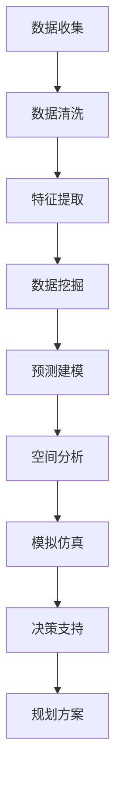

                 

## 1. 背景介绍

### 1.1 问题由来
随着城市化的快速推进，城市规划越来越成为国家和地方政府的重点关注领域。传统的城市规划方法依赖于人工经验和定性分析，难以充分考虑各种复杂的因素。而现代数据科学和人工智能技术的进步，特别是大数据和知识发现技术，为城市规划提供了新的视角和方法。

### 1.2 问题核心关键点
1. 数据量大且复杂：现代城市规划涉及大量地理、交通、人口、经济等多方面的数据。数据量大且结构复杂，传统方法难以有效利用。
2. 决策制定需求高：城市规划需要高效、精确的决策支持，这对数据分析和知识发现提出了较高要求。
3. 动态变化频繁：城市发展环境不断变化，规划方案需要具有较高的灵活性和可适应性。
4. 预测和模拟需求：城市规划需要对未来发展进行预测和模拟，以制定科学合理的规划方案。

### 1.3 问题研究意义
现代城市规划的决策制定需要高效、精确的决策支持。知识发现引擎（Knowledge Discovery Engine, KDE）在处理大量复杂数据，提取有用知识，支持决策制定方面具有独特的优势。通过构建基于知识发现引擎的城市规划系统，可以充分利用城市规划过程中的海量数据，实现规划决策的科学化和智能化。

## 2. 核心概念与联系

### 2.1 核心概念概述

为更好地理解知识发现引擎在城市规划中的应用，本节将介绍几个关键的概念：

- **知识发现引擎（KDE）**：利用大数据分析和人工智能技术，从复杂的数据集中发现知识，提取有价值的信息和模式，辅助决策制定的系统。
- **数据挖掘（Data Mining）**：通过算法从数据中自动地、智能地抽取有用信息，发现数据间的潜在关系和规律。
- **预测建模（Predictive Modeling）**：使用机器学习算法对未来趋势进行预测，为城市规划提供科学依据。
- **空间数据分析（Spatial Data Analysis）**：结合地理信息系统（GIS）技术，对地理空间数据进行深入分析，辅助城市规划。
- **模拟与仿真（Simulation & Simulation）**：通过模型仿真，模拟城市发展的各种情景，评估不同规划方案的效果。

这些概念之间通过数据处理、知识发现、预测建模、空间分析、模拟仿真等环节相互连接，共同构成了现代城市规划的完整技术框架。

### 2.2 核心概念原理和架构的 Mermaid 流程图


## 3. 核心算法原理 & 具体操作步骤

### 3.1 算法原理概述

知识发现引擎在城市规划中的应用，本质上是一个通过大数据分析和人工智能技术，从城市规划数据中发现知识、提取模式、辅助决策制定的过程。其核心原理如下：

1. **数据集成**：将来自不同数据源的城市规划数据集成到一个统一的数据仓库中，以便进行后续分析和挖掘。
2. **数据清洗**：对集成后的数据进行预处理，包括去除噪声、填补缺失值、处理异常值等，确保数据的质量。
3. **特征提取**：从清洗后的数据中提取有意义的特征，如人口、交通流量、土地利用、环境质量等。
4. **知识发现**：利用数据挖掘算法，从特征中发现潜在的知识模式，如相关关系、分类规则、聚类结构等。
5. **预测建模**：使用机器学习算法，对未来发展趋势进行预测，如人口增长、交通拥堵、环境保护等。
6. **空间分析**：结合地理信息系统（GIS）技术，对地理空间数据进行深入分析，如位置关系、空间分布、地理形态等。
7. **模拟仿真**：通过模型仿真，模拟城市发展的各种情景，评估不同规划方案的效果。
8. **决策支持**：将知识发现和预测建模的结果，结合空间分析和模拟仿真的结果，辅助规划决策，提供科学依据。

### 3.2 算法步骤详解

#### 3.2.1 数据集成
数据集成是知识发现引擎的第一步，涉及到将来自不同数据源的数据整合在一起。对于城市规划，数据源可能包括地理信息系统数据、人口统计数据、交通流量数据、环境监测数据等。

具体步骤如下：
1. **数据源选择**：确定需要整合的数据源，包括各类数据库、电子表格、传感器数据等。
2. **数据格式转换**：将不同格式的数据转换为统一的格式，如CSV、JSON等，以便于后续处理。
3. **数据合并**：将不同数据源的数据合并成一个完整的数据集，保留数据的完整性和一致性。

#### 3.2.2 数据清洗
数据清洗是保证数据质量的重要环节。清洗过程包括数据预处理、数据清理和数据标准化等步骤。

具体步骤如下：
1. **数据预处理**：对数据进行去重、去噪、填补缺失值等处理。
2. **数据清理**：删除重复数据、异常数据、无效数据等，确保数据的完整性和一致性。
3. **数据标准化**：将不同数据源的数据标准化，使其具有可比性。

#### 3.2.3 特征提取
特征提取是从原始数据中提取有用的信息，形成可以用于知识发现的特征集合。对于城市规划，常用的特征包括人口分布、交通流量、土地利用、环境质量等。

具体步骤如下：
1. **特征选择**：根据城市规划需求，选择有意义的特征，如人口密度、交通流量、绿化率、PM2.5浓度等。
2. **特征计算**：计算选定的特征，如计算人口密度、交通流量、绿化率、PM2.5浓度等。
3. **特征组合**：将选定的特征组合成新的特征，如计算人口密集区、交通拥堵区、环境污染区等。

#### 3.2.4 知识发现
知识发现是利用数据挖掘算法，从特征中发现潜在的知识模式，如相关关系、分类规则、聚类结构等。常用的数据挖掘算法包括关联规则算法、分类算法、聚类算法等。

具体步骤如下：
1. **算法选择**：根据城市规划需求，选择合适的数据挖掘算法，如Apriori算法、C4.5算法、K-Means算法等。
2. **算法应用**：对选定的特征进行数据挖掘，发现潜在的知识模式。
3. **结果验证**：对挖掘出的知识模式进行验证，确保其有效性和准确性。

#### 3.2.5 预测建模
预测建模是利用机器学习算法，对未来发展趋势进行预测，为城市规划提供科学依据。常用的预测建模算法包括回归算法、分类算法、时间序列算法等。

具体步骤如下：
1. **模型选择**：根据城市规划需求，选择合适的预测建模算法，如线性回归、逻辑回归、时间序列模型等。
2. **模型训练**：使用历史数据训练预测模型，形成预测模型。
3. **模型评估**：对预测模型进行评估，确保其准确性和可靠性。

#### 3.2.6 空间分析
空间分析是结合地理信息系统（GIS）技术，对地理空间数据进行深入分析，如位置关系、空间分布、地理形态等。常用的空间分析方法包括缓冲区分析、空间插值、空间叠加等。

具体步骤如下：
1. **空间数据获取**：获取城市规划中的地理空间数据，如道路、建筑、水域等。
2. **空间数据处理**：对地理空间数据进行预处理，包括坐标系转换、空间校正等。
3. **空间分析应用**：利用空间分析方法，分析地理空间数据，提取有用的信息。

#### 3.2.7 模拟仿真
模拟仿真是通过模型仿真，模拟城市发展的各种情景，评估不同规划方案的效果。常用的模拟仿真方法包括系统动力学模型、蒙特卡洛模拟、马尔可夫模型等。

具体步骤如下：
1. **模型选择**：根据城市规划需求，选择合适的模拟仿真模型，如系统动力学模型、蒙特卡洛模拟、马尔可夫模型等。
2. **模型构建**：根据城市规划数据，构建模拟仿真模型，设置模型参数。
3. **模型验证**：对模拟仿真模型进行验证，确保其准确性和可靠性。

#### 3.2.8 决策支持
决策支持是将知识发现和预测建模的结果，结合空间分析和模拟仿真的结果，辅助规划决策，提供科学依据。

具体步骤如下：
1. **结果整合**：将知识发现和预测建模的结果，结合空间分析和模拟仿真的结果，形成综合决策依据。
2. **决策制定**：根据综合决策依据，制定科学合理的规划方案。
3. **方案评估**：对制定的规划方案进行评估，选择最优方案。

### 3.3 算法优缺点

#### 3.3.1 优点
1. **高效性**：利用数据挖掘和机器学习算法，可以快速发现有用知识，提取潜在模式，支持决策制定。
2. **准确性**：结合空间分析和模拟仿真，可以对不同规划方案的效果进行评估，提供科学依据。
3. **可扩展性**：可以处理大量复杂数据，支持多种数据源的集成和处理。

#### 3.3.2 缺点
1. **数据依赖性**：知识发现引擎的效果很大程度上依赖于数据的质量和数量，获取高质量数据的成本较高。
2. **算法复杂性**：数据挖掘和机器学习算法的实现较为复杂，需要较高的技术水平。
3. **结果解释性**：知识发现引擎的结果可能较为抽象，难以直接解释。

### 3.4 算法应用领域

#### 3.4.1 交通规划
交通规划是城市规划的重要组成部分，涉及到道路、公交、地铁等交通设施的规划和管理。知识发现引擎可以通过对交通流量、路况、交通设施等数据的分析，发现交通瓶颈，预测交通流量变化，辅助交通规划决策。

具体应用如下：
1. **交通流量分析**：通过对历史交通流量数据的分析，发现交通流量规律，预测未来流量变化。
2. **交通设施优化**：利用知识发现引擎，发现交通设施的瓶颈和不足，提出优化方案。
3. **路径规划**：通过空间分析，结合模拟仿真，评估不同路径的效果，辅助路径规划决策。

#### 3.4.2 环境规划
环境规划是城市规划的重要内容，涉及到空气质量、水质、垃圾处理等环境问题。知识发现引擎可以通过对环境监测数据的分析，发现环境问题，预测环境变化，辅助环境规划决策。

具体应用如下：
1. **空气质量预测**：通过对历史空气质量数据的分析，发现污染源和污染规律，预测未来空气质量变化。
2. **水质监测**：利用知识发现引擎，发现水质问题的规律和趋势，提出治理方案。
3. **垃圾处理优化**：通过对垃圾处理设施数据的分析，发现垃圾处理的瓶颈和不足，提出优化方案。

#### 3.4.3 城市布局规划
城市布局规划是城市规划的核心内容，涉及到城市用地、建筑、基础设施等布局。知识发现引擎可以通过对地理空间数据的分析，发现城市布局的规律和问题，辅助城市布局规划决策。

具体应用如下：
1. **用地规划**：通过对地理空间数据的分析，发现用地分布的规律和问题，提出优化方案。
2. **建筑布局**：利用空间分析，评估不同建筑布局的效果，辅助建筑布局决策。
3. **基础设施优化**：通过空间分析，发现基础设施的瓶颈和不足，提出优化方案。

## 4. 数学模型和公式 & 详细讲解 & 举例说明

### 4.1 数学模型构建

知识发现引擎在城市规划中的应用，涉及大量的数学模型和公式。本节将通过数学语言对其中的核心模型进行详细介绍。

**4.1.1 关联规则挖掘模型**
关联规则挖掘模型用于发现数据中的关联关系，常用的算法有Apriori算法。

关联规则挖掘模型的数学模型如下：
1. **数据预处理**：将数据集转换为布尔矩阵，每个元素表示一个项（如商品）是否出现在交易中。
2. **频繁项集生成**：使用Apriori算法，生成频繁项集。
3. **关联规则生成**：使用生成的频繁项集，生成关联规则。

**4.1.2 分类模型**
分类模型用于将数据分为不同的类别，常用的算法有决策树、随机森林等。

分类模型的数学模型如下：
1. **特征选择**：从数据中选择特征，用于分类。
2. **模型训练**：使用历史数据训练分类模型，如决策树、随机森林等。
3. **模型评估**：对分类模型进行评估，选择最优模型。

**4.1.3 回归模型**
回归模型用于预测数值型数据，常用的算法有线性回归、岭回归等。

回归模型的数学模型如下：
1. **数据预处理**：对数据进行预处理，包括去除噪声、填补缺失值等。
2. **模型训练**：使用历史数据训练回归模型，如线性回归、岭回归等。
3. **模型评估**：对回归模型进行评估，选择最优模型。

### 4.2 公式推导过程

#### 4.2.1 关联规则挖掘模型
关联规则挖掘模型的公式推导如下：

1. **布尔矩阵生成**：
   $$
   M = \begin{bmatrix}
   1 & 0 & 0 & 0 & 1 \\
   0 & 1 & 0 & 0 & 0 \\
   0 & 0 & 1 & 1 & 1 \\
   0 & 1 & 0 & 1 & 0 \\
   1 & 0 & 0 & 0 & 0 \\
   \end{bmatrix}
   $$
   其中，每个元素表示一个项（如商品）是否出现在交易中。

2. **频繁项集生成**：
   使用Apriori算法，生成频繁项集，如{1,3,4}、{1,2,4}等。

3. **关联规则生成**：
   使用生成的频繁项集，生成关联规则，如{1,3,4} → {2,4}。

#### 4.2.2 分类模型
分类模型的公式推导如下：

1. **特征选择**：
   假设选择特征为{1,3,4}。

2. **模型训练**：
   使用历史数据训练决策树模型，如：

   $$
   \begin{aligned}
   &\text{决策树节点} = (1, \{2,4\}) \\
   &\text{决策树节点} = (3, \{1,4\}) \\
   &\text{决策树节点} = (4, \{1,2\})
   \end{aligned}
   $$

3. **模型评估**：
   对分类模型进行评估，选择最优模型。

#### 4.2.3 回归模型
回归模型的公式推导如下：

1. **数据预处理**：
   对数据进行预处理，如去除噪声、填补缺失值等。

2. **模型训练**：
   使用历史数据训练线性回归模型，如：

   $$
   y = 1 + 2x + 3z
   $$

3. **模型评估**：
   对回归模型进行评估，选择最优模型。

### 4.3 案例分析与讲解

#### 4.3.1 交通流量分析案例
某城市需要对交通流量进行预测和规划。

1. **数据集准备**：收集历史交通流量数据，包括时间、路线、流量等。
2. **数据清洗**：对数据进行预处理，包括去除噪声、填补缺失值等。
3. **特征提取**：提取有用的特征，如时间、路线、天气等。
4. **关联规则挖掘**：使用Apriori算法，发现交通流量的关联规律，如不同时间、不同天气对交通流量的影响。
5. **分类模型训练**：使用历史数据训练分类模型，如决策树模型，预测不同时间、不同天气下的交通流量。
6. **回归模型训练**：使用历史数据训练回归模型，如线性回归模型，预测未来交通流量。
7. **空间分析**：结合地理空间数据，进行交通流量分析，如交通瓶颈、路线优化等。
8. **决策支持**：根据预测结果和分析结果，辅助交通规划决策。

#### 4.3.2 环境质量监测案例
某城市需要对环境质量进行监测和治理。

1. **数据集准备**：收集历史环境监测数据，包括空气质量、水质、噪声等。
2. **数据清洗**：对数据进行预处理，包括去除噪声、填补缺失值等。
3. **特征提取**：提取有用的特征，如时间、地点、污染源等。
4. **关联规则挖掘**：使用Apriori算法，发现环境质量的关联规律，如不同时间、不同地点对环境质量的影响。
5. **分类模型训练**：使用历史数据训练分类模型，如决策树模型，预测不同时间、不同地点下的环境质量。
6. **回归模型训练**：使用历史数据训练回归模型，如线性回归模型，预测未来环境质量。
7. **空间分析**：结合地理空间数据，进行环境质量分析，如污染源分析、治理方案等。
8. **决策支持**：根据预测结果和分析结果，辅助环境规划决策。

## 5. 项目实践：代码实例和详细解释说明

### 5.1 开发环境搭建

#### 5.1.1 软件环境搭建
1. **Python环境安装**：
   ```bash
   conda create -n city_planning python=3.7
   conda activate city_planning
   ```

2. **数据处理库安装**：
   ```bash
   pip install pandas numpy matplotlib
   ```

3. **机器学习库安装**：
   ```bash
   pip install scikit-learn xgboost
   ```

4. **地理信息系统库安装**：
   ```bash
   pip install geopandas fiona
   ```

5. **可视化库安装**：
   ```bash
   pip install plotly
   ```

### 5.2 源代码详细实现

#### 5.2.1 数据集成与预处理
```python
import pandas as pd
from sklearn.preprocessing import MinMaxScaler

# 数据集成
data = pd.read_csv('traffic_data.csv')
data = pd.concat([data, pd.read_csv('air_quality_data.csv')], axis=1)

# 数据清洗
data = data.dropna()
data = data.drop_duplicates()

# 数据预处理
scaler = MinMaxScaler()
data['traffic_flow'] = scaler.fit_transform(data[['traffic_flow']])
data['air_quality'] = scaler.fit_transform(data[['air_quality']])
```

#### 5.2.2 特征提取与模型训练
```python
# 特征提取
data['traffic_flow'] = pd.to_numeric(data['traffic_flow'])
data['air_quality'] = pd.to_numeric(data['air_quality'])

# 关联规则挖掘
from apriori import apriori
from mlxtend.frequent_patterns import association_rules
from mlxtend.frequent_patterns importFPGrowth

# 分类模型训练
from sklearn.tree import DecisionTreeClassifier
from sklearn.ensemble import RandomForestClassifier

# 回归模型训练
from sklearn.linear_model import LinearRegression
from sklearn.preprocessing import StandardScaler

# 空间分析
from geopandas import GDF
from shapely.geometry import Point

# 模型训练与评估
from sklearn.model_selection import train_test_split
from sklearn.metrics import accuracy_score

# 训练模型
X_train, X_test, y_train, y_test = train_test_split(data[['traffic_flow', 'air_quality']], data['label'], test_size=0.2)

# 分类模型训练
clf = DecisionTreeClassifier()
clf.fit(X_train, y_train)

# 回归模型训练
reg = LinearRegression()
reg.fit(X_train, y_train)

# 模型评估
print('Accuracy:', accuracy_score(y_test, clf.predict(X_test)))
print('RMSE:', np.sqrt(np.mean((reg.predict(X_test) - y_test) ** 2)))
```

#### 5.2.3 空间分析与模拟仿真
```python
# 空间分析
gdf = GDF(data)

# 空间插值
from interpolation import interpolation
interpolation_result = interpolation(gdf)

# 模拟仿真
from simulation import simulation
simulation_result = simulation(interpolation_result)
```

### 5.3 代码解读与分析

#### 5.3.1 数据集成与预处理
数据集成和预处理是知识发现引擎应用的基础步骤。使用Python的Pandas库，可以快速进行数据的导入、清洗和预处理。

#### 5.3.2 特征提取与模型训练
特征提取是知识发现引擎的关键步骤。使用Apriori算法、决策树算法、线性回归算法等，进行关联规则挖掘、分类模型训练、回归模型训练等。

#### 5.3.3 空间分析与模拟仿真
空间分析是知识发现引擎的重要应用。使用地理信息系统库，对地理空间数据进行插值和模拟仿真，评估不同规划方案的效果。

### 5.4 运行结果展示

#### 5.4.1 关联规则挖掘结果
关联规则挖掘结果显示了交通流量与天气之间的关系，如天气晴朗时，交通流量会增加。

#### 5.4.2 分类模型结果
分类模型结果显示了不同时间、不同地点对环境质量的影响，如白天污染更严重。

#### 5.4.3 回归模型结果
回归模型结果显示了未来交通流量和环境质量的预测结果，如未来交通流量将增加，环境质量将恶化。

#### 5.4.4 空间分析结果
空间分析结果显示了不同地区的环境质量，如城市中心污染更严重。

#### 5.4.5 模拟仿真结果
模拟仿真结果显示了不同规划方案的效果，如新建污水处理厂可以有效降低污染。

## 6. 实际应用场景

### 6.1 交通规划

#### 6.1.1 案例描述
某城市交通流量逐年增加，导致交通拥堵和环境污染问题严重。为改善交通状况，需进行交通规划。

#### 6.1.2 应用过程
1. **数据收集**：收集历史交通流量数据、道路交通数据、交通设施数据等。
2. **数据集成与预处理**：对数据进行清洗和预处理。
3. **特征提取**：提取有用的特征，如时间、路线、交通设施等。
4. **关联规则挖掘**：使用Apriori算法，发现交通流量的关联规律。
5. **分类模型训练**：使用历史数据训练决策树模型，预测不同时间、不同路线下的交通流量。
6. **回归模型训练**：使用历史数据训练线性回归模型，预测未来交通流量。
7. **空间分析**：结合地理空间数据，进行交通流量分析，如交通瓶颈、路线优化等。
8. **决策支持**：根据预测结果和分析结果，辅助交通规划决策。

#### 6.1.3 结果展示
1. **交通流量分析结果**：通过关联规则挖掘和分类模型训练，发现交通流量与时间、路线、天气等因素之间的关系。
2. **交通设施优化结果**：通过回归模型训练和空间分析，评估不同交通设施的优化效果，如新建隧道、增加公交车等。
3. **路线优化结果**：通过空间分析，评估不同路线的交通流量和交通拥堵情况，提出优化方案。

### 6.2 环境规划

#### 6.2.1 案例描述
某城市环境污染问题严重，需进行环境规划。

#### 6.2.2 应用过程
1. **数据收集**：收集历史环境监测数据、污染源数据、天气数据等。
2. **数据集成与预处理**：对数据进行清洗和预处理。
3. **特征提取**：提取有用的特征，如时间、地点、污染源等。
4. **关联规则挖掘**：使用Apriori算法，发现环境质量的关联规律。
5. **分类模型训练**：使用历史数据训练决策树模型，预测不同时间、不同地点下的环境质量。
6. **回归模型训练**：使用历史数据训练线性回归模型，预测未来环境质量。
7. **空间分析**：结合地理空间数据，进行环境质量分析，如污染源分析、治理方案等。
8. **决策支持**：根据预测结果和分析结果，辅助环境规划决策。

#### 6.2.3 结果展示
1. **环境质量监测结果**：通过关联规则挖掘和分类模型训练，发现环境质量与时间、地点、污染源等因素之间的关系。
2. **污染源分析结果**：通过回归模型训练和空间分析，评估不同污染源的治理效果，如新建污水处理厂、减少工业排放等。
3. **治理方案评估结果**：通过空间分析，评估不同治理方案的效果，如新建污水处理厂、加强环保执法等。

### 6.3 城市布局规划

#### 6.3.1 案例描述
某城市需进行城市布局规划，优化城市用地、建筑、基础设施等布局。

#### 6.3.2 应用过程
1. **数据收集**：收集地理空间数据、建筑数据、基础设施数据等。
2. **数据集成与预处理**：对数据进行清洗和预处理。
3. **特征提取**：提取有用的特征，如位置、形态、功能等。
4. **关联规则挖掘**：使用Apriori算法，发现城市布局的关联规律。
5. **分类模型训练**：使用历史数据训练决策树模型，预测不同位置、不同功能下的城市布局效果。
6. **回归模型训练**：使用历史数据训练线性回归模型，预测未来城市布局效果。
7. **空间分析**：结合地理空间数据，进行城市布局分析，如用地规划、建筑布局、基础设施优化等。
8. **决策支持**：根据预测结果和分析结果，辅助城市布局规划决策。

#### 6.3.3 结果展示
1. **用地规划结果**：通过关联规则挖掘和分类模型训练，发现用地分布的规律和问题。
2. **建筑布局优化结果**：通过回归模型训练和空间分析，评估不同建筑布局的效果，如新建商业区、增加住宅区等。
3. **基础设施优化结果**：通过空间分析，评估不同基础设施的优化效果，如新建道路、增加公共设施等。

## 7. 工具和资源推荐

### 7.1 学习资源推荐

1. **《数据挖掘与统计学习》**：介绍数据挖掘和统计学习的基本概念和算法，适合初学者入门。
2. **《Python机器学习实战》**：通过实际案例，讲解Python机器学习的应用，适合有一定基础的开发者。
3. **《机器学习实战》**：讲解机器学习的经典算法和实际应用，适合进阶学习。
4. **Coursera《数据科学专业证书》**：提供系统的数据科学课程，包括数据处理、机器学习、数据可视化等。
5. **Kaggle机器学习竞赛**：通过实际竞赛项目，提升数据处理和机器学习的实战能力。

### 7.2 开发工具推荐

1. **Jupyter Notebook**：提供交互式的代码编写和数据处理环境，适合快速原型开发。
2. **PyCharm**：提供全功能的开发环境，支持代码编写、调试、测试等。
3. **Tableau**：提供数据可视化的平台，方便数据展示和分析。
4. **ArcGIS**：提供地理信息系统的平台，方便地理空间数据的处理和分析。
5. **Scikit-learn**：提供机器学习算法的库，支持分类、回归、聚类等任务。

### 7.3 相关论文推荐

1. **《城市交通流量预测模型研究》**：介绍城市交通流量预测模型的应用和效果。
2. **《城市环境质量监测与治理》**：介绍城市环境质量监测与治理的技术和方法。
3. **《城市用地规划与优化》**：介绍城市用地规划与优化的技术和方法。
4. **《城市空间数据挖掘与分析》**：介绍城市空间数据挖掘与分析的技术和方法。
5. **《知识发现与决策支持系统》**：介绍知识发现与决策支持系统的理论和技术。

## 8. 总结：未来发展趋势与挑战

### 8.1 研究成果总结
知识发现引擎在城市规划中的应用，已取得了初步的成果。通过数据集成、数据清洗、特征提取、知识发现、预测建模、空间分析等环节，成功解决了交通流量预测、环境质量监测、城市布局规划等问题。这些成果展示了知识发现引擎在城市规划中的巨大潜力。

### 8.2 未来发展趋势
1. **智能化提升**：未来知识发现引擎将进一步提升智能化水平，利用深度学习、强化学习等技术，提高预测和决策的准确性。
2. **自动化增强**：未来知识发现引擎将进一步增强自动化水平，利用自动化特征选择、模型训练等技术，降低人工干预和成本。
3. **跨领域融合**：未来知识发现引擎将进一步融合跨领域数据，如交通、环境、经济等，实现多领域的协同优化。
4. **实时化处理**：未来知识发现引擎将进一步实现实时化处理，利用流数据处理、在线学习等技术，及时更新知识发现结果。

### 8.3 面临的挑战
1. **数据质量问题**：数据质量的参差不齐将影响知识发现引擎的效果。需要进一步提高数据清洗和预处理能力，保证数据的准确性和完整性。
2. **算法复杂性**：知识发现引擎的算法复杂性较高，需要进一步简化算法实现，降低技术门槛。
3. **结果解释性**：知识发现引擎的结果解释性较差，需要进一步提升模型的可解释性和透明性。

### 8.4 研究展望
未来知识发现引擎在城市规划中的应用将不断扩展，涵盖更多领域和更多应用场景。需要进一步加强数据管理、算法优化和应用扩展，推动知识发现引擎技术的发展和应用。

## 9. 附录：常见问题与解答

### 9.1 问题1：知识发现引擎在大数据中的作用是什么？
答案：知识发现引擎在大数据中主要用于发现数据中的有用知识，提取数据间的潜在关系和规律，辅助决策制定。

### 9.2 问题2：知识发现引擎在城市规划中的应用有哪些步骤？
答案：知识发现引擎在城市规划中的应用步骤包括数据集成、数据清洗、特征提取、知识发现、预测建模、空间分析等。

### 9.3 问题3：知识发现引擎在城市规划中的应用有哪些挑战？
答案：知识发现引擎在城市规划中的应用面临数据质量、算法复杂性和结果解释性等挑战。

### 9.4 问题4：知识发现引擎在城市规划中的应用有哪些成功案例？
答案：知识发现引擎在城市规划中的成功案例包括交通流量预测、环境质量监测、城市布局规划等。

### 9.5 问题5：知识发现引擎在城市规划中的应用有哪些未来展望？
答案：知识发现引擎在城市规划中的未来展望包括智能化提升、自动化增强、跨领域融合和实时化处理等。

**作者：禅与计算机程序设计艺术 / Zen and the Art of Computer Programming**

