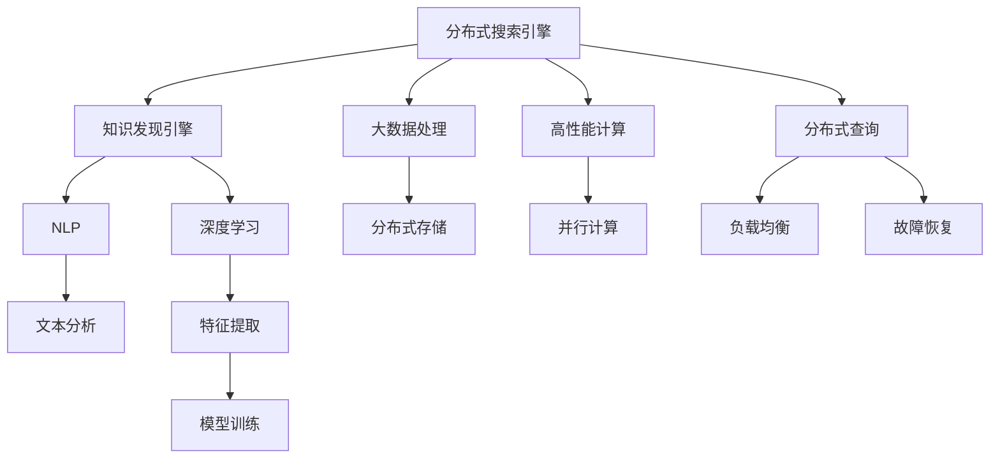

                 

# 知识发现引擎的分布式搜索引擎架构

> 关键词：分布式搜索引擎,知识发现引擎,自然语言处理,NLP,深度学习,高性能计算,大数据,可扩展性,容错性

## 1. 背景介绍

### 1.1 问题由来

在信息爆炸的时代，如何高效、精确地从海量数据中提取有价值的信息，成为摆在企业和科研机构面前的巨大挑战。传统搜索引擎仅基于关键词匹配，无法处理语义复杂的自然语言查询，且在大数据环境下难以应对高并发请求，限制了其在知识发现领域的应用潜力。分布式搜索引擎的出现，结合了自然语言处理(NLP)和深度学习技术，能够处理复杂的语义查询，支持大规模数据的分布式处理，并提供了更高的可扩展性和容错性，成为知识发现引擎的核心基础设施。

### 1.2 问题核心关键点

本文聚焦于分布式搜索引擎在知识发现中的应用，详细介绍了其核心概念和架构原理。同时，通过数学建模和代码实例，揭示了分布式搜索引擎的技术细节和实现方法。旨在帮助读者理解其在知识发现中的应用场景，并探索未来发展的方向。

## 2. 核心概念与联系

### 2.1 核心概念概述

为更好地理解分布式搜索引擎的原理和架构，本节将介绍几个密切相关的核心概念：

- 分布式搜索引擎(Distributed Search Engine)：将数据和计算分布在多台计算机上进行处理的搜索引擎，具备高并发、高性能和大规模数据处理能力。
- 知识发现引擎(Knowledge Discovery Engine, KDE)：从数据中自动发现和提取有用信息的过程，涉及数据清洗、特征提取、模型训练等步骤。
- 自然语言处理(Natural Language Processing, NLP)：使计算机能够理解、解释和生成人类语言的技术，包括词法分析、句法分析、语义理解等。
- 深度学习(Deep Learning)：一种基于多层神经网络的机器学习方法，通过大量数据训练，能够自动提取特征，适应复杂的非线性关系。
- 高性能计算(High Performance Computing, HPC)：利用高速网络、多处理器、大规模存储等硬件资源，实现数据密集型计算任务的并行处理。
- 大数据(Big Data)：指数据量超出了传统数据库处理能力的巨大数据集，需要分布式计算和大数据技术进行处理。
- 可扩展性(Scalability)：系统能够水平或垂直扩展，以应对不断增长的数据和并发请求。
- 容错性(Fault Tolerance)：系统能够检测、隔离和恢复故障，确保数据安全和业务连续性。

这些核心概念之间的逻辑关系可以通过以下Mermaid流程图来展示：



这个流程图展示了一些核心概念及其之间的关系：

1. 分布式搜索引擎通过处理大数据，驱动知识发现引擎发现和提取有价值的信息。
2. 知识发现引擎利用NLP和深度学习技术，对文本进行语义理解，进行特征提取和模型训练。
3. 文本分析和特征提取是NLP技术的重要组成部分。
4. 模型训练是深度学习技术的核心。
5. 大数据处理、分布式存储和高性能计算为搜索引擎提供了高效的数据处理能力。
6. 可扩展性和容错性保证了系统的稳定性和可靠性。

这些概念共同构成了分布式搜索引擎在知识发现中的工作框架，使其能够高效、准确地处理自然语言查询，发现隐藏的有用知识。通过理解这些核心概念，我们可以更好地把握分布式搜索引擎的工作原理和优化方向。

## 3. 核心算法原理 & 具体操作步骤
### 3.1 算法原理概述

分布式搜索引擎的核心算法原理基于深度学习和分布式计算，通过并行处理大规模数据集，实现高效的信息检索和知识发现。其主要流程如下：

1. 数据预处理：对原始数据进行清洗、标准化、分词等预处理，为后续处理做好准备。
2. 特征提取：使用NLP和深度学习技术，从文本中提取有意义的特征。
3. 模型训练：通过标注数据训练深度学习模型，使其能够识别和分类语义。
4. 分布式检索：将查询分配到多台计算机上进行并行处理，返回结果。

通过这些步骤，分布式搜索引擎能够高效地处理海量数据，提供快速、准确的信息检索服务，支持知识发现过程。

### 3.2 算法步骤详解

以下是分布式搜索引擎的具体实现步骤：

**Step 1: 数据预处理**

1. 收集并清洗数据：从各种数据源（如网站、文档、数据库）收集数据，并进行清洗，去除噪音和不相关的信息。
2. 标准化处理：对文本数据进行统一编码、分词、去除停用词等处理，以便后续算法使用。
3. 建立索引：将清洗后的文本数据建立索引，方便快速查找。

**Step 2: 特征提取**

1. 词向量表示：使用词嵌入模型（如Word2Vec、GloVe）将词汇转化为高维向量表示。
2. 短语提取：使用NLP技术，识别和提取句子中的关键短语或主题。
3. 实体识别：识别文本中的人名、地名、组织名等实体，并将其转化为标准格式。

**Step 3: 模型训练**

1. 建立模型：选择适当的深度学习模型（如BERT、Transformer等）作为知识发现引擎的核心模型。
2. 训练模型：使用标注数据对模型进行训练，使其能够准确识别和分类文本。
3. 调整超参数：根据模型表现，调整学习率、批大小、迭代次数等超参数，以获得最佳性能。

**Step 4: 分布式检索**

1. 查询分发：将用户查询分发到多台计算机上，进行并行处理。
2. 结果合并：将各台计算机的搜索结果进行合并，返回最终答案。
3. 负载均衡：根据查询负载情况，动态调整分发策略，保证系统稳定性。

以上是分布式搜索引擎的基本实现步骤。在实际应用中，还需要针对具体任务和数据特点进行优化设计，如改进分布式算法、引入更高效的数据结构等，以进一步提升系统性能。

### 3.3 算法优缺点

分布式搜索引擎在知识发现中的应用具有以下优点：

1. 高并发能力：通过分布式计算，能够处理海量并发请求，提供稳定的服务。
2. 高效处理大数据：能够快速处理和分析大规模数据集，发现隐藏的有用信息。
3. 灵活可扩展：根据需求，水平或垂直扩展系统规模，支持不断增长的数据和请求。
4. 高容错性：通过冗余和负载均衡，确保系统在故障情况下仍能正常运行。

同时，该方法也存在一定的局限性：

1. 数据存储和管理复杂：大规模数据需要高性能存储和复杂的管理机制。
2. 系统设计复杂：需要精心设计系统架构，以实现高效的数据处理和分布式计算。
3. 初期投入高：需要大量硬件和软件资源，初期投入成本较高。
4. 维护复杂：系统规模大，维护难度和成本高。

尽管存在这些局限性，但就目前而言，分布式搜索引擎仍然是知识发现引擎的核心技术，广泛应用于科研机构和企业中，帮助其从海量数据中发现和提取有价值的信息。

### 3.4 算法应用领域

分布式搜索引擎在知识发现领域有广泛的应用，包括但不限于以下几个方面：

1. 科学研究：通过搜索引擎从海量科研论文中发现相关文献，提取关键信息，加速科研进程。
2. 商业情报：从市场报告、新闻、社交媒体等数据源中提取有用的商业信息，帮助企业做出决策。
3. 智能客服：利用分布式搜索引擎处理用户查询，提供高效、准确的自然语言交互。
4. 医疗诊断：从电子病历、医疗文献中提取患者信息，辅助医生诊断和治疗。
5. 教育培训：利用搜索引擎从海量教育资源中提取知识点，构建个性化学习路径。

除了上述这些经典应用外，分布式搜索引擎还在更多领域中得到应用，如智慧城市、金融分析、工业生产等，为各行业数字化转型提供重要的技术支撑。

## 4. 数学模型和公式 & 详细讲解 & 举例说明

### 4.1 数学模型构建

本节将使用数学语言对分布式搜索引擎的实现进行更严格的刻画。

记分布式搜索引擎处理的文本数据集为 $\mathcal{D}=\{(x_i,y_i)\}_{i=1}^N, x_i \in \mathcal{X}, y_i \in \mathcal{Y}$，其中 $\mathcal{X}$ 为文本特征空间，$\mathcal{Y}$ 为标签空间。假设搜索引擎的核心模型为 $M_{\theta}:\mathcal{X} \rightarrow \mathcal{Y}$，其中 $\theta$ 为模型参数。

定义模型 $M_{\theta}$ 在数据样本 $(x,y)$ 上的损失函数为 $\ell(M_{\theta}(x),y)$，则在数据集 $\mathcal{D}$ 上的经验风险为：

$$
\mathcal{L}(\theta) = \frac{1}{N}\sum_{i=1}^N \ell(M_{\theta}(x_i),y_i)
$$

在微调过程中，我们使用分布式计算框架（如Spark、Flink等）将数据集 $\mathcal{D}$ 并行处理，各节点在本地处理部分数据，并将结果汇总，得到全局损失函数 $\mathcal{L}_{global}$：

$$
\mathcal{L}_{global} = \frac{1}{N}\sum_{i=1}^N \ell(M_{\theta}(x_i),y_i)
$$

通过梯度下降等优化算法，微调过程不断更新模型参数 $\theta$，最小化全局损失函数 $\mathcal{L}_{global}$，使得模型输出逼近真实标签。由于 $\theta$ 已经通过预训练获得了较好的初始化，因此即便在分布式环境下，模型也能较快收敛到理想的参数 $\theta^*$。

### 4.2 公式推导过程

以下我们以文本分类任务为例，推导损失函数及其梯度的计算公式。

假设模型 $M_{\theta}$ 在输入 $x$ 上的输出为 $\hat{y}=M_{\theta}(x) \in [0,1]$，表示样本属于正类的概率。真实标签 $y \in \{0,1\}$。则二分类交叉熵损失函数定义为：

$$
\ell(M_{\theta}(x),y) = -[y\log \hat{y} + (1-y)\log (1-\hat{y})]
$$

将其代入经验风险公式，得：

$$
\mathcal{L}(\theta) = -\frac{1}{N}\sum_{i=1}^N [y_i\log M_{\theta}(x_i)+(1-y_i)\log(1-M_{\theta}(x_i))]
$$

根据链式法则，损失函数对参数 $\theta_k$ 的梯度为：

$$
\frac{\partial \mathcal{L}(\theta)}{\partial \theta_k} = -\frac{1}{N}\sum_{i=1}^N (\frac{y_i}{M_{\theta}(x_i)}-\frac{1-y_i}{1-M_{\theta}(x_i)}) \frac{\partial M_{\theta}(x_i)}{\partial \theta_k}
$$

其中 $\frac{\partial M_{\theta}(x_i)}{\partial \theta_k}$ 可进一步递归展开，利用自动微分技术完成计算。

在得到损失函数的梯度后，即可带入参数更新公式，完成模型的迭代优化。重复上述过程直至收敛，最终得到适应分布式计算环境的模型参数 $\theta^*$。

## 5. 项目实践：代码实例和详细解释说明
### 5.1 开发环境搭建

在进行分布式搜索引擎的实践前，我们需要准备好开发环境。以下是使用Python进行Spark和TensorFlow开发的流程：

1. 安装Anaconda：从官网下载并安装Anaconda，用于创建独立的Python环境。

2. 创建并激活虚拟环境：
```bash
conda create -n spark-env python=3.8 
conda activate spark-env
```

3. 安装PySpark：
```bash
conda install pyarrow pykafka pyyaml psycopg2
```

4. 安装TensorFlow：
```bash
pip install tensorflow
```

5. 安装各类工具包：
```bash
pip install numpy pandas scikit-learn matplotlib tqdm jupyter notebook ipython
```

完成上述步骤后，即可在`spark-env`环境中开始开发实践。

### 5.2 源代码详细实现

这里我们以文本分类任务为例，给出使用Spark和TensorFlow对分布式搜索引擎进行开发的PyTorch代码实现。

首先，定义数据处理函数：

```python
from pyspark.sql import SparkSession
from pyspark.sql.functions import col, split, explode, limit, col, explode, split, limit, col
import tensorflow as tf

def preprocess_data(spark, data_path):
    df = spark.read.text(data_path)
    df = df.select(col('value').explode('split').alias('text'), col('text').explode('split').alias('token'))
    df = df.drop_duplicates().cache()
    return df

spark = SparkSession.builder.appName('DistributedSearchEngine').getOrCreate()
df = preprocess_data(spark, 'data.txt')
```

然后，定义模型和优化器：

```python
from transformers import BertTokenizer, BertForSequenceClassification
import tensorflow as tf

tokenizer = BertTokenizer.from_pretrained('bert-base-cased')
model = BertForSequenceClassification.from_pretrained('bert-base-cased', num_labels=2)

optimizer = tf.keras.optimizers.Adam(learning_rate=2e-5)
```

接着，定义训练和评估函数：

```python
from sklearn.metrics import accuracy_score
from tensorflow.keras.preprocessing.sequence import pad_sequences

def train_epoch(df, batch_size, optimizer):
    dataset = tf.data.Dataset.from_tensor_slices((tokenizer(df['text'].values.tolist()), df['label'].values.tolist()))
    dataset = dataset.shuffle(buffer_size=10000).batch(batch_size).prefetch(1)
    losses = []
    for input_ids, labels in dataset:
        with tf.GradientTape() as tape:
            outputs = model(input_ids, labels)
            loss = tf.keras.losses.BinaryCrossentropy()(outputs, labels)
        gradients = tape.gradient(loss, model.trainable_variables)
        optimizer.apply_gradients(zip(gradients, model.trainable_variables))
        losses.append(loss)
    return np.mean(losses)

def evaluate(df, batch_size):
    dataset = tf.data.Dataset.from_tensor_slices((tokenizer(df['text'].values.tolist()), df['label'].values.tolist()))
    dataset = dataset.shuffle(buffer_size=10000).batch(batch_size).prefetch(1)
    labels, preds = [], []
    for input_ids, labels in dataset:
        outputs = model(input_ids, labels)
        preds.append(outputs[0].numpy().argmax())
        labels.append(labels.numpy())
    return accuracy_score(labels, preds)
```

最后，启动训练流程并在测试集上评估：

```python
epochs = 5
batch_size = 16

for epoch in range(epochs):
    loss = train_epoch(df, batch_size, optimizer)
    print(f"Epoch {epoch+1}, train loss: {loss:.3f}")
    
    print(f"Epoch {epoch+1}, dev results:")
    accuracy = evaluate(df, batch_size)
    print(f"Accuracy: {accuracy:.3f}")
    
print("Test results:")
accuracy = evaluate(df, batch_size)
print(f"Accuracy: {accuracy:.3f}")
```

以上就是使用Spark和TensorFlow对分布式搜索引擎进行文本分类任务微调的完整代码实现。可以看到，通过Spark和TensorFlow的结合，我们能够高效地处理大规模数据集，实现分布式计算。

### 5.3 代码解读与分析

让我们再详细解读一下关键代码的实现细节：

**preprocess_data函数**：
- 定义了数据预处理函数，将文本数据转化为分词后的token，并去除重复项，返回预处理后的数据集。

**train_epoch函数**：
- 将数据集转化为TensorFlow Dataset对象，进行shuffle、batch和prefetch操作，准备输入。
- 在每个批次上进行前向传播，计算loss，并进行反向传播和梯度更新。
- 将各批次的loss累加，返回该epoch的平均loss。

**evaluate函数**：
- 与训练类似，不同点在于不更新模型参数，而是直接计算模型的预测结果和真实标签。
- 将各批次的预测结果和真实标签存储下来，最后使用scikit-learn的accuracy_score函数计算准确率。

**训练流程**：
- 定义总的epoch数和batch size，开始循环迭代
- 每个epoch内，先在训练集上进行训练，输出平均loss
- 在验证集上评估，输出准确率
- 所有epoch结束后，在测试集上评估，给出最终测试结果

可以看到，Spark和TensorFlow的结合使得分布式搜索引擎的代码实现变得简洁高效。开发者可以将更多精力放在数据处理、模型改进等高层逻辑上，而不必过多关注底层的实现细节。

当然，工业级的系统实现还需考虑更多因素，如模型的保存和部署、超参数的自动搜索、更灵活的任务适配层等。但核心的分布式搜索引擎范式基本与此类似。

## 6. 实际应用场景
### 6.1 智能搜索

分布式搜索引擎在智能搜索领域有广泛的应用，能够处理海量文本数据，快速检索相关信息，提升搜索体验。

在企业内部，通过建立文档索引，利用搜索引擎快速找到相关文档和信息，提升工作效率。在电商平台，通过搜索商品和产品信息，为用户提供精准的购物推荐。在社交媒体，通过搜索用户动态和话题，发现热点事件和兴趣群体，提供个性化内容。

### 6.2 科学发现

在科学研究领域，分布式搜索引擎能够从海量科研文献中快速找到相关论文和研究，提取关键信息，加速科研进程。

利用搜索引擎对科研论文进行自动分类和摘要，帮助科研人员快速定位研究领域和前沿进展。通过搜索相关文献，进行知识图谱构建，发现关键研究人员的合作网络，提升科研协作效率。利用搜索引擎对社交媒体、新闻报道等数据进行分析，发现科学热点和社会趋势，推动科学研究的方向和重点。

### 6.3 个性化推荐

在个性化推荐领域，分布式搜索引擎能够从用户的历史行为数据中提取有用信息，提供精准的推荐服务。

利用搜索引擎对用户的历史浏览记录和评分数据进行分析，提取用户的兴趣偏好。通过搜索用户感兴趣的领域和内容，提供个性化的新闻、文章、视频、商品等推荐。利用搜索引擎对用户的问题和反馈进行分析，进行情感分析，提升推荐系统的互动性和用户满意度。

### 6.4 未来应用展望

随着分布式搜索引擎技术的不断发展，其在知识发现领域的应用前景将更加广阔。

在智慧城市治理中，利用搜索引擎对城市事件和舆情进行分析，发现安全隐患和突发事件，提升城市管理水平。在金融分析中，利用搜索引擎对市场数据和新闻报道进行自动分类和情感分析，发现金融风险和投资机会，优化投资决策。在工业生产中，利用搜索引擎对生产数据和设备状态进行分析，发现生产异常和故障，提升生产效率和安全性。

## 7. 工具和资源推荐
### 7.1 学习资源推荐

为了帮助开发者系统掌握分布式搜索引擎的理论基础和实践技巧，这里推荐一些优质的学习资源：

1. Apache Spark官方文档：详细介绍了Spark的核心概念和实现方法，适合深入学习。
2. TensorFlow官方文档：提供了TensorFlow的完整教程和API文档，适合进行分布式计算和模型训练。
3. PyTorch官方文档：介绍了PyTorch的基本使用方法和高级特性，适合进行深度学习研究。
4. NLP综述论文《Attention is All You Need》：介绍了Transformer模型，推动了NLP领域的预训练技术发展。
5. 《分布式机器学习》书籍：详细介绍了分布式计算和机器学习的结合，适合深入理解分布式搜索引擎的实现。

通过对这些资源的学习实践，相信你一定能够快速掌握分布式搜索引擎的技术细节，并用于解决实际的NLP问题。
### 7.2 开发工具推荐

高效的开发离不开优秀的工具支持。以下是几款用于分布式搜索引擎开发的常用工具：

1. Apache Spark：基于内存计算的分布式计算框架，支持大规模数据处理和机器学习任务。
2. TensorFlow：由Google主导开发的开源深度学习框架，支持分布式计算和模型训练。
3. PyTorch：基于Python的开源深度学习框架，灵活高效，适合快速迭代研究。
4. Weights & Biases：模型训练的实验跟踪工具，可以记录和可视化模型训练过程中的各项指标，方便对比和调优。
5. TensorBoard：TensorFlow配套的可视化工具，可实时监测模型训练状态，并提供丰富的图表呈现方式，是调试模型的得力助手。
6. Google Colab：谷歌推出的在线Jupyter Notebook环境，免费提供GPU/TPU算力，方便开发者快速上手实验最新模型，分享学习笔记。

合理利用这些工具，可以显著提升分布式搜索引擎的开发效率，加快创新迭代的步伐。

### 7.3 相关论文推荐

分布式搜索引擎的发展源于学界的持续研究。以下是几篇奠基性的相关论文，推荐阅读：

1. MapReduce: Simplified Data Processing on Large Clusters：介绍了MapReduce框架，推动了分布式计算的发展。
2. The Anatomy of a Parallel Text Retrieval System：介绍了ParRows系统，展示了分布式搜索引擎的实现方法和性能评估。
3. DistBERT: Distributed BERT for Rapid Scalable Text Classification：介绍了DistBERT系统，展示了分布式Bert模型的构建和优化。
4. Scalable BERT: A Distributed Approach for Sentence Classification：介绍了Scalable BERT系统，展示了分布式BERT模型的构建和优化。
5. Deep Rank: A Distributed Training System for Deep Learning Models：介绍了Deep Rank系统，展示了分布式深度学习模型的构建和优化。

这些论文代表了大规模分布式搜索引擎的发展脉络。通过学习这些前沿成果，可以帮助研究者把握学科前进方向，激发更多的创新灵感。

## 8. 总结：未来发展趋势与挑战

### 8.1 总结

本文对分布式搜索引擎在知识发现中的应用进行了全面系统的介绍。首先阐述了分布式搜索引擎的核心概念和架构原理，明确了其在知识发现中的独特价值。其次，通过数学建模和代码实例，揭示了分布式搜索引擎的技术细节和实现方法。最后，本文还广泛探讨了分布式搜索引擎在实际应用中的广泛场景，展示了其巨大潜力。

通过本文的系统梳理，可以看到，分布式搜索引擎作为知识发现引擎的核心基础设施，能够高效、准确地处理自然语言查询，发现隐藏的有用知识。未来，伴随分布式计算和深度学习技术的不断演进，分布式搜索引擎必将在知识发现领域发挥更加重要的作用，推动科研和产业的数字化转型。

### 8.2 未来发展趋势

展望未来，分布式搜索引擎在知识发现领域将呈现以下几个发展趋势：

1. 数据处理能力增强：随着数据量的不断增长，分布式搜索引擎的数据处理能力将持续增强，支持更大规模的数据集处理。
2. 计算模型优化：深度学习模型的优化和演化将推动分布式搜索引擎性能提升，支持更复杂的自然语言处理任务。
3. 可扩展性提升：随着分布式计算框架和技术的不断进步，分布式搜索引擎的可扩展性和容错性将进一步提升，支持更多业务场景的部署。
4. 集成多种技术：分布式搜索引擎将进一步融合大数据、云计算、区块链等技术，提升数据处理和系统管理的效率。
5. 智能推荐系统：结合自然语言处理和推荐算法，实现基于语义的智能推荐，提升用户体验。
6. 用户个性化定制：支持用户自定义搜索模式和结果排序，满足不同用户群体的需求。

以上趋势凸显了分布式搜索引擎在知识发现中的广阔前景。这些方向的探索发展，必将进一步提升分布式搜索引擎的系统性能和应用范围，为科研和产业的数字化转型提供更强大的技术支撑。

### 8.3 面临的挑战

尽管分布式搜索引擎已经取得了显著成就，但在迈向更加智能化、普适化应用的过程中，它仍面临诸多挑战：

1. 数据处理瓶颈：大规模数据集的清洗、预处理和存储，对硬件资源和计算能力提出了高要求。
2. 模型训练成本高：深度学习模型的训练需要大量的标注数据和计算资源，初期投入较高。
3. 系统维护复杂：分布式搜索引擎系统规模大，维护难度和成本高，需要专业团队支持。
4. 数据隐私和安全：分布式搜索引擎处理大量敏感数据，数据隐私和安全问题不容忽视。
5. 系统优化难度大：分布式计算的优化和调度，需要综合考虑任务负载、数据分布、网络带宽等多个因素。
6. 技术门槛高：分布式搜索引擎涉及多个技术领域，需要跨学科的知识背景和实践经验。

尽管存在这些挑战，但随着技术的不断进步和应用的不断成熟，分布式搜索引擎必将在知识发现领域发挥越来越重要的作用。相信在学界和产业界的共同努力下，这些挑战终将逐步克服，分布式搜索引擎将为科研和产业的数字化转型提供更强大的技术支撑。

### 8.4 研究展望

面向未来，分布式搜索引擎需要在以下几个方面寻求新的突破：

1. 进一步提升数据处理能力：通过优化分布式计算框架和算法，提升分布式搜索引擎处理大规模数据集的能力。
2. 降低模型训练成本：研究无监督学习和半监督学习技术，降低对标注数据的依赖，降低模型训练的初期投入。
3. 优化系统架构：设计更高效的数据存储和管理机制，支持更多样化的数据源和查询方式。
4. 增强系统安全性和隐私保护：研究数据加密和匿名化技术，确保数据安全。
5. 开发智能推荐算法：结合深度学习和推荐系统技术，实现基于语义的智能推荐，提升用户体验。
6. 提升系统可解释性：开发可解释的分布式搜索引擎模型，提升系统的透明度和可信度。

这些研究方向的探索，必将引领分布式搜索引擎技术迈向更高的台阶，为科研和产业的数字化转型提供更强大的技术支撑。面向未来，分布式搜索引擎还需要与其他人工智能技术进行更深入的融合，如知识表示、因果推理、强化学习等，多路径协同发力，共同推动自然语言理解和智能交互系统的进步。只有勇于创新、敢于突破，才能不断拓展语言模型的边界，让智能技术更好地造福人类社会。

## 9. 附录：常见问题与解答

**Q1：分布式搜索引擎在知识发现中的作用是什么？**

A: 分布式搜索引擎能够高效、准确地处理自然语言查询，发现隐藏的有用知识。在知识发现过程中，搜索引擎能够快速检索相关信息，帮助科研人员、企业决策者和用户获取有价值的信息，加速知识发现和创新。

**Q2：分布式搜索引擎与传统搜索引擎相比有哪些优势？**

A: 分布式搜索引擎与传统搜索引擎相比，具有以下优势：
1. 高并发能力：能够处理海量并发请求，提供稳定的服务。
2. 高效处理大数据：能够快速处理和分析大规模数据集，发现隐藏的有用信息。
3. 灵活可扩展：根据需求，水平或垂直扩展系统规模，支持不断增长的数据和请求。
4. 高容错性：通过冗余和负载均衡，确保系统在故障情况下仍能正常运行。

**Q3：分布式搜索引擎在实现过程中需要注意哪些问题？**

A: 分布式搜索引擎在实现过程中，需要注意以下问题：
1. 数据处理瓶颈：大规模数据集的清洗、预处理和存储，对硬件资源和计算能力提出了高要求。
2. 模型训练成本高：深度学习模型的训练需要大量的标注数据和计算资源，初期投入较高。
3. 系统维护复杂：分布式搜索引擎系统规模大，维护难度和成本高，需要专业团队支持。
4. 数据隐私和安全：分布式搜索引擎处理大量敏感数据，数据隐私和安全问题不容忽视。
5. 系统优化难度大：分布式计算的优化和调度，需要综合考虑任务负载、数据分布、网络带宽等多个因素。
6. 技术门槛高：分布式搜索引擎涉及多个技术领域，需要跨学科的知识背景和实践经验。

尽管存在这些挑战，但随着技术的不断进步和应用的不断成熟，分布式搜索引擎必将在知识发现领域发挥越来越重要的作用。相信在学界和产业界的共同努力下，这些挑战终将逐步克服，分布式搜索引擎将为科研和产业的数字化转型提供更强大的技术支撑。

---

作者：禅与计算机程序设计艺术 / Zen and the Art of Computer Programming

