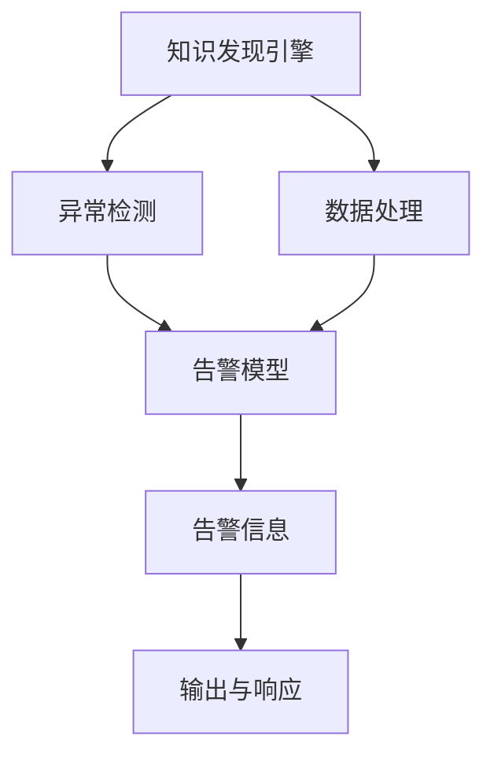

                 

# 知识发现引擎的实时监控告警系统

## 1. 背景介绍

### 1.1 问题由来
在现代数据驱动的决策过程中，知识发现引擎(Knowledge Discovery Engine, KDE)作为智能分析工具，正被广泛应用于金融、医疗、电信、电子商务等多个领域。它通过从大量复杂数据中挖掘出有价值的知识模式，帮助决策者从海量信息中提取有意义的洞见，以支持更优的业务决策。

然而，面对瞬息万变的数据环境，知识发现引擎的稳定运行变得尤为重要。实时监控和告警机制作为保障系统安全、稳定运行的关键手段，在确保知识发现引擎高可用性和用户体验上起到了至关重要的作用。但现实情况中，许多企业仍缺乏有效的实时监控告警系统，或存在告警信息冗余、误报率高、无法快速定位问题等痛点。

为了解决这些问题，本文将详细介绍基于大语言模型微调技术构建的实时监控告警系统。通过使用知识发现引擎生成的自然语言描述作为输入，设计高效的告警模型，以提高告警信息的准确性和时效性。

## 2. 核心概念与联系

### 2.1 核心概念概述

为更好地理解本系统，本节将介绍几个核心概念：

- **知识发现引擎(KDE)**：基于数据挖掘、机器学习和人工智能等技术的系统，可以从复杂数据中提炼出有价值的模式和洞见，帮助决策者做出更明智的决策。

- **自然语言处理(NLP)**：通过计算机处理、理解、生成自然语言，以实现信息提取、文本分类、情感分析、机器翻译等功能。

- **实时监控告警**：实时监控系统性能，在检测到异常事件时自动触发告警，及时通知相关人员进行处理。

- **大语言模型(LLM)**：基于Transformer架构的深度学习模型，通过大规模预训练学习语言的表示和理解能力。

- **微调(Fine-tuning)**：在预训练模型的基础上，使用特定任务的数据进行有监督学习，优化模型以适应特定任务。

### 2.2 核心概念原理和架构的 Mermaid 流程图



该图展示了知识发现引擎的实时监控告警系统架构：知识发现引擎生成的数据在数据处理模块进行清洗、转换和组织后，进入异常检测模块。异常检测模块通过检测系统性能指标，如处理时间、错误率、资源占用等，判断是否存在异常。若检测到异常，异常检测模块将触发告警模型，并基于预训练的告警模型生成告警信息。最后，告警信息通过告警渠道传递给相关人员进行处置，保障系统稳定运行。

## 3. 核心算法原理 & 具体操作步骤

### 3.1 算法原理概述

基于大语言模型微调技术的实时监控告警系统，旨在通过自然语言处理技术，从知识发现引擎的输出中自动抽取告警信息。其核心思想是：将知识发现引擎生成的自然语言描述，输入到一个预训练的告警模型中，根据预训练模型输出的告警评分，自动决定是否触发告警。

### 3.2 算法步骤详解

**Step 1: 准备预训练模型和数据集**
- 选择一个大语言模型作为告警模型的预训练基础，如GPT、BERT等。
- 收集知识发现引擎的历史告警信息，以及正常运行时的典型日志信息，作为标注数据集。

**Step 2: 添加任务适配层**
- 在预训练模型顶部设计一个输出层，用于生成告警评分。
- 输出层可以是线性分类器，输出告警评分，或使用语言模型的解码器输出概率分布。

**Step 3: 设置微调超参数**
- 选择合适的优化算法及其参数，如AdamW、SGD等，设置学习率、批大小、迭代轮数等。
- 设置正则化技术及强度，包括权重衰减、Dropout、Early Stopping等。
- 确定冻结预训练参数的策略，如仅微调顶层，或全部参数都参与微调。

**Step 4: 执行梯度训练**
- 将标注数据分批次输入模型，前向传播计算损失函数。
- 反向传播计算参数梯度，根据设定的优化算法和学习率更新模型参数。
- 周期性在验证集上评估模型性能，根据性能指标决定是否触发 Early Stopping。
- 重复上述步骤直到满足预设的迭代轮数或 Early Stopping 条件。

**Step 5: 测试和部署**
- 在测试集上评估微调后模型，对比微调前后的精度提升。
- 使用微调后的模型对知识发现引擎生成的自然语言描述进行告警评分，确定是否触发告警。
- 将告警信息传递给相关系统进行处理，如邮件、短信、Slack等。

### 3.3 算法优缺点

基于大语言模型微调技术的告警系统，具有以下优点：
1. 能够自动抽取知识发现引擎生成的自然语言描述，生成告警信息。
2. 预训练模型可以应对多种告警场景，具备较好的泛化能力。
3. 可以实时监控告警信息，提高系统的自动化程度。

同时，该方法也存在一定的局限性：
1. 对标注数据的依赖较大，需要高质量的历史告警数据。
2. 模型可能对特定领域的告警场景识别不准确。
3. 模型的训练和推理效率可能受限于大模型本身。
4. 系统的安全性依赖于告警模型的可解释性和稳定性。

### 3.4 算法应用领域

基于大语言模型微调的告警系统，适用于各种复杂的监控场景，例如：

- 数据库监控：监控数据库的连接数、响应时间、慢查询等指标，实时生成告警信息。
- 服务器监控：监控服务器的CPU、内存、网络等资源使用情况，及时发现资源瓶颈。
- 网络监控：监控网络流量、延迟、丢包率等指标，保障网络服务质量。
- 系统健康检查：监控系统日志，检测异常事件和异常行为，保障系统稳定运行。
- 业务流程监控：监控业务流程中的关键节点，及时发现业务异常，优化流程执行效率。

## 4. 数学模型和公式 & 详细讲解

### 4.1 数学模型构建

假设知识发现引擎生成的自然语言描述为 $x$，其对应的告警模型为 $M_{\theta}$，其中 $\theta$ 为模型参数。给定标注数据集 $D=\{(x_i, y_i)\}_{i=1}^N, x_i \in \mathcal{X}, y_i \in \{0,1\}$，其中 $y_i=1$ 表示应触发告警。

定义模型 $M_{\theta}$ 在输入 $x$ 上的输出为 $\hat{y}=M_{\theta}(x) \in [0,1]$，表示告警评分。告警评分越高，越可能触发告警。

告警模型的损失函数可以定义为交叉熵损失函数：

$$
\ell(M_{\theta}(x),y) = -y\log \hat{y} - (1-y)\log(1-\hat{y})
$$

在训练过程中，最小化损失函数：

$$
\mathcal{L}(\theta) = \frac{1}{N} \sum_{i=1}^N \ell(M_{\theta}(x_i),y_i)
$$

## 4.2 公式推导过程

假设模型 $M_{\theta}$ 为基于Transformer的深度学习模型，其输出层为线性分类器，输出告警评分 $\hat{y}$。令 $W$ 为线性分类器的权重矩阵，$b$ 为偏置向量。告警评分的计算公式为：

$$
\hat{y} = \text{softmax}(Wx + b)
$$

其中 $x$ 为知识发现引擎生成的自然语言描述，$W$ 为线性分类器的权重矩阵，$b$ 为偏置向量。

告警评分的交叉熵损失函数为：

$$
\ell(M_{\theta}(x),y) = -y\log \hat{y} - (1-y)\log(1-\hat{y})
$$

最小化损失函数 $\mathcal{L}(\theta)$，求解得到模型参数 $\theta$：

$$
\theta^* = \mathop{\arg\min}_{\theta} \mathcal{L}(\theta)
$$

## 4.3 案例分析与讲解

以数据库监控为例，分析告警模型在实际应用中的效果。假设数据库监控系统收集到如下告警信息：

- 服务器连接数超过阈值
- 数据库响应时间超过阈值
- 慢查询次数过多

这些信息可以表示为自然语言描述：

- "服务器连接数超过 1000 个"
- "数据库响应时间超过 5 秒"
- "慢查询次数超过 10 次"

我们将这些自然语言描述输入到预训练的告警模型中，模型输出告警评分。当评分超过预设阈值时，系统自动触发告警，通知运维人员进行处理。

以下是对一个简单的自然语言描述进行告警评分的示例：

**输入：** "服务器连接数超过 1000 个"

**输出：** 告警评分 $\hat{y}=0.95$

假设阈值为 0.9，则触发告警。告警信息包括：

- 告警内容："服务器连接数超过 1000 个"
- 告警时间：2023-10-10 10:30:00
- 告警状态：已确认
- 告警类型：服务器连接数异常

以上案例展示了知识发现引擎的实时监控告警系统如何通过大语言模型微调技术，自动从自然语言描述中抽取告警信息，及时发现和处理异常事件。

## 5. 项目实践：代码实例和详细解释说明

### 5.1 开发环境搭建

为了进行大语言模型微调的实时监控告警系统开发，我们首先需要搭建开发环境。以下是Python环境下，基于PyTorch和HuggingFace库的开发环境配置流程：

1. 安装Anaconda：从官网下载并安装Anaconda，用于创建独立的Python环境。
2. 创建并激活虚拟环境：
```bash
conda create -n pytorch-env python=3.8 
conda activate pytorch-env
```
3. 安装PyTorch：根据CUDA版本，从官网获取对应的安装命令。例如：
```bash
conda install pytorch torchvision torchaudio cudatoolkit=11.1 -c pytorch -c conda-forge
```
4. 安装Transformers库：
```bash
pip install transformers
```
5. 安装各类工具包：
```bash
pip install numpy pandas scikit-learn matplotlib tqdm jupyter notebook ipython
```

完成上述步骤后，即可在`pytorch-env`环境中开始实时监控告警系统的开发。

### 5.2 源代码详细实现

下面以数据库监控告警系统为例，给出使用Transformers库进行知识发现引擎的实时监控告警系统开发的PyTorch代码实现。

首先，定义告警任务的数据处理函数：

```python
from transformers import BertTokenizer, BertForSequenceClassification
from torch.utils.data import Dataset, DataLoader
import torch

class DBMonitorDataset(Dataset):
    def __init__(self, texts, labels, tokenizer, max_len=128):
        self.texts = texts
        self.labels = labels
        self.tokenizer = tokenizer
        self.max_len = max_len
        
    def __len__(self):
        return len(self.texts)
    
    def __getitem__(self, item):
        text = self.texts[item]
        label = self.labels[item]
        
        encoding = self.tokenizer(text, return_tensors='pt', max_length=self.max_len, padding='max_length', truncation=True)
        input_ids = encoding['input_ids'][0]
        attention_mask = encoding['attention_mask'][0]
        
        # 对label进行编码
        encoded_label = label2id[label] if label in label2id else 0
        labels = torch.tensor(encoded_label, dtype=torch.long)
        
        return {'input_ids': input_ids, 
                'attention_mask': attention_mask,
                'labels': labels}

# 标签与id的映射
label2id = {'异常': 0, '正常': 1}
id2label = {v: k for k, v in label2id.items()}

# 创建dataset
tokenizer = BertTokenizer.from_pretrained('bert-base-cased')

train_dataset = DBMonitorDataset(train_texts, train_labels, tokenizer)
dev_dataset = DBMonitorDataset(dev_texts, dev_labels, tokenizer)
test_dataset = DBMonitorDataset(test_texts, test_labels, tokenizer)
```

然后，定义模型和优化器：

```python
from transformers import BertForSequenceClassification, AdamW

model = BertForSequenceClassification.from_pretrained('bert-base-cased', num_labels=len(label2id))

optimizer = AdamW(model.parameters(), lr=2e-5)
```

接着，定义训练和评估函数：

```python
from sklearn.metrics import classification_report

device = torch.device('cuda') if torch.cuda.is_available() else torch.device('cpu')
model.to(device)

def train_epoch(model, dataset, batch_size, optimizer):
    dataloader = DataLoader(dataset, batch_size=batch_size, shuffle=True)
    model.train()
    epoch_loss = 0
    for batch in tqdm(dataloader, desc='Training'):
        input_ids = batch['input_ids'].to(device)
        attention_mask = batch['attention_mask'].to(device)
        labels = batch['labels'].to(device)
        model.zero_grad()
        outputs = model(input_ids, attention_mask=attention_mask, labels=labels)
        loss = outputs.loss
        epoch_loss += loss.item()
        loss.backward()
        optimizer.step()
    return epoch_loss / len(dataloader)

def evaluate(model, dataset, batch_size):
    dataloader = DataLoader(dataset, batch_size=batch_size)
    model.eval()
    preds, labels = [], []
    with torch.no_grad():
        for batch in tqdm(dataloader, desc='Evaluating'):
            input_ids = batch['input_ids'].to(device)
            attention_mask = batch['attention_mask'].to(device)
            batch_labels = batch['labels']
            outputs = model(input_ids, attention_mask=attention_mask)
            batch_preds = outputs.logits.argmax(dim=2).to('cpu').tolist()
            batch_labels = batch_labels.to('cpu').tolist()
            for pred, label in zip(batch_preds, batch_labels):
                preds.append(pred)
                labels.append(label)
                
    print(classification_report(labels, preds))
```

最后，启动训练流程并在测试集上评估：

```python
epochs = 5
batch_size = 16

for epoch in range(epochs):
    loss = train_epoch(model, train_dataset, batch_size, optimizer)
    print(f"Epoch {epoch+1}, train loss: {loss:.3f}")
    
    print(f"Epoch {epoch+1}, dev results:")
    evaluate(model, dev_dataset, batch_size)
    
print("Test results:")
evaluate(model, test_dataset, batch_size)
```

以上就是使用PyTorch和Transformers库进行知识发现引擎的实时监控告警系统开发的完整代码实现。代码展示了如何使用HuggingFace库快速搭建预训练模型、微调模型并进行模型评估。

### 5.3 代码解读与分析

让我们再详细解读一下关键代码的实现细节：

**DBMonitorDataset类**：
- `__init__`方法：初始化文本、标签、分词器等关键组件，以及最大长度和编码方式。
- `__len__`方法：返回数据集的样本数量。
- `__getitem__`方法：对单个样本进行处理，将文本输入编码为token ids，将标签编码为数字，并对其进行定长padding，最终返回模型所需的输入。

**label2id和id2label字典**：
- 定义了标签与数字id之间的映射关系，用于将预测结果解码回标签。

**训练和评估函数**：
- 使用PyTorch的DataLoader对数据集进行批次化加载，供模型训练和推理使用。
- 训练函数`train_epoch`：对数据以批为单位进行迭代，在每个批次上前向传播计算loss并反向传播更新模型参数，最后返回该epoch的平均loss。
- 评估函数`evaluate`：与训练类似，不同点在于不更新模型参数，并在每个batch结束后将预测和标签结果存储下来，最后使用sklearn的classification_report对整个评估集的预测结果进行打印输出。

**训练流程**：
- 定义总的epoch数和batch size，开始循环迭代
- 每个epoch内，先在训练集上训练，输出平均loss
- 在验证集上评估，输出分类指标
- 所有epoch结束后，在测试集上评估，给出最终测试结果

可以看到，PyTorch配合Transformers库使得实时监控告警系统的开发变得简洁高效。开发者可以将更多精力放在数据处理、模型改进等高层逻辑上，而不必过多关注底层的实现细节。

当然，工业级的系统实现还需考虑更多因素，如模型的保存和部署、超参数的自动搜索、更灵活的任务适配层等。但核心的微调范式基本与此类似。

## 6. 实际应用场景

### 6.1 智能运维系统

知识发现引擎的实时监控告警系统可以广泛应用于智能运维系统。通过自动抽取监控告警信息，运维人员可以迅速定位问题，进行系统修复，提升系统运行稳定性和故障处理效率。

在技术实现上，可以与现有的运维系统集成，通过接口自动获取监控告警数据，送入知识发现引擎生成自然语言描述，再输入到预训练模型中进行告警评分。若评分超过预设阈值，自动触发告警，运维人员即可第一时间响应处理，保障系统稳定运行。

### 6.2 金融风控系统

金融风控系统涉及海量交易数据和高风险操作，实时监控告警系统对于防范金融风险、保护客户资产至关重要。通过自动抽取告警信息，金融风控系统可以快速发现异常交易、欺诈行为等潜在风险，实时采取防范措施，保障客户资金安全。

在具体实现上，可以通过知识发现引擎实时监控交易行为，生成自然语言描述，送入告警模型进行告警评分。对于高评分告警，系统自动通知风险控制团队，进行进一步核查和处理。如此构建的实时监控告警系统，能显著提升金融风控的自动化水平和响应速度。

### 6.3 医疗诊断系统

医疗诊断系统对患者健康至关重要，实时监控告警系统能够及时发现异常情况，避免误诊、漏诊，提高诊断准确性。通过知识发现引擎提取电子病历、影像数据等医疗信息，生成自然语言描述，送入告警模型进行评分，及时预警潜在风险，辅助医生进行更精准的诊断。

在实现上，医疗诊断系统可以集成知识发现引擎，实时监控病历信息，生成自然语言描述，送入告警模型进行告警评分。对于高评分告警，系统自动通知医生，进行进一步核查和处理。通过这种方式，医疗诊断系统可以显著提高诊断效率和准确性，保障患者健康。

### 6.4 未来应用展望

随着大语言模型微调技术的不断发展，实时监控告警系统将呈现以下几个发展趋势：

1. 模型参数化和场景化。不同领域的告警场景对模型的需求不同，未来的告警系统将更加参数化和场景化，能够根据特定领域和场景进行模型定制。

2. 多模态融合。未来告警系统将结合视觉、语音、文本等多种模态信息，更全面地理解告警场景，提高告警准确性。

3. 实时监控与异常检测结合。通过实时监控告警系统与异常检测算法的结合，能够更早地发现异常情况，及时采取措施，避免问题恶化。

4. 自主学习与知识图谱结合。未来告警系统将结合自主学习算法，从历史告警数据中学习经验，同时与知识图谱结合，从结构化知识中提取有价值的信息，提升告警系统的智能化水平。

5. 自动化告警处理。未来的告警系统将结合自动化技术，对高评分告警自动进行初步处理，缩短问题解决的时间，提升告警系统的响应速度。

以上趋势凸显了实时监控告警系统未来的发展潜力。这些方向的探索发展，必将进一步提升监控告警系统的自动化水平，为系统安全稳定运行提供更坚实的保障。

## 7. 工具和资源推荐

### 7.1 学习资源推荐

为了帮助开发者系统掌握实时监控告警系统的开发理论基础和实践技巧，这里推荐一些优质的学习资源：

1. 《深度学习与自然语言处理》：斯坦福大学CS224N课程，涵盖深度学习和自然语言处理的基本概念和经典模型。
2. CS228A《机器学习》：斯坦福大学机器学习课程，深入讲解机器学习算法及其应用。
3. 《TensorFlow实战》：深度学习领域权威书籍，详细介绍了TensorFlow的使用方法和实践技巧。
4. 《Transformers速成手册》：HuggingFace社区发布的Transformers库使用指南，提供全面的模型介绍和代码示例。
5. Weights & Biases：模型训练的实验跟踪工具，帮助记录和可视化训练过程。

通过对这些资源的学习实践，相信你一定能够快速掌握实时监控告警系统的开发技巧，并将其应用于实际业务中。

### 7.2 开发工具推荐

高效的开发离不开优秀的工具支持。以下是几款用于实时监控告警系统开发的常用工具：

1. PyTorch：基于Python的开源深度学习框架，灵活动态的计算图，适合快速迭代研究。
2. TensorFlow：由Google主导开发的开源深度学习框架，生产部署方便，适合大规模工程应用。
3. HuggingFace Transformers库：提供丰富的预训练模型和高效的微调接口，是构建告警系统的强大工具。
4. Weights & Biases：模型训练的实验跟踪工具，帮助记录和可视化训练过程。
5. TensorBoard：TensorFlow配套的可视化工具，可实时监测模型训练状态，并提供丰富的图表呈现方式。

合理利用这些工具，可以显著提升实时监控告警系统的开发效率，加快创新迭代的步伐。

### 7.3 相关论文推荐

实时监控告警系统的发展离不开学界和业界的持续研究。以下是几篇奠基性的相关论文，推荐阅读：

1. Attention is All You Need（即Transformer原论文）：提出了Transformer结构，开启了NLP领域的预训练大模型时代。
2. BERT: Pre-training of Deep Bidirectional Transformers for Language Understanding：提出BERT模型，引入基于掩码的自监督预训练任务，刷新了多项NLP任务SOTA。
3. Knowledge Discovery in Databases: Data Mining and Statistical Learning（KDD论文）：介绍了数据库挖掘和统计学习的基本方法，是知识发现领域的经典论文。
4. Deep Learning for Recommender Systems：介绍了深度学习在推荐系统中的应用，包括神经网络模型和协同过滤算法。
5. Knowledge Discovery in Biomedical Databases：介绍了医疗领域知识发现的基本方法和应用，结合知识图谱等技术，提升诊断和治疗效果。

这些论文代表了大语言模型微调技术的发展脉络。通过学习这些前沿成果，可以帮助研究者把握学科前进方向，激发更多的创新灵感。

## 8. 总结：未来发展趋势与挑战

### 8.1 总结

本文对基于大语言模型微调技术的知识发现引擎实时监控告警系统进行了全面系统的介绍。首先阐述了实时监控告警系统在知识发现引擎应用中的重要性，明确了系统构建的理论基础和实践方向。其次，从原理到实践，详细讲解了系统的数学模型和算法步骤，给出了代码实例，展示了系统实现的完整流程。同时，本文还广泛探讨了系统在智能运维、金融风控、医疗诊断等众多领域的应用前景，展示了系统的广阔应用范围。

通过本文的系统梳理，可以看到，基于大语言模型微调技术的实时监控告警系统正在成为知识发现引擎应用的重要组成部分，极大地提升了系统运行的稳定性和自动化水平。未来，随着技术的不断进步，实时监控告警系统必将发挥越来越重要的作用，成为保障系统安全、提升业务效率的关键工具。

### 8.2 未来发展趋势

展望未来，实时监控告警系统将呈现以下几个发展趋势：

1. 模型的泛化和自适应能力将进一步增强。未来的模型将能够适应多种告警场景，并在不增加标注样本的情况下，通过迁移学习和自适应学习提升性能。
2. 告警系统的智能化水平将显著提升。结合自主学习算法、知识图谱、多模态融合等技术，告警系统将具备更强的自主决策和协同推理能力。
3. 告警信息的实时性和准确性将得到提高。结合实时监控与异常检测技术，告警系统能够更早地发现异常情况，并提供更准确的告警信息，提升系统响应的速度和质量。
4. 告警系统的自动化水平将进一步提升。结合自动化技术，告警系统将自动进行问题初步处理，缩短问题解决时间，提升告警系统的响应速度和效率。
5. 告警系统的安全性和可解释性将得到增强。未来的告警系统将结合伦理道德约束、可解释性分析等技术，确保告警信息的准确性和系统安全性。

以上趋势凸显了实时监控告警系统的广阔发展潜力。这些方向的探索发展，必将进一步提升系统的自动化水平、智能决策能力和系统安全性，为知识发现引擎应用带来更大的价值。

### 8.3 面临的挑战

尽管实时监控告警系统已经取得了诸多成果，但在迈向更加智能化、普适化应用的过程中，它仍面临着诸多挑战：

1. 数据质量问题。告警系统的准确性和可靠性依赖于高质量的数据，如果数据存在缺失、错误或噪声，将严重影响系统的性能。
2. 算力资源瓶颈。大规模预训练语言模型的训练和推理资源消耗较大，如何在有限的资源条件下，提升模型性能，是一个重要的技术挑战。
3. 模型泛化能力。不同领域的告警场景对模型的需求不同，如何在不增加大量标注样本的情况下，实现模型的泛化，是一个需要深入研究的课题。
4. 模型可解释性。告警系统的决策过程和输出结果需要具备可解释性，才能满足监管要求和安全需求，如何增强模型的可解释性，是未来的一个重要研究方向。
5. 模型安全性。告警系统的输出需要确保安全可靠，避免误报和漏报，如何构建安全可控的告警系统，是一个亟待解决的问题。

### 8.4 研究展望

面对实时监控告警系统面临的挑战，未来的研究需要在以下几个方面寻求新的突破：

1. 提升数据质量与标注效率。采用数据清洗、数据增强、半监督学习等技术，提高数据质量，减少标注成本。
2. 优化算法与模型结构。开发高效、轻量级的模型结构和算法，减少计算资源消耗，提升模型泛化能力。
3. 结合外部知识与领域专家。结合知识图谱、专家知识等，增强告警系统的理解和推理能力，提升系统智能化水平。
4. 增强模型可解释性与透明性。开发可解释性模型，提供透明的决策过程和详细的解释信息，满足监管需求。
5. 构建安全可靠的告警系统。结合安全防护技术，构建安全可控的告警系统，确保告警信息的准确性和系统安全性。

这些研究方向的探索，必将引领实时监控告警系统技术迈向更高的台阶，为知识发现引擎应用提供更坚实的技术保障。面向未来，实时监控告警系统还需要与其他人工智能技术进行更深入的融合，如知识图谱、自然语言推理等，协同发力，共同推动智能决策和协同推理系统的进步。只有勇于创新、敢于突破，才能不断拓展告警系统的边界，让知识发现引擎更好地服务社会。

## 9. 附录：常见问题与解答

**Q1: 如何构建高精度实时监控告警系统？**

A: 构建高精度实时监控告警系统需要考虑以下几个关键因素：
1. 数据质量：收集高质量的数据是构建高精度告警系统的基础。数据应具有代表性、完整性和准确性。
2. 模型选择：选择合适的预训练模型，根据具体任务和数据特点进行微调，提高模型泛化能力。
3. 模型优化：结合正则化技术、对抗训练等方法，提升模型鲁棒性和泛化能力。
4. 超参数调优：选择合适的超参数，如学习率、批大小、迭代轮数等，确保模型性能最优。
5. 实时监控与异常检测结合：结合实时监控与异常检测技术，及时发现异常情况，并提供更准确的告警信息。

**Q2: 如何提升实时监控告警系统的可解释性？**

A: 提升实时监控告警系统的可解释性，可以从以下几个方面入手：
1. 模型设计：在模型设计阶段，加入可解释性约束，确保模型的决策过程透明、可理解。
2. 可解释性模型：使用可解释性模型，如决策树、线性回归等，提供透明的决策过程和详细的解释信息。
3. 模型评估：引入可解释性评估指标，如Shapley值、LIME等，对模型进行评估和分析。
4. 人机交互：结合人机交互技术，提供解释性界面，帮助用户理解告警信息和决策过程。

**Q3: 如何在有限资源条件下提升模型性能？**

A: 在有限资源条件下，提升模型性能需要考虑以下几个策略：
1. 模型裁剪：去除不必要的层和参数，减小模型尺寸，加快推理速度。
2. 量化加速：将浮点模型转为定点模型，压缩存储空间，提高计算效率。
3. 混合精度训练：采用混合精度训练，减少计算资源消耗，提升模型精度。
4. 模型并行：采用模型并行技术，提高计算效率，缩短训练时间。
5. 分布式训练：结合分布式训练技术，提高训练效率，提升模型性能。

**Q4: 如何在告警系统中避免误报和漏报？**

A: 在告警系统中避免误报和漏报需要考虑以下几个策略：
1. 数据清洗：对数据进行清洗和预处理，去除噪声和异常数据，提高数据质量。
2. 模型优化：结合正则化技术、对抗训练等方法，提升模型鲁棒性和泛化能力。
3. 阈值调优：选择合适的阈值，避免误报和漏报，提高告警信息的准确性。
4. 结合人工干预：结合人工干预，对高评分告警进行核查和处理，确保告警信息的可靠性。

通过以上策略，可以有效地提升实时监控告警系统的精度和可靠性，满足实际应用需求。

**Q5: 如何构建可扩展的实时监控告警系统？**

A: 构建可扩展的实时监控告警系统需要考虑以下几个方面：
1. 模块化设计：采用模块化设计，将系统拆分为多个模块，便于维护和扩展。
2. 数据接口：设计灵活的数据接口，支持多种数据源和格式，便于扩展和集成。
3. 可插拔组件：设计可插拔的组件，支持动态替换和扩展。
4. 分布式部署：采用分布式部署技术，提高系统的扩展性和可用性。
5. 自动更新机制：设计自动更新机制，定期更新模型和算法，提升系统的稳定性和性能。

通过以上策略，可以构建可扩展的实时监控告警系统，满足不同应用场景和业务需求。

---

作者：禅与计算机程序设计艺术 / Zen and the Art of Computer Programming

