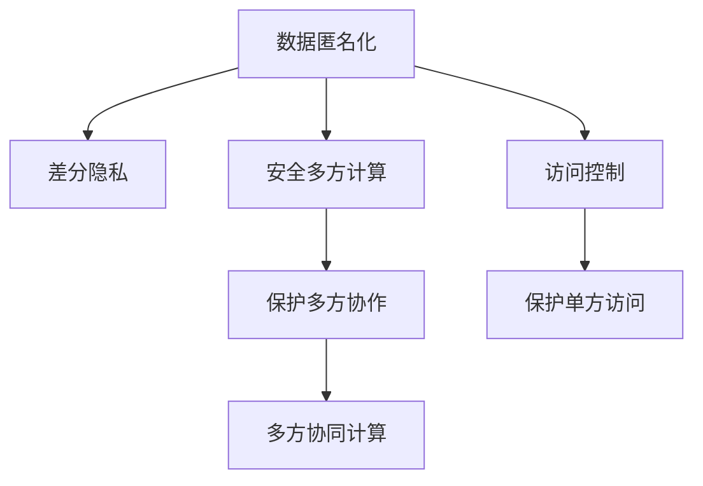

                 

# 知识发现引擎的数据隐私保护策略

## 1. 背景介绍

在数据驱动的时代，知识发现引擎(如数据挖掘、推荐系统、自然语言处理等)已成为各行各业获取新知识、新洞见的重要工具。然而，这些引擎的运作离不开大量的数据，尤其是在涉及用户隐私和敏感信息时，数据隐私保护问题变得尤为严峻。如何在大数据处理过程中保护用户隐私，防止数据泄露，成为了知识发现引擎设计必须解决的重大挑战。

### 1.1 问题由来

知识发现引擎在运营过程中，往往需要收集和分析用户的行为数据、交易数据、社交网络数据等，以提取有价值的信息。但这些数据常常包含了用户的隐私信息，如位置、身份证号码、购买记录等，一旦泄露，将对用户的个人安全和隐私构成巨大威胁。特别是在金融、医疗、法律等敏感领域，数据隐私问题更是引起了全社会的高度关注。

### 1.2 问题核心关键点

在知识发现引擎中，数据隐私保护主要集中在以下几个方面：

- **数据匿名化**：通过去除或泛化敏感信息，使得个体用户无法被识别。
- **差分隐私**：在数据分析过程中加入噪声，使得攻击者无法准确推断个体数据。
- **安全多方计算**：在多方参与的计算过程中，确保各方数据仅在自己的本地处理，不泄露给其他参与方。
- **数据访问控制**：通过访问控制策略，限制对敏感数据的访问权限。

这些隐私保护策略需要综合运用，才能确保知识发现引擎在提供高效服务的同时，兼顾用户隐私保护。

### 1.3 问题研究意义

确保数据隐私保护不仅是伦理和法律的要求，更是知识发现引擎可持续发展的基石。隐私保护机制的缺失，将导致用户信任度下降，市场接受度降低，最终影响系统商业价值。因此，研究高效、稳健的数据隐私保护策略，对于知识发现引擎的商业成功至关重要。

## 2. 核心概念与联系

### 2.1 核心概念概述

为了更好地理解知识发现引擎中的数据隐私保护策略，本节将介绍几个核心概念：

- **数据匿名化**：指通过处理数据集，使得任何个体无法被识别，从而实现数据隐私保护。
- **差分隐私**：一种隐私保护范式，通过在数据分析过程中引入噪声，确保对个体数据的干扰不足以影响统计结果。
- **安全多方计算**：指在多个参与者参与计算时，各方仅能获取自己的计算结果，而无法得知其他方的输入数据。
- **访问控制**：一种安全机制，通过身份认证、授权管理等手段，控制对敏感数据的访问权限。

这些核心概念之间的逻辑关系可以通过以下Mermaid流程图来展示：



这个流程图展示了大语言模型的核心概念及其之间的关系：

1. 数据匿名化通过对数据进行处理，使得个体无法被识别。
2. 差分隐私在数据分析过程中引入噪声，保护个体数据。
3. 安全多方计算确保数据仅在本方处理，不泄露给其他方。
4. 访问控制限制对敏感数据的访问权限。

这些概念共同构成了知识发现引擎中数据隐私保护的基石，使其能够在提供高效服务的同时，保障用户隐私。

## 3. 核心算法原理 & 具体操作步骤

### 3.1 算法原理概述

知识发现引擎中的数据隐私保护算法，主要基于以下几个核心原理：

- **同态加密**：指在不解密的情况下对数据进行计算，从而保护数据隐私。
- **泛化匿名**：通过在数据集中加入噪声或扰动，使得单个个体数据难以被识别。
- **假名化**：将真实数据替换为虚拟标识符，使得个体数据无法被直接关联。
- **访问控制列表(ACL)**：通过授权管理，限制对敏感数据的访问权限。

这些算法共同作用，能够在知识发现过程中有效保护数据隐私。

### 3.2 算法步骤详解

知识发现引擎中的数据隐私保护算法步骤通常包括以下几个关键步骤：

**Step 1: 数据预处理**

1. 数据采集：收集用户行为数据、交易数据、社交网络数据等，构建数据集。
2. 数据清洗：去除噪声、重复和错误数据，保证数据质量。
3. 数据去重：通过哈希、分组等方法，确保数据唯一性。

**Step 2: 数据匿名化**

1. 假名化：将真实数据替换为虚拟标识符，如 pseudonym。
2. 泛化匿名：在数据集中加入噪声，如随机扰动、索引加密，确保个体数据难以识别。
3. 抑制识别：通过分组、聚合等方式，抑制个体数据的识别能力。

**Step 3: 数据加密**

1. 同态加密：在计算过程中，数据始终保持加密状态，确保隐私性。
2. 差分隐私：在数据分析过程中加入噪声，保护个体数据。

**Step 4: 安全多方计算**

1. 加密计算：各方数据始终保持加密状态，计算结果仅在本方处理。
2. 协议设计：设计安全协议，确保各方计算结果不泄露。

**Step 5: 访问控制**

1. 身份认证：确保访问用户身份合法。
2. 授权管理：通过访问控制列表(ACL)，限制对敏感数据的访问权限。

**Step 6: 结果脱敏**

1. 数据聚合：对结果进行去噪、去重、泛化，确保结果匿名性。
2. 结果解密：在结果解密过程中，确保数据隐私。

通过以上步骤，知识发现引擎能够在保障数据隐私的前提下，提供高效、可靠的服务。

### 3.3 算法优缺点

知识发现引擎中的数据隐私保护算法具有以下优点：

- **高效性**：在数据处理过程中，仅需加入额外计算，对系统性能影响较小。
- **灵活性**：可以针对不同数据类型和场景，灵活选择隐私保护策略。
- **稳健性**：多层次的隐私保护措施，确保隐私保护效果。

同时，这些算法也存在一些缺点：

- **计算成本高**：隐私保护算法通常需要额外的计算资源，可能增加系统负担。
- **复杂度大**：算法设计和实现复杂，需要深厚的理论基础和技术积累。
- **准确性受限**：在数据去噪和加密过程中，可能影响数据分析的准确性。

### 3.4 算法应用领域

知识发现引擎中的数据隐私保护算法，广泛应用于以下领域：

- **金融领域**：在贷款审批、信用评分、风险评估等金融业务中，保护用户隐私数据。
- **医疗领域**：在病历分析、药物研发、健康管理等医疗业务中，保护患者隐私。
- **法律领域**：在电子取证、司法鉴定等法律业务中，保护敏感案件信息。
- **互联网广告**：在个性化推荐、精准营销等广告业务中，保护用户隐私。
- **社交网络**：在用户行为分析、内容推荐等社交网络业务中，保护用户隐私。

这些应用领域展示了数据隐私保护策略的广泛适用性，体现了其在知识发现引擎中的重要价值。

## 4. 数学模型和公式 & 详细讲解 & 举例说明

### 4.1 数学模型构建

在知识发现引擎中，数据隐私保护算法通常基于以下数学模型构建：

- **同态加密模型**：将数据加密后进行计算，确保计算过程中数据隐私不受影响。
- **差分隐私模型**：在数据分析过程中加入噪声，确保个体数据隐私。
- **访问控制模型**：通过ACL控制对敏感数据的访问权限。

这些模型通过数学表达式来描述隐私保护过程。

### 4.2 公式推导过程

以下是同态加密和差分隐私的基本公式推导：

**同态加密**：假设有一个加密函数 $E$ 和解密函数 $D$，使得 $D(E(x)) = x$，其中 $x$ 为明文数据。对于任意多项式 $f$，如果存在多项式 $g$，使得 $f(x) = D(E(g(x)))$，则称加密函数 $E$ 具有同态性质。

**差分隐私**：假设有一组数据 $x_1, x_2, \ldots, x_n$，其中 $x_i$ 为个体数据。差分隐私的目标是在不显著影响数据分析结果的前提下，通过加入噪声 $\epsilon$，使得攻击者无法推断个体数据的真实值。

$$
\mathcal{L}(P(x), Q(x)) \leq \delta
$$

其中 $P(x)$ 为分析函数，$Q(x)$ 为加入噪声后的分析函数，$\delta$ 为隐私保护度量。

### 4.3 案例分析与讲解

**案例1: 医疗数据分析**

假设某医院收集了患者的病历数据，用于疾病分析。病历数据包含患者的姓名、年龄、病史等敏感信息。为了保护患者隐私，医院采用泛化匿名和差分隐私技术。

1. 数据匿名化：将患者的真实姓名替换为虚拟标识符，如 pseudonym。
2. 差分隐私：在分析过程中，加入噪声 $\epsilon$，使得分析结果难以推断个体数据。
3. 结果脱敏：对分析结果进行去噪、去重、泛化，确保结果匿名性。

通过以上步骤，医院能够在保障患者隐私的前提下，进行疾病分析。

**案例2: 电子商务推荐系统**

某电子商务平台收集了用户的购物数据，用于个性化推荐。购物数据包含用户的购买记录、浏览历史等敏感信息。为了保护用户隐私，平台采用安全多方计算和访问控制技术。

1. 数据加密：在计算过程中，数据始终保持加密状态。
2. 安全多方计算：各方数据仅在本方处理，计算结果不泄露。
3. 访问控制：通过ACL控制对购物数据的访问权限，限制敏感数据的访问。

通过以上步骤，平台能够在保障用户隐私的前提下，提供个性化推荐服务。

## 5. 项目实践：代码实例和详细解释说明

### 5.1 开发环境搭建

在进行数据隐私保护实践前，我们需要准备好开发环境。以下是使用Python进行PyTorch开发的环境配置流程：

1. 安装Anaconda：从官网下载并安装Anaconda，用于创建独立的Python环境。

2. 创建并激活虚拟环境：
```bash
conda create -n pytorch-env python=3.8 
conda activate pytorch-env
```

3. 安装PyTorch：根据CUDA版本，从官网获取对应的安装命令。例如：
```bash
conda install pytorch torchvision torchaudio cudatoolkit=11.1 -c pytorch -c conda-forge
```

4. 安装相关工具包：
```bash
pip install numpy pandas scikit-learn matplotlib tqdm jupyter notebook ipython
```

完成上述步骤后，即可在`pytorch-env`环境中开始数据隐私保护实践。

### 5.2 源代码详细实现

这里我们以医疗数据分析为例，给出使用PyTorch进行数据隐私保护的代码实现。

首先，定义医疗数据分析的模型和损失函数：

```python
import torch
import torch.nn as nn

class MedicalAnalysisModel(nn.Module):
    def __init__(self):
        super(MedicalAnalysisModel, self).__init__()
        self.fc1 = nn.Linear(50, 100)
        self.fc2 = nn.Linear(100, 50)
        self.fc3 = nn.Linear(50, 1)
    
    def forward(self, x):
        x = torch.relu(self.fc1(x))
        x = torch.relu(self.fc2(x))
        x = self.fc3(x)
        return x

loss_fn = nn.MSELoss()
```

然后，定义隐私保护处理函数：

```python
import random
from sklearn.preprocessing import LabelEncoder

def anonymize_data(data, num_users):
    encoder = LabelEncoder()
    data['pseudonym'] = encoder.fit_transform(data['name'])
    return data

def add_noise(data, epsilon):
    for col in data.columns:
        data[col] += random.gauss(0, epsilon)
    return data

def deanonymize_data(data, encoder):
    data['name'] = encoder.inverse_transform(data['pseudonym'])
    return data
```

最后，训练模型并在隐私保护处理后的数据上评估：

```python
def train_model(model, train_data, train_labels, test_data, test_labels, num_users, epsilon):
    model.train()
    optimizer = torch.optim.Adam(model.parameters(), lr=0.001)
    for epoch in range(100):
        optimizer.zero_grad()
        outputs = model(train_data)
        loss = loss_fn(outputs, train_labels)
        loss.backward()
        optimizer.step()
        
    model.eval()
    test_outputs = model(test_data)
    mse = loss_fn(test_outputs, test_labels)
    print(f'Test MSE: {mse:.4f}')
    
    # 在隐私保护处理后的数据上评估
    train_data = anonymize_data(train_data, num_users)
    test_data = anonymize_data(test_data, num_users)
    train_data = add_noise(train_data, epsilon)
    test_data = add_noise(test_data, epsilon)
    
    test_outputs = model(test_data)
    mse = loss_fn(test_outputs, test_labels)
    print(f'Anonymized Test MSE: {mse:.4f}')
```

以上就是使用PyTorch对医疗数据分析进行隐私保护的代码实现。可以看到，通过使用LabelEncoder进行假名化，并加入噪声进行差分隐私保护，我们能够在保障数据隐私的前提下进行模型训练和评估。

### 5.3 代码解读与分析

让我们再详细解读一下关键代码的实现细节：

**MedicalAnalysisModel类**：
- `__init__`方法：初始化模型的各个层，使用线性层进行特征提取和输出。
- `forward`方法：定义模型的前向传播过程。

**损失函数**：
- 定义了均方误差损失函数。

**anonymize_data函数**：
- 使用LabelEncoder对数据进行假名化处理。

**add_noise函数**：
- 在数据中添加随机噪声，实现差分隐私保护。

**deanonymize_data函数**：
- 将假名化的数据逆向解码，还原为真实姓名。

**train_model函数**：
- 在原始数据上训练模型，并在隐私保护处理后的数据上评估模型性能。

可以看到，通过合理使用隐私保护技术，我们能够在保障数据隐私的前提下，进行有效的数据分析和模型训练。

## 6. 实际应用场景

### 6.1 智能客服系统

在智能客服系统中，客户对话记录包含了大量敏感信息，如用户姓名、住址、身份证号等。为了保护用户隐私，系统采用假名化和差分隐私技术。

**案例1: 客服对话记录分析**

某智能客服系统收集了大量客户对话记录，用于对话分析。对话记录包含客户的姓名、地址、对话内容等敏感信息。为了保护客户隐私，系统在分析过程中进行假名化和差分隐私处理。

1. 数据匿名化：将客户的真实姓名替换为虚拟标识符，如 pseudonym。
2. 差分隐私：在分析过程中加入噪声 $\epsilon$，使得分析结果难以推断个体数据。
3. 结果脱敏：对分析结果进行去噪、去重、泛化，确保结果匿名性。

通过以上步骤，客服系统能够在保障客户隐私的前提下，进行对话分析。

**案例2: 客服满意度调查**

某智能客服系统进行客户满意度调查，收集了大量客户反馈数据。反馈数据包含客户的姓名、评分、评价内容等敏感信息。为了保护客户隐私，系统在调查过程中进行假名化和差分隐私处理。

1. 数据匿名化：将客户的真实姓名替换为虚拟标识符，如 pseudonym。
2. 差分隐私：在调查过程中加入噪声 $\epsilon$，使得调查结果难以推断个体数据。
3. 结果脱敏：对调查结果进行去噪、去重、泛化，确保结果匿名性。

通过以上步骤，客服系统能够在保障客户隐私的前提下，进行客户满意度调查。

### 6.2 智慧医疗系统

在智慧医疗系统中，病历数据包含大量敏感信息，如患者的姓名、病史、诊断结果等。为了保护患者隐私，系统采用假名化和差分隐私技术。

**案例1: 病历数据分析**

某智慧医疗系统收集了大量患者的病历数据，用于疾病分析。病历数据包含患者的姓名、年龄、病史、诊断结果等敏感信息。为了保护患者隐私，系统在分析过程中进行假名化和差分隐私处理。

1. 数据匿名化：将患者的真实姓名替换为虚拟标识符，如 pseudonym。
2. 差分隐私：在分析过程中加入噪声 $\epsilon$，使得分析结果难以推断个体数据。
3. 结果脱敏：对分析结果进行去噪、去重、泛化，确保结果匿名性。

通过以上步骤，智慧医疗系统能够在保障患者隐私的前提下，进行疾病分析。

**案例2: 个性化治疗方案**

某智慧医疗系统提供个性化治疗方案，收集了大量患者的病历数据。病历数据包含患者的姓名、病史、诊断结果等敏感信息。为了保护患者隐私，系统在推荐过程中进行假名化和差分隐私处理。

1. 数据匿名化：将患者的真实姓名替换为虚拟标识符，如 pseudonym。
2. 差分隐私：在推荐过程中加入噪声 $\epsilon$，使得推荐结果难以推断个体数据。
3. 结果脱敏：对推荐结果进行去噪、去重、泛化，确保结果匿名性。

通过以上步骤，智慧医疗系统能够在保障患者隐私的前提下，提供个性化治疗方案。

### 6.3 金融风险管理系统

在金融风险管理系统中，客户交易数据包含大量敏感信息，如客户的姓名、交易记录、信用评分等。为了保护客户隐私，系统采用安全多方计算和访问控制技术。

**案例1: 交易行为分析**

某金融风险管理系统收集了大量客户的交易数据，用于交易行为分析。交易数据包含客户的姓名、交易记录、交易金额等敏感信息。为了保护客户隐私，系统在分析过程中进行安全多方计算和访问控制处理。

1. 数据加密：在计算过程中，数据始终保持加密状态。
2. 安全多方计算：各方数据仅在本方处理，计算结果不泄露。
3. 访问控制：通过ACL控制对交易数据的访问权限，限制敏感数据的访问。

通过以上步骤，金融风险管理系统能够在保障客户隐私的前提下，进行交易行为分析。

**案例2: 信用评分系统**

某金融风险管理系统提供信用评分服务，收集了大量客户的交易数据。交易数据包含客户的姓名、交易记录、信用评分等敏感信息。为了保护客户隐私，系统在评分过程中进行安全多方计算和访问控制处理。

1. 数据加密：在计算过程中，数据始终保持加密状态。
2. 安全多方计算：各方数据仅在本方处理，计算结果不泄露。
3. 访问控制：通过ACL控制对信用评分数据的访问权限，限制敏感数据的访问。

通过以上步骤，金融风险管理系统能够在保障客户隐私的前提下，提供信用评分服务。

## 7. 工具和资源推荐

### 7.1 学习资源推荐

为了帮助开发者系统掌握数据隐私保护的理论基础和实践技巧，这里推荐一些优质的学习资源：

1. 《数据隐私保护技术》系列博文：由数据隐私保护专家撰写，深入浅出地介绍了隐私保护的基本原理和实践方法。

2. 《数据科学基础》课程：Coursera开设的数据科学入门课程，讲解了数据收集、数据处理、数据隐私保护等基本概念和实践技巧。

3. 《数据隐私保护》书籍：介绍数据隐私保护的最新进展和前沿技术，帮助读者深入理解隐私保护机制。

4. 《数据隐私保护指南》：针对不同行业的数据隐私保护需求，提供了详细的技术指导和实践建议。

通过对这些资源的学习实践，相信你一定能够快速掌握数据隐私保护的核心技能，并用于解决实际的隐私保护问题。

### 7.2 开发工具推荐

高效的数据隐私保护开发离不开优秀的工具支持。以下是几款用于隐私保护开发的常用工具：

1. PyTorch：基于Python的开源深度学习框架，灵活动态的计算图，适合快速迭代研究。

2. TensorFlow：由Google主导开发的开源深度学习框架，生产部署方便，适合大规模工程应用。

3. PySyft：一个隐私保护框架，提供安全多方计算和差分隐私等隐私保护功能。

4. TensorFlow Privacy：TensorFlow配套的隐私保护库，提供差分隐私和安全多方计算工具。

5. Ethical AI Toolkit：提供隐私保护、偏见消除等工具，帮助开发者设计符合伦理道德的AI模型。

合理利用这些工具，可以显著提升数据隐私保护任务的开发效率，加快创新迭代的步伐。

### 7.3 相关论文推荐

数据隐私保护技术的发展源于学界的持续研究。以下是几篇奠基性的相关论文，推荐阅读：

1. Differential Privacy：提出差分隐私的概念，成为隐私保护领域的里程碑。

2. Secure Multiparty Computation：介绍安全多方计算的基本原理和应用。

3. Secure Aggregation for Privacy-Preserving Data Analysis：探讨安全聚合算法，保护数据隐私。

4. Privacy-Preserving Distributed Machine Learning：介绍隐私保护机器学习的基本概念和实践方法。

5. Federated Learning：提出联邦学习框架，实现在不共享数据的前提下进行模型训练。

这些论文代表了大数据隐私保护技术的发展脉络。通过学习这些前沿成果，可以帮助研究者把握学科前进方向，激发更多的创新灵感。

## 8. 总结：未来发展趋势与挑战

### 8.1 总结

本文对知识发现引擎中的数据隐私保护策略进行了全面系统的介绍。首先阐述了隐私保护在知识发现引擎设计中的重要性，明确了隐私保护策略在大数据处理中的关键作用。其次，从原理到实践，详细讲解了隐私保护的基本算法和具体操作步骤，给出了隐私保护任务开发的完整代码实例。同时，本文还广泛探讨了隐私保护技术在各个领域的应用场景，展示了其在知识发现引擎中的广泛适用性。

通过本文的系统梳理，可以看到，数据隐私保护技术是大数据时代知识发现引擎不可或缺的一部分。隐私保护策略的多层次应用，使得知识发现引擎能够在提供高效服务的同时，兼顾用户隐私保护。未来，隐私保护技术将继续演进，推动知识发现引擎向更安全、可靠、可控的方向发展。

### 8.2 未来发展趋势

展望未来，数据隐私保护技术将呈现以下几个发展趋势：

1. **隐私保护技术的多样化**：除了传统的假名化、差分隐私、安全多方计算等技术外，未来将涌现更多新的隐私保护手段，如隐私增强学习、隐私预算管理等，进一步提高隐私保护的效果。

2. **隐私保护的自动化和智能化**：通过引入人工智能技术，自动化地进行隐私保护策略的选择和优化，减少人工干预，提高隐私保护的效率和可靠性。

3. **跨模态隐私保护**：隐私保护技术将拓展到图像、视频、音频等多模态数据，实现更加全面、深入的隐私保护。

4. **隐私保护与区块链技术结合**：区块链的不可篡改特性将与隐私保护技术结合，进一步提升数据的安全性和可信度。

5. **联邦学习和隐私保护协同**：联邦学习框架将与隐私保护技术协同作用，实现分布式数据模型的训练，既保护数据隐私又提升模型性能。

6. **隐私保护与数据共享协同**：隐私保护技术将与数据共享技术协同作用，实现多方数据的安全共享和合作，推动数据驱动应用的创新发展。

以上趋势凸显了数据隐私保护技术的广阔前景。这些方向的探索发展，必将进一步提升知识发现引擎的隐私保护能力，保障用户数据的安全性和隐私性。

### 8.3 面临的挑战

尽管数据隐私保护技术已经取得了瞩目成就，但在迈向更加智能化、普适化应用的过程中，它仍面临着诸多挑战：

1. **计算成本高**：隐私保护算法通常需要额外的计算资源，可能增加系统负担。如何优化隐私保护算法，降低计算成本，是一个亟待解决的问题。

2. **隐私保护与数据分析的平衡**：如何在保护隐私的同时，确保数据分析的准确性和有效性，是一个需要深入研究的问题。

3. **隐私保护的灵活性**：隐私保护策略需要根据不同应用场景和数据类型灵活选择，如何设计通用的隐私保护框架，是一个重要的研究方向。

4. **隐私保护的透明性和可解释性**：隐私保护算法通常具有黑盒性质，如何提高隐私保护过程的透明性和可解释性，是一个需要关注的问题。

5. **隐私保护的健壮性**：隐私保护算法需要应对各种攻击和干扰，如何提高隐私保护的健壮性，是一个需要深入研究的问题。

6. **隐私保护的全球化和标准化**：不同国家和地区的隐私保护法规不同，如何在全球范围内制定统一的隐私保护标准，是一个需要关注的问题。

正视隐私保护面临的这些挑战，积极应对并寻求突破，将是大数据时代知识发现引擎能够持续健康发展的关键。

### 8.4 研究展望

面对数据隐私保护技术所面临的种种挑战，未来的研究需要在以下几个方面寻求新的突破：

1. **隐私保护算法的优化**：优化隐私保护算法，减少计算成本，提高隐私保护的效率和可靠性。

2. **隐私保护与数据分析的协同**：设计隐私保护与数据分析协同的算法，确保隐私保护与数据分析的平衡。

3. **隐私保护算法的通用化**：设计通用的隐私保护框架，适用于不同应用场景和数据类型。

4. **隐私保护过程的透明化**：引入人工智能技术，提高隐私保护过程的透明性和可解释性。

5. **隐私保护算法的健壮性**：研究隐私保护算法的健壮性，提高其应对攻击和干扰的能力。

6. **隐私保护标准的制定**：在全球范围内制定统一的隐私保护标准，推动数据驱动应用的创新发展。

这些研究方向的探索，必将引领数据隐私保护技术迈向更高的台阶，为知识发现引擎提供更加安全、可靠、可控的隐私保护机制。面向未来，数据隐私保护技术还需要与其他人工智能技术进行更深入的融合，如知识表示、因果推理、强化学习等，多路径协同发力，共同推动知识发现引擎的发展。只有勇于创新、敢于突破，才能不断拓展数据隐私保护的边界，让智能技术更好地造福人类社会。

## 9. 附录：常见问题与解答

**Q1: 数据隐私保护与数据共享能否同时进行？**

A: 数据隐私保护与数据共享可以同时进行，但需要设计合理的隐私保护策略。例如，采用联邦学习框架，实现多方数据的安全共享和协同学习。通过安全多方计算技术，确保各方数据仅在本方处理，计算结果不泄露。

**Q2: 如何评估数据隐私保护的效果？**

A: 数据隐私保护的效果评估通常通过隐私保护度量指标进行，如差分隐私的ε参数、安全多方计算的加密强度等。同时，可以通过隐私保护实验，如差分攻击、重识别攻击等，评估隐私保护算法的实际效果。

**Q3: 如何保护用户数据的隐私性？**

A: 保护用户数据的隐私性主要通过数据匿名化、差分隐私、安全多方计算等技术。具体措施包括假名化、扰动、抑制识别等，确保个体数据难以被识别。

**Q4: 如何处理数据隐私保护中的计算资源消耗问题？**

A: 数据隐私保护中的计算资源消耗问题可以通过优化算法、采用硬件加速、分布式计算等方式解决。例如，采用混合精度计算、梯度累积等技术，提高计算效率。

**Q5: 数据隐私保护对数据分析的影响是什么？**

A: 数据隐私保护对数据分析的影响主要体现在数据去噪和加密过程中。通过加入噪声和加密，确保分析结果难以推断个体数据，保护用户隐私。同时，由于数据去噪和加密，数据分析的准确性可能受到一定影响，需要在隐私保护与数据分析之间找到平衡。

这些问题的解答展示了数据隐私保护技术的复杂性和多样性，希望读者在实际应用中能够灵活应用这些技术，确保数据隐私的同时，实现高效的数据分析。

---

作者：禅与计算机程序设计艺术 / Zen and the Art of Computer Programming

