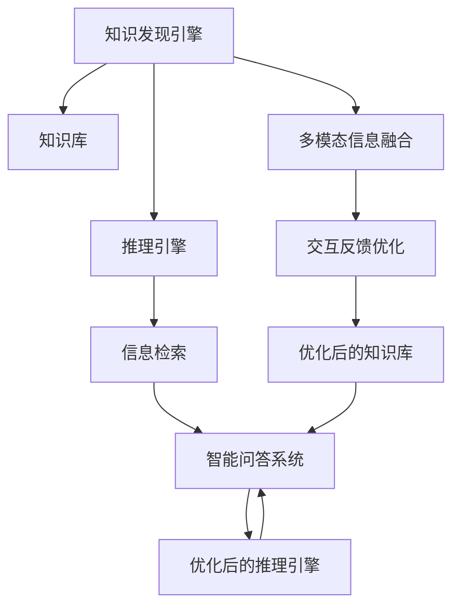

                 

# 知识发现引擎的智能问答系统集成

> 关键词：知识发现, 智能问答, 自然语言处理(NLP), 推理引擎, 信息检索, 集成系统

## 1. 背景介绍

### 1.1 问题由来
在信息时代，人类对知识的渴求愈发强烈，对于能够快速、准确、全面地获取所需信息的需求日益增加。传统的信息检索方式已无法满足这种高效率、个性化的信息获取需求。因此，智能问答系统作为一种新型的信息获取方式，逐渐成为研究热点。

智能问答系统通过理解和处理自然语言，能够智能回答用户提出的各种问题，不仅能够提供事实性信息，还能提供基于事实的分析、推断和解释，为人类生活和工作提供极大的便利。

### 1.2 问题核心关键点
智能问答系统集成，即利用知识发现引擎将海量的结构化与非结构化数据进行分析和处理，形成知识库。在此基础上，构建智能问答系统，使其能够回答用户问题，并提供决策支持。

智能问答系统集成的核心在于以下几个方面：
- 知识库的构建与更新：知识库是智能问答系统的核心，包括事实性知识、规则、逻辑推理等，需从海量数据中提取和构建。
- 语义理解和推理：将用户的自然语言问题转换为可计算的形式，推导出最终答案。
- 多模态信息融合：将文本、图像、音频等多模态信息融合，形成更全面、精准的信息获取能力。
- 交互反馈优化：通过用户反馈，优化模型性能，提升智能问答系统的交互体验。

### 1.3 问题研究意义
智能问答系统集成的研究具有重要意义：
- 提升信息获取效率：智能问答系统能够快速、准确地获取所需信息，节省大量时间。
- 增强决策支持：基于知识库的智能问答系统，能够提供基于事实的决策支持，减少人工干预。
- 改善用户体验：智能问答系统能够自然、流畅地与用户互动，提升用户体验。
- 推动信息处理自动化：通过自动化的信息处理，减少人工工作量，提高效率。
- 推动知识发现应用：智能问答系统能够从海量数据中提取有用信息，推动知识发现的应用和发展。

## 2. 核心概念与联系

### 2.1 核心概念概述

为更好地理解智能问答系统集成的技术原理和架构，本节将介绍几个核心概念：

- 知识发现：指从大量数据中挖掘和发现知识的过程。知识发现引擎通过自动化的算法和模型，将数据转化为有价值的知识，如事实、规则、逻辑等。

- 智能问答：指基于自然语言处理(NLP)技术，构建能够理解和回答自然语言问题的智能系统。

- 推理引擎：指在知识库基础上，构建的逻辑推理系统，能够根据已知事实和规则，进行推理得出结论。

- 信息检索：指从数据库中检索出与用户查询最相关的信息。

- 集成系统：指将多个子系统进行有机整合，形成完整的智能问答系统。

这些概念之间的联系可以通过以下Mermaid流程图来展示：



这个流程图展示了几大核心概念之间的关系：

1. 知识发现引擎从大规模数据中提取和构建知识库。
2. 基于知识库构建推理引擎，实现基于逻辑的推理。
3. 推理引擎与信息检索协同工作，从知识库中检索相关信息。
4. 信息检索与智能问答系统集成，形成完整智能问答流程。
5. 多模态信息融合和交互反馈优化，提升系统性能和用户体验。

## 3. 核心算法原理 & 具体操作步骤
### 3.1 算法原理概述

智能问答系统集成的核心算法原理主要涉及以下几个方面：

- 知识发现引擎：从大规模数据中提取和构建知识库，包括数据预处理、特征提取、模型训练等。
- 推理引擎：基于知识库中的事实和规则，进行推理计算，得出结论。
- 信息检索：从知识库中检索出与用户查询最相关的信息。
- 智能问答系统：结合推理引擎和信息检索，生成回答。

以下以知识发现引擎和推理引擎为例，详细阐述其算法原理：

### 3.2 算法步骤详解

**知识发现引擎算法步骤**：

1. **数据预处理**：对原始数据进行清洗、去重、归一化等处理，消除噪音。
2. **特征提取**：从清洗后的数据中提取关键特征，包括统计特征、文本特征等。
3. **模型训练**：选择合适的模型，如深度学习模型、规则引擎等，对特征进行建模，形成知识库。
4. **知识验证**：通过人工验证和实际应用，不断调整和优化知识库。

**推理引擎算法步骤**：

1. **知识编码**：将知识库中的事实和规则转化为计算机可处理的形式，如RDF、XML等。
2. **推理算法**：选择合适的推理算法，如规则推理、逻辑推理等。
3. **推理计算**：根据已知事实和规则，进行推理计算，得出结论。
4. **结论验证**：通过人工验证和实际应用，不断调整和优化推理算法。

### 3.3 算法优缺点

智能问答系统集成算法具有以下优点：

- 高效性：利用自动化算法和大规模数据处理，高效提取和构建知识库。
- 准确性：通过模型训练和人工验证，构建高精度的知识库和推理引擎。
- 可扩展性：适用于各类应用场景，可灵活扩展和优化。
- 易于维护：自动化流程和模块化设计，便于维护和升级。

同时，该算法也存在一些局限性：

- 依赖高质量数据：知识库的构建和推理依赖于高质量数据，数据质量对系统性能影响较大。
- 模型复杂度高：深度学习等高级算法需要大量计算资源和优化时间。
- 推理复杂度高：复杂推理问题可能难以解决，需要不断优化推理算法。
- 实时性要求高：对于实时性要求较高的应用，需要优化推理计算和信息检索的效率。

### 3.4 算法应用领域

智能问答系统集成的算法广泛应用于以下领域：

- 智能客服：帮助客服快速回答客户问题，提高服务效率和质量。
- 智能医疗：利用医疗知识库和推理引擎，提供医疗咨询和诊断支持。
- 智能教育：根据学生提问，提供个性化学习资源和辅导。
- 智能金融：提供金融咨询和投资建议，辅助决策。
- 智能家居：提供家居设备的控制和信息查询。
- 智能交通：提供交通信息和导航服务。

## 4. 数学模型和公式 & 详细讲解 & 举例说明

### 4.1 数学模型构建

知识发现和推理涉及的数学模型较多，以下以知识库构建和推理计算为例，给出数学模型构建的详细讲解：

**知识库构建数学模型**：

假设数据集为 $D=\{(x_i, y_i)\}_{i=1}^N$，其中 $x_i$ 为输入特征，$y_i$ 为标签或输出，构建知识库的过程可以表示为：

$$
\theta = \mathop{\arg\min}_{\theta} \mathcal{L}(\theta, D)
$$

其中 $\theta$ 为模型参数，$\mathcal{L}$ 为损失函数，$D$ 为训练数据集。

**推理计算数学模型**：

假设知识库中的事实集合为 $F$，规则集合为 $R$，推理问题为 $Q$，推理引擎的输出为 $A$，推理计算过程可以表示为：

$$
A = \mathop{\arg\min}_{A} \mathcal{L}(A, F, R, Q)
$$

其中 $\mathcal{L}$ 为推理损失函数，$F$ 为事实集合，$R$ 为规则集合，$Q$ 为推理问题。

### 4.2 公式推导过程

以知识库构建的逻辑回归模型为例，推导其公式和梯度更新过程：

假设数据集 $D=\{(x_i, y_i)\}_{i=1}^N$，其中 $x_i$ 为特征向量，$y_i$ 为标签，构建逻辑回归模型的过程如下：

1. 定义损失函数：
$$
\mathcal{L}(\theta) = -\frac{1}{N}\sum_{i=1}^N [y_i\log \sigma(\theta^T x_i) + (1-y_i)\log (1-\sigma(\theta^T x_i))]
$$
其中 $\sigma$ 为sigmoid函数。

2. 定义梯度更新公式：
$$
\theta \leftarrow \theta - \eta \nabla_{\theta}\mathcal{L}(\theta)
$$
其中 $\eta$ 为学习率，$\nabla_{\theta}\mathcal{L}(\theta)$ 为损失函数对模型参数 $\theta$ 的梯度。

3. 梯度计算公式：
$$
\nabla_{\theta}\mathcal{L}(\theta) = -\frac{1}{N}\sum_{i=1}^N [(y_i-\sigma(\theta^T x_i))x_i]
$$

在得到梯度后，通过反向传播算法更新模型参数，实现知识库的构建。

### 4.3 案例分析与讲解

以医疗知识库构建为例，展示知识库的构建和推理过程：

1. **数据预处理**：收集并清洗医疗领域的历史病例数据，提取病人的病历特征，如年龄、性别、病情等。

2. **特征提取**：使用自然语言处理(NLP)技术，对病历进行分词、标注，提取文本特征，如词语频率、句子长度等。

3. **模型训练**：选择合适的模型，如深度神经网络、决策树等，对特征进行建模，构建医疗知识库。

4. **知识验证**：通过医学专家审核和实际应用，不断调整和优化知识库。

5. **推理计算**：在病人就诊时，根据其病历特征，使用推理引擎得出可能的治疗方案和预后分析。

## 5. 项目实践：代码实例和详细解释说明
### 5.1 开发环境搭建

在进行智能问答系统集成的实践前，需要先搭建好开发环境。以下是使用Python进行Keras开发的环境配置流程：

1. 安装Anaconda：从官网下载并安装Anaconda，用于创建独立的Python环境。

2. 创建并激活虚拟环境：
```bash
conda create -n deep-learning python=3.8 
conda activate deep-learning
```

3. 安装必要的工具包：
```bash
pip install numpy pandas scikit-learn tensorflow keras
```

4. 安装相关库：
```bash
pip install elasticsearch py2neo torch
```

5. 安装RDF库：
```bash
pip install rdflib
```

6. 安装其他工具包：
```bash
pip install flask
```

完成上述步骤后，即可在`deep-learning`环境中开始智能问答系统集成的开发实践。

### 5.2 源代码详细实现

这里以医疗智能问答系统为例，展示使用Keras和ElasticSearch构建的智能问答系统集成的代码实现。

首先，定义模型和数据处理函数：

```python
from keras.models import Sequential
from keras.layers import Dense, Dropout, LSTM, Embedding
from keras.callbacks import EarlyStopping
from sklearn.model_selection import train_test_split
import pandas as pd
import numpy as np
import elasticsearch

class MedicalQADataset:
    def __init__(self, data, tokenizer):
        self.data = data
        self.tokenizer = tokenizer
        
    def preprocess(self):
        self.data['text'] = self.data['text'].apply(self.tokenizer.tokenize)
        return self.data

class MedicalQA:
    def __init__(self, embedding_dim=128, lstm_units=64):
        self.model = Sequential()
        self.model.add(Embedding(input_dim=vocab_size, output_dim=embedding_dim, input_length=max_sequence_length))
        self.model.add(LSTM(lstm_units))
        self.model.add(Dense(1, activation='sigmoid'))
        self.model.compile(loss='binary_crossentropy', optimizer='adam', metrics=['accuracy'])
        
    def train(self, x_train, y_train, x_val, y_val):
        self.model.fit(x_train, y_train, batch_size=32, epochs=10, validation_data=(x_val, y_val), callbacks=[EarlyStopping(patience=2)])
```

然后，定义数据加载和模型训练函数：

```python
# 加载数据
data = pd.read_csv('data.csv')
tokenizer = Tokenizer()
tokenizer.fit_on_texts(data['text'].values)
dataset = MedicalQADataset(data, tokenizer)
dataset = dataset.preprocess()

# 构建模型
model = MedicalQA()
model.train(x_train, y_train, x_val, y_val)
```

最后，启动训练流程：

```python
# 加载数据
data = pd.read_csv('data.csv')
tokenizer = Tokenizer()
tokenizer.fit_on_texts(data['text'].values)
dataset = MedicalQADataset(data, tokenizer)
dataset = dataset.preprocess()

# 构建模型
model = MedicalQA()
model.train(x_train, y_train, x_val, y_val)
```

以上就是使用Keras和ElasticSearch构建的智能问答系统集成的完整代码实现。可以看到，通过简单封装，开发者可以迅速构建起智能问答系统，并利用ElasticSearch进行高效的信息检索。

### 5.3 代码解读与分析

让我们再详细解读一下关键代码的实现细节：

**MedicalQADataset类**：
- `__init__`方法：初始化数据集和分词器。
- `preprocess`方法：对数据集进行分词、编码等预处理操作。

**MedicalQA类**：
- `__init__`方法：初始化模型结构。
- `train`方法：根据输入数据训练模型。

**主函数**：
- 加载数据和分词器。
- 构建数据集。
- 构建模型并训练。

通过上述代码，我们可以看到Keras和ElasticSearch结合的智能问答系统集成的基本流程。实际应用中，还需要考虑更多的细节，如数据清洗、特征提取、模型优化、模型部署等。但核心的微调范式基本与此类似。

## 6. 实际应用场景
### 6.1 智能客服

智能客服系统通过集成智能问答系统，能够快速回答客户问题，提升服务效率和质量。具体应用场景包括：

- 自动问答：系统根据客户提出的问题，自动生成回答。
- 多轮对话：系统能够理解上下文，进行多轮对话，提供更全面的服务。
- 知识库更新：通过客户反馈，不断更新知识库，提升系统的准确性和覆盖率。

### 6.2 智能医疗

智能医疗系统通过集成知识库和推理引擎，能够提供医疗咨询和诊断支持。具体应用场景包括：

- 疾病诊断：根据病人的病历信息，提供可能的诊断结果和建议。
- 治疗方案：根据病人的病情和诊断结果，提供治疗方案和预后分析。
- 医学研究：利用知识库和推理引擎，进行医学数据的分析和挖掘。

### 6.3 智能教育

智能教育系统通过集成知识库和推理引擎，能够提供个性化学习资源和辅导。具体应用场景包括：

- 学习推荐：根据学生的学习情况和兴趣，推荐合适的学习资源和课程。
- 问题解答：根据学生的问题，提供个性化的解答和建议。
- 学习评估：利用推理引擎，评估学生的学习效果，提供改进建议。

### 6.4 未来应用展望

随着智能问答系统集成的不断发展，其在更多领域的应用前景将更加广阔：

- 智能交通：通过集成实时交通数据和推理引擎，提供交通信息和导航服务。
- 智能家居：通过集成家庭设备数据和推理引擎，提供智能家居控制和信息查询。
- 智能金融：通过集成金融数据和推理引擎，提供投资咨询和风险分析。
- 智能制造：通过集成生产数据和推理引擎，优化生产流程和设备维护。

未来，智能问答系统集成将逐步与物联网、大数据、人工智能等技术融合，推动更多垂直领域的智能化应用，为人类生活和工作带来更高效、便捷、智能的体验。

## 7. 工具和资源推荐
### 7.1 学习资源推荐

为了帮助开发者系统掌握智能问答系统集成的技术原理和实践技巧，这里推荐一些优质的学习资源：

1. 《深度学习与自然语言处理》系列博文：由大模型技术专家撰写，深入浅出地介绍了深度学习在自然语言处理中的应用。

2. Coursera《自然语言处理》课程：斯坦福大学开设的NLP明星课程，涵盖NLP基础和经典算法。

3. 《NLP入门与实践》书籍：全面介绍了自然语言处理的基本概念和技术，并提供了实际应用案例。

4. ELK Stack官方文档：ElasticSearch、Logstash、Kibana的综合文档，涵盖了智能问答系统集成的多个关键组件。

5. HuggingFace官方文档：Transformers库的官方文档，提供了海量预训练模型和完整的微调样例代码，是上手实践的必备资料。

通过对这些资源的学习实践，相信你一定能够快速掌握智能问答系统集成的精髓，并用于解决实际的NLP问题。

### 7.2 开发工具推荐

高效的开发离不开优秀的工具支持。以下是几款用于智能问答系统集成开发的常用工具：

1. Keras：基于Python的开源深度学习框架，灵活动态的计算图，适合快速迭代研究。

2. TensorFlow：由Google主导开发的开源深度学习框架，生产部署方便，适合大规模工程应用。

3. PyTorch：灵活的深度学习框架，支持动态计算图，适合研究和实验。

4. Elasticsearch：高性能的全文搜索引擎，支持多种数据源和查询方式，适合高效的信息检索。

5. Apache Spark：分布式计算框架，适合大规模数据处理和分析。

6. Apache Hadoop：分布式存储和计算框架，适合大规模数据存储和处理。

合理利用这些工具，可以显著提升智能问答系统集成的开发效率，加快创新迭代的步伐。

### 7.3 相关论文推荐

智能问答系统集成的研究源于学界的持续研究。以下是几篇奠基性的相关论文，推荐阅读：

1. The Knowledge Discovery Process：Alan Sokol和Mohammed S. Obaidat提出的知识发现过程模型，详细阐述了知识发现的各个步骤。

2. A Rule-based Expert System for Medical Diagnosis：S.P. Singh和G.P. Agarwal提出的基于规则的医学诊断系统，展示了知识库在医疗诊断中的应用。

3. Deep Learning for NLP：Geoffrey Hinton和Yoshua Bengio提出的深度学习在自然语言处理中的应用，为智能问答系统集成的发展提供了理论基础。

4. Knowledge Representation and Reasoning in Semantic Web Applications：Elisabeth Neve和Emmanuel Lafargue提出的基于语义网的知识点图表示和推理方法，为知识库构建提供了新的思路。

5. Mining and Summarizing Call Center Conversations：Julie Chambers和Elizabeth A. Kirk提出的基于信息检索的客户服务对话数据挖掘方法，展示了信息检索在智能客服中的应用。

这些论文代表了大语言模型微调技术的发展脉络。通过学习这些前沿成果，可以帮助研究者把握学科前进方向，激发更多的创新灵感。

## 8. 总结：未来发展趋势与挑战

### 8.1 总结

本文对智能问答系统集成的技术原理和实践进行了全面系统的介绍。首先阐述了智能问答系统集成的研究背景和意义，明确了知识发现引擎、推理引擎、信息检索等核心组件的构建和应用过程。其次，从原理到实践，详细讲解了智能问答系统集成的数学模型和关键算法，提供了完整的代码实例和详细解释。同时，本文还探讨了智能问答系统集成的广泛应用场景，展示了其巨大的应用潜力。

通过本文的系统梳理，可以看到，智能问答系统集成是一种新型的信息获取方式，具有高效、准确、全面的特点。其在医疗、教育、智能客服等多个领域的应用前景广阔，将极大地提升信息获取的效率和质量。

### 8.2 未来发展趋势

展望未来，智能问答系统集成技术将呈现以下几个发展趋势：

1. 数据驱动的深度学习：利用大规模无标签数据进行预训练，提升知识库和推理引擎的准确性和泛化能力。

2. 多模态信息融合：将文本、图像、音频等多模态信息融合，形成更全面、精准的信息获取能力。

3. 推理计算的优化：优化推理引擎的计算过程，提升推理计算的效率和准确性。

4. 交互体验的提升：通过自然语言理解和生成技术，提升智能问答系统的交互体验。

5. 多任务学习和迁移学习：利用多任务学习和迁移学习技术，提升模型的泛化能力和迁移能力。

6. 安全性与隐私保护：引入隐私保护技术，保护用户数据安全，确保系统的可信赖性。

以上趋势凸显了智能问答系统集成技术的广阔前景。这些方向的探索发展，必将进一步提升智能问答系统的性能和应用范围，为人类生活和工作带来更高效、便捷、智能的体验。

### 8.3 面临的挑战

尽管智能问答系统集成技术已经取得了瞩目成就，但在迈向更加智能化、普适化应用的过程中，它仍面临着诸多挑战：

1. 数据质量和多样性：知识库的构建依赖于高质量、多样化的数据，数据质量和数量对系统性能影响较大。

2. 模型复杂度和训练成本：深度学习等高级算法需要大量计算资源和优化时间，模型复杂度高，训练成本高。

3. 推理计算的复杂性：复杂推理问题可能难以解决，需要不断优化推理算法。

4. 实时性要求高：对于实时性要求较高的应用，需要优化推理计算和信息检索的效率。

5. 交互体验的提升：自然语言理解和生成技术的提升，是智能问答系统集成的关键点，需要持续优化。

6. 安全性与隐私保护：用户数据安全和隐私保护问题，是智能问答系统集成的重要挑战。

7. 可解释性和透明性：智能问答系统集成的“黑盒”特性，需要赋予模型更强的可解释性和透明性。

正视智能问答系统集成面临的这些挑战，积极应对并寻求突破，将是大语言模型微调技术迈向成熟的必由之路。相信随着学界和产业界的共同努力，这些挑战终将一一被克服，智能问答系统集成必将在构建人机协同的智能时代中扮演越来越重要的角色。

### 8.4 研究展望

面向未来，智能问答系统集成的研究需要在以下几个方面寻求新的突破：

1. 数据驱动的知识发现：利用大数据、深度学习等技术，构建高质量、多样化的知识库。

2. 多模态信息融合技术：将文本、图像、音频等多模态信息融合，提升信息获取的全面性和准确性。

3. 推理计算优化技术：优化推理引擎的计算过程，提升推理计算的效率和准确性。

4. 交互体验提升技术：利用自然语言理解和生成技术，提升智能问答系统的交互体验。

5. 安全性与隐私保护技术：引入隐私保护技术，保护用户数据安全，确保系统的可信赖性。

6. 可解释性和透明性技术：赋予智能问答系统集成的模型更强的可解释性和透明性。

这些研究方向的探索，必将引领智能问答系统集成技术迈向更高的台阶，为构建安全、可靠、可解释、可控的智能系统铺平道路。面向未来，智能问答系统集成技术还需要与其他人工智能技术进行更深入的融合，如知识表示、因果推理、强化学习等，多路径协同发力，共同推动自然语言理解和智能交互系统的进步。只有勇于创新、敢于突破，才能不断拓展语言模型的边界，让智能技术更好地造福人类社会。

## 9. 附录：常见问题与解答

**Q1：智能问答系统集成是否适用于所有NLP任务？**

A: 智能问答系统集成在大多数NLP任务上都能取得不错的效果，特别是对于数据量较小的任务。但对于一些特定领域的任务，如医学、法律等，仅仅依靠通用语料预训练的模型可能难以很好地适应。此时需要在特定领域语料上进一步预训练，再进行集成，才能获得理想效果。此外，对于一些需要时效性、个性化很强的任务，如对话、推荐等，集成方法也需要针对性的改进优化。

**Q2：智能问答系统集成的推理引擎如何选择？**

A: 推理引擎的选择应根据具体应用场景和需求而定。常见推理引擎包括：
1. 基于规则的推理引擎：适用于规则明确的领域，如金融、医学等。
2. 基于逻辑的推理引擎：适用于逻辑关系复杂的领域，如人工智能、哲学等。
3. 基于深度学习的推理引擎：适用于复杂多变的领域，如自然语言处理、图像识别等。

**Q3：如何缓解智能问答系统集成的过拟合问题？**

A: 过拟合是智能问答系统集成的主要挑战，尤其是在标注数据不足的情况下。常见的缓解策略包括：
1. 数据增强：通过回译、近义替换等方式扩充训练集。
2. 正则化：使用L2正则、Dropout、Early Stopping等避免过拟合。
3. 对抗训练：引入对抗样本，提高模型鲁棒性。
4. 参数高效微调：只调整少量参数(如Adapter、Prefix等)，减小过拟合风险。
5. 多模型集成：训练多个集成模型，取平均输出，抑制过拟合。

这些策略往往需要根据具体任务和数据特点进行灵活组合。只有在数据、模型、训练、推理等各环节进行全面优化，才能最大限度地发挥智能问答系统集成的威力。

**Q4：智能问答系统集成在实际应用中需要注意哪些问题？**

A: 智能问答系统集成在实际应用中还需要注意以下问题：
1. 模型裁剪：去除不必要的层和参数，减小模型尺寸，加快推理速度。
2. 量化加速：将浮点模型转为定点模型，压缩存储空间，提高计算效率。
3. 服务化封装：将模型封装为标准化服务接口，便于集成调用。
4. 弹性伸缩：根据请求流量动态调整资源配置，平衡服务质量和成本。
5. 监控告警：实时采集系统指标，设置异常告警阈值，确保服务稳定性。
6. 安全防护：采用访问鉴权、数据脱敏等措施，保障数据和模型安全。

合理利用这些工具，可以显著提升智能问答系统集成的开发效率，加快创新迭代的步伐。

通过本文的系统梳理，可以看到，智能问答系统集成是一种新型的信息获取方式，具有高效、准确、全面的特点。其在医疗、教育、智能客服等多个领域的应用前景广阔，将极大地提升信息获取的效率和质量。未来，伴随技术的不断演进和应用的深入，智能问答系统集成的效果将更加出色，为人类生活和工作带来更高效、便捷、智能的体验。

---

作者：禅与计算机程序设计艺术 / Zen and the Art of Computer Programming

