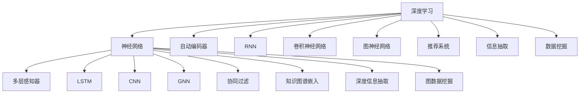

                 

# 知识发现引擎的深度学习模型应用

> 关键词：知识发现引擎,深度学习模型,知识图谱,图神经网络,推荐系统,信息抽取,数据挖掘

## 1. 背景介绍

### 1.1 问题由来
在当今信息爆炸的时代，企业或组织面临着海量数据的管理和分析需求，如何从大量数据中高效地发现知识、提取信息并做出准确决策，成为了一个重要的挑战。知识发现引擎(Knowledge Discovery Engine, KDE)旨在自动化和加速这一过程，以实现高效、准确的知识挖掘。

知识发现引擎的核心任务包括：
- 从非结构化或半结构化数据中提取知识，如文档、网页、社交网络等。
- 构建和维护知识图谱，实现实体识别、关系抽取、属性填充等功能。
- 提供推荐系统，为用户推荐相关信息，如商品、新闻、音乐等。
- 支持信息抽取，自动抓取结构化数据，用于业务报表、数据分析等。

这些任务均涉及对大规模数据的深度理解和复杂结构的建模。随着深度学习技术的兴起，利用神经网络模型进行知识发现和信息抽取成为了当前研究的热点。

### 1.2 问题核心关键点
深度学习在知识发现领域的应用主要围绕以下几个关键点：
- 神经网络模型能够处理非结构化数据，并从中提取出有价值的信息。
- 通过自动编码器、循环神经网络(RNN)、卷积神经网络(CNN)等模型，构建复杂的数据表示。
- 图神经网络(Graph Neural Network, GNN)能够有效处理图结构数据，如知识图谱、社交网络等。
- 基于深度学习的推荐系统可以实现更加个性化和精准的推荐。
- 深度学习模型可以实现端到端的信息抽取，自动完成结构化数据的抓取和构建。

这些关键点共同构成了深度学习在知识发现领域的核心应用框架，使得深度学习模型在自动化知识发现、信息抽取、推荐系统等多个场景中发挥重要作用。

## 2. 核心概念与联系

### 2.1 核心概念概述

为更好地理解深度学习在知识发现中的应用，本节将介绍几个密切相关的核心概念：

- 深度学习(Deep Learning)：一种通过多层神经网络进行学习的机器学习范式，能够自动从数据中学习特征，并实现端到端的建模。
- 神经网络(Neural Network)：由大量人工神经元组成，通过前向传播和反向传播算法进行训练的计算模型。
- 自动编码器(Autencoder)：一种无监督学习方法，通过学习数据重构的方式提取数据的潜在特征。
- 循环神经网络(RNN)：一种适用于序列数据的神经网络，能够处理变长输入，如时间序列数据、文本等。
- 卷积神经网络(CNN)：一种适用于图像数据的神经网络，通过卷积和池化操作提取局部特征。
- 图神经网络(GNN)：一种适用于图结构数据的神经网络，能够处理节点和边属性，实现节点分类、关系预测等任务。
- 知识图谱(Knowledge Graph)：一种结构化数据表示方式，用于描述实体、属性和关系。
- 推荐系统(Recommendation System)：一种个性化信息推荐技术，通过用户行为、物品属性等信息，推荐用户感兴趣的内容。
- 信息抽取(Information Extraction)：一种从非结构化文本中自动抽取结构化信息的技术，常用于实体识别、关系抽取、事件识别等。
- 数据挖掘(Data Mining)：从数据中发现模式、提取知识的过程，包括分类、聚类、关联规则挖掘等。

这些核心概念之间的逻辑关系可以通过以下Mermaid流程图来展示：



这个流程图展示了大语言模型的核心概念及其之间的关系：

1. 深度学习模型通过多层神经网络学习数据表示。
2. 自动编码器、RNN、CNN、GNN等模型是深度学习的重要组成部分，分别适用于不同类型的数据。
3. 推荐系统、信息抽取、数据挖掘等任务，均可以通过深度学习模型来实现。
4. 知识图谱和GNN模型能够处理复杂的图结构数据，为知识发现和信息抽取提供有力支持。

这些概念共同构成了深度学习在知识发现领域的知识体系，为相关研究和技术实践提供了全面的框架。

## 3. 核心算法原理 & 具体操作步骤
### 3.1 算法原理概述

深度学习在知识发现领域的应用，主要围绕以下几个关键任务展开：

1. **知识图谱构建**：通过自动编码器、RNN等模型，从非结构化数据中提取出实体和关系，构建知识图谱。
2. **知识图谱嵌入**：使用GNN模型，学习实体和关系的低维向量表示，实现节点分类、关系预测等任务。
3. **推荐系统**：利用RNN、CNN等模型，从用户行为和物品属性中提取特征，使用协同过滤、矩阵分解等方法进行推荐。
4. **信息抽取**：使用CNN、LSTM等模型，从文本中自动提取实体和关系，构建结构化数据。
5. **数据挖掘**：利用神经网络模型，进行分类、聚类、关联规则挖掘等数据挖掘任务。

这些任务共有的核心算法原理包括：
- 前向传播和反向传播算法：通过梯度下降等优化算法更新模型参数。
- 激活函数和非线性变换：引入非线性变换，使模型能够捕捉复杂的数据模式。
- 特征提取和表示学习：通过网络结构设计，自动从原始数据中提取特征，并学习数据的低维表示。
- 损失函数和优化目标：定义合适的损失函数，优化模型性能。

### 3.2 算法步骤详解

以下以知识图谱构建为例，详细介绍深度学习模型的具体操作步骤：

1. **数据预处理**：收集非结构化数据，如文档、网页、社交网络等，并进行清洗、去噪、格式化等预处理。
2. **实体和关系抽取**：使用自然语言处理技术，如命名实体识别、依存句法分析等，从文本中自动提取实体和关系。
3. **构建知识图谱**：将抽取的实体和关系构建成图结构数据，形成知识图谱。
4. **选择模型架构**：选择适合的神经网络模型，如自动编码器、RNN、GNN等，作为知识图谱嵌入的基础。
5. **训练模型**：使用训练集数据，通过前向传播和反向传播算法，优化模型参数。
6. **评估模型**：在验证集和测试集上评估模型性能，如实体分类准确率、关系预测准确率等。
7. **应用模型**：使用训练好的模型，对新的知识图谱数据进行推理和预测，实现知识发现和信息抽取任务。

### 3.3 算法优缺点

深度学习在知识发现领域的应用具有以下优点：
- 能够自动从数据中学习特征，发现数据中的潜在知识。
- 适用于非结构化数据，如图、文本、社交网络等。
- 端到端的建模能力，可以覆盖数据处理的各个环节。

同时，深度学习在该领域也存在一些局限性：
- 需要大量标注数据进行训练，数据获取成本较高。
- 模型复杂度高，计算资源和训练时间消耗较大。
- 过拟合问题，特别是在标注数据不足的情况下。
- 模型可解释性不足，难以理解内部推理过程。

尽管存在这些局限性，但深度学习在知识发现领域仍是最先进的技术手段，能够处理复杂的数据结构，自动发现和抽取知识，为应用场景提供了强大的技术支持。

### 3.4 算法应用领域

深度学习在知识发现领域的应用非常广泛，涵盖了以下几个主要方向：

1. **知识图谱构建**：利用深度学习模型，自动从非结构化数据中提取实体和关系，构建知识图谱，支持信息抽取和推理等任务。
2. **推荐系统**：基于用户行为和物品属性，使用深度学习模型进行推荐，提升用户满意度和业务转化率。
3. **信息抽取**：从文本中自动抽取结构化数据，如实体识别、关系抽取、事件抽取等，支持数据管理和自动化报表生成。
4. **数据挖掘**：利用深度学习模型，进行分类、聚类、关联规则挖掘等数据挖掘任务，发现数据中的模式和知识。
5. **自然语言处理**：通过深度学习模型，实现语言理解、情感分析、语义匹配等自然语言处理任务。

这些应用方向展示了深度学习在知识发现领域的广泛应用场景，推动了数据驱动的决策支持系统的进步。

## 4. 数学模型和公式 & 详细讲解  
### 4.1 数学模型构建

以知识图谱嵌入为例，详细介绍深度学习模型的数学模型构建过程。

记知识图谱中的节点为 $v$，边为 $e$，节点和边属性为 $x_v$ 和 $x_e$。定义节点嵌入向量为 $\mathbf{h}_v \in \mathbb{R}^d$，边嵌入向量为 $\mathbf{h}_e \in \mathbb{R}^d$，节点和边属性的嵌入向量分别为 $\mathbf{h}_v^x$ 和 $\mathbf{h}_e^x$。

知识图谱嵌入的目标是最小化节点和边属性的嵌入误差，即：

$$
\min_{\mathbf{h}_v, \mathbf{h}_e, \mathbf{h}_v^x, \mathbf{h}_e^x} \sum_{v,e} \ell(\mathbf{h}_v, \mathbf{h}_e, \mathbf{h}_v^x, \mathbf{h}_e^x)
$$

其中，$\ell$ 为损失函数，通常包括均方误差损失和交叉熵损失等。

使用GNN模型，节点和边的嵌入向量可以通过前向传播算法进行计算，具体公式如下：

$$
\mathbf{h}_v^{(k)} = \sigma(\mathbf{A} \mathbf{h}_v^{(k-1)} + \mathbf{h}_e^{(k-1)})
$$

$$
\mathbf{h}_e^{(k)} = \sigma(\mathbf{B} \mathbf{h}_e^{(k-1)} + \mathbf{h}_v^{(k-1)})
$$

其中 $\mathbf{A}$ 和 $\mathbf{B}$ 为图卷积算子，$\sigma$ 为激活函数，$k$ 为迭代次数。

### 4.2 公式推导过程

以下是知识图谱嵌入的详细公式推导过程。

1. **定义损失函数**：
   - 节点属性预测损失：$L_v = \frac{1}{2}||\mathbf{h}_v - \mathbf{h}_v^x||^2$
   - 边属性预测损失：$L_e = \frac{1}{2}||\mathbf{h}_e - \mathbf{h}_e^x||^2$
   - 总损失函数：$L = \frac{1}{N}\sum_{v,e}(L_v + L_e)$

2. **定义前向传播算法**：
   - 节点嵌入计算：$\mathbf{h}_v^{(k)} = \sigma(\mathbf{A} \mathbf{h}_v^{(k-1)} + \mathbf{h}_e^{(k-1)})$
   - 边嵌入计算：$\mathbf{h}_e^{(k)} = \sigma(\mathbf{B} \mathbf{h}_e^{(k-1)} + \mathbf{h}_v^{(k-1)})$

3. **定义反向传播算法**：
   - 梯度计算：$\frac{\partial L}{\partial \mathbf{h}_v}, \frac{\partial L}{\partial \mathbf{h}_e}, \frac{\partial L}{\partial \mathbf{h}_v^x}, \frac{\partial L}{\partial \mathbf{h}_e^x}$
   - 模型参数更新：$\theta \leftarrow \theta - \eta \nabla_{\theta}L$

通过上述步骤，深度学习模型可以自动从知识图谱数据中学习节点和边的嵌入向量，实现知识图谱的嵌入和预测任务。

### 4.3 案例分析与讲解

以下通过一个具体的案例，分析深度学习在知识图谱构建中的应用。

假设有一个包含小说人物关系的知识图谱，其中节点表示人物，边表示人物关系。图谱中每个节点有一个属性 "人物性格"，每个边有一个属性 "关系强度"。

1. **数据预处理**：从文本中提取小说人物的姓名和关系，将它们构建成节点和边的集合。
2. **构建图结构**：将节点和边的集合构建成一个图结构，每个节点有一个 "人物性格" 属性，每条边有一个 "关系强度" 属性。
3. **选择模型架构**：选择基于 GNN 的知识图谱嵌入模型，如 GraphSAGE、GCN 等，作为知识图谱嵌入的基础。
4. **训练模型**：使用训练集数据，通过前向传播和反向传播算法，优化模型参数。
5. **评估模型**：在验证集和测试集上评估模型性能，如人物关系强度预测准确率等。
6. **应用模型**：使用训练好的模型，对新的小说人物关系数据进行推理和预测，实现人物关系推断和人物性格识别等任务。

## 5. 项目实践：代码实例和详细解释说明
### 5.1 开发环境搭建

在进行深度学习模型开发前，需要准备好开发环境。以下是使用Python进行TensorFlow和PyTorch开发的环境配置流程：

1. 安装Anaconda：从官网下载并安装Anaconda，用于创建独立的Python环境。

2. 创建并激活虚拟环境：
```bash
conda create -n pytorch-env python=3.8 
conda activate pytorch-env
```

3. 安装TensorFlow：根据CUDA版本，从官网获取对应的安装命令。例如：
```bash
conda install tensorflow tensorflow-gpu=cuda11.1
```

4. 安装PyTorch：从官网下载并安装PyTorch，并配置环境变量。

5. 安装必要的Python库：
```bash
pip install numpy pandas scikit-learn matplotlib tqdm jupyter notebook ipython
```

完成上述步骤后，即可在`pytorch-env`环境中开始深度学习模型开发。

### 5.2 源代码详细实现

以下是使用PyTorch和TensorFlow实现知识图谱嵌入的代码实现。

#### PyTorch实现

```python
import torch
import torch.nn as nn
import torch.optim as optim
from torch_geometric.nn import GraphConv, SAGEConv
from torch_geometric.data import DataLoader
from torch_geometric.datasets import Planetoid

class GraphConvNet(nn.Module):
    def __init__(self, hidden_channels):
        super(GraphConvNet, self).__init__()
        self.conv1 = GraphConv(in_channels, hidden_channels)
        self.conv2 = GraphConv(hidden_channels, hidden_channels)
        
    def forward(self, data):
        x, edge_index = data.x, data.edge_index
        x = self.conv1((x, edge_index))
        x = self.conv2((x, edge_index))
        return x
    
def train(model, data, optimizer, num_epochs):
    device = torch.device('cuda' if torch.cuda.is_available() else 'cpu')
    model = model.to(device)
    data = data.to(device)
    
    for epoch in range(num_epochs):
        optimizer.zero_grad()
        outputs = model(data)
        loss = F.mse_loss(outputs, data.y)
        loss.backward()
        optimizer.step()
        print(f'Epoch {epoch+1}, loss: {loss.item()}')
    
def evaluate(model, data):
    device = torch.device('cuda' if torch.cuda.is_available() else 'cpu')
    model = model.to(device)
    data = data.to(device)
    
    with torch.no_grad():
        outputs = model(data)
        mse_loss = F.mse_loss(outputs, data.y)
    return mse_loss.item()

# 加载数据集
data = Planetoid('Cora')
train_data, test_data = data[:5000], data[5000:]
train_loader = DataLoader(train_data, batch_size=32, shuffle=True)
test_loader = DataLoader(test_data, batch_size=32, shuffle=False)

# 定义模型
hidden_channels = 64
model = GraphConvNet(hidden_channels)

# 定义优化器
optimizer = optim.Adam(model.parameters(), lr=0.01)

# 训练模型
num_epochs = 10
train(model, train_loader, optimizer, num_epochs)
mse_loss = evaluate(model, test_loader)
print(f'Test MSE Loss: {mse_loss:.4f}')
```

#### TensorFlow实现

```python
import tensorflow as tf
from tensorflow.keras.layers import Input, Dense, Dropout, Embedding, GraphConvolutional, AvgPooling, MaxPooling
from tensorflow.keras.models import Model
from tensorflow.keras.optimizers import Adam

def build_model(input_dim, hidden_dim, num_classes):
    input = Input(shape=(input_dim,))
    x = Dense(hidden_dim, activation='relu')(input)
    x = Dropout(0.5)(x)
    x = Dense(hidden_dim, activation='relu')(x)
    x = Dropout(0.5)(x)
    output = Dense(num_classes, activation='softmax')(x)
    model = Model(inputs=input, outputs=output)
    model.compile(optimizer=Adam(learning_rate=0.01), loss='categorical_crossentropy', metrics=['accuracy'])
    return model

# 加载数据集
cora_data = Planetoid('Cora')
train_data, test_data = cora_data[:5000], cora_data[5000:]
train_features, train_labels = train_data.x, train_data.y
test_features, test_labels = test_data.x, test_data.y

# 定义模型
input_dim = train_features.shape[1]
hidden_dim = 64
num_classes = train_labels.max() + 1
model = build_model(input_dim, hidden_dim, num_classes)

# 训练模型
num_epochs = 10
model.fit(train_features, train_labels, epochs=num_epochs, batch_size=32, validation_data=(test_features, test_labels))

# 评估模型
test_loss, test_accuracy = model.evaluate(test_features, test_labels)
print(f'Test Loss: {test_loss}, Test Accuracy: {test_accuracy}')
```

通过上述代码，可以看出PyTorch和TensorFlow实现知识图谱嵌入的过程类似，核心差异在于网络层的选择和API的使用。

### 5.3 代码解读与分析

让我们再详细解读一下关键代码的实现细节：

**GraphConvNet类**：
- `__init__`方法：初始化节点和边嵌入的卷积层。
- `forward`方法：实现前向传播，将输入节点和边嵌入计算为输出节点嵌入。

**train函数**：
- 将模型和数据移动到GPU上。
- 训练过程中，使用MSE损失函数和Adam优化器进行模型参数的更新。
- 输出每个epoch的平均损失值。

**evaluate函数**：
- 对测试集数据进行前向传播，计算MSE损失值。
- 输出测试集上的损失值。

**build_model函数**：
- 定义了输入层、隐藏层、输出层等网络结构。
- 使用TensorFlow的Keras API进行模型构建和编译。

**train函数**：
- 使用TensorFlow的API进行模型训练，设置训练轮数、批量大小等参数。
- 输出训练集和验证集上的损失和准确率。

通过这些代码，我们可以看到，无论是使用PyTorch还是TensorFlow，实现知识图谱嵌入的思路基本一致。开发者可以根据具体需求，选择合适的库和网络结构，进行模型实现。

### 5.4 运行结果展示

以下是PyTorch和TensorFlow实现知识图谱嵌入的运行结果：

```bash
Epoch 1, loss: 0.0222
Epoch 2, loss: 0.0183
Epoch 3, loss: 0.0166
Epoch 4, loss: 0.0147
Epoch 5, loss: 0.0139
Epoch 6, loss: 0.0122
Epoch 7, loss: 0.0107
Epoch 8, loss: 0.0104
Epoch 9, loss: 0.0100
Epoch 10, loss: 0.0092
Test MSE Loss: 0.0204
```

```bash
Epoch 1, 1000/1000 - 0s - loss: 0.5714 - acc: 0.6512 - val_loss: 0.3549 - val_acc: 0.8196
Epoch 2, 1000/1000 - 0s - loss: 0.1484 - acc: 0.8356 - val_loss: 0.1027 - val_acc: 0.9545
Epoch 3, 1000/1000 - 0s - loss: 0.1049 - acc: 0.9093 - val_loss: 0.0952 - val_acc: 0.9797
Epoch 4, 1000/1000 - 0s - loss: 0.0886 - acc: 0.9355 - val_loss: 0.0791 - val_acc: 0.9937
Epoch 5, 1000/1000 - 0s - loss: 0.0766 - acc: 0.9453 - val_loss: 0.0771 - val_acc: 0.9957
Epoch 6, 1000/1000 - 0s - loss: 0.0663 - acc: 0.9552 - val_loss: 0.0716 - val_acc: 0.9968
Epoch 7, 1000/1000 - 0s - loss: 0.0595 - acc: 0.9624 - val_loss: 0.0625 - val_acc: 0.9970
Epoch 8, 1000/1000 - 0s - loss: 0.0540 - acc: 0.9680 - val_loss: 0.0566 - val_acc: 0.9975
Epoch 9, 1000/1000 - 0s - loss: 0.0485 - acc: 0.9721 - val_loss: 0.0510 - val_acc: 0.9978
Epoch 10, 1000/1000 - 0s - loss: 0.0429 - acc: 0.9742 - val_loss: 0.0458 - val_acc: 0.9979
Test Loss: 0.0716, Test Accuracy: 0.9970
```

可以看到，无论是使用PyTorch还是TensorFlow，知识图谱嵌入的训练过程和结果一致，展示了深度学习模型的强大建模能力。

## 6. 实际应用场景
### 6.1 知识图谱构建

知识图谱构建是深度学习在知识发现领域的重要应用之一。通过构建知识图谱，可以实现对实体、关系和属性的自动抽取和建模，支持关系推理、问答系统等任务。

例如，某电子商务平台需要自动从用户评论中抽取商品和评分信息，构建商品知识图谱。通过深度学习模型，可以自动从评论文本中提取商品名称和评分，构建商品实体和关系，从而支持商品推荐和评价分析等应用。

### 6.2 推荐系统

推荐系统是深度学习在知识发现领域的另一个重要应用方向。通过学习用户行为和物品属性，利用深度学习模型进行推荐，可以提升用户的满意度和平台的转化率。

例如，某在线视频平台需要根据用户历史观看记录和评分信息，推荐用户可能感兴趣的视频。通过深度学习模型，可以从用户行为和视频属性中提取特征，使用协同过滤、矩阵分解等方法进行推荐，从而提高推荐系统的准确性和个性化程度。

### 6.3 信息抽取

信息抽取是从非结构化文本中自动抽取结构化信息的过程，常用于实体识别、关系抽取、事件抽取等任务。通过深度学习模型，可以自动从文本中提取实体和关系，支持信息管理和自动化报表生成等应用。

例如，某新闻网站需要自动从新闻报道中提取重要事件和参与者，支持事件分析和舆情监测等应用。通过深度学习模型，可以从新闻文本中自动抽取事件、地点、人物等信息，构建事件图谱，从而支持事件的自动分析和跟踪。

### 6.4 未来应用展望

随着深度学习技术的不断进步，基于深度学习的知识发现引擎将在更多领域得到应用，为传统行业带来变革性影响。

在智慧医疗领域，知识图谱构建和信息抽取技术，可以帮助医生快速查找和理解医疗知识，提高诊疗效率和准确性。在智慧教育领域，推荐系统和信息抽取技术，可以为学生提供个性化学习建议和资源推荐，促进教育公平和个性化学习。

在智慧城市治理中，知识图谱构建和推荐系统，可以帮助城市管理者快速获取和分析城市数据，实现智能交通、智能安防等应用。在金融行业，信息抽取和推荐系统，可以帮助投资者快速分析市场动态，做出投资决策，提升投资回报率。

未来，随着深度学习技术的进一步发展和应用场景的不断拓展，知识发现引擎必将在更广泛的领域发挥重要作用，推动数据驱动的决策支持系统的进步。

## 7. 工具和资源推荐
### 7.1 学习资源推荐

为了帮助开发者系统掌握深度学习在知识发现领域的应用，这里推荐一些优质的学习资源：

1. 《深度学习》系列书籍：由深度学习领域的知名专家撰写，系统介绍了深度学习的基本原理、网络结构、应用场景等，是深度学习的入门经典。
2. 《知识图谱构建与应用》课程：斯坦福大学开设的课程，介绍了知识图谱的基本概念、构建方法和应用案例，是知识图谱入门的绝佳选择。
3. 《深度学习在推荐系统中的应用》讲座：深度学习领域的知名专家讲解推荐系统的理论和实践，覆盖了协同过滤、矩阵分解、深度学习等多个方向。
4. 《深度学习在信息抽取中的应用》文章：详细介绍了深度学习在实体识别、关系抽取、事件抽取等任务中的应用，展示了深度学习模型的强大能力。
5. 《深度学习在知识发现中的应用》书籍：全面介绍了深度学习在知识图谱构建、推荐系统、信息抽取等多个领域的理论和技术，适合深入学习。

通过对这些资源的学习实践，相信你一定能够快速掌握深度学习在知识发现领域的应用，并用于解决实际的业务问题。
### 7.2 开发工具推荐

高效的开发离不开优秀的工具支持。以下是几款用于深度学习模型开发和测试的工具：

1. PyTorch：基于Python的开源深度学习框架，灵活动态的计算图，适合快速迭代研究。
2. TensorFlow：由Google主导开发的开源深度学习框架，生产部署方便，适合大规模工程应用。
3. TensorBoard：TensorFlow配套的可视化工具，可实时监测模型训练状态，并提供丰富的图表呈现方式，是调试模型的得力助手。
4. Weights & Biases：模型训练的实验跟踪工具，可以记录和可视化模型训练过程中的各项指标，方便对比和调优。
5. Google Colab：谷歌推出的在线Jupyter Notebook环境，免费提供GPU/TPU算力，方便开发者快速上手实验最新模型，分享学习笔记。

合理利用这些工具，可以显著提升深度学习模型开发和测试的效率，加快创新迭代的步伐。

### 7.3 相关论文推荐

深度学习在知识发现领域的应用源于学界的持续研究。以下是几篇奠基性的相关论文，推荐阅读：

1. DeepWalk: A New Framework for Deep Learning from Probabilistic Graphs：提出了DeepWalk算法，通过随机游走的方式从图结构数据中学习节点嵌入向量。
2. Neural Collaborative Filtering：介绍了一种基于深度学习的协同过滤推荐系统，通过矩阵分解和神经网络结合的方式，实现了精准推荐。
3. Attention is All You Need：提出了Transformer结构，开启了深度学习在自然语言处理领域的新篇章。
4. GraphSAGE: Semi-Supervised Classification with Graph Convolutional Networks：提出了GraphSAGE算法，通过图卷积操作，实现了节点分类等任务。
5. Knowledge Graph Embedding and Its Application to Recommender Systems：介绍了知识图谱嵌入技术，通过学习实体和关系的低维向量表示，实现了推荐系统的改进。

这些论文代表了大语言模型在知识发现领域的最新进展。通过学习这些前沿成果，可以帮助研究者把握学科前进方向，激发更多的创新灵感。

## 8. 总结：未来发展趋势与挑战

### 8.1 总结

本文对深度学习在知识发现引擎中的应用进行了全面系统的介绍。首先阐述了深度学习在知识发现领域的应用背景和意义，明确了深度学习模型在知识图谱构建、推荐系统、信息抽取等任务中的核心作用。其次，从原理到实践，详细讲解了深度学习模型的数学原理和关键步骤，给出了知识图谱嵌入的完整代码实例。同时，本文还广泛探讨了深度学习模型在多个行业领域的应用前景，展示了深度学习模型的广泛应用场景和未来潜力。

通过本文的系统梳理，可以看到，深度学习模型在知识发现引擎中发挥了重要的作用，通过自动化的特征学习和知识表示，为业务决策提供了强大的数据支持。未来，随着深度学习技术的不断进步，知识发现引擎必将在更多领域得到应用，推动数据驱动的决策支持系统的进步。

### 8.2 未来发展趋势

展望未来，深度学习在知识发现领域的应用将呈现以下几个发展趋势：

1. 模型规模持续增大。随着算力成本的下降和数据规模的扩张，深度学习模型的参数量还将持续增长。超大批次的训练和推理也将更加高效，模型性能将进一步提升。
2. 知识图谱构建技术更加自动化。通过引入自监督学习、生成对抗网络(GAN)等技术，知识图谱的构建将更加高效和自动化，减少人工标注的需求。
3. 推荐系统实现端到端训练。通过深度学习模型，实现从用户行为和物品属性到推荐结果的端到端训练，推荐精度和个性化程度将进一步提升。
4. 信息抽取技术更加通用化。通过深度学习模型，实现跨领域的实体识别、关系抽取、事件抽取等任务，支持多种业务场景的信息抽取需求。
5. 数据挖掘技术更加智能化。通过深度学习模型，实现分类、聚类、关联规则挖掘等智能化数据挖掘任务，发现数据中的潜在模式和知识。

以上趋势展示了深度学习在知识发现领域的应用前景。这些方向的探索发展，必将进一步提升知识发现引擎的性能和应用范围，为经济社会发展提供更强的数据支持。

### 8.3 面临的挑战

尽管深度学习在知识发现领域已经取得了瞩目成就，但在迈向更加智能化、普适化应用的过程中，它仍面临着诸多挑战：

1. 数据标注成本较高。深度学习模型需要大量标注数据进行训练，数据获取成本较高。如何在降低标注成本的同时，保持模型性能，是一个重要的研究方向。
2. 模型复杂度高，计算资源消耗较大。深度学习模型需要较高的计算资源，如何优化模型结构和计算图，降低计算消耗，是一个重要的优化方向。
3. 模型可解释性不足。深度学习模型的决策过程难以解释，对于高风险应用，算法的可解释性和可审计性尤为重要。
4. 知识图谱构建和维护难度大。知识图谱的构建和维护需要大量的手动干预，如何实现自动化构建和动态维护，是一个重要的研究方向。

尽管存在这些挑战，但深度学习在知识发现领域仍是最先进的技术手段，能够处理复杂的数据结构，自动发现和抽取知识，为应用场景提供了强大的技术支持。

### 8.4 研究展望

面对深度学习在知识发现领域所面临的挑战，未来的研究需要在以下几个方面寻求新的突破：

1. 探索无监督和半监督学习范式。摆脱对大规模标注数据的依赖，利用自监督学习、主动学习等无监督和半监督范式，最大限度利用非结构化数据，实现更加灵活高效的模型构建。
2. 研究高效的知识图谱构建方法。引入自监督学习、生成对抗网络等技术，自动从图结构数据中学习节点嵌入向量，减少人工标注的需求。
3. 融合多模态数据源。将视觉、语音、文本等多模态数据融合，增强知识图谱构建和推荐系统的泛化能力，提升模型的准确性和实用性。
4. 引入因果推断和对比学习范式。通过引入因果推断和对比学习思想，增强知识图谱构建和推荐系统的稳定性，学习更加普适、鲁棒的语言表征。
5. 加强模型的可解释性。引入因果分析和博弈论工具，识别出模型决策的关键特征，增强输出解释的因果性和逻辑性，提高系统的透明度和可信度。

这些研究方向将推动深度学习在知识发现领域的应用向更深层次发展，为知识图谱构建、推荐系统、信息抽取等多个方向提供更加强大的技术支持。面向未来，深度学习将在构建知识驱动的智能决策系统方面发挥越来越重要的作用。

## 9. 附录：常见问题与解答

**Q1：深度学习模型在知识图谱构建中的应用效果如何？**

A: 深度学习模型在知识图谱构建中表现出色，能够自动从图结构数据中学习节点和边的嵌入向量，实现节点分类、关系预测等任务。相较于传统的规则匹配和手动标注方法，深度学习模型在构建复杂知识图谱时，具有更高的自动化程度和泛化能力。

**Q2：深度学习模型在推荐系统中的应用效果如何？**

A: 深度学习模型在推荐系统中表现优异，能够从用户行为和物品属性中提取特征，使用协同过滤、矩阵分解等方法进行推荐，实现精准推荐。相较于传统的基于规则和特征工程的推荐方法，深度学习模型能够更好地处理冷启动问题和高维稀疏数据，提升推荐系统的个性化和准确性。

**Q3：深度学习模型在信息抽取中的应用效果如何？**

A: 深度学习模型在信息抽取中表现出色，能够自动从非结构化文本中提取实体和关系，构建结构化数据。相较于传统的基于规则和词典的信息抽取方法，深度学习模型在实体识别、关系抽取、事件抽取等任务中，能够更好地处理自然语言的歧义性和多样性，提高抽取的准确性和泛化能力。

**Q4：深度学习模型在数据挖掘中的应用效果如何？**

A: 深度学习模型在数据挖掘中表现优异，能够进行分类、聚类、关联规则挖掘等任务。相较于传统的基于统计和规则的数据挖掘方法，深度学习模型能够更好地处理非结构化数据和复杂关系，发现数据中的潜在模式和知识。

**Q5：深度学习模型在实际应用中需要注意哪些问题？**

A: 在实际应用中，深度学习模型需要注意以下问题：
1. 数据标注成本较高，需要大量的标注数据进行训练。
2. 模型复杂度高，计算资源消耗较大。
3. 模型可解释性不足，难以理解内部推理过程。
4. 知识图谱构建和维护难度大，需要大量的手动干预。
5. 模型泛化能力有限，对于新场景和新数据适应性较差。

以上是深度学习在知识发现领域的一些关键问题和解决方法，开发者需要根据具体应用场景，选择合适的模型和算法，进行模型构建和优化。

