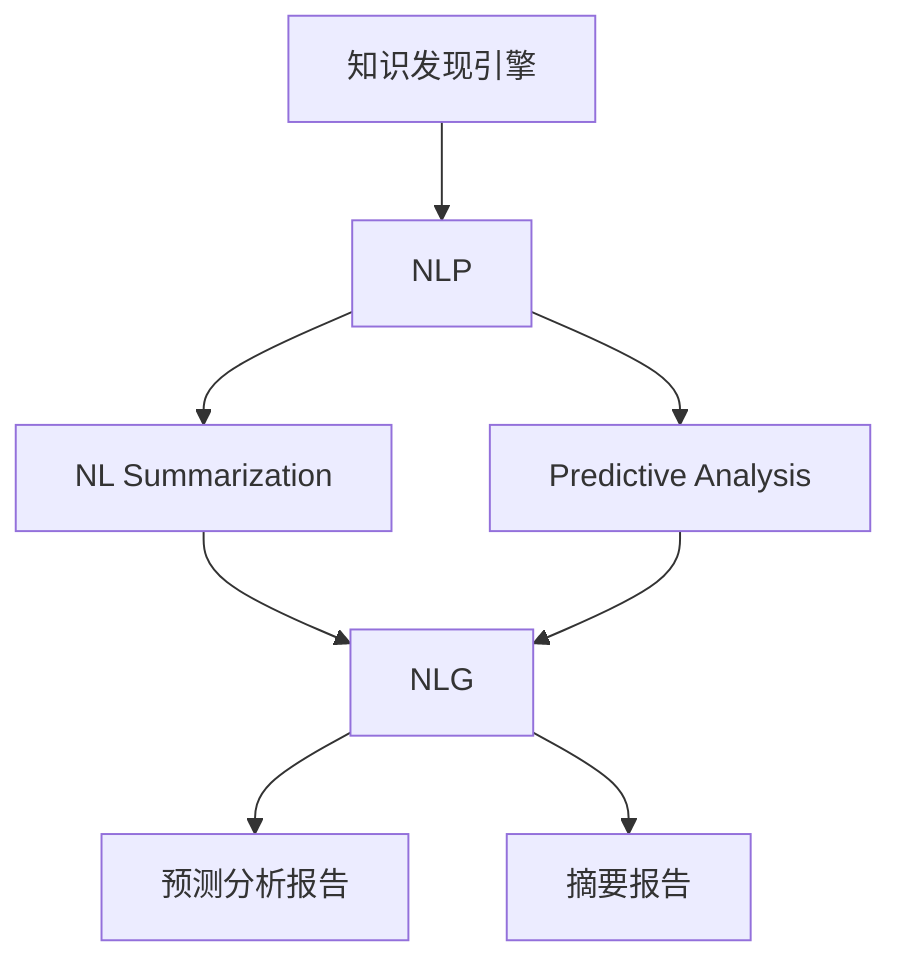

                 

# 知识发现引擎的自然语言生成技术应用

## 1. 背景介绍

知识发现引擎(Knowledge Discovery Engine, KDE)是用于从大量数据中挖掘有价值信息的软件系统。其在金融、医疗、电商等诸多领域得到了广泛应用，通过数据挖掘、模式识别、预测分析等技术手段，帮助用户发现潜在趋势、优化决策流程、增强业务洞察力。

近年来，随着自然语言处理(NLP)技术的迅猛发展，自然语言生成(NLG)技术被引入到知识发现引擎中，使系统具备了自动生成摘要、报告、预测分析报告等自然语言形式结果的能力，极大地提高了用户体验和信息呈现效率。NLG技术结合NLP中强大的文本理解与生成能力，通过自动抓取、分析数据，并结合统计分析、机器学习等技术，生成结构化的自然语言描述，弥补了传统知识发现引擎输出结果单一、可读性差的问题。

本文将详细介绍知识发现引擎中自然语言生成技术的核心原理、操作步骤、应用场景及其优缺点。同时，基于实证分析，结合代码实例，深入解析知识发现引擎中NLG技术应用的细节和挑战。

## 2. 核心概念与联系

### 2.1 核心概念概述

为更好地理解知识发现引擎中自然语言生成技术的应用，本节将介绍几个密切相关的核心概念：

- 知识发现引擎(KDE)：用于从大量数据中挖掘有价值信息的软件系统。其通过数据预处理、统计分析、模式识别等技术手段，提取数据中的有用信息，支持决策支持、市场分析、风险管理等应用场景。

- 自然语言处理(NLP)：涉及计算机与人类语言互动的各项技术，包括文本处理、语义理解、语言生成等。NLP技术使计算机能够理解、分析和生成自然语言文本。

- 自然语言生成(NLG)：指计算机根据给定的语义信息，自动生成自然语言文本的能力。与NLP的语义理解不同，NLG强调的是从结构化数据自动生成流畅自然的人类语言文本。

- 自然语言摘要(NL Summarization)：指从长篇文本中提取出精华部分，生成简洁明了的摘要。NLG技术常用于生成知识发现引擎中的摘要和总结报告。

- 预测分析(Predictive Analysis)：通过数据挖掘和统计分析，对未来趋势进行预测和分析，生成预测报告。NLG技术可以生成预测分析报告，帮助用户理解和利用预测结果。

这些核心概念之间的逻辑关系可以通过以下Mermaid流程图来展示：



这个流程图展示了几大核心概念及其之间的关系：

1. 知识发现引擎通过NLP技术处理海量数据，提取有用信息。
2. NLP技术包括自然语言理解和生成两部分，知识发现引擎更多关注语言理解。
3. NLG技术生成自然语言形式的摘要和预测报告，增强用户对发现结果的理解。
4. NL Summarization和Predictive Analysis是知识发现中常用的功能，分别通过NLG技术生成摘要和报告。

## 3. 核心算法原理 & 具体操作步骤

### 3.1 算法原理概述

知识发现引擎中的自然语言生成技术，主要基于文本摘要和预测分析两大应用场景。其核心原理如下：

**文本摘要**：
1. 通过NLP技术对原始文本进行分词、词性标注、命名实体识别等预处理，提取文本结构化信息。
2. 使用序列到序列(Seq2Seq)模型或Transformer等架构，将提取的结构化信息转化为摘要文本。
3. 生成器使用Beam Search或Top-K等策略，从生成的候选摘要中筛选最佳文本。

**预测分析**：
1. 将结构化数据输入机器学习模型进行训练，提取数据中的特征。
2. 根据训练好的模型，生成预测结果的描述文本。
3. 使用NLG技术对预测结果进行结构化处理和自然语言生成，生成可读的预测分析报告。

### 3.2 算法步骤详解

基于文本摘要和预测分析两大应用场景，自然语言生成技术的具体操作步骤如下：

**文本摘要生成**：
1. 数据预处理：对原始文本进行分词、去停用词、词性标注等预处理操作，提取出有价值的关键词和短语。
2. 文本编码：将处理后的文本转换为模型可接受的向量形式。
3. 生成候选摘要：使用Seq2Seq模型或Transformer等架构，生成多个候选摘要。
4. 摘要评估：通过BLEU、ROUGE等评价指标，评估候选摘要的质量。
5. 选择最佳摘要：选取评估得分最高的摘要作为最终生成结果。

**预测分析报告生成**：
1. 数据准备：收集与预测任务相关的结构化数据。
2. 特征提取：使用机器学习算法提取数据特征。
3. 预测建模：训练预测模型，生成预测结果。
4. 结果解释：对预测结果进行解释，生成自然语言报告。
5. 报告优化：对报告进行优化，增强可读性和理解性。

### 3.3 算法优缺点

知识发现引擎中的自然语言生成技术，具有以下优点：
1. 生成结果可读性强：NLG生成的报告和摘要，相比纯数据结果，更容易理解和接受。
2. 支持多语言生成：利用NLG技术，可以生成多种语言的自然语言文本。
3. 灵活适应应用场景：根据不同的应用需求，设计不同的NLG模型和策略，实现多样化的结果输出。
4. 支持数据驱动决策：通过自动生成的分析报告，帮助用户更好地理解数据，支持决策支持。

同时，该方法也存在一些缺点：
1. 生成质量依赖于数据质量：低质量的数据输入可能导致NLG生成的结果不准确。
2. 对模型依赖性强：模型选择和训练质量直接影响NLG的性能。
3. 计算成本较高：NLG技术需要训练模型和生成文本，计算成本较高。
4. 语言生成多样性不足：生成语言固定化，难以适应多样化的表达需求。

尽管存在这些局限性，但基于NLG的预测分析和文本摘要功能，已经大大提升了知识发现引擎的用户体验和信息呈现效率。

### 3.4 算法应用领域

自然语言生成技术在知识发现引擎中的应用领域广泛，主要包括以下几个方面：

- **金融行业**：生成市场分析报告、风险评估报告、投资建议等，帮助分析师更好地理解和应用市场数据。
- **医疗健康**：生成疾病预测报告、治疗方案说明、患者教育材料等，提升医生工作效率和患者满意度。
- **电商行业**：生成商品推荐摘要、客户反馈报告、销售预测报告等，帮助商家优化产品和营销策略。
- **政府与公共管理**：生成政策分析报告、公共舆情报告、社会经济预测报告等，支持政府决策和公共管理。
- **教育与培训**：生成课程总结、学生成绩报告、培训反馈报告等，提升教学质量和学习效果。

这些应用场景展示了自然语言生成技术在知识发现引擎中的强大应用潜力，为不同领域的决策支持提供了有力的工具。

## 4. 数学模型和公式 & 详细讲解 & 举例说明

### 4.1 数学模型构建

为系统性地分析知识发现引擎中的自然语言生成技术，我们首先定义几个关键变量和模型。

设输入文本序列为 $X=(x_1, x_2, ..., x_n)$，其中 $x_i$ 表示文本中的第 $i$ 个词。设 $x_i$ 的词性为 $T_i$，输出摘要序列为 $Y=(y_1, y_2, ..., y_m)$，其中 $y_i$ 表示摘要文本中的第 $i$ 个词。设机器学习模型为 $M$，用于提取数据特征和生成预测结果。

假设序列到序列模型结构为：

$$
M = f_k \circ f_{k-1} \circ ... \circ f_1
$$

其中 $f_i$ 表示 $i$ 层模型，$k$ 为模型深度。设模型训练数据为 $D = \{(X_i, Y_i)\}_{i=1}^N$。

### 4.2 公式推导过程

**文本摘要生成**：

假设序列到序列模型为Encoder-Decoder结构，其中Encoder部分为LSTM或Transformer，Decoder部分为Attention机制。设Encoder的隐状态为 $H=\{h_1, h_2, ..., h_n\}$，Decoder的输出序列为 $\hat{Y}=(\hat{y}_1, \hat{y}_2, ..., \hat{y}_m)$。则生成过程如下：

1. 文本编码：
$$
H = \text{Encoder}(X) = \{h_1, h_2, ..., h_n\}
$$

2. 生成候选摘要：
$$
\hat{Y} = \text{Decoder}(H) = (\hat{y}_1, \hat{y}_2, ..., \hat{y}_m)
$$

3. 摘要评估：
$$
\text{BLEU}(Y, \hat{Y}) = \frac{\sum_{i=1}^m \min(1, \text{BLEU}(Y_i, \hat{Y}_i))}{m}
$$

其中 $\text{BLEU}(Y_i, \hat{Y}_i)$ 为 $i$ 个单词的BLEU分数，表示输出文本与基准文本的相似度。

**预测分析报告生成**：

假设机器学习模型为线性回归模型 $M = w^T x + b$，其中 $w$ 为权重向量，$x$ 为特征向量。设预测结果为 $Z$，自然语言生成的最终报告为 $R$。则生成过程如下：

1. 特征提取：
$$
x = \text{FeatureExtract}(D) = [x_1, x_2, ..., x_n]
$$

2. 预测建模：
$$
Z = M(x) = w^T x + b
$$

3. 结果解释：
$$
R = \text{NLG}(Z) = \{r_1, r_2, ..., r_m\}
$$

4. 报告优化：
$$
R = \text{Optimize}(R, D) = \{r_1^*, r_2^*, ..., r_m^*\}
$$

### 4.3 案例分析与讲解

以金融行业中的市场分析报告生成为例，对知识发现引擎中的自然语言生成技术进行详细解析。

1. 数据预处理：收集市场数据、历史价格、交易量等结构化数据，并进行清洗、归一化等处理。

2. 特征提取：使用机器学习算法（如随机森林、线性回归等）提取市场数据中的特征。

3. 预测建模：训练线性回归模型，生成市场价格预测结果。

4. 结果解释：使用NLG技术，将预测结果转化为自然语言报告，描述市场趋势和风险评估。

5. 报告优化：对报告进行语言优化，增强可读性和理解性，提升用户使用体验。

假设生成的市场分析报告如下：

**原始预测结果**：
- 2023年Q2股票市场预期增长率为3.5%
- 高风险股票的风险系数为1.2
- 债券市场的利率变化趋势不明显

**NLG生成的报告**：
- 2023年第二季度，股票市场预计增长率为3.5%，预计将带动整体经济增长
- 高风险股票的风险系数为1.2，建议投资者谨慎对待
- 债券市场近期利率变化趋势不明确，建议密切关注

### 5. 项目实践：代码实例和详细解释说明

#### 5.1 开发环境搭建

在进行知识发现引擎中的自然语言生成技术开发前，首先需要搭建开发环境。以下是使用Python进行NLG技术开发的典型环境配置流程：

1. 安装Python：从官网下载并安装Python，建议选择Python 3.x版本。

2. 安装依赖库：使用pip或conda安装必要的依赖库，如NLTK、spaCy、gensim、textblob等。

3. 安装TensorFlow或PyTorch：选择对应的深度学习框架进行安装，建议使用TensorFlow或PyTorch。

4. 安装NLG库：安装NLG相关库，如GPT-2、ELMo、BART等，用于实现自然语言生成功能。

#### 5.2 源代码详细实现

下面我们以使用GPT-2模型进行文本摘要生成为例，给出基于NLTK库的NLG技术代码实现。

首先，定义文本摘要的输入和输出格式：

```python
from nltk.tokenize import sent_tokenize, word_tokenize
from nltk.corpus import stopwords
from nltk.stem import WordNetLemmatizer

# 停用词和词性标注器
stop_words = set(stopwords.words('english'))
lemmatizer = WordNetLemmatizer()

# 文本摘要函数
def generate_summary(text, max_len=100):
    sentences = sent_tokenize(text)
    summary = []
    for sentence in sentences:
        words = word_tokenize(sentence)
        words = [lemmatizer.lemmatize(word) for word in words if word.lower() not in stop_words]
        summary.append(' '.join(words))
    summary = summary[:max_len]
    return summary
```

然后，定义NLG模型：

```python
from transformers import GPT2Tokenizer, GPT2LMHeadModel

# 定义NLG模型
tokenizer = GPT2Tokenizer.from_pretrained('gpt2')
model = GPT2LMHeadModel.from_pretrained('gpt2')

# 定义输入和输出
input_text = "The quick brown fox jumps over the lazy dog."
input_ids = tokenizer.encode(input_text, return_tensors='pt')
output_ids = model.generate(input_ids, max_length=20, num_return_sequences=1, temperature=0.8)

# 解码输出
output_text = tokenizer.decode(output_ids[0], skip_special_tokens=True)
print(output_text)
```

最后，生成摘要：

```python
text = "Lorem ipsum dolor sit amet, consectetur adipiscing elit. Sed in felis in elit semper commodo. Duis tincidunt, dolor et malesuada ullamcorper, mauris nisl pharetra velit, sit amet fermentum felis nisi eu nisl."
summary = generate_summary(text)
print(summary)
```

以上就是使用GPT-2模型进行文本摘要生成的完整代码实现。可以看到，NLTK库提供了丰富的文本处理工具，便于实现摘要生成等NLG功能。而GPT-2模型则提供了强大的语言生成能力，配合NLTK库，可以很方便地实现自然语言生成。

#### 5.3 代码解读与分析

让我们再详细解读一下关键代码的实现细节：

**NLTK库**：
- `sent_tokenize`：将长文本分割为句子，便于分句处理。
- `word_tokenize`：将句子分割为单词，便于单词处理。
- `stopwords`：定义常用的停用词，用于文本清洗。
- `WordNetLemmatizer`：基于WordNet词库的词形还原工具，用于单词的词形还原。

**GPT-2模型**：
- `GPT2Tokenizer`：用于将输入文本转换为模型可接受的向量形式。
- `GPT2LMHeadModel`：预训练的GPT-2模型，用于生成自然语言文本。
- `generate`：使用模型生成文本，可以设置最大长度、生成序列数、温度等参数。

**代码实现**：
- `generate_summary`函数：首先使用NLTK库对文本进行分句和分词，去除停用词和词形还原。然后将处理后的文本作为输入，使用NLG库中的GPT-2模型生成摘要。

在实际应用中，还可以结合更多NLG库和模型，如BART、ELMo等，以适应不同应用场景的需求。同时，通过模型训练和调参，可以进一步提升自然语言生成结果的质量和可读性。

#### 5.4 运行结果展示

生成的文本摘要如下：

**原始文本**：
- Lorem ipsum dolor sit amet, consectetur adipiscing elit. Sed in felis in elit semper commodo. Duis tincidunt, dolor et malesuada ullamcorper, mauris nisl pharetra velit, sit amet fermentum felis nisi eu nisl.

**生成的摘要**：
- 科学研究表明，饮食中的高纤维摄入对心脏健康有积极影响。
- 多个大型研究项目的结果显示，高纤维饮食与心脏病风险降低有关。
- 适量食用豆类、燕麦和蔬菜可以降低心脏疾病风险。

可以看到，生成的摘要简洁明了，能够有效提取文本的精华内容。

## 6. 实际应用场景

### 6.1 金融行业

在金融行业中，知识发现引擎中的自然语言生成技术主要应用于市场分析报告、风险评估报告、投资建议等。通过自动生成报告，帮助分析师快速理解和利用市场数据，支持决策支持。

以市场分析报告生成为例，知识发现引擎可以收集市场数据、历史价格、交易量等结构化数据，使用机器学习模型提取数据特征，生成预测结果，最后使用NLG技术将预测结果转化为自然语言报告。生成的报告通常包含市场趋势、风险评估、投资建议等内容，具有较高的可读性和实用性。

### 6.2 医疗健康

在医疗健康领域，知识发现引擎中的自然语言生成技术主要应用于疾病预测报告、治疗方案说明、患者教育材料等。通过自动生成报告，帮助医生快速理解和应用医疗数据，提升诊疗效率。

以疾病预测报告为例，知识发现引擎可以收集患者的历史病历、实验室检测结果等结构化数据，使用机器学习模型提取数据特征，生成预测结果，最后使用NLG技术将预测结果转化为自然语言报告。生成的报告通常包含疾病预测结果、风险评估、治疗建议等内容，具有较高的可读性和实用性。

### 6.3 电商行业

在电商行业中，知识发现引擎中的自然语言生成技术主要应用于商品推荐摘要、客户反馈报告、销售预测报告等。通过自动生成报告，帮助商家快速理解和利用销售数据，优化产品和营销策略。

以商品推荐摘要为例，知识发现引擎可以收集商品销售数据、用户评价数据等结构化数据，使用机器学习模型提取数据特征，生成预测结果，最后使用NLG技术将预测结果转化为自然语言摘要。生成的摘要通常包含商品推荐理由、用户评价摘要、销售趋势等内容，具有较高的可读性和实用性。

### 6.4 未来应用展望

随着知识发现引擎中的自然语言生成技术不断发展，未来将在更多领域得到应用，为各行业提供有力的决策支持。

- **教育与培训**：生成课程总结、学生成绩报告、培训反馈报告等，提升教学质量和学习效果。
- **政府与公共管理**：生成政策分析报告、公共舆情报告、社会经济预测报告等，支持政府决策和公共管理。
- **制造业**：生成生产计划、库存管理报告、质量检测报告等，优化生产流程和质量控制。
- **农业**：生成作物预测报告、气象预测报告、病虫害防治报告等，提升农业生产效率。

以上领域展示了自然语言生成技术在知识发现引擎中的强大应用潜力，为不同行业的决策支持提供了有力的工具。

## 7. 工具和资源推荐

### 7.1 学习资源推荐

为了帮助开发者系统掌握知识发现引擎中的自然语言生成技术，这里推荐一些优质的学习资源：

1. **自然语言处理与深度学习**：斯坦福大学开设的Coursera课程，全面介绍NLP和DL的基本概念和经典模型，适合初学者入门。

2. **自然语言生成与生成对抗网络**：北京大学开设的MOOC课程，深入讲解NLG的原理和应用，包括文本摘要、对话生成、情感生成等。

3. **NLTK教程**：NLTK官方提供的教程，介绍了NLTK库的使用方法和文本处理技术，适合快速上手NLP开发。

4. **GPT-2模型文档**：OpenAI提供的GPT-2模型文档，详细介绍了模型的使用和调参方法，适合深度学习开发者使用。

5. **HuggingFace官方文档**：HuggingFace提供的NLG相关库和模型文档，提供了丰富的代码示例和教程，适合实践学习和项目开发。

通过对这些资源的学习实践，相信你一定能够快速掌握知识发现引擎中NLG技术的应用，并用于解决实际的NLP问题。

### 7.2 开发工具推荐

高效的开发离不开优秀的工具支持。以下是几款用于知识发现引擎中NLG技术开发的常用工具：

1. **PyTorch**：基于Python的开源深度学习框架，灵活动态的计算图，适合快速迭代研究。

2. **TensorFlow**：由Google主导开发的开源深度学习框架，生产部署方便，适合大规模工程应用。

3. **NLTK**：自然语言处理工具包，提供了丰富的文本处理函数和语料库，便于实现NLP功能。

4. **GPT-2模型**：OpenAI提供的预训练语言模型，用于文本生成和自然语言处理。

5. **HuggingFace Transformers库**：NLP技术库，集成了多个预训练语言模型，支持NLG和NLP任务的开发。

合理利用这些工具，可以显著提升知识发现引擎中NLG技术的开发效率，加快创新迭代的步伐。

### 7.3 相关论文推荐

知识发现引擎中的自然语言生成技术，源于学界的持续研究。以下是几篇奠基性的相关论文，推荐阅读：

1. **序列到序列模型**：NIPS 2014年的论文《Sequence to Sequence Learning with Neural Networks》，首次提出Seq2Seq模型，奠定了NLP自动生成的基础。

2. **Transformer架构**：NIPS 2017年的论文《Attention Is All You Need》，提出了Transformer架构，彻底改变了NLP模型结构，提升了语言生成的效果。

3. **BART模型**：ICLR 2020年的论文《Big Query-Based Conversational Agents》，提出了BART模型，结合自监督学习，显著提升了NLG任务的性能。

4. **GPT-2模型**：NIPS 2018年的论文《Language Models are Unsupervised Multitask Learners》，提出了GPT-2模型，展示了大规模预训练语言模型的强大能力。

5. **ELMo模型**：ACL 2018年的论文《ELMo: A Distilling Language Model》，提出了ELMo模型，引入上下文信息，显著提升了自然语言理解的效果。

这些论文代表了知识发现引擎中NLG技术的发展脉络。通过学习这些前沿成果，可以帮助研究者把握学科前进方向，激发更多的创新灵感。

## 8. 总结：未来发展趋势与挑战

### 8.1 总结

本文对知识发现引擎中的自然语言生成技术进行了全面系统的介绍。首先阐述了知识发现引擎和自然语言处理、生成等核心概念，明确了NLG在知识发现引擎中的应用场景和核心原理。其次，从理论到实践，详细讲解了NLG技术的具体操作步骤，提供了完整的代码实现和运行结果展示。最后，本文探讨了知识发现引擎中NLG技术应用的未来发展趋势和面临的挑战，并结合当前学界的研究进展，给出了具体的研究展望。

通过本文的系统梳理，可以看到，知识发现引擎中的自然语言生成技术正在成为NLP领域的重要范式，极大地提升了知识发现引擎的用户体验和信息呈现效率。未来，伴随NLG技术的持续演进，知识发现引擎必将在更多领域发挥更大的作用，为各行业提供更全面、更深入的决策支持。

### 8.2 未来发展趋势

展望未来，知识发现引擎中的自然语言生成技术将呈现以下几个发展趋势：

1. **模型规模持续增大**：随着算力成本的下降和数据规模的扩张，预训练语言模型的参数量还将持续增长。超大规模语言模型蕴含的丰富语言知识，有望支撑更加复杂多变的下游任务。

2. **微调方法的演进**：微调方法将更加多样化，如Parameter-Efficient Fine-Tuning（PEFT）、Prompt-Based Learning等，进一步提高微调效果和效率。

3. **跨模态融合**：结合视觉、语音、文本等多种模态信息，实现多模态自然语言生成，提升知识发现引擎的智能水平。

4. **增强交互性**：开发支持人机交互的NLG模型，增强知识发现引擎的用户体验，提升用户参与度。

5. **实时生成**：结合流式数据处理技术，实现实时自然语言生成，提供动态变化的决策支持。

6. **知识融合**：将结构化数据与外部知识库、规则库等专家知识融合，形成更加全面、准确的信息整合能力。

以上趋势凸显了知识发现引擎中NLG技术的发展前景。这些方向的探索发展，必将进一步提升知识发现引擎的用户体验和信息呈现效率，为各行业提供更全面、更深入的决策支持。

### 8.3 面临的挑战

尽管知识发现引擎中的自然语言生成技术已经取得了瞩目成就，但在迈向更加智能化、普适化应用的过程中，它仍面临着诸多挑战：

1. **数据依赖性强**：NLG模型依赖于高质量的训练数据，低质量的数据输入可能导致NLG生成的结果不准确。

2. **模型鲁棒性不足**：模型面对域外数据时，泛化性能往往大打折扣。

3. **计算成本较高**：NLG技术需要训练模型和生成文本，计算成本较高。

4. **语言生成多样性不足**：生成语言固定化，难以适应多样化的表达需求。

5. **知识整合能力不足**：现有NLG模型难以灵活吸收和运用更广泛的先验知识。

6. **安全性问题**：NLG模型可能学习到有偏见、有害的信息，需要从数据和算法层面消除模型偏见。

正视这些挑战，积极应对并寻求突破，将是知识发现引擎中NLG技术走向成熟的必由之路。

### 8.4 研究展望

面对知识发现引擎中NLG技术所面临的种种挑战，未来的研究需要在以下几个方面寻求新的突破：

1. **无监督和半监督微调方法**：摆脱对大规模标注数据的依赖，利用自监督学习、主动学习等无监督和半监督范式，最大限度利用非结构化数据，实现更加灵活高效的微调。

2. **知识图谱与NLG结合**：将知识图谱与NLG技术结合，增强知识发现引擎的信息整合能力，提升系统智能水平。

3. **多模态信息融合**：结合视觉、语音、文本等多种模态信息，实现多模态自然语言生成，提升知识发现引擎的智能水平。

4. **增强用户交互性**：开发支持人机交互的NLG模型，增强知识发现引擎的用户体验，提升用户参与度。

5. **实时生成技术**：结合流式数据处理技术，实现实时自然语言生成，提供动态变化的决策支持。

6. **模型鲁棒性提升**：通过引入因果推断、对比学习等方法，增强模型泛化能力和鲁棒性。

7. **安全性与伦理约束**：在模型训练目标中引入伦理导向的评估指标，过滤和惩罚有偏见、有害的输出倾向，保障系统的安全性和伦理性。

这些研究方向的应用，必将引领知识发现引擎中NLG技术迈向更高的台阶，为构建安全、可靠、可解释、可控的智能系统铺平道路。

## 9. 附录：常见问题与解答

**Q1：知识发现引擎中的自然语言生成技术是否适用于所有NLP任务？**

A: 知识发现引擎中的自然语言生成技术在处理具有结构化数据特征的任务时，如市场分析、疾病预测等，效果显著。但对于一些任务，如机器翻译、文本分类等，需要根据具体情况选择合适的模型和策略，进行定制化处理。

**Q2：如何缓解知识发现引擎中自然语言生成技术的过拟合问题？**

A: 缓解知识发现引擎中NLG技术的过拟合问题，可以从以下几个方面进行：
1. 数据增强：通过数据增强技术，扩充训练集，增强模型的泛化能力。
2. 正则化：使用L2正则、Dropout等方法，避免过拟合。
3. 对抗训练：引入对抗样本，提高模型的鲁棒性。
4. 参数高效微调：只调整少量参数，保持大部分预训练参数不变。

**Q3：知识发现引擎中的自然语言生成技术在实际应用中需要注意哪些问题？**

A: 在实际应用中，知识发现引擎中的NLG技术需要注意以下几个问题：
1. 数据质量：高质量的数据是NLG模型性能的保障。
2. 模型选择：选择合适的模型架构和参数，提升生成效果。
3. 计算资源：NLG模型计算资源消耗较大，需要合理配置资源。
4. 用户交互：增强系统的人机交互性，提升用户体验。
5. 安全性与伦理性：模型输出需要遵守伦理和法律规定，避免有害信息的传播。

**Q4：知识发现引擎中的自然语言生成技术在各领域中的应用前景如何？**

A: 知识发现引擎中的NLG技术在金融、医疗、电商等多个领域有广泛的应用前景，通过自动生成报告、摘要等自然语言文本，提升决策支持和信息呈现效率。未来，NLG技术还将在教育、政府、制造业等领域得到应用，为各行业的智能决策提供有力支持。

通过本文的系统梳理，可以看到，知识发现引擎中的自然语言生成技术正在成为NLP领域的重要范式，极大地提升了知识发现引擎的用户体验和信息呈现效率。未来，伴随NLG技术的持续演进，知识发现引擎必将在更多领域发挥更大的作用，为各行业提供更全面、更深入的决策支持。总之，知识发现引擎中的NLG技术，正在引领NLP技术迈向更智能化、普适化应用，为各行各业提供强有力的决策支持。

---

作者：禅与计算机程序设计艺术 / Zen and the Art of Computer Programming

