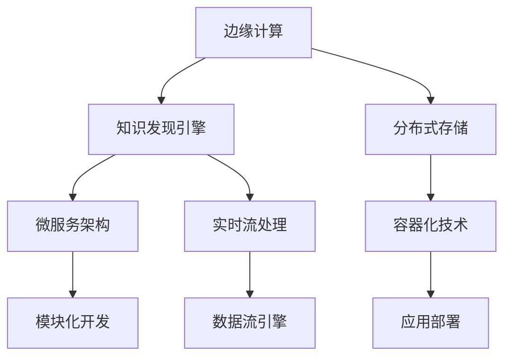

                 

## 1. 背景介绍

### 1.1 问题由来

随着数据量的爆炸式增长，企业需要对海量数据进行实时分析和处理，以支撑业务决策和智能服务。传统的集中式数据处理架构面临计算资源分散、网络传输延时等问题，难以满足实时性的需求。边缘计算（Edge Computing）通过将数据处理任务迁移到靠近数据源的边缘设备上，解决了集中式架构的瓶颈问题，成为新一代数据处理技术的重要方向。

在知识发现（Knowledge Discovery，KD）领域，传统的数据仓库、数据挖掘等方法主要依赖集中式计算资源，难以高效处理大规模数据。而基于边缘计算的知识发现引擎（Knowledge Discovery Engine，KDE），通过将知识发现任务迁移到边缘设备上，可以大幅提升计算效率和数据处理速度，实现实时化、个性化、精准化的知识发现服务。

### 1.2 问题核心关键点

基于边缘计算的知识发现引擎，通过在边缘设备上运行算法模型，直接从本地数据源中提取知识，避免了集中式计算的网络传输延迟和大规模数据迁移问题。核心关键点包括：

- 边缘设备：靠近数据源的计算资源，如物联网设备、移动设备、边缘服务器等。
- 边缘计算平台：用于部署和管理边缘计算应用的框架和工具，如Fog Computing、Kubernetes等。
- 知识发现算法：在边缘设备上运行的知识发现算法，如分类、聚类、关联规则挖掘等。
- 实时性：边缘计算的特点之一是实时性，能够快速响应外部事件和用户请求。
- 分布式存储：边缘计算环境下的数据存储，通常采用分布式存储系统，如Hadoop、Ceph等。
- 安全性：在边缘计算环境中，数据隐私和设备安全问题尤为关键，需采用加密、访问控制等措施保障数据安全。

### 1.3 问题研究意义

基于边缘计算的知识发现引擎，能够实现对海量数据的实时处理和分析，对于提升业务决策效率、优化资源配置、增强用户服务体验具有重要意义：

- 实时性：知识发现引擎通过在边缘设备上处理数据，能够实现对外部事件和用户请求的快速响应，提升决策速度和响应效率。
- 成本效益：边缘计算能够减少网络带宽和计算资源的消耗，降低数据处理成本。
- 个性化服务：知识发现引擎能够根据用户的行为数据，实时生成个性化推荐和服务，提升用户满意度。
- 数据隐私：通过在边缘设备上处理数据，可以最大程度保护用户隐私和数据安全。

## 2. 核心概念与联系

### 2.1 核心概念概述

为更好地理解基于边缘计算的知识发现引擎，本节将介绍几个密切相关的核心概念：

- 边缘计算（Edge Computing）：一种分布式计算架构，将计算任务迁移到靠近数据源的边缘设备上，以减少网络延迟和带宽消耗，提升计算效率。
- 知识发现（Knowledge Discovery）：从海量数据中挖掘知识、发现规律和关联的过程，通常涉及数据预处理、特征工程、算法建模等步骤。
- 知识发现引擎（Knowledge Discovery Engine，KDE）：利用知识发现算法，在边缘设备上对本地数据进行处理和分析，实现实时化、个性化、精准化的知识发现服务。
- 分布式存储（Distributed Storage）：一种存储架构，通过在多个物理节点上存储数据，实现数据的高可用性和高扩展性。
- 容器化技术（Containerization）：通过Docker等容器技术，将应用程序及其依赖打包成容器镜像，便于在分布式环境中运行和部署。
- 微服务架构（Microservices Architecture）：一种软件架构风格，将应用拆分成多个独立的微服务，以提升系统的灵活性和可扩展性。
- 实时流处理（Real-time Stream Processing）：一种数据处理技术，通过实时流数据处理引擎，对数据流进行实时分析和处理，支持事件驱动的应用场景。

这些核心概念之间的逻辑关系可以通过以下Mermaid流程图来展示：



这个流程图展示了大语言模型微调的核心概念及其之间的关系：

1. 边缘计算提供计算资源，知识发现引擎在此基础上运行算法模型。
2. 分布式存储系统用于数据存储和管理，支持边缘设备的数据处理。
3. 容器化技术支持应用和服务的打包部署，提升应用的可移植性和灵活性。
4. 微服务架构将应用拆分成多个独立服务，便于分布式环境下的灵活扩展。
5. 实时流处理技术实现对数据的实时分析和处理，满足事件驱动的应用需求。

这些概念共同构成了基于边缘计算的知识发现引擎的技术框架，使其能够在多种应用场景下高效运行。

## 3. 核心算法原理 & 具体操作步骤
### 3.1 算法原理概述

基于边缘计算的知识发现引擎，本质上是一种分布式计算架构下的知识发现系统。其核心思想是：将知识发现任务从中心服务器迁移到靠近数据源的边缘设备上，通过分布式计算和实时流处理，快速响应用户请求，提取数据中的知识。

形式化地，假设数据源为 $D$，边缘设备为 $E$，知识发现算法为 $A$。则知识发现过程可以表示为：

$$
A(D,E) = \{a \mid a = A(d_i, e_i) \text{ and } (d_i, e_i) \in D \times E\}
$$

其中 $a$ 表示从数据 $d_i$ 在设备 $e_i$ 上发现的知识点，$D$ 和 $E$ 分别为数据源和边缘设备集合。

### 3.2 算法步骤详解

基于边缘计算的知识发现引擎一般包括以下几个关键步骤：

**Step 1: 数据采集和预处理**

- 数据采集：从本地设备或传感器中收集数据，并传输到边缘设备。
- 数据预处理：对采集的数据进行清洗、去噪、归一化等预处理操作，准备数据进行后续分析。

**Step 2: 边缘计算资源配置**

- 边缘设备配置：选择合适的边缘设备（如边缘服务器、物联网设备等），配置计算资源。
- 算法部署：将知识发现算法打包成容器镜像，部署到边缘设备上。

**Step 3: 实时流处理和分析**

- 数据流传输：将本地数据通过网络传输到边缘设备。
- 实时流处理：利用实时流处理引擎（如Apache Kafka、Apache Flink等），对数据流进行实时分析和处理。
- 知识发现：在边缘设备上运行知识发现算法，提取数据中的知识。

**Step 4: 结果汇总和存储**

- 结果汇总：将边缘设备上发现的知识汇总到中心服务器，进行进一步分析和存储。
- 结果存储：将分析结果存储在分布式存储系统中，供后续查询和使用。

**Step 5: 应用和服务提供**

- 应用服务：将知识发现结果封装成API接口，提供给应用和服务使用。
- 用户界面：开发用户界面，展示知识发现结果，支持用户互动。

### 3.3 算法优缺点

基于边缘计算的知识发现引擎具有以下优点：

- 实时性：边缘计算能够快速响应用户请求，实现实时知识发现和分析。
- 数据隐私：在本地设备上处理数据，最大程度保护用户隐私和数据安全。
- 降低成本：减少数据传输和存储的开销，降低总体计算成本。
- 提高效率：边缘计算能够利用本地计算资源，提升处理效率和计算能力。

同时，该方法也存在一些局限性：

- 资源受限：边缘设备通常资源有限，难以支持大规模复杂算法。
- 数据多样性：边缘设备上的数据可能存在格式不一致、噪声等问题，需要额外的数据清洗和处理。
- 网络稳定性：边缘设备的网络连接不稳定，可能影响数据传输和处理效率。
- 算法适配：需要针对不同边缘设备设计适配的算法，提升算法效率和适用性。

尽管存在这些局限性，但就目前而言，基于边缘计算的知识发现引擎仍是大数据处理的重要方向之一。未来相关研究的重点在于如何进一步优化边缘计算环境，提升算法适配性和效率，同时兼顾数据隐私和安全等因素。

### 3.4 算法应用领域

基于边缘计算的知识发现引擎，已在多个领域得到应用，包括但不限于以下领域：

- 工业物联网（IIoT）：在智能工厂、智能设备中，实时监测设备状态、优化生产流程、预测设备故障等。
- 智慧城市：在交通管理、环境监测、公共安全等领域，实时分析城市数据，优化资源配置，提升城市管理效率。
- 智能家居：在智能家居设备中，实时分析用户行为数据，提供个性化服务和智能推荐。
- 零售业：在零售店铺中，实时分析顾客行为数据，优化库存管理和销售策略。
- 金融服务：在金融交易中，实时分析市场数据，预测价格波动，提供个性化金融服务。
- 医疗健康：在医疗设备中，实时监测患者健康数据，预测疾病风险，提供个性化医疗建议。
- 智能物流：在物流系统中，实时分析运输数据，优化运输路线，提升物流效率。

## 4. 数学模型和公式 & 详细讲解  
### 4.1 数学模型构建

本节将使用数学语言对基于边缘计算的知识发现引擎进行更加严格的刻画。

记数据源为 $D=\{d_1, d_2, ..., d_n\}$，其中 $d_i$ 为第 $i$ 个数据样本。假设知识发现算法为 $A$，其输出为 $a=\{a_1, a_2, ..., a_m\}$，其中 $a_j$ 为第 $j$ 个知识点。

在边缘设备 $e$ 上，知识发现过程可以表示为：

$$
A_e(d_i, e) = a_j
$$

其中 $e$ 为边缘设备，$A_e$ 为在边缘设备 $e$ 上运行的知识发现算法，$(d_i, e)$ 表示数据 $d_i$ 在边缘设备 $e$ 上的处理过程。

知识发现结果的汇总和存储可以表示为：

$$
K = \{k_1, k_2, ..., k_t\} = \{A_e(d_i, e) \mid (d_i, e) \in D \times E\}
$$

其中 $K$ 为知识发现结果的集合，$k_i$ 为第 $i$ 个知识点的表示。

### 4.2 公式推导过程

以下我们以聚类算法为例，推导在边缘设备上运行的聚类过程的数学公式。

假设知识发现算法为 K-Means 聚类算法，其输入为数据集 $D$，输出为 $K$ 个聚类中心 $c_1, c_2, ..., c_K$。则聚类过程可以表示为：

1. 初始化聚类中心：从数据中随机选择 $K$ 个样本作为初始聚类中心。
2. 分配样本到聚类中心：对每个样本 $d_i$，计算其到每个聚类中心 $c_j$ 的距离，分配到距离最近的聚类中心。
3. 更新聚类中心：对每个聚类中心 $c_j$，重新计算其代表的所有样本 $d_{j1}, d_{j2}, ..., d_{jn_j}$ 的均值，更新聚类中心。
4. 重复步骤 2 和 3，直到聚类中心不再发生变化。

在边缘设备上运行 K-Means 算法，输入为本地数据集 $D$，输出为聚类结果 $K$。其计算过程可以表示为：

$$
c_{j, e} = \text{mean}(D_{j, e})
$$

其中 $D_{j, e}$ 表示在边缘设备 $e$ 上，第 $j$ 个聚类中心 $c_j$ 所代表的所有样本数据，$\text{mean}(D_{j, e})$ 表示 $D_{j, e}$ 的均值。

### 4.3 案例分析与讲解

假设在一个智能工厂中，需要实时监测设备状态，预测设备故障并进行维护。工厂的传感器数据源分布在多个设备上，每个设备通过本地边缘设备进行处理和分析。

具体而言，每个设备通过传感器采集振动、温度、电流等数据，并将数据传输到本地边缘设备上。边缘设备运行 K-Means 聚类算法，将设备数据划分为正常和异常两个聚类。如果某个设备的数据被划分到异常聚类，则系统会发出预警，并进行维护。

## 5. 项目实践：代码实例和详细解释说明
### 5.1 开发环境搭建

在进行边缘计算知识发现引擎的开发实践前，我们需要准备好开发环境。以下是使用Python进行Flask和FogLib开发的环境配置流程：

1. 安装Anaconda：从官网下载并安装Anaconda，用于创建独立的Python环境。

2. 创建并激活虚拟环境：
```bash
conda create -n edge-env python=3.8 
conda activate edge-env
```

3. 安装Flask和FogLib：
```bash
pip install flask
pip install foglib
```

4. 安装各类工具包：
```bash
pip install numpy pandas scikit-learn matplotlib tqdm jupyter notebook ipython
```

完成上述步骤后，即可在`edge-env`环境中开始边缘计算知识发现引擎的开发实践。

### 5.2 源代码详细实现

下面以K-Means聚类算法为例，给出使用Flask和FogLib进行边缘计算知识发现引擎的Python代码实现。

首先，定义数据处理函数：

```python
from foglib import FogNode, FogHandler

def data_processing(datasets, node):
    for dataset in datasets:
        # 数据预处理
        data = preprocess(dataset)
        # 数据流传输
        data.set_node(node)
```

然后，定义K-Means聚类算法：

```python
from sklearn.cluster import KMeans

class KMeansEngine:
    def __init__(self, k):
        self.k = k
        self.model = KMeans(n_clusters=k)
    
    def train(self, data):
        self.model.fit(data)
        return self.model.cluster_centers_
    
    def predict(self, data):
        return self.model.predict(data)
```

接着，定义边缘计算节点和处理器：

```python
node = FogNode()
handler = FogHandler(node)

# 创建边缘计算节点
node.create('data', data_processing)

# 创建K-Means聚类节点
handler.create_engine('kmeans', KMeansEngine)

# 运行K-Means聚类算法
handler.run('kmeans', 'data', [data for _ in range(5)], 'results')
```

最后，启动边缘计算应用：

```python
from flask import Flask, jsonify

app = Flask(__name__)

@app.route('/results', methods=['GET'])
def get_results():
    results = handler.get_results('kmeans')
    return jsonify(results)

if __name__ == '__main__':
    app.run()
```

以上是使用Flask和FogLib进行边缘计算知识发现引擎的完整代码实现。可以看到，通过FogLib的封装，Flask应用能够轻松地与边缘计算环境进行交互，实现数据的分布式处理和分析。

### 5.3 代码解读与分析

让我们再详细解读一下关键代码的实现细节：

**Flask应用**：
- `data_processing`函数：定义了数据处理过程，包括数据预处理和数据流传输。
- `KMeansEngine类`：定义了K-Means聚类算法，包括训练和预测过程。
- `get_results`函数：定义了应用的服务端接口，用于获取边缘计算节点上的聚类结果。

**FogLib框架**：
- `FogNode类`：定义了边缘计算节点，用于部署应用和服务。
- `FogHandler类`：定义了边缘计算处理器，用于创建和管理边缘计算资源。
- `create`方法：创建边缘计算节点和处理器，并定义了数据处理和算法服务的接口。
- `run`方法：在边缘计算节点上运行算法，并将结果保存到指定位置。
- `get_results`方法：获取边缘计算节点上的运行结果。

这些代码展示了基于边缘计算的知识发现引擎的核心流程：

1. 数据通过网络传输到边缘设备。
2. 数据在边缘设备上进行处理和分析。
3. 聚类算法在边缘设备上运行，生成聚类结果。
4. 聚类结果通过网络传输回中心服务器。
5. 中心服务器展示聚类结果，供用户查询和使用。

## 6. 实际应用场景
### 6.1 智能工厂

在智能工厂中，基于边缘计算的知识发现引擎可以实时监测设备状态，预测设备故障并进行维护。具体而言，可以安装传感器在关键设备上，采集振动、温度、电流等数据，并将数据传输到本地边缘设备上。边缘设备运行K-Means聚类算法，将设备数据划分为正常和异常两个聚类。如果某个设备的数据被划分到异常聚类，则系统会发出预警，并进行维护。

例如，在一个智能机器人生产线上，可以通过边缘计算节点实时监测每个机器人的振动和温度数据，检测机器人是否出现异常。一旦检测到异常，系统会立即触发预警，并通知维修人员进行检查和维修，避免机器人出现故障，影响生产效率。

### 6.2 智慧城市

在智慧城市中，基于边缘计算的知识发现引擎可以实现实时数据分析和优化。具体而言，可以通过安装在城市中的传感器采集交通流量、环境污染等数据，并将数据传输到本地边缘设备上。边缘设备运行聚类算法，实时分析数据并生成可视化报表，供城市管理部门参考。

例如，在交通管理中，可以通过边缘计算节点实时监测道路上的交通流量，检测拥堵情况。一旦检测到交通拥堵，系统会立即生成交通报告，并推荐最佳通行路线，优化城市交通管理。

### 6.3 零售业

在零售业中，基于边缘计算的知识发现引擎可以实现个性化推荐和服务。具体而言，可以通过安装在店内的传感器采集顾客行为数据，并将数据传输到本地边缘设备上。边缘设备运行聚类算法，实时分析数据并生成顾客行为聚类。根据顾客行为聚类，系统可以生成个性化推荐和服务，提升顾客购物体验。

例如，在零售店中，可以通过边缘计算节点实时监测顾客在店内的行为数据，检测顾客偏好。一旦检测到顾客偏好，系统会立即推荐相关商品，并优化商品陈列，提升顾客购买率。

### 6.4 未来应用展望

随着边缘计算技术的不断发展，基于边缘计算的知识发现引擎将在更多领域得到应用，为业务决策、智能服务、数据管理等提供强大支持。

在智慧医疗领域，基于边缘计算的知识发现引擎可以实现实时病患监测、个性化诊疗、健康数据分析等。通过在医疗设备上部署边缘计算节点，实时监测患者健康数据，系统可以预测疾病风险，提供个性化医疗建议，提升医疗服务水平。

在智能家居领域，基于边缘计算的知识发现引擎可以实现智能家居设备的实时管理和服务。通过在智能家居设备上部署边缘计算节点，实时监测用户行为数据，系统可以生成个性化推荐和服务，提升用户满意度。

在智能物流领域，基于边缘计算的知识发现引擎可以实现实时物流数据管理和服务。通过在物流设备上部署边缘计算节点，实时监测运输数据，系统可以优化运输路线，提升物流效率。

此外，在智能制造、智能农业、智能交通等领域，基于边缘计算的知识发现引擎也将发挥重要作用，提升各行业的智能化水平。

## 7. 工具和资源推荐
### 7.1 学习资源推荐

为了帮助开发者系统掌握基于边缘计算的知识发现引擎的理论基础和实践技巧，这里推荐一些优质的学习资源：

1. 《Edge Computing: Principles, Modeling, and Protocols》书籍：全面介绍了边缘计算的理论基础、协议和应用场景，是了解边缘计算的必备参考书。
2. Flask官方文档：Flask的官方文档，提供了详细的API接口和示例代码，适合快速上手Flask应用开发。
3. FogLib官方文档：FogLib的官方文档，提供了完整的边缘计算开发框架和使用示例，适合深入学习FogLib应用开发。
4. K-Means算法论文和代码实现：了解K-Means算法的原理和实现细节，可以参考K-Means算法相关的论文和代码实现，如《K-Means: Algorithms and Implementations》等。
5. 边缘计算实战教程：在实战教程中，可以学习边缘计算技术的实际应用，如边缘计算平台的搭建、边缘计算应用开发等，适合动手实践。

通过对这些资源的学习实践，相信你一定能够快速掌握基于边缘计算的知识发现引擎的核心技术和应用场景。

### 7.2 开发工具推荐

高效的开发离不开优秀的工具支持。以下是几款用于基于边缘计算的知识发现引擎开发的常用工具：

1. Python：Python是一种易学易用、功能强大的编程语言，适合进行数据分析和机器学习开发。
2. Flask：Flask是一个轻量级Web框架，适合构建简单的Web应用和服务。
3. FogLib：FogLib是一个边缘计算开发框架，提供了完整的边缘计算资源管理和服务部署功能。
4. Docker：Docker是一种容器化技术，可以方便地部署和管理边缘计算应用。
5. Kubernetes：Kubernetes是一种容器编排平台，可以自动化管理边缘计算节点的部署和扩展。
6. TensorFlow：TensorFlow是一个深度学习框架，适合进行复杂的数据分析和模型训练。

合理利用这些工具，可以显著提升基于边缘计算的知识发现引擎的开发效率，加快创新迭代的步伐。

### 7.3 相关论文推荐

基于边缘计算的知识发现引擎的发展得益于学界的持续研究。以下是几篇奠基性的相关论文，推荐阅读：

1. 《Edge Computing: A Survey》：全面综述了边缘计算的理论和应用，提供了丰富的学术资源和研究背景。
2. 《Real-time Clustering for IoT》：介绍了物联网设备的实时聚类算法，适合了解物联网领域的数据处理技术。
3. 《K-Means Clustering Algorithms: A Survey》：综述了K-Means聚类算法的各种实现和改进，适合了解聚类算法的原理和应用。
4. 《Edge Computing in the IoT Era》：介绍了物联网环境下的边缘计算技术，适合了解边缘计算在IoT领域的应用。
5. 《Edge Computing for Real-time Analytics》：介绍了边缘计算在实时数据分析中的应用，适合了解边缘计算的实时处理能力。

这些论文代表了大语言模型微调技术的发展脉络。通过学习这些前沿成果，可以帮助研究者把握学科前进方向，激发更多的创新灵感。

## 8. 总结：未来发展趋势与挑战

### 8.1 总结

本文对基于边缘计算的知识发现引擎进行了全面系统的介绍。首先阐述了知识发现和边缘计算的概念和意义，明确了知识发现引擎在实时性、成本效益、数据隐私等方面的优势。其次，从原理到实践，详细讲解了知识发现引擎的数学模型和算法步骤，给出了微调任务的完整代码实现。同时，本文还广泛探讨了知识发现引擎在智能工厂、智慧城市、零售业等多个行业领域的应用前景，展示了微调范式的巨大潜力。此外，本文精选了知识发现引擎的学习资源和开发工具，力求为读者提供全方位的技术指引。

通过本文的系统梳理，可以看到，基于边缘计算的知识发现引擎能够实现对海量数据的实时处理和分析，对于提升业务决策效率、优化资源配置、增强用户服务体验具有重要意义。未来，伴随边缘计算技术的不断发展，知识发现引擎将在更多领域得到应用，为业务决策、智能服务、数据管理等提供强大支持。

### 8.2 未来发展趋势

展望未来，基于边缘计算的知识发现引擎将呈现以下几个发展趋势：

1. 数据融合与协同计算：通过将边缘设备和云端资源进行协同计算，提升数据处理能力和处理速度。
2. 实时流处理与机器学习：结合实时流处理和机器学习技术，实现更高效的数据分析和智能服务。
3. 联邦学习与隐私保护：利用联邦学习技术，保护数据隐私，实现本地数据的安全共享。
4. 边缘智能与智能边缘：通过在边缘设备上部署智能算法，提升设备的自主决策能力。
5. 多模态数据融合：将传感器、摄像头、音频等多种数据源进行融合，提升数据分析的全面性和准确性。
6. 自适应算法与动态调整：根据数据和环境的变化，动态调整算法参数，优化数据处理效果。
7. 自监督学习与零样本学习：利用自监督学习和零样本学习技术，提升算法的泛化能力和适应性。

以上趋势凸显了基于边缘计算的知识发现引擎的广阔前景。这些方向的探索发展，必将进一步提升知识发现引擎的性能和应用范围，为智能决策、智能服务、数据管理等提供新的技术路径。

### 8.3 面临的挑战

尽管基于边缘计算的知识发现引擎已经取得了初步成果，但在迈向更加智能化、普适化应用的过程中，它仍面临着诸多挑战：

1. 计算资源受限：边缘设备通常资源有限，难以支持大规模复杂算法。
2. 数据多样性：边缘设备上的数据可能存在格式不一致、噪声等问题，需要额外的数据清洗和处理。
3. 网络稳定性：边缘设备的网络连接不稳定，可能影响数据传输和处理效率。
4. 算法适配：需要针对不同边缘设备设计适配的算法，提升算法效率和适用性。
5. 数据隐私：在边缘设备上处理数据，需要采取有效的数据保护措施，确保数据安全和隐私。
6. 算法优化：需要不断优化算法模型，提升算法的效率和准确性。
7. 实时性要求高：知识发现引擎需要快速响应外部事件和用户请求，对实时性要求较高。

尽管存在这些挑战，但基于边缘计算的知识发现引擎仍是大数据处理的重要方向之一。未来相关研究的重点在于如何进一步优化边缘计算环境，提升算法适配性和效率，同时兼顾数据隐私和安全等因素。

### 8.4 研究展望

面对知识发现引擎面临的挑战，未来的研究需要在以下几个方面寻求新的突破：

1. 分布式优化算法：结合分布式优化算法，优化边缘设备上的数据处理流程，提升算法效率和处理速度。
2. 数据压缩与编码：利用数据压缩和编码技术，减少数据传输和存储的开销，提升边缘设备上的数据处理能力。
3. 边缘智能系统：构建自适应、自主决策的智能边缘系统，提升边缘设备的主动性。
4. 实时流处理优化：优化实时流处理技术，提高数据处理的速度和精度，满足实时性要求。
5. 跨模态数据融合：将多种数据源进行融合，提升数据分析的全面性和准确性，支持多模态数据分析应用。
6. 联邦学习与协同计算：利用联邦学习技术，保护数据隐私，实现本地数据的安全共享和协同计算。

这些研究方向的探索，必将引领知识发现引擎技术迈向更高的台阶，为构建安全、可靠、可解释、可控的智能系统铺平道路。面向未来，知识发现引擎还需要与其他人工智能技术进行更深入的融合，如知识表示、因果推理、强化学习等，多路径协同发力，共同推动智能决策、智能服务、数据管理等的发展。只有勇于创新、敢于突破，才能不断拓展知识发现引擎的边界，让智能技术更好地造福人类社会。

## 9. 附录：常见问题与解答

**Q1：基于边缘计算的知识发现引擎如何实现实时性？**

A: 基于边缘计算的知识发现引擎通过在边缘设备上运行算法模型，直接从本地数据源中提取知识，避免了集中式计算的网络传输延迟和大规模数据迁移问题，从而实现实时性。具体而言，通过实时流处理技术，将本地数据流实时传输到边缘设备，在边缘设备上实时处理和分析数据，生成实时分析结果。

**Q2：基于边缘计算的知识发现引擎如何进行数据预处理？**

A: 数据预处理是知识发现引擎的重要步骤，通常包括以下步骤：

1. 数据清洗：去除数据中的噪声、异常值等无用信息。
2. 数据归一化：将数据转化为标准化格式，方便后续处理。
3. 特征提取：从原始数据中提取有意义的特征，提升数据的质量和可用性。
4. 数据编码：将数据转换为算法模型能够处理的格式，如文本、数字等。

通过数据预处理，可以提高算法的准确性和效率，确保知识发现结果的可靠性。

**Q3：基于边缘计算的知识发现引擎如何处理数据多样性问题？**

A: 数据多样性是边缘计算环境下的常见问题，通常需要额外的数据处理步骤来解决。具体而言，可以采用以下方法：

1. 数据规范化：对不同数据源的数据进行规范化处理，确保数据格式一致。
2. 数据集成：将不同数据源的数据进行集成，生成统一的数据集。
3. 数据筛选：选择高质量、可靠的数据源，避免噪声数据对算法的影响。
4. 数据转换：对数据进行格式转换，确保数据能够被算法模型处理。

通过数据预处理和数据管理，可以最大程度提升知识发现引擎的数据处理能力，确保算法的准确性和效果。

**Q4：基于边缘计算的知识发现引擎如何保护数据隐私？**

A: 数据隐私是知识发现引擎中的重要问题，需要采取多种措施来保护数据安全。具体而言，可以采用以下方法：

1. 数据加密：对数据进行加密处理，防止数据被非法获取。
2. 访问控制：限制对数据源的访问权限，确保只有授权用户能够访问数据。
3. 数据脱敏：对敏感数据进行脱敏处理，确保数据在传输和存储过程中的安全性。
4. 联邦学习：利用联邦学习技术，保护数据隐私，实现本地数据的安全共享和协同计算。

通过数据隐私保护措施，可以确保知识发现引擎的算法模型在处理数据时，不会泄露用户隐私，提升数据安全性和可靠性。

**Q5：基于边缘计算的知识发现引擎如何优化边缘计算环境？**

A: 优化边缘计算环境是知识发现引擎的重要方向，通常需要从以下几个方面进行改进：

1. 计算资源：提升边缘设备的计算能力和存储能力，支持大规模复杂算法。
2. 网络稳定性：优化网络传输协议，提高边缘设备的网络稳定性，确保数据传输和处理效率。
3. 算法适配：根据不同边缘设备的设计需求，设计适配的算法模型，提升算法效率和适用性。
4. 数据管理：优化数据存储和管理方式，提高数据处理效率和数据可靠性。
5. 实时性优化：优化实时流处理技术，提高数据处理的速度和精度，满足实时性要求。

通过优化边缘计算环境，可以提升知识发现引擎的性能和应用范围，为大规模数据处理和分析提供有力支持。

**Q6：基于边缘计算的知识发现引擎如何进行模块化开发？**

A: 模块化开发是知识发现引擎的重要开发方式，通常需要遵循以下步骤：

1. 需求分析：确定知识发现引擎的功能需求，明确需要解决的问题和应用场景。
2. 系统设计：设计系统的架构和组件，明确各个模块的功能和接口。
3. 算法选择：选择合适的算法模型，确保算法能够满足功能需求。
4. 模块实现：实现各个模块的功能，确保模块能够正常运行。
5. 集成测试：对各个模块进行集成测试，确保系统功能完整。
6. 部署上线：将知识发现引擎部署到生产环境，进行实际应用测试。

通过模块化开发，可以提升知识发现引擎的开发效率和可维护性，确保系统的稳定性和可靠性。

通过本文的系统梳理，可以看到，基于边缘计算的知识发现引擎能够实现对海量数据的实时处理和分析，对于提升业务决策效率、优化资源配置、增强用户服务体验具有重要意义。未来，伴随边缘计算技术的不断发展，知识发现引擎将在更多领域得到应用，为业务决策、智能服务、数据管理等提供强大支持。

作者：禅与计算机程序设计艺术 / Zen and the Art of Computer Programming

