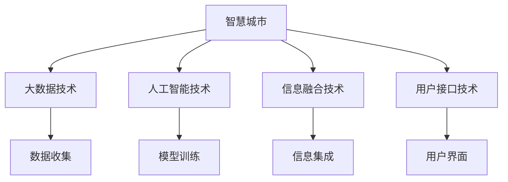

                 

# 知识发现引擎：推动智慧城市建设的蓝图

> 关键词：智慧城市,知识发现,大数据,人工智能,城市管理,城市规划

## 1. 背景介绍

### 1.1 问题由来

随着城市化进程的加快，人口激增、资源匮乏、环境恶化等城市问题日益凸显。智慧城市的概念应运而生，旨在通过信息技术手段，提高城市运行的效率和管理的科学性，构建一个绿色、智能、宜居的城市环境。知识发现引擎作为智慧城市的重要组成部分，通过挖掘海量数据中的知识，辅助城市管理者制定科学决策，优化城市运营管理，实现智慧城市的目标。

### 1.2 问题核心关键点

当前，智慧城市建设面临诸多挑战，如数据获取难度大、数据质量差、信息孤岛等。这些问题严重影响知识发现的效果和智慧城市的决策质量。因此，如何构建一个高效、可靠的知识发现引擎，成为推动智慧城市建设的关键。

知识发现引擎通过以下核心技术，为智慧城市建设提供支持：

- **大数据技术**：处理和存储海量数据，为知识发现提供数据基础。
- **人工智能技术**：包括机器学习、深度学习、自然语言处理等，从数据中挖掘知识，为智慧城市决策提供支撑。
- **信息融合技术**：实现不同来源数据的高效集成和融合，构建全城信息共享平台。
- **用户接口技术**：设计直观易用的界面，将知识发现结果反馈给城市管理者，辅助其做出决策。

## 2. 核心概念与联系

### 2.1 核心概念概述

为更好地理解知识发现引擎在智慧城市建设中的作用，本节将介绍几个密切相关的核心概念：

- **智慧城市**：利用物联网、云计算、大数据、人工智能等先进技术，对城市的基础设施、公共服务、城市治理等各个方面进行智能化改造，构建安全、便捷、绿色、宜居的城市环境。
- **知识发现**：通过对大规模数据集的分析和挖掘，发现其中的知识、规律和模式，为决策提供依据。
- **大数据技术**：处理和分析海量数据的技术，包括数据收集、存储、管理和分析等。
- **人工智能技术**：包括机器学习、深度学习、自然语言处理等，从数据中提取知识、模式和规律。
- **信息融合**：将来自不同源的信息，通过标准化、集成和关联等方式，转化为高质量、可共享的信息。
- **用户接口**：提供直观易用的界面，将知识发现结果反馈给城市管理者，辅助其制定决策。

这些核心概念之间具有紧密的联系，共同构成了智慧城市知识发现引擎的框架。

### 2.2 核心概念原理和架构的 Mermaid 流程图



这个流程图展示了智慧城市知识发现引擎的核心技术及其之间的联系：

1. 智慧城市通过大数据技术获取海量数据，作为知识发现的原料。
2. 人工智能技术从数据中挖掘知识和模式，辅助决策。
3. 信息融合技术实现数据的高效集成和共享，打破信息孤岛。
4. 用户接口技术提供直观易用的界面，反馈知识发现结果，辅助城市管理者做出决策。

## 3. 核心算法原理 & 具体操作步骤

### 3.1 算法原理概述

智慧城市知识发现引擎的核心算法包括大数据处理、人工智能建模和信息融合。这些算法的核心思想是通过自动化流程，从数据中发现潜在的知识和模式，并将其转化为决策支持信息。

### 3.2 算法步骤详解

**步骤1: 数据收集与预处理**

- 使用物联网传感器、公共数据平台、社交媒体等渠道，收集城市基础设施、公共服务、环境监测等多领域数据。
- 对数据进行清洗和预处理，去除噪音和异常值，标准化数据格式，确保数据质量。

**步骤2: 特征工程**

- 对数据进行特征提取和选择，构建高质量的特征集合。
- 使用主成分分析(PCA)、因子分析等降维技术，减少特征数量，提高计算效率。

**步骤3: 模型训练与优化**

- 使用机器学习、深度学习等算法，构建知识发现模型。
- 对模型进行训练和调参，使用交叉验证等技术评估模型性能。
- 使用正则化、Dropout等技术防止过拟合，提升模型泛化能力。

**步骤4: 知识发现**

- 使用构建好的模型，对数据进行预测和分类，发现知识、模式和规律。
- 通过可视化工具展示知识发现结果，如热力图、散点图等。

**步骤5: 信息集成与共享**

- 使用信息融合技术，将不同源的数据进行集成和关联。
- 建立城市信息共享平台，实现数据的高效共享和互操作。

**步骤6: 用户接口设计与实现**

- 设计直观易用的用户接口，提供知识发现结果的展示和分析功能。
- 使用Web界面、移动应用等形式，将知识发现结果反馈给城市管理者。

### 3.3 算法优缺点

智慧城市知识发现引擎具有以下优点：

- **数据驱动决策**：通过数据分析和挖掘，发现潜在问题和解决方案，辅助城市管理者制定决策。
- **信息共享与协同**：打破信息孤岛，实现数据的高效共享和互操作，促进跨部门协同。
- **实时监控与预警**：通过实时数据监控和分析，及时发现异常情况，进行预警和处理。

同时，该算法也存在一些局限性：

- **数据质量依赖**：知识发现的效果高度依赖数据质量，数据缺失、噪音等问题会影响结果。
- **模型复杂度高**：构建复杂模型需要大量计算资源，可能面临资源瓶颈。
- **隐私与安全**：在数据共享和处理过程中，可能涉及隐私和安全问题，需要严格管理和保护。

## 4. 数学模型和公式 & 详细讲解 & 举例说明

### 4.1 数学模型构建

知识发现引擎的数学模型通常包括以下几部分：

- **数据表示**：将城市数据表示为矩阵形式，便于数学处理和计算。
- **特征提取**：使用主成分分析(PCA)、因子分析等降维技术，将高维数据转化为低维表示。
- **模型训练**：使用回归、分类、聚类等算法，构建知识发现模型。
- **结果评估**：使用精度、召回率、F1分数等指标，评估模型性能。

### 4.2 公式推导过程

以回归模型为例，推导回归模型的公式：

假设训练集为 $D=\{(x_i, y_i)\}_{i=1}^N$，其中 $x_i \in \mathbb{R}^d$ 为输入向量，$y_i$ 为输出向量。回归模型的目标是找到最优的权重 $\theta$，使得预测值 $\hat{y}$ 尽可能接近真实值 $y$。回归模型的损失函数为均方误差损失函数：

$$
\mathcal{L}(\theta) = \frac{1}{N}\sum_{i=1}^N (y_i - \hat{y_i})^2
$$

其中 $\hat{y_i} = \theta^T x_i$。

使用梯度下降算法更新模型参数：

$$
\theta \leftarrow \theta - \eta \nabla_{\theta}\mathcal{L}(\theta)
$$

其中 $\eta$ 为学习率。

### 4.3 案例分析与讲解

以智慧城市的交通流量预测为例，展示知识发现引擎的应用：

假设收集了某城市的历史交通流量数据 $D=\{(x_i, y_i)\}_{i=1}^N$，其中 $x_i$ 为时间戳，$y_i$ 为交通流量。使用线性回归模型对数据进行拟合，构建预测模型：

$$
\hat{y_i} = \theta_0 + \theta_1 x_i
$$

模型训练过程中，使用均方误差损失函数：

$$
\mathcal{L}(\theta) = \frac{1}{N}\sum_{i=1}^N (y_i - \hat{y_i})^2
$$

通过最小化损失函数，使用梯度下降算法更新模型参数 $\theta_0$ 和 $\theta_1$，得到最佳的交通流量预测模型。使用该模型，可以对未来的交通流量进行预测和分析，为城市交通管理提供决策支持。

## 5. 项目实践：代码实例和详细解释说明

### 5.1 开发环境搭建

在进行知识发现引擎的开发实践前，我们需要准备好开发环境。以下是使用Python进行Scikit-learn开发的环境配置流程：

1. 安装Anaconda：从官网下载并安装Anaconda，用于创建独立的Python环境。

2. 创建并激活虚拟环境：
```bash
conda create -n sklearn-env python=3.8 
conda activate sklearn-env
```

3. 安装Scikit-learn：
```bash
conda install scikit-learn
```

4. 安装各类工具包：
```bash
pip install numpy pandas matplotlib seaborn jupyter notebook
```

完成上述步骤后，即可在`sklearn-env`环境中开始项目实践。

### 5.2 源代码详细实现

以下是使用Scikit-learn库对城市交通流量进行回归预测的Python代码实现：

```python
from sklearn.model_selection import train_test_split
from sklearn.linear_model import LinearRegression
from sklearn.metrics import mean_squared_error

# 假设已有一组交通流量数据
X = city_traffic_data['timestamp'].values.reshape(-1, 1)
y = city_traffic_data['traffic_flow'].values.reshape(-1, 1)

# 划分训练集和测试集
X_train, X_test, y_train, y_test = train_test_split(X, y, test_size=0.2, random_state=42)

# 构建线性回归模型
model = LinearRegression()

# 模型训练
model.fit(X_train, y_train)

# 模型评估
y_pred = model.predict(X_test)
mse = mean_squared_error(y_test, y_pred)

# 输出结果
print(f"Mean Squared Error: {mse:.2f}")
```

### 5.3 代码解读与分析

让我们再详细解读一下关键代码的实现细节：

**数据准备**：
- `X`和`y`变量分别表示输入特征和输出标签。
- 使用`train_test_split`函数将数据划分为训练集和测试集。

**模型构建与训练**：
- 使用`LinearRegression`类构建线性回归模型。
- 调用`fit`函数对模型进行训练，传入训练集数据。

**模型评估**：
- 使用`predict`函数对测试集数据进行预测，得到预测值。
- 使用`mean_squared_error`函数计算均方误差，评估模型性能。

**结果输出**：
- 输出模型在测试集上的均方误差，展示回归预测的精度。

## 6. 实际应用场景

### 6.1 智慧城市交通管理

智慧城市交通管理是知识发现引擎的重要应用场景。通过实时监控和分析交通流量数据，可以预测交通拥堵情况，优化交通信号灯控制，提升道路通行效率，缓解城市交通压力。

**具体实现**：
- 收集城市交通流量、车速、路况等数据。
- 使用知识发现引擎对数据进行分析和建模，构建交通流量预测模型。
- 实时监测交通流量，使用预测模型预测未来交通状况，调整交通信号灯控制，缓解拥堵。

### 6.2 智慧城市环境监测

智慧城市环境监测是知识发现引擎的另一个重要应用场景。通过分析城市空气质量、水质、噪音等数据，可以实时监测环境质量，预警环境污染事件，制定环保措施。

**具体实现**：
- 收集城市空气质量、水质、噪音等数据。
- 使用知识发现引擎对数据进行分析和建模，构建环境质量预测模型。
- 实时监测环境数据，使用预测模型预警环境污染事件，制定环保措施。

### 6.3 智慧城市资源管理

智慧城市资源管理包括能源、水资源、垃圾处理等方面的管理。通过知识发现引擎，可以实现对资源使用情况的智能分析和优化，提升资源利用效率，降低浪费。

**具体实现**：
- 收集城市能源使用、水资源消耗、垃圾处理等数据。
- 使用知识发现引擎对数据进行分析和建模，构建资源使用预测模型。
- 实时监测资源使用情况，使用预测模型优化资源配置，提高资源利用效率。

### 6.4 未来应用展望

随着智慧城市建设的不断推进，知识发现引擎将迎来更广阔的应用前景：

1. **多源数据融合**：融合不同来源的数据，实现跨部门、跨领域的信息共享和协同。
2. **实时预测与预警**：通过实时数据监控和分析，及时预警异常情况，优化城市管理。
3. **智能决策支持**：构建城市决策支持系统，辅助城市管理者制定科学决策，优化城市运营。
4. **用户个性化服务**：利用知识发现引擎，为用户提供个性化的城市服务，提升用户体验。

## 7. 工具和资源推荐

### 7.1 学习资源推荐

为帮助开发者掌握知识发现引擎的理论基础和实践技巧，这里推荐一些优质的学习资源：

1. **《机器学习》**：周志华著，全面介绍了机器学习的基本概念、算法和应用。
2. **《Python数据科学手册》**：Jake VanderPlas著，详细介绍了Python在数据科学中的应用，包括Scikit-learn等常用库的使用。
3. **《深度学习》**：Ian Goodfellow著，深入讲解了深度学习的基本原理和实现技术。
4. **Scikit-learn官方文档**：提供了详细的Scikit-learn库文档和示例，是学习知识发现引擎的必备资源。
5. **Kaggle平台**：提供了大量数据集和竞赛，是学习数据科学和知识发现的实践平台。

通过对这些资源的学习实践，相信你一定能够快速掌握知识发现引擎的精髓，并用于解决实际的智慧城市问题。

### 7.2 开发工具推荐

高效的知识发现引擎开发离不开优秀的工具支持。以下是几款用于知识发现引擎开发的常用工具：

1. **Scikit-learn**：一个基于Python的机器学习库，提供简单易用的接口和多种算法实现，适合快速开发知识发现模型。
2. **TensorFlow**：由Google主导开发的深度学习框架，支持大规模模型训练和推理，适合复杂的深度学习应用。
3. **PyTorch**：一个动态计算图框架，支持灵活的模型构建和训练，适合研究和原型开发。
4. **Jupyter Notebook**：一个交互式的数据科学工具，支持代码、文档和可视化效果的结合展示。
5. **TensorBoard**：TensorFlow配套的可视化工具，实时监测模型训练状态，提供丰富的图表展示。

合理利用这些工具，可以显著提升知识发现引擎的开发效率，加快创新迭代的步伐。

### 7.3 相关论文推荐

知识发现引擎的研究源于学界的持续探索。以下是几篇奠基性的相关论文，推荐阅读：

1. **《数据挖掘：概念与技术》**：Christopher D. Manning、Kurt Kullmann著，全面介绍了数据挖掘的基本概念和技术。
2. **《机器学习》**：Tom Mitchell著，深入讲解了机器学习的基本原理和应用。
3. **《信息融合：基础与算法》**：Larry R. Riddle、Krishna Chakrabarti著，详细介绍了信息融合的算法和应用。
4. **《知识发现与数据挖掘》**：Yoav Shoham著，介绍了知识发现和数据挖掘的基本概念和算法。
5. **《深度学习》**：Ian Goodfellow、Yoshua Bengio、Aaron Courville著，深入讲解了深度学习的基本原理和实现技术。

这些论文代表了大数据与人工智能技术的最新进展，通过学习这些前沿成果，可以帮助研究者把握学科前进方向，激发更多的创新灵感。

## 8. 总结：未来发展趋势与挑战

### 8.1 总结

本文对智慧城市知识发现引擎进行了全面系统的介绍。首先阐述了知识发现引擎在智慧城市建设中的重要性，明确了其作为数据驱动决策工具的关键作用。其次，从原理到实践，详细讲解了知识发现引擎的核心算法和操作步骤，提供了完整的代码实例。同时，本文还广泛探讨了知识发现引擎在智慧城市交通管理、环境监测、资源管理等多个领域的应用前景，展示了其在推动智慧城市建设中的巨大潜力。此外，本文精选了知识发现引擎的学习资源、开发工具和相关论文，力求为读者提供全方位的技术指引。

通过本文的系统梳理，可以看到，智慧城市知识发现引擎在智慧城市建设中具有重要的地位。这些核心技术的协同应用，不仅能够显著提升智慧城市的决策质量和运营效率，还能推动城市管理向智能化、精细化方向发展。相信随着技术的发展，知识发现引擎必将在智慧城市建设中发挥更大的作用。

### 8.2 未来发展趋势

展望未来，智慧城市知识发现引擎将呈现以下几个发展趋势：

1. **数据融合与互操作**：融合不同来源的数据，实现全城信息共享和协同。
2. **实时监控与预警**：通过实时数据监测和分析，及时预警异常情况，优化城市管理。
3. **智能决策支持**：构建城市决策支持系统，辅助城市管理者制定科学决策，提升城市治理水平。
4. **用户个性化服务**：利用知识发现引擎，为用户提供个性化的城市服务，提升用户体验。
5. **自动化与智能化**：通过自动化流程和智能化算法，提升知识发现引擎的效率和精度。

这些趋势表明，知识发现引擎在智慧城市建设中将发挥越来越重要的作用，推动城市治理向更高层次发展。

### 8.3 面临的挑战

尽管智慧城市知识发现引擎已经取得了瞩目成就，但在迈向更加智能化、普适化应用的过程中，仍面临诸多挑战：

1. **数据获取与质量**：数据获取难度大、质量差、信息孤岛等问题，严重影响知识发现的效果。
2. **模型复杂性与计算资源**：构建复杂模型需要大量计算资源，可能面临资源瓶颈。
3. **隐私与安全**：在数据共享和处理过程中，涉及隐私和安全问题，需要严格管理和保护。
4. **跨部门协同与标准化**：跨部门数据融合和协同需要解决标准化和互操作问题。

解决这些挑战，需要政府、企业、学术界的共同努力。只有不断优化数据获取和质量，提升模型效率和精度，加强隐私和安全管理，才能实现知识发现引擎在智慧城市建设中的最大价值。

### 8.4 研究展望

面对智慧城市知识发现引擎所面临的挑战，未来的研究需要在以下几个方面寻求新的突破：

1. **数据融合与标准化**：研究跨部门、跨领域数据融合和标准化技术，实现全城信息共享和协同。
2. **自动化与智能化**：开发自动化知识发现流程和智能化算法，提升知识发现引擎的效率和精度。
3. **隐私与安全**：研究隐私保护和数据安全技术，保障数据共享和处理过程中的隐私和安全。
4. **跨部门协同**：探索跨部门协同机制和技术，打破信息孤岛，实现数据的高效共享和互操作。
5. **用户个性化服务**：利用知识发现引擎，为用户提供个性化的城市服务，提升用户体验。

这些研究方向的探索，必将引领知识发现引擎技术迈向更高的台阶，为智慧城市建设提供更强大的技术支撑。面向未来，智慧城市知识发现引擎需要与其他人工智能技术进行更深入的融合，如自然语言处理、计算机视觉等，多路径协同发力，共同推动智慧城市建设向更高级阶段发展。

## 9. 附录：常见问题与解答

**Q1：知识发现引擎是否适用于所有智慧城市任务？**

A: 知识发现引擎在大多数智慧城市任务上都能取得不错的效果，特别是对于数据量较大的任务。但对于一些需要领域专业知识的任务，如医疗、法律等，仅依靠通用数据可能难以很好地适应。此时需要在特定领域数据上进一步预训练，再进行微调，才能获得理想效果。

**Q2：知识发现引擎需要多少数据才能取得理想效果？**

A: 知识发现引擎的效果高度依赖数据质量，数据量越大，效果通常越好。一般来说，需要数百万、甚至数千万条数据才能取得较好的结果。数据量不足时，可以考虑使用数据增强、迁移学习等方法，提高模型泛化能力。

**Q3：知识发现引擎在构建模型时需要注意哪些问题？**

A: 在构建知识发现模型时，需要注意以下几点：
1. 数据预处理：清洗和标准化数据，去除噪音和异常值。
2. 特征工程：选择和构造高质量的特征，使用降维技术减少特征数量。
3. 模型选择：根据任务特点选择合适的模型，如回归、分类、聚类等。
4. 模型调参：使用交叉验证等技术，评估和调优模型参数。
5. 模型评估：使用精度、召回率、F1分数等指标，评估模型性能。

这些步骤是构建高质量知识发现模型的关键。只有在各个环节都严格把控，才能得到理想的知识发现结果。

**Q4：知识发现引擎在应用中需要注意哪些问题？**

A: 在知识发现引擎的应用中，需要注意以下几点：
1. 数据隐私：保护数据隐私，防止敏感信息泄露。
2. 模型透明：确保模型的透明性和可解释性，避免"黑箱"系统。
3. 实时性能：提升模型的实时处理能力，满足智慧城市实时决策的需求。
4. 模型更新：定期更新模型，适应数据分布的变化。
5. 用户接口设计：设计直观易用的用户接口，提供知识发现结果的展示和分析功能。

这些步骤是确保知识发现引擎在实际应用中取得成功的重要保障。只有通过不断优化，才能发挥其在智慧城市建设中的最大价值。

---

作者：禅与计算机程序设计艺术 / Zen and the Art of Computer Programming

