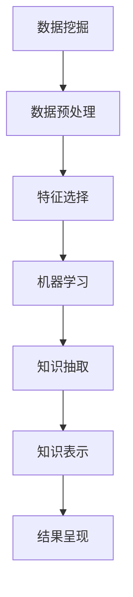
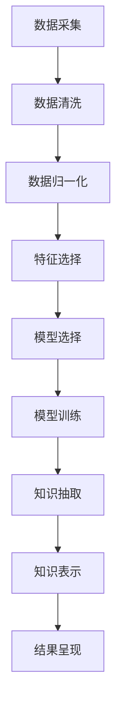

                 

# 知识发现引擎：知识与洞察力的完美统一

> 关键词：知识发现引擎, 数据挖掘, 机器学习, 人工智能, 数据融合, 统计学习, 知识表示

## 1. 背景介绍

### 1.1 问题由来

在数据驱动的时代，如何从海量数据中提取有价值的信息，转化为可操作的洞察力，成为企业和组织的重要任务。传统的数据分析和报告方法已经无法应对数据量的爆炸式增长，也无法满足用户对深入洞察力的需求。知识发现引擎（Knowledge Discovery Engine, KDE）应运而生，通过自动化地挖掘数据中的知识模式，支持决策者做出更准确、更快速的决策。

知识发现引擎是数据挖掘技术的高级形式，是人工智能（AI）和数据科学领域的核心组成部分。它通过应用统计学、机器学习和人工智能等技术，从数据中提取出潜在的有价值模式，为决策者提供精确的洞察力和预测。

### 1.2 问题核心关键点

知识发现引擎的核心在于如何从数据中提取有价值的信息和模式，并将其转化为可操作的洞察力。具体而言，它涉及以下几个关键点：

- **数据采集和预处理**：从多源异构数据中采集和整合数据，并进行清洗、归一化和特征工程等预处理工作。
- **模型选择和训练**：选择合适的机器学习模型，如分类、回归、聚类、关联规则等，并使用历史数据对其进行训练。
- **知识抽取和表示**：从训练好的模型中提取出知识模式，并将其表示为易于理解和利用的形式。
- **结果呈现和应用**：将提取出的知识通过可视化或报表形式呈现给决策者，并指导其做出决策。

知识发现引擎在多个领域得到了广泛应用，如金融、零售、医疗、公共安全等，帮助企业优化运营效率、降低风险、提升客户体验等。

### 1.3 问题研究意义

知识发现引擎的研究和应用具有重要意义：

- **支持决策支持**：知识发现引擎为决策者提供了科学的数据分析工具，帮助其快速做出基于数据的决策。
- **优化资源配置**：通过数据分析，企业可以更精准地配置资源，提高运营效率。
- **预测未来趋势**：通过分析历史数据，知识发现引擎可以预测未来的趋势和变化，为企业带来竞争优势。
- **提升用户体验**：在产品和服务的设计中应用知识发现引擎，可以提升用户满意度和忠诚度。
- **推动技术创新**：知识发现引擎的应用促进了数据科学、机器学习等技术的发展，推动了人工智能领域的创新。

## 2. 核心概念与联系

### 2.1 核心概念概述

知识发现引擎的构建涉及多个核心概念，包括数据挖掘、机器学习、人工智能、数据融合等。

- **数据挖掘（Data Mining）**：从数据中自动发现模式和知识的过程。数据挖掘技术包括统计分析、关联规则挖掘、分类、聚类等方法。
- **机器学习（Machine Learning）**：让计算机从数据中学习规律，并应用于新数据预测和决策的过程。常用的机器学习算法包括决策树、支持向量机、随机森林等。
- **人工智能（Artificial Intelligence）**：通过模拟人类的智能行为，使计算机具备理解、学习、推理、决策等能力。人工智能应用广泛，包括自然语言处理、计算机视觉、语音识别等。
- **数据融合（Data Fusion）**：将来自不同源的数据整合起来，形成更全面、准确的信息的过程。数据融合技术包括数据清洗、特征选择、数据匹配等。
- **统计学习（Statistical Learning）**：通过建立数学模型，从数据中学习规律和预测未来的过程。常用的统计学习方法包括回归、分类、聚类等。
- **知识表示（Knowledge Representation）**：将知识表示为易于理解和应用的形式，如规则、框架、网络等。知识表示技术包括符号表示、逻辑表示、模糊逻辑等。

这些核心概念之间的联系可以通过以下Mermaid流程图来展示：



这个流程图展示了数据从采集到最终呈现的过程：

1. 数据采集和预处理：通过数据挖掘技术，从多源数据中采集数据，并进行清洗、归一化和特征选择。
2. 模型选择和训练：选择适当的机器学习算法，使用历史数据进行训练，得到模型。
3. 知识抽取和表示：从训练好的模型中提取出知识模式，并将其表示为易于理解和应用的形式。
4. 结果呈现和应用：将提取出的知识通过可视化或报表形式呈现给决策者，并指导其做出决策。

## 3. 核心算法原理 & 具体操作步骤
### 3.1 算法原理概述

知识发现引擎的算法原理基于数据挖掘、机器学习和人工智能等技术。其核心在于从数据中自动发现模式和知识，并将其转化为可操作的洞察力。

知识发现引擎的算法过程一般包括以下几个步骤：

1. 数据采集和预处理：从不同数据源中采集数据，并进行清洗、归一化和特征选择。
2. 模型选择和训练：选择适当的机器学习算法，使用历史数据进行训练，得到模型。
3. 知识抽取和表示：从训练好的模型中提取出知识模式，并将其表示为易于理解和应用的形式。
4. 结果呈现和应用：将提取出的知识通过可视化或报表形式呈现给决策者，并指导其做出决策。

知识发现引擎的算法过程可以通过以下流程图来展示：



### 3.2 算法步骤详解

#### 3.2.1 数据采集和预处理

数据采集是知识发现引擎的第一步。数据可以从不同数据源中采集，如数据库、日志文件、传感器数据等。

数据预处理包括清洗、归一化和特征选择等步骤。清洗数据是为了去除噪声和错误，归一化数据是为了统一数据格式和范围，特征选择是为了选择对预测有用的特征。

#### 3.2.2 模型选择和训练

模型选择和训练是知识发现引擎的核心步骤。常用的机器学习算法包括决策树、支持向量机、随机森林、神经网络等。

模型训练过程中，首先需要选择合适的算法，然后使用历史数据进行训练。训练过程中，需要选择合适的特征、超参数和评估指标，以确保模型的准确性和泛化能力。

#### 3.2.3 知识抽取和表示

知识抽取和表示是知识发现引擎的最终步骤。知识抽取是将模型预测的结果转换为有意义的知识和模式，知识表示是将知识表示为易于理解和应用的形式。

常用的知识抽取方法包括规则抽取、决策树抽取、关联规则抽取等。常用的知识表示方法包括规则表示、框架表示、网络表示等。

#### 3.2.4 结果呈现和应用

结果呈现是将知识以可视化或报表形式呈现给决策者，以便其做出决策。常用的结果呈现方法包括饼图、柱状图、散点图、热力图等。

### 3.3 算法优缺点

知识发现引擎具有以下优点：

- **自动化和高效性**：通过自动化算法，可以快速发现数据中的知识模式，减少人工工作量。
- **精确性和可解释性**：通过科学的方法和工具，可以从数据中提取精确的知识模式，并提供可解释的解释。
- **灵活性和可扩展性**：可以根据不同的数据源和任务，选择不同的算法和工具，灵活应用知识发现引擎。

知识发现引擎也存在以下缺点：

- **数据质量和完整性**：数据质量和完整性直接影响知识发现引擎的准确性和可靠性。
- **模型复杂性**：选择和训练复杂的模型可能会导致过拟合，影响模型的泛化能力。
- **结果解释性**：复杂的数据模型和知识表示方法，可能难以提供易于理解的结果。

### 3.4 算法应用领域

知识发现引擎在多个领域得到了广泛应用，以下是几个典型的应用领域：

- **金融领域**：用于风险评估、信用评分、欺诈检测、投资策略制定等。
- **零售领域**：用于客户行为分析、商品推荐、库存管理、价格优化等。
- **医疗领域**：用于疾病诊断、治疗方案推荐、患者分群、健康监测等。
- **公共安全**：用于犯罪预测、交通流量分析、网络安全监测等。
- **市场营销**：用于市场细分、广告投放、用户行为分析等。
- **制造业**：用于质量控制、设备维护、供应链优化等。

## 4. 数学模型和公式 & 详细讲解 & 举例说明

### 4.1 数学模型构建

知识发现引擎的数学模型构建基于统计学习、机器学习和人工智能等技术。以下是一个简单的数学模型示例：

假设我们有一个二分类问题，数据集为 $(x_i, y_i)$，其中 $x_i$ 为输入特征，$y_i \in \{0, 1\}$ 为标签。我们使用逻辑回归模型来预测二分类问题。

逻辑回归模型的数学模型为：

$$
P(y_i=1|x_i) = \frac{1}{1+\exp(-\theta^T x_i)}
$$

其中 $\theta$ 为模型参数。

### 4.2 公式推导过程

#### 4.2.1 逻辑回归

逻辑回归模型的训练过程包括特征选择、模型选择和模型训练等步骤。

特征选择是为了选择对预测有用的特征，可以使用相关系数、信息增益等方法。

模型选择是为了选择适当的算法，常用的算法包括逻辑回归、支持向量机、随机森林等。

模型训练是为了使用历史数据对模型进行训练，得到最优的模型参数。常用的训练方法包括梯度下降、牛顿法等。

### 4.3 案例分析与讲解

#### 4.3.1 金融风险评估

在金融领域，知识发现引擎可以用于风险评估和信用评分。假设我们有一个金融数据集，包含客户的历史交易记录和信用评分。

我们可以使用逻辑回归模型来预测客户的违约概率。模型训练时，我们需要选择适当的特征，如客户的收入、年龄、职业等，并进行归一化处理。

模型训练后，我们可以使用模型预测新客户的违约概率，从而进行风险评估和信用评分。

## 5. 项目实践：代码实例和详细解释说明

### 5.1 开发环境搭建

知识发现引擎的开发通常使用Python语言和常用的数据科学库，如Pandas、NumPy、Scikit-learn等。以下是Python开发环境搭建的步骤：

1. 安装Python：从官网下载并安装Python。
2. 安装Pip：在命令行输入 `python -m ensurepip --default-pip` 安装Pip。
3. 安装数据科学库：使用Pip安装Pandas、NumPy、Scikit-learn等库。

```bash
pip install pandas numpy scikit-learn
```

### 5.2 源代码详细实现

#### 5.2.1 数据预处理

```python
import pandas as pd
from sklearn.preprocessing import StandardScaler

# 读取数据
data = pd.read_csv('data.csv')

# 特征选择
features = data.drop('label', axis=1)

# 归一化
scaler = StandardScaler()
scaled_features = scaler.fit_transform(features)

# 标签选择
labels = data['label']
```

#### 5.2.2 模型训练

```python
from sklearn.linear_model import LogisticRegression
from sklearn.model_selection import train_test_split

# 划分训练集和测试集
X_train, X_test, y_train, y_test = train_test_split(scaled_features, labels, test_size=0.2, random_state=42)

# 训练模型
model = LogisticRegression()
model.fit(X_train, y_train)
```

#### 5.2.3 结果呈现

```python
from sklearn.metrics import accuracy_score

# 预测测试集
y_pred = model.predict(X_test)

# 计算准确率
accuracy = accuracy_score(y_test, y_pred)
print(f"Accuracy: {accuracy:.2f}")
```

### 5.3 代码解读与分析

#### 5.3.1 数据预处理

数据预处理是知识发现引擎的重要步骤。数据预处理包括特征选择、归一化和标签选择等步骤。

特征选择是选择对预测有用的特征，可以使用相关系数、信息增益等方法。

归一化是为了统一数据格式和范围，可以使用Z-score归一化或最大最小归一化等方法。

标签选择是选择用于预测的标签，通常选择二分类问题。

#### 5.3.2 模型训练

模型训练是知识发现引擎的核心步骤。模型训练包括特征选择、模型选择和模型训练等步骤。

特征选择是选择对预测有用的特征，可以使用相关系数、信息增益等方法。

模型选择是选择适当的算法，常用的算法包括逻辑回归、支持向量机、随机森林等。

模型训练是为了使用历史数据对模型进行训练，得到最优的模型参数。常用的训练方法包括梯度下降、牛顿法等。

#### 5.3.3 结果呈现

结果呈现是将知识以可视化或报表形式呈现给决策者，以便其做出决策。常用的结果呈现方法包括饼图、柱状图、散点图、热力图等。

## 6. 实际应用场景

### 6.1 金融风险评估

在金融领域，知识发现引擎可以用于风险评估和信用评分。假设我们有一个金融数据集，包含客户的历史交易记录和信用评分。

我们可以使用逻辑回归模型来预测客户的违约概率。模型训练时，我们需要选择适当的特征，如客户的收入、年龄、职业等，并进行归一化处理。

模型训练后，我们可以使用模型预测新客户的违约概率，从而进行风险评估和信用评分。

### 6.2 零售客户行为分析

在零售领域，知识发现引擎可以用于客户行为分析。假设我们有一个零售数据集，包含客户的购买记录和行为数据。

我们可以使用聚类算法来对客户进行分组，使用关联规则挖掘算法来发现客户购买行为的规律，从而进行客户细分和商品推荐。

### 6.3 医疗疾病预测

在医疗领域，知识发现引擎可以用于疾病预测和患者分群。假设我们有一个医疗数据集，包含患者的历史病历和诊断结果。

我们可以使用决策树算法来预测患者的疾病概率，使用聚类算法来对患者进行分组，从而进行疾病预测和患者分群。

## 7. 工具和资源推荐

### 7.1 学习资源推荐

为了帮助开发者系统掌握知识发现引擎的理论基础和实践技巧，这里推荐一些优质的学习资源：

1. 《数据挖掘：概念与技术》：由数据挖掘领域的专家撰写，全面介绍了数据挖掘的基本概念和技术。
2. 《Python数据科学手册》：由数据科学领域的知名博主撰写，介绍了Python在数据科学中的应用。
3. 《机器学习实战》：由机器学习领域的专家撰写，通过实例介绍了机器学习的应用和实现。
4. 《数据融合技术》：由数据融合领域的专家撰写，全面介绍了数据融合的基本概念和技术。
5. 《统计学习基础》：由统计学习领域的专家撰写，全面介绍了统计学习的基本概念和技术。

通过对这些资源的学习实践，相信你一定能够快速掌握知识发现引擎的精髓，并用于解决实际的NLP问题。

### 7.2 开发工具推荐

知识发现引擎的开发通常使用Python语言和常用的数据科学库，如Pandas、NumPy、Scikit-learn等。以下是Python开发环境搭建的步骤：

1. 安装Python：从官网下载并安装Python。
2. 安装Pip：在命令行输入 `python -m ensurepip --default-pip` 安装Pip。
3. 安装数据科学库：使用Pip安装Pandas、NumPy、Scikit-learn等库。

```bash
pip install pandas numpy scikit-learn
```

### 7.3 相关论文推荐

知识发现引擎的研究方向涵盖多个领域，以下是几篇奠基性的相关论文，推荐阅读：

1. KDD Cup 2012 Medical Prediction Challenge：该论文介绍了基于机器学习的疾病预测方法，并获得了KDD Cup 2012冠军。
2. Data Mining and Statistical Learning：该论文系统介绍了数据挖掘和统计学习的理论基础和实践方法。
3. Data Mining and Statistical Learning：该论文介绍了数据融合和信息提取的最新研究进展。
4. Knowledge Discovery and Data Mining：该论文介绍了知识发现和数据挖掘的最新研究进展。

这些论文代表了大语言模型微调技术的发展脉络。通过学习这些前沿成果，可以帮助研究者把握学科前进方向，激发更多的创新灵感。

## 8. 总结：未来发展趋势与挑战

### 8.1 总结

本文对知识发现引擎的研究进行了全面系统的介绍。首先阐述了知识发现引擎的研究背景和意义，明确了知识发现引擎在数据挖掘、机器学习和人工智能等领域的核心地位。其次，从原理到实践，详细讲解了知识发现引擎的算法过程，给出了知识发现引擎的完整代码实现。同时，本文还广泛探讨了知识发现引擎在金融、零售、医疗等多个行业领域的应用前景，展示了知识发现引擎的广阔应用前景。

通过本文的系统梳理，可以看到，知识发现引擎是数据驱动时代的重要技术手段，能够从海量数据中提取有价值的信息，转化为可操作的洞察力，支持决策者做出更准确、更快速的决策。未来，伴随数据科学的不断发展，知识发现引擎的应用范围和效果将进一步提升。

### 8.2 未来发展趋势

展望未来，知识发现引擎的发展趋势如下：

1. **自动化和智能化**：随着人工智能技术的发展，知识发现引擎将进一步自动化和智能化，能够自动识别和提取数据中的知识模式。
2. **多源数据融合**：未来的知识发现引擎将能够处理多源异构数据，并从中提取更加全面、准确的知识模式。
3. **实时性提升**：随着大数据和云计算技术的发展，知识发现引擎将具备实时性，能够实时处理和分析数据，支持实时决策。
4. **领域特定优化**：未来的知识发现引擎将针对不同领域的特点，进行领域特定优化，提高其在特定领域的应用效果。
5. **模型解释性增强**：未来的知识发现引擎将增强模型的解释性，提供易于理解的输出结果，帮助决策者更好地理解模型的预测和建议。

### 8.3 面临的挑战

尽管知识发现引擎已经取得了显著成果，但在迈向更加智能化、普适化应用的过程中，它仍面临诸多挑战：

1. **数据质量和完整性**：数据质量和完整性直接影响知识发现引擎的准确性和可靠性，如何从多源异构数据中提取出高质量的数据，是未来的重要研究方向。
2. **模型复杂性**：选择和训练复杂的模型可能会导致过拟合，影响模型的泛化能力，如何优化模型的复杂性和泛化能力，是未来的重要研究方向。
3. **结果解释性**：复杂的数据模型和知识表示方法，可能难以提供易于理解的结果，如何增强模型的解释性，提供易于理解的输出结果，是未来的重要研究方向。
4. **计算资源限制**：处理大规模数据和复杂模型需要大量的计算资源，如何优化计算资源的使用，提高计算效率，是未来的重要研究方向。
5. **安全性和隐私保护**：如何保护数据隐私和安全，避免数据泄露和滥用，是未来的重要研究方向。

### 8.4 研究展望

面对知识发现引擎面临的挑战，未来的研究需要在以下几个方面寻求新的突破：

1. **自动化和智能化**：开发自动化和智能化的知识发现引擎，能够自动识别和提取数据中的知识模式。
2. **多源数据融合**：开发能够处理多源异构数据的知识发现引擎，并从中提取更加全面、准确的知识模式。
3. **实时性提升**：开发具备实时性的知识发现引擎，能够实时处理和分析数据，支持实时决策。
4. **领域特定优化**：开发针对不同领域特点的知识发现引擎，提高其在特定领域的应用效果。
5. **模型解释性增强**：增强模型的解释性，提供易于理解的输出结果，帮助决策者更好地理解模型的预测和建议。
6. **计算资源优化**：优化计算资源的使用，提高计算效率，支持大规模数据的处理和分析。
7. **安全性和隐私保护**：开发安全性和隐私保护的知识发现引擎，确保数据隐私和安全。

这些研究方向的探索，必将引领知识发现引擎技术迈向更高的台阶，为构建人机协同的智能系统铺平道路。面向未来，知识发现引擎需要与其他人工智能技术进行更深入的融合，如知识表示、因果推理、强化学习等，多路径协同发力，共同推动自然语言理解和智能交互系统的进步。只有勇于创新、敢于突破，才能不断拓展知识发现引擎的边界，让智能技术更好地造福人类社会。

## 9. 附录：常见问题与解答

**Q1：知识发现引擎是否适用于所有数据集？**

A: 知识发现引擎通常适用于具有一定结构和规律的数据集，如表格数据、时间序列数据等。对于无结构数据，如文本、图像等，需要使用其他技术进行处理。

**Q2：知识发现引擎的训练时间通常如何？**

A: 知识发现引擎的训练时间取决于数据集大小、模型复杂度、计算资源等因素。通常，对于大规模数据集和复杂模型，训练时间较长，需要优化算法和计算资源配置。

**Q3：知识发现引擎的精度如何衡量？**

A: 知识发现引擎的精度通常通过各种评估指标进行衡量，如准确率、召回率、F1分数等。评估指标的选择需要根据具体问题和数据集特点进行设计。

**Q4：知识发现引擎在实际应用中需要注意哪些问题？**

A: 在实际应用中，知识发现引擎需要注意数据隐私和安全、模型解释性、计算资源限制等问题。

**Q5：知识发现引擎的未来发展方向是什么？**

A: 知识发现引擎的未来发展方向包括自动化和智能化、多源数据融合、实时性提升、领域特定优化、模型解释性增强、计算资源优化和安全性和隐私保护。

---

作者：禅与计算机程序设计艺术 / Zen and the Art of Computer Programming

