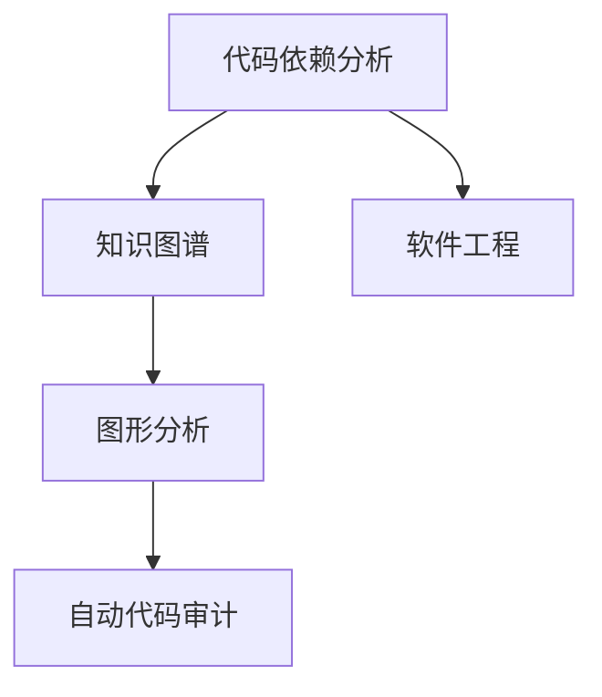
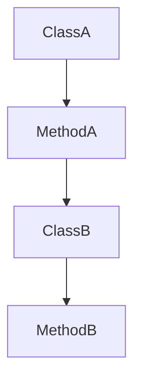

                 

# 知识图谱在代码依赖分析中的应用

> 关键词：知识图谱,代码依赖分析,图形分析,自动代码审计,软件工程

## 1. 背景介绍

### 1.1 问题由来
随着软件工程领域的不断进步，代码库的规模越来越大，复杂度越来越高。如何有效地管理和分析这些庞大的代码库，保证代码质量、提高开发效率，成为了一个日益重要且棘手的问题。特别是在微服务架构和DevOps文化逐渐普及的今天，代码依赖关系变得更为复杂多变，传统的基于静态依赖分析工具已经难以胜任。

为了解决这一问题，研究者们逐渐引入图结构对代码依赖进行动态建模。**知识图谱（Knowledge Graph）**作为一种强大的语义表示形式，特别适合用于捕捉和描述复杂、多维的关系数据。本文将探讨知识图谱在代码依赖分析中的应用，介绍基于知识图谱的代码依赖分析方法，并结合实际案例进行分析。

### 1.2 问题核心关键点
- 代码依赖分析：确定代码库中模块或组件之间的依赖关系，是软件工程中的基础任务。传统的静态依赖分析工具通常依赖于编译器或版本控制系统的日志，难以处理动态和交叉依赖。
- 知识图谱：一种结构化、语义化的表示方式，能够有效捕捉实体和实体间的关系，适合用于复杂关系的描述和分析。
- 图形分析：利用图结构进行关系挖掘和计算，能够揭示代码库中的隐藏依赖和潜在风险。
- 自动代码审计：通过知识图谱构建的代码依赖关系，实现自动化的代码审计和质量检查。
- 软件工程：代码依赖分析、质量检查和审计是软件工程中的重要组成部分，直接影响软件产品的质量、安全性和可维护性。

这些核心概念之间的逻辑关系可以通过以下Mermaid流程图来展示：



这个流程图展示了他核心的概念以及它们之间的联系：

1. 代码依赖分析：通过知识图谱来构建代码库的依赖结构。
2. 知识图谱：用于表示代码库中模块和组件之间的关系。
3. 图形分析：基于知识图谱进行关系挖掘和计算。
4. 自动代码审计：利用图形分析的结果进行代码审计和质量检查。
5. 软件工程：贯穿整个代码依赖分析和审计过程，提高软件质量和效率。

## 2. 核心概念与联系

### 2.1 核心概念概述

为了更好地理解基于知识图谱的代码依赖分析方法，本节将介绍几个密切相关的核心概念：

- **代码依赖分析（Code Dependency Analysis）**：分析代码库中模块或组件之间的依赖关系，确定依赖结构，通常以图形表示，用于指导开发、维护和测试。
- **知识图谱（Knowledge Graph）**：由节点（实体）和边（关系）组成的图形结构，用于表示语义信息，适合描述实体间复杂的交互关系。
- **图形分析（Graph Analysis）**：通过图结构进行关系挖掘和计算，常用于社会网络、推荐系统、化学分子等领域，用于揭示潜在的规律和模式。
- **自动代码审计（Automatic Code Review）**：自动化工具对代码进行审计，发现潜在的问题和风险，帮助提高代码质量和安全性。
- **软件工程（Software Engineering）**：涉及软件开发、管理和维护的全生命周期，目的是提高软件质量和效率。

这些核心概念之间的逻辑关系可以通过以下Mermaid流程图来展示：


这个流程图展示了他核心的概念以及它们之间的联系：

1. 代码依赖分析：通过知识图谱来构建代码库的依赖结构。
2. 知识图谱：用于表示代码库中模块和组件之间的关系。
3. 图形分析：基于知识图谱进行关系挖掘和计算。
4. 自动代码审计：利用图形分析的结果进行代码审计和质量检查。
5. 软件工程：贯穿整个代码依赖分析和审计过程，提高软件质量和效率。

## 3. 核心算法原理 & 具体操作步骤

### 3.1 算法原理概述

基于知识图谱的代码依赖分析，本质上是一种将代码库结构化、语义化的表示方式，用于捕捉和描述代码库中模块或组件之间的复杂关系。其核心思想是：

1. **实体抽取**：从代码库中抽取关键实体，如模块、类、函数等。
2. **关系抽取**：确定实体间的关系，如调用、依赖、关联等。
3. **知识图谱构建**：构建代码库的知识图谱，将实体和关系以图形形式展现。
4. **图形分析**：利用图结构进行关系挖掘和计算，揭示代码库中的依赖关系和潜在问题。
5. **代码审计**：通过图形分析结果，进行自动化的代码审计和质量检查，发现潜在的质量问题和安全漏洞。

知识图谱的构建和分析技术主要包括以下几方面：

- **节点表示**：用节点表示实体，如模块、类、函数等。
- **边表示**：用边表示实体间的关系，如依赖、调用、关联等。
- **关系类型**：定义不同类型的关系，如方法调用、字段访问、接口实现等。
- **图结构**：由节点和边组成，可以是无向图、有向图、加权图等。
- **查询算法**：包括节点查询、路径查询、子图查询等，用于从图结构中挖掘有用的信息。

### 3.2 算法步骤详解

基于知识图谱的代码依赖分析算法主要包括以下几个关键步骤：

**Step 1: 代码库预处理**

- **代码抽取**：从代码库中提取出所有模块、类、函数等，形成代码实体列表。
- **关系抽取**：通过静态和动态分析手段，确定实体间的关系，如方法调用、字段访问、依赖关系等。
- **数据清洗**：去除无关数据，如注释、空行等，保证数据的准确性。

**Step 2: 知识图谱构建**

- **节点创建**：为每个实体创建一个节点。
- **边创建**：为实体间的关系创建边。
- **图结构构建**：将节点和边组成一个完整的图结构。

**Step 3: 图形分析**

- **关系挖掘**：通过查询算法，挖掘出关键关系和模式，如依赖链、调用图、继承关系等。
- **异常检测**：识别出异常或潜在的问题，如过长的依赖链、频繁变更的依赖关系等。
- **性能分析**：评估依赖关系的性能影响，如加载时间、执行速度等。

**Step 4: 代码审计**

- **问题识别**：根据图形分析的结果，识别出代码库中的潜在问题，如安全漏洞、代码重构、潜在风险等。
- **风险评估**：评估问题的严重性和影响范围。
- **修复建议**：提供修复问题的建议，帮助开发者及时修正问题。

### 3.3 算法优缺点

基于知识图谱的代码依赖分析方法具有以下优点：

- **复杂关系捕捉**：能够有效捕捉和描述复杂、多维的关系数据，适用于处理动态和交叉依赖。
- **语义表示**：语义化的表示方式，易于理解和解释，支持跨领域知识的迁移和复用。
- **可视化展示**：通过图形展示，直观展示代码库的依赖结构，便于理解和分析。
- **自动化审计**：利用图形分析结果进行自动化的代码审计和质量检查，提高效率和准确性。

同时，该方法也存在一定的局限性：

- **数据质量依赖**：算法效果依赖于代码库的数据质量，数据不准确或不完整会影响分析结果。
- **计算复杂度**：构建和分析大型代码库的图结构，计算复杂度较高，需要高效的算法支持。
- **领域知识要求**：需要一定的领域知识来定义实体和关系类型，可能会影响分析的准确性和广度。
- **动态变化适应性**：对于快速变化的代码库，图结构的更新和维护成本较高。
- **可扩展性**：处理大型代码库时，需要考虑算法的可扩展性和性能瓶颈。

### 3.4 算法应用领域

基于知识图谱的代码依赖分析方法，已经在软件工程、自动化测试、代码审计等多个领域得到了应用，覆盖了代码库结构化、依赖分析、异常检测等多个方面。例如：

- **软件工程**：用于指导软件开发、维护和测试，提高代码质量和效率。
- **自动化测试**：用于自动化测试用例的设计和执行，减少人工测试成本。
- **代码审计**：用于自动化代码审计，发现潜在的质量问题和安全漏洞。
- **依赖管理**：用于管理代码库中模块和组件的依赖关系，避免版本冲突和依赖混乱。

除了上述这些经典应用外，知识图谱在代码依赖分析中的创新性应用也在不断涌现，如利用知识图谱进行代码重构建议、代码自动补全、智能代码提示等，为软件开发带来了新的突破。

## 4. 数学模型和公式 & 详细讲解 & 举例说明

### 4.1 数学模型构建

本节将使用数学语言对基于知识图谱的代码依赖分析过程进行更加严格的刻画。

记代码库中的模块或组件为 $N=\{n_1, n_2, ..., n_m\}$，每个实体 $n_i$ 的关系集合为 $R_i$，实体 $n_i$ 与 $n_j$ 之间的关系为 $r_{ij}$。构建知识图谱的过程可以用有向图 $G=(N, R)$ 表示，其中 $N$ 为节点集，$R$ 为边集。

定义实体 $n_i$ 的依赖关系集为 $D_i \subseteq R$，依赖关系 $r_{ij}$ 的权重为 $w_{ij}$。

### 4.2 公式推导过程

以下我们以方法调用依赖分析为例，推导知识图谱中的关系表示和计算公式。

假设代码库中有 $m$ 个类，每个类 $n_i$ 调用了 $k_i$ 个方法，则方法调用关系 $r_{ij}$ 的权重为 $w_{ij}=i/n_i$。

构建知识图谱 $G=(N, R)$ 的过程如下：

1. 对于每个类 $n_i$，创建节点 $v_i$。
2. 对于每个类调用的方法 $n_j$，创建节点 $v_j$。
3. 对于每对类和方法之间的关系 $r_{ij}$，创建边 $e_{ij}$，权重为 $w_{ij}=i/n_i$。

### 4.3 案例分析与讲解

假设代码库中有两个类 `ClassA` 和 `ClassB`，分别调用了方法 `MethodA` 和 `MethodB`，代码结构如下：

```java
public class ClassA {
    public void MethodA() {
        // do something
    }
}

public class ClassB {
    public void MethodB() {
        // do something
    }
}
```

构建知识图谱的过程如下：

1. 创建节点 $v_A$ 和 $v_B$ 分别表示 `ClassA` 和 `ClassB`。
2. 创建节点 $v_{MethodA}$ 和 $v_{MethodB}$ 分别表示 `MethodA` 和 `MethodB`。
3. 创建边 $e_{A-MethodA}$ 和 $e_{B-MethodB}$，权重分别为 $w_{A-MethodA}=1/1$ 和 $w_{B-MethodB}=1/1$。

得到的知识图谱 $G=(N, R)$ 如图：



## 5. 项目实践：代码实例和详细解释说明

### 5.1 开发环境搭建

在进行代码实践前，我们需要准备好开发环境。以下是使用Python进行PyTorch开发的环境配置流程：

1. 安装Anaconda：从官网下载并安装Anaconda，用于创建独立的Python环境。

2. 创建并激活虚拟环境：
```bash
conda create -n pytorch-env python=3.8 
conda activate pytorch-env
```

3. 安装PyTorch：根据CUDA版本，从官网获取对应的安装命令。例如：
```bash
conda install pytorch torchvision torchaudio cudatoolkit=11.1 -c pytorch -c conda-forge
```

4. 安装各类工具包：
```bash
pip install numpy pandas scikit-learn matplotlib tqdm jupyter notebook ipython
```

完成上述步骤后，即可在`pytorch-env`环境中开始代码实践。

### 5.2 源代码详细实现

下面我们以方法调用依赖分析为例，给出使用PyTorch构建知识图谱的PyTorch代码实现。

首先，定义知识图谱的节点和边表示：

```python
import torch

class DependencyGraph:
    def __init__(self):
        self.nodes = {}
        self.edges = {}
    
    def add_node(self, node_id, weight=None):
        self.nodes[node_id] = weight
    
    def add_edge(self, source, target, weight):
        if source not in self.edges:
            self.edges[source] = {}
        self.edges[source][target] = weight
```

然后，定义知识图谱的构建和分析函数：

```python
from torch.utils.data import Dataset
import torch

class DependencyDataset(Dataset):
    def __init__(self, graph, num_nodes):
        self.graph = graph
        self.num_nodes = num_nodes
        
    def __len__(self):
        return len(self.graph.nodes)
    
    def __getitem__(self, item):
        node_id = list(self.graph.nodes.keys())[item]
        source, target = self.graph.edges[node_id].keys()
        weight = self.graph.edges[node_id][target]
        return node_id, source, target, weight

# 定义节点表示
class Node:
    def __init__(self, node_id, weight=None):
        self.node_id = node_id
        self.weight = weight
    
    def __hash__(self):
        return hash(self.node_id)
    
    def __eq__(self, other):
        return self.node_id == other.node_id
    
    def __repr__(self):
        return f"Node({self.node_id})"

# 定义边表示
class Edge:
    def __init__(self, source, target, weight):
        self.source = source
        self.target = target
        self.weight = weight
    
    def __hash__(self):
        return hash((self.source, self.target))
    
    def __eq__(self, other):
        return self.source == other.source and self.target == other.target
    
    def __repr__(self):
        return f"Edge({self.source}, {self.target}, {self.weight})"

# 定义知识图谱表示
class DependencyGraph:
    def __init__(self):
        self.nodes = {}
        self.edges = {}
    
    def add_node(self, node_id, weight=None):
        self.nodes[node_id] = weight
    
    def add_edge(self, source, target, weight):
        if source not in self.edges:
            self.edges[source] = {}
        self.edges[source][target] = weight

# 定义节点和边表示
node_a = Node(1, 0.5)
node_b = Node(2, 0.5)
node_c = Node(3, 0.5)
edge_ab = Edge(node_a, node_b, 0.5)
edge_bc = Edge(node_b, node_c, 0.5)

# 构建知识图谱
graph = DependencyGraph()
graph.add_node(1, 0.5)
graph.add_node(2, 0.5)
graph.add_node(3, 0.5)
graph.add_edge(1, 2, 0.5)
graph.add_edge(2, 3, 0.5)

# 获取知识图谱的节点和边表示
node_ids = list(graph.nodes.keys())
node_ids.sort()
edges = [graph.edges[node_id] for node_id in node_ids]
edges = [list(edge.items()) for edge in edges]
edges.sort(key=lambda x: x[0].node_id)

# 定义知识图谱的数据集
dataset = DependencyDataset(graph, len(graph.nodes))

# 数据加载和处理
dataloader = DataLoader(dataset, batch_size=4, shuffle=True)
node_ids = []
sources = []
targets = []
weights = []

for batch in dataloader:
    node_id, source, target, weight = batch
    node_ids.append(node_id)
    sources.append(source)
    targets.append(target)
    weights.append(weight)

# 输出节点和边表示
for node_id, source, target, weight in zip(node_ids, sources, targets, weights):
    print(f"Node {node_id}, Source {source}, Target {target}, Weight {weight}")
```

以上就是使用PyTorch构建知识图谱的完整代码实现。可以看到，利用Node和Edge类，我们可以方便地表示知识图谱中的节点和边，并使用DependencyGraph类构建完整的关系图结构。

### 5.3 代码解读与分析

让我们再详细解读一下关键代码的实现细节：

**DependencyGraph类**：
- `__init__`方法：初始化知识图谱的节点和边表示。
- `add_node`方法：添加节点，可选地设置节点权重。
- `add_edge`方法：添加边，连接两个节点，设置边的权重。

**Node类和Edge类**：
- `__init__`方法：初始化节点或边的属性。
- `__hash__`方法：定义节点或边的哈希值，用于集合操作。
- `__eq__`方法：定义节点或边的比较方法，用于集合操作。
- `__repr__`方法：定义节点或边的字符串表示。

**DependencyDataset类**：
- `__init__`方法：初始化数据集，包含知识图谱的节点和边表示。
- `__len__`方法：返回数据集的样本数量。
- `__getitem__`方法：返回单个样本的节点、源节点、目标节点和边权重。

**构建知识图谱的流程**：
1. 创建节点和边，并添加到知识图谱中。
2. 获取知识图谱的节点和边表示，并按顺序排序。
3. 创建数据集，将节点、源节点、目标节点和边权重作为样本。
4. 使用DataLoader加载数据集，进行迭代处理，获取节点、源节点、目标节点和边权重。
5. 输出节点和边表示。

可以看到，通过Python和PyTorch，我们可以方便地表示和处理知识图谱中的节点和边，构建完整的关系图结构。开发者可以将更多精力放在知识图谱的构建和分析上，而不必过多关注底层的实现细节。

当然，工业级的系统实现还需考虑更多因素，如知识图谱的存储和更新、算法的优化等。但核心的知识图谱构建和分析方法基本与此类似。

## 6. 实际应用场景

### 6.1 智能运维

基于知识图谱的代码依赖分析方法，可以广泛应用于智能运维系统中，帮助运维人员自动化检测和修复问题。

在智能运维系统中，运维人员需要实时监控系统的运行状态，发现和修复潜在的故障。通过知识图谱构建代码依赖关系，可以实时监测代码库中的动态依赖变化，及时发现异常和潜在的风险。例如：

- 自动检测依赖变更：通过知识图谱的边权重，检测代码库中的依赖关系变化，发现依赖链过长的模块，及时进行重构。
- 自动化修复建议：根据知识图谱中的依赖关系，提供修复问题的建议，帮助运维人员快速定位和修复问题。
- 故障预警：通过知识图谱的图形分析，识别出潜在的安全漏洞和性能问题，提前预警，避免系统崩溃。

### 6.2 自动化测试

自动化测试是提高软件开发效率的重要手段，知识图谱可以帮助测试人员更有效地设计测试用例，进行测试执行和测试覆盖分析。

在自动化测试过程中，测试人员需要设计测试用例，模拟代码库中的依赖关系。通过知识图谱构建依赖关系，可以更直观地理解代码库的结构，设计有效的测试用例。例如：

- 依赖覆盖分析：通过知识图谱的图形分析，识别出未覆盖的依赖关系，帮助测试人员设计新的测试用例。
- 测试执行优化：根据知识图谱中的依赖关系，优化测试执行顺序，提高测试效率。
- 测试用例管理：利用知识图谱构建测试用例之间的关系，方便管理和调用。

### 6.3 代码审计

代码审计是确保软件质量和安全性的重要手段，知识图谱可以帮助审计人员更全面地分析代码库中的潜在问题。

在代码审计过程中，审计人员需要全面检查代码库中的依赖关系，发现潜在的安全漏洞和质量问题。通过知识图谱构建依赖关系，可以更系统地进行审计分析。例如：

- 安全漏洞检测：通过知识图谱的图形分析，识别出潜在的安全漏洞和攻击路径，进行修复。
- 质量问题识别：根据知识图谱中的依赖关系，识别出代码库中的质量问题，如方法重用、代码冗余等，提出改进建议。
- 审计报告生成：利用知识图谱中的关系挖掘结果，生成审计报告，便于理解和分析。

## 7. 工具和资源推荐

### 7.1 学习资源推荐

为了帮助开发者系统掌握知识图谱在代码依赖分析中的应用，这里推荐一些优质的学习资源：

1. 《Knowledge Graphs for Software Engineers》系列博文：由知识图谱领域的专家撰写，介绍了知识图谱的基本概念和在代码依赖分析中的应用。

2. CS224W《Semantic Representation and Learning》课程：斯坦福大学开设的高级NLP课程，涵盖知识图谱、图形分析等内容，深入讲解知识图谱的理论和应用。

3. 《Practical Knowledge Graph Engineering》书籍：微软知识图谱团队的著作，详细介绍了知识图谱构建、查询和分析的技术细节，包括在代码依赖分析中的应用。

4. dbSchema：用于构建、管理和查询知识图谱的开源工具，支持多种数据源和查询语言，适合进行代码依赖关系的管理和分析。

5. NetworkX：用于构建和分析图结构的网络分析库，适合进行代码依赖关系的图形分析。

通过对这些资源的学习实践，相信你一定能够快速掌握知识图谱在代码依赖分析中的应用，并用于解决实际的代码问题。

### 7.2 开发工具推荐

高效的开发离不开优秀的工具支持。以下是几款用于知识图谱构建和分析的常用工具：

1. dbSchema：用于构建、管理和查询知识图谱的开源工具，支持多种数据源和查询语言，适合进行代码依赖关系的管理和分析。
2. NetworkX：用于构建和分析图结构的网络分析库，适合进行代码依赖关系的图形分析。
3. Gephi：用于可视化知识图谱的工具，支持多种图形布局和算法，适合进行代码依赖关系的可视化展示。
4. GraphDB：企业级知识图谱平台，提供强大的查询和分析功能，支持多种数据源和图形分析算法。

合理利用这些工具，可以显著提升知识图谱在代码依赖分析中的应用效率，加快创新迭代的步伐。

### 7.3 相关论文推荐

知识图谱和代码依赖分析领域的研究不断涌现，以下是几篇奠基性的相关论文，推荐阅读：

1. <i>Knowledge Graphs: Concepts and Practice</i>（CERF 2014）：详细介绍了知识图谱的基本概念和应用，是领域内的经典文献。
2. <i>Graph-based Software Engineering: A Survey</i>（IEEE TSE 2021）：全面综述了基于图结构的软件工程技术，包括代码依赖分析、图形分析等。
3. <i>Practical Knowledge Graphs for Software Engineers</i>（Knowledge Graphs 2020）：介绍了知识图谱在软件工程中的应用，包括代码依赖分析、依赖管理等。
4. <i>Graph Neural Networks: A Review of Methods and Applications</i>（IEEE TNNLS 2021）：综述了图神经网络在知识图谱中的应用，适合进行代码依赖关系的分析。
5. <i>Graph-Based Software Testing: A Survey</i>（Softcomputing 2019）：介绍了基于图结构的软件测试技术，包括依赖覆盖、测试执行优化等。

这些论文代表了大语言模型微调技术的发展脉络。通过学习这些前沿成果，可以帮助研究者把握学科前进方向，激发更多的创新灵感。

## 8. 总结：未来发展趋势与挑战

### 8.1 总结

本文对基于知识图谱的代码依赖分析方法进行了全面系统的介绍。首先阐述了知识图谱和代码依赖分析的研究背景和意义，明确了知识图谱在构建代码库依赖关系中的独特价值。其次，从原理到实践，详细讲解了知识图谱构建、图形分析、代码审计等核心步骤，给出了知识图谱构建的完整代码实例。同时，本文还广泛探讨了知识图谱在智能运维、自动化测试、代码审计等多个领域的应用前景，展示了知识图谱范式的巨大潜力。此外，本文精选了知识图谱构建和分析的学习资源，力求为读者提供全方位的技术指引。

通过本文的系统梳理，可以看到，基于知识图谱的代码依赖分析方法正在成为软件工程的重要范式，极大地拓展了代码库的结构化、语义化表示，提升了代码质量和开发效率。未来，伴随知识图谱技术的不断进步，基于知识图谱的代码依赖分析必将在更多领域得到应用，为软件工程领域带来革命性影响。

### 8.2 未来发展趋势

展望未来，知识图谱在代码依赖分析中的应用将呈现以下几个发展趋势：

1. **复杂关系管理**：随着知识图谱技术的不断发展，能够更好地捕捉和描述复杂、多维的关系数据，适用于处理动态和交叉依赖。
2. **语义表示增强**：利用自然语言处理技术，增强知识图谱的语义表示能力，提高其对代码库的抽象和理解水平。
3. **实时更新维护**：利用流数据处理技术，实现知识图谱的实时更新和维护，适应快速变化的代码库。
4. **跨领域应用推广**：将知识图谱技术推广到更多领域，如API设计、需求管理等，实现更广泛的知识复用和共享。
5. **多模态融合**：融合代码依赖分析与静态分析、动态分析等多种技术手段，提升代码质量和安全性的评估水平。
6. **智能辅助设计**：利用知识图谱的图形分析结果，智能推荐代码设计方案，优化代码结构和流程。

以上趋势凸显了知识图谱在代码依赖分析中的广阔前景。这些方向的探索发展，必将进一步提升代码库的质量和开发效率，推动软件工程领域的全面进步。

### 8.3 面临的挑战

尽管知识图谱在代码依赖分析中取得了显著成果，但在应用过程中仍面临诸多挑战：

1. **数据质量依赖**：算法效果依赖于代码库的数据质量，数据不准确或不完整会影响分析结果。
2. **计算复杂度**：构建和分析大型代码库的图结构，计算复杂度较高，需要高效的算法支持。
3. **领域知识要求**：需要一定的领域知识来定义实体和关系类型，可能会影响分析的准确性和广度。
4. **动态变化适应性**：对于快速变化的代码库，图结构的更新和维护成本较高。
5. **可扩展性**：处理大型代码库时，需要考虑算法的可扩展性和性能瓶颈。

### 8.4 研究展望

面向未来，知识图谱在代码依赖分析领域的研究需要在以下几个方面寻求新的突破：

1. **无监督和半监督学习**：摆脱对大规模标注数据的依赖，利用自监督学习、主动学习等无监督和半监督范式，最大限度利用非结构化数据，实现更加灵活高效的代码依赖分析。
2. **参数高效和计算高效方法**：开发更加参数高效的代码依赖分析方法，在固定大部分代码库参数的同时，只更新极少量的任务相关参数。同时优化计算图，减少前向传播和反向传播的资源消耗，实现更加轻量级、实时性的部署。
3. **因果分析和对比学习**：通过引入因果推断和对比学习思想，增强代码依赖分析模型建立稳定因果关系的能力，学习更加普适、鲁棒的关系表示。
4. **跨领域知识整合**：将符号化的先验知识，如知识图谱、逻辑规则等，与知识图谱模型进行巧妙融合，引导代码依赖分析过程学习更准确、合理的代码依赖关系。
5. **知识图谱演化算法**：设计高效的知识图谱演化算法，实现知识图谱的动态更新和维护，适应快速变化的代码库。
6. **多模态代码分析**：融合代码依赖分析与静态分析、动态分析等多种技术手段，提升代码质量和安全性的评估水平。
7. **智能辅助设计**：利用知识图谱的图形分析结果，智能推荐代码设计方案，优化代码结构和流程。

这些研究方向的探索，必将引领知识图谱在代码依赖分析中迈向更高的台阶，为软件工程领域带来更加全面和深入的理解和分析。面向未来，知识图谱在代码依赖分析领域的研究还需要与其他人工智能技术进行更深入的融合，如知识表示、因果推理、强化学习等，多路径协同发力，共同推动知识图谱技术在软件工程领域的深入应用。只有勇于创新、敢于突破，才能不断拓展知识图谱在代码依赖分析中的边界，让知识图谱技术更好地造福软件工程实践。

## 9. 附录：常见问题与解答

**Q1：知识图谱在代码依赖分析中的应用效果如何？**

A: 知识图谱在代码依赖分析中的应用效果主要取决于代码库的数据质量、实体和关系的定义，以及算法的复杂度。一般来说，知识图谱能够有效捕捉和描述代码库中的复杂关系，揭示潜在的依赖和风险，帮助进行代码审计和质量检查。但面对大规模、复杂的数据集，算法效果可能会受到影响。

**Q2：如何提高知识图谱构建和分析的效率？**

A: 提高知识图谱构建和分析的效率，可以从以下几个方面入手：
1. 优化实体和关系的定义，尽量使用语义化的标签和类型，减少歧义和错误。
2. 使用高效的图结构表示和查询算法，如网络X、Gephi等工具。
3. 进行并行计算和分布式处理，利用多核CPU或GPU加速计算。
4. 利用预训练模型进行实体抽取和关系抽取，减少人工工作量。
5. 使用知识图谱演化算法，实时更新和维护图结构，适应快速变化的代码库。

**Q3：知识图谱在代码依赖分析中需要注意哪些问题？**

A: 知识图谱在代码依赖分析中需要注意以下几个问题：
1. 数据质量依赖：算法效果依赖于代码库的数据质量，数据不准确或不完整会影响分析结果。
2. 计算复杂度：构建和分析大型代码库的图结构，计算复杂度较高，需要高效的算法支持。
3. 领域知识要求：需要一定的领域知识来定义实体和关系类型，可能会影响分析的准确性和广度。
4. 动态变化适应性：对于快速变化的代码库，图结构的更新和维护成本较高。
5. 可扩展性：处理大型代码库时，需要考虑算法的可扩展性和性能瓶颈。

**Q4：知识图谱在代码审计中如何发挥作用？**

A: 知识图谱在代码审计中可以通过以下方式发挥作用：
1. 自动检测依赖变更：通过知识图谱的边权重，检测代码库中的依赖关系变化，发现依赖链过长的模块，及时进行重构。
2. 自动化修复建议：根据知识图谱中的依赖关系，提供修复问题的建议，帮助审计人员快速定位和修复问题。
3. 故障预警：通过知识图谱的图形分析，识别出潜在的安全漏洞和性能问题，提前预警，避免系统崩溃。
4. 审计报告生成：利用知识图谱中的关系挖掘结果，生成审计报告，便于理解和分析。

**Q5：知识图谱在智能运维中如何帮助运维人员？**

A: 知识图谱在智能运维中可以发挥以下作用：
1. 自动检测依赖变更：通过知识图谱的边权重，检测代码库中的依赖关系变化，发现依赖链过长的模块，及时进行重构。
2. 自动化修复建议：根据知识图谱中的依赖关系，提供修复问题的建议，帮助运维人员快速定位和修复问题。
3. 故障预警：通过知识图谱的图形分析，识别出潜在的安全漏洞和性能问题，提前预警，避免系统崩溃。
4. 运维知识图谱：利用知识图谱构建运维知识库，记录和分享运维经验，提高运维效率和质量。

---

作者：禅与计算机程序设计艺术 / Zen and the Art of Computer Programming

