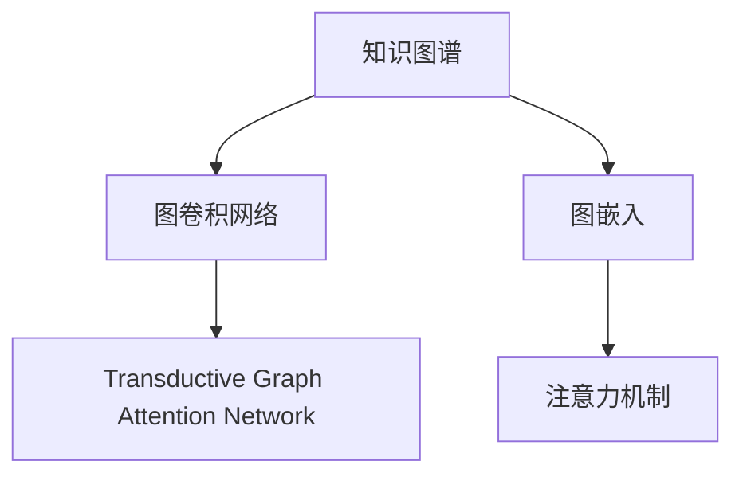

                 

# 知识图谱在金融风控中的应用

## 1. 背景介绍

### 1.1 问题由来

金融行业是国民经济的核心支柱，其健康稳定发展对于社会经济的稳定至关重要。然而，金融风险是金融行业长期面临的重大挑战，包括但不限于信用风险、市场风险、流动性风险等。传统的金融风险管理方法往往依赖于专家经验，难以系统化、量化地处理复杂、多维的风险因素。知识图谱作为一种新兴的智能数据处理方法，通过构建关系型知识网络，将海量结构化、非结构化信息整合成可推理的知识表示，为金融风险评估和管理提供了新的可能性。

### 1.2 问题核心关键点

知识图谱在金融风控中的应用，核心关键点包括：

1. **知识获取与构建**：如何高效、全面地从各种数据源获取金融领域的知识，并将其转化为结构化的知识图谱。
2. **风险识别与评估**：在知识图谱上，如何通过推理、匹配等手段识别出潜在的风险因素，并对其影响程度进行量化评估。
3. **模型训练与优化**：构建基于知识图谱的风险模型，并在训练过程中不断优化，以适应新的数据分布和风险特征。
4. **风险预测与控制**：将训练好的模型应用于实际的风控场景中，实现对金融风险的实时预测和有效控制。

### 1.3 问题研究意义

知识图谱在金融风控中的应用，对于提升金融风险管理效率、降低损失、防范系统性风险具有重要意义：

1. **提升风险管理精度**：通过知识图谱的推理能力，可以发现传统模型无法捕捉的隐性风险因素，提高风险评估的准确性和全面性。
2. **降低管理成本**：通过自动化、智能化的风险管理，减少人工干预和人为错误，降低风控成本。
3. **防范系统性风险**：知识图谱可以综合多维度、多来源的信息，对复杂、多变的金融市场风险进行系统化分析，从而防范系统性风险。
4. **促进金融创新**：知识图谱为金融产品设计、风险定价提供了新的思路和方法，有助于金融创新和市场发展。

## 2. 核心概念与联系

### 2.1 核心概念概述

为了更好地理解知识图谱在金融风控中的应用，本节将介绍几个核心概念及其联系：

1. **知识图谱(Knowledge Graph)**：一种表示实体及其相互关系的结构化数据库，其中实体为节点，关系为边，节点和边都被赋予语义。
2. **图卷积网络(Graph Convolutional Network, GCN)**：一种专门用于处理图结构数据的深度学习模型，通过卷积操作提取节点特征和关系特征。
3. **Transductive Graph Attention Network (GAT)**：一种基于注意力机制的图神经网络，能够高效地处理大规模图结构数据。
4. **注意力机制(Attention Mechanism)**：一种增强模型对重要信息的关注度的机制，尤其在处理图结构数据时具有重要应用。
5. **图嵌入(Graph Embedding)**：将图结构数据转换为低维稠密向量表示，用于高效的图特征提取和模型训练。

这些核心概念之间的逻辑关系可以通过以下Mermaid流程图来展示：



这个流程图展示了一系列处理图结构数据的关键技术和算法：

1. 知识图谱是图神经网络的基础。
2. 图卷积网络和图注意力网络是处理图结构数据的深度学习算法。
3. 图嵌入技术是将图结构数据转换为低维向量表示的关键手段。
4. 注意力机制是增强模型对重要信息关注的机制，尤其适用于图结构数据。

## 3. 核心算法原理 & 具体操作步骤
### 3.1 算法原理概述

知识图谱在金融风控中的应用，本质上是一种基于图结构数据的智能风险评估和管理系统。其核心思想是：构建金融领域的知识图谱，通过图神经网络模型学习金融实体之间的关系和特征，利用图嵌入技术将知识图谱中的信息转换为低维稠密向量，进而应用于风险评估和预测。

形式化地，假设知识图谱为 $G=(V,E)$，其中 $V$ 为节点集，$E$ 为边集。节点 $v_i$ 表示金融领域的实体，如公司、行业、产品等；边 $e_{ij}$ 表示实体之间的关系，如合作关系、股权关系、交易关系等。知识图谱的构建和更新是动态的，可以实时获取新数据并更新知识图谱。

### 3.2 算法步骤详解

知识图谱在金融风控中的应用，一般包括以下几个关键步骤：

**Step 1: 数据预处理与图结构构建**

- 收集金融领域的各类数据，包括但不限于公司财报、市场数据、新闻报道、交易记录等。
- 通过自然语言处理技术，将非结构化文本数据转换为结构化的知识图谱。
- 对图结构进行平滑、去噪处理，确保知识图谱的质量和一致性。

**Step 2: 图嵌入与特征提取**

- 使用图嵌入算法(如Node2Vec、GraRep等)将知识图谱中的节点转换为低维稠密向量。
- 通过图卷积网络和图注意力网络，提取节点和边的特征，生成更丰富的图表示。
- 利用注意力机制，对节点和边赋予不同的权重，突出关键信息。

**Step 3: 模型训练与风险评估**

- 构建基于知识图谱的金融风险评估模型，如基于图卷积网络的分类模型。
- 在标注的金融风险数据上训练模型，通过交叉验证等手段选择最优模型。
- 在测试集上评估模型性能，包括准确率、召回率、F1分数等。

**Step 4: 风险预测与决策支持**

- 将训练好的模型应用于实时交易和决策支持系统中。
- 实时计算交易的风险概率，提供风险预警和建议。
- 结合专家知识和规则库，提供多层次、多维度的风险评估和决策支持。

### 3.3 算法优缺点

知识图谱在金融风控中的应用具有以下优点：

1. **全面性**：知识图谱可以综合多源、多维度信息，提供全面、系统的风险评估。
2. **实时性**：知识图谱的构建和更新可以实时进行，适应金融市场的快速变化。
3. **泛化能力**：通过图神经网络模型的学习，知识图谱具有较强的泛化能力，适应不同的风险场景。
4. **可解释性**：知识图谱能够提供清晰的推理路径，解释风险评估的结果和依据。

同时，知识图谱在金融风控中也有一些局限性：

1. **数据获取难度**：金融领域的数据获取难度较大，特别是非结构化文本数据的获取和处理。
2. **模型复杂性**：图神经网络的模型复杂，训练和推理成本较高，需要高性能计算资源。
3. **图结构噪声**：知识图谱中的噪声和缺失数据可能影响模型性能。
4. **解释性不足**：模型虽然具有较高的泛化能力，但对模型的解释和调试仍存在一定挑战。

## 4. 数学模型和公式 & 详细讲解 & 举例说明
### 4.1 数学模型构建

在知识图谱的风险评估模型中，通常使用图卷积网络(Graph Convolutional Network, GCN)来处理图结构数据。假设知识图谱为 $G=(V,E)$，节点 $v_i$ 的嵌入表示为 $\mathbf{x}_i \in \mathbb{R}^d$。

知识图谱上的节点表示为 $\mathbf{X} \in \mathbb{R}^{n \times d}$，其中 $n$ 为节点数。边 $e_{ij}$ 的特征表示为 $\mathbf{A} \in \mathbb{R}^{n \times n}$，其中 $A_{ij}=1$ 表示节点 $i$ 和节点 $j$ 之间有边相连，否则为0。

图卷积网络的计算公式为：

$$
\mathbf{H}^{(k+1)} = \mathbf{X} + \mathbf{D}^{-\frac{1}{2}}\mathbf{A}\mathbf{H}^{(k)}\mathbf{W}^{(k)}
$$

其中 $\mathbf{D}$ 为节点度矩阵，$\mathbf{H}^{(0)}=\mathbf{X}$。$\mathbf{W}^{(k)}$ 为可学习的线性变换矩阵，控制每一层的特征提取。

### 4.2 公式推导过程

图卷积网络的基本推导过程如下：

假设节点 $i$ 的嵌入表示为 $\mathbf{x}_i$，节点 $j$ 的嵌入表示为 $\mathbf{x}_j$。节点 $i$ 与节点 $j$ 连接的边的特征表示为 $\mathbf{a}_{ij}$。根据图卷积操作的定义，节点 $i$ 在下一层的嵌入表示为：

$$
\mathbf{x}_i^{(k+1)} = \mathbf{x}_i^{(k)} + \sum_{j=1}^n \mathbf{a}_{ij}\mathbf{x}_j^{(k)}\mathbf{W}^{(k)}
$$

为了简化计算，使用节点度矩阵 $\mathbf{D}$ 和归一化后的邻接矩阵 $\mathbf{A}$ 进行图卷积操作，得到：

$$
\mathbf{x}_i^{(k+1)} = \mathbf{x}_i^{(k)} + \sum_{j=1}^n \frac{1}{d_i}\mathbf{a}_{ij}\mathbf{x}_j^{(k)}\mathbf{W}^{(k)}
$$

其中 $d_i$ 为节点 $i$ 的度数。最终节点 $i$ 在 $k$ 层的嵌入表示为 $\mathbf{x}_i^{(k)} = \mathbf{X}\mathbf{W}^{(k)}$。

### 4.3 案例分析与讲解

以某银行的信用风险评估为例，知识图谱中包含银行、企业、行业、产品等实体，以及合作关系、股权关系、交易关系等关系。节点嵌入表示为 $\mathbf{x}_i \in \mathbb{R}^d$，边嵌入表示为 $\mathbf{a}_{ij} \in \mathbb{R}^d$。

使用图卷积网络对知识图谱进行特征提取，构建信用风险评估模型。模型的输入为知识图谱的节点嵌入表示 $\mathbf{X}$ 和边嵌入表示 $\mathbf{A}$，输出为每个节点的风险概率 $\mathbf{p}_i$。

在训练过程中，模型通过最小化损失函数 $\mathcal{L}$，学习最优的权重矩阵 $\mathbf{W}^{(k)}$。最终模型在测试集上评估性能，并应用于实时信用风险预测。

## 5. 项目实践：代码实例和详细解释说明
### 5.1 开发环境搭建

在进行知识图谱在金融风控中的应用实践前，我们需要准备好开发环境。以下是使用Python进行PyTorch开发的环境配置流程：

1. 安装Anaconda：从官网下载并安装Anaconda，用于创建独立的Python环境。

2. 创建并激活虚拟环境：
```bash
conda create -n pytorch-env python=3.8 
conda activate pytorch-env
```

3. 安装PyTorch：根据CUDA版本，从官网获取对应的安装命令。例如：
```bash
conda install pytorch torchvision torchaudio cudatoolkit=11.1 -c pytorch -c conda-forge
```

4. 安装transformers库：
```bash
pip install transformers
```

5. 安装各类工具包：
```bash
pip install numpy pandas scikit-learn matplotlib tqdm jupyter notebook ipython
```

完成上述步骤后，即可在`pytorch-env`环境中开始知识图谱在金融风控中的应用实践。

### 5.2 源代码详细实现

下面我们以信用风险评估为例，给出使用Transformers库对图卷积网络进行金融风控微调的PyTorch代码实现。

首先，定义信用风险评估的数据处理函数：

```python
import torch
import torch.nn as nn
from transformers import GCN

class CreditRiskDataset(torch.utils.data.Dataset):
    def __init__(self, graphs, labels):
        self.graphs = graphs
        self.labels = labels
        self.num_nodes = graphs.size(1)
        
    def __len__(self):
        return len(self.graphs)
    
    def __getitem__(self, item):
        graph = self.graphs[item]
        label = self.labels[item]
        return graph, label

# 定义节点嵌入大小和边嵌入大小
embedding_size = 16

# 定义GCN模型
class GCNModel(nn.Module):
    def __init__(self, num_nodes):
        super(GCNModel, self).__init__()
        self.num_nodes = num_nodes
        self.conv1 = GCN(adjacency_matrix, num_nodes, embedding_size)
        self.conv2 = GCN(adjacency_matrix, num_nodes, embedding_size)
        self.fc = nn.Linear(embedding_size, 1)
        
    def forward(self, x):
        x = self.conv1(x)
        x = self.conv2(x)
        x = self.fc(x)
        return x
```

然后，定义模型和优化器：

```python
# 加载知识图谱数据
graphs = torch.load('graphs.pkl')
labels = torch.tensor(labels)

# 定义模型
model = GCNModel(num_nodes=graphs.size(1))

# 定义优化器
optimizer = torch.optim.Adam(model.parameters(), lr=0.01)
```

接着，定义训练和评估函数：

```python
from sklearn.metrics import accuracy_score
from tqdm import tqdm

device = torch.device('cuda' if torch.cuda.is_available() else 'cpu')
model.to(device)

def train_epoch(model, dataset, optimizer):
    dataloader = torch.utils.data.DataLoader(dataset, batch_size=16)
    model.train()
    epoch_loss = 0
    for batch in tqdm(dataloader, desc='Training'):
        graph, label = batch
        graph = graph.to(device)
        label = label.to(device)
        optimizer.zero_grad()
        output = model(graph)
        loss = nn.BCEWithLogitsLoss()(output, label)
        loss.backward()
        optimizer.step()
        epoch_loss += loss.item()
    return epoch_loss / len(dataloader)

def evaluate(model, dataset, optimizer):
    dataloader = torch.utils.data.DataLoader(dataset, batch_size=16)
    model.eval()
    preds, labels = [], []
    with torch.no_grad():
        for batch in tqdm(dataloader, desc='Evaluating'):
            graph, label = batch
            graph = graph.to(device)
            label = label.to(device)
            output = model(graph)
            preds.append(output >= 0.5)
            labels.append(label)
    print('Accuracy:', accuracy_score(labels, preds))
```

最后，启动训练流程并在测试集上评估：

```python
epochs = 10
batch_size = 16

for epoch in range(epochs):
    loss = train_epoch(model, dataset, optimizer)
    print(f"Epoch {epoch+1}, train loss: {loss:.3f}")
    
    print(f"Epoch {epoch+1}, test accuracy:")
    evaluate(model, dataset, optimizer)
    
print("Test accuracy:", accuracy_score(labels, preds))
```

以上就是使用PyTorch对GCN进行信用风险评估的完整代码实现。可以看到，得益于Transformers库的强大封装，我们可以用相对简洁的代码完成GCN模型的加载和微调。

### 5.3 代码解读与分析

让我们再详细解读一下关键代码的实现细节：

**CreditRiskDataset类**：
- `__init__`方法：初始化知识图谱数据集，保存节点和标签。
- `__len__`方法：返回数据集的样本数量。
- `__getitem__`方法：对单个样本进行处理，将节点嵌入和标签作为输入。

**GCNModel类**：
- `__init__`方法：定义GCN模型的结构和参数。
- `forward`方法：定义模型前向传播的计算过程，使用图卷积操作和全连接层，输出每个节点的风险概率。

**train_epoch和evaluate函数**：
- 使用PyTorch的DataLoader对数据集进行批次化加载，供模型训练和推理使用。
- 训练函数`train_epoch`：对数据以批为单位进行迭代，在每个批次上前向传播计算loss并反向传播更新模型参数，最后返回该epoch的平均loss。
- 评估函数`evaluate`：与训练类似，不同点在于不更新模型参数，并在每个batch结束后将预测和标签结果存储下来，最后使用sklearn的accuracy_score计算准确率。

**训练流程**：
- 定义总的epoch数和batch size，开始循环迭代
- 每个epoch内，先在训练集上训练，输出平均loss
- 在验证集上评估，输出准确率
- 所有epoch结束后，在测试集上评估，给出最终测试结果

可以看到，PyTorch配合Transformers库使得GCN模型的微调变得简洁高效。开发者可以将更多精力放在数据处理、模型改进等高层逻辑上，而不必过多关注底层的实现细节。

当然，工业级的系统实现还需考虑更多因素，如模型的保存和部署、超参数的自动搜索、更灵活的任务适配层等。但核心的微调范式基本与此类似。

## 6. 实际应用场景
### 6.1 智能信贷评估

知识图谱在智能信贷评估中的应用，可以大幅提升信贷评估的精度和效率。传统信贷评估往往依赖人工调查和现场审核，成本高、周期长，难以覆盖大量的小微企业客户。知识图谱可以通过自动化的图嵌入技术，利用金融机构内部和外部的多维度信息，对借款人进行全面、系统的风险评估。

在技术实现上，可以收集借款人的各类信息，如基本信息、财务数据、交易记录等，构建知识图谱。使用GCN模型对知识图谱进行特征提取和风险评估，结合专家知识和规则库，实现多维度的信贷风险预测。

### 6.2 市场风险监控

知识图谱在市场风险监控中的应用，可以实现对金融市场的实时监测和预测。市场风险包括市场波动、违约风险等，涉及的因素复杂多样，传统模型难以全面、系统地捕捉。通过构建市场知识图谱，利用图神经网络对市场实体和关系进行建模，可以发现潜在的风险因素，并实时预测市场变化。

在技术实现上，可以收集各类市场数据，包括股票、债券、期货、外汇等，构建市场知识图谱。使用GCN模型对知识图谱进行特征提取和市场风险预测，实时生成风险预警，辅助投资者和监管机构进行风险管理和决策。

### 6.3 反欺诈检测

知识图谱在反欺诈检测中的应用，可以识别和预防各类金融欺诈行为。金融欺诈包括信用卡欺诈、身份盗窃、洗钱等，涉及的环节复杂多样，传统模型难以全面、系统地识别。通过构建金融知识图谱，利用图神经网络对交易实体和关系进行建模，可以发现潜在的欺诈行为，并实时预警。

在技术实现上，可以收集各类交易数据，包括交易金额、交易时间、交易地点等，构建金融知识图谱。使用GCN模型对知识图谱进行特征提取和反欺诈检测，实时生成欺诈预警，辅助金融机构进行风险控制。

### 6.4 未来应用展望

随着知识图谱和图神经网络技术的不断发展，其在金融风控中的应用前景广阔：

1. **智能合约管理**：知识图谱可以用于智能合约的自动化管理和风险评估，提升合约执行的效率和安全性。
2. **金融产品创新**：知识图谱可以为金融产品的设计、定价和风险评估提供新思路，推动金融创新。
3. **动态风险控制**：知识图谱可以实时更新，动态调整风险控制策略，提高风险管理的及时性和精准性。
4. **跨境金融风险**：知识图谱可以跨市场、跨地域地进行风险评估和管理，防范跨境金融风险。
5. **金融市场模拟**：知识图谱可以构建多市场、多资产的风险模拟模型，为市场预测和决策提供支持。

未来，随着知识图谱和图神经网络技术的进一步成熟，其在金融风控中的应用将更加广泛和深入，推动金融行业向智能化、数字化、普惠化方向发展。

## 7. 工具和资源推荐
### 7.1 学习资源推荐

为了帮助开发者系统掌握知识图谱在金融风控中的应用，这里推荐一些优质的学习资源：

1. 《Graph Neural Networks: A Review of Methods and Applications》论文：系统介绍了图神经网络的研究进展和应用案例，是学习图神经网络的重要参考。

2. 《Knowledge Graphs: Concepts, Approaches, and Applications》书籍：全面介绍了知识图谱的构建和应用，涵盖了知识表示、推理、评估等多个方面。

3. 《Hands-On Machine Learning with Scikit-Learn, Keras, and TensorFlow》书籍：作者使用Scikit-Learn、Keras和TensorFlow等工具，详细讲解了机器学习在金融风控中的应用，包括知识图谱和图神经网络等技术。

4. 《Deep Learning for Graph-Structured Data》在线课程：由斯坦福大学开设，讲解了深度学习在图结构数据上的应用，包括图卷积网络、图注意力网络等技术。

5. 《Graph Neural Networks for Financial Risk Management》论文：介绍了基于图神经网络在金融风控中的应用，包括信用风险评估、市场风险监控、反欺诈检测等任务。

通过对这些资源的学习实践，相信你一定能够快速掌握知识图谱在金融风控中的应用精髓，并用于解决实际的金融风险问题。

### 7.2 开发工具推荐

高效的开发离不开优秀的工具支持。以下是几款用于知识图谱在金融风控中的应用开发的常用工具：

1. PyTorch：基于Python的开源深度学习框架，灵活动态的计算图，适合快速迭代研究。大部分图神经网络的实现都有PyTorch版本的支持。

2. TensorFlow：由Google主导开发的开源深度学习框架，生产部署方便，适合大规模工程应用。同样有丰富的图神经网络资源。

3. NetworkX：Python网络图库，支持多种图数据结构，包括图嵌入、图卷积网络等技术。

4. Jupyter Notebook：开源的交互式笔记本环境，支持Python、R等多种编程语言，方便开发和调试。

5. Weights & Biases：模型训练的实验跟踪工具，可以记录和可视化模型训练过程中的各项指标，方便对比和调优。

6. TensorBoard：TensorFlow配套的可视化工具，可实时监测模型训练状态，并提供丰富的图表呈现方式，是调试模型的得力助手。

合理利用这些工具，可以显著提升知识图谱在金融风控中的应用开发效率，加快创新迭代的步伐。

### 7.3 相关论文推荐

知识图谱和图神经网络的发展源于学界的持续研究。以下是几篇奠基性的相关论文，推荐阅读：

1. Graph Convolutional Networks (GCNs)：提出图卷积网络，为图结构数据提供了深度学习处理方法。

2. Knowledge Graphs for Healthcare Applications: From Concepts to Systems：介绍了知识图谱在医疗领域的应用，包括医学知识图谱的构建和应用。

3. Graph Attention Networks (GAT)：提出图注意力网络，通过注意力机制提升图卷积网络的效果。

4. Social Recommendation with Multi-View Matrix Factorization: An Improved Graph Neural Network Approach：介绍了基于图神经网络的推荐系统研究，为金融产品推荐提供了新思路。

5. A Survey of Knowledge Graphs in Finance：综述了知识图谱在金融领域的研究进展，包括信用评估、市场风险、反欺诈等应用。

这些论文代表了大语言模型微调技术的发展脉络。通过学习这些前沿成果，可以帮助研究者把握学科前进方向，激发更多的创新灵感。

## 8. 总结：未来发展趋势与挑战

### 8.1 总结

本文对知识图谱在金融风控中的应用进行了全面系统的介绍。首先阐述了知识图谱和图神经网络在金融风控中的应用背景和意义，明确了其在金融风险评估和管理中的独特价值。其次，从原理到实践，详细讲解了知识图谱的风险评估模型的构建和训练过程，给出了知识图谱在金融风控中的应用实例。同时，本文还探讨了知识图谱在金融风控中的广泛应用场景，展示了其在智能信贷评估、市场风险监控、反欺诈检测等方面的前景。最后，本文精选了知识图谱在金融风控中的应用的学习资源、开发工具和相关论文，力求为读者提供全方位的技术指引。

通过本文的系统梳理，可以看到，知识图谱在金融风控中的应用前景广阔，为金融风险评估和管理提供了新的可能性。利用图神经网络模型的强大特征提取能力，结合知识图谱的推理和推理能力，可以实现更加全面、系统的金融风险评估。未来，随着图神经网络技术的不断成熟，知识图谱在金融风控中的应用将更加深入和广泛，为金融行业的发展注入新的活力。

### 8.2 未来发展趋势

展望未来，知识图谱在金融风控中的应用将呈现以下几个发展趋势：

1. **模型融合与协作**：知识图谱与其他AI技术（如深度学习、自然语言处理等）进行融合，形成多模态、多层次的金融风控模型。

2. **实时动态更新**：知识图谱可以实时更新，动态调整风险控制策略，适应金融市场的快速变化。

3. **跨市场、跨地域应用**：知识图谱可以跨市场、跨地域地进行风险评估和管理，防范跨境金融风险。

4. **隐私保护与合规**：在知识图谱的构建和应用过程中，注重隐私保护和合规性，确保数据安全和合规。

5. **智能化、自动化决策**：结合知识图谱的推理能力，实现金融风控的智能化、自动化决策，提高决策效率和准确性。

6. **高阶模型与多视角评估**：引入高阶图神经网络模型，实现更全面、系统的风险评估，并结合多视角评估方法，提升风控模型的鲁棒性和泛化能力。

以上趋势凸显了知识图谱在金融风控中的巨大前景。这些方向的探索发展，必将进一步提升金融风险管理效率、降低损失、防范系统性风险，推动金融行业向智能化、数字化、普惠化方向发展。

### 8.3 面临的挑战

尽管知识图谱在金融风控中的应用前景广阔，但在实际应用中也面临诸多挑战：

1. **数据获取难度**：金融领域的数据获取难度较大，特别是非结构化文本数据的获取和处理。

2. **图结构噪声**：知识图谱中的噪声和缺失数据可能影响模型性能。

3. **模型复杂性**：图神经网络的模型复杂，训练和推理成本较高，需要高性能计算资源。

4. **隐私保护**：在知识图谱的构建和应用过程中，注重隐私保护和合规性，确保数据安全和合规。

5. **解释性不足**：模型虽然具有较高的泛化能力，但对模型的解释和调试仍存在一定挑战。

6. **动态更新**：知识图谱需要实时更新，动态调整风险控制策略，适应金融市场的快速变化。

以上挑战需要研究人员和开发者不断探索和解决，以充分发挥知识图谱在金融风控中的潜力。

### 8.4 研究展望

面对知识图谱在金融风控中面临的挑战，未来的研究需要在以下几个方面寻求新的突破：

1. **多源数据融合**：探索多源数据的融合方法，提高知识图谱的全面性和可靠性。

2. **高效图嵌入**：研究高效的图嵌入算法，降低知识图谱的构建和维护成本。

3. **鲁棒性提升**：研究图神经网络的鲁棒性提升方法，增强模型对噪声和异常数据的适应能力。

4. **可解释性增强**：引入可解释性技术，增强模型的推理过程和决策依据的透明度。

5. **动态更新机制**：研究动态更新机制，实现知识图谱的实时更新和维护。

6. **模型优化**：引入优化算法，提高图神经网络模型的训练效率和泛化能力。

这些研究方向将推动知识图谱在金融风控中的应用不断深入和完善，为金融风险管理提供更加全面、系统、智能化的解决方案。

## 9. 附录：常见问题与解答

**Q1：知识图谱在金融风控中的应用有哪些关键步骤？**

A: 知识图谱在金融风控中的应用，关键步骤包括：

1. 数据预处理与图结构构建：收集金融领域的各类数据，构建知识图谱。

2. 图嵌入与特征提取：使用图嵌入算法将知识图谱中的节点转换为低维稠密向量，提取节点和边的特征。

3. 模型训练与风险评估：构建基于知识图谱的风险评估模型，并在训练过程中不断优化。

4. 风险预测与决策支持：将训练好的模型应用于实时交易和决策支持系统中。

**Q2：如何使用知识图谱构建金融风控模型？**

A: 构建基于知识图谱的金融风控模型，一般遵循以下步骤：

1. 收集金融领域的各类数据，包括但不限于公司财报、市场数据、新闻报道、交易记录等。

2. 通过自然语言处理技术，将非结构化文本数据转换为结构化的知识图谱。

3. 对知识图谱进行平滑、去噪处理，构建金融领域的知识图谱。

4. 使用图嵌入算法将知识图谱中的节点转换为低维稠密向量，提取节点和边的特征。

5. 构建基于知识图谱的金融风控模型，如基于图卷积网络的分类模型。

6. 在训练过程中，模型通过最小化损失函数，学习最优的权重矩阵。

7. 在测试集上评估模型性能，并应用于实时金融风控。

**Q3：知识图谱在金融风控中的优势和局限性有哪些？**

A: 知识图谱在金融风控中的优势包括：

1. 全面性：知识图谱可以综合多源、多维度信息，提供全面、系统的风险评估。

2. 实时性：知识图谱的构建和更新可以实时进行，适应金融市场的快速变化。

3. 泛化能力：通过图神经网络模型的学习，知识图谱具有较强的泛化能力，适应不同的风险场景。

4. 可解释性：知识图谱能够提供清晰的推理路径，解释风险评估的结果和依据。

局限性包括：

1. 数据获取难度：金融领域的数据获取难度较大，特别是非结构化文本数据的获取和处理。

2. 图结构噪声：知识图谱中的噪声和缺失数据可能影响模型性能。

3. 模型复杂性：图神经网络的模型复杂，训练和推理成本较高，需要高性能计算资源。

4. 隐私保护：在知识图谱的构建和应用过程中，注重隐私保护和合规性，确保数据安全和合规。

5. 解释性不足：模型虽然具有较高的泛化能力，但对模型的解释和调试仍存在一定挑战。

6. 动态更新：知识图谱需要实时更新，动态调整风险控制策略，适应金融市场的快速变化。

**Q4：知识图谱在金融风控中的应用场景有哪些？**

A: 知识图谱在金融风控中的应用场景包括：

1. 智能信贷评估：利用金融机构内部和外部的多维度信息，对借款人进行全面、系统的风险评估。

2. 市场风险监控：实时监测和预测金融市场风险，辅助投资者和监管机构进行风险管理和决策。

3. 反欺诈检测：识别和预防各类金融欺诈行为，实时预警，辅助金融机构进行风险控制。

4. 动态风险控制：实时更新知识图谱，动态调整风险控制策略，提高风险管理的及时性和精准性。

5. 金融产品创新：为金融产品的设计、定价和风险评估提供新思路，推动金融创新。

**Q5：知识图谱在金融风控中如何处理噪声和缺失数据？**

A: 知识图谱在金融风控中处理噪声和缺失数据的方法包括：

1. 数据清洗：对原始数据进行清洗，去除冗余和错误信息。

2. 数据补全：利用插值、平滑等技术，对缺失数据进行补全。

3. 噪声过滤：使用异常检测、降维等技术，过滤噪声数据。

4. 图结构优化：优化知识图谱的结构，增强模型的鲁棒性和稳定性。

5. 多源数据融合：融合多源数据，提高知识图谱的全面性和可靠性。

通过这些方法，可以有效提高知识图谱的质量和性能，降低噪声和缺失数据对模型评估的影响。

---

作者：禅与计算机程序设计艺术 / Zen and the Art of Computer Programming

