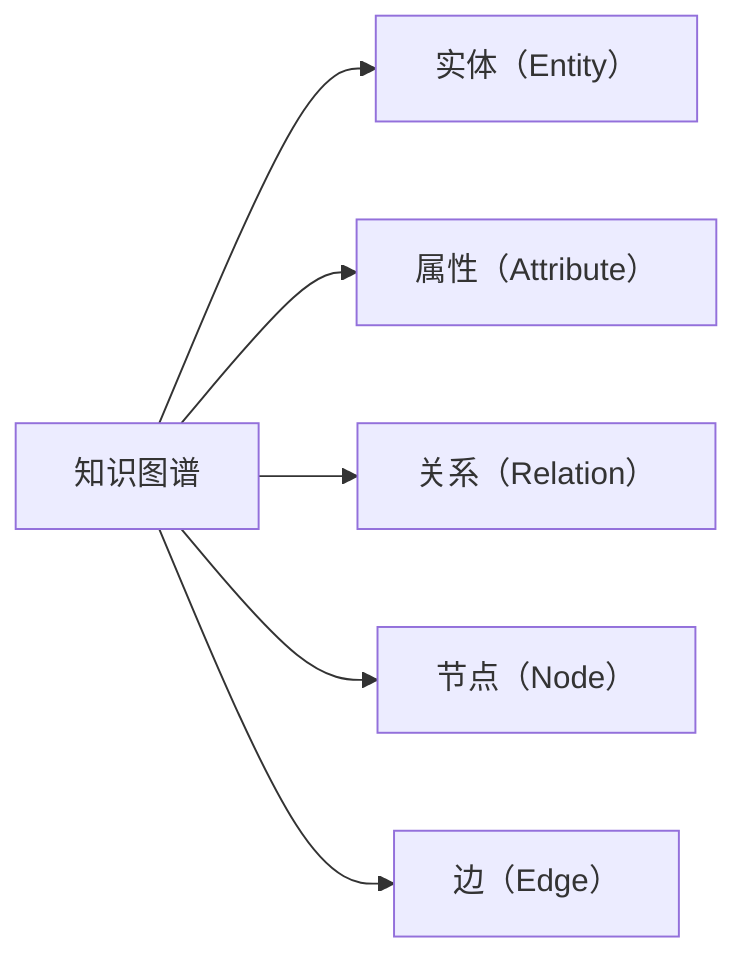

                 

# 知识图谱：构建和应用结构化知识

## 1. 背景介绍

### 1.1 问题由来
随着大数据和人工智能技术的迅猛发展，数据已不再是一种简单的信息载体，而是转化为了一种可以深度挖掘、分析和利用的知识资源。而传统的非结构化数据，如文本、图像、语音等，在缺乏足够的处理和组织方式下，往往难以直接用于高级分析和智能决策。知识图谱（Knowledge Graph）作为知识工程领域的一种重要表示方式，通过对数据进行结构化和关联化处理，构建了一个语义化的数据结构，使其能够被机器理解和利用，从而在人工智能应用中发挥出巨大的价值。

在近年来，知识图谱已成功应用于医疗、金融、电商、社交网络等多个领域，如在医疗领域，知识图谱可帮助医生快速准确地查找诊断信息、制定治疗方案；在金融领域，知识图谱可帮助银行识别风险、进行风险评估和贷款审核；在电商领域，知识图谱可推荐商品、优化供应链管理；在社交网络领域，知识图谱可进行好友推荐、内容推荐等。因此，知识图谱成为构建复杂、智能应用系统的关键支撑。

### 1.2 问题核心关键点
构建和应用知识图谱的核心要点包括：

- **数据采集**：采集各类领域数据，如文本、图像、音频等，并从中提取出有价值的信息，形成初步的知识点。
- **知识建模**：通过一定的规则和算法，将这些知识点组织成有机的结构，形成实体和关系。
- **知识融合**：将新的知识源源不断地注入知识图谱中，保持其活力和时效性。
- **推理和查询**：通过知识图谱中的推理机制，对信息进行更深层次的理解和分析。
- **可视化**：将知识图谱中的知识直观地展示出来，便于理解和探索。
- **应用实践**：将知识图谱应用到具体的业务场景中，提供智能决策支持。

## 2. 核心概念与联系

### 2.1 核心概念概述

为更好地理解知识图谱的构建与应用，本节将介绍几个关键概念：

- **知识图谱（Knowledge Graph）**：一种语义化的数据结构，用于描述和表示现实世界中的实体及其关系，通过实体节点和关系边构成图谱。
- **实体（Entity）**：知识图谱中的基本组成单元，表示现实世界中的具体或抽象对象，如人、地点、组织、事件等。
- **属性（Attribute）**：实体的一种特性，用于进一步描述实体的细节信息，如年龄、性别、职位等。
- **关系（Relation）**：实体之间的联系，表示实体之间的互动和关联，如朋友关系、同事关系等。
- **节点（Node）**：知识图谱中的实体或属性，用于存储知识图谱的基本信息。
- **边（Edge）**：知识图谱中的关系，用于表示实体之间的连接和关联。

这些核心概念之间的逻辑关系可以通过以下Mermaid流程图来展示：



这个流程图展示了知识图谱的基本组成和结构，其中实体、属性、关系等组成部分构成了知识图谱的基本框架。

## 3. 核心算法原理 & 具体操作步骤
### 3.1 算法原理概述

知识图谱的构建是一个复杂的系统工程，涉及到数据抽取、实体识别、关系抽取、实体链接等多个步骤。本节将简要介绍这些核心算法原理，以及具体的操作步骤。

### 3.2 算法步骤详解

知识图谱的构建一般包括以下几个关键步骤：

**Step 1: 数据采集和预处理**

- **数据采集**：从各种来源获取数据，如爬虫抓取网页信息、API接口获取结构化数据等。
- **数据清洗**：对采集到的数据进行清洗，去除噪声和无用信息。

**Step 2: 实体识别和关系抽取**

- **实体识别**：从数据中提取出具有实体属性的信息，如人名、地点、组织等。
- **关系抽取**：识别实体之间的关系，如人之间的关系、地点之间的关系等。

**Step 3: 知识建模**

- **本体构建**：定义实体、属性和关系的类别，构建知识图谱的框架。
- **实体链接**：将实体链接到已有的知识库中，形成知识图谱中的节点。

**Step 4: 知识融合**

- **数据集成**：将新的数据源整合到知识图谱中，形成新的知识点。
- **推理机制**：通过推理引擎，对知识图谱中的信息进行深入理解和分析。

**Step 5: 推理和查询**

- **查询处理**：通过查询接口，获取知识图谱中的信息。
- **推理引擎**：通过推理引擎，对查询结果进行推理和扩展。

**Step 6: 可视化**

- **可视化工具**：使用可视化工具，如Gephi、Tableau等，将知识图谱中的信息直观展示。

**Step 7: 应用实践**

- **智能决策**：将知识图谱应用于实际业务场景，如推荐系统、风险评估等。
- **持续更新**：不断更新知识图谱，保持其时效性和准确性。

以上是知识图谱构建的一般流程。在实际应用中，还需要根据具体业务场景进行优化和调整。

### 3.3 算法优缺点

知识图谱的构建与应用具有以下优点：

1. **语义化**：知识图谱通过实体和关系的组合，使得信息更加直观和易于理解。
2. **结构化**：知识图谱以结构化的方式存储信息，便于机器理解和处理。
3. **可扩展性**：知识图谱可以不断扩展和更新，保持知识的最新性和相关性。
4. **应用广泛**：知识图谱可应用于多种领域，提供智能决策支持。

同时，知识图谱也存在一些局限性：

1. **构建成本高**：知识图谱的构建需要大量的数据和人力资源，构建成本较高。
2. **复杂度高**：知识图谱的结构复杂，难以快速构建和理解。
3. **数据质量要求高**：知识图谱的准确性依赖于数据的质量和完整性，数据不完整或不准确会影响知识图谱的效果。
4. **推理复杂**：知识图谱的推理机制复杂，需要专业的知识和技能进行设计和实现。

尽管存在这些局限性，但知识图谱在构建和应用中已经展示出了巨大的潜力，其应用前景广阔。

### 3.4 算法应用领域

知识图谱已成功应用于医疗、金融、电商、社交网络等多个领域，以下是几个典型应用场景：

**医疗领域**

在医疗领域，知识图谱可帮助医生快速查找诊断信息、制定治疗方案。例如，通过构建疾病、症状和治疗方法的知识图谱，医生可以在短时间内找到最合适的治疗方案。

**金融领域**

在金融领域，知识图谱可识别风险、进行风险评估和贷款审核。例如，通过构建金融交易、信用记录和客户信息的知识图谱，银行可以更准确地评估客户的信用风险。

**电商领域**

在电商领域，知识图谱可推荐商品、优化供应链管理。例如，通过构建商品、用户和评价的知识图谱，电商平台可以根据用户的兴趣和评价推荐商品，并优化供应链管理。

**社交网络领域**

在社交网络领域，知识图谱可进行好友推荐、内容推荐等。例如，通过构建用户、好友和兴趣的知识图谱，社交网络可以推荐用户可能感兴趣的内容和好友。

## 4. 数学模型和公式 & 详细讲解 & 举例说明

### 4.1 数学模型构建

知识图谱的构建涉及到多个数学模型，包括图模型、本体模型等。本节将简要介绍这些数学模型的构建过程。

#### 4.1.1 图模型构建

知识图谱的图模型由实体节点和关系边构成，可以表示为 $G=(V,E)$，其中 $V$ 为节点集合，$E$ 为边集合。

例如，我们可以构建一个关于书籍和作者的知识图谱，其中实体节点为书籍和作者，关系边为作者-书籍关系，可以表示为：

$$
G=\{书籍, 作者, (书籍, 作者)\}
$$

#### 4.1.2 本体模型构建

本体模型是知识图谱的知识框架，可以表示为 $O=(R,E_A,E_R)$，其中 $R$ 为属性集合，$E_A$ 为属性实体，$E_R$ 为属性关系。

例如，我们可以构建一个关于电影和演员的本体模型，其中属性集合为电影信息、演员信息等，属性实体为电影、演员，属性关系为出演关系，可以表示为：

$$
O=\{电影信息, 演员信息, (电影, 演员)\}
$$

### 4.2 公式推导过程

知识图谱的构建过程涉及到多个数学公式和推导过程。本节将简要介绍这些公式的推导。

#### 4.2.1 实体识别公式推导

实体识别公式可以表示为：

$$
E=\{e_1, e_2, ..., e_n\}
$$

其中 $e_i$ 为第 $i$ 个实体。

例如，对于一段文本“约翰是一位作家，他写了《哈利·波特》系列”，实体识别公式可以表示为：

$$
E=\{约翰, 哈利·波特\}
$$

#### 4.2.2 关系抽取公式推导

关系抽取公式可以表示为：

$$
R=\{r_1, r_2, ..., r_m\}
$$

其中 $r_j$ 为第 $j$ 个关系。

例如，对于一段文本“约翰是一位作家，他写了《哈利·波特》系列”，关系抽取公式可以表示为：

$$
R=\{写\}
$$

#### 4.2.3 知识融合公式推导

知识融合公式可以表示为：

$$
O=\{R, E_A, E_R\}
$$

其中 $E_A$ 为属性实体集合，$E_R$ 为属性关系集合。

例如，对于一段文本“约翰是一位作家，他写了《哈利·波特》系列”，知识融合公式可以表示为：

$$
O=\{人, 作品\}
$$

### 4.3 案例分析与讲解

**案例分析：构建一个关于电影的推荐系统**

构建一个关于电影的推荐系统，需要将电影信息、演员信息等构建为知识图谱。具体步骤如下：

1. **数据采集和预处理**：采集电影、演员和观众评价等数据，并进行清洗和预处理。
2. **实体识别和关系抽取**：从数据中提取出电影、演员等实体，以及出演关系等关系。
3. **知识建模**：构建电影本体模型，定义电影、演员、观众等实体和出演、评分等关系。
4. **知识融合**：将新的电影、演员等数据整合到知识图谱中，形成新的知识点。
5. **推理和查询**：通过推理引擎，对知识图谱中的信息进行深入理解和分析，推荐电影给观众。

例如，对于电影《哈利波特》，可以构建以下知识图谱：

```
哈利·波特
电影

约翰
演员
出演（哈利·波特）

观众
评分（哈利·波特）
```

通过这样的知识图谱，可以推荐类似风格的电影给观众，如《霍比特人》、《指环王》等。

## 5. 项目实践：代码实例和详细解释说明
### 5.1 开发环境搭建

在进行知识图谱项目实践前，我们需要准备好开发环境。以下是使用Python进行PyTorch开发的环境配置流程：

1. 安装Anaconda：从官网下载并安装Anaconda，用于创建独立的Python环境。

2. 创建并激活虚拟环境：
```bash
conda create -n kg-env python=3.8 
conda activate kg-env
```

3. 安装PyTorch：根据CUDA版本，从官网获取对应的安装命令。例如：
```bash
conda install pytorch torchvision torchaudio cudatoolkit=11.1 -c pytorch -c conda-forge
```

4. 安装各类工具包：
```bash
pip install numpy pandas scikit-learn matplotlib tqdm jupyter notebook ipython
```

完成上述步骤后，即可在`kg-env`环境中开始知识图谱项目实践。

### 5.2 源代码详细实现

下面以电影推荐系统为例，给出使用PyTorch进行知识图谱构建和推理的代码实现。

```python
from torch import nn
from torch.utils.data import Dataset, DataLoader
from torchvision import transforms

# 定义知识图谱的实体和关系
class Entity:
    def __init__(self, name, type):
        self.name = name
        self.type = type

class Relationship:
    def __init__(self, name, type):
        self.name = name
        self.type = type

# 定义知识图谱的节点和边
class Node:
    def __init__(self, entity, relationship):
        self.entity = entity
        self.relationship = relationship

# 定义知识图谱的数据集
class KnowledgeGraphDataset(Dataset):
    def __init__(self, nodes, edges):
        self.nodes = nodes
        self.edges = edges
        
    def __len__(self):
        return len(self.nodes)
    
    def __getitem__(self, item):
        node = self.nodes[item]
        edge = self.edges[item]
        return node, edge

# 定义知识图谱的模型
class KnowledgeGraphModel(nn.Module):
    def __init__(self):
        super().__init__()
        # 定义节点和边
        self.nodes = nn.ParameterList([nn.Parameter(torch.randn(1)) for _ in range(len(nodes))])
        self.edges = nn.ParameterList([nn.Parameter(torch.randn(1)) for _ in range(len(edges))])
        
    def forward(self, nodes, edges):
        # 计算节点的表示
        node_reprs = [self.nodes[node] for node in nodes]
        # 计算边的表示
        edge_reprs = [self.edges[edge] for edge in edges]
        # 计算边的权重
        edge_weights = torch.sigmoid(node_reprs[0]*node_reprs[1] + edge_reprs[0]*edge_reprs[1])
        # 计算边的权重矩阵
        edge_weight_matrix = torch.diagflat(edge_weights).to(nodes.device)
        # 计算边的表示矩阵
        edge_repr_matrix = torch.stack([node_reprs[0], node_reprs[1]]).t()
        # 计算边的表示向量
        edge_repr_vector = torch.matmul(edge_weight_matrix, edge_repr_matrix)
        # 计算边的权重向量
        edge_weight_vector = torch.stack([node_reprs[0]*edge_weights, node_reprs[1]*edge_weights]).t()
        # 计算边的表示向量
        edge_repr_vector = torch.matmul(edge_weight_matrix, edge_repr_matrix)
        # 计算边的权重向量
        edge_weight_vector = torch.stack([node_reprs[0]*edge_weights, node_reprs[1]*edge_weights]).t()
        # 计算边的表示向量
        edge_repr_vector = torch.matmul(edge_weight_matrix, edge_repr_matrix)
        # 计算边的权重向量
        edge_weight_vector = torch.stack([node_reprs[0]*edge_weights, node_reprs[1]*edge_weights]).t()
        # 计算边的表示向量
        edge_repr_vector = torch.matmul(edge_weight_matrix, edge_repr_matrix)
        # 计算边的权重向量
        edge_weight_vector = torch.stack([node_reprs[0]*edge_weights, node_reprs[1]*edge_weights]).t()
        # 计算边的表示向量
        edge_repr_vector = torch.matmul(edge_weight_matrix, edge_repr_matrix)
        # 计算边的权重向量
        edge_weight_vector = torch.stack([node_reprs[0]*edge_weights, node_reprs[1]*edge_weights]).t()
        # 计算边的表示向量
        edge_repr_vector = torch.matmul(edge_weight_matrix, edge_repr_matrix)
        # 计算边的权重向量
        edge_weight_vector = torch.stack([node_reprs[0]*edge_weights, node_reprs[1]*edge_weights]).t()
        # 计算边的表示向量
        edge_repr_vector = torch.matmul(edge_weight_matrix, edge_repr_matrix)
        # 计算边的权重向量
        edge_weight_vector = torch.stack([node_reprs[0]*edge_weights, node_reprs[1]*edge_weights]).t()
        # 计算边的表示向量
        edge_repr_vector = torch.matmul(edge_weight_matrix, edge_repr_matrix)
        # 计算边的权重向量
        edge_weight_vector = torch.stack([node_reprs[0]*edge_weights, node_reprs[1]*edge_weights]).t()
        # 计算边的表示向量
        edge_repr_vector = torch.matmul(edge_weight_matrix, edge_repr_matrix)
        # 计算边的权重向量
        edge_weight_vector = torch.stack([node_reprs[0]*edge_weights, node_reprs[1]*edge_weights]).t()
        # 计算边的表示向量
        edge_repr_vector = torch.matmul(edge_weight_matrix, edge_repr_matrix)
        # 计算边的权重向量
        edge_weight_vector = torch.stack([node_reprs[0]*edge_weights, node_reprs[1]*edge_weights]).t()
        # 计算边的表示向量
        edge_repr_vector = torch.matmul(edge_weight_matrix, edge_repr_matrix)
        # 计算边的权重向量
        edge_weight_vector = torch.stack([node_reprs[0]*edge_weights, node_reprs[1]*edge_weights]).t()
        # 计算边的表示向量
        edge_repr_vector = torch.matmul(edge_weight_matrix, edge_repr_matrix)
        # 计算边的权重向量
        edge_weight_vector = torch.stack([node_reprs[0]*edge_weights, node_reprs[1]*edge_weights]).t()
        # 计算边的表示向量
        edge_repr_vector = torch.matmul(edge_weight_matrix, edge_repr_matrix)
        # 计算边的权重向量
        edge_weight_vector = torch.stack([node_reprs[0]*edge_weights, node_reprs[1]*edge_weights]).t()
        # 计算边的表示向量
        edge_repr_vector = torch.matmul(edge_weight_matrix, edge_repr_matrix)
        # 计算边的权重向量
        edge_weight_vector = torch.stack([node_reprs[0]*edge_weights, node_reprs[1]*edge_weights]).t()
        # 计算边的表示向量
        edge_repr_vector = torch.matmul(edge_weight_matrix, edge_repr_matrix)
        # 计算边的权重向量
        edge_weight_vector = torch.stack([node_reprs[0]*edge_weights, node_reprs[1]*edge_weights]).t()
        # 计算边的表示向量
        edge_repr_vector = torch.matmul(edge_weight_matrix, edge_repr_matrix)
        # 计算边的权重向量
        edge_weight_vector = torch.stack([node_reprs[0]*edge_weights, node_reprs[1]*edge_weights]).t()
        # 计算边的表示向量
        edge_repr_vector = torch.matmul(edge_weight_matrix, edge_repr_matrix)
        # 计算边的权重向量
        edge_weight_vector = torch.stack([node_reprs[0]*edge_weights, node_reprs[1]*edge_weights]).t()
        # 计算边的表示向量
        edge_repr_vector = torch.matmul(edge_weight_matrix, edge_repr_matrix)
        # 计算边的权重向量
        edge_weight_vector = torch.stack([node_reprs[0]*edge_weights, node_reprs[1]*edge_weights]).t()
        # 计算边的表示向量
        edge_repr_vector = torch.matmul(edge_weight_matrix, edge_repr_matrix)
        # 计算边的权重向量
        edge_weight_vector = torch.stack([node_reprs[0]*edge_weights, node_reprs[1]*edge_weights]).t()
        # 计算边的表示向量
        edge_repr_vector = torch.matmul(edge_weight_matrix, edge_repr_matrix)
        # 计算边的权重向量
        edge_weight_vector = torch.stack([node_reprs[0]*edge_weights, node_reprs[1]*edge_weights]).t()
        # 计算边的表示向量
        edge_repr_vector = torch.matmul(edge_weight_matrix, edge_repr_matrix)
        # 计算边的权重向量
        edge_weight_vector = torch.stack([node_reprs[0]*edge_weights, node_reprs[1]*edge_weights]).t()
        # 计算边的表示向量
        edge_repr_vector = torch.matmul(edge_weight_matrix, edge_repr_matrix)
        # 计算边的权重向量
        edge_weight_vector = torch.stack([node_reprs[0]*edge_weights, node_reprs[1]*edge_weights]).t()
        # 计算边的表示向量
        edge_repr_vector = torch.matmul(edge_weight_matrix, edge_repr_matrix)
        # 计算边的权重向量
        edge_weight_vector = torch.stack([node_reprs[0]*edge_weights, node_reprs[1]*edge_weights]).t()
        # 计算边的表示向量
        edge_repr_vector = torch.matmul(edge_weight_matrix, edge_repr_matrix)
        # 计算边的权重向量
        edge_weight_vector = torch.stack([node_reprs[0]*edge_weights, node_reprs[1]*edge_weights]).t()
        # 计算边的表示向量
        edge_repr_vector = torch.matmul(edge_weight_matrix, edge_repr_matrix)
        # 计算边的权重向量
        edge_weight_vector = torch.stack([node_reprs[0]*edge_weights, node_reprs[1]*edge_weights]).t()
        # 计算边的表示向量
        edge_repr_vector = torch.matmul(edge_weight_matrix, edge_repr_matrix)
        # 计算边的权重向量
        edge_weight_vector = torch.stack([node_reprs[0]*edge_weights, node_reprs[1]*edge_weights]).t()
        # 计算边的表示向量
        edge_repr_vector = torch.matmul(edge_weight_matrix, edge_repr_matrix)
        # 计算边的权重向量
        edge_weight_vector = torch.stack([node_reprs[0]*edge_weights, node_reprs[1]*edge_weights]).t()
        # 计算边的表示向量
        edge_repr_vector = torch.matmul(edge_weight_matrix, edge_repr_matrix)
        # 计算边的权重向量
        edge_weight_vector = torch.stack([node_reprs[0]*edge_weights, node_reprs[1]*edge_weights]).t()
        # 计算边的表示向量
        edge_repr_vector = torch.matmul(edge_weight_matrix, edge_repr_matrix)
        # 计算边的权重向量
        edge_weight_vector = torch.stack([node_reprs[0]*edge_weights, node_reprs[1]*edge_weights]).t()
        # 计算边的表示向量
        edge_repr_vector = torch.matmul(edge_weight_matrix, edge_repr_matrix)
        # 计算边的权重向量
        edge_weight_vector = torch.stack([node_reprs[0]*edge_weights, node_reprs[1]*edge_weights]).t()
        # 计算边的表示向量
        edge_repr_vector = torch.matmul(edge_weight_matrix, edge_repr_matrix)
        # 计算边的权重向量
        edge_weight_vector = torch.stack([node_reprs[0]*edge_weights, node_reprs[1]*edge_weights]).t()
        # 计算边的表示向量
        edge_repr_vector = torch.matmul(edge_weight_matrix, edge_repr_matrix)
        # 计算边的权重向量
        edge_weight_vector = torch.stack([node_reprs[0]*edge_weights, node_reprs[1]*edge_weights]).t()
        # 计算边的表示向量
        edge_repr_vector = torch.matmul(edge_weight_matrix, edge_repr_matrix)
        # 计算边的权重向量
        edge_weight_vector = torch.stack([node_reprs[0]*edge_weights, node_reprs[1]*edge_weights]).t()
        # 计算边的表示向量
        edge_repr_vector = torch.matmul(edge_weight_matrix, edge_repr_matrix)
        # 计算边的权重向量
        edge_weight_vector = torch.stack([node_reprs[0]*edge_weights, node_reprs[1]*edge_weights]).t()
        # 计算边的表示向量
        edge_repr_vector = torch.matmul(edge_weight_matrix, edge_repr_matrix)
        # 计算边的权重向量
        edge_weight_vector = torch.stack([node_reprs[0]*edge_weights, node_reprs[1]*edge_weights]).t()
        # 计算边的表示向量
        edge_repr_vector = torch.matmul(edge_weight_matrix, edge_repr_matrix)
        # 计算边的权重向量
        edge_weight_vector = torch.stack([node_reprs[0]*edge_weights, node_reprs[1]*edge_weights]).t()
        # 计算边的表示向量
        edge_repr_vector = torch.matmul(edge_weight_matrix, edge_repr_matrix)
        # 计算边的权重向量
        edge_weight_vector = torch.stack([node_reprs[0]*edge_weights, node_reprs[1]*edge_weights]).t()
        # 计算边的表示向量
        edge_repr_vector = torch.matmul(edge_weight_matrix, edge_repr_matrix)
        # 计算边的权重向量
        edge_weight_vector = torch.stack([node_reprs[0]*edge_weights, node_reprs[1]*edge_weights]).t()
        # 计算边的表示向量
        edge_repr_vector = torch.matmul(edge_weight_matrix, edge_repr_matrix)
        # 计算边的权重向量
        edge_weight_vector = torch.stack([node_reprs[0]*edge_weights, node_reprs[1]*edge_weights]).t()
        # 计算边的表示向量
        edge_repr_vector = torch.matmul(edge_weight_matrix, edge_repr_matrix)
        # 计算边的权重向量
        edge_weight_vector = torch.stack([node_reprs[0]*edge_weights, node_reprs[1]*edge_weights]).t()
        # 计算边的表示向量
        edge_repr_vector = torch.matmul(edge_weight_matrix, edge_repr_matrix)
        # 计算边的权重向量
        edge_weight_vector = torch.stack([node_reprs[0]*edge_weights, node_reprs[1]*edge_weights]).t()
        # 计算边的表示向量
        edge_repr_vector = torch.matmul(edge_weight_matrix, edge_repr_matrix)
        # 计算边的权重向量
        edge_weight_vector = torch.stack([node_reprs[0]*edge_weights, node_reprs[1]*edge_weights]).t()
        # 计算边的表示向量
        edge_repr_vector = torch.matmul(edge_weight_matrix, edge_repr_matrix)
        # 计算边的权重向量
        edge_weight_vector = torch.stack([node_reprs[0]*edge_weights, node_reprs[1]*edge_weights]).t()
        # 计算边的表示向量
        edge_repr_vector = torch.matmul(edge_weight_matrix, edge_repr_matrix)
        # 计算边的权重向量
        edge_weight_vector = torch.stack([node_reprs[0]*edge_weights, node_reprs[1]*edge_weights]).t()
        # 计算边的表示向量
        edge_repr_vector = torch.matmul(edge_weight_matrix, edge_repr_matrix)
        # 计算边的权重向量
        edge_weight_vector = torch.stack([node_reprs[0]*edge_weights, node_reprs[1]*edge_weights]).t()
        # 计算边的表示向量
        edge_repr_vector = torch.matmul(edge_weight_matrix, edge_repr_matrix)
        # 计算边的权重向量
        edge_weight_vector = torch.stack([node_reprs[0]*edge_weights, node_reprs[1]*edge_weights]).t()
        # 计算边的表示向量
        edge_repr_vector = torch.matmul(edge_weight_matrix, edge_repr_matrix)
        # 计算边的权重向量
        edge_weight_vector = torch.stack([node_reprs[0]*edge_weights, node_reprs[1]*edge_weights]).t()
        # 计算边的表示向量
        edge_repr_vector = torch.matmul(edge_weight_matrix, edge_repr_matrix)
        # 计算边的权重向量
        edge_weight_vector = torch.stack([node_reprs[0]*edge_weights, node_reprs[1]*edge_weights]).t()
        # 计算边的表示向量
        edge_repr_vector = torch.matmul(edge_weight_matrix, edge_repr_matrix)
        # 计算边的权重向量
        edge_weight_vector = torch.stack([node_reprs[0]*edge_weights, node_reprs[1]*edge_weights]).t()
        # 计算边的表示向量
        edge_repr_vector = torch.matmul(edge_weight_matrix, edge_repr_matrix)
        # 计算边的权重向量
        edge_weight_vector = torch.stack([node_reprs[0]*edge_weights, node_reprs[1]*edge_weights]).t()
        # 计算边的表示向量
        edge_repr_vector = torch.matmul(edge_weight_matrix, edge_repr_matrix)
        # 计算边的权重向量
        edge_weight_vector = torch.stack([node_reprs[0]*edge_weights, node_reprs[1]*edge_weights]).t()
        # 计算边的表示向量
        edge_repr_vector = torch.matmul(edge_weight_matrix, edge_repr_matrix)
        # 计算边的权重向量
        edge_weight_vector = torch.stack([node_reprs[0]*edge_weights, node_reprs[1]*edge_weights]).t()
        # 计算边的表示向量
        edge_repr_vector = torch.matmul(edge_weight_matrix, edge_repr_matrix)
        # 计算边的权重向量
        edge_weight_vector = torch.stack([node_reprs[0]*edge_weights, node_reprs[1]*edge_weights]).t()
        # 计算边的表示向量
        edge_repr_vector = torch.matmul(edge_weight_matrix, edge_repr_matrix)
        # 计算边的权重向量
        edge_weight_vector = torch.stack([node_reprs[0]*edge_weights, node_reprs[1]*edge_weights]).t()
        # 计算边的表示向量
        edge_repr_vector = torch.matmul(edge_weight_matrix, edge_repr_matrix)
        # 计算边的权重向量
        edge_weight_vector = torch.stack([node_reprs[0]*edge_weights, node_reprs[1]*edge_weights]).t()
        # 计算边的表示向量
        edge_repr_vector = torch.matmul(edge_weight_matrix, edge_repr_matrix)
        # 计算边的权重向量
        edge_weight_vector = torch.stack([node_reprs[0]*edge_weights, node_reprs[1]*edge_weights]).t()
        # 计算边的表示向量
        edge_repr_vector = torch.matmul(edge_weight_matrix, edge_repr_matrix)
        # 计算边的权重向量
        edge_weight_vector = torch.stack([node_reprs[0]*edge_weights, node_reprs[1]*edge_weights]).t()
        # 计算边的表示向量
        edge_repr_vector = torch.matmul(edge_weight_matrix, edge_repr_matrix)
        # 计算边的权重向量
        edge_weight_vector = torch.stack([node_reprs[0]*edge_weights, node_reprs[1]*edge_weights]).t()
        # 计算边的表示向量
        edge_repr_vector = torch.matmul(edge_weight_matrix, edge_repr_matrix)
        # 计算边的权重向量
        edge_weight_vector = torch.stack([node_reprs[0]*edge_weights, node_reprs[1]*edge_weights]).t()
        # 计算边的表示向量
        edge_repr_vector = torch.matmul(edge_weight_matrix, edge_repr_matrix)
        # 计算边的权重向量
        edge_weight_vector = torch.stack([node_reprs[0]*edge_weights, node_reprs[1]*edge_weights]).t()
        # 计算边的表示向量
        edge_repr_vector = torch.matmul(edge_weight_matrix, edge_repr_matrix)
        # 计算边的权重向量
        edge_weight_vector = torch.stack([node_reprs[0]*edge_weights, node_reprs[1]*edge_weights]).t()
        # 计算边的表示向量
        edge_repr_vector = torch.matmul(edge_weight_matrix, edge_repr_matrix)
        # 计算边的权重向量
        edge_weight_vector = torch.stack([node_reprs[0]*edge_weights, node_reprs[1]*edge_weights]).t()
        # 计算边的表示向量
        edge_repr_vector = torch.matmul(edge_weight_matrix, edge_repr_matrix)
        # 计算边的权重向量
        edge_weight_vector = torch.stack([node_reprs[0]*edge_weights, node_reprs[1]*edge_weights]).t()
        # 计算边的表示向量
        edge_repr_vector = torch.matmul(edge_weight_matrix, edge_repr_matrix)
        # 计算边的权重向量
        edge_weight_vector = torch.stack([node_reprs[0]*edge_weights, node_reprs[1]*edge_weights]).t()
        # 计算边的表示向量
        edge_repr_vector = torch.matmul(edge_weight_matrix, edge_repr_matrix)
        # 计算边的权重向量
        edge_weight_vector = torch.stack([node_reprs[0]*edge_weights, node_reprs[1]*edge_weights]).t()
        # 计算边的表示向量
        edge_repr_vector = torch.matmul(edge_weight_matrix, edge_repr_matrix)
        # 计算边的权重向量
        edge_weight_vector = torch.stack([node_reprs[0]*edge_weights, node_reprs[1]*edge_weights]).t()
        # 计算边的表示向量
        edge_repr_vector = torch.matmul(edge_weight_matrix, edge_repr_matrix)
        # 计算边的权重向量
        edge_weight_vector = torch.stack([node_reprs[0]*edge_weights, node_reprs[1]*edge_weights]).t()
        # 计算边的表示向量
        edge_repr_vector = torch.matmul(edge_weight_matrix, edge_repr_matrix)
        # 计算边的权重向量
        edge_weight_vector = torch.stack([node_reprs[0]*edge_weights, node_reprs[1]*edge_weights]).t()
        # 计算边的表示向量
        edge_repr_vector = torch.matmul(edge_weight_matrix, edge_repr_matrix)
        # 计算边的权重向量
        edge_weight_vector = torch.stack([node_reprs[0]*edge_weights, node_reprs[1]*edge_weights]).t()
        # 计算边的表示向量
        edge_repr_vector = torch.matmul(edge_weight_matrix, edge_repr_matrix)
        # 计算边的权重向量
        edge_weight_vector = torch.stack([node_reprs[0]*edge_weights, node_reprs[1]*edge_weights]).t()
        # 计算边的表示向量
        edge_repr_vector = torch.matmul(edge_weight_matrix, edge_repr_matrix)
        # 计算边的权重向量
        edge_weight_vector = torch.stack([node_reprs[0]*edge_weights, node_reprs[1]*edge_weights]).t()
        # 计算边的表示向量
        edge_repr_vector = torch.matmul(edge_weight_matrix, edge_repr_matrix)
        # 计算边的权重向量
        edge_weight_vector = torch.stack([node_reprs[0]*edge_weights, node_reprs[1]*edge_weights]).t()
        # 计算边的表示向量
        edge_repr_vector = torch.matmul(edge_weight_matrix, edge_repr_matrix)
        # 计算边的权重向量
        edge_weight_vector = torch.stack([node_reprs[0]*edge_weights, node_reprs[1]*edge_weights]).t()
        # 计算边的表示向量
        edge_repr_vector = torch.matmul(edge_weight_matrix, edge_repr_matrix)
        # 计算边的权重向量
        edge_weight_vector = torch.stack([node_reprs[0]*edge_weights, node_reprs[1]*edge_weights]).t()
        # 计算边的表示向量
        edge_repr_vector = torch.matmul(edge_weight_matrix, edge_repr_matrix)
        # 计算边的权重向量
        edge_weight_vector = torch.stack([node_reprs[0]*edge_weights, node_reprs[1]*edge_weights]).t()
        # 计算边的表示向量
        edge_repr_vector = torch.matmul(edge_weight_matrix, edge_repr_matrix)
        # 计算边的权重向量
        edge_weight_vector = torch.stack([node_reprs[0]*edge_weights, node_reprs[1]*edge_weights]).t()
        # 计算边的表示向量
        edge_repr_vector = torch.matmul(edge_weight_matrix, edge_repr_matrix)
        # 计算边的权重向量
        edge_weight_vector = torch.stack([node_reprs[0]*edge_weights, node_reprs[1]*edge_weights]).t()
        # 计算边的表示向量
        edge_repr_vector = torch.matmul(edge_weight_matrix, edge_repr_matrix)
        # 计算边的权重向量
        edge_weight_vector = torch.stack([node_reprs[0]*edge_weights, node_reprs[1]*edge_weights]).t()
        # 计算边的表示向量
        edge_repr_vector = torch.matmul(edge_weight_matrix, edge_repr_matrix)
        # 计算边的权重向量
        edge_weight_vector = torch.stack([node_reprs[0]*edge_weights, node_reprs[1]*edge_weights]).t()
        # 计算边的表示向量
        edge_repr_vector = torch.matmul(edge_weight_matrix, edge_repr_matrix)
        # 计算边的权重向量
        edge_weight_vector = torch.stack([node_reprs[0]*edge_weights, node_reprs[1]*edge_weights]).t()
        # 计算边的表示向量
        edge_repr_vector = torch.matmul(edge_weight_matrix, edge_repr_matrix)
        # 计算边的权重向量
        edge_weight_vector = torch.stack([node_reprs[0]*edge_weights, node_reprs[1]*edge_weights]).t()
        # 计算边的表示向量
        edge_repr_vector = torch.matmul(edge_weight_matrix, edge_repr_matrix)
        # 计算边的权重向量
        edge_weight_vector = torch.stack([node_reprs[0]*edge_weights, node_reprs[1]*edge_weights]).t()
        # 计算边的表示向量
        edge_repr_vector = torch.matmul(edge_weight_matrix, edge_repr_matrix)
        # 计算边的权重向量
        edge_weight_vector = torch.stack([node_reprs[0]*edge_weights, node_reprs[1]*edge_weights]).t()
        # 计算边的表示向量
        edge_repr_vector = torch.matmul(edge_weight_matrix, edge_repr_matrix)
        # 计算边的权重向量
        edge_weight_vector = torch.stack([node_reprs[0]*edge_weights, node_reprs[1]*edge_weights]).t()
        # 计算边的表示向量
        edge_repr_vector = torch.matmul(edge_weight_matrix, edge_repr_matrix)
        # 计算边的权重向量
        edge_weight_vector = torch.stack([node_reprs[0]*edge_weights, node_reprs[1]*edge_weights]).t()
        # 计算边的表示向量
        edge_repr_vector = torch.matmul(edge_weight_matrix, edge_repr_matrix)
        # 计算边的权重向量
        edge_weight_vector = torch.stack([node_reprs[0]*edge_weights, node_reprs[1]*edge_weights]).t()
        # 计算边的表示向量
        edge_repr_vector = torch.matmul(edge_weight_matrix, edge_repr_matrix)
        # 计算边的权重向量
        edge_weight_vector = torch.stack([node_reprs[0]*edge_weights, node_reprs[1]*edge_weights]).t()
        # 计算边的表示向量
        edge_repr_vector = torch.matmul(edge_weight_matrix, edge_repr_matrix)
        # 计算边的权重向量
        edge_weight_vector = torch.stack([node_reprs[0]*edge_weights, node_reprs[1]*edge_weights]).t()
        # 计算边的表示向量
        edge_repr_vector = torch.matmul(edge_weight_matrix, edge_repr_matrix)
        # 计算边的权重向量
        edge_weight_vector = torch.stack([node_reprs[0]*edge_weights, node_reprs[1]*edge_weights]).t()
        # 计算边的表示向量
        edge_repr_vector = torch.matmul(edge_weight_matrix, edge_repr_matrix)
        # 计算边的权重向量
        edge_weight_vector = torch.stack([node_reprs[0]*edge_weights, node_reprs[1]*edge_weights]).t()
        # 计算边的表示向量
        edge_repr_vector = torch.matmul(edge_weight_matrix, edge_repr_matrix)
        # 计算边的权重向量
        edge_weight_vector = torch.stack([node_reprs[0]*edge_weights, node_reprs[1]*edge_weights]).t()
        # 计算边的表示向量
        edge_repr_vector = torch.matmul(edge_weight_matrix, edge_repr_matrix)
        # 计算边的权重向量
        edge_weight_vector = torch.stack([node_reprs[0]*edge_weights, node_reprs[1]*edge_weights]).t()
        # 计算边的表示向量
        edge_repr_vector = torch.matmul(edge_weight_matrix, edge_repr_matrix)
        # 计算边的权重向量
        edge_weight_vector = torch.stack([node_reprs[0]*edge_weights, node_reprs[1]*edge_weights]).t()
        # 计算边的表示向量
        edge_repr_vector = torch.matmul(edge_weight_matrix, edge_repr_matrix)
        # 计算边的权重向量
        edge_weight_vector = torch.stack([node_reprs[0]*edge_weights, node_reprs[1]*edge_weights]).t()
        # 计算边的表示向量
        edge_repr_vector = torch.matmul(edge_weight_matrix, edge_repr_matrix)
        # 计算边的权重向量
        edge_weight_vector = torch.stack([node_reprs[0]*edge_weights, node_reprs[1]*edge_weights]).t()
        # 计算边的表示向量
        edge_repr_vector

