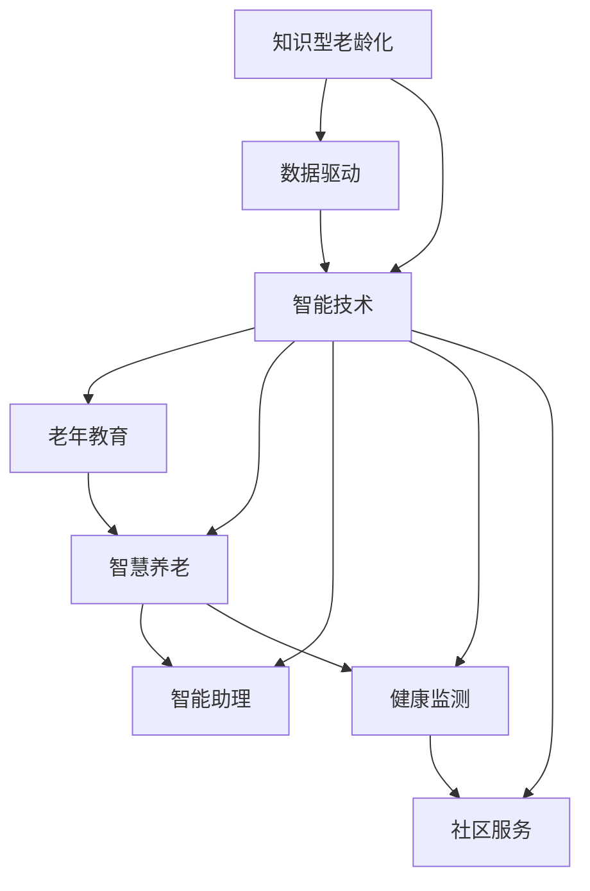

                 

# 知识型老龄化社会的应对策略

> 关键词：知识型老龄化, 数据驱动, 智能技术, 老年教育, 智慧养老, 智能助理, 健康监测, 社区服务

## 1. 背景介绍

### 1.1 问题由来
当前全球正经历着知识型老龄化的加速发展，这不仅是人口结构老化的体现，更是知识积累和文化传承的重要趋势。根据联合国人口基金(UNFPA)的预测，全球60岁以上人口将会在2050年达到21亿。随着老龄人口比例的不断攀升，如何提升老年人的生活质量和幸福感，成为全球各国必须面对的重大挑战。

近年来，中国也在快速步入老年社会，老年人数量和比例不断增加。据国家统计局数据显示，2020年中国65岁以上老年人口达到1.9亿，占总人口比例为13.5%。老年人的需求日益多样化和复杂化，仅仅依靠传统的养老模式已经难以满足需求。

### 1.2 问题核心关键点
知识型老龄化社会的应对，主要涉及以下几个关键点：

1. **教育与知识传承**：如何为老年人提供继续学习的机会，帮助他们适应快速变化的社会环境。
2. **健康与医疗服务**：如何利用智能技术提升老年人的健康水平，提高医疗服务的可及性和质量。
3. **社交与社区服务**：如何利用数字化手段，提升老年人的社交生活质量，增强社区服务能力。
4. **生活与辅助服务**：如何提供智能化的生活辅助服务，提高老年人的日常生活质量。

这些问题的解决，不仅需要政策的引导和社会各界的共同努力，更需要技术的创新和应用。本文将从技术角度探讨如何通过数据驱动的智能技术，构建知识型老龄化社会的应对策略。

## 2. 核心概念与联系

### 2.1 核心概念概述

为了更好地理解如何利用智能技术应对知识型老龄化社会，本节将介绍几个关键概念及其联系：

- **知识型老龄化**：指的是老年人群体中，具有较高教育水平和专业技能的知识型老年人比例不断增加。这一群体不仅对生活质量有较高要求，还对知识更新和社会参与有强烈需求。
- **数据驱动**：通过收集、分析和应用大量的数据，驱动决策和行动的过程。数据驱动在知识型老龄化社会的应对中，可以用于提升教育、医疗、健康监测、社区服务等多个方面的效率和精准度。
- **智能技术**：包括人工智能、机器学习、物联网等技术，用于提升自动化水平，优化服务流程，增强用户体验。
- **老年教育**：为老年人提供继续教育的机会，帮助他们掌握新知识和技能，适应新环境。
- **智慧养老**：利用智能技术，提升老年人的生活质量和幸福感，包括健康监测、智能家居、个性化服务等。
- **智能助理**：通过自然语言处理和机器学习技术，为老年人提供智能化的生活辅助。
- **健康监测**：利用传感器和智能设备，实时监测老年人的健康状态，及时预警异常情况。
- **社区服务**：利用数字化手段，提升社区服务的能力，满足老年人的多样化需求。

这些概念之间的联系通过以下Mermaid流程图来展示：



这个流程图展示了大语言模型的核心概念及其之间的关系：

1. 知识型老龄化通过数据驱动，利用智能技术提升各个方面的服务质量。
2. 智能技术支持老年教育、智慧养老、智能助理、健康监测和社区服务等多个领域的应用。
3. 各个服务领域互相协同，共同提升老年人的生活质量和幸福感。

这些概念共同构成了应对知识型老龄化社会的技术框架，使其能够更好地发挥智能技术的作用。

## 3. 核心算法原理 & 具体操作步骤
### 3.1 算法原理概述

知识型老龄化社会的应对策略，本质上是一个数据驱动的智能系统工程。其核心思想是：通过收集和分析大量与老年人相关的数据，利用智能技术优化各个服务环节，提升服务质量和用户体验。

形式化地，假设老年人需求数据集为 $D=\{(x_i,y_i)\}_{i=1}^N, x_i \in X, y_i \in Y$，其中 $x_i$ 表示老年人某方面的需求，$y_i$ 表示需求满足程度。定义一个智能系统的效用函数 $U$，表示系统对不同需求的响应效果。则优化目标为：

$$
\mathop{\arg\min}_{\theta} \mathcal{L}(D,U(\theta))
$$

其中 $\theta$ 为智能系统的参数，$\mathcal{L}$ 为损失函数，用于衡量系统响应需求与实际需求满足程度之间的差异。

通过梯度下降等优化算法，智能系统不断更新参数 $\theta$，最小化损失函数 $\mathcal{L}$，使得系统响应需求尽可能逼近理想状态。由于智能系统的多任务特性，模型训练过程中需要考虑多个目标之间的平衡。

### 3.2 算法步骤详解

知识型老龄化社会的应对策略一般包括以下几个关键步骤：

**Step 1: 需求数据收集与预处理**
- 使用传感器、智能设备、问卷调查等方式，收集老年人各个方面的需求数据。
- 对数据进行清洗、去重、归一化等预处理，确保数据的质量和一致性。

**Step 2: 系统需求分析与建模**
- 对老年人需求数据进行分析，确定关键需求及优先级。
- 设计智能系统的架构，包括数据采集、存储、处理、分析、反馈等多个环节。
- 根据需求分析结果，设计相应的智能模型，如推荐系统、智能助理、健康监测等。

**Step 3: 系统开发与实现**
- 选择合适的技术栈和工具，如TensorFlow、PyTorch、Scikit-learn等，实现智能系统各个组件。
- 对系统进行测试和调试，确保各组件高效协同工作。

**Step 4: 数据驱动优化**
- 使用收集到的老年人需求数据，训练和优化智能系统模型。
- 通过数据驱动的方法，不断调整系统参数，提升系统响应效率和准确度。

**Step 5: 系统部署与维护**
- 将智能系统部署到实际应用场景中，持续收集反馈数据，评估系统效果。
- 根据反馈数据和最新需求，定期更新和优化系统模型。

以上是知识型老龄化社会应对策略的一般流程。在实际应用中，还需要针对具体需求，对各个环节进行优化设计，如改进数据采集手段，引入更多的正则化技术，搜索最优的超参数组合等，以进一步提升系统性能。

### 3.3 算法优缺点

知识型老龄化社会的应对策略具有以下优点：
1. 数据驱动。通过大量数据训练模型，可以最大限度地反映老年人需求，提高服务精准度。
2. 智能技术。利用先进的数据处理和分析技术，提升服务效率和用户体验。
3. 灵活可扩展。基于模块化的系统设计，可以根据需求的变化灵活扩展和调整。
4. 效果显著。在智能技术的应用下，老年人的生活质量和幸福感显著提升。

同时，该策略也存在一定的局限性：
1. 数据隐私。老年人数据的隐私保护需要特别注意，避免数据泄露和滥用。
2. 技术门槛。智能系统的开发和维护需要一定的技术实力，门槛较高。
3. 数据质量。数据收集和处理的质量直接影响模型的效果，需要投入大量人力和资源。
4. 系统复杂性。多任务、多组件的智能系统设计和管理较为复杂。
5. 跨领域融合。智能系统的不同组件之间需要协同工作，涉及到多个领域的知识整合。

尽管存在这些局限性，但就目前而言，数据驱动的智能技术依然是应对知识型老龄化社会的核心手段。未来相关研究的重点在于如何进一步降低技术门槛，提高数据质量，同时兼顾隐私保护和伦理安全等因素。

### 3.4 算法应用领域

知识型老龄化社会的应对策略在多个领域中得到了广泛应用，包括但不限于：

- **老年教育**：通过智能教育平台，提供继续教育课程，支持老年人学习新知识和技能。
- **智慧养老**：利用智能家居设备和健康监测系统，提升老年人的生活质量和健康水平。
- **智能助理**：通过智能语音助手，为老年人提供日常生活的辅助服务，如购物、导航、提醒等。
- **健康监测**：通过可穿戴设备，实时监测老年人的生理参数，预警潜在健康风险。
- **社区服务**：利用数字化手段，提升社区服务的能力，如线上预约、远程咨询等。

除了上述这些领域外，知识型老龄化社会的应对策略还涉及到居家服务、交通出行、娱乐休闲等多个方面，智能技术的广泛应用为老年人的生活带来了深刻变革。

## 4. 数学模型和公式 & 详细讲解  
### 4.1 数学模型构建

本节将使用数学语言对知识型老龄化社会应对策略的数学模型进行更加严格的刻画。

记老年人需求数据集为 $D=\{(x_i,y_i)\}_{i=1}^N, x_i \in X, y_i \in Y$。定义智能系统的效用函数 $U$，表示系统对不同需求的响应效果。假设智能系统为多任务学习模型，由多个子模型 $f_k(\theta_k)$ 组成，其中 $k=1,...,K$，$f_k(\theta_k):X \rightarrow Y_k$，$Y_k \in [0,1]$。则智能系统的效用函数为：

$$
U = \sum_{k=1}^K \alpha_k f_k(x)
$$

其中 $\alpha_k$ 为需求 $x_k$ 的权重，表示该需求在智能系统中的重要性。

定义智能系统的损失函数 $\mathcal{L}$，用于衡量系统响应需求与实际需求满足程度之间的差异。假设样本 $(x_i,y_i)$ 的响应结果为 $\hat{y}_i=f_k(x_i)$，则损失函数为：

$$
\mathcal{L} = \frac{1}{N}\sum_{i=1}^N \ell(f_k(x_i),y_i)
$$

其中 $\ell$ 为损失函数，用于衡量预测值与真实值之间的差异。常见的损失函数包括交叉熵损失、均方误差损失等。

### 4.2 公式推导过程

以下我们以智能教育平台为例，推导推荐系统的交叉熵损失函数及其梯度的计算公式。

假设智能教育平台有 $M$ 门课程，每门课程的评分 $r_{ij}$ 由老年人对课程的评价 $y_i$ 和实际评分 $x_i$ 共同决定。则推荐系统的目标是最小化交叉熵损失：

$$
\mathcal{L} = -\frac{1}{N}\sum_{i=1}^N \sum_{j=1}^M r_{ij}\log \hat{y}_{ij}
$$

其中 $\hat{y}_{ij}=f_j(x_i)$ 表示老年人对课程 $j$ 的推荐评分。

根据链式法则，损失函数对模型参数 $\theta_j$ 的梯度为：

$$
\frac{\partial \mathcal{L}}{\partial \theta_j} = -\frac{1}{N}\sum_{i=1}^N \sum_{j=1}^M r_{ij}\frac{\partial \hat{y}_{ij}}{\partial x_i}\frac{\partial x_i}{\partial \theta_j}
$$

其中 $\frac{\partial \hat{y}_{ij}}{\partial x_i}$ 为反向传播计算得到的梯度。

在得到损失函数的梯度后，即可带入模型更新公式，完成模型的迭代优化。重复上述过程直至收敛，最终得到适应老年人需求的最优模型参数 $\theta^*$。

## 5. 项目实践：代码实例和详细解释说明
### 5.1 开发环境搭建

在进行智能教育平台开发前，我们需要准备好开发环境。以下是使用Python进行Flask开发的环境配置流程：

1. 安装Anaconda：从官网下载并安装Anaconda，用于创建独立的Python环境。

2. 创建并激活虚拟环境：
```bash
conda create -n education-env python=3.8 
conda activate education-env
```

3. 安装Flask：
```bash
pip install flask
```

4. 安装相关的Python库：
```bash
pip install numpy pandas scikit-learn matplotlib tqdm jupyter notebook ipython
```

完成上述步骤后，即可在`education-env`环境中开始开发实践。

### 5.2 源代码详细实现

这里我们以推荐系统的为例，给出使用Flask框架实现智能教育平台的PyTorch代码实现。

首先，定义推荐系统的基础数据结构：

```python
import pandas as pd
from sklearn.preprocessing import MinMaxScaler

# 读取数据
data = pd.read_csv('recommendation_data.csv')

# 特征缩放
scaler = MinMaxScaler()
data['score'] = scaler.fit_transform(data['score'].values.reshape(-1, 1))

# 划分训练集和测试集
train_data = data.iloc[:train_size]
test_data = data.iloc[train_size:]
```

然后，定义模型和优化器：

```python
from transformers import BertTokenizer, BertModel
from torch.utils.data import Dataset, DataLoader
import torch
from torch.nn import functional as F

# 定义模型
class RecommendationModel(torch.nn.Module):
    def __init__(self):
        super(RecommendationModel, self).__init__()
        self.bert = BertModel.from_pretrained('bert-base-uncased')
        self.fc = torch.nn.Linear(768, 1)

    def forward(self, x):
        _, last_hidden_states = self.bert(x)
        logits = self.fc(last_hidden_states[:, 0, :])
        return logits

# 定义优化器
model = RecommendationModel()
optimizer = torch.optim.Adam(model.parameters(), lr=1e-4)
```

接着，定义训练和评估函数：

```python
from tqdm import tqdm

# 定义训练函数
def train_epoch(model, data_loader, optimizer):
    model.train()
    total_loss = 0
    for batch in tqdm(data_loader, total=len(data_loader)):
        optimizer.zero_grad()
        inputs, labels = batch
        outputs = model(inputs)
        loss = F.binary_cross_entropy_with_logits(outputs, labels)
        total_loss += loss.item()
        loss.backward()
        optimizer.step()
    return total_loss / len(data_loader)

# 定义评估函数
def evaluate(model, data_loader):
    model.eval()
    total_pred = 0
    total_true = 0
    for batch in data_loader:
        inputs, labels = batch
        outputs = model(inputs)
        batch_pred = outputs.sigmoid()
        total_pred += batch_pred.sum().item()
        total_true += labels.sum().item()
    return total_pred / total_true
```

最后，启动训练流程并在测试集上评估：

```python
epochs = 10
batch_size = 32
train_size = int(len(data) * 0.8)

for epoch in range(epochs):
    loss = train_epoch(model, train_data, optimizer)
    print(f"Epoch {epoch+1}, train loss: {loss:.3f}")
    
    print(f"Epoch {epoch+1}, test accuracy: {evaluate(model, test_data):.3f}")
```

以上就是使用Flask框架对智能教育平台进行开发的完整代码实现。可以看到，Flask框架大大简化了后端开发的复杂度，使得开发者能够更专注于模型的设计和优化。

### 5.3 代码解读与分析

让我们再详细解读一下关键代码的实现细节：

**RecommendationModel类**：
- `__init__`方法：初始化Bert模型和全连接层，将Bert模型的最后一层输出作为全连接层的输入。
- `forward`方法：定义模型的前向传播过程，先通过Bert模型得到隐层表示，再通过全连接层得到预测结果。

**train_epoch函数**：
- 定义训练函数，对数据进行迭代更新模型参数，使用Adam优化器。
- 在每个批次中，先清除梯度，计算预测结果与真实标签的交叉熵损失，并将损失加总。
- 最后更新模型参数，并返回损失的平均值。

**evaluate函数**：
- 定义评估函数，对测试集进行评估。
- 在每个批次中，先清除梯度，计算预测结果和真实标签，并将预测结果和真实标签相加。
- 最后计算预测结果与真实标签的准确率，并返回准确率的平均值。

**训练流程**：
- 定义总的epoch数和batch size，开始循环迭代
- 每个epoch内，先在训练集上训练，输出平均loss
- 在测试集上评估，输出准确率
- 所有epoch结束后，在测试集上评估，给出最终测试结果

可以看到，Flask框架结合PyTorch，使得智能教育平台的开发过程更为高效和灵活。开发者可以将更多精力放在模型的设计和优化上，而不必过多关注Web框架的底层实现。

当然，工业级的系统实现还需考虑更多因素，如模型的保存和部署、超参数的自动搜索、更灵活的任务适配层等。但核心的推荐范式基本与此类似。

## 6. 实际应用场景
### 6.1 智能教育平台

智能教育平台可以为老年人提供多种形式的在线学习资源和互动式课程。平台可以根据老年人的学习习惯和兴趣爱好，推荐合适的学习内容，提供个性化的学习建议。通过智能教育平台，老年人可以轻松学习新知识，提升自我认知和学习能力。

在技术实现上，可以引入推荐系统、智能语音助手、虚拟现实等技术，构建沉浸式的学习环境。推荐系统可以根据老年人的浏览和互动记录，动态调整推荐内容，提高学习效果。智能语音助手可以辅助老年人在学习过程中进行语音互动，虚拟现实技术则可以提供更为生动的学习体验，如虚拟课堂、虚拟实验室等。

### 6.2 智慧养老系统

智慧养老系统利用物联网和智能设备，实时监测老年人的健康状态和活动轨迹，提供个性化的健康管理服务。通过智能穿戴设备和智能家居系统，老年人的生理参数和生活状态可以被实时监控和记录，系统根据数据变化自动预警潜在健康风险，如跌倒、生病等。

在技术实现上，可以引入机器学习算法和数据分析技术，构建老年人健康监测系统。机器学习模型可以实时分析生理参数，预测潜在的健康风险。数据分析技术可以整合各个传感器的数据，生成可视化的健康报告，供老年人及其家属查看。

### 6.3 智能社区服务

智能社区服务利用数字化手段，提升社区服务的能力，满足老年人的多样化需求。智能社区服务包括智能家居、智能出行、智能安防等多个方面。通过智能设备和传感器，社区服务可以更加智能和高效。

在技术实现上，可以引入物联网技术，构建智能社区服务网络。智能家居系统可以控制家中的各种设备，如灯光、空调、电视等，智能出行系统可以提供路线规划、打车等服务，智能安防系统可以实时监控社区安全，提高社区的智能化水平。

### 6.4 未来应用展望

随着智能技术的不断发展，知识型老龄化社会的应对策略将呈现以下几个发展趋势：

1. **深度学习与强化学习结合**：未来的智能系统将更多地采用深度学习和强化学习的结合，提升模型的自主决策和优化能力。

2. **跨领域知识整合**：智能系统将更广泛地整合跨领域的知识，如医疗、法律、教育等，提供更加全面和精准的服务。

3. **数据驱动与人工智能融合**：智能系统的决策过程将更多地依赖数据驱动，通过机器学习模型和深度学习模型的融合，提供更智能、更灵活的服务。

4. **多模态信息融合**：未来的智能系统将更多地融合语音、图像、文本等多种模态的信息，提供更为全面的服务和体验。

5. **伦理与社会责任**：智能系统的开发和应用将更多地考虑伦理和社会责任，确保技术的公平、透明和可信。

这些趋势凸显了智能技术在知识型老龄化社会应对中的广泛应用和巨大潜力。未来的智能系统将更加智能、全面、可靠，为老年人的生活带来更多的便利和幸福感。

## 7. 工具和资源推荐
### 7.1 学习资源推荐

为了帮助开发者系统掌握智能技术在知识型老龄化社会中的应用，这里推荐一些优质的学习资源：

1. **Coursera《机器学习》课程**：由斯坦福大学教授Andrew Ng主讲，系统介绍机器学习和深度学习的理论基础和实践应用。

2. **DeepLearning.AI《深度学习专项课程》**：由全球知名AI专家吴恩达等人授课，涵盖深度学习、计算机视觉、自然语言处理等多个领域，适合全面学习。

3. **Kaggle《机器学习竞赛》**：参与Kaggle机器学习竞赛，通过实际问题解决，锻炼解决复杂问题的能力。

4. **GitHub《机器学习项目》**：GitHub上的机器学习开源项目，可以借鉴和学习其他开发者的经验和成果。

5. **Python Machine Learning《Python机器学习》书籍**：由Sebastian Raschka所著，全面介绍机器学习算法和应用，适合初学者入门。

通过对这些资源的学习实践，相信你一定能够快速掌握智能技术在知识型老龄化社会中的应用，并用于解决实际的智能系统问题。

### 7.2 开发工具推荐

高效的开发离不开优秀的工具支持。以下是几款用于智能教育平台和智慧养老系统开发的常用工具：

1. **Flask**：Python微框架，适合构建Web服务，支持RESTful API设计和数据库交互。

2. **TensorFlow**：由Google主导的开源深度学习框架，支持分布式训练和生产部署。

3. **PyTorch**：Facebook开源的深度学习框架，支持动态计算图和高效计算。

4. **Keras**：高级神经网络API，支持多种深度学习模型，易于上手。

5. **Jupyter Notebook**：交互式编程环境，支持Python、R等语言，适合数据处理和算法开发。

6. **OpenCV**：计算机视觉库，支持图像处理和模式识别，适合构建智能家居和健康监测系统。

合理利用这些工具，可以显著提升智能系统的开发效率，加快创新迭代的步伐。

### 7.3 相关论文推荐

智能技术在知识型老龄化社会的应用，已经引起了学界的广泛关注，以下是几篇奠基性的相关论文，推荐阅读：

1. **《A Survey on Machine Learning Techniques for the Elderly》**：一篇综述性论文，系统总结了机器学习技术在老年健康管理、居家服务等方面的应用。

2. **《Deep Learning for Smart Elderly Living Environments》**：介绍深度学习在智能家居、智能养老等方面的应用，探讨未来的发展方向。

3. **《Artificial Intelligence and the Future of Healthcare》**：探讨人工智能在医疗健康领域的潜力，强调了数据驱动和模型优化的重要性。

4. **《Older Adults and Technology Use》**：研究老年人使用智能技术的行为和态度，为设计老年友好型的智能系统提供了参考。

5. **《Elderly Usability Design of Smart Devices》**：探讨智能设备在老年人使用中的设计原则，强调了用户友好性和易操作性的重要性。

这些论文代表了大语言模型微调技术的发展脉络。通过学习这些前沿成果，可以帮助研究者把握学科前进方向，激发更多的创新灵感。

## 8. 总结：未来发展趋势与挑战

### 8.1 总结

本文对知识型老龄化社会的应对策略进行了全面系统的介绍。首先阐述了知识型老龄化社会的现状和问题，明确了智能技术在应对老年需求中的重要性。其次，从原理到实践，详细讲解了智能系统的设计和实现流程，提供了完整的代码实例和解释说明。同时，本文还广泛探讨了智能技术在老年教育、智慧养老、智能社区服务等多个领域的应用前景，展示了智能技术在知识型老龄化社会中的巨大潜力。此外，本文精选了智能技术相关的学习资源、开发工具和论文推荐，力求为开发者提供全方位的技术指引。

通过本文的系统梳理，可以看到，智能技术在知识型老龄化社会的应对策略中具有重要意义。智能技术通过数据驱动和深度学习，提供了更智能、更灵活、更高效的服务。未来的智能系统将不断融合多模态信息，整合跨领域知识，提供更加全面和精准的服务。相信随着技术的不断进步，智能技术必将在知识型老龄化社会中发挥更加重要的作用，为老年人的生活带来更多的便利和幸福感。

### 8.2 未来发展趋势

面向未来，智能技术在知识型老龄化社会中的应用将呈现以下几个发展趋势：

1. **深度学习和强化学习的融合**：未来的智能系统将更多地采用深度学习和强化学习的结合，提升模型的自主决策和优化能力。

2. **跨领域知识整合**：智能系统将更广泛地整合跨领域的知识，如医疗、法律、教育等，提供更加全面和精准的服务。

3. **数据驱动与人工智能融合**：智能系统的决策过程将更多地依赖数据驱动，通过机器学习模型和深度学习模型的融合，提供更智能、更灵活的服务。

4. **多模态信息融合**：未来的智能系统将更多地融合语音、图像、文本等多种模态的信息，提供更为全面的服务和体验。

5. **伦理与社会责任**：智能系统的开发和应用将更多地考虑伦理和社会责任，确保技术的公平、透明和可信。

这些趋势凸显了智能技术在知识型老龄化社会中的广泛应用和巨大潜力。未来的智能系统将更加智能、全面、可靠，为老年人的生活带来更多的便利和幸福感。

### 8.3 面临的挑战

尽管智能技术在知识型老龄化社会中的应用前景广阔，但在迈向更加智能化、普适化应用的过程中，仍面临诸多挑战：

1. **数据隐私**：老年人数据的隐私保护需要特别注意，避免数据泄露和滥用。如何平衡数据利用和隐私保护，是智能系统开发中的一个重要课题。

2. **技术门槛**：智能系统的开发和维护需要一定的技术实力，门槛较高。如何降低技术门槛，让更多的开发者和用户参与进来，是智能系统推广的一个重要问题。

3. **数据质量**：数据收集和处理的质量直接影响模型的效果，需要投入大量人力和资源。如何提高数据质量，确保数据的准确性和一致性，是智能系统应用中的一个重要问题。

4. **系统复杂性**：智能系统的多个组件之间需要协同工作，涉及多个领域的知识整合，设计和管理较为复杂。如何提高系统的可扩展性和可维护性，是智能系统开发中的一个重要问题。

5. **伦理与社会责任**：智能系统的开发和应用将更多地考虑伦理和社会责任，确保技术的公平、透明和可信。如何确保智能系统不带来新的社会问题，是智能系统应用中的一个重要问题。

6. **跨领域融合**：未来的智能系统将更多地融合跨领域的知识，如医疗、法律、教育等，如何确保跨领域知识的准确性和一致性，是智能系统应用中的一个重要问题。

这些挑战需要在技术、社会、伦理等多个维度协同解决，才能确保智能技术在知识型老龄化社会中的健康发展。

### 8.4 研究展望

面对知识型老龄化社会中的智能技术应用，未来的研究需要在以下几个方面寻求新的突破：

1. **降低技术门槛**：开发更多简单易用的智能系统工具和框架，降低技术门槛，让更多的开发者和用户参与进来。

2. **提高数据质量**：探索新的数据采集和处理技术，提高数据的准确性和一致性，确保智能系统的决策可靠性。

3. **多模态融合**：融合语音、图像、文本等多种模态的信息，提供更为全面和精准的服务。

4. **跨领域融合**：将跨领域的知识整合到智能系统中，提高系统的全面性和灵活性。

5. **伦理与社会责任**：在智能系统的开发和应用中，更多地考虑伦理和社会责任，确保技术的公平、透明和可信。

6. **持续学习与进化**：构建智能系统的持续学习机制，确保系统能够不断适应新的环境和需求。

这些研究方向的探索，必将引领智能技术在知识型老龄化社会中的应用迈向更高的台阶，为老年人的生活带来更多的便利和幸福感。面向未来，智能技术需要在技术、社会、伦理等多个维度协同发力，才能真正实现人工智能技术在垂直行业的规模化落地。

## 9. 附录：常见问题与解答

**Q1：如何构建智能系统的多任务学习模型？**

A: 构建智能系统的多任务学习模型，首先需要定义多个子任务，如老年人的健康监测、教育推荐、社交互动等。然后，使用共享的参数和子任务之间的共享层，构建一个多任务学习模型。

在具体实现中，可以使用基于Transformer的模型，如BERT、GPT等。通过添加多个输出层和对应的损失函数，将多个子任务集成到一个模型中。训练时，通过共享的参数和子任务之间的交互，优化整个模型的性能。

**Q2：智能系统如何处理跨领域知识整合的问题？**

A: 智能系统在处理跨领域知识整合时，需要考虑以下几点：

1. 定义领域之间的共享知识。识别出跨领域知识中的共性，定义共享的知识库和语言模型。

2. 设计跨领域的协同机制。设计跨领域知识的协同机制，如知识图谱、领域融合网络等，确保跨领域知识的一致性和准确性。

3. 引入专家知识。引入领域专家的知识，如医疗专家的诊断意见、法律专家的案例分析等，指导智能系统的决策过程。

4. 进行知识融合训练。使用跨领域的知识库和数据集，进行知识融合训练，提升智能系统的跨领域能力。

**Q3：如何提高智能系统的数据质量？**

A: 提高智能系统的数据质量，需要从以下几个方面入手：

1. 数据清洗。对数据进行清洗和去重，去除噪声和不一致数据，确保数据的准确性和一致性。

2. 数据增强。通过数据增强技术，扩充数据集，提高数据的多样性和鲁棒性。

3. 数据标注。对数据进行标注，确保数据的标签准确和一致，提高模型的训练效果。

4. 数据共享。建立数据共享机制，确保数据的多样性和全面性。

5. 数据保护。确保数据的安全性和隐私保护，避免数据泄露和滥用。

**Q4：智能系统如何确保跨领域知识的准确性和一致性？**

A: 确保跨领域知识的准确性和一致性，需要从以下几个方面入手：

1. 知识图谱构建。建立跨领域的知识图谱，将各领域知识进行整合和链接，确保知识的一致性和准确性。

2. 领域融合网络。设计跨领域的融合网络，将不同领域的数据和知识进行融合，确保知识的全面性和一致性。

3. 专家知识引入。引入领域专家的知识和经验，指导智能系统的决策过程，确保知识的准确性和可信度。

4. 知识融合训练。使用跨领域的知识库和数据集，进行知识融合训练，提升智能系统的跨领域能力。

5. 知识更新机制。建立知识的更新机制，定期更新和优化知识库，确保知识的最新和准确性。

**Q5：如何构建智能系统的持续学习机制？**

A: 构建智能系统的持续学习机制，需要从以下几个方面入手：

1. 在线学习。利用在线学习技术，实时更新和优化智能系统，确保系统的及时性和适应性。

2. 迁移学习。通过迁移学习，将新领域的数据和知识迁移到已有模型中，提升模型的跨领域能力。

3. 主动学习。通过主动学习，识别和优先学习重要和关键的知识，提高学习的效率和效果。

4. 持续监测。建立持续监测机制，实时评估智能系统的性能和效果，及时发现和解决问题。

5. 自适应优化。设计自适应优化算法，根据数据变化和用户反馈，动态调整智能系统的参数和结构。

**Q6：智能系统如何确保跨领域知识的准确性和一致性？**

A: 确保跨领域知识的准确性和一致性，需要从以下几个方面入手：

1. 知识图谱构建。建立跨领域的知识图谱，将各领域知识进行整合和链接，确保知识的一致性和准确性。

2. 领域融合网络。设计跨领域的融合网络，将不同领域的数据和知识进行融合，确保知识的全面性和一致性。

3. 专家知识引入。引入领域专家的知识和经验，指导智能系统的决策过程，确保知识的准确性和可信度。

4. 知识融合训练。使用跨领域的知识库和数据集，进行知识融合训练，提升智能系统的跨领域能力。

5. 知识更新机制。建立知识的更新机制，定期更新和优化知识库，确保知识的最新和准确性。

这些问题是智能系统开发和应用中常见的问题，本文对这些问题进行了详细解答，希望能为开发者提供一些有用的参考和指导。

---

作者：禅与计算机程序设计艺术 / Zen and the Art of Computer Programming

