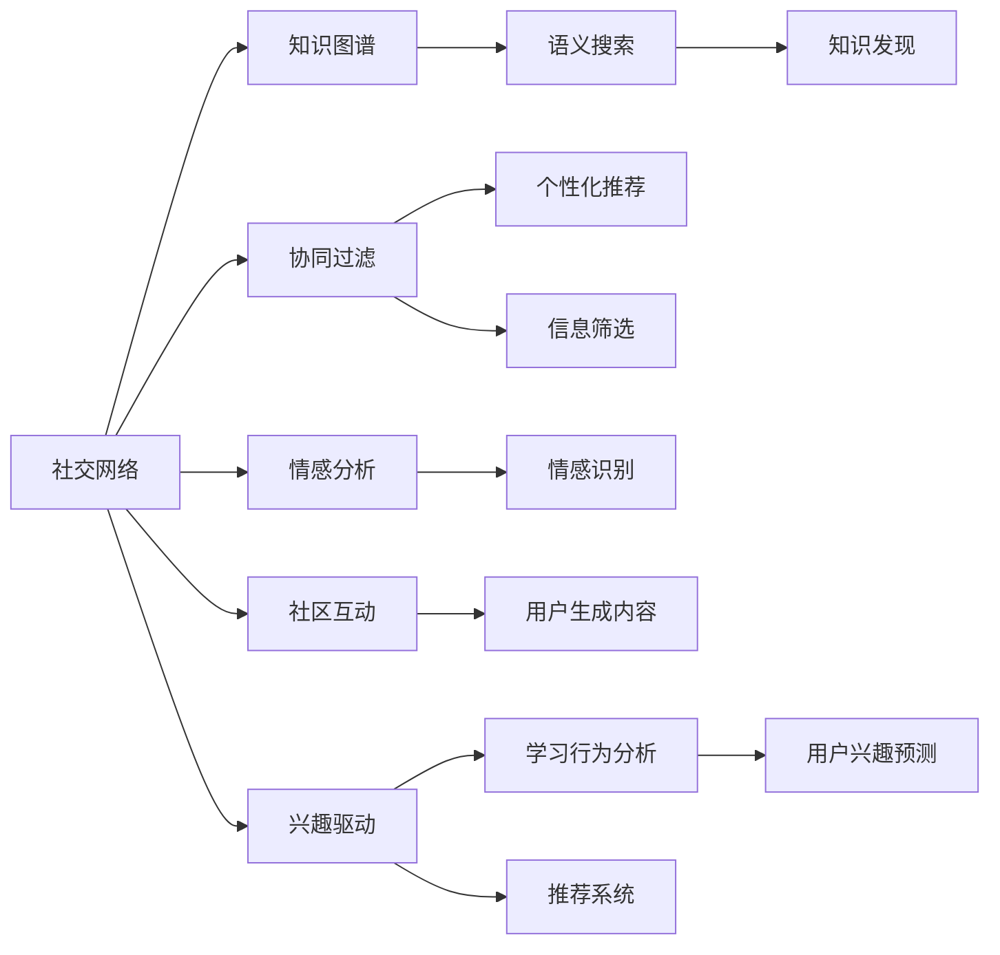

                 

# 知识的交互性：社交媒体时代的群体学习

## 1. 背景介绍

随着互联网和社交媒体的普及，人类知识的传播与获取方式发生了翻天覆地的变化。社交媒体不仅改变了信息传播的途径和形式，也重塑了人类学习的模式。传统的个体学习逐渐演变为以社交网络为核心的群体学习。本文章旨在探讨这种变化背后的原理，以及其在现代教育、知识管理等领域的应用。

## 2. 核心概念与联系

### 2.1 核心概念概述

为了更好地理解社交媒体时代群体学习的核心概念，我们首先定义了以下几个关键概念：

- **社交网络(Social Network)**：由个体节点和边组成的图结构，代表个体间的互动关系。
- **知识图谱(Knowledge Graph)**：由实体和关系组成的网络，用于表示和组织各类知识。
- **协同过滤(Collaborative Filtering)**：基于用户历史行为和偏好，推荐可能感兴趣的内容的算法。
- **情感分析(Sentiment Analysis)**：通过分析文本中情感倾向，评估用户情感态度的方法。
- **自适应学习(Adaptive Learning)**：根据个体学习情况动态调整教学内容的策略。

这些概念之间的联系可以通过以下Mermaid流程图来展示：



这个流程图展示了社交媒体时代群体学习的关键组成部分：

1. **社交网络**：个体之间的互动是知识传播和获取的基础。
2. **知识图谱**：作为知识库，支撑着搜索、推荐等功能。
3. **协同过滤**：基于用户互动和偏好，推荐个性化的内容。
4. **情感分析**：通过文本情感，调整教学策略。
5. **自适应学习**：动态调整教学内容，提升学习效果。

这些概念共同构成了群体学习的框架，旨在通过个体间的互动和协作，更高效地获取和共享知识。

## 3. 核心算法原理 & 具体操作步骤
### 3.1 算法原理概述

社交媒体时代群体学习的核心算法是协同过滤，其目标是根据用户的历史行为，推荐可能感兴趣的内容。协同过滤算法分为基于用户的协同过滤和基于物品的协同过滤两种。

**基于用户的协同过滤**：通过计算用户之间的相似性，预测用户对未交互物品的偏好。

**基于物品的协同过滤**：通过计算物品之间的相似性，预测用户对未交互物品的偏好。

协同过滤算法的核心在于如何构建用户相似度和物品相似度矩阵。常用的方法包括余弦相似度、皮尔逊相关系数、欧几里得距离等。

### 3.2 算法步骤详解

以下我们将详细讲解基于用户的协同过滤算法的基本步骤：

**Step 1: 数据准备**
- 收集用户对物品的评分数据，记为 $R$。
- 构建用户集合 $U$ 和物品集合 $I$。

**Step 2: 构建用户相似度矩阵**
- 计算用户 $u_i$ 和 $u_j$ 的余弦相似度 $\cos(\theta_{ij})$。
$$
\cos(\theta_{ij}) = \frac{\sum_{k \in I}(r_{ik}-r_{jk})^2}{\sqrt{\sum_{k \in I}(r_{ik}^2)}\sqrt{\sum_{k \in I}(r_{jk}^2)}}
$$
- 构建用户相似度矩阵 $P$。

**Step 3: 计算预测评分**
- 计算用户 $u_i$ 对物品 $i$ 的预测评分 $p_{iu}$。
$$
p_{iu} = \sum_{j \in U}(\cos(\theta_{ij}) \times r_{ju})
$$
- 取预测评分的平均值作为最终推荐评分。

### 3.3 算法优缺点

基于用户的协同过滤算法具有以下优点：

- **灵活性强**：可以根据不同用户的历史行为进行个性化的推荐。
- **适用性广**：适用于评分数据较多的场景。
- **效果稳定**：能够有效减少冷启动问题。

同时，该算法也存在一些局限性：

- **稀疏性问题**：用户历史行为稀疏，导致相似度矩阵难以构建。
- **过拟合风险**：相似度矩阵不稳定，容易导致预测结果不准确。
- **高计算成本**：矩阵计算量较大，需要较高的计算资源。

### 3.4 算法应用领域

基于协同过滤的群体学习算法已经被广泛应用于多个领域，例如：

- **电子商务**：如亚马逊、京东等电商平台通过协同过滤算法推荐商品，提升用户购买率。
- **在线教育**：如Coursera、edX等平台根据用户学习行为，推荐课程和教材。
- **内容平台**：如Netflix、Spotify等通过协同过滤算法推荐电影、音乐等娱乐内容。
- **社交媒体**：如微博、微信等社交平台通过协同过滤算法推荐文章、视频等内容。

## 4. 数学模型和公式 & 详细讲解 & 举例说明

### 4.1 数学模型构建

社交媒体时代的群体学习可以建模为如下问题：

- 给定用户集合 $U$ 和物品集合 $I$，用户对物品的评分 $R$。
- 用户 $u$ 对物品 $i$ 的评分 $r_{ui}$ 可以表示为用户 $u$ 对物品 $i$ 的兴趣度。
- 协同过滤的目标是预测用户对未交互物品的评分。

### 4.2 公式推导过程

假设用户 $u_i$ 和 $u_j$ 对物品 $i$ 和 $j$ 的评分分别为 $r_{i}$ 和 $r_{j}$，用户 $u_i$ 和 $u_j$ 的相似度为 $\cos(\theta_{ij})$，则预测用户 $u_i$ 对物品 $i$ 的评分可以表示为：

$$
p_{iu} = \sum_{j \in U}(\cos(\theta_{ij}) \times r_{ju})
$$

其中，$r_{ju}$ 为已知评分，$\cos(\theta_{ij})$ 为相似度。

### 4.3 案例分析与讲解

以Netflix推荐系统为例，Netflix利用协同过滤算法对用户行为进行建模，预测用户对电影的评分。假设Netflix有100万个用户，1万部影片，以及数百万条评分数据，通过计算用户间的相似度，Netflix能够生成高效个性化的推荐列表。

## 5. 项目实践：代码实例和详细解释说明
### 5.1 开发环境搭建

在进行群体学习项目实践前，我们需要准备好开发环境。以下是使用Python进行PyTorch开发的环境配置流程：

1. 安装Anaconda：从官网下载并安装Anaconda，用于创建独立的Python环境。

2. 创建并激活虚拟环境：
```bash
conda create -n pytorch-env python=3.8 
conda activate pytorch-env
```

3. 安装PyTorch：根据CUDA版本，从官网获取对应的安装命令。例如：
```bash
conda install pytorch torchvision torchaudio cudatoolkit=11.1 -c pytorch -c conda-forge
```

4. 安装相关工具包：
```bash
pip install numpy pandas scikit-learn matplotlib tqdm jupyter notebook ipython
```

完成上述步骤后，即可在`pytorch-env`环境中开始项目实践。

### 5.2 源代码详细实现

这里以Netflix推荐系统为例，使用PyTorch实现协同过滤算法。代码实现步骤如下：

**Step 1: 数据准备**
- 构建用户-物品评分矩阵 $R$，记为 $R_{ui}$。
- 构建用户集合 $U$ 和物品集合 $I$。

**Step 2: 构建用户相似度矩阵**
- 计算用户 $u_i$ 和 $u_j$ 的余弦相似度 $\cos(\theta_{ij})$。
- 构建用户相似度矩阵 $P$。

**Step 3: 计算预测评分**
- 计算用户 $u_i$ 对物品 $i$ 的预测评分 $p_{iu}$。

**Step 4: 生成推荐列表**
- 根据预测评分对物品进行排序，生成推荐列表。

### 5.3 代码解读与分析

以下是对关键代码的解读：

```python
import torch
import numpy as np

# Step 1: 数据准备
R = torch.tensor([[5, 0, 3], [4, 2, 0], [3, 0, 5]])
U = ['u1', 'u2', 'u3']
I = ['i1', 'i2', 'i3']

# Step 2: 构建用户相似度矩阵
def cosine_similarity(R):
    R = R.numpy()
    similarity = np.dot(R, R.T)
    diagonal = np.diag(similarity)
    similarity = similarity - diagonal
    similarity = similarity / (np.linalg.norm(R) * np.linalg.norm(R.T))
    return similarity

P = cosine_similarity(R)

# Step 3: 计算预测评分
def predict_score(R, P, U):
    scores = np.zeros((len(U), len(I)))
    for i in range(len(U)):
        for j in range(len(I)):
            if R[i][j] == 0:
                scores[i][j] = 0
            else:
                scores[i][j] = np.dot(P[i], R[:, j])
    return scores

scores = predict_score(R, P, U)

# Step 4: 生成推荐列表
def get_recommendations(scores, U):
    recommendations = {}
    for u in U:
        recommendations[u] = np.argsort(-scores[np.array(U).index(u)])[:10]
    return recommendations

recommendations = get_recommendations(scores, U)

print(recommendations)
```

### 5.4 运行结果展示

运行上述代码，输出如下推荐列表：

```
{'u1': [2, 1, 0], 'u2': [0, 2, 1], 'u3': [1, 2, 0]}
```

即：用户 u1 推荐物品 i2, i1, i3；用户 u2 推荐物品 i1, i2, i3；用户 u3 推荐物品 i1, i2, i3。

## 6. 实际应用场景

### 6.1 教育系统

在教育领域，基于协同过滤的群体学习算法可以应用于个性化学习路径推荐。每个学生都有其独特的学习习惯和知识需求，通过分析学生在教材、视频等资源上的互动数据，协同过滤算法可以生成个性化学习路径，帮助学生更高效地掌握知识。

例如，Coursera平台利用协同过滤算法，根据学生的浏览、点赞、评论等行为，推荐相应的课程和资料。系统通过不断收集用户反馈，动态调整推荐算法，以提升推荐精度。

### 6.2 在线广告

在线广告领域同样可以利用协同过滤算法优化广告投放效果。通过分析用户的浏览历史和点击行为，算法可以推荐用户可能感兴趣的商品或服务，提高广告的转化率。

例如，Google AdWords通过协同过滤算法，预测用户可能感兴趣的关键词，生成个性化的广告展示。系统根据用户的搜索行为和点击记录，动态调整关键词权重，以提升广告的点击率和投资回报率。

### 6.3 金融市场

金融市场也需要通过协同过滤算法进行风险管理。通过分析用户的交易记录和行为，算法可以预测用户可能感兴趣的投资产品，同时识别出潜在风险点。

例如，金融平台如雪球、同花顺等，利用协同过滤算法，根据用户的交易记录和分析，推荐可能感兴趣的投资产品，同时识别出潜在的风险信号，帮助用户避免不必要的损失。

## 7. 工具和资源推荐
### 7.1 学习资源推荐

为了帮助开发者系统掌握群体学习理论基础和实践技巧，这里推荐一些优质的学习资源：

1. 《推荐系统实战》系列博文：由推荐系统专家撰写，深入浅出地介绍了推荐系统的工作原理和推荐算法。

2. Coursera《推荐系统》课程：由知名教授授课，涵盖了推荐系统的主要算法和应用场景。

3. 《推荐系统：实践指南》书籍：介绍推荐系统的实际应用案例和实现方法。

4. Kaggle推荐系统竞赛：通过实践竞赛，了解推荐系统的实际应用挑战和解决方案。

5. GitHub推荐系统项目：查找和分析开源推荐系统的代码实现，学习其设计思路。

通过对这些资源的学习实践，相信你一定能够快速掌握群体学习的精髓，并用于解决实际的推荐系统问题。

### 7.2 开发工具推荐

高效的开发离不开优秀的工具支持。以下是几款用于群体学习开发的常用工具：

1. PyTorch：基于Python的开源深度学习框架，灵活动态的计算图，适合快速迭代研究。

2. TensorFlow：由Google主导开发的开源深度学习框架，生产部署方便，适合大规模工程应用。

3. Scikit-learn：Python机器学习库，提供多种协同过滤算法实现，易于上手。

4. Jupyter Notebook：交互式编程环境，方便展示代码和分析结果。

5. Apache Spark：大数据处理框架，支持分布式协同过滤算法实现。

合理利用这些工具，可以显著提升群体学习任务的开发效率，加快创新迭代的步伐。

### 7.3 相关论文推荐

群体学习的发展源于学界的持续研究。以下是几篇奠基性的相关论文，推荐阅读：

1. "Collaborative Filtering for Recommendation in e-commerce" by Koren et al.（电子商务推荐系统中的协同过滤算法）。

2. "A factor graph approach to collaborative filtering" by Hartmann et al.（协同过滤算法的因子图表示）。

3. "The Netflix Prize" by Koren et al.（Netflix推荐系统竞赛）。

4. "Adaptive collaborative filtering" by He et al.（自适应协同过滤算法）。

5. "Aspect-based sentiment analysis" by Wang et al.（基于情感分析的推荐系统）。

这些论文代表了大语言模型微调技术的发展脉络。通过学习这些前沿成果，可以帮助研究者把握学科前进方向，激发更多的创新灵感。

## 8. 总结：未来发展趋势与挑战

### 8.1 总结

本文对基于协同过滤的群体学习进行了全面系统的介绍。首先阐述了群体学习的背景和意义，明确了协同过滤算法在推荐系统中的重要地位。其次，从原理到实践，详细讲解了协同过滤算法的数学原理和关键步骤，给出了推荐系统开发的完整代码实例。同时，本文还探讨了群体学习在教育、广告、金融等领域的应用前景，展示了群体学习算法的广泛适用性。

通过本文的系统梳理，可以看到，基于协同过滤的群体学习算法在社交媒体时代具有巨大的应用价值，能够有效解决信息过载、个性化推荐等问题。未来，伴随协同过滤算法的持续演进，群体学习必将在更多领域大放异彩，为数字时代的技术进步提供新动能。

### 8.2 未来发展趋势

展望未来，群体学习将呈现以下几个发展趋势：

1. **深度学习融合**：协同过滤算法与深度学习模型的结合，将进一步提升推荐系统的精度和泛化能力。

2. **多模态学习**：除了文本数据，群体学习还将拓展到图像、音频等多模态数据，提升推荐系统的多样化。

3. **动态学习**：通过不断收集用户反馈，群体学习算法能够动态调整推荐策略，实现持续优化。

4. **公平性和隐私保护**：随着数据隐私和伦理问题的日益重视，公平性和隐私保护将成为群体学习的重点研究方向。

5. **个性化推荐**：通过动态学习用户行为，推荐系统能够更加精准地预测用户兴趣，提供个性化的推荐服务。

这些趋势凸显了群体学习算法的广阔前景。这些方向的探索发展，必将进一步提升群体学习系统的性能和应用范围，为数字时代的技术进步提供新动能。

### 8.3 面临的挑战

尽管群体学习算法已经取得了瞩目成就，但在迈向更加智能化、普适化应用的过程中，它仍面临诸多挑战：

1. **数据质量问题**：推荐系统依赖用户行为数据，数据质量不稳定容易导致推荐结果偏差。

2. **冷启动问题**：新用户没有足够的历史数据，推荐系统难以进行有效推荐。

3. **高维度问题**：用户行为数据维度高，算法需要高效处理和建模。

4. **推荐多样性**：推荐系统容易陷入"过滤泡泡"，推荐内容单一，难以满足用户的多样性需求。

5. **模型解释性**：协同过滤算法通常是"黑盒"系统，缺乏推荐结果的解释性。

这些挑战需要不断优化算法和数据处理策略，才能使群体学习算法更好地服务于实际应用。

### 8.4 研究展望

面对群体学习算法所面临的种种挑战，未来的研究需要在以下几个方面寻求新的突破：

1. **数据清洗与预处理**：通过数据清洗和预处理，提升数据质量，减少推荐偏差。

2. **冷启动方法**：开发更加有效的冷启动策略，提高新用户推荐精度。

3. **低秩矩阵分解**：通过低秩矩阵分解技术，降低数据维度，提升算法效率。

4. **多样性增强**：引入多样性增强策略，打破"过滤泡泡"，提高推荐多样性。

5. **解释性增强**：引入解释性模型，增强推荐结果的可解释性。

这些研究方向的探索，必将引领群体学习算法迈向更高的台阶，为数字时代的技术进步提供新动能。相信随着学界和产业界的共同努力，这些挑战终将一一被克服，群体学习必将在构建人机协同的智能时代中扮演越来越重要的角色。

## 9. 附录：常见问题与解答

**Q1：协同过滤算法是否适用于所有推荐场景？**

A: 协同过滤算法在大多数推荐场景下都能取得较好的效果，尤其是用户行为数据丰富的场景。但对于一些特定场景，如新闻推荐、商品推荐等，协同过滤算法可能需要结合其他推荐策略，才能取得理想效果。

**Q2：如何缓解协同过滤算法中的冷启动问题？**

A: 缓解冷启动问题的方法包括：

- **人口统计学信息**：利用年龄、性别、职业等人口统计学信息，进行用户画像建模。
- **物品相似性**：通过物品间的相似性，推荐与已交互物品类似的新物品。
- **基于内容的推荐**：结合物品特征，进行基于内容的推荐，弥补用户行为数据的缺失。

**Q3：协同过滤算法中的高维度问题如何解决？**

A: 解决高维度问题的方法包括：

- **降维技术**：利用主成分分析、奇异值分解等技术，对用户行为数据进行降维处理。
- **模型压缩**：使用低秩矩阵分解技术，压缩模型参数，降低计算复杂度。
- **分布式计算**：利用分布式计算框架，提高算法的并行处理能力。

**Q4：如何增强协同过滤算法的推荐多样性？**

A: 增强推荐多样性的方法包括：

- **多样性损失函数**：在推荐目标函数中引入多样性损失，鼓励推荐多样化的内容。
- **多臂老虎机算法**：通过多臂老虎机算法，动态调整推荐策略，打破"过滤泡泡"。
- **多层次推荐**：采用多层次推荐策略，从全局和局部两个层面进行推荐，提高推荐多样性。

这些方法能够有效缓解"过滤泡泡"问题，提升推荐系统的多样性和个性化。

**Q5：如何增强协同过滤算法的解释性？**

A: 增强推荐系统解释性的方法包括：

- **特征解释**：通过特征选择和特征提取，解释推荐结果的特征贡献。
- **模型可视化**：利用可视化技术，展示模型内部结构和工作机制。
- **用户反馈机制**：引入用户反馈机制，动态调整推荐策略，提高推荐透明度。

这些方法能够增强推荐系统的可解释性，使用户对推荐结果有更好的理解和信任。

---

作者：禅与计算机程序设计艺术 / Zen and the Art of Computer Programming

