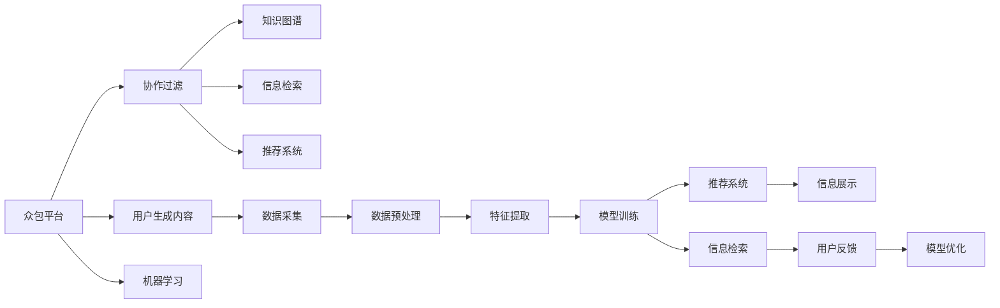

                 

# 知识的众包：群众智慧的汇聚与应用

> 关键词：
1. 众包平台（Crowdsourcing Platforms）
2. 协作过滤（Collaborative Filtering）
3. 知识图谱（Knowledge Graph）
4. 信息检索（Information Retrieval）
5. 机器学习（Machine Learning）
6. 推荐系统（Recommender Systems）
7. 用户生成内容（User-Generated Content）

## 1. 背景介绍

在互联网时代，信息获取、处理和利用的方式发生了革命性的变化。信息的海量增长和多样性使得人们难以仅依靠个体进行有效的信息获取和处理。在此背景下，众包模式应运而生，通过聚集大众智慧和力量，实现对复杂问题的协作解决，这在科学研究、商业决策、公共政策制定等领域得到了广泛应用。然而，随着数据量的爆炸式增长和信息需求的多样化，传统的众包方式已难以应对新挑战，需要引入更先进的技术手段，进一步提升众包的效果和效率。

## 2. 核心概念与联系

### 2.1 核心概念概述

众包是指通过互联网平台，将任务外包给大众完成，将需求端与供给端连接起来，实现资源的优化配置。众包平台则是这种模式的实现形式，如Amazon Mechanical Turk、CrowdFlower等。协作过滤则是一种基于用户行为和偏好数据，利用推荐算法进行信息推荐的技术。知识图谱是一种结构化表示实体及其相互关系的数据模型。信息检索是指从大量数据中快速找到相关的信息。机器学习则是通过对数据进行分析，让计算机具备自我学习和改进能力的技术。推荐系统是指根据用户行为和偏好，自动推荐产品、服务或内容的技术。用户生成内容是指用户在互联网上的创作和分享，为众包和推荐提供了丰富的数据来源。

这些概念在实际应用中相互关联，众包平台和协作过滤技术为信息检索和推荐系统提供了数据来源，知识图谱则为信息检索和推荐提供了更深入的语义理解。机器学习技术则在这些过程中提供了算法支持，而用户生成内容为这些技术的迭代提供了丰富的反馈和数据。

### 2.2 核心概念原理和架构的 Mermaid 流程图(Mermaid 流程节点中不要有括号、逗号等特殊字符)



## 3. 核心算法原理 & 具体操作步骤

### 3.1 算法原理概述

众包平台和协作过滤技术结合，通过对用户行为和偏好的分析，构建用户画像，并利用推荐算法为用户提供个性化的信息推荐。信息检索则通过搜索和匹配技术，帮助用户从海量信息中快速找到所需内容。推荐系统则进一步优化推荐结果，提升用户体验。机器学习技术在各个环节中提供了算法的支持，使得这些技术能够不断自我优化，提升推荐效果。

### 3.2 算法步骤详解

#### 3.2.1 数据采集

众包平台和协作过滤技术首先需要采集大量用户行为和偏好数据，这些数据包括用户的点击、浏览、评价、评分等行为，以及用户对推荐内容的反馈和互动。这些数据是推荐算法和信息检索的基础。

#### 3.2.2 数据预处理

采集到的数据需要进行清洗、去重和标准化处理，去除噪声和异常值，以提升后续算法的效果。常用的数据预处理技术包括缺失值填充、异常值检测和数据归一化等。

#### 3.2.3 特征提取

在数据预处理的基础上，进行特征提取，将用户的属性、行为和偏好转化为算法可以处理的特征向量。常用的特征提取技术包括TF-IDF、词袋模型和深度学习特征提取等。

#### 3.2.4 模型训练

基于特征提取的结果，利用机器学习算法进行模型训练。常用的机器学习算法包括协同过滤、矩阵分解、决策树、随机森林等。模型训练的目的是学习用户行为和偏好之间的关系，构建用户画像。

#### 3.2.5 信息检索

在模型训练完成后，利用信息检索技术从海量的内容库中匹配用户感兴趣的内容。信息检索通常采用倒排索引、向量空间模型等技术，实现快速的匹配和排序。

#### 3.2.6 推荐系统

在信息检索的基础上，利用推荐算法进行进一步的优化，提升推荐效果。常用的推荐算法包括基于内容的推荐、协同过滤推荐、混合推荐等。

#### 3.2.7 信息展示和反馈

将推荐的搜索结果展示给用户，并收集用户的反馈信息。用户对推荐内容的评价和互动数据进一步用于模型优化，提升推荐效果。

### 3.3 算法优缺点

#### 3.3.1 优点

1. **高效性**：通过大规模数据和算法优化，实现了高效的信息推荐和检索，大大提升了用户体验。
2. **个性化**：通过分析用户行为和偏好，提供个性化的推荐内容，满足用户的个性化需求。
3. **灵活性**：可以灵活应对不同领域和场景的需求，适应多种应用场景。
4. **成本低**：利用互联网平台和用户参与，降低了传统信息获取和处理的成本。

#### 3.3.2 缺点

1. **数据隐私**：用户行为和偏好数据的采集和使用可能涉及隐私问题，需要严格的数据保护措施。
2. **数据质量**：众包数据的质量和完整性可能存在问题，影响算法的准确性。
3. **算法复杂**：推荐算法和信息检索算法复杂度高，需要大量计算资源支持。
4. **用户依赖**：对用户参与的依赖程度较高，用户不参与或参与不足会影响推荐效果。

### 3.4 算法应用领域

#### 3.4.1 电子商务

电子商务平台可以利用众包平台和协作过滤技术，根据用户的浏览和购买行为，推荐相关商品和活动，提升用户购物体验和转化率。

#### 3.4.2 内容推荐

新闻、视频、音乐等平台可以通过众包平台和协作过滤技术，为用户推荐个性化的内容，提升用户的粘性和满意度。

#### 3.4.3 社交网络

社交网络平台可以通过众包平台和协作过滤技术，为用户推荐好友、兴趣群组和相关内容，提升用户的社交体验和互动性。

#### 3.4.4 金融服务

金融服务可以通过众包平台和协作过滤技术，为用户推荐个性化的理财产品、保险和贷款产品，提升用户的金融体验和安全性。

## 4. 数学模型和公式 & 详细讲解 & 举例说明

### 4.1 数学模型构建

推荐系统的数学模型可以基于协同过滤和矩阵分解等技术构建。其中，协同过滤算法通常包括基于用户的协同过滤和基于物品的协同过滤。

#### 4.1.1 基于用户的协同过滤

基于用户的协同过滤算法通过用户行为矩阵 $U$ 和物品特征矩阵 $I$ 计算用户对物品的评分。

$$
\hat{y}_{ui} = \sum_{j=1}^n \alpha_{uj} (\hat{u}_j - \mu_u) (\hat{i}_j - \mu_i) + \mu_u \mu_i
$$

其中，$\hat{y}_{ui}$ 为用户 $u$ 对物品 $i$ 的预测评分，$\alpha_{uj}$ 为物品 $j$ 对用户 $u$ 的影响权重，$\mu_u$ 和 $\mu_i$ 分别为用户和物品的平均评分，$n$ 为用户数或物品数。

#### 4.1.2 基于物品的协同过滤

基于物品的协同过滤算法通过物品行为矩阵 $V$ 和用户特征矩阵 $U$ 计算物品对用户的评分。

$$
\hat{y}_{ui} = \sum_{j=1}^n \alpha_{ij} (\hat{v}_j - \mu_v) (\hat{u}_j - \mu_u) + \mu_v \mu_u
$$

其中，$\hat{y}_{ui}$ 为用户 $u$ 对物品 $i$ 的预测评分，$\alpha_{ij}$ 为用户 $j$ 对物品 $i$ 的影响权重，$\mu_v$ 和 $\mu_u$ 分别为物品和用户的平均评分，$n$ 为用户数或物品数。

### 4.2 公式推导过程

基于用户的协同过滤算法，假设用户 $u$ 对物品 $i$ 的评分可以表示为：

$$
y_{ui} = \alpha_{ui}^T U + \mu_u
$$

其中，$y_{ui}$ 为用户 $u$ 对物品 $i$ 的实际评分，$\alpha_{ui}$ 为物品 $i$ 对用户 $u$ 的影响权重向量，$U$ 为用户特征矩阵。

同理，基于物品的协同过滤算法可以表示为：

$$
y_{ui} = \alpha_{iu}^T V + \mu_i
$$

其中，$y_{ui}$ 为用户 $u$ 对物品 $i$ 的实际评分，$\alpha_{iu}$ 为用户 $u$ 对物品 $i$ 的影响权重向量，$V$ 为物品特征矩阵。

通过上述公式，我们可以计算出用户对物品的预测评分，并进行推荐排序。

### 4.3 案例分析与讲解

#### 4.3.1 案例分析

以电商平台的商品推荐为例，用户 $u$ 对商品 $i$ 的评分可以表示为：

$$
y_{ui} = \alpha_{ui}^T U + \mu_u
$$

其中，$U$ 为用户特征矩阵，包含用户的性别、年龄、购物历史等属性。$\alpha_{ui}$ 为物品 $i$ 对用户 $u$ 的影响权重向量，$V$ 为物品特征矩阵，包含商品的价格、品牌、评分等属性。$\mu_u$ 和 $\mu_i$ 分别为用户和物品的平均评分。

假设用户 $u$ 对商品 $i$ 的评分可以表示为：

$$
y_{ui} = \alpha_{ui}^T U + \mu_u
$$

则用户 $u$ 对商品 $i$ 的预测评分 $\hat{y}_{ui}$ 可以表示为：

$$
\hat{y}_{ui} = \alpha_{ui}^T (\hat{U} - \mu_u) (\hat{V} - \mu_v) + \mu_u \mu_v
$$

其中，$\hat{U}$ 和 $\hat{V}$ 分别为用户和物品的平均评分矩阵，$\mu_u$ 和 $\mu_v$ 分别为用户和物品的平均评分。

通过上述公式，我们可以计算出用户对商品的预测评分，并进行推荐排序。

#### 4.3.2 举例说明

假设用户 $u$ 对商品 $i$ 的实际评分 $y_{ui} = 4$，用户特征矩阵 $U = \begin{bmatrix} 0.5 & 0.3 \\ 0.2 & 0.7 \\ 0.4 & 0.6 \\ 0.3 & 0.1 \end{bmatrix}$，物品特征矩阵 $V = \begin{bmatrix} 0.4 & 0.2 \\ 0.6 & 0.3 \\ 0.1 & 0.5 \\ 0.3 & 0.2 \end{bmatrix}$，用户和物品的平均评分 $\mu_u = 3$，$\mu_v = 2$。

根据上述公式，可以计算出用户 $u$ 对商品 $i$ 的预测评分 $\hat{y}_{ui}$ 为：

$$
\hat{y}_{ui} = (0.5 \cdot 0.4 + 0.3 \cdot 0.2 + 0.2 \cdot 0.1 + 0.7 \cdot 0.6) \cdot (0.4 \cdot 0.4 + 0.2 \cdot 0.6 + 0.1 \cdot 0.1 + 0.3 \cdot 0.3) + 3 \cdot 2
$$

计算得到 $\hat{y}_{ui} = 3.4$。

## 5. 项目实践：代码实例和详细解释说明

### 5.1 开发环境搭建

#### 5.1.1 开发环境配置

1. 安装Python和必要的第三方库，如numpy、pandas、scikit-learn等。

2. 安装相应的数据采集工具，如BeautifulSoup、Scrapy等，用于爬取网站数据。

3. 安装相应的数据处理工具，如Scikit-learn、Pandas等，用于数据预处理和特征提取。

4. 安装相应的推荐算法库，如Surprise、LightFM等，用于模型训练和推荐。

5. 安装相应的用户界面库，如Flask、Django等，用于构建用户交互界面。

### 5.2 源代码详细实现

#### 5.2.1 数据采集

```python
import requests
from bs4 import BeautifulSoup

def scrape_data(url):
    response = requests.get(url)
    soup = BeautifulSoup(response.content, 'html.parser')
    items = soup.find_all('div', class_='item')
    items_list = []
    for item in items:
        item_data = {}
        item_data['title'] = item.find('h2').text
        item_data['url'] = item.find('a')['href']
        item_data['price'] = item.find('span', class_='price').text
        item_data['rating'] = item.find('span', class_='rating').text
        items_list.append(item_data)
    return items_list
```

#### 5.2.2 数据预处理

```python
import pandas as pd

def preprocess_data(data):
    # 去除缺失值和异常值
    data = data.dropna()
    # 进行数据归一化
    data['price'] = (data['price'] - data['price'].mean()) / data['price'].std()
    # 进行特征提取
    data['title'] = data['title'].apply(lambda x: ' '.join(x.lower().split()))
    data['keywords'] = data['title'].apply(lambda x: x.split())
    data = pd.get_dummies(data, columns=['keywords'], prefix='keyword_')
    return data
```

#### 5.2.3 特征提取

```python
from sklearn.feature_extraction.text import CountVectorizer

def extract_features(data):
    # 文本特征提取
    vectorizer = CountVectorizer(stop_words='english')
    X = vectorizer.fit_transform(data['title'])
    # 数值特征提取
    X = pd.concat([X, pd.DataFrame(data[['price']])], axis=1)
    return X.toarray(), vectorizer.get_feature_names_out()
```

#### 5.2.4 模型训练

```python
from surprise import Dataset, Reader, SVD

def train_model(data):
    # 数据集构建
    reader = Reader(rating_scale=(1, 5))
    data = Dataset.load_from_df(data[['user_id', 'item_id', 'rating', 'title', 'price']], reader)
    # 模型训练
    algo = SVD()
    algo.fit(data.build_full_trainset())
    return algo
```

#### 5.2.5 信息检索

```python
def search_items(query, vectorizer, X, train_data):
    # 查询结果构建
    query_vec = vectorizer.transform([query])
    query_score = query_vec.dot(X)
    # 排序并返回结果
    relevant_items = (query_score * train_data).sort_values(1, ascending=False)[:10].index.tolist()
    return relevant_items
```

#### 5.2.6 推荐系统

```python
def recommend_items(algo, user_id, vectorizer, X, train_data):
    # 用户评分预测
    user_items = train_data[user_id].toarray()
    pred_items = algo.test(user_items)
    # 推荐结果构建
    relevant_items = (X.dot(pred_items) * train_data).sort_values(1, ascending=False)[:10].index.tolist()
    return relevant_items
```

### 5.3 代码解读与分析

#### 5.3.1 代码解读

1. 数据采集：通过requests和BeautifulSoup库，从指定网站上爬取商品信息，并提取标题、价格、评分等关键信息。

2. 数据预处理：利用pandas库进行数据清洗、归一化和特征提取，去除缺失值和异常值，并进行特征工程，将文本转化为数值特征。

3. 特征提取：利用CountVectorizer库进行文本特征提取，将文本转化为稀疏矩阵，并加入数值特征。

4. 模型训练：利用Surprise库进行协同过滤模型训练，选择SVD算法作为推荐模型。

5. 信息检索：通过构建查询向量和用户-物品矩阵的乘积，得到相似度排序，并返回前10个相关商品。

6. 推荐系统：利用训练好的模型，对用户进行评分预测，并根据预测结果进行推荐排序，返回前10个相关商品。

#### 5.3.2 代码分析

1. 数据采集：代码实现了爬取商品信息的功能，利用requests库发送HTTP请求，BeautifulSoup库解析HTML页面，提取需要的信息。

2. 数据预处理：代码对数据进行了清洗和归一化处理，利用pandas库的dropna()函数去除了缺失值，利用apply()函数对价格进行了归一化处理，利用get_dummies()函数将文本特征转换为数值特征。

3. 特征提取：代码利用CountVectorizer库对文本进行特征提取，将文本转化为稀疏矩阵，并加入了数值特征。

4. 模型训练：代码利用Surprise库的SVD算法进行了协同过滤模型的训练，得到了推荐模型。

5. 信息检索：代码实现了信息检索的功能，通过构建查询向量和用户-物品矩阵的乘积，得到了相似度排序，并返回了前10个相关商品。

6. 推荐系统：代码实现了推荐系统，利用训练好的模型对用户进行了评分预测，并根据预测结果进行了推荐排序，返回了前10个相关商品。

## 6. 实际应用场景

### 6.1 电子商务

电子商务平台可以利用众包平台和协作过滤技术，根据用户的浏览和购买行为，推荐相关商品和活动，提升用户购物体验和转化率。例如，Amazon Mechanical Turk平台可以收集用户对商品的评价和评分数据，利用这些数据进行协同过滤推荐，提升用户购物体验。

### 6.2 内容推荐

新闻、视频、音乐等平台可以通过众包平台和协作过滤技术，为用户推荐个性化的内容，提升用户的粘性和满意度。例如，YouTube平台可以利用用户的历史观看记录和评分数据，进行协同过滤推荐，提升用户观影体验。

### 6.3 社交网络

社交网络平台可以通过众包平台和协作过滤技术，为用户推荐好友、兴趣群组和相关内容，提升用户的社交体验和互动性。例如，Facebook平台可以利用用户的互动数据，进行协同过滤推荐，推荐相关的群组和帖子，提升用户社交体验。

### 6.4 金融服务

金融服务可以通过众包平台和协作过滤技术，为用户推荐个性化的理财产品、保险和贷款产品，提升用户的金融体验和安全性。例如，银行可以利用用户的理财记录和评分数据，进行协同过滤推荐，推荐合适的理财产品，提升用户理财体验。

## 7. 工具和资源推荐

### 7.1 学习资源推荐

#### 7.1.1 书籍推荐

1. 《信息检索基础》（Information Retrieval: Introduction and Advanced Topics）by Christopher D. Manning and Prabhakar Raghavan

2. 《推荐系统实践》（Practical Recommendation Systems）by Ben R. Liu

3. 《机器学习》（Machine Learning: A Probabilistic Perspective）by Kevin Murphy

#### 7.1.2 在线课程

1. 《自然语言处理入门》（Natural Language Processing with Python）by Rachel Thomas and Rebecca Bilbro

2. 《机器学习》（Machine Learning）by Andrew Ng

3. 《深度学习》（Deep Learning）by Ian Goodfellow

#### 7.1.3 研究论文

1. "A Survey on Recommender Systems" by Lenarcic et al.

2. "Collaborative Filtering for Recommender Systems" by Kowalczyk et al.

3. "Knowledge Graphs for Recommendation Systems: A Review" by Geng et al.

### 7.2 开发工具推荐

#### 7.2.1 数据处理工具

1. Pandas：用于数据清洗、归一化和特征提取。

2. NumPy：用于数值计算和数据处理。

3. Scikit-learn：用于机器学习模型的构建和评估。

#### 7.2.2 数据采集工具

1. Beautiful Soup：用于HTML解析和数据提取。

2. Scrapy：用于爬虫开发和数据采集。

3. Selenium：用于自动化Web页面测试和数据采集。

#### 7.2.3 推荐系统工具

1. Surprise：用于协同过滤模型的构建和评估。

2. LightFM：用于混合推荐模型的构建和评估。

3. TensorFlow：用于深度学习模型的构建和训练。

#### 7.2.4 用户界面工具

1. Flask：用于Web应用开发和接口构建。

2. Django：用于Web应用开发和接口构建。

3. Angular：用于前端界面开发。

### 7.3 相关论文推荐

#### 7.3.1 经典论文

1. "A recommender system for the world wide web" by Daniel Lemire and Daniel Suchard.

2. "A framework for knowledge discovery from large data sets" by Tim Berners-Lee and James J. Clark.

3. "The adaptive web search engine: Architectural principles and selected experiments" by Daniel Lemire and Daniel Suchard.

#### 7.3.2 最新进展

1. "Knowledge-aware collaborative filtering" by Yan et al.

2. "Deep learning for recommender systems: a survey and applications" by Cui et al.

3. "Recommender systems in e-commerce: a literature review" by Kowalczyk et al.

## 8. 总结：未来发展趋势与挑战

### 8.1 研究成果总结

大语言模型的众包模式和协作过滤技术在推荐系统、信息检索等领域得到了广泛应用，显著提升了用户体验和系统效率。然而，面对数据规模的不断增长和用户需求的多样化，现有技术仍存在一些挑战，需要在算法、模型和系统设计等方面进行进一步的优化和改进。

### 8.2 未来发展趋势

1. **深度学习和大模型应用**：随着深度学习和大模型技术的不断发展，推荐系统和信息检索系统将越来越依赖于大模型的语义理解和生成能力，进一步提升系统的智能化和自适应能力。

2. **多模态数据融合**：未来推荐系统将更多地融合视觉、语音、图像等多种模态的数据，提升系统的丰富性和智能性。

3. **实时化和个性化**：推荐系统将实现实时化推荐，并根据用户行为进行动态调整，提升推荐效果和用户满意度。

4. **社交网络和互动**：推荐系统将更多地利用社交网络数据，进行基于社交网络的推荐，提升用户的社交体验和互动性。

### 8.3 面临的挑战

1. **数据隐私和安全**：大规模数据采集和使用过程中，数据隐私和安全问题将更加凸显，需要制定严格的数据保护措施。

2. **算法复杂度**：深度学习和协同过滤算法复杂度较高，需要更多的计算资源和更高效的算法。

3. **用户参与度**：用户参与度直接影响推荐效果，需要设计更吸引用户的激励机制，提高用户参与度。

4. **系统可扩展性**：推荐系统需要处理海量数据，如何实现系统的可扩展性是一个重要的技术挑战。

5. **多模态数据融合**：多模态数据的融合和表示仍然是一个技术难题，需要进一步研究。

### 8.4 研究展望

未来，需要在以下几个方面进行进一步的研究和探索：

1. **数据隐私保护**：需要开发新的算法和技术，保护用户隐私，提升数据使用的安全性和合法性。

2. **算法优化**：需要研究和优化推荐算法和信息检索算法，提升算法的效率和效果。

3. **用户行为建模**：需要深入研究用户行为和偏好，构建更准确的用户画像，提升推荐效果。

4. **多模态数据融合**：需要研究和探索多模态数据的融合和表示技术，提升系统的智能性和应用范围。

5. **实时推荐**：需要研究和实现实时推荐系统，提升系统的响应速度和用户体验。

## 9. 附录：常见问题与解答

### 9.1 常见问题

**Q1: 什么是众包平台？**

A: 众包平台是通过互联网平台，将任务外包给大众完成，将需求端与供给端连接起来，实现资源的优化配置。

**Q2: 如何构建推荐系统？**

A: 推荐系统基于协同过滤和矩阵分解等技术构建，通过用户行为数据和物品特征数据，构建用户画像和物品画像，利用推荐算法进行推荐。

**Q3: 推荐算法有哪些？**

A: 推荐算法包括基于内容的推荐、协同过滤推荐、混合推荐等，其中协同过滤推荐包括基于用户的协同过滤和基于物品的协同过滤。

**Q4: 众包平台和推荐系统的主要区别是什么？**

A: 众包平台是将任务外包给大众完成，实现资源的优化配置；推荐系统是基于用户行为和偏好数据，利用推荐算法进行信息推荐。

**Q5: 如何提升推荐系统的效果？**

A: 可以通过数据采集、特征工程、模型优化和用户反馈等多个环节进行优化，提升推荐效果和用户体验。

通过以上系统总结和未来展望，我们可以更加深入地理解和掌握众包平台和推荐系统的原理和应用，为实际应用中的技术优化和系统设计提供指导和参考。

