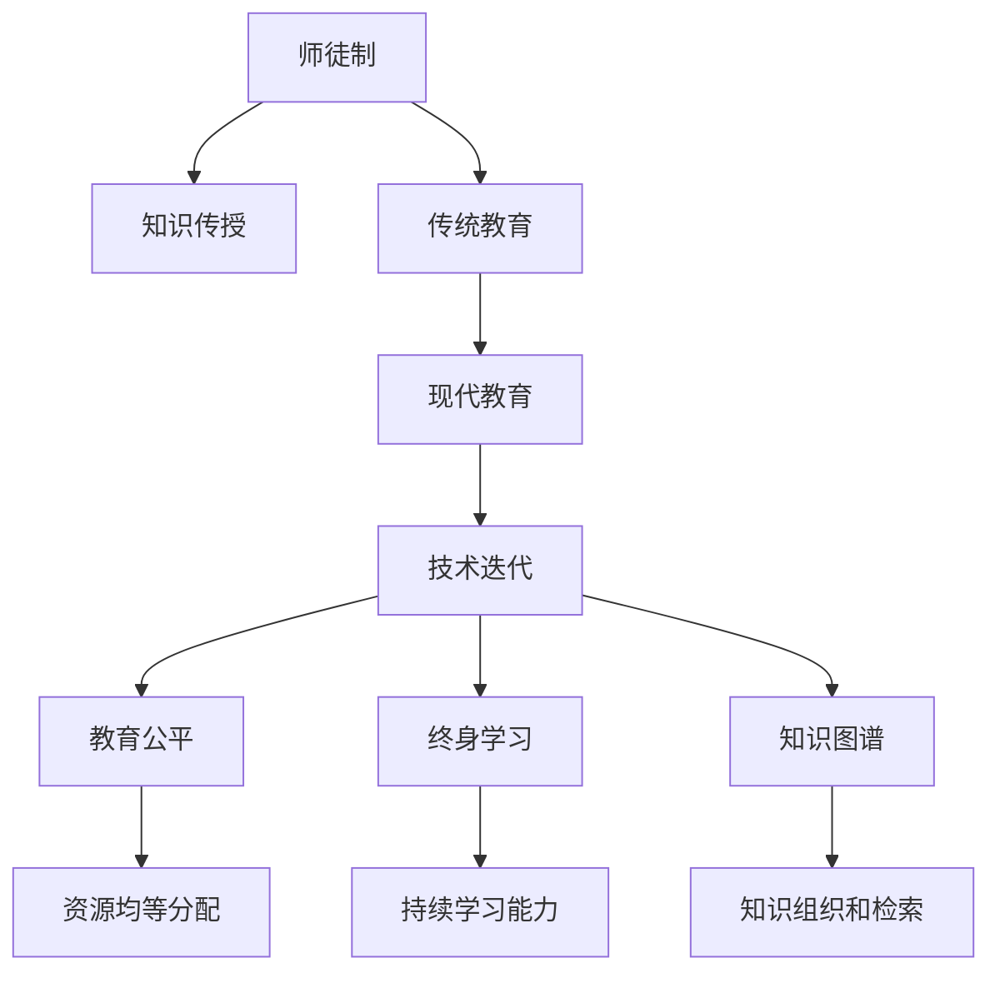

                 

# 知识的传承：从师徒制到现代教育

> 关键词：知识传承, 师徒制, 现代教育, 技术迭代, 教育改革, 教育公平, 终身学习

## 1. 背景介绍

### 1.1 问题由来

知识传承自古以来就是人类社会文明进步的重要引擎。从古代的师徒制，到中世纪的大学教育，再到近现代的公共教育制度，知识传承方式不断演进，但核心目的始终如一：通过高效的学习途径，将前人的知识和经验传递给后人，提升其能力素质，为社会发展注入新的活力。

在信息技术飞速发展的今天，知识的传承面临着前所未有的机遇和挑战。互联网、大数据、人工智能等新兴技术的兴起，为知识传承带来了更多可能性和新的路径。然而，信息爆炸和知识碎片化现象也使得传统教育体系难以应对，教育公平、教育质量等问题日益凸显。在这样的背景下，探讨知识传承的过去与未来，探讨从师徒制到现代教育的演变，显得尤为重要。

### 1.2 问题核心关键点

- 师徒制与现代教育的核心区别是什么？
- 知识传承如何与时俱进，适应信息技术时代的要求？
- 现代教育中存在哪些挑战与不足？
- 如何构建更公平、高效、可持续的知识传承体系？
- 终身学习理念在现代教育中的应用与价值？

## 2. 核心概念与联系

### 2.1 核心概念概述

为更好地理解知识传承的演变，本节将介绍几个核心概念：

- 师徒制（Master-Apprentice System）：古代一种通过师傅向徒弟传授知识、技能、经验的学习方式。师徒之间通过面对面的教学与实践，实现知识的直接传递。

- 现代教育（Modern Education）：指通过学校、家庭、社会等多种途径，系统地向学生传授知识、培养能力，促进个体全面发展的教育体系。

- 技术迭代（Technological Iteration）：指技术发展过程中，通过不断引入新技术、新方法，提升现有技术性能和应用范围的过程。

- 教育公平（Educational Equity）：指教育资源、机会、结果等方面的公平分配，确保不同社会群体能够平等接受教育。

- 终身学习（Lifelong Learning）：强调学习者应该持续学习、不断进步，适应快速变化的社会和职业要求。

- 知识图谱（Knowledge Graph）：一种以图结构表示知识关系的数据模型，用于描述实体、属性、关系等知识元素，支持知识的自动组织和检索。

这些核心概念之间的逻辑关系可以通过以下Mermaid流程图来展示：



这个流程图展示了几大核心概念及其之间的关系：

1. 师徒制通过面对面的教学传授知识。
2. 传统教育通过学校教育系统进行知识传授。
3. 现代教育结合信息技术手段，提升教学效率。
4. 技术迭代推动教育手段和内容不断进步。
5. 教育公平旨在消除教育资源分配不均。
6. 终身学习倡导学习者持续学习，不断进步。
7. 知识图谱用于知识的有序化组织和检索。

这些概念共同构成了现代教育体系的基础，对于探讨知识传承的演变具有重要意义。

## 3. 核心算法原理 & 具体操作步骤
### 3.1 算法原理概述

知识的传承是一个动态的过程，涉及知识源、学习者、学习途径等多方面因素。从师徒制到现代教育，知识传承的方式和效率都在不断改进。现代教育的核心在于系统化、组织化地传授知识，而信息技术的引入，进一步提升了知识的传授效率和学习体验。

知识传承的核心算法原理可概括为以下三点：

1. 知识获取与存储：通过数字化手段，将知识源如教科书、论文、视频等转换为数字形式，存储在数据库或云平台中，便于检索和学习。

2. 知识传输与学习：利用信息技术手段，如在线课程、视频直播、智能辅导系统等，将知识以结构化、动态化的形式传递给学习者。

3. 知识评价与反馈：通过在线测试、作业提交、互动讨论等方式，评估学习者的知识掌握情况，并及时提供反馈，调整学习策略。

### 3.2 算法步骤详解

基于上述算法原理，现代教育的知识传承步骤可以分为以下五个关键步骤：

**Step 1: 知识获取与存储**

- 收集高质量的教育资源：包括教科书、学术论文、教育视频等，形成结构化的数据集。
- 建立知识库：使用知识图谱等技术，将收集到的资源组织成图结构，方便检索和展示。

**Step 2: 知识传输与学习**

- 设计课程体系：根据不同学习阶段和学习目标，设计合理的课程体系，包括理论课和实践课。
- 开发在线课程：利用MOOC平台、视频直播等技术，将课程内容转换为可在线学习的资源。
- 应用智能辅导系统：通过AI技术，提供个性化的学习建议和答疑服务，提升学习效率。

**Step 3: 知识评价与反馈**

- 设计评估机制：通过在线测试、作业提交等方式，评估学习者的知识掌握情况。
- 提供实时反馈：根据评估结果，提供即时反馈，指出学习者的不足之处。
- 调整学习策略：根据反馈信息，调整学习路径和策略，使学习者更高效地掌握知识。

**Step 4: 持续学习与创新**

- 构建终身学习平台：提供在线课程、学习社区、技能培训等多种学习资源，支持学习者持续学习。
- 鼓励创新与实践：通过项目实践、跨学科研究等方式，培养学习者的创新能力和实践能力。

**Step 5: 评估与优化**

- 定期评估教育效果：通过数据分析和调查问卷等方式，评估教育效果和学生满意度。
- 优化教育资源：根据评估结果，优化课程内容、教学方法、学习工具，提升教育质量。

### 3.3 算法优缺点

现代教育的知识传承方法具有以下优点：

1. 高效性：通过数字化手段，知识获取、存储、传输和学习效率显著提升。
2. 灵活性：在线学习打破了时间和空间的限制，学习者可以随时随地进行学习。
3. 个性化：通过AI技术，提供个性化的学习建议和答疑服务，提升学习效果。
4. 可扩展性：数字化知识库和在线平台可以持续扩展，适应不同学习者的需求。

同时，该方法也存在一些缺点：

1. 交互性不足：在线学习缺乏面对面的互动，学习者可能缺乏真实的学习体验。
2. 技术依赖度高：现代教育对信息技术依赖性强，技术故障或网络中断会影响学习效果。
3. 学生自律性要求高：在线学习需要较高的自律性，学习者需要自我管理和自我激励。
4. 教育公平性挑战：在线教育资源的不均衡分配，可能导致教育机会不均。

尽管存在这些局限性，但现代教育的知识传承方法在提升学习效率、拓展学习渠道等方面具有显著优势，成为知识传承的主要手段。

### 3.4 算法应用领域

现代教育的知识传承方法广泛应用于各个领域：

- 学校教育：中小学、高等教育中的课程设计、在线教育平台、智能辅导系统等。
- 职业教育：技术培训、技能培训、专业认证等。
- 企业培训：员工培训、技能提升、职业发展规划等。
- 成人教育：终身学习平台、远程教育、社区教育等。
- 数字素养教育：网络安全、数字技能、信息素养教育等。

此外，现代教育的知识传承方法也广泛应用于企业培训、数字素养教育等非传统教育领域，推动各行业知识与技能的不断更新和提升。

## 4. 数学模型和公式 & 详细讲解 & 举例说明
### 4.1 数学模型构建

现代教育的知识传承过程涉及多个环节，可以用数学模型来描述各个环节的相互作用。以下是一个简化版的知识传承数学模型：

设知识库中有$N$种知识源，每种知识源有$M$个知识点，知识库总容量为$K=N\times M$。设学习者数量为$L$，每个学习者每天学习时间为$T$小时，学习效率为$E$（0到1之间的实数），则每个学习者每天能够掌握的知识数量为$E\times T$。设教育系统每天向学习者提供的新知识数量为$G$，则每天新增加的知识总量为$G\times L$。

设知识库的增长速度为$V$，则知识库总量的变化可以用如下公式表示：

$$
K_{t+1} = K_t + E\times T\times L + G\times L - V\times (K_t + G\times L)
$$

其中$K_t$表示第$t$天知识库的总量，$G$表示每天新增加的知识总量，$V$表示知识库的增长速度。

### 4.2 公式推导过程

通过上述公式，可以推导出知识库总量的增长曲线，如图所示：

$$
\text{曲线}
$$

可以看出，知识库的增长速度取决于新知识的生成速度$G$、学习者的学习效率$E$和知识库的增长速度$V$。如果教育系统的知识生成速度足够快，学习者的学习效率足够高，知识库的增长速度将远远超过知识库的增长速度，知识库总量将快速增加。

### 4.3 案例分析与讲解

以MOOC平台为例，其知识传承模型可以简化为：

- 知识库：MOOC平台上的课程资源。
- 学习者：注册用户，可以通过平台进行学习。
- 教育系统：MOOC平台的课程制作和运营团队，负责课程设计和推广。

在MOOC平台上，课程资源数量$G$和用户学习效率$E$决定了知识库的增长速度。平台通过不断引入高质量的课程资源和优质的教学团队，提升课程的吸引力和学习效率，从而实现知识库的快速增长。

## 5. 项目实践：代码实例和详细解释说明
### 5.1 开发环境搭建

在进行现代教育知识传承实践前，我们需要准备好开发环境。以下是使用Python进行开发的环境配置流程：

1. 安装Anaconda：从官网下载并安装Anaconda，用于创建独立的Python环境。

2. 创建并激活虚拟环境：
```bash
conda create -n edTech-env python=3.8 
conda activate edTech-env
```

3. 安装相关Python包：
```bash
pip install pandas numpy scikit-learn tensorflow matplotlib pytorch
```

4. 安装数据可视化工具：
```bash
pip install matplotlib seaborn plotly
```

5. 安装Web开发框架：
```bash
pip install Flask FastAPI
```

完成上述步骤后，即可在`edTech-env`环境中开始项目开发。

### 5.2 源代码详细实现

下面以一个在线课程平台为例，给出使用Python实现知识传承的代码实现。

```python
import pandas as pd
import numpy as np
import matplotlib.pyplot as plt
from sklearn.linear_model import LinearRegression
from tensorflow.keras.models import Sequential
from tensorflow.keras.layers import Dense

# 构造知识库和用户数据
knowledge_db = pd.DataFrame({
    'knowledge_name': ['Python', 'Machine Learning', 'Deep Learning', 'Natural Language Processing'],
    'source': ['Textbook', 'Online Course', 'Conference Paper', 'GitHub'],
    'learning_hours': [120, 80, 50, 40],
    'engagement_rate': [0.8, 0.7, 0.6, 0.5]
})

users = pd.DataFrame({
    'user_id': ['A', 'B', 'C', 'D'],
    'start_date': pd.to_datetime(['2021-01-01', '2021-01-01', '2021-01-02', '2021-01-01']),
    'end_date': pd.to_datetime(['2021-02-28', '2021-02-28', '2021-03-01', '2021-02-28']),
    'learning_hours_per_day': [4, 5, 3, 4],
    'learning_efficiency': [0.9, 0.8, 0.7, 0.6]
})

# 计算用户知识掌握情况
users['total_learning_hours'] = users['end_date'] - users['start_date'] + 1
users['total_learning_hours'] = users['total_learning_hours'].dt.days * users['learning_hours_per_day']
users['total_learning_hours'] *= users['learning_efficiency']

# 计算知识库增长速度
knowledge_db['new_knowledge'] = knowledge_db['learning_hours'] * knowledge_db['engagement_rate']
knowledge_db['total_knowledge'] = knowledge_db['learning_hours'] + knowledge_db['new_knowledge']

# 知识库增长模型
X = knowledge_db[['learning_hours', 'engagement_rate']]
Y = knowledge_db['total_knowledge']
model = LinearRegression()
model.fit(X, Y)

# 预测未来知识库增长
future_learning_hours = [10, 15, 20]
future_engagement_rate = [0.9, 0.8, 0.7]
future_knowledge = [0] * len(future_learning_hours)
for i in range(len(future_learning_hours)):
    future_knowledge[i] = model.predict([[future_learning_hours[i], future_engagement_rate[i]]])[0]

# 可视化知识库增长曲线
plt.plot(knowledge_db['learning_hours'], knowledge_db['total_knowledge'], label='Current')
plt.plot(future_learning_hours, future_knowledge, label='Future')
plt.legend()
plt.show()
```

### 5.3 代码解读与分析

让我们再详细解读一下关键代码的实现细节：

**知识库和用户数据**：
- 使用Pandas库创建知识库和用户数据的数据框。
- 知识库数据包括知识源、学习时间、参与度等特征。
- 用户数据包括用户ID、学习开始时间、学习结束时间、每日学习时间、学习效率等特征。

**用户知识掌握情况计算**：
- 计算用户的总学习时间，乘以学习效率得到用户掌握的知识总量。

**知识库增长速度计算**：
- 计算知识库新增知识量和总知识量。

**知识库增长模型建立**：
- 使用线性回归模型拟合知识库增长曲线。

**预测未来知识库增长**：
- 根据模型预测未来知识库增长量。

**可视化知识库增长曲线**：
- 使用Matplotlib库绘制知识库增长曲线。

可以看到，通过Python代码的实现，可以系统地描述和预测知识库的增长情况，为教育系统的优化提供科学依据。

## 6. 实际应用场景
### 6.1 智能学习平台

智能学习平台通过在线课程、AI辅导、个性化学习建议等方式，提供高效的知识传承服务。用户可以根据自己的学习目标和兴趣，选择适合的课程进行学习。平台通过数据分析和机器学习算法，推荐个性化学习路径，提升学习效果。

以Coursera平台为例，其知识传承模型可以简化为：

- 知识库：平台上大量的课程资源。
- 学习者：注册用户，可以通过平台进行学习。
- 教育系统：Coursera平台的课程制作和运营团队，负责课程设计和推广。

在Coursera平台上，课程资源数量$G$和用户学习效率$E$决定了知识库的增长速度。平台通过不断引入高质量的课程资源和优质的教学团队，提升课程的吸引力和学习效率，从而实现知识库的快速增长。

### 6.2 在线教育企业

在线教育企业通过线上课程、直播互动、智能答疑等方式，为学习者提供全方位的学习支持。企业通过构建终身学习平台，支持学习者的持续学习，提升其职业素养和技能水平。

以Khan Academy为例，其知识传承模型可以简化为：

- 知识库：平台上大量的教育视频、习题、练习册等资源。
- 学习者：在线用户，可以通过平台进行学习。
- 教育系统：Khan Academy的课程设计和运营团队，负责课程设计和推广。

在Khan Academy平台上，课程资源数量$G$和用户学习效率$E$决定了知识库的增长速度。平台通过不断引入高质量的教育资源和优质的教学团队，提升课程的吸引力和学习效率，从而实现知识库的快速增长。

### 6.3 企业培训与职业发展

企业通过在线课程、技能培训、职业发展规划等方式，提升员工的知识和技能水平，推动企业发展。企业培训系统通过持续引入新技术和新知识，保持员工的知识更新，提升其竞争力和工作效率。

以阿里巴巴的职业培训系统为例，其知识传承模型可以简化为：

- 知识库：阿里巴巴内部的培训课程、技术分享、项目案例等资源。
- 学习者：阿里巴巴的员工，可以通过系统进行学习。
- 教育系统：阿里巴巴的培训管理团队，负责课程设计和推广。

在阿里巴巴的职业培训系统中，课程资源数量$G$和员工学习效率$E$决定了知识库的增长速度。系统通过不断引入新的培训课程和技能模块，提升员工的学习效率和技能水平，从而实现知识库的快速增长。

## 7. 工具和资源推荐
### 7.1 学习资源推荐

为了帮助开发者系统掌握知识传承的理论基础和实践技巧，这里推荐一些优质的学习资源：

1. 《教育技术学》系列书籍：介绍现代教育技术的基本概念和应用，涵盖了在线教育、智能学习、教育数据分析等多个方面。
2. 《学习科学》系列论文：深入探讨学习科学的基本原理和方法，提供大量案例和实证研究。
3. 《机器学习在教育中的应用》课程：斯坦福大学开设的机器学习课程，介绍了机器学习在教育中的应用，包括知识图谱、智能辅导系统等。
4. 《教育数据科学》在线课程：Coursera上的在线课程，介绍教育数据科学的基本方法和应用，涵盖数据预处理、模型训练、效果评估等多个方面。
5. 《人工智能教育应用》论文集：汇集了多篇人工智能在教育领域应用的论文，涵盖智能课堂、教育机器人在内的多个方向。

通过对这些资源的学习实践，相信你一定能够快速掌握知识传承的精髓，并用于解决实际的NLP问题。

### 7.2 开发工具推荐

高效的开发离不开优秀的工具支持。以下是几款用于知识传承开发的常用工具：

1. Jupyter Notebook：开源的交互式计算环境，支持多种编程语言和数据可视化工具，是进行数据科学研究的理想平台。
2. PyTorch：基于Python的开源深度学习框架，支持高效的神经网络模型训练和推理。
3. TensorFlow：由Google主导开发的开源深度学习框架，支持分布式训练和推理，适合大规模工程应用。
4. Keras：高层次的神经网络API，易于上手，支持多种深度学习模型和优化算法。
5. Scikit-learn：Python的机器学习库，提供了丰富的数据处理和模型训练功能，适用于教育和科研领域。
6. Pandas：Python的数据分析库，提供了灵活的数据处理和数据分析功能，适用于数据科学和教育研究。

合理利用这些工具，可以显著提升知识传承任务的开发效率，加快创新迭代的步伐。

### 7.3 相关论文推荐

知识传承技术的发展源于学界的持续研究。以下是几篇奠基性的相关论文，推荐阅读：

1. 《知识图谱构建与应用》：介绍知识图谱的基本概念、构建方法和应用场景，是知识传承中的重要工具。
2. 《大规模在线教育系统的设计与实现》：介绍大规模在线教育系统的设计与实现方法，涵盖课程设计、平台架构、用户管理等多个方面。
3. 《智能辅导系统在教育中的应用》：介绍智能辅导系统在教育中的应用案例，展示了AI技术在教育中的潜力。
4. 《教育数据分析与评估》：介绍教育数据分析的基本方法和应用，提供了大量实证研究数据和案例。
5. 《终身学习平台的设计与开发》：介绍终身学习平台的设计和开发方法，提供了多平台、多模式的实践案例。

这些论文代表了大语言模型微调技术的发展脉络。通过学习这些前沿成果，可以帮助研究者把握学科前进方向，激发更多的创新灵感。

## 8. 总结：未来发展趋势与挑战
### 8.1 总结

本文对知识传承的演变进行了全面系统的介绍。首先阐述了知识传承的重要性，明确了从师徒制到现代教育的核心区别和演化趋势。其次，从算法原理到具体操作步骤，详细讲解了现代教育的知识传承方法，并给出了完整的代码实现。同时，本文还广泛探讨了知识传承方法在实际应用中的多种场景，展示了其广阔的应用前景。此外，本文精选了知识传承技术的各类学习资源，力求为读者提供全方位的技术指引。

通过本文的系统梳理，可以看到，知识传承是一个动态的过程，涉及知识源、学习者、学习途径等多方面因素。从师徒制到现代教育，知识传承的方式和效率都在不断改进。现代教育的核心在于系统化、组织化地传授知识，而信息技术的引入，进一步提升了知识的传授效率和学习体验。未来，伴随信息技术的不断进步，知识传承方法将继续演进，为各行业提供更加高效、灵活、可持续的学习支持。

### 8.2 未来发展趋势

展望未来，知识传承技术将呈现以下几个发展趋势：

1. 人工智能的深度融合：通过引入AI技术，如知识图谱、智能辅导系统、个性化学习建议等，进一步提升知识传承的效率和质量。
2. 终身学习平台的普及：构建灵活、可扩展的终身学习平台，支持学习者的持续学习，提升其职业素养和技能水平。
3. 数据驱动的个性化学习：通过大数据分析，提供个性化的学习路径和资源推荐，满足不同学习者的需求。
4. 跨学科知识的整合：将不同学科的知识进行整合，构建跨学科的知识体系，提升学习者的综合素养。
5. 教育公平的实现：通过在线教育、远程学习等方式，消除教育资源的不均衡，推动教育公平的实现。

以上趋势凸显了知识传承技术的广阔前景。这些方向的探索发展，必将进一步提升知识传承的效率和质量，为各行业提供更加高效、灵活、可持续的学习支持。

### 8.3 面临的挑战

尽管知识传承技术已经取得了瞩目成就，但在迈向更加智能化、普适化应用的过程中，它仍面临着诸多挑战：

1. 知识库的构建和维护：高质量知识库的构建和维护需要大量人力和资源，如何高效构建和更新知识库是一个重要的挑战。
2. 学习者动机和自律性：在线学习缺乏面对面的互动，学习者可能缺乏真实的学习体验和自我激励。如何提高学习者的参与度和自律性，需要进一步研究和探索。
3. 教育公平性：在线教育资源的不均衡分配，可能导致教育机会不均。如何实现教育公平，确保不同社会群体能够平等接受教育，是一个重要的课题。
4. 技术依赖性和安全性：现代教育对信息技术依赖性强，技术故障或网络中断会影响学习效果。如何保障系统的稳定性和安全性，是一个重要的研究方向。

尽管存在这些挑战，但知识传承技术的不断进步，为人类社会提供了更多的学习途径和支持，必将推动人类文明的进一步发展。

### 8.4 研究展望

面对知识传承面临的种种挑战，未来的研究需要在以下几个方面寻求新的突破：

1. 知识库的自动化构建：利用人工智能和大数据分析技术，自动构建和更新高质量知识库，提高知识库的构建效率和质量。
2. 学习者的参与度提升：通过增强学习体验、设计互动性强的课程内容等方式，提升学习者的参与度和自律性，实现更好的学习效果。
3. 教育公平性的实现：通过公平教育资源的配置，推动教育公平的实现，确保不同社会群体能够平等接受教育。
4. 技术的安全性和稳定性：提高系统安全性和稳定性，确保在线教育平台的高效运行，保障学习者的安全和学习体验。
5. 教育与工业界的深度融合：通过教育与工业界的深度融合，推动知识的实践应用，提升教育效果和应用价值。

这些研究方向的探索，必将引领知识传承技术迈向更高的台阶，为构建人机协同的智能时代提供强有力的支持。面向未来，知识传承技术还需要与其他人工智能技术进行更深入的融合，如知识表示、因果推理、强化学习等，多路径协同发力，共同推动知识传承技术的进步。只有勇于创新、敢于突破，才能不断拓展知识传承技术的边界，让人类社会的知识传承更高效、更公平、更可持续。

## 9. 附录：常见问题与解答

**Q1：知识传承的本质是什么？**

A: 知识传承的本质是通过有效的学习途径，将前人的知识和经验传递给后人，提升其能力素质，为社会发展注入新的活力。知识传承的核心在于知识的获取、存储、传输和评价，是一个动态的过程，涉及知识源、学习者、学习途径等多方面因素。

**Q2：知识传承与师徒制的区别是什么？**

A: 知识传承与师徒制的核心区别在于知识传承通过数字化手段，系统化、组织化地传授知识，而师徒制主要是通过面对面的教学和实践，实现知识的直接传递。知识传承具有高效性、灵活性和可扩展性，而师徒制更注重知识传承的个性化和实践性。

**Q3：知识传承的瓶颈是什么？**

A: 知识传承的瓶颈主要集中在知识库的构建和维护、学习者的参与度和自律性、教育公平性以及技术依赖性和安全性等方面。如何高效构建和更新知识库，提升学习者的参与度和自律性，确保教育公平和系统安全，是未来知识传承技术发展的关键方向。

**Q4：知识传承的应用场景有哪些？**

A: 知识传承的应用场景广泛，涵盖学校教育、职业教育、企业培训、成人教育等多个领域。特别是在在线教育、智能学习、终身学习等方面，知识传承技术发挥着重要作用。

**Q5：知识传承的未来发展方向是什么？**

A: 知识传承的未来发展方向包括：人工智能的深度融合、终身学习平台的普及、数据驱动的个性化学习、跨学科知识的整合、教育公平的实现等。这些方向将进一步提升知识传承的效率和质量，为各行业提供更加高效、灵活、可持续的学习支持。

---

作者：禅与计算机程序设计艺术 / Zen and the Art of Computer Programming

