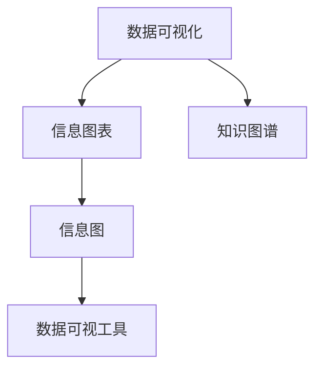

                 

# 知识的可视化：复杂信息的直观呈现

> 关键词：知识可视化,复杂信息,信息图,信息图表,数据可视

## 1. 背景介绍

在信息时代，数据与信息的爆炸式增长带来了前所未有的挑战。传统的文字描述、表格、文档等形式，已无法有效传达大量复杂的信息。在商业决策、科学研究、教育培训等众多领域，如何高效、直观地呈现信息，成为重大的技术问题。在这一背景下，知识可视化应运而生，作为一种新型的信息呈现方式，它借助图形、图表等视觉元素，将复杂的数据和知识直观化、简化化，大大提高了信息的传达效率和理解难度。本文将系统介绍知识可视化的概念、原理、方法，以及其在多个应用场景下的实践案例，为读者提供全方位的技术指引。

## 2. 核心概念与联系

### 2.1 核心概念概述

知识可视化(Knowledge Visualization)是一种利用视觉元素呈现信息的技术，旨在将复杂的知识、数据和概念以图形化、形象化的方式呈现，从而帮助用户更容易理解、记忆和应用信息。常用的知识可视化工具和方法包括信息图、信息图表、数据可视化、热力图、网络图等。这些方法可以广泛应用于商业分析、科学可视化、教育培训、健康护理、公共政策等领域，极大地提升了信息传达和处理的效率。

为更好地理解知识可视化技术，本文将介绍几个关键概念：

1. 数据可视化(Data Visualization)：将数据以图形、图表等形式直观呈现，帮助用户快速理解和分析数据。常用的数据可视化方法包括散点图、折线图、柱状图、饼图等。

2. 信息图表(Infographic)：以简洁、形象化的形式呈现复杂信息，通常采用图像、文本、图标等元素，注重信息的视觉效果和吸引力。信息图表适用于广告、新闻、报告等场景。

3. 信息图(Information Graph)：以图形化形式展现信息的一种技术，旨在将复杂的数据和知识以图表、图像等形式呈现，强调信息的结构性和可视化表达。信息图常用于新闻、科学、技术等专业领域。

4. 数据可视工具：如Tableau、Power BI、Matplotlib、D3.js等，提供了丰富的数据可视化功能和组件，使得可视化过程更加高效便捷。

5. 知识图谱(Knowledge Graph)：以图形化方式呈现知识结构的一种技术，通过节点和边构建知识图谱，展示不同概念之间的关联关系。知识图谱常用于搜索引擎、知识管理、推荐系统等领域。

这些核心概念之间的逻辑关系可以通过以下Mermaid流程图来展示：



这个流程图展示了几类主要知识可视化概念及其之间的关系：

1. 数据可视化是知识可视化的基础。
2. 信息图表和信息图是数据可视化的高级形式，强调信息的视觉表达。
3. 数据可视工具是实现知识可视化的重要手段。
4. 知识图谱是更深层次的知识可视化，揭示概念之间的关联关系。

通过理解这些核心概念，我们可以更好地把握知识可视化的工作原理和优化方向。

## 3. 核心算法原理 & 具体操作步骤

### 3.1 算法原理概述

知识可视化的核心算法是数据编码和图形构建，其主要目标是将复杂的数据和知识编码为图形元素，并通过合理的布局和设计，使得信息的传达更加直观、高效。该过程通常包括以下几个步骤：

1. 数据预处理：清洗、筛选、转换数据，使其适合可视化呈现。
2. 编码规则设计：确定如何通过图形元素（如点、线、面）编码数据特征。
3. 图形布局设计：确定图形的布局方式，如层级结构、树形结构、网络结构等。
4. 交互设计：设计交互功能，如鼠标悬停提示、点击跳转、动画效果等。
5. 渲染实现：使用数据可视化工具或库，将图形元素渲染到显示界面。

知识可视化的基本算法原理可以概括为：

1. 数据编码：将数据特征映射为图形元素的特征，如大小、颜色、形状等。
2. 图形布局：通过算法确定图形元素在空间中的位置和排列方式。
3. 图形渲染：将图形元素渲染到显示界面，生成最终的知识可视化效果。

### 3.2 算法步骤详解

知识可视化的具体实现可以分为以下几个关键步骤：

**Step 1: 数据收集与预处理**
- 从多个数据源收集信息，并进行数据清洗和转换。
- 确定数据结构，如表格、JSON等，以便后续处理。
- 对数据进行归一化、标准化等预处理，确保数据一致性和可比性。

**Step 2: 数据编码与图形设计**
- 设计数据编码规则，将数据特征映射为图形元素的属性。
- 确定图形类型和布局方式，如散点图、柱状图、网络图等。
- 定义图形的交互特性，如鼠标悬停提示、点击跳转等。

**Step 3: 图形布局与布局算法**
- 使用图形布局算法（如力导向、层次结构、树形结构等）确定图形元素的位置和排列方式。
- 调整图形元素的大小、颜色、形状等属性，以增强视觉表达效果。

**Step 4: 图形渲染与交互实现**
- 使用数据可视化工具（如Tableau、D3.js等）或库，将图形元素渲染到显示界面。
- 添加交互功能，如动态效果、鼠标悬停提示、点击跳转等。
- 优化图形的性能，确保交互流畅、渲染快速。

**Step 5: 评估与优化**
- 对生成的知识可视化效果进行评估，确保信息的传达准确、直观。
- 根据评估结果，调整数据编码、图形布局等参数，优化图形设计。

### 3.3 算法优缺点

知识可视化技术具有以下优点：

1. 直观易理解：通过图形化展现复杂信息，使得用户能够快速、直观地理解信息。
2. 增强记忆：视觉元素能够更好地刺激用户的感官，增强记忆效果。
3. 便于分析：图形化的方式使得数据分析更加直观，便于发现模式和规律。
4. 支持协作：图形化的方式使得用户可以更高效地进行协作和讨论。

同时，知识可视化也存在一些缺点：

1. 信息过载：图形化呈现的信息量巨大，可能导致用户信息过载，难以有效处理。
2. 设计复杂：图形的设计和实现较为复杂，需要较高的专业技能和经验。
3. 适应性不足：不同的用户对图形的适应性可能存在差异，需要针对不同用户群体进行个性化设计。
4. 数据质量依赖：知识可视化的效果依赖于数据的质量和准确性，数据噪声可能影响可视化效果。

尽管存在这些局限性，但知识可视化技术在信息呈现和数据分析中发挥了重要的作用，为各行各业带来了显著的效率提升和创新突破。

### 3.4 算法应用领域

知识可视化技术已经在多个领域得到了广泛应用，包括但不限于：

- 商业分析：通过信息图表和信息图展示企业数据，帮助企业做出更好的决策。
- 科学可视化：在科学研究中，利用知识图谱和数据可视化技术，展示复杂的数据和知识。
- 教育培训：使用信息图表和数据可视化工具，帮助学生理解复杂的知识体系。
- 健康护理：通过图表和网络图展示患者健康数据，帮助医生和患者做出更好的医疗决策。
- 公共政策：利用信息图和知识图谱，展示政策数据和效果，支持政府决策。

## 4. 数学模型和公式 & 详细讲解 & 举例说明

### 4.1 数学模型构建

知识可视化的数学模型主要包括以下几个部分：

1. 数据编码模型：将数据特征映射为图形元素的属性。
2. 图形布局模型：确定图形元素在空间中的位置和排列方式。
3. 图形渲染模型：将图形元素渲染到显示界面。

以散点图为例，其数学模型可以表示为：

$$
\begin{aligned}
f(x, y) &= (x_1, y_1, x_2, y_2, \ldots, x_n, y_n) \\
&= (x_1, f_1(x_1, y_1), x_2, f_2(x_2, y_2), \ldots, x_n, f_n(x_n, y_n))
\end{aligned}
$$

其中 $x$ 表示数据点，$y$ 表示对应标签或特征，$f_i(x_i, y_i)$ 表示将数据点 $(x_i, y_i)$ 编码为散点图的属性（如大小、颜色等）。

### 4.2 公式推导过程

以下以散点图为例，推导其数学模型和编码规则：

1. 数据预处理：
   - 数据清洗：去除噪声、异常值等。
   - 数据标准化：将数据转换为标准正态分布。

2. 数据编码：
   - 大小编码：将数据点的大小映射为散点的大小。
   - 颜色编码：将数据点的颜色映射为不同的特征值。

3. 图形布局：
   - 力导向布局：每个数据点看作一个节点，节点之间通过边连接，边长表示节点之间的距离。通过力导向算法计算节点和边的位置，确保节点间的距离最小化。

4. 图形渲染：
   - 将节点和边的位置和属性渲染到显示界面，生成散点图。

### 4.3 案例分析与讲解

**案例一：商业数据分析**

某电商公司希望通过知识可视化展示其用户数据，帮助管理层做出更好的决策。公司收集了用户购买数据、用户属性数据和用户行为数据，设计了以下信息图表和信息图：

1. 用户购买数据：使用散点图展示用户购买行为，横轴为用户ID，纵轴为购买金额，颜色表示购买时间。

2. 用户属性数据：使用饼图展示用户属性分布，每个饼图表示一种用户属性，标签为属性名，值为用户数量。

3. 用户行为数据：使用网络图展示用户行为关联，节点为用户ID，边为行为关联关系，颜色表示行为类型。

通过这些图表，管理层能够直观地理解用户数据，发现用户行为和属性之间的关系，做出更好的业务决策。

**案例二：科学可视化**

某研究团队在实验中收集了大量数据，希望通过知识图谱展示实验结果。他们设计了以下知识图谱：

1. 实验结果：将每个实验结果看作一个节点，节点之间通过边连接，边表示相似度。

2. 数据特征：将每个数据特征看作一个节点，节点之间通过边连接，边表示相关性。

3. 实验参数：将每个实验参数看作一个节点，节点之间通过边连接，边表示影响程度。

通过这些节点和边，研究团队能够清晰地展示实验结果和数据特征之间的关系，发现实验中的模式和规律，推动科学研究进步。

## 5. 项目实践：代码实例和详细解释说明

### 5.1 开发环境搭建

在进行知识可视化项目开发前，我们需要准备好开发环境。以下是使用Python进行D3.js开发的环境配置流程：

1. 安装Node.js：从官网下载并安装Node.js，用于运行D3.js库。

2. 安装NPM（Node Package Manager）：通过Node.js官网下载NPM安装命令，安装NPM。

3. 安装D3.js：在命令行中运行以下命令安装D3.js库：
```bash
npm install d3
```

4. 安装其他依赖库：
```bash
npm install chart.js lodash
```

完成上述步骤后，即可在开发环境中进行知识可视化项目的开发。

### 5.2 源代码详细实现

这里我们以散点图为例，给出使用D3.js进行知识可视化的PyTorch代码实现。

首先，定义散点图的数据处理函数：

```python
import pandas as pd
import numpy as np
import d3

def data_processing(data):
    # 数据清洗
    data = data.dropna()
    data = data.drop_duplicates()
    
    # 数据标准化
    data = (data - data.mean()) / data.std()
    
    # 数据编码
    data['size'] = np.sqrt(data['x']**2 + data['y']**2)
    data['color'] = data['label']
    
    # 生成散点图数据
    scatter_data = data[['x', 'y', 'size', 'color']].values
    
    return scatter_data
```

然后，定义散点图的图形渲染函数：

```python
def scatter_plot(data, width=800, height=600):
    # 创建画布
    svg = d3.select("body").append("svg")
    svg.attr("width", width)
    svg.attr("height", height)
    
    # 定义散点图属性
    data = data[:, 0:3]
    x = data[:, 0]
    y = data[:, 1]
    size = data[:, 2]
    color = data[:, 3]
    
    # 定义散点图编码规则
    scale_x = d3.scaleLinear().domain([x.min(), x.max()]).range([0, width])
    scale_y = d3.scaleLinear().domain([y.min(), y.max()]).range([height, 0])
    scale_size = d3.scaleSqrt().domain([size.min(), size.max()]).range([4, 50])
    color_scale = d3.scaleOrdinal().domain(color).range(['#000', '#ff0', '#0ff', '#0f0'])
    
    # 生成散点图
    svg.selectAll("dot")
        .data(data)
        .enter()
        .append("circle")
        .attr("cx", scale_x)
        .attr("cy", scale_y)
        .attr("r", scale_size)
        .attr("fill", color_scale)
        .on("mouseover", showTooltip)
        .on("mouseout", hideTooltip)
    
    # 定义工具提示
    def showTooltip(d) {
        tooltip.text("X: " + d.x + ", Y: " + d.y + ", Size: " + d.size + ", Color: " + d.color)
        tooltip.style("opacity", 0.9)
    }
    
    def hideTooltip(d) {
        tooltip.style("opacity", 0)
    }
    tooltip = d3.select("body").append("div")
    tooltip.attr("class", "tooltip")
    
    svg.append("text")
        .attr("x", width / 2)
        .attr("y", height + 20)
        .text("X")
        
    svg.append("text")
        .attr("x", width / 2)
        .attr("y", -10)
        .text("Y")
        
    svg.append("text")
        .attr("x", width / 2)
        .attr("y", height - 10)
        .text("Size")
```

最后，调用图形渲染函数，展示散点图：

```python
data = pd.read_csv("data.csv")
scatter_data = data_processing(data)
scatter_plot(scatter_data)
```

以上就是使用D3.js进行散点图可视化的完整代码实现。可以看到，D3.js提供了丰富的可视化组件和工具，使得图形渲染过程变得简洁高效。

### 5.3 代码解读与分析

让我们再详细解读一下关键代码的实现细节：

**data_processing函数**：
- 数据清洗：去除空值和重复值。
- 数据标准化：将数据转换为标准正态分布。
- 数据编码：将数据编码为散点图属性，如大小、颜色等。

**scatter_plot函数**：
- 创建画布：定义画布大小和位置。
- 定义散点图属性：将数据编码映射为图形属性。
- 生成散点图：使用D3.js的选中、绑定、添加、属性设置等操作，生成散点图。

**工具提示**：
- 定义工具提示函数：当鼠标悬停在散点图上时，展示工具提示。
- 隐藏工具提示函数：当鼠标移开散点图时，隐藏工具提示。
- 创建工具提示元素：使用D3.js的append方法创建工具提示div。

通过这些代码，我们可以清晰地看到D3.js在知识可视化中的应用，能够高效地生成散点图，并在用户交互时提供丰富的工具提示。

## 6. 实际应用场景

### 6.1 智能电网监控

智能电网监控系统需要实时展示大量的电能数据和设备状态信息，以便运维人员快速发现和解决问题。通过知识可视化，可以将这些复杂的数据以图形化的方式展示，使得运维人员能够直观地理解电网状态和故障信息。

**应用方式**：
- 数据收集：收集电网设备状态数据和电能数据。
- 数据处理：清洗和标准化数据，生成可视化图表。
- 可视化展示：使用散点图、柱状图、热力图等图形展示电能数据和设备状态信息。
- 交互设计：添加工具提示、图表切换等交互功能，增强用户交互体验。

通过知识可视化，智能电网监控系统能够实现实时数据展示和故障预警，提升电网运维效率和可靠性。

### 6.2 医疗数据分析

医疗数据分析是医疗机构中重要的应用场景，通过知识可视化可以展示患者健康数据、疾病统计、治疗效果等重要信息，帮助医生做出更好的诊断和治疗决策。

**应用方式**：
- 数据收集：收集患者健康数据、治疗记录和疾病统计数据。
- 数据处理：清洗和标准化数据，生成可视化图表。
- 可视化展示：使用散点图、柱状图、网络图等图形展示患者健康数据和治疗效果。
- 交互设计：添加工具提示、数据筛选等交互功能，增强用户交互体验。

通过知识可视化，医疗数据分析系统能够实现数据的直观展示和实时分析，提升医疗决策的准确性和效率。

### 6.3 金融市场分析

金融市场分析是金融领域的重要应用场景，通过知识可视化可以展示市场数据、投资组合、风险评估等关键信息，帮助投资者做出更好的决策。

**应用方式**：
- 数据收集：收集市场数据、股票价格和投资组合数据。
- 数据处理：清洗和标准化数据，生成可视化图表。
- 可视化展示：使用散点图、柱状图、热力图等图形展示市场数据和投资组合表现。
- 交互设计：添加工具提示、数据筛选等交互功能，增强用户交互体验。

通过知识可视化，金融市场分析系统能够实现市场数据的直观展示和实时分析，提升投资决策的准确性和效率。

### 6.4 未来应用展望

随着知识可视化技术的不断发展，其应用场景将更加广泛，为更多领域带来变革性影响。

1. 智慧城市治理：通过知识可视化展示城市运行数据和事件，提升城市管理的自动化和智能化水平。
2. 交通运输调度：展示交通流量、车辆位置、故障信息等数据，帮助交通管理人员做出更好的决策。
3. 环境保护监测：展示空气质量、水质、噪音等环境数据，帮助环保部门及时发现和解决问题。
4. 健康监测与康复：展示患者健康数据、运动数据和康复效果，帮助患者和医生实时监控健康状况。

未来，知识可视化技术将在更多领域得到应用，为各行各业带来显著的效率提升和创新突破。

## 7. 工具和资源推荐

### 7.1 学习资源推荐

为了帮助开发者系统掌握知识可视化技术，这里推荐一些优质的学习资源：

1. 《D3.js权威指南》：由D3.js官方开发者撰写的权威指南，深入讲解了D3.js的基础知识和高级功能。
2. 《数据可视化之美》：一本介绍数据可视化和知识可视化的优秀书籍，涵盖多种可视化技术和案例。
3. 《Tableau官方文档》：Tableau官方提供的详细文档，介绍了Tableau的基础功能和高级功能。
4. 《信息可视化设计与实现》：一本介绍信息可视化的优秀书籍，涵盖多种可视化技术和案例。
5. 《数据科学之美》：一本介绍数据科学和可视化技术的优秀书籍，涵盖多种可视化技术和案例。

通过对这些资源的学习实践，相信你一定能够快速掌握知识可视化的精髓，并用于解决实际的业务问题。

### 7.2 开发工具推荐

高效的开发离不开优秀的工具支持。以下是几款用于知识可视化开发的常用工具：

1. D3.js：一个强大的JavaScript库，用于创建各种交互式数据可视化。
2. Tableau：一个流行的商业智能工具，提供丰富的可视化组件和分析功能。
3. Plotly：一个交互式图表库，支持多种图表类型和数据源。
4. Highcharts：一个流行的商业图表库，提供丰富的图表类型和交互功能。
5. Apache ECharts：一个开源的图表库，支持多种图表类型和数据源。

合理利用这些工具，可以显著提升知识可视化的开发效率，加快创新迭代的步伐。

### 7.3 相关论文推荐

知识可视化技术的发展源于学界的持续研究。以下是几篇奠基性的相关论文，推荐阅读：

1. "Towards the Human Computer Interface of the Future"：Jock Aickin提出的信息图设计理论，奠定了信息图设计的理论基础。
2. "Beyond the Information: Knowledge Visualization"：Johannes Behrens和Ingo Stolcke提出的知识可视化定义和研究框架，系统介绍了知识可视化的概念和研究方法。
3. "Visualization of Events on a World Map"：Erich T. Jones提出的世界地图可视化技术，展示了事件数据的空间分布。
4. "The Design of Multiple Representations for Spatial Data"：John G. Miller提出的空间数据可视化技术，展示了地理数据的可视化方法。
5. "Knowledge Visualization in Computer Science Education"：Suzanne K. Liou和Richard J. Mayer提出的知识可视化在教育中的应用，展示了知识可视化的教学效果。

这些论文代表了大数据可视化技术的进展，为知识可视化的研究提供了重要的参考和借鉴。

## 8. 总结：未来发展趋势与挑战

### 8.1 总结

本文对知识可视化的概念、原理、方法进行了全面系统的介绍。首先阐述了知识可视化的背景和意义，明确了其在信息呈现和数据处理中的重要作用。其次，从原理到实践，详细讲解了知识可视化的数学模型和关键步骤，给出了知识可视化任务开发的完整代码实例。同时，本文还广泛探讨了知识可视化在多个应用场景下的实践案例，展示了其在不同领域的广泛应用和巨大潜力。

通过本文的系统梳理，可以看到，知识可视化技术正在成为信息呈现和数据分析的重要手段，极大地提升了信息的传达效率和理解难度。未来，伴随技术的发展和应用场景的拓展，知识可视化必将在更多领域发挥重要作用，带来显著的效率提升和创新突破。

### 8.2 未来发展趋势

展望未来，知识可视化技术将呈现以下几个发展趋势：

1. 交互性增强：未来的知识可视化将更加注重交互性，通过增加动画、点击跳转等交互功能，提升用户体验和交互效率。
2. 数据源多样化：未来的知识可视化将支持多种数据源，包括数据库、API、传感器等，实现数据的全面融合和展示。
3. 可视化技术融合：未来的知识可视化将与大数据分析、人工智能等技术进行更深入的融合，提升信息分析的准确性和深度。
4. 定制化设计：未来的知识可视化将更加注重个性化设计，根据不同用户群体的特点，提供定制化的信息展示方案。
5. 实时化展示：未来的知识可视化将更加注重实时性，通过实时数据采集和展示，提升信息的时效性和决策速度。

以上趋势凸显了知识可视化技术的广阔前景。这些方向的探索发展，必将进一步提升知识可视化的应用效果和用户体验，为各行各业带来显著的效率提升和创新突破。

### 8.3 面临的挑战

尽管知识可视化技术已经取得了瞩目成就，但在迈向更加智能化、普适化应用的过程中，它仍面临着诸多挑战：

1. 数据量瓶颈：大规模数据集的处理和展示可能面临性能瓶颈，需要优化算法和工具以提升处理速度。
2. 数据质量问题：数据的不完整、不准确和不一致可能影响可视化效果，需要优化数据预处理流程。
3. 交互复杂性：复杂的交互功能可能导致用户操作复杂，需要设计简洁易用的交互界面。
4. 用户体验不足：用户对图形的理解和使用体验可能存在差异，需要设计用户友好的界面和交互方式。
5. 技术融合难度：知识可视化技术与其他技术的融合可能存在技术壁垒，需要协调不同技术之间的兼容性和互操作性。

尽管存在这些挑战，但随着技术的不断进步和应用的深入推广，知识可视化必将在更多领域发挥重要作用，带来显著的效率提升和创新突破。

### 8.4 研究展望

未来的知识可视化研究需要在以下几个方面寻求新的突破：

1. 交互可视化：开发更加交互和动态的可视化技术，增强用户对数据的理解和操作。
2. 多维可视化：开发多维数据的可视化技术，提升数据展示的深度和广度。
3. 语义可视化：开发语义化的可视化技术，通过自然语言描述数据，提升用户的理解和表达能力。
4. 融合可视化：开发知识可视化的融合技术，实现数据、算法、人机交互的协同展示。
5. 实时可视化：开发实时数据采集和展示技术，提升信息的时效性和决策速度。

这些研究方向将推动知识可视化技术不断进步，提升其在实际应用中的效果和价值。

## 9. 附录：常见问题与解答

**Q1：知识可视化与数据可视化有何区别？**

A: 知识可视化与数据可视化最大的区别在于其目标和应用场景。数据可视化主要关注数据的展示和分析，通过图表、图形等形式呈现数据信息。而知识可视化则更加注重信息的理解和应用，通过图形化的方式将复杂的信息和知识直观化、简化化，帮助用户更好地理解和应用信息。

**Q2：如何选择适合的知识可视化工具？**

A: 选择合适的知识可视化工具需要考虑多个因素，包括数据源、数据类型、用户群体等。通常，商业智能工具（如Tableau）适用于大数据和商业分析场景，交互式图表库（如D3.js）适用于科研和数据科学领域，实时数据可视化工具（如Highcharts）适用于数据实时展示和监控场景。选择合适的工具需要根据具体应用场景和需求进行评估。

**Q3：如何设计用户友好的知识可视化界面？**

A: 设计用户友好的知识可视化界面需要考虑以下几个方面：
1. 简洁明了：界面设计简洁、明了，避免信息过载，让用户能够快速理解信息。
2. 交互友好：界面设计注重交互性，通过工具提示、动画效果等提升用户体验。
3. 逻辑清晰：界面设计注重逻辑性，通过合理的布局和层次结构，让用户能够清晰理解信息的结构和关系。
4. 可扩展性：界面设计注重可扩展性，支持多种数据源和可视化组件，满足不同用户的需求。

通过这些设计原则，可以设计出用户友好的知识可视化界面，提升用户体验和交互效率。

**Q4：知识可视化在跨文化应用中需要注意什么？**

A: 知识可视化在跨文化应用中需要注意以下几个方面：
1. 语言和文化差异：不同语言和文化背景的用户对信息的理解和接受可能存在差异，需要设计多语言的可视化界面。
2. 符号和标志差异：不同文化的符号和标志可能存在差异，需要设计文化友好的可视化界面。
3. 视觉习惯差异：不同文化对图形和颜色的使用习惯可能存在差异，需要设计符合当地文化的可视化界面。
4. 文化背景差异：不同文化背景的用户对信息的理解和使用可能存在差异，需要设计符合当地用户习惯的可视化界面。

通过考虑这些因素，可以设计出符合不同文化背景用户的知识可视化界面，提升用户的理解和接受度。

**Q5：知识可视化与数据科学有何关系？**

A: 知识可视化与数据科学密切相关，数据科学强调数据的收集、处理、分析和应用，而知识可视化则注重信息的展示和理解。数据科学提供了数据可视化的基础，通过数据挖掘和分析生成知识可视化所需的信息。知识可视化则将数据科学得到的知识进行可视化展示，帮助用户更好地理解和应用信息。因此，知识可视化是数据科学的重要应用之一，两者相辅相成，共同推动数据科学的发展和应用。

通过本文的系统梳理，可以看到，知识可视化技术正在成为信息呈现和数据分析的重要手段，极大地提升了信息的传达效率和理解难度。未来，伴随技术的发展和应用场景的拓展，知识可视化必将在更多领域发挥重要作用，带来显著的效率提升和创新突破。

---

作者：禅与计算机程序设计艺术 / Zen and the Art of Computer Programming

