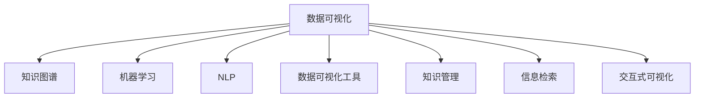

                 

# 知识的可视化：数据可视化技术在理解中的应用

> 关键词：数据可视化, 知识图谱, 机器学习, 自然语言处理, 数据可视化工具, 知识管理, 信息检索, 交互式可视化

## 1. 背景介绍

随着信息时代的到来，数据已成为一个重要的战略资源。企业、政府、科研机构等组织所产生的海量数据，包含着丰富的知识和洞见。然而，这些数据往往散落在不同的数据源中，格式各异，结构复杂，难以直接使用。数据可视化技术，作为一种将数据转换为图形的形式进行展示的方法，能够帮助人们直观、有效地理解数据的含义，从中提取出有价值的知识和洞见。

### 1.1 问题由来

在信息爆炸的时代，每天产生的数据量已经远超人类的认知能力。企业、政府、科研机构等组织都面临着如何从海量数据中提取有用的信息，做出科学决策的问题。数据可视化技术通过图形化的方式，将复杂的数据转化为直观的信息，帮助人们快速理解数据，发现隐藏在数据背后的规律和洞见。

### 1.2 问题核心关键点

数据可视化技术通过将数据转化为图形的形式进行展示，帮助人们直观、有效地理解数据的含义，从中提取出有价值的知识和洞见。其关键点包括：

- 数据的收集与整理：从不同来源收集数据，并对数据进行清洗、转换，以便进行可视化展示。
- 可视化设计：选择合适的可视化工具和方式，将数据转化为图形的形式。
- 分析与解读：通过可视化图表，发现数据背后的规律和洞见，指导实际决策。
- 交互与展示：通过交互式可视化技术，使得用户能够通过交互操作，更深入地探索数据的细节和变化。

## 2. 核心概念与联系

### 2.1 核心概念概述

为了更好地理解数据可视化技术的应用，本节将介绍几个密切相关的核心概念：

- 数据可视化(Data Visualization)：将数据转化为图形的形式进行展示，以直观、有效地传达信息的一种技术。常见的可视化形式包括柱状图、折线图、散点图等。
- 知识图谱(Knowledge Graph)：一种用于表示实体与实体之间关系的图结构，通过语义化的方式对知识进行建模，支持复杂的推理和搜索。
- 机器学习(Machine Learning)：通过数据驱动的方法，让计算机自动从数据中学习规律，用于预测和决策等任务。
- 自然语言处理(Natural Language Processing, NLP)：让计算机理解和处理人类语言的技术，包括文本分类、情感分析、信息检索等。
- 数据可视化工具：如Tableau、Power BI、D3.js等，提供了一系列的可视化组件和API，方便用户进行数据展示和分析。
- 知识管理(Knowledge Management)：通过知识库、文档库等工具，对知识进行收集、存储、共享和利用。
- 信息检索(Information Retrieval)：通过算法从大量文本数据中提取有用信息，帮助用户快速找到需要的数据和知识。
- 交互式可视化(Interactive Visualization)：通过交互式界面，让用户能够对数据进行更深入的探索和分析。

这些核心概念之间的逻辑关系可以通过以下Mermaid流程图来展示：



这个流程图展示了几大核心概念之间的相互关系：

1. 数据可视化是数据展示和分析的基础，通过图形化的方式将数据转换为可理解的信息。
2. 知识图谱用于建模知识结构，支持复杂的推理和搜索。
3. 机器学习通过数据驱动的方式，挖掘数据的潜在规律和洞见。
4. NLP技术帮助计算机理解和处理人类语言，支持文本分类、情感分析等任务。
5. 数据可视化工具提供了可视化组件和API，方便用户进行数据展示和分析。
6. 知识管理通过对知识的收集、存储和共享，支持知识的传递和利用。
7. 信息检索帮助用户从大量文本数据中提取有用的信息。
8. 交互式可视化提供了交互界面，支持用户对数据的深入探索和分析。

## 3. 核心算法原理 & 具体操作步骤

### 3.1 算法原理概述

数据可视化技术基于图形化的方式将数据转换为直观的信息，用于帮助人们理解数据的含义，从中提取出有价值的知识和洞见。其核心思想是：将数据转化为图形化的形式，利用图形元素（如点、线、面等）进行展示，从而帮助人们直观、有效地理解数据的结构和规律。

### 3.2 算法步骤详解

数据可视化技术的应用通常包括以下几个关键步骤：

**Step 1: 数据收集与整理**
- 从不同数据源收集数据，包括数据库、文本文件、API接口等。
- 对数据进行清洗和预处理，包括去除噪声、填充缺失值、转换数据格式等。

**Step 2: 可视化设计**
- 选择合适的可视化工具和方式，将数据转化为图形的形式。常见的可视化形式包括柱状图、折线图、散点图、地图、热力图等。
- 设计图表布局，选择合适的颜色、字体、标签等，使图表更美观、易读。

**Step 3: 数据展示**
- 通过可视化图表，展示数据的关键指标、趋势、关系等。
- 利用交互式界面，让用户能够通过交互操作，深入探索数据的细节和变化。

**Step 4: 分析与解读**
- 通过可视化图表，发现数据背后的规律和洞见。
- 结合实际业务场景，提出有针对性的建议和决策。

### 3.3 算法优缺点

数据可视化技术在应用中具有以下优点：
1. 直观易读：通过图形化的方式，使数据更加直观、易读，帮助人们快速理解数据。
2. 展示多样：支持多种图形形式的展示，满足不同数据类型的展示需求。
3. 交互性强：利用交互式界面，使得用户能够通过交互操作，深入探索数据的细节和变化。

同时，该技术也存在一定的局限性：
1. 数据质量依赖：可视化结果的准确性高度依赖于数据的质量，如果数据存在噪声或异常，可能会导致误导性的结果。
2. 可视化选择：选择合适的可视化方式和工具，需要一定的专业知识和经验。
3. 复杂数据处理：对于复杂的数据结构和高维数据，需要进行适当的降维和处理，才能进行有效的可视化展示。
4. 可解释性不足：部分复杂图形的可视化结果，可能难以直观理解其含义，需要进行详细的解读。

尽管存在这些局限性，但就目前而言，数据可视化技术仍然是理解数据的重要手段。未来相关研究的重点在于如何进一步提升可视化工具的易用性和自动化程度，降低数据可视化的门槛。

### 3.4 算法应用领域

数据可视化技术在多个领域得到了广泛的应用，包括但不限于：

- 金融分析：展示股票、期货、外汇等金融数据的变化趋势、波动情况等。
- 市场营销：展示客户行为、广告投放效果、销售趋势等，帮助企业制定营销策略。
- 医疗健康：展示患者数据、疾病流行趋势、治疗效果等，支持医生和科研人员的研究。
- 城市规划：展示交通流量、人口分布、能源消耗等，支持城市规划和管理。
- 环境保护：展示空气质量、水质、气候变化等，支持环境保护和污染治理。
- 公共安全：展示犯罪率、灾害预警、应急响应等，支持公共安全管理和决策。

除了上述这些经典应用外，数据可视化技术还被创新性地应用到更多场景中，如数据科学、商业智能、智能制造等，为各行业提供了强大的数据分析和决策支持。

## 4. 数学模型和公式 & 详细讲解 & 举例说明

### 4.1 数学模型构建

数据可视化的核心数学模型是将数据转换为图形形式，用于展示数据的结构和规律。常见的数学模型包括：

- 散点图：用于展示两个变量之间的关系。
- 折线图：用于展示数据随时间变化的趋势。
- 柱状图：用于展示各组别数据的比较。
- 热力图：用于展示数据的分布情况。
- 地图：用于展示地理区域内的数据分布情况。

### 4.2 公式推导过程

以散点图为例，其数学模型可以通过以下公式推导：

$$
x_i, y_i \in \mathbb{R}^n, \quad \forall i \in [1, N]
$$

$$
\mathcal{D} = \{(x_i, y_i)\}_{i=1}^N
$$

$$
g(x, y) = f(x_i, y_i) + \epsilon
$$

其中 $(x_i, y_i)$ 表示数据点，$N$ 表示数据点个数，$f(x_i, y_i)$ 表示数据点之间的函数关系，$\epsilon$ 表示噪声。

通过散点图将数据点可视化，可以直观地展示数据点之间的分布情况和函数关系。例如，对于一个医疗健康数据集，可以通过散点图展示患者年龄与病情的分布情况，发现规律和趋势。

### 4.3 案例分析与讲解

以一个电商数据可视化案例为例，展示数据可视化技术在实际应用中的应用。

#### 4.3.1 数据准备

假设某电商平台拥有多年的销售数据，包括用户的购买行为、产品销量、地区分布等。这些数据分布在不同的数据源中，格式各异，需要进行清洗和预处理。

1. 数据收集：从数据库、文本文件、API接口等不同数据源中收集数据。
2. 数据清洗：去除噪声、填充缺失值、转换数据格式等。

#### 4.3.2 可视化设计

根据电商数据的特点，选择合适的可视化方式。

1. 数据类型：销售数据通常以数值为主，适合使用折线图、柱状图、热力图等进行展示。
2. 数据关系：不同产品、用户、地区之间的数据关系较为复杂，适合使用知识图谱进行建模。

#### 4.3.3 数据展示

通过可视化图表，展示电商数据的关键指标、趋势、关系等。

1. 产品销量趋势：使用折线图展示各产品的销量变化趋势，发现热销产品和季节性变化。
2. 用户购买行为：使用散点图展示用户购买行为，发现购买频率和消费金额的关系。
3. 地区分布：使用热力图展示各地区的销售情况，发现销售热点和冷点。
4. 关联关系：使用知识图谱展示不同产品、用户、地区之间的关系，发现潜在的关联和规律。

#### 4.3.4 分析与解读

通过可视化图表，发现数据背后的规律和洞见，指导实际决策。

1. 产品热销分析：发现热销产品并分析原因，帮助平台优化商品库存。
2. 用户行为分析：发现高价值用户并分析行为，制定针对性的营销策略。
3. 地区分布分析：发现销售热点并优化渠道布局，提升销售业绩。
4. 关联关系分析：发现潜在的关联和规律，优化供应链和营销策略。

## 5. 项目实践：代码实例和详细解释说明

### 5.1 开发环境搭建

在进行数据可视化实践前，我们需要准备好开发环境。以下是使用Python进行D3.js开发的环境配置流程：

1. 安装Node.js：从官网下载并安装Node.js，用于运行JavaScript代码。
2. 安装D3.js：通过npm安装D3.js库，方便在HTML中进行可视化操作。
3. 创建HTML页面：使用文本编辑器创建一个HTML文件，用于展示可视化图表。

完成上述步骤后，即可在Web环境中开始数据可视化实践。

### 5.2 源代码详细实现

这里我们以电商销售数据可视化为例，给出使用D3.js对数据进行可视化的Python代码实现。

首先，定义数据处理函数：

```python
import pandas as pd
import numpy as np

def load_data(filename):
    data = pd.read_csv(filename)
    # 数据清洗
    data = data.dropna(subset=['销量'])
    data['sales'] = data['sales'].astype('int')
    return data

def prepare_data(data):
    # 按照产品分类聚合数据
    grouped_data = data.groupby('产品')['销量'].sum().reset_index()
    return grouped_data

# 加载数据
data = load_data('sales_data.csv')
grouped_data = prepare_data(data)
```

然后，定义可视化函数：

```python
from d3 import *

def render_scatterplot(data):
    # 设置画布
    svg = canvas('scatterplot', 800, 600)
    
    # 定义散点图
    scatter = svg.circle(data)
    
    # 添加标签
    labels = svg.text('销量', 40, 20, font_size=12)
```

最后，启动可视化流程并在浏览器中展示：

```python
render_scatterplot(grouped_data)
```

以上就是使用D3.js对电商销售数据进行可视化的完整代码实现。可以看到，利用D3.js，我们可以轻松地在Web中进行复杂的数据可视化，展示了电商数据的结构和趋势。

### 5.3 代码解读与分析

让我们再详细解读一下关键代码的实现细节：

**load_data函数**：
- 使用pandas库加载数据文件，并进行基本的清洗和转换。

**prepare_data函数**：
- 按照产品分类聚合数据，计算各产品的销量总和，方便后续进行可视化展示。

**render_scatterplot函数**：
- 使用D3.js库创建一个画布，定义散点图，添加标签。
- 在散点图上展示数据点，并添加标签，以便用户查看具体数值。

可以看到，D3.js提供了一系列的可视化组件和API，使得数据可视化变得非常简洁和灵活。开发者可以利用这些组件，实现多种复杂的数据展示效果。

当然，工业级的系统实现还需考虑更多因素，如数据的动态更新、用户交互效果、数据安全性等。但核心的可视化范式基本与此类似。

## 6. 实际应用场景

### 6.1 智能城市管理

智能城市管理依赖于大量的监控数据，包括交通流量、环境污染、公共安全等。通过数据可视化技术，可以实时监测和展示这些数据，帮助城市管理者及时发现问题并做出决策。

在技术实现上，可以收集城市各区域的传感器数据，利用地理信息系统(GIS)进行空间定位，再通过可视化工具进行展示。例如，可以使用地图和热力图展示交通流量和环境污染情况，帮助管理者优化交通布局和环境保护措施。

### 6.2 智慧医疗

智慧医疗涉及大量的患者数据和医学影像数据，通过数据可视化技术，可以实时展示和分析这些数据，帮助医生和科研人员进行疾病诊断和治疗研究。

在技术实现上，可以收集患者数据和医学影像，利用知识图谱进行建模，再通过可视化工具进行展示。例如，可以使用散点图展示患者病情的分布情况，帮助医生发现潜在的疾病模式和趋势。

### 6.3 金融风险控制

金融行业涉及大量的交易数据和市场信息，通过数据可视化技术，可以实时展示和分析这些数据，帮助金融从业者进行风险控制和投资决策。

在技术实现上，可以收集交易数据和市场信息，利用时间序列分析等方法进行展示，再通过可视化工具进行展示。例如，可以使用折线图展示股票价格的变化趋势，帮助投资者进行买卖决策。

### 6.4 未来应用展望

随着数据可视化技术的不断发展，其应用场景将不断扩展，带来更多创新和突破：

1. 全息可视化：利用虚拟现实(VR)、增强现实(AR)等技术，展示三维立体的数据可视化效果，提升用户体验。
2. 智能可视化：利用机器学习和自然语言处理技术，根据用户需求和兴趣，自动推荐合适的可视化方式。
3. 动态可视化：实时展示和更新数据变化，提供动态的可视化效果，帮助用户更好地理解数据。
4. 多模态可视化：结合图像、视频、音频等多模态数据，展示更丰富的信息，提高数据理解的全面性。
5. 跨领域可视化：跨学科融合的数据可视化，展示不同领域之间的关联和规律，支持跨领域的知识探索。

这些趋势将使得数据可视化技术更加智能化、普适化，为用户提供更好的数据理解体验，推动更多领域的数字化转型。

## 7. 工具和资源推荐

### 7.1 学习资源推荐

为了帮助开发者系统掌握数据可视化技术的理论基础和实践技巧，这里推荐一些优质的学习资源：

1. 《数据可视化理论与实践》系列博文：由数据可视化专家撰写，深入浅出地介绍了数据可视化的基本概念和前沿技术。
2. 《D3.js官方文档》：D3.js的官方文档，提供了丰富的可视化组件和API，是学习D3.js的必备资料。
3. 《Tableau教程》：Tableau官方提供的免费教程，介绍了如何使用Tableau进行数据可视化和分析。
4. 《Python数据可视化》书籍：介绍如何使用Python进行数据可视化的书籍，包括Matplotlib、Seaborn等库的使用。
5. 《Kaggle数据可视化竞赛》：参加Kaggle的数据可视化竞赛，可以锻炼实战技能，学习最佳实践。

通过对这些资源的学习实践，相信你一定能够快速掌握数据可视化技术的精髓，并用于解决实际的数据问题。

### 7.2 开发工具推荐

高效的数据可视化离不开优秀的工具支持。以下是几款用于数据可视化开发的常用工具：

1. D3.js：一款基于JavaScript的可视化库，支持丰富的图形组件和交互效果，是Web数据可视化的利器。
2. Tableau：一款流行的数据可视化工具，支持拖放操作和交互式分析，适用于企业级应用。
3. Matplotlib：一款Python的可视化库，支持各种图形组件和自定义样式，是数据科学项目中常用的工具。
4. Seaborn：一款基于Matplotlib的高级可视化库，支持复杂的数据可视化效果，易于使用。
5. Power BI：微软推出的数据可视化工具，支持丰富的可视化组件和交互式分析，适合企业级应用。
6. Plotly：一款Python和R语言的数据可视化库，支持各种图形组件和交互效果，适合科学计算和数据分析。

合理利用这些工具，可以显著提升数据可视化开发的效率，加速创新迭代的步伐。

### 7.3 相关论文推荐

数据可视化技术的发展源于学界的持续研究。以下是几篇奠基性的相关论文，推荐阅读：

1. "A Survey on Data Visualization Techniques and Tools"：介绍数据可视化技术的演变和最新进展。
2. "Interactive Data Visualization for Large Datasets"：介绍交互式数据可视化的关键技术和实现方法。
3. "Voyager: Scalable, Interactive, and Collaborative Web-Based Data Visualization"：介绍Web数据可视化的关键技术和实现方法。
4. "The Design of Data Visualization in Scientific Publications"：介绍数据可视化设计的基本原则和最佳实践。
5. "Dynamic Data Visualization with D3.js"：介绍D3.js库的实现原理和最佳实践。

这些论文代表了大数据可视化技术的发展脉络。通过学习这些前沿成果，可以帮助研究者把握学科前进方向，激发更多的创新灵感。

## 8. 总结：未来发展趋势与挑战

### 8.1 总结

本文对数据可视化技术进行了全面系统的介绍。首先阐述了数据可视化技术的背景和意义，明确了数据可视化在理解和分析数据中的重要作用。其次，从原理到实践，详细讲解了数据可视化的数学模型和关键步骤，给出了数据可视化任务开发的完整代码实例。同时，本文还广泛探讨了数据可视化技术在多个行业领域的应用前景，展示了其广阔的发展空间。

通过本文的系统梳理，可以看到，数据可视化技术在数据理解和分析中扮演了至关重要的角色，其应用领域正在不断扩展，推动了各行各业的数字化转型。未来，伴随数据可视化技术的不断发展，更多的创新和突破将不断涌现，数据可视化的价值和影响力将进一步提升。

### 8.2 未来发展趋势

展望未来，数据可视化技术将呈现以下几个发展趋势：

1. 全息可视化：利用虚拟现实(VR)、增强现实(AR)等技术，展示三维立体的数据可视化效果，提升用户体验。
2. 智能可视化：利用机器学习和自然语言处理技术，根据用户需求和兴趣，自动推荐合适的可视化方式。
3. 动态可视化：实时展示和更新数据变化，提供动态的可视化效果，帮助用户更好地理解数据。
4. 多模态可视化：结合图像、视频、音频等多模态数据，展示更丰富的信息，提高数据理解的全面性。
5. 跨领域可视化：跨学科融合的数据可视化，展示不同领域之间的关联和规律，支持跨领域的知识探索。

这些趋势将使得数据可视化技术更加智能化、普适化，为用户提供更好的数据理解体验，推动更多领域的数字化转型。

### 8.3 面临的挑战

尽管数据可视化技术已经取得了瞩目成就，但在迈向更加智能化、普适化应用的过程中，它仍面临着诸多挑战：

1. 数据质量依赖：可视化结果的准确性高度依赖于数据的质量，如果数据存在噪声或异常，可能会导致误导性的结果。
2. 可视化选择：选择合适的可视化方式和工具，需要一定的专业知识和经验。
3. 复杂数据处理：对于复杂的数据结构和高维数据，需要进行适当的降维和处理，才能进行有效的可视化展示。
4. 可解释性不足：部分复杂图形的可视化结果，可能难以直观理解其含义，需要进行详细的解读。
5. 交互性不足：部分可视化工具的交互性有限，无法满足用户的多样化需求。

尽管存在这些挑战，但通过不断的技术创新和应用实践，这些挑战终将得到解决，数据可视化技术必将迎来更加广阔的发展前景。

### 8.4 研究展望

面对数据可视化技术所面临的挑战，未来的研究需要在以下几个方面寻求新的突破：

1. 探索自动化可视化方法：利用机器学习和自然语言处理技术，自动推荐合适的可视化方式，降低用户的使用门槛。
2. 开发高维数据可视化技术：针对复杂和高维数据，开发高效的可视化方法，提高可视化效果和效率。
3. 引入交互式技术：利用交互式界面，增强用户对数据的探索和分析能力。
4. 融合多模态数据：结合图像、视频、音频等多模态数据，展示更丰富的信息，提高数据理解的全面性。
5. 提高可视化可解释性：利用可解释性技术，提高可视化结果的可理解性和可解释性。

这些研究方向将引领数据可视化技术迈向更高的台阶，为构建更智能、更普适的数据可视化系统提供新的动力。总之，数据可视化技术还需要与其他人工智能技术进行更深入的融合，如知识表示、因果推理、强化学习等，多路径协同发力，共同推动数据可视化技术的发展。

## 9. 附录：常见问题与解答

**Q1：数据可视化是否适用于所有数据类型？**

A: 数据可视化技术适用于大部分数据类型，包括数值数据、文本数据、时间序列数据等。但对于一些特殊的数据类型，如基因组数据、网络数据等，需要结合特定的可视化技术进行处理。

**Q2：数据可视化是否会影响数据隐私？**

A: 数据可视化过程中，需要注意数据隐私和保密。例如，在展示敏感数据时，需要进行脱敏处理，避免泄露隐私信息。同时，需要设置合理的访问权限，防止未授权的访问。

**Q3：如何选择适合的可视化方式？**

A: 选择适合的可视化方式需要考虑多个因素，包括数据类型、数据关系、用户需求等。一般可以通过以下步骤进行选择：
1. 数据类型：根据数据的类型选择合适的可视化方式，如柱状图、折线图、散点图等。
2. 数据关系：根据数据之间的关系选择合适的可视化方式，如知识图谱、关联图等。
3. 用户需求：根据用户的需求和背景，选择适合的可视化方式，如交互式可视化、动态可视化等。

**Q4：如何进行数据可视化的自动化？**

A: 数据可视化的自动化可以通过以下几个方面实现：
1. 自动化数据预处理：使用自动化工具进行数据清洗、转换等预处理工作，减少人工干预。
2. 自动化可视化设计：利用机器学习和自然语言处理技术，自动推荐合适的可视化方式。
3. 自动化可视化展示：使用交互式界面和动态效果，实现自动化的数据展示和更新。

这些自动化技术将大幅提升数据可视化的效率和准确性，降低用户的使用门槛。

**Q5：数据可视化是否需要大量的技术知识？**

A: 数据可视化技术虽然具有一定的技术门槛，但通过学习相关的工具和库，可以轻松上手。例如，D3.js提供了丰富的可视化组件和API，Matplotlib提供了简单易用的接口，Tableau提供了拖放式的界面。这些工具和库可以帮助用户快速实现数据可视化。

总之，数据可视化技术是理解数据的重要手段，在各个领域得到了广泛应用。通过不断的技术创新和应用实践，数据可视化技术将更加智能化、普适化，为用户提供更好的数据理解体验，推动更多领域的数字化转型。

