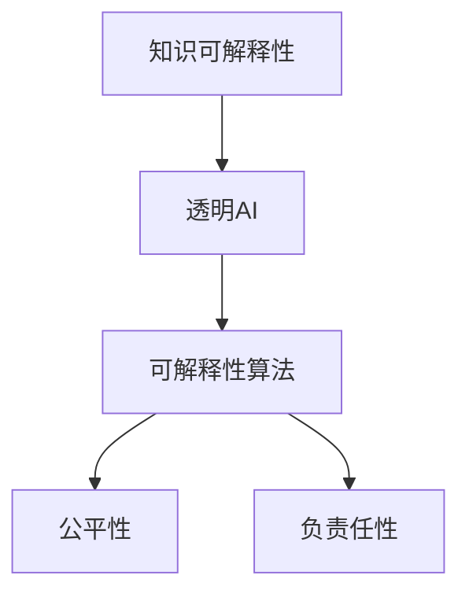

                 

# 知识的可解释性：透明AI的重要性

> 关键词：知识可解释性, 透明AI, 人工智能伦理, 决策透明化, 可解释性算法

## 1. 背景介绍

### 1.1 问题由来

随着人工智能（AI）技术的飞速发展，机器学习（ML）和大数据技术在诸多领域取得了显著成果，如图像识别、自然语言处理、医疗诊断等。然而，这些技术的发展也带来了新的问题，其中之一便是知识的可解释性问题。AI模型，尤其是深度神经网络（DNNs），通常被视为"黑盒"系统，难以解释其内部决策过程，这不仅限制了AI技术的可信度，还可能引发伦理和安全问题。

### 1.2 问题核心关键点

知识可解释性问题的核心在于如何确保AI模型决策过程的透明性和可理解性。在实际应用中，以下几方面尤为重要：

- **透明度**：确保AI模型决策依据可追溯、可理解。
- **可解释性**：能够将模型的输出和决策过程用人类可以理解的方式进行解释。
- **负责任性**：确保AI模型的决策对用户负责，避免潜在的歧视和偏见。
- **公正性**：保证AI模型在处理不同类型数据时，不产生系统性偏差。

## 2. 核心概念与联系

### 2.1 核心概念概述

为更好地理解知识可解释性在透明AI中的重要性，本节将介绍几个密切相关的核心概念：

- **知识可解释性(Knowledge Explainability)**：指模型能够提供关于其决策过程的清晰解释，使得非专家用户也能够理解模型决策依据。
- **透明AI(Transparent AI)**：指模型决策过程对用户透明，用户能够理解模型的内在工作机制。
- **可解释性算法(Explainable AI, XAI)**：以可解释性为首要目标的AI算法和模型，通过多种方式提供模型的决策依据。
- **公平性(Fairness)**：确保AI模型在处理不同群体数据时，不产生系统性偏见或歧视。
- **负责任性(Accountability)**：确保AI模型决策对用户负责，避免错误或恶意决策。

这些核心概念之间存在紧密联系，共同构成了透明AI的研究框架，旨在确保AI模型在提升性能的同时，保持对用户负责和透明。

### 2.2 核心概念原理和架构的 Mermaid 流程图



这个流程图展示了知识可解释性、透明AI、可解释性算法、公平性、负责任性之间的关系：

1. **知识可解释性**是透明AI的基础，只有模型决策过程可解释，才能称为透明。
2. **透明AI**依赖于可解释性算法，提供决策依据和解释，使得模型过程透明。
3. **公平性**和**负责任性**是透明AI的核心目标，确保模型对用户负责且不产生偏见。

这些概念通过合理的架构设计，形成了一个协同工作的网络，共同确保AI的可靠性和伦理。

## 3. 核心算法原理 & 具体操作步骤
### 3.1 算法原理概述

透明AI的核心算法原理主要围绕如何提升模型决策的可解释性和透明度。以下是几个关键算法原理：

- **规则学习**：通过分析模型决策过程中的关键规则，提取决策依据。
- **可解释性增强**：在模型训练过程中，引入可解释性约束，提升模型输出的解释性。
- **对抗性训练**：训练模型对抗潜在攻击，提高模型的鲁棒性和透明度。
- **实例推断**：通过提供模型的预测结果和输入示例，帮助用户理解模型决策过程。
- **对抗性样本生成**：生成对抗样本，验证模型的鲁棒性，并揭示模型决策漏洞。

这些算法共同作用，确保模型决策透明和可解释。

### 3.2 算法步骤详解

透明AI的算法步骤包括以下几个关键步骤：

1. **数据准备**：收集标注数据集，进行数据清洗和预处理。
2. **模型选择**：选择适合的透明AI模型，如规则学习模型、可解释性增强模型等。
3. **训练和验证**：在训练集上训练模型，并在验证集上评估模型性能。
4. **解释性输出**：模型输出解释，如规则、权重、注意力等，以便用户理解。
5. **公平性和负责任性评估**：评估模型在不同数据上的公平性和负责任性。
6. **反复迭代**：根据评估结果，调整模型和数据集，提升模型透明度和可靠性。

### 3.3 算法优缺点

透明AI的算法具有以下优点：

- **提升可信度**：透明AI能够提供决策依据，增加用户对模型的信任。
- **提高效率**：通过优化模型结构和训练过程，透明AI能够提升模型性能。
- **促进创新**：透明AI能够揭示模型漏洞，促进模型的不断优化。

同时，透明AI也存在一些局限性：

- **复杂度高**：透明AI算法通常需要额外的计算和存储空间。
- **数据依赖**：透明AI对标注数据的质量和数量要求较高。
- **模型鲁棒性**：透明AI模型可能对输入扰动敏感，影响模型鲁棒性。
- **解释难度**：复杂模型的解释性输出可能难以理解。

尽管存在这些局限性，透明AI在提升AI模型的透明度和可信度方面具有重要作用。

### 3.4 算法应用领域

透明AI在多个领域都有广泛应用，例如：

- **医疗诊断**：确保诊断过程透明，避免误诊和漏诊。
- **金融风险评估**：透明化风险评估模型，确保决策公平和负责任。
- **法律审判**：提升判决过程的可解释性，增加司法透明度。
- **智能客服**：通过透明AI解释，提升客户对AI客服的信任度。
- **产品推荐**：透明化推荐模型，增加用户对推荐结果的理解和接受度。

这些应用场景展示了透明AI在提升决策透明性和用户满意度方面的重要作用。

## 4. 数学模型和公式 & 详细讲解  
### 4.1 数学模型构建

透明AI的数学模型构建主要基于规则学习和决策树等简单模型。以下以决策树为例，介绍其基本原理：

- **决策树**：通过构建一棵树形结构，将数据集分成多个子集，每个子集对应树的某个叶子节点。
- **信息增益**：衡量一个属性在划分数据集时的信息增益，选择信息增益最大的属性作为划分依据。

### 4.2 公式推导过程

以信息增益为例，推导决策树构建过程中的关键公式。

假设数据集 $D=\{(x_i,y_i)\}_{i=1}^N$，其中 $x_i$ 为输入特征，$y_i$ 为输出标签。使用信息增益 $IG$ 来衡量属性 $A$ 在划分数据集时的信息增益：

$$
IG(A) = H(D) - \sum_{x \in A} \frac{|D_x|}{|D|} H(D_x)
$$

其中 $H(D)$ 为数据集 $D$ 的熵，$H(D_x)$ 为数据集 $D_x$ 的熵，$|D_x|$ 为数据集 $D_x$ 的大小，$|D|$ 为数据集 $D$ 的大小。

通过计算信息增益，选择信息增益最大的属性作为当前节点的划分属性，递归构建决策树。

### 4.3 案例分析与讲解

以医疗诊断为例，使用决策树构建透明AI模型。假设数据集包含病人的年龄、性别、血压、血糖等特征，以及是否患有某种疾病的标签。通过计算信息增益，构建决策树，帮助医生理解模型诊断的依据。

## 5. 项目实践：代码实例和详细解释说明
### 5.1 开发环境搭建

在进行透明AI项目实践前，我们需要准备好开发环境。以下是使用Python进行Scikit-learn开发的简单环境配置流程：

1. 安装Anaconda：从官网下载并安装Anaconda，用于创建独立的Python环境。

2. 创建并激活虚拟环境：
```bash
conda create -n explainability-env python=3.8 
conda activate explainability-env
```

3. 安装Scikit-learn：
```bash
pip install scikit-learn
```

4. 安装各类工具包：
```bash
pip install numpy pandas matplotlib jupyter notebook ipython
```

完成上述步骤后，即可在`explainability-env`环境中开始透明AI项目实践。

### 5.2 源代码详细实现

以下是使用Scikit-learn进行决策树透明AI模型的代码实现：

```python
from sklearn.tree import DecisionTreeClassifier
from sklearn.datasets import load_iris
from sklearn.model_selection import train_test_split

# 加载数据集
iris = load_iris()
X = iris.data
y = iris.target

# 划分训练集和测试集
X_train, X_test, y_train, y_test = train_test_split(X, y, test_size=0.2, random_state=42)

# 构建决策树模型
model = DecisionTreeClassifier()
model.fit(X_train, y_train)

# 使用模型进行预测
y_pred = model.predict(X_test)

# 输出解释信息
importances = model.feature_importances_
indices = np.argsort(importances)[::-1]
print(f"Feature importances: {indices}")
```

### 5.3 代码解读与分析

让我们再详细解读一下关键代码的实现细节：

**训练和验证过程**：
- 使用Scikit-learn的`DecisionTreeClassifier`类构建决策树模型。
- 加载鸢尾花数据集，并进行数据划分，确保训练集和测试集的独立性。
- 使用训练集训练模型，并在测试集上进行验证。

**解释性输出**：
- 通过计算特征重要性，获取模型决策的关键特征。
- 将特征重要性输出到控制台，便于用户理解模型的决策依据。

可以看到，Scikit-learn提供了便捷的API和模型库，使得透明AI项目的开发变得更加高效。

## 6. 实际应用场景

### 6.1 医疗诊断

透明AI在医疗诊断中的应用，可以显著提升诊断的透明度和可信度。通过构建透明的决策树模型，医生可以清楚地了解诊断过程的每一步决策依据，从而增加对模型的信任，提高诊断的准确性。

在实践中，可以使用医院的历史病历数据，通过决策树模型训练透明AI模型。模型输出解释特征重要性，医生可以根据这些解释调整诊断策略，确保诊断过程公正、透明。

### 6.2 金融风险评估

金融风险评估是透明AI的重要应用场景之一。传统模型往往缺乏透明度，难以解释其决策依据。透明AI模型通过规则学习等技术，揭示模型决策的逻辑和规则，确保决策过程透明。

在金融领域，透明AI可以应用于信用评分、违约预测、投资推荐等任务。通过透明的决策树模型，金融机构可以确保评估过程的公平性和负责任性，避免潜在的歧视和偏见。

### 6.3 智能客服

智能客服系统需要高透明度的决策过程，以便提升用户信任度。透明AI可以通过规则学习和决策树模型，确保智能客服的决策过程透明，用户可以理解机器的推理过程，从而增加对系统的信任。

在实践中，可以通过收集客服的历史对话数据，训练透明AI模型。模型输出解释决策依据，客服可以根据这些解释优化服务策略，提升用户体验。

### 6.4 产品推荐

产品推荐系统需要高透明度的决策过程，以便用户理解推荐依据，提升推荐效果。透明AI可以通过规则学习等技术，揭示推荐模型的决策逻辑，确保推荐过程透明。

在实践中，可以使用用户的历史行为数据和产品特征数据，训练透明AI模型。模型输出解释推荐依据，用户可以根据这些解释调整推荐设置，优化推荐效果。

## 7. 工具和资源推荐
### 7.1 学习资源推荐

为了帮助开发者系统掌握透明AI的理论基础和实践技巧，这里推荐一些优质的学习资源：

1. 《可解释性AI：透明机器学习的理论与实践》系列博文：由透明AI领域的专家撰写，深入浅出地介绍了透明AI的理论基础和实践方法。

2. 《Deep Learning with Scikit-learn》课程：由Kaggle主办，系统介绍了Scikit-learn库的使用方法和透明AI算法，适合初学者入门。

3. 《Practical AI Explainability》书籍：由透明AI领域的知名专家撰写，介绍了多种透明AI算法的实现和应用，适合进阶学习。

4. ExplainableAI.org网站：透明AI领域的权威资源平台，提供了大量的论文、案例和工具，帮助你深入理解透明AI的各个方面。

通过对这些资源的学习实践，相信你一定能够快速掌握透明AI的精髓，并用于解决实际的AI问题。

### 7.2 开发工具推荐

高效的开发离不开优秀的工具支持。以下是几款用于透明AI开发的常用工具：

1. Scikit-learn：Python机器学习库，提供了多种透明AI算法的实现，如决策树、规则学习等。

2. TensorFlow：由Google主导开发的深度学习框架，支持多种模型和算法，适合复杂透明AI问题的开发。

3. PyTorch：基于Python的深度学习框架，支持动态计算图和GPU加速，适合高效透明AI模型开发。

4. SHAP：用于模型可解释性的Python库，提供多种解释方法和工具，适合验证透明AI模型的解释性。

5. MLflow：用于模型生命周期管理的工具，支持模型训练、部署和监控，适合透明AI系统的开发和部署。

合理利用这些工具，可以显著提升透明AI项目的开发效率，加快创新迭代的步伐。

### 7.3 相关论文推荐

透明AI技术的发展源于学界的持续研究。以下是几篇奠基性的相关论文，推荐阅读：

1. LIME: A Uncertainainty Quantification Method for Deep Neural Networks：提出了LIME算法，用于解释深度神经网络的决策过程。

2. SHAP: A Unified Approach to Interpreting Model Predictions：介绍了SHAP库，提供了多种解释方法，用于验证模型的解释性。

3. What Explains Predictions of Any Classifier？：提出了AdaBoost算法，用于提高模型解释的透明度和可信度。

4. A Survey on Explainable Artificial Intelligence（XAI）：综述了透明AI领域的最新进展，介绍了多种解释方法。

5. ACM F/ACTS on Fairness, Accountability, and Transparency：会议论文集，介绍了透明AI在公平性和负责任性方面的最新进展。

这些论文代表了大规模语言模型微调技术的发展脉络。通过学习这些前沿成果，可以帮助研究者把握学科前进方向，激发更多的创新灵感。

## 8. 总结：未来发展趋势与挑战

### 8.1 总结

本文对透明AI中的知识可解释性进行了全面系统的介绍。首先阐述了知识可解释性的重要性，明确了透明AI在提升决策透明性和可信度方面的独特价值。其次，从原理到实践，详细讲解了透明AI的数学模型和操作步骤，给出了透明AI项目开发的完整代码实例。同时，本文还广泛探讨了透明AI在医疗诊断、金融风险评估、智能客服、产品推荐等多个行业领域的应用前景，展示了透明AI的巨大潜力。此外，本文精选了透明AI技术的各类学习资源，力求为读者提供全方位的技术指引。

通过本文的系统梳理，可以看到，透明AI技术正在成为AI应用的重要范式，极大地提升AI系统的可信度和透明度，为社会带来更深远的影响。未来，伴随透明AI技术的不断演进，相信AI技术将能够更好地服务于社会，提升决策的公平性和负责任性。

### 8.2 未来发展趋势

展望未来，透明AI技术将呈现以下几个发展趋势：

1. **自动化解释工具**：随着技术的发展，自动生成解释文本和可视化图表的工具将越来越智能，能够更好地帮助用户理解模型决策。

2. **多模态解释方法**：透明AI将不再局限于单一模态数据，而是能够整合视觉、语音、文本等多模态信息，提供更加全面和准确的解释。

3. **跨领域可解释性**：透明AI将在不同领域应用中推广其解释方法，如金融、医疗、司法等，提升各个领域的透明度和可信度。

4. **混合解释方法**：结合多种解释方法，如规则学习、特征重要性、对抗性解释等，综合提升模型的可解释性。

5. **实时解释系统**：透明AI将在实时系统中应用，确保用户能够即时获取模型解释，提升用户体验。

以上趋势凸显了透明AI技术的广阔前景。这些方向的探索发展，必将进一步提升AI系统的透明度和可信度，促进人工智能技术的健康发展。

### 8.3 面临的挑战

尽管透明AI技术已经取得了显著进展，但在迈向更加智能化、普适化应用的过程中，仍面临诸多挑战：

1. **解释准确性**：解释方法可能存在一定的偏差，导致解释结果与实际模型决策不一致。如何提升解释的准确性和可靠性，仍需更多研究。

2. **解释效率**：解释过程可能需要额外计算资源和时间，影响模型的推理速度。如何优化解释方法，减少计算开销，仍是一个重要问题。

3. **解释多样性**：不同的解释方法可能揭示不同的模型细节，用户可能难以理解和接受。如何提供多样化的解释方法，满足不同用户的需求，仍需更多实践。

4. **伦理和安全**：透明AI可能揭示模型中的偏见和漏洞，引发伦理和安全问题。如何确保解释过程不泄露敏感信息，避免伦理风险，仍需深入研究。

5. **解释一致性**：不同的用户可能对相同的解释有不同的理解，如何提供一致的解释，减少用户误解，仍需更多研究。

6. **解释成本**：解释过程可能增加系统开发和维护的成本，如何平衡解释需求和系统成本，仍需更多研究。

正视透明AI面临的这些挑战，积极应对并寻求突破，将是大规模语言模型微调走向成熟的必由之路。相信随着学界和产业界的共同努力，这些挑战终将一一被克服，透明AI必将在构建安全、可靠、可解释、可控的智能系统中扮演越来越重要的角色。

### 8.4 研究展望

面向未来，透明AI技术需要在以下几个方面寻求新的突破：

1. **解释方法的多样化**：引入更多解释方法和技术，如符号解释、因果解释、对抗性解释等，提升解释的全面性和准确性。

2. **解释方法的可解释性**：引入可解释性约束，提升解释方法的透明度和可靠性。

3. **解释方法的自动化**：通过机器学习技术，自动化生成解释文本和图表，提升解释的效率和准确性。

4. **解释方法的安全性**：确保解释过程不泄露敏感信息，避免伦理风险。

5. **解释方法的混合应用**：结合多种解释方法，综合提升模型的可解释性。

6. **解释方法的跨领域应用**：将解释方法推广到不同领域，提升各个领域的透明度和可信度。

这些研究方向的探索，必将引领透明AI技术迈向更高的台阶，为构建安全、可靠、可解释、可控的智能系统铺平道路。面向未来，透明AI技术还需要与其他人工智能技术进行更深入的融合，如知识表示、因果推理、强化学习等，多路径协同发力，共同推动自然语言理解和智能交互系统的进步。只有勇于创新、敢于突破，才能不断拓展AI模型的边界，让智能技术更好地造福人类社会。

## 9. 附录：常见问题与解答

**Q1：透明AI是否可以完全解释模型的决策过程？**

A: 透明AI的解释过程通常存在一定的局限性，无法完全解释模型的决策过程。这是因为AI模型的决策过程非常复杂，可能包含难以理解的非线性关系和复杂模式。然而，透明AI可以提供尽可能多的解释信息，帮助用户理解模型的决策依据，提升模型的可信度和透明度。

**Q2：透明AI的解释方法有哪些？**

A: 透明AI的解释方法多种多样，包括但不限于：

- 规则学习：通过分析模型决策过程中的关键规则，提取决策依据。
- 特征重要性：衡量每个特征在模型决策中的重要性，帮助用户理解模型。
- 可视化图表：通过可视化技术，展示模型决策过程。
- 部分依赖图：展示每个特征对模型输出的贡献。
- 对抗性解释：通过生成对抗样本，揭示模型决策的漏洞和偏差。

这些方法可以单独使用，也可以结合使用，以提升模型的可解释性。

**Q3：如何评估透明AI的解释效果？**

A: 透明AI的解释效果评估通常包括以下几个指标：

- 准确性：解释是否准确反映了模型的决策依据。
- 可靠性：解释是否可靠，不产生误导性信息。
- 全面性：解释是否全面覆盖了模型决策的关键因素。
- 可用性：解释是否易于理解和接受，是否帮助用户更好地理解模型。

评估透明AI的解释效果通常需要结合实际应用场景，通过多种指标综合衡量。

**Q4：如何提升透明AI的解释效率？**

A: 提升透明AI的解释效率通常需要优化解释方法，减少计算开销和时间。具体方法包括：

- 自动化生成解释：通过机器学习技术，自动化生成解释文本和图表。
- 压缩和简化解释：对解释结果进行压缩和简化，减少计算开销。
- 混合使用解释方法：结合多种解释方法，提高解释效率和准确性。
- 分阶段解释：将解释过程分为多个阶段，逐步提升解释效果。

通过优化解释方法，可以显著提升透明AI的解释效率。

**Q5：透明AI在实际应用中应注意哪些问题？**

A: 透明AI在实际应用中需要注意以下几个问题：

- 数据隐私：确保解释过程中不泄露用户隐私信息。
- 数据偏差：确保解释过程不放大数据集中的偏差。
- 模型鲁棒性：确保解释过程不降低模型的鲁棒性和泛化性能。
- 用户理解：确保解释过程易于用户理解，避免产生误解。
- 解释多样性：确保提供多种解释方法，满足不同用户的需求。

在实际应用中，透明AI的开发和部署需要综合考虑以上因素，确保模型的透明性和可信度。

---

作者：禅与计算机程序设计艺术 / Zen and the Art of Computer Programming

