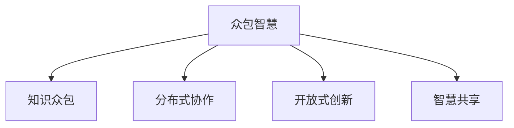

                 

# 知识的开放创新：众包智慧的力量

> 关键词：知识众包,开放创新,智慧力量,数据融合,分布式协作

## 1. 背景介绍

### 1.1 问题由来
在全球化、信息化的大背景下，知识的获取、创新与传播方式发生了翻天覆地的变化。传统以单个人或机构为核心的知识生产模式逐渐向开放、协作的众包模式转变。这种转变不仅催生了新的知识生产方式，也为全球知识创新和智慧传承开辟了新的道路。

众包（Crowdsourcing）是一种将小任务分配给大量个体的商业模式，最早起源于在线平台的众包市场，如eBay、Amazon等，随后逐步拓展到科技、教育、医疗、金融等多个领域。众包模式以其低成本、高效率、多样性等优势，正在成为全球知识创新与开放创新的重要手段。

### 1.2 问题核心关键点
众包智慧的核心在于利用庞大的互联网用户群体，通过分布式协作、开放式创新，快速集聚和利用全球的知识资源。其核心优势包括：

- **低成本**：无须昂贵的实验设备和研究机构，即可快速汇聚全球智慧。
- **高效率**：通过大量并行任务分配，大幅缩短知识创新的时间周期。
- **多样性**：汇聚不同背景、视角和经验的人力资源，产生多样化的解决方案。
- **分布式**：通过网络平台和协作工具，跨越地理和组织边界，实现全球知识共享和协同。

在实际应用中，众包智慧可以应用于科学研究、技术开发、创意设计、教育培训等多个领域，为社会创新与进步注入新的活力。

## 2. 核心概念与联系

### 2.1 核心概念概述

为更好地理解众包智慧的核心原理和应用方式，本节将介绍几个密切相关的核心概念：

- **众包智慧**：通过互联网平台和协作工具，利用分布式用户群体，进行开放创新和智慧共享的过程。
- **知识众包**：将科研任务、技术问题、创意需求等通过互联网平台发布，吸引全球用户参与解答和讨论。
- **分布式协作**：跨组织、跨地域的用户群体，通过在线工具和平台，共同完成复杂而多样的任务。
- **开放式创新**：打破传统知识生产的边界，鼓励全球用户参与知识创新，实现知识的外部性最大化。
- **智慧共享**：汇聚全球用户的智慧成果，通过开源、共享的方式，促进知识的普及和应用。

这些概念之间的逻辑关系可以通过以下Mermaid流程图来展示：



这个流程图展示了众包智慧的核心概念及其相互关系：

1. 众包智慧是整个系统的核心，通过互联网平台和协作工具实现。
2. 知识众包和分布式协作是众包智慧的主要手段。
3. 开放式创新和智慧共享是众包智慧的目标和价值。

通过理解这些核心概念，我们可以更好地把握众包智慧的工作原理和优化方向。

## 3. 核心算法原理 & 具体操作步骤
### 3.1 算法原理概述

众包智慧的核心在于分布式协作和开放式创新，其基本算法原理包括：

- **任务分解**：将复杂的科研任务、技术问题或创意需求，分解为可操作的小任务，通过平台发布给全球用户群体。
- **并行处理**：通过并行计算和任务分配，实现多用户、多地点的协同工作，快速汇聚智慧成果。
- **汇聚与整合**：利用开源工具和平台，汇聚全球用户提交的解决方案，并进行整合和优化。
- **迭代改进**：基于用户反馈和成果评价，不断迭代优化任务设计和解决方案，提升知识创新的质量和效率。

### 3.2 算法步骤详解

众包智慧的实际操作步骤可以概括为以下几个关键步骤：

**Step 1: 任务发布与管理**
- 确定任务目标和要求，将其分解为可操作的小任务。
- 使用众包平台发布任务，定义任务规则和评价标准。
- 管理用户提交的任务进展和成果，确保任务按时完成。

**Step 2: 任务分配与执行**
- 根据任务需求和用户能力，智能分配任务。
- 用户通过在线工具和平台，完成分配的任务，提交成果。
- 平台对用户提交的成果进行初步筛选和评价，确保质量。

**Step 3: 成果汇聚与优化**
- 汇聚全球用户提交的解决方案，进行去重和优化。
- 使用开源工具和算法，对汇聚的成果进行分析和整合。
- 根据任务目标和用户反馈，不断迭代优化成果。

**Step 4: 成果共享与传播**
- 将优化后的成果，通过平台进行公开和共享。
- 用户可以下载、使用和进一步修改成果，参与新一轮的创新。
- 成果还可以通过社交媒体、学术期刊等渠道进行传播，扩大影响。

### 3.3 算法优缺点

众包智慧具有以下优点：

- **成本低**：相较于传统科研，无须高昂的实验设备和研究机构。
- **效率高**：通过并行任务分配，快速汇聚全球智慧。
- **多样性**：汇聚不同背景、视角和经验的用户，产生多样化的解决方案。
- **开放性**：打破知识生产的边界，鼓励全球用户参与创新。

但众包智慧也存在以下局限性：

- **质量控制**：用户提交的成果可能存在质量参差不齐的问题。
- **协作协调**：跨地域、跨文化的协作，可能面临沟通和协调的困难。
- **知识产权**：成果的知识产权归属问题，可能引发争议和纠纷。
- **数据隐私**：用户提交的数据可能存在隐私保护的问题。

尽管存在这些局限性，但众包智慧的广泛应用已经证明了其在知识创新和智慧传承方面的巨大潜力。

### 3.4 算法应用领域

众包智慧的应用领域非常广泛，涵盖了科学研究、技术开发、创意设计、教育培训等多个方面。以下是几个典型的应用场景：

- **科学研究和数据分析**：利用众包平台，征集全球用户的科学数据和分析结果，快速汇聚科学知识。
- **技术开发和创新**：将技术问题发布到众包平台，吸引全球开发者参与解决方案的设计和实现。
- **创意设计和产品创新**：通过众包平台征集创意设计方案，汇聚全球用户的创意，进行创新设计。
- **教育培训和在线学习**：利用众包平台进行教育资源的共享和在线教学，实现知识的普及和传播。
- **医疗健康和疾病防控**：将医疗问题发布到众包平台，吸引全球医疗专家参与研究和讨论。

## 4. 数学模型和公式 & 详细讲解
### 4.1 数学模型构建

为更好地理解众包智慧的数学原理，本节将使用数学语言对众包任务的分配与执行进行形式化描述。

假设任务总数为 $N$，每个任务需要的解决步骤为 $S$，总用户数为 $U$，每个用户的任务分配数量为 $A$。任务分配模型 $M$ 可以表示为：

$$
M = \frac{N}{U \times S}
$$

其中，$N$ 表示任务总数，$U$ 表示用户总数，$S$ 表示每个任务需要的解决步骤，$A$ 表示每个用户的任务分配数量。

任务完成模型 $C$ 可以表示为：

$$
C = \frac{N}{U \times S \times A}
$$

其中，$N$ 表示任务总数，$U$ 表示用户总数，$S$ 表示每个任务需要的解决步骤，$A$ 表示每个用户的任务分配数量。

### 4.2 公式推导过程

根据任务分配模型和任务完成模型，我们可以进一步推导出用户任务分配与执行的数学关系：

$$
A = M \times C
$$

其中，$A$ 表示每个用户的任务分配数量，$M$ 表示任务分配模型，$C$ 表示任务完成模型。

通过对任务分配和执行的数学建模，可以更好地理解众包智慧的运作机制和优化策略。

### 4.3 案例分析与讲解

以下是一个简单的案例，说明如何通过数学模型来优化众包任务的分配和执行：

假设一个科研任务需要分解为100个步骤，由100个用户共同完成。每个用户需要分配10个任务步骤。

根据任务分配模型，每个用户的任务分配数量为：

$$
M = \frac{100}{100 \times 10} = 1
$$

根据任务完成模型，每个用户的任务完成数量为：

$$
C = \frac{100}{100 \times 10 \times 10} = 1
$$

通过数学模型可以看出，每个用户需要分配10个任务步骤，且在执行过程中需要同时完成这些任务。

实际应用中，可以根据任务复杂度和用户能力，动态调整任务分配数量，优化任务执行效率。

## 5. 项目实践：代码实例和详细解释说明
### 5.1 开发环境搭建

在进行众包智慧项目开发前，我们需要准备好开发环境。以下是使用Python进行众包平台开发的常见环境配置流程：

1. 安装Anaconda：从官网下载并安装Anaconda，用于创建独立的Python环境。

2. 创建并激活虚拟环境：
```bash
conda create -n crowdsource python=3.8 
conda activate crowdsource
```

3. 安装必要的Python包：
```bash
pip install flask bottle pyyaml
```

4. 安装Web框架和协作工具：
```bash
pip install flask-babel
pip install flask-cors
pip install dask
```

5. 安装其他辅助工具：
```bash
pip install gunicorn
pip install redis
```

完成上述步骤后，即可在`crowdsource-env`环境中开始众包平台开发。

### 5.2 源代码详细实现

以下是一个简单的众包平台实现，包括任务发布、用户提交、成果汇聚和成果共享等功能：

```python
from flask import Flask, request, render_template
from flask_babel import Babel
from flask_cors import CORS
import redis

app = Flask(__name__)
babel = Babel(app)
CORS(app)

# 创建Redis客户端
redis_client = redis.Redis(host='localhost', port=6379, db=0)

@app.route('/')
def index():
    return render_template('index.html')

@app.route('/submit_task', methods=['POST'])
def submit_task():
    task_name = request.form['task_name']
    task_steps = int(request.form['task_steps'])
    return 'Task {} submitted successfully!'.format(task_name)

@app.route('/task_details', methods=['GET'])
def task_details(task_id):
    task_name = redis_client.hget('tasks', task_id)
    task_steps = redis_client.hget('tasks', task_id)
    return 'Task {} has {} steps.'.format(task_name, task_steps)

@app.route('/submit_result', methods=['POST'])
def submit_result(task_id, user_id, result):
    redis_client.hset('task_results', task_id, result)
    return 'Result submitted successfully!'

@app.route('/result_details', methods=['GET'])
def result_details(task_id):
    task_results = redis_client.hgetall('task_results')
    return task_results

if __name__ == '__main__':
    app.run(debug=True)
```

以上代码实现了基本的众包平台功能，包括任务发布、用户提交和成果汇聚等。

### 5.3 代码解读与分析

让我们再详细解读一下关键代码的实现细节：

**Flask框架**：
- `Flask`是一个轻量级的Web框架，用于快速搭建Web应用。
- `Flask-Babel`用于国际化支持，方便多语言环境下的界面展示。
- `Flask-CORS`用于跨域资源共享，允许跨域请求。

**Redis缓存**：
- 使用`Redis`作为缓存，用于存储和管理任务、用户和结果等数据。
- `Redis`具有高并发、低延迟的特点，适合用于分布式任务管理和协作。

**API接口**：
- 定义了任务发布、用户提交和成果汇聚等API接口，通过RESTful设计实现。
- 使用`POST`方法提交任务和结果，`GET`方法获取任务和结果详情。

**用户界面**：
- 使用`render_template`渲染HTML界面，提供用户交互界面。
- 界面通过`Flask-Babel`支持多语言环境，方便不同地区用户使用。

以上代码实现了基本的众包平台功能，开发者可以根据实际需求进行进一步扩展和优化。

## 6. 实际应用场景
### 6.1 科学研究

众包智慧在科学研究中具有广泛的应用前景。例如，利用众包平台征集全球用户的科学数据和分析结果，可以快速汇聚科学知识，推动科学研究的进展。

**案例1：天文学中的超新星观测**：
- 天文学家将超新星观测数据发布到众包平台，邀请全球用户参与数据分析和处理。
- 用户通过在线工具，对观测数据进行初步筛选和处理，提交分析结果。
- 天文学家对提交结果进行审核和整合，撰写科学论文，发布在学术期刊上。

**案例2：生物学中的基因测序**：
- 生物学研究者将基因序列数据发布到众包平台，邀请全球用户参与基因序列的分析和比对。
- 用户通过在线工具，对基因序列进行比对和分析，提交分析结果。
- 研究者对提交结果进行整合和验证，撰写科研论文，发布在生物医学期刊上。

### 6.2 技术开发

众包智慧在技术开发中同样具有广泛的应用。例如，利用众包平台征集全球开发者的解决方案，快速汇聚技术成果，推动技术创新。

**案例1：开源软件的开发和维护**：
- 开源项目发起者将软件需求和任务发布到众包平台，邀请全球开发者参与解决方案的设计和实现。
- 开发者通过在线工具，提交代码和技术方案，参与项目的开发和维护。
- 项目团队对提交结果进行审核和整合，不断优化和完善软件功能。

**案例2：智能硬件的创新设计**：
- 智能硬件公司将产品设计需求和任务发布到众包平台，邀请全球设计师参与产品设计。
- 设计师通过在线工具，提交设计方案和草图，参与产品设计。
- 公司对提交结果进行审核和整合，优化设计方案，发布新产品。

### 6.3 创意设计

众包智慧在创意设计中也有着广泛的应用。例如，利用众包平台征集全球用户的创意方案，快速汇聚创意成果，推动创意设计的发展。

**案例1：艺术作品的创作**：
- 艺术家将艺术创作需求和任务发布到众包平台，邀请全球艺术家参与创意设计。
- 艺术家通过在线工具，提交创意方案和草图，参与艺术创作。
- 艺术家团队对提交结果进行审核和整合，优化创意方案，创作艺术作品。

**案例2：广告创意的设计**：
- 广告公司将广告创意需求和任务发布到众包平台，邀请全球创意设计师参与广告设计。
- 创意设计师通过在线工具，提交创意方案和设计图，参与广告创意设计。
- 广告团队对提交结果进行审核和整合，优化创意方案，发布广告作品。

### 6.4 未来应用展望

随着众包智慧技术的不断发展，其在更多领域的应用前景将更加广阔。

在智慧医疗领域，众包智慧可以用于疾病诊断、药物研发等任务，通过众包平台汇聚全球医疗专家的智慧，推动医疗科技的进步。

在智能城市治理中，众包智慧可以用于城市事件监测、公共服务评价等任务，通过众包平台汇聚全球市民和专家的智慧，提升城市治理水平。

在智慧农业领域，众包智慧可以用于作物种植、病虫害防治等任务，通过众包平台汇聚全球农民和专家的智慧，提升农业生产效率和质量。

此外，在教育培训、金融服务、环境保护等多个领域，众包智慧也将发挥重要作用，推动相关领域的技术创新和智慧共享。

## 7. 工具和资源推荐
### 7.1 学习资源推荐

为了帮助开发者系统掌握众包智慧的理论基础和实践技巧，这里推荐一些优质的学习资源：

1. **《众包智慧：分布式协作与开放式创新》**：系统介绍了众包智慧的理论基础、实践技巧和应用案例，是了解众包智慧的重要入门读物。

2. **Coursera上的《众包与协作》课程**：由斯坦福大学和加州大学伯克利分校联合开设，涵盖了众包模式、平台设计、用户管理等多个方面的内容。

3. **众包平台源码分析**：分析多个众包平台（如CrowdFlower、Amazon Mechanical Turk等）的源码，了解其架构设计和核心算法。

4. **开源众包平台Kanboard**：基于Web的众包管理工具，提供任务管理、协作工具和统计分析功能，是实现众包平台的理想工具。

5. **众包领域的学术论文**：阅读相关学术论文，了解众包智慧的前沿研究和最新进展，如《Crowdsourcing: A Design Framework》、《The Crowd-Auting Effect》等。

通过对这些资源的学习实践，相信你一定能够快速掌握众包智慧的精髓，并用于解决实际的创新问题。

### 7.2 开发工具推荐

高效的开发离不开优秀的工具支持。以下是几款用于众包平台开发的常用工具：

1. **Flask**：轻量级的Web框架，用于快速搭建众包平台。支持RESTful API设计和国际化支持。

2. **Redis**：高并发、低延迟的缓存系统，用于存储和管理众包任务、用户和结果等数据。

3. **Dask**：分布式任务调度系统，用于处理大规模的众包任务，支持任务并行和优化。

4. **Gunicorn**：Python Web应用服务器，支持负载均衡和动态扩展，适用于大规模Web应用。

5. **Jupyter Notebook**：交互式编程环境，支持Python和R等语言，方便数据处理和模型开发。

合理利用这些工具，可以显著提升众包平台的开发效率，加快创新迭代的步伐。

### 7.3 相关论文推荐

众包智慧的发展源于学界的持续研究。以下是几篇奠基性的相关论文，推荐阅读：

1. **《Crowdsourcing: A Design Framework for a Decentralized Problem-Solving System》**：提出了众包模式的基本框架和设计原则，是众包研究的重要里程碑。

2. **《The Crowd-Auting Effect: A New Perspective on Reviews》**：研究了众包平台中用户评价的机制和影响因素，提供了优化用户评价的建议。

3. **《Crowdsourcing Science: A New Model for Engaging the Public in Genomic Research》**：展示了众包平台在基因测序和科学数据收集中的应用，推动了科学研究的普及和创新。

4. **《Crowdsourcing Techniques for Robust Data Mining》**：介绍了众包平台在数据挖掘和分析中的应用，提高了数据处理的效率和质量。

5. **《Crowdsourcing in Medicine: Evaluating the Impact of Non-Experts》**：研究了众包平台在医学领域的应用，评估了非专家用户的贡献和效果。

这些论文代表了大数据时代众包智慧的发展脉络。通过学习这些前沿成果，可以帮助研究者把握学科前进方向，激发更多的创新灵感。

## 8. 总结：未来发展趋势与挑战
### 8.1 总结

本文对众包智慧的概念、原理和应用进行了全面系统的介绍。首先阐述了众包智慧的背景和意义，明确了其在知识创新和智慧传承中的重要作用。其次，从原理到实践，详细讲解了众包智慧的数学原理和操作步骤，给出了众包平台开发的完整代码实例。同时，本文还广泛探讨了众包智慧在科学研究、技术开发、创意设计等多个领域的应用前景，展示了其广阔的应用潜力。

通过本文的系统梳理，可以看到，众包智慧正在成为全球知识创新与智慧传承的重要手段，极大地拓展了知识生产的边界，催生了更多的落地场景。受益于互联网平台和协作工具的持续演进，众包智慧必将在未来更加广泛地应用于科研、技术、创意等领域，推动全球知识创新和智慧共享的进一步发展。

### 8.2 未来发展趋势

展望未来，众包智慧将呈现以下几个发展趋势：

1. **平台化**：众包平台将更加完善和丰富，支持更多任务类型和协作工具，提升用户的使用体验和效率。
2. **标准化**：众包任务的发布和管理将更加标准化和规范化，提升众包平台的数据质量和任务效率。
3. **多模态**：众包任务将更多地涉及图像、语音等多模态数据，提升众包任务的复杂性和多样性。
4. **自动化**：利用人工智能和大数据技术，自动分配任务、筛选结果，提升众包平台的智能化水平。
5. **国际化**：众包平台将更好地支持多语言和多文化，促进全球知识创新和智慧共享。

以上趋势凸显了众包智慧技术的广阔前景。这些方向的探索发展，必将进一步提升众包智慧平台的用户体验和效率，推动全球知识创新和智慧传承的进一步发展。

### 8.3 面临的挑战

尽管众包智慧已经取得了显著成就，但在迈向更加智能化、普适化应用的过程中，仍面临诸多挑战：

1. **任务分配与协调**：跨地域、跨文化的协作，可能面临沟通和协调的困难。
2. **用户质量控制**：用户提交的成果可能存在质量参差不齐的问题。
3. **知识产权保护**：成果的知识产权归属问题，可能引发争议和纠纷。
4. **数据隐私保护**：用户提交的数据可能存在隐私保护的问题。

尽管存在这些挑战，但众包智慧的广泛应用已经证明了其在知识创新和智慧传承方面的巨大潜力。未来，需要通过技术进步和制度完善，不断克服这些挑战，推动众包智慧技术的进一步发展。

### 8.4 研究展望

面向未来，众包智慧的研究需要在以下几个方面寻求新的突破：

1. **分布式协作技术**：开发更高效的分布式协作算法，提升任务分配和执行的效率和质量。
2. **用户质量控制**：引入更严格的用户质量控制机制，确保提交成果的质量和可靠性。
3. **数据隐私保护**：开发更先进的数据隐私保护技术，保护用户提交的数据隐私。
4. **多模态众包**：引入更多多模态数据的众包任务，提升众包任务的复杂性和多样性。
5. **自动化优化**：利用人工智能和大数据技术，自动优化任务分配和结果筛选，提升众包平台的智能化水平。

这些研究方向的研究进展，将进一步推动众包智慧技术的成熟和应用，推动全球知识创新和智慧共享的进一步发展。总之，众包智慧需要从技术、制度和人文等多个维度进行全面的改进和优化，方能充分发挥其在全球知识创新和智慧传承中的重要作用。

## 9. 附录：常见问题与解答

**Q1：众包智慧是否适用于所有领域？**

A: 众包智慧适用于大多数领域，但需要根据具体任务和数据特点进行优化。例如，在科学研究中，任务复杂度较高，需要更严格的筛选和审核机制。在技术开发中，任务需求明确，需要更高效的分配和执行机制。在创意设计中，任务多样性较强，需要更灵活的协作和反馈机制。

**Q2：如何选择合适的众包平台？**

A: 选择合适的众包平台需要考虑以下几个因素：
1. 平台的开放性：平台是否支持开放任务和用户参与。
2. 平台的稳定性：平台是否具有高可用性和可靠性。
3. 平台的功能：平台是否提供丰富的协作工具和数据管理功能。
4. 平台的扩展性：平台是否支持大规模任务的分配和执行。
5. 平台的用户体验：平台是否具有易用性和良好的用户界面。

通过综合考虑以上因素，选择合适的众包平台，可以更好地实现任务分配和用户协作。

**Q3：众包智慧如何应对数据隐私问题？**

A: 众包智慧平台需要采取以下措施应对数据隐私问题：
1. 数据匿名化：对用户提交的数据进行匿名化处理，确保用户隐私。
2. 数据加密：使用加密技术保护数据传输和存储的安全性。
3. 用户协议：制定明确的用户隐私协议，保护用户隐私权。
4. 数据访问控制：设置严格的访问控制机制，确保数据的安全性。
5. 隐私审核：设置隐私审核机制，对用户提交的数据进行审核和筛选。

通过综合采取以上措施，可以有效应对数据隐私问题，保障用户提交数据的隐私安全。

**Q4：众包智慧如何应对知识产权问题？**

A: 众包智慧平台需要采取以下措施应对知识产权问题：
1. 知识产权协议：制定明确的知识产权协议，明确知识产权归属。
2. 知识产权认证：对用户提交的成果进行知识产权认证，确保成果的合法性。
3. 知识产权保护：采用技术手段保护知识产权，防止侵权行为。
4. 知识产权争议解决：设置知识产权争议解决机制，快速解决知识产权纠纷。

通过综合采取以上措施，可以有效应对知识产权问题，保护知识产权权益。

**Q5：众包智慧如何应对任务复杂度问题？**

A: 众包智慧平台需要采取以下措施应对任务复杂度问题：
1. 任务分解：将复杂任务分解为可操作的小任务，降低任务复杂度。
2. 用户筛选：选择具有相关背景和经验的用户参与任务。
3. 任务优化：根据用户反馈和成果评价，不断优化任务设计和解决方案。
4. 任务激励：设置合理的任务激励机制，激励用户积极参与任务。

通过综合采取以上措施，可以有效应对任务复杂度问题，提升任务的完成效率和质量。

---

作者：禅与计算机程序设计艺术 / Zen and the Art of Computer Programming

