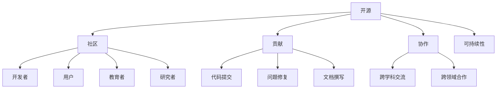

                 

## 1. 背景介绍

### 1.1 问题由来
在科技迅速发展的时代，知识的积累和分享已成为推动社会进步的重要力量。开源运动正是在这样的背景下应运而生的。它汇集了全球范围内的智慧，通过共同编写、协作修改和开放共享代码，加速了技术创新和产品迭代，成为软件开发和信息技术领域的一项核心战略。开源运动打破了传统软件开发模式中技术壁垒，促进了技术的普及和应用。

### 1.2 问题核心关键点
开源运动的成功关键在于其独特的协作模式，即“集体智慧”。这不仅体现在技术代码的共享上，更在于知识、经验、资源等多方面的整合和共享。它涵盖了从软件开发的代码库到科学研究的数据集，从学术资源的开放获取到教育领域的在线课程，每一个领域都因集体智慧的汇聚而焕发新机。

## 2. 核心概念与联系

### 2.1 核心概念概述

为了更好地理解开源运动的核心概念，我们需首先明确其核心元素及其相互关系。

- **开源**：开源不仅仅指代码的开放，更是一种态度和实践，强调透明、开放和协作，鼓励社区成员共同参与项目开发和管理。
- **社区**：开源项目的成功离不开社区的支持。社区成员不仅仅是开发者，还包括用户、教育者、学者、研究者等，他们的互动和合作构成了开源项目发展的基础。
- **贡献**：贡献是社区发展的动力，无论是代码提交、问题修复、文档撰写，还是社区讨论，都是对开源项目的贡献。
- **协作**：开源的精髓在于协作。它提倡跨学科、跨领域的交流合作，促进知识和技能的传播和应用。
- **可持续性**：开源运动的目标是实现技术的长久发展和可持续性。这意味着在开源社区中形成的知识和技能能够不断积累和传承，促进技术的持续创新。

这些核心概念之间的关系可通过以下Mermaid流程图来展示：



这个流程图展示了开源运动的几个关键元素及其相互联系：

1. 开源项目由社区成员共同开发和维护。
2. 社区成员通过代码提交、问题修复和文档撰写等方式积极贡献。
3. 社区成员之间的跨学科和跨领域合作促进了知识共享和技能传播。
4. 开源项目的可持续性依赖于社区的长期支持和贡献。

## 3. 核心算法原理 & 具体操作步骤

### 3.1 算法原理概述

开源运动的原理基于协作共创的价值观。它通过整合社区成员的智慧，实现技术和知识的共享和创新。在实际操作中，开源运动的成功很大程度上取决于以下算法原理：

- **贡献者管理**：通过版本控制系统（如Git）管理代码贡献和项目进度，确保贡献者之间的协作高效。
- **问题跟踪与解决**：使用问题跟踪系统（如Jira、GitHub Issues）记录和管理项目中的问题和缺陷，确保问题及时得到解决。
- **文档和知识共享**：通过Wiki或Readme文档形式，提供项目背景、开发流程、使用指南等信息，促进知识的共享和传承。
- **持续集成与交付**：采用持续集成工具（如Jenkins、Travis CI）确保代码的自动化构建、测试和部署，提升项目交付速度和质量。

### 3.2 算法步骤详解

开源运动的实际操作步骤可归纳为以下几个关键步骤：

**Step 1: 建立开源项目**
- 定义项目目标和愿景，明确项目的技术栈和实现路径。
- 选择合适的开源许可证（如MIT、Apache），规定项目的开源属性和使用的限制。
- 建立代码仓库，设置版本控制，初期可为空或包含样例代码。

**Step 2: 组建社区**
- 创建项目主页，搭建社区交流平台（如GitHub、Gitee），提供代码托管和项目讨论功能。
- 发布项目说明文档，吸引潜在贡献者。
- 建立贡献指南，包括代码提交规范、问题报告流程、代码评审流程等。

**Step 3: 收集贡献**
- 发布项目需求和待解决问题，鼓励社区成员积极参与。
- 定期审核代码提交，确保代码质量符合项目标准。
- 组织代码评审，促进社区成员之间的技术交流和学习。

**Step 4: 维护与更新**
- 定期发布项目版本，记录和公布项目进展和变化。
- 收集和处理用户反馈，持续优化项目功能和用户体验。
- 发布项目里程碑和公告，记录项目的重大进展和成就。

**Step 5: 推广与传播**
- 在技术社区和社交媒体上宣传项目，扩大项目的影响力和用户群。
- 组织和参与技术会议、培训和研讨会，促进社区成员之间的交流合作。
- 建立合作伙伴关系，推动项目与其他开源项目或商业组织的合作。

### 3.3 算法优缺点

开源运动的算法原理具有以下优点：
1. 协作高效：社区成员之间的协作使得开发过程更为高效，资源和知识共享减少了重复劳动。
2. 持续创新：开源项目的持续更新和迭代，使得技术不断进步，保持领先地位。
3. 社区支持：社区的广泛参与和支持，有助于提升项目的知名度和影响力。
4. 知识共享：开源项目通过文档和代码的共享，促进了知识的传播和应用。

同时，开源运动也存在一些局限性：
1. 管理和维护难度大：开源项目需要大量的管理和维护工作，对于小规模项目可能难以维持。
2. 贡献质量参差不齐：由于社区成员的素质和动机不同，代码贡献的质量和稳定性存在不确定性。
3. 知识产权风险：开源许可证可能无法完全保护项目的知识产权，存在侵权风险。
4. 商业利益冲突：商业项目和个人项目在开源平台上可能存在利益冲突，需合理协调。

尽管存在这些局限性，但就目前而言，开源运动在软件开发和技术创新领域已经成为了一种主流的发展模式。

### 3.4 算法应用领域

开源运动的算法原理和操作步骤在多个领域得到了广泛应用，包括但不限于：

- **软件开发**：如Linux内核、Apache Web Server、Django Web框架等，这些开源项目已成为全球范围内广泛使用的标准和参考。
- **科学计算**：如NumPy、SciPy、TensorFlow等，这些开源项目推动了计算科学和人工智能领域的发展。
- **教育**：如Open Education Resources（OER）平台，为全球教育提供了丰富的在线课程和资源。
- **数据管理**：如Apache Hadoop、Apache Spark等，这些开源项目极大地推动了大数据和数据科学领域的发展。
- **社交媒体**：如Twitter、Facebook等，这些开源社交平台通过开源实现快速迭代和扩展。

此外，开源运动还在艺术、文化、设计等多个领域得到了应用，为这些领域注入了新的活力。

## 4. 数学模型和公式 & 详细讲解 & 举例说明

### 4.1 数学模型构建

开源运动中的数学模型主要围绕代码贡献、问题解决和文档管理等方面展开。以下是一些核心数学模型的构建。

**贡献者模型**：

贡献者模型主要描述社区成员对项目的贡献度。我们可以使用贡献者活跃度（Activity Score）和贡献量（Commit Count）来衡量贡献者的贡献水平。假设有一个贡献者社区 $C=\{c_1, c_2, ..., c_n\}$，其中每个贡献者 $c_i$ 的活跃度为 $a_i$，贡献量为 $k_i$，则贡献度 $G_i$ 可以表示为：

$$
G_i = a_i + k_i
$$

**问题跟踪模型**：

问题跟踪模型用于描述项目的缺陷和改进。假设有一个问题跟踪系统 $T$，其中每个问题 $t_j$ 的状态为 $s_j$，解决度为 $r_j$，则问题跟踪模型可以表示为：

$$
T = \{t_j = (s_j, r_j)\}_{j=1}^N
$$

其中 $s_j$ 为问题状态（如已解决、待解决、未解决等），$r_j$ 为问题解决度（如解决时间、修复人数等）。

**文档共享模型**：

文档共享模型用于描述项目的文档和知识共享。假设有一个Wiki文档系统 $D$，其中每个文档 $d_m$ 的贡献度为 $g_m$，访问度为 $v_m$，则文档共享模型可以表示为：

$$
D = \{d_m = (g_m, v_m)\}_{m=1}^M
$$

其中 $g_m$ 为文档贡献度（如编辑次数、编辑人数等），$v_m$ 为文档访问度（如页面访问次数、用户评论数等）。

### 4.2 公式推导过程

以下是一些关键公式的推导过程：

**贡献度推导**：

$$
G_i = a_i + k_i
$$

其中 $a_i$ 表示贡献者 $c_i$ 的活跃度，可以定义为代码提交次数、代码审查次数、问题解决次数等。$k_i$ 表示贡献者 $c_i$ 的贡献量，可以定义为代码提交的行数、解决的问题数量等。

**问题跟踪模型推导**：

$$
T = \{t_j = (s_j, r_j)\}_{j=1}^N
$$

其中 $s_j$ 表示问题 $t_j$ 的状态，$r_j$ 表示问题解决度，可以定义为修复人数、修复时间等。

**文档共享模型推导**：

$$
D = \{d_m = (g_m, v_m)\}_{m=1}^M
$$

其中 $g_m$ 表示文档 $d_m$ 的贡献度，$v_m$ 表示文档的访问度。

### 4.3 案例分析与讲解

我们以GitHub上流行的开源项目Apache Hadoop为例，分析其开源实践的数学模型应用。

- **贡献者模型**：Apache Hadoop 有一个活跃的贡献者社区，贡献度高的贡献者通常具有较高的活跃度和贡献量。
- **问题跟踪模型**：Apache Hadoop 的问题跟踪系统记录了所有问题的状态和解决度，能够快速定位和解决项目中的缺陷。
- **文档共享模型**：Apache Hadoop 维护了大量的Wiki文档，这些文档的贡献度和访问度反映了社区成员的知识共享和合作程度。

通过对这些数学模型的分析，可以更好地理解开源项目的运作机制和贡献度量方式。

## 5. 项目实践：代码实例和详细解释说明

### 5.1 开发环境搭建

要进行开源项目开发，首先需要搭建开发环境。以下是使用Git和GitHub搭建开发环境的步骤：

1. 安装Git：从官网下载并安装Git客户端。
2. 创建GitHub账号：访问GitHub官网注册账号。
3. 克隆代码仓库：使用Git命令将GitHub上的开源项目代码克隆到本地。
4. 配置本地环境：根据项目要求，配置开发环境（如Python、Java、Node.js等）。
5. 提交代码：使用Git命令提交代码到GitHub，参与项目贡献。

完成上述步骤后，即可在本地搭建起GitHub上的开源项目，开始项目开发。

### 5.2 源代码详细实现

这里我们以开源项目TensorFlow为例，展示如何使用Git和GitHub进行开源项目开发。

**Step 1: 创建GitHub账号并创建仓库**
- 注册GitHub账号。
- 创建一个新的仓库，如 `tensorflow`。

**Step 2: 克隆代码仓库**
```bash
git clone https://github.com/tensorflow/tensorflow.git
```

**Step 3: 配置本地环境**
根据TensorFlow项目要求，安装所需的Python库和依赖。

**Step 4: 提交代码**
```bash
git add .
git commit -m "Add my feature"
git push origin master
```

**Step 5: 参与问题解决**
在GitHub的Issue页面提交修复建议和代码实现。

**Step 6: 参与代码审查**
提交Pull Request，请求代码审查。根据代码评审者的反馈进行迭代优化。

完成上述步骤后，即可在本地搭建起TensorFlow的开源项目，并通过GitHub参与项目贡献。

### 5.3 代码解读与分析

这里我们以TensorFlow的Pull Request（PR）为例，解读代码审查的过程：

1. 提交代码：开发人员将代码提交到GitHub的TensorFlow仓库，并附上详细的说明和测试报告。
2. 请求代码审查：开发人员创建Pull Request，请求其他贡献者进行代码审查。
3. 代码评审：其他贡献者对代码进行详细评审，指出问题和改进建议。
4. 迭代优化：开发人员根据评审意见进行修改和优化。
5. 合并代码：代码审查通过后，开发人员将代码合并到主分支，完成项目贡献。

通过代码审查的过程，可以看出开源项目的协作机制和代码质量保障方式。

### 5.4 运行结果展示

下面是TensorFlow项目的一些运行结果展示：

- **代码贡献度量**：GitHub统计了每个贡献者的贡献度量，如代码提交次数、解决问题数量等。
- **问题跟踪效果**：TensorFlow维护了详细的问题跟踪系统，记录了所有问题的状态和解决度，确保了项目的质量和稳定性。
- **文档共享效果**：TensorFlow维护了大量的Wiki文档，记录了项目的使用指南、API文档、开发流程等，帮助社区成员更好地参与项目开发和理解项目。

这些运行结果展示了开源项目的运作机制和效果，体现了社区协作和代码共享的显著优势。

## 6. 实际应用场景

### 6.1 软件开发

开源项目在软件开发中的应用非常广泛。例如，Apache Web Server 是一个全球范围内广泛使用的开源项目，其稳定性、安全性和灵活性为Web开发提供了坚实的基础。

### 6.2 科学计算

开源项目在科学计算领域也发挥了重要作用。如NumPy和SciPy，这些开源项目推动了计算科学和人工智能领域的发展，为科研和教育提供了强大的计算工具。

### 6.3 教育

开源项目在教育领域也有广泛的应用。如Open Education Resources（OER）平台，提供了丰富的在线课程和资源，促进了全球教育资源的共享和传播。

### 6.4 数据管理

开源项目在数据管理领域也有重要应用。如Apache Hadoop和Apache Spark，这些开源项目推动了大数据和数据科学领域的发展，为数据管理和分析提供了强大的工具。

### 6.5 社交媒体

开源项目在社交媒体领域也有显著应用。如Twitter和Facebook，这些开源平台通过开源实现快速迭代和扩展，为用户提供了强大的社交功能。

## 7. 工具和资源推荐

### 7.1 学习资源推荐

为了帮助开发者系统掌握开源运动的核心概念和实践技巧，这里推荐一些优质的学习资源：

1. **《开源哲学》系列博文**：由开源社区的专家撰写，深入浅出地介绍了开源理念、协作机制和最佳实践。
2. **MIT OpenCourseWare《Introduction to Computer Science and Programming Using Python》课程**：介绍了Python编程基础和开源项目开发的原理和技术。
3. **《开源项目管理与协作》书籍**：全面介绍了开源项目的组织、管理和协作方式，帮助开发者掌握开源项目的运作机制。
4. **Apache Foundation官方文档**：提供了Apache开源项目的开发指南和最佳实践，是参与开源项目的重要参考资料。
5. **GitHub官方文档**：详细介绍了GitHub的使用方法和最佳实践，帮助开发者更好地参与开源项目贡献。

通过对这些资源的学习实践，相信你一定能够系统掌握开源运动的核心概念和实践技巧，更好地参与开源项目开发。

### 7.2 开发工具推荐

高效的开源项目开发离不开优秀的工具支持。以下是几款常用的开发工具：

1. **Git**：一个版本控制系统，用于管理代码版本和贡献。
2. **GitHub**：一个代码托管平台，提供代码仓库、Pull Request、Issue跟踪等功能。
3. **Jira**：一个问题跟踪系统，用于管理项目中的问题和缺陷。
4. **Wiki**：一个文档管理系统，用于记录和共享项目文档和知识。
5. **Jenkins**：一个持续集成工具，用于自动化构建、测试和部署。

合理利用这些工具，可以显著提升开源项目开发的效率，加速技术创新和项目迭代。

### 7.3 相关论文推荐

开源运动的发展得益于学界的持续研究。以下是几篇奠基性的相关论文，推荐阅读：

1. **《开源软件发展趋势》**：探讨了开源软件的发展历程和未来趋势，分析了开源社区的动力和挑战。
2. **《开源社区合作网络分析》**：利用社交网络分析方法，研究了开源社区的合作模式和知识传播机制。
3. **《开源项目管理：最佳实践与挑战》**：总结了开源项目管理的最佳实践，提出了项目管理中的挑战和解决方案。
4. **《开源社区的贡献者行为分析》**：研究了开源社区成员的贡献行为和动机，探讨了如何吸引和保持贡献者。
5. **《开源项目绩效评估指标》**：提出了用于评估开源项目绩效的指标和方法，帮助项目管理者了解项目进展和成果。

这些论文代表了大规模开源项目研究的进展，可以帮助研究者把握学科前进方向，激发更多的创新灵感。

## 8. 总结：未来发展趋势与挑战

### 8.1 研究成果总结

开源运动已成为软件开发和技术创新的重要驱动力。它通过集体的智慧和协作，推动了技术的快速发展和普及，成为实现技术共享和创新的一个重要方式。未来，开源运动将进一步拓展其应用领域和影响范围，为全球技术发展注入更多活力。

### 8.2 未来发展趋势

开源运动的未来发展趋势包括以下几个方面：

1. **跨领域融合**：开源项目将更多地与其他技术领域进行融合，如人工智能、大数据、物联网等，推动跨学科技术的协同创新。
2. **全球化扩展**：开源项目将在全球范围内进一步扩展，促进国际合作和技术交流。
3. **社区生态建设**：开源社区将更加注重生态系统的建设，提供更加完善的工具和资源，支持开发者和用户的协作和贡献。
4. **持续创新**：开源项目将继续追求技术创新和优化，推动技术前沿的发展。
5. **社会责任**：开源项目将更加注重社会责任，促进技术公平和普惠，推动社会进步。

### 8.3 面临的挑战

开源运动在发展过程中仍面临一些挑战：

1. **管理和维护**：开源项目的规模和复杂性不断增加，管理和维护难度也随之上升。
2. **贡献者招募**：开源社区需要持续吸引和培养新的贡献者，以维持项目的活力和创新能力。
3. **知识产权保护**：开源许可证可能无法完全保护项目的知识产权，存在侵权风险。
4. **商业利益冲突**：商业项目和个人项目在开源平台上可能存在利益冲突，需合理协调。

### 8.4 研究展望

面对开源运动面临的挑战，未来的研究需要在以下几个方面寻求新的突破：

1. **自动化工具和流程**：开发更加自动化和智能化的工具和流程，提高开源项目的开发效率和协作质量。
2. **社区激励机制**：设计更加有效的社区激励机制，吸引和保持贡献者，增强社区活力。
3. **开源许可证改进**：改进开源许可证，增强知识产权保护和开源项目的可持续性。
4. **多语言支持和协作**：提供多语言支持和协作机制，促进全球开源社区的协作和交流。

## 9. 附录：常见问题与解答

**Q1: 开源项目如何保障代码质量和安全性？**

A: 开源项目通常通过代码审查和持续集成来保障代码质量和安全性。开发人员提交代码后，需要经过其他社区成员的代码审查，确保代码符合项目标准和规范。此外，持续集成工具能够自动构建、测试和部署代码，确保代码的稳定性和安全性。

**Q2: 开源项目如何吸引和保持贡献者？**

A: 开源项目通常通过社区活动、技术支持、代码贡献奖励等方式吸引和保持贡献者。社区活动如技术讲座、编码马拉松等，能够促进社区成员的交流和合作。技术支持和代码贡献奖励能够激发贡献者的积极性和创造力。

**Q3: 开源项目如何处理贡献者之间的冲突？**

A: 开源项目通常通过代码审查和争议解决机制来处理贡献者之间的冲突。贡献者提交代码后，其他社区成员可以进行代码审查，指出问题和改进建议。争议解决机制包括问题跟踪和仲裁机制，能够帮助解决贡献者之间的分歧和冲突。

**Q4: 开源项目如何应对大规模项目的挑战？**

A: 开源项目通常通过模块化设计和分布式协作来应对大规模项目的挑战。模块化设计将项目划分为多个模块，便于管理和维护。分布式协作将项目任务分配给多个团队，增强项目的协作和效率。

通过以上问答，可以看出开源运动在技术实现和管理实践方面的复杂性和多样性。开源运动需要在实践中不断探索和优化，才能更好地发挥其集体智慧的力量。

---

作者：禅与计算机程序设计艺术 / Zen and the Art of Computer Programming

