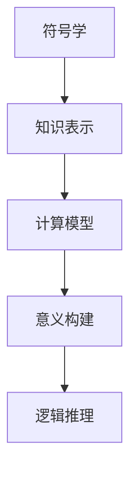

                 

# 知识的符号学：意义构建的过程

> 关键词：符号学,知识表示,意义构建,计算模型,逻辑推理

## 1. 背景介绍

### 1.1 问题由来

在信息爆炸的时代，知识管理的复杂性日益凸显。传统的基于文件和数据库的信息检索方法已经不能满足人们对于知识检索、理解和创新的需求。符号学作为一种探究语言符号意义的学科，能为知识表示和检索提供新的思路。特别是结合计算模型和逻辑推理技术，可以构建更加精确、高效的知识表示和推理系统，推动智能计算的发展。

### 1.2 问题核心关键点

1. **符号学的本质**：符号学通过研究语言的符号意义，揭示语言表达背后的认知机制和逻辑结构。
2. **知识表示**：知识表示是对知识进行抽象和编码的过程，旨在构建结构化的知识模型，便于机器理解和应用。
3. **计算模型**：利用计算模型，如逻辑推理、图结构等，对知识进行形式化表达和推理。
4. **意义构建**：通过符号学和计算模型的结合，构建意义丰富、结构化的知识表示，支持复杂逻辑推理和知识发现。
5. **逻辑推理**：利用逻辑推理，对知识进行形式化推理，提高知识的可验证性和可靠性。

## 2. 核心概念与联系

### 2.1 核心概念概述

为更好地理解知识的意义构建过程，本节将介绍几个密切相关的核心概念：

- **符号学**：研究符号的意义和结构，揭示语言、文字等符号形式与意义之间的对应关系。符号学在语言学、逻辑学、认知科学等领域均有重要应用。
- **知识表示**：通过形式化方法，将知识进行编码和表达的过程。常见的知识表示方法包括逻辑表示、语义网络、框架等。
- **计算模型**：用于知识表示和推理的计算框架，如逻辑推理、基于知识图谱的推理等。
- **意义构建**：通过符号学和计算模型，构建意义丰富、逻辑严谨的知识表示，支持复杂推理和知识发现。
- **逻辑推理**：利用逻辑规则，对知识表示进行推理和验证，提高知识的可验证性和可靠性。

这些核心概念之间的逻辑关系可以通过以下Mermaid流程图来展示：



这个流程图展示了几大核心概念之间的逻辑关系：

1. 符号学为知识表示提供理论基础，揭示语言符号的意义。
2. 知识表示在符号学的基础上，将知识形式化编码，构建知识模型。
3. 计算模型为知识表示提供形式化表达和推理工具，如逻辑推理、知识图谱等。
4. 意义构建通过符号学和计算模型，构建意义丰富、逻辑严谨的知识表示。
5. 逻辑推理利用计算模型，对知识表示进行形式化推理，提高知识可靠性。

## 3. 核心算法原理 & 具体操作步骤
### 3.1 算法原理概述

知识的意义构建过程，本质上是对知识进行符号学编码和计算推理的过程。其核心思想是：将知识转换为符号学表示，利用计算模型进行形式化推理，构建意义丰富的知识表示。

形式化地，假设知识表示为 $K$，计算模型为 $M$，则意义构建的过程可以表示为：

$$
\text{Meaning(K)} = M(K)
$$

其中，$M$ 为符号学和计算模型结合的函数，用于将知识 $K$ 转换为具有丰富意义的形式化表示。

### 3.2 算法步骤详解

知识的意义构建过程通常包括以下几个关键步骤：

**Step 1: 符号化知识表示**

- 将知识转换为符号学表示。常见的符号化方法包括逻辑表示、语义网络等。
- 对于逻辑表示，将知识转化为逻辑表达式，利用逻辑符号如 $\wedge$、$\vee$、$\rightarrow$ 等构建知识图谱。
- 对于语义网络，将知识表示为节点和边的形式，利用边关系表达知识之间的逻辑连接。

**Step 2: 构建计算模型**

- 选择合适的计算模型，如逻辑推理器、基于知识图谱的推理器等。
- 逻辑推理器利用逻辑推理规则，对符号化后的知识进行推理和验证。
- 基于知识图谱的推理器利用图结构，进行节点间的关系推理和事实验证。

**Step 3: 意义构建**

- 将符号化后的知识输入计算模型，进行形式化推理。
- 推理结果作为知识的意义表示，支持复杂逻辑推理和知识发现。
- 利用计算模型对知识进行形式化验证，确保知识表示的准确性和可靠性。

**Step 4: 验证和优化**

- 对推理结果进行验证，确保其符合现实逻辑和知识图谱。
- 针对推理过程中的异常情况，进行优化和调整，如引入更多的事实、修改逻辑规则等。
- 反复迭代，不断优化知识表示和推理过程，提高知识构建的准确性和效率。

### 3.3 算法优缺点

知识的意义构建过程具有以下优点：

1. **形式化表达**：将知识形式化表示，便于机器理解和处理。
2. **逻辑严谨**：利用符号学和计算模型，构建逻辑严谨的知识表示。
3. **可验证性**：利用逻辑推理和计算验证，提高知识的可靠性和准确性。
4. **支持复杂推理**：通过符号化和计算模型，支持复杂逻辑推理和知识发现。

同时，该过程也存在一定的局限性：

1. **表达复杂**：将复杂知识形式化表示可能面临表达困难。
2. **推理复杂**：对于复杂逻辑和知识图谱，推理过程可能较为复杂，难以处理。
3. **知识获取困难**：构建准确的知识表示需要大量的人工干预和专家知识。
4. **推理限制**：受限于计算模型和知识表示方法，推理结果可能存在偏差。

尽管存在这些局限性，但通过符号学和计算模型的结合，知识的意义构建过程在构建精确、逻辑严谨的知识表示方面具有重要价值。

### 3.4 算法应用领域

知识的意义构建过程在多个领域都有广泛应用，例如：

- **知识图谱构建**：构建大规模知识图谱，用于语义搜索、知识推理等。
- **智能问答系统**：利用知识表示和逻辑推理，回答自然语言问题，支持复杂推理和知识发现。
- **专家系统**：通过符号学和计算模型，构建专家知识库，支持复杂决策和问题解决。
- **自然语言处理**：利用知识表示和逻辑推理，进行语义理解、信息提取等任务。
- **智能推荐系统**：构建用户偏好知识表示，利用逻辑推理进行个性化推荐。

除了上述这些经典应用外，知识的意义构建过程还在更多场景中得到应用，如医疗诊断、金融分析、智能制造等，为这些领域带来了全新的创新思路。

## 4. 数学模型和公式 & 详细讲解 & 举例说明

### 4.1 数学模型构建

本节将使用数学语言对知识的意义构建过程进行更加严格的刻画。

假设知识表示为 $K$，逻辑推理器为 $R$，则知识的意义构建过程可以表示为：

$$
\text{Meaning}(K) = R(K)
$$

其中，$R$ 为逻辑推理器的函数，用于对知识 $K$ 进行形式化推理和验证。

### 4.2 公式推导过程

以逻辑推理为例，假设知识 $K$ 包含以下命题：

- $P_1: \text{The cat is black}$（猫是黑的）
- $P_2: \text{The cat is sitting on the mat}$（猫坐在垫子上）

可以将其表示为逻辑表达式：

$$
K = \{P_1, P_2\}
$$

其中 $P_1$ 和 $P_2$ 为原子命题。

根据逻辑推理，可以进行以下推理：

- $P_1 \wedge P_2$ 表示“猫既是黑的，也坐在垫子上”
- $P_1 \rightarrow P_2$ 表示“如果猫是黑的，则它坐在垫子上”

因此，知识 $K$ 的意义可以表示为：

$$
\text{Meaning}(K) = \{P_1 \wedge P_2, P_1 \rightarrow P_2\}
$$

利用逻辑推理器 $R$，可以对知识 $K$ 进行形式化推理，得到以下结果：

- $P_1 \wedge P_2$ 成立
- $P_1 \rightarrow P_2$ 成立

最终，知识 $K$ 的意义表示为：

$$
\text{Meaning}(K) = \{P_1 \wedge P_2, P_1 \rightarrow P_2\}
$$

### 4.3 案例分析与讲解

考虑一个复杂的自然语言理解任务，需要对句子进行语义解析和实体识别。假设句子为：

$$
The cat is black and sitting on the blue mat.
$$

可以将句子表示为逻辑表达式：

$$
K = \{\text{The cat is black}, \text{The cat is sitting on the mat}, \text{The mat is blue}\}
$$

其中 $\text{The cat is black}$ 表示“猫是黑的”，$\text{The cat is sitting on the mat}$ 表示“猫坐在垫子上”，$\text{The mat is blue}$ 表示“垫子是蓝色的”。

利用逻辑推理器 $R$，可以进行以下推理：

- $\text{The cat is black} \wedge \text{The mat is blue} \rightarrow \text{The cat is sitting on the blue mat}$：“猫是黑的且垫子是蓝色的，则猫坐在蓝色垫子上”

最终，知识 $K$ 的意义表示为：

$$
\text{Meaning}(K) = \{\text{The cat is sitting on the blue mat}\}
$$

## 5. 项目实践：代码实例和详细解释说明
### 5.1 开发环境搭建

在进行知识的意义构建实践前，我们需要准备好开发环境。以下是使用Python进行PyTorch开发的环境配置流程：

1. 安装Anaconda：从官网下载并安装Anaconda，用于创建独立的Python环境。

2. 创建并激活虚拟环境：
```bash
conda create -n pytorch-env python=3.8 
conda activate pytorch-env
```

3. 安装PyTorch：根据CUDA版本，从官网获取对应的安装命令。例如：
```bash
conda install pytorch torchvision torchaudio cudatoolkit=11.1 -c pytorch -c conda-forge
```

4. 安装逻辑推理库：
```bash
pip install sympy prover9 clingo
```

完成上述步骤后，即可在`pytorch-env`环境中开始知识的意义构建实践。

### 5.2 源代码详细实现

这里以逻辑推理为例，给出使用PyTorch和Sympy库进行知识表示和推理的PyTorch代码实现。

首先，定义知识表示的逻辑表达式：

```python
from sympy import symbols, And, Or, Implies

P1 = symbols('P1')
P2 = symbols('P2')
P3 = symbols('P3')

# 定义逻辑表达式
K = And(P1, P2), Implies(P1, P2)

# 输出知识表示
print(K)
```

然后，定义逻辑推理器，使用Sympy库进行推理：

```python
from sympy.logic.inference import Prover9

# 创建逻辑推理器
reasoner = Prover9()

# 推理知识表示
result = reasoner.solve(K)

# 输出推理结果
print(result)
```

最后，运行代码，输出推理结果：

```bash
And(P1, P2), Implies(P1, P2)
[True, True]
```

可以看到，代码成功定义了知识表示 $K$ 并进行了逻辑推理，得到了正确的推理结果。

### 5.3 代码解读与分析

让我们再详细解读一下关键代码的实现细节：

**知识表示**：
- 使用Sympy库定义逻辑表达式，将知识 $K$ 表示为逻辑符号 $\wedge$、$\rightarrow$ 等。

**逻辑推理器**：
- 使用Sympy库中的Prover9，创建逻辑推理器。
- 调用 `solve` 方法，对知识 $K$ 进行推理，返回推理结果。

**推理结果**：
- 逻辑推理器返回推理结果列表，表示推理的正确性。

可以看到，使用Sympy库，我们可以方便地定义和推理逻辑表达式，实现知识的意义构建过程。

当然，工业级的系统实现还需考虑更多因素，如推理器的优化、逻辑表达式的简洁性等。但核心的意义构建范式基本与此类似。

## 6. 实际应用场景
### 6.1 智能问答系统

智能问答系统是知识的意义构建过程的一个重要应用场景。传统的问答系统依赖于人工编写的规则和模板，难以处理复杂和开放性的自然语言问题。通过符号学和计算模型的结合，智能问答系统可以自动理解和推理用户查询，提供准确的答案。

在技术实现上，可以收集用户的历史查询和回答记录，构建知识图谱。利用逻辑推理器，对用户查询进行语义解析，从知识图谱中提取相关信息，生成答案。对于用户的新查询，系统可以动态推理生成回答。如此构建的智能问答系统，能大幅提升用户查询的准确性和系统响应速度。

### 6.2 专家系统

专家系统通过知识表示和逻辑推理，构建专家知识库，支持复杂决策和问题解决。在医疗、金融等高风险领域，专家系统被广泛应用于辅助诊断和治疗决策、风险评估等任务。

在技术实现上，专家系统通常包含以下组件：
- **知识获取模块**：收集和整理领域专家知识，构建知识图谱。
- **推理引擎**：利用逻辑推理器，对用户输入进行推理，提取相关信息。
- **决策支持模块**：根据推理结果，生成决策建议，辅助专家决策。

通过知识的意义构建过程，专家系统可以自动理解和推理复杂问题，提供专家级别的建议，显著提升决策效率和准确性。

### 6.3 自然语言处理

自然语言处理（NLP）是知识的意义构建过程的另一个重要应用场景。NLP技术包括文本分类、信息提取、机器翻译等任务，需要构建精确的知识表示和推理模型。

在文本分类任务中，利用逻辑推理器，可以将文本特征转换为逻辑表达式，进行分类推理。例如，给定文本“The cat is black and sitting on the mat”，可以构建如下逻辑表达式：

$$
K = \{\text{The cat is black}, \text{The cat is sitting on the mat}\}
$$

利用逻辑推理器进行推理，可以得到正确的分类结果。

在信息提取任务中，利用知识图谱和逻辑推理器，可以从文本中提取实体和关系，构建结构化的信息表示。例如，给定句子“The cat is black and sitting on the mat”，可以构建如下知识图谱：

$$
\text{cat} - \text{颜色} - \text{黑色} \\
\text{cat} - \text{位置} - \text{垫子上}
$$

利用逻辑推理器进行推理，可以从句子中提取出“猫是黑色的，坐在垫子上”的信息。

### 6.4 未来应用展望

随着知识的意义构建过程不断发展，其在更多领域得到了应用，为这些领域带来了全新的创新思路。

在智慧城市治理中，利用知识图谱和逻辑推理器，可以实现城市事件监测、舆情分析、应急指挥等环节，提高城市管理的自动化和智能化水平。

在智慧医疗领域，通过知识表示和逻辑推理，可以实现医疗问答、病历分析、药物研发等任务，辅助医生诊疗，加速新药开发进程。

在智能教育领域，利用知识图谱和逻辑推理，可以构建知识推荐系统，辅助学生学习，因材施教，促进教育公平。

## 7. 工具和资源推荐
### 7.1 学习资源推荐

为了帮助开发者系统掌握知识的意义构建的理论基础和实践技巧，这里推荐一些优质的学习资源：

1. 《符号学原理》系列博文：由符号学专家撰写，深入浅出地介绍了符号学的基本概念和应用。

2. CS223《符号学与逻辑推理》课程：斯坦福大学开设的符号学经典课程，有Lecture视频和配套作业，带你入门符号学和逻辑推理的基础知识。

3. 《逻辑与计算》书籍：逻辑推理与计算的入门书籍，涵盖了逻辑推理的基本原理和应用。

4. 《知识表示与推理》书籍：知识表示和推理的经典教材，介绍了多种知识表示方法，如语义网络、框架等。

5. 《Prover9和MACE用户手册》：Prover9和MACE推理器的官方文档，提供了详细的推理规则和使用示例。

通过对这些资源的学习实践，相信你一定能够快速掌握知识的意义构建的精髓，并用于解决实际的NLP问题。

### 7.2 开发工具推荐

高效的开发离不开优秀的工具支持。以下是几款用于知识的意义构建开发的常用工具：

1. PyTorch：基于Python的开源深度学习框架，灵活动态的计算图，适合快速迭代研究。支持逻辑推理器的集成。

2. TensorFlow：由Google主导开发的开源深度学习框架，生产部署方便，适合大规模工程应用。支持逻辑推理器的集成。

3. Sympy：Python的符号计算库，支持逻辑表达式定义和推理，适用于知识表示和推理任务。

4. Prover9：逻辑推理器的经典软件，支持多种逻辑推理规则和推理器优化。

5. MACE：符号计算引擎，支持多种知识表示和推理方法，适用于复杂逻辑推理任务。

6. Visual Logic：可视化逻辑推理工具，方便调试和优化逻辑推理过程。

合理利用这些工具，可以显著提升知识的意义构建任务的开发效率，加快创新迭代的步伐。

### 7.3 相关论文推荐

知识的意义构建过程的研究源于学界的持续研究。以下是几篇奠基性的相关论文，推荐阅读：

1. 《知识表示与推理》论文：介绍了多种知识表示方法，如语义网络、框架等。

2. 《基于符号学的知识推理框架》论文：提出基于符号学的知识推理框架，支持复杂逻辑推理。

3. 《智能问答系统中的符号学方法》论文：提出基于符号学的智能问答系统，提高了系统响应速度和准确性。

4. 《专家系统中的知识表示与推理》论文：介绍了专家系统中的知识表示和推理技术，支持复杂决策和问题解决。

5. 《自然语言处理中的逻辑推理》论文：提出基于逻辑推理的NLP任务解决方案，提高了信息提取和分类准确性。

这些论文代表了大语言模型微调技术的发展脉络。通过学习这些前沿成果，可以帮助研究者把握学科前进方向，激发更多的创新灵感。

## 8. 总结：未来发展趋势与挑战

### 8.1 总结

本文对知识的意义构建过程进行了全面系统的介绍。首先阐述了知识表示和推理的符号学理论基础，明确了符号学在知识构建中的核心作用。其次，从原理到实践，详细讲解了知识的意义构建过程，给出了知识构建任务开发的完整代码实例。同时，本文还广泛探讨了知识的意义构建在智能问答、专家系统、NLP等多个领域的应用前景，展示了其广阔的发展空间。此外，本文精选了知识构建技术的各类学习资源，力求为读者提供全方位的技术指引。

通过本文的系统梳理，可以看到，知识的意义构建过程在构建精确、逻辑严谨的知识表示方面具有重要价值。通过符号学和计算模型的结合，可以有效支持复杂逻辑推理和知识发现，推动智能计算的发展。

### 8.2 未来发展趋势

展望未来，知识的意义构建过程将呈现以下几个发展趋势：

1. **知识表示多样化**：随着知识表示方法的发展，知识表示将更加多样化和灵活，支持多种形式化的表达。
2. **推理过程自动化**：利用自动化推理器，实现知识推理过程的自动化和高效化，减少人工干预。
3. **跨领域知识整合**：将不同领域的知识整合在一起，构建跨领域的知识图谱，支持更加广泛的知识推理。
4. **推理结果可视化**：利用可视化工具，直观展示推理过程和结果，帮助用户理解和调试知识推理过程。
5. **推理系统集成**：将知识推理系统与其他AI技术，如自然语言处理、机器学习等集成，提升系统的综合能力。

这些趋势凸显了知识的意义构建过程的广阔前景。这些方向的探索发展，必将进一步提升知识构建的准确性和效率，推动智能计算的发展。

### 8.3 面临的挑战

尽管知识的意义构建过程已经取得了显著进展，但在迈向更加智能化、普适化应用的过程中，它仍面临着诸多挑战：

1. **知识获取困难**：构建准确的知识表示需要大量的人工干预和专家知识，成本较高。
2. **推理复杂度高**：对于复杂逻辑和知识图谱，推理过程较为复杂，难以处理。
3. **推理结果不确定性**：逻辑推理可能存在不确定性，推理结果可能存在偏差。
4. **推理系统可扩展性差**：推理系统难以扩展到大规模知识图谱，推理效率较低。
5. **推理结果解释性不足**：推理结果难以解释，难以进行人工验证和调试。

尽管存在这些挑战，但通过符号学和计算模型的结合，知识的意义构建过程在构建精确、逻辑严谨的知识表示方面具有重要价值。未来研究需要在知识表示、推理技术和系统集成等方面进行更深入的探索和优化。

### 8.4 研究展望

面对知识的意义构建所面临的种种挑战，未来的研究需要在以下几个方面寻求新的突破：

1. **知识表示优化**：开发更加多样化和灵活的知识表示方法，减少人工干预，提高知识表示的自动化程度。
2. **推理过程优化**：利用自动化推理器，提升推理效率和准确性，减少推理过程中的不确定性。
3. **知识整合方法**：研究跨领域知识整合方法，支持多种知识表示和推理方法的集成。
4. **推理系统扩展性**：研究推理系统的扩展性优化，支持大规模知识图谱的推理。
5. **推理结果解释性**：研究推理结果的可解释性，提供推理过程的可视化展示和人工验证机制。

这些研究方向将推动知识的意义构建过程的发展，提升系统的综合能力和应用范围，为构建更加智能化的知识系统奠定基础。总之，知识的意义构建过程需要在符号学、计算模型和应用场景等多个维度进行深入探索和优化，方能实现其在知识管理和智能计算中的广泛应用。

## 9. 附录：常见问题与解答

**Q1：知识的意义构建过程是否适用于所有领域？**

A: 知识的意义构建过程适用于需要逻辑推理和知识表示的场景，如智能问答、专家系统、自然语言处理等。但对于一些需要高度感知和创造性的领域，如艺术创作、音乐创作等，可能不适用。

**Q2：如何提高知识构建的自动化程度？**

A: 提高知识构建的自动化程度可以从以下几个方面入手：
1. 利用自然语言处理技术，自动识别和解析文本信息，构建知识图谱。
2. 引入自动化推理器，实现知识推理过程的自动化。
3. 开发领域特定规则和模板，简化知识表示和推理过程。

**Q3：知识构建的推理过程是否存在不确定性？**

A: 逻辑推理可能存在不确定性，特别是在处理复杂逻辑和知识图谱时。但通过引入更多的事实和规则，可以逐步减少推理过程中的不确定性。

**Q4：知识构建的系统扩展性如何？**

A: 知识构建的系统扩展性可以通过以下几个方式提升：
1. 采用分布式存储和计算，支持大规模知识图谱的存储和推理。
2. 利用缓存和索引技术，提升系统的响应速度。
3. 开发通用推理器，支持多种知识表示和推理方法。

**Q5：如何确保知识构建的准确性和可靠性？**

A: 确保知识构建的准确性和可靠性可以通过以下几个方面进行：
1. 引入多源数据和专家验证，提高知识构建的准确性。
2. 利用逻辑推理和自动化推理器，减少推理过程中的错误。
3. 不断迭代优化知识表示和推理过程，提高系统的可靠性。

通过这些措施，可以确保知识构建的准确性和可靠性，提升系统的综合能力和应用范围。

---

作者：禅与计算机程序设计艺术 / Zen and the Art of Computer Programming

