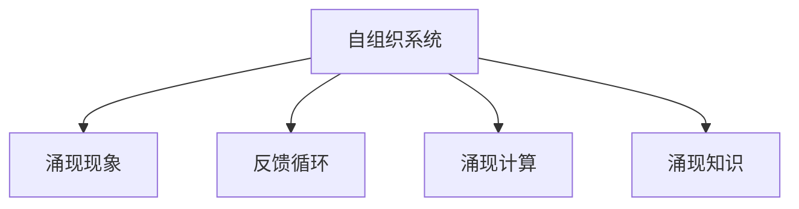

                 

# 知识的自组织：复杂系统中的涌现现象

## 1. 背景介绍

### 1.1 问题由来

在信息化高度发达的当今社会，信息的处理和组织成为推动科技创新的重要驱动力。然而，随着数据量的指数级增长，信息系统的复杂度也在不断提升。如何从海量的数据中高效地提取出有价值的信息，并形成系统的知识结构，成为了信息科学领域的重要研究课题。传统的静态信息系统和单一的数据处理算法难以应对复杂系统的挑战，因此需要引入新的思维方式和工具。

### 1.2 问题核心关键点

在研究复杂系统时，自组织现象是一个不容忽视的重要概念。自组织现象指的是在复杂系统中，无需外部控制和指导，各组成部分通过相互协调和相互作用，自发形成有序结构的过程。这与复杂的自适应系统密切相关，系统能够自动调整内部结构，以适应不断变化的环境。自组织系统在生物学、物理学、社会科学等领域都有广泛应用。

## 2. 核心概念与联系

### 2.1 核心概念概述

为了更好地理解自组织现象，本文将介绍几个关键概念：

- **自组织系统(Self-organizing System)**：指在无需外部控制的情况下，系统各组成部分通过相互作用和反馈机制，自动形成有序结构的系统。典型的例子包括生物体内的代谢和免疫反应，社会中的市场和社区组织等。
- **涌现现象(Emergence)**：指在局部相互作用中，通过复杂系统的多层次协同作用，形成整体性质，这种性质往往无法在单个组成部分中直接观察到。例如，神经网络中的协同作用可以形成智能，水中的微小分子作用可以形成潮汐等。
- **反馈循环(Feedback Loop)**：指系统中的输出部分再次作为输入，影响到系统的行为和状态。反馈循环可以导致系统表现出稳定的周期性行为，如自动调节、自我复制等。
- **涌现计算(Emergent Computation)**：指通过简单规则和局部交互，系统能够在全局层面上表现出复杂的计算能力。这种计算能力通常没有预设计算路径，具有自适应和鲁棒性。
- **涌现知识(Emergent Knowledge)**：指通过系统的相互作用和反馈，自发形成的新知识，这种知识往往具备高度的连贯性和适应性，能够动态适应复杂环境。

这些概念之间的逻辑关系可以通过以下Mermaid流程图来展示：



这个流程图展示自组织系统的核心概念及其之间的关系：

1. 自组织系统通过反馈循环和涌现计算，自发形成涌现现象。
2. 涌现现象在系统的不同层次和维度上形成涌现知识，这种知识具备自适应性。

## 3. 核心算法原理 & 具体操作步骤

### 3.1 算法原理概述

自组织现象的计算模型通常基于分布式、并行计算机制，通过简单的局部规则和多层次交互，形成整体复杂的涌现性质。这种计算模型往往不需要全局优化，依赖于系统的局部互动和反馈机制，通过不断的试错和调整，逐步优化整体结构。

在实际应用中，这种计算模型通常采用分布式计算框架，如MapReduce、Spark等，配合大数据存储和处理工具，如图数据库、Hadoop等，进行数据并行处理和优化。具体的实现步骤如下：

1. 数据收集和预处理：从不同来源收集数据，并进行清洗、去重、转换等预处理操作。
2. 并行计算框架部署：搭建分布式计算集群，部署计算框架和存储工具。
3. 局部规则设计：根据问题的特征和需求，设计简化的局部规则，用于处理和优化数据。
4. 数据并行处理：在分布式集群中，并行执行局部规则，通过反馈循环和协同作用，形成整体有序结构。
5. 结果分析和优化：对处理结果进行分析和评估，识别性能瓶颈和优化空间，不断调整局部规则和反馈机制，优化整体系统表现。

### 3.2 算法步骤详解

以下将详细讲解基于分布式计算框架的自组织算法步骤：

1. **数据收集与预处理**：
    - 收集系统所需的数据，例如文本、图像、社交网络数据等。
    - 对数据进行清洗、去重、归一化、转换等预处理操作，确保数据质量。
    - 将数据存储在分布式文件系统，如Hadoop、HDFS等，便于并行处理。

2. **并行计算框架部署**：
    - 搭建分布式计算集群，选择适合的大数据处理框架，如Apache Spark、Apache Flink等。
    - 部署并配置计算框架，设置节点数量、资源分配、数据分区等参数。
    - 设计合理的任务调度策略，避免数据瓶颈和资源浪费。

3. **局部规则设计**：
    - 根据问题特征和需求，设计简单的局部规则，如基于规则的决策树、神经网络等。
    - 定义规则的输入和输出，设定局部计算规则和反馈机制。
    - 实现并行化处理，将规则应用于分布式集群中的各个节点。

4. **数据并行处理**：
    - 在分布式集群中，并行执行局部规则，处理和优化数据。
    - 通过反馈循环，将处理结果再次作为输入，调整和优化局部规则。
    - 通过协同作用，逐步形成全局有序结构。

5. **结果分析和优化**：
    - 对处理结果进行评估，识别系统性能瓶颈和优化空间。
    - 根据评估结果，调整局部规则和反馈机制，优化整体系统表现。
    - 使用监控工具，如Ganglia、Nagios等，实时监测系统性能，及时发现和解决问题。

### 3.3 算法优缺点

自组织算法具有以下优点：

1. **鲁棒性高**：依赖分布式并行处理，具有高度的容错性和自适应性，能够动态应对系统变化。
2. **可扩展性强**：易于扩展到大型分布式系统，利用多节点并行处理，提升系统性能。
3. **灵活性高**：设计简单的局部规则，易于调整和优化，适应不同应用场景。

同时，该算法也存在一些缺点：

1. **资源消耗高**：分布式计算需要较高的硬件资源和网络带宽，增加了系统的部署和运行成本。
2. **复杂度高**：设计复杂规则和反馈机制，需要较高的技术水平和工程经验。
3. **收敛速度慢**：由于自适应调整，系统的收敛速度往往较慢，需要较长的迭代过程。

### 3.4 算法应用领域

自组织算法在多个领域具有广泛应用，例如：

1. **大数据分析**：在金融、医疗、社交网络等大数据领域，用于数据挖掘、用户行为分析等。
2. **智能推荐系统**：通过协同过滤和个性化推荐算法，提供个性化推荐内容，提升用户体验。
3. **智能控制**：在智能制造、交通管理等领域，用于优化资源配置、调度流程等。
4. **自然语言处理**：用于文本分类、情感分析、自动摘要等，提升文本处理效率和精度。
5. **生物信息学**：用于基因序列分析、蛋白质折叠、疾病预测等，提供新的生物研究方法和思路。
6. **社交网络分析**：用于社区发现、话题分析、用户关系挖掘等，提升社交网络平台的用户体验。

## 4. 数学模型和公式 & 详细讲解 & 举例说明

### 4.1 数学模型构建

自组织现象的计算模型通常采用分布式并行处理机制，通过简单的局部规则和多层次交互，形成整体复杂的涌现性质。这类模型通常不需要全局优化，依赖于系统的局部互动和反馈机制，通过不断的试错和调整，逐步优化整体结构。

以神经网络为例，下面将展示基于自组织算法的数学模型构建：

1. **神经网络结构**：
    - 神经网络由多个神经元组成，每个神经元接收输入，通过简单的非线性映射产生输出。
    - 神经元通过连接权重、偏置项和激活函数进行计算，形成局部规则。

2. **反馈机制设计**：
    - 神经网络中的每个神经元都将输出作为下一层的输入，形成反馈循环。
    - 通过反向传播算法，将误差信号传递到每个神经元，调整权重和偏置，优化整体结构。

### 4.2 公式推导过程

以简单的两层前馈神经网络为例，推导其训练过程和反馈机制：

$$
y_i = f(\sum_{j=1}^n w_{ij}x_j + b_i)
$$

其中 $x_j$ 为输入，$w_{ij}$ 为权重，$b_i$ 为偏置，$f$ 为激活函数。

假设网络的输出为 $y$，目标输出为 $t$，则误差信号 $e$ 为：

$$
e = y - t
$$

通过反向传播算法，计算每个神经元的误差信号，更新权重和偏置：

$$
\frac{\partial e}{\partial w_{ij}} = y_j(1-y_j)(f_i \frac{\partial y_i}{\partial x_j} - t_j)
$$

$$
\frac{\partial e}{\partial b_i} = y_j(1-y_j)f_i - t_j
$$

### 4.3 案例分析与讲解

以下以股票市场预测为例，展示如何应用自组织算法：

1. **数据收集与预处理**：
    - 收集历史股票交易数据，包括股票价格、交易量、市场指数等。
    - 对数据进行清洗、归一化、转换等预处理操作，确保数据质量。
    - 将数据存储在分布式文件系统，如Hadoop、HDFS等。

2. **并行计算框架部署**：
    - 搭建分布式计算集群，选择适合的计算框架，如Apache Spark、Apache Flink等。
    - 部署并配置计算框架，设置节点数量、资源分配、数据分区等参数。
    - 设计合理的数据分区和任务调度策略，避免数据瓶颈和资源浪费。

3. **局部规则设计**：
    - 设计基于自组织算法的局部规则，如基于时间序列的预测模型、自适应滤波器等。
    - 定义规则的输入和输出，设定局部计算规则和反馈机制。
    - 实现并行化处理，将规则应用于分布式集群中的各个节点。

4. **数据并行处理**：
    - 在分布式集群中，并行执行局部规则，处理和预测股票价格。
    - 通过反馈循环，将预测结果再次作为输入，调整和优化局部规则。
    - 通过协同作用，逐步形成全局有序结构，优化预测结果。

5. **结果分析和优化**：
    - 对预测结果进行评估，识别系统性能瓶颈和优化空间。
    - 根据评估结果，调整局部规则和反馈机制，优化整体系统表现。
    - 使用监控工具，如Ganglia、Nagios等，实时监测系统性能，及时发现和解决问题。

## 5. 项目实践：代码实例和详细解释说明

### 5.1 开发环境搭建

在进行自组织算法实践前，我们需要准备好开发环境。以下是使用Python进行Spark开发的环境配置流程：

1. 安装Apache Spark：从官网下载并安装Spark，并添加至系统PATH环境变量。
2. 安装PySpark：使用pip安装PySpark，支持Python接口的Spark。
3. 安装相关依赖：安装必要的第三方库，如numpy、pandas、scikit-learn等。

完成上述步骤后，即可在本地或远程集群中启动Spark环境，准备进行自组织算法的实践。

### 5.2 源代码详细实现

这里我们以简单的自适应滤波器为例，展示如何在Spark上进行数据并行处理和反馈优化：

```python
from pyspark import SparkContext, SparkConf
from pyspark.sql import SparkSession

# 初始化Spark环境
conf = SparkConf().setAppName("Adaptive Filter")
sc = SparkContext(conf=conf)
spark = SparkSession(sc)

# 数据收集与预处理
df = spark.read.csv("path/to/data.csv", header=True, inferSchema=True)

# 数据并行处理
df = df.select("feature", "label")

# 定义局部规则和反馈机制
def adaptive_filter(X, y):
    # 定义自适应滤波器，计算预测值和误差
    y_pred = X.dot(w) + b
    e = y - y_pred
    w = w - learning_rate * e * X.T
    b = b - learning_rate * e
    return w, b

# 初始化滤波器参数
w = np.random.randn(df.select("feature").columns.size)
b = 0.0
learning_rate = 0.01

# 并行处理每个数据点，更新滤波器参数
for i in range(1, df.count()):
    X, y = df.select("feature", "label").take(i).toPandas().dropna().values.T
    w, b = adaptive_filter(X, y)
    df = df.filter(df.index != i)  # 过滤已处理数据点

# 输出最终结果
df.write.csv("path/to/results.csv", header=True, index=False)
```

上述代码展示了如何在Spark上进行自适应滤波器的并行处理和反馈优化。主要步骤包括：

1. 初始化Spark环境，设置配置参数。
2. 数据收集与预处理，加载CSV格式的数据集。
3. 定义局部规则和反馈机制，实现自适应滤波器的计算。
4. 并行处理每个数据点，更新滤波器参数。
5. 输出最终结果，保存为CSV格式。

### 5.3 代码解读与分析

让我们再详细解读一下关键代码的实现细节：

**Spark环境初始化**：
- `SparkConf`用于设置Spark配置，`SparkContext`用于初始化Spark环境。
- `SparkSession`用于创建Spark SQL会话，方便数据处理和查询。

**数据收集与预处理**：
- `spark.read.csv`用于读取CSV格式的数据集，`header=True`和`inferSchema=True`表示自动识别数据结构和列名。
- `df.select`用于选取特征和标签列。
- `df.take(i)`用于逐行读取数据，`toPandas().dropna()`用于转换为pandas DataFrame并进行去重。

**局部规则和反馈机制**：
- `adaptive_filter`函数实现了自适应滤波器的计算过程，包括预测值和误差计算。
- `w`和`b`为滤波器的权重和偏置，`learning_rate`为学习率。
- 函数返回更新后的权重和偏置。

**并行处理和反馈优化**：
- 通过`range(1, df.count())`遍历每个数据点。
- 在每个数据点上，调用`adaptive_filter`函数进行局部规则计算和参数更新。
- 使用`df.filter`过滤已处理的数据点，避免重复计算。
- 最终输出结果保存为CSV格式。

## 6. 实际应用场景

### 6.1 金融风险管理

在金融领域，自组织算法可以用于风险管理和投资决策。例如，通过分析市场数据和金融指标，预测股票价格趋势，进行风险评估和投资组合优化。

1. **数据收集与预处理**：
    - 收集历史金融数据，包括股票价格、市场指数、交易量等。
    - 对数据进行清洗、归一化、转换等预处理操作，确保数据质量。
    - 将数据存储在分布式文件系统，如Hadoop、HDFS等。

2. **并行计算框架部署**：
    - 搭建分布式计算集群，选择适合的计算框架，如Apache Spark、Apache Flink等。
    - 部署并配置计算框架，设置节点数量、资源分配、数据分区等参数。
    - 设计合理的数据分区和任务调度策略，避免数据瓶颈和资源浪费。

3. **局部规则设计**：
    - 设计基于自组织算法的局部规则，如基于时间序列的预测模型、自适应滤波器等。
    - 定义规则的输入和输出，设定局部计算规则和反馈机制。
    - 实现并行化处理，将规则应用于分布式集群中的各个节点。

4. **数据并行处理**：
    - 在分布式集群中，并行执行局部规则，处理和预测股票价格。
    - 通过反馈循环，将预测结果再次作为输入，调整和优化局部规则。
    - 通过协同作用，逐步形成全局有序结构，优化预测结果。

5. **结果分析和优化**：
    - 对预测结果进行评估，识别系统性能瓶颈和优化空间。
    - 根据评估结果，调整局部规则和反馈机制，优化整体系统表现。
    - 使用监控工具，如Ganglia、Nagios等，实时监测系统性能，及时发现和解决问题。

### 6.2 智能制造

在智能制造领域，自组织算法可以用于生产流程优化和资源调度。例如，通过分析设备状态、生产数据和市场需求，优化生产计划和资源配置，提高生产效率和产品质量。

1. **数据收集与预处理**：
    - 收集设备状态、生产数据和市场需求等数据。
    - 对数据进行清洗、去重、归一化、转换等预处理操作，确保数据质量。
    - 将数据存储在分布式文件系统，如Hadoop、HDFS等。

2. **并行计算框架部署**：
    - 搭建分布式计算集群，选择适合的计算框架，如Apache Spark、Apache Flink等。
    - 部署并配置计算框架，设置节点数量、资源分配、数据分区等参数。
    - 设计合理的数据分区和任务调度策略，避免数据瓶颈和资源浪费。

3. **局部规则设计**：
    - 设计基于自组织算法的局部规则，如基于规则的决策树、自适应滤波器等。
    - 定义规则的输入和输出，设定局部计算规则和反馈机制。
    - 实现并行化处理，将规则应用于分布式集群中的各个节点。

4. **数据并行处理**：
    - 在分布式集群中，并行执行局部规则，处理和优化生产数据。
    - 通过反馈循环，将处理结果再次作为输入，调整和优化局部规则。
    - 通过协同作用，逐步形成全局有序结构，优化生产计划和资源配置。

5. **结果分析和优化**：
    - 对处理结果进行评估，识别系统性能瓶颈和优化空间。
    - 根据评估结果，调整局部规则和反馈机制，优化整体系统表现。
    - 使用监控工具，如Ganglia、Nagios等，实时监测系统性能，及时发现和解决问题。

## 7. 工具和资源推荐

### 7.1 学习资源推荐

为了帮助开发者系统掌握自组织现象的计算模型，这里推荐一些优质的学习资源：

1. 《Introduction to Data Science with Python》书籍：由Python数据科学之父Wes McKinney编写，全面介绍了数据科学基础和机器学习算法。
2. 《The Hadoop Distributed File System (HDFS): The Underlying System for Hadoop》书籍：介绍了Hadoop分布式文件系统的工作原理和应用场景。
3. 《Apache Spark: The Definitive Guide》书籍：Spark官方出版物，全面介绍了Spark架构、API和最佳实践。
4. Coursera《Machine Learning by Stanford University》课程：由Andrew Ng教授主讲，系统讲解了机器学习基础和算法。
5 Kaggle平台：提供大量的数据集和机器学习竞赛，实战练习自组织算法的应用。

通过对这些资源的学习实践，相信你一定能够快速掌握自组织现象的计算模型，并用于解决实际的NLP问题。

### 7.2 开发工具推荐

高效的开发离不开优秀的工具支持。以下是几款用于自组织算法开发的常用工具：

1. Apache Spark：基于内存计算的分布式计算框架，支持大规模数据处理和分析。
2. PySpark：Python接口的Spark，提供简单易用的API，方便数据处理和建模。
3. Scikit-learn：Python机器学习库，包含丰富的算法和工具，支持数据预处理和模型训练。
4. Pandas：Python数据分析库，提供高效的数据处理和分析功能。
5. Apache Flink：基于流处理的分布式计算框架，支持实时数据处理和分析。

合理利用这些工具，可以显著提升自组织算法的开发效率，加快创新迭代的步伐。

### 7.3 相关论文推荐

自组织现象的计算模型涉及众多研究领域，以下是几篇奠基性的相关论文，推荐阅读：

1. "A Mathematical Theory of Self-Organizing Systems" by Robert Kutchinsky：介绍了自组织系统的数学理论和算法模型。
2. "Emergent Computation in Neural Systems" by欧阳琼，曾志坚：详细介绍了神经网络中的涌现计算现象和自适应机制。
3. "Evolving Complexity in Adaptive Agents" byMitchell：探讨了适应性系统中的复杂性和涌现现象。
4. "Nature of Computation" byPamela Churchland：讨论了涌现计算的本质和机制。
5. "Complex Systems: An Introduction" byWeisbuch, Argimon：介绍了复杂系统的理论和应用，涵盖自组织现象、涌现计算等内容。

这些论文代表自组织现象计算模型的发展脉络。通过学习这些前沿成果，可以帮助研究者把握学科前进方向，激发更多的创新灵感。

## 8. 总结：未来发展趋势与挑战

### 8.1 总结

本文对自组织现象的计算模型进行了全面系统的介绍。首先阐述了自组织现象在复杂系统中的应用背景和意义，明确了自组织现象在复杂系统中的重要作用。其次，从原理到实践，详细讲解了自组织现象的计算模型和实现步骤，给出了实际应用中的代码实例。同时，本文还广泛探讨了自组织现象在金融风险管理、智能制造等多个领域的应用前景，展示了自组织算法的巨大潜力。此外，本文精选了自组织现象的各类学习资源，力求为读者提供全方位的技术指引。

通过本文的系统梳理，可以看到，自组织现象的计算模型在处理复杂系统时具备显著优势。这种模型无需全局优化，依赖于系统的局部互动和反馈机制，通过不断的试错和调整，逐步优化整体结构，能够适应多样化和动态化的系统需求。未来，伴随技术的持续演进和应用的不断深化，自组织现象的计算模型必将在更多领域得到广泛应用，为复杂系统的研究和实践带来新的突破。

### 8.2 未来发展趋势

展望未来，自组织现象的计算模型将呈现以下几个发展趋势：

1. **泛化性增强**：随着算法的不断优化和技术的进步，自组织现象的计算模型将能够处理更加复杂和多变的数据和任务。模型在面对新数据和新任务时，能够快速调整和优化，适应不同的应用场景。
2. **计算效率提升**：通过优化算法和工具，自组织现象的计算模型将具备更高的计算效率和可扩展性。模型能够在更短的时间内处理更大规模的数据，支持实时计算和在线分析。
3. **跨领域应用拓展**：自组织现象的计算模型将从传统的科学计算和工程应用，拓展到更广泛的领域，如社会网络分析、城市管理、公共卫生等。模型能够提供跨领域的综合性分析和决策支持，提升决策的科学性和准确性。
4. **人机协同增强**：通过引入机器学习和人工智能技术，自组织现象的计算模型将能够更好地与人类专家协作，提供智能化的辅助决策和支持。模型能够自动分析和提炼专家知识，辅助人类进行复杂系统的管理和优化。
5. **伦理和安全性保障**：在应用过程中，自组织现象的计算模型将加强伦理和安全性的考虑，避免偏见和歧视，确保输出结果的公平性和安全性。

这些趋势展示了自组织现象计算模型未来的发展方向，预示着其在复杂系统研究和应用中的重要地位和广阔前景。

### 8.3 面临的挑战

尽管自组织现象的计算模型已经取得了显著成果，但在迈向更加智能化、普适化应用的过程中，它仍面临诸多挑战：

1. **复杂度提升**：随着系统规模的不断扩大，自组织现象的计算模型需要处理更加复杂的数据和任务。算法的复杂度和计算资源的消耗将不断增加，需要新的优化方法和工具来提升效率。
2. **数据质量和多样性**：数据的质量和多样性直接影响自组织现象的计算模型的表现。如何获取高质量、多来源的数据，并进行有效的预处理和特征提取，是一个重要的研究方向。
3. **系统安全和可靠性**：自组织现象的计算模型往往依赖分布式计算和并行处理，容易出现数据丢失、节点故障等问题。如何提高系统的可靠性和容错性，是未来的一个重要课题。
4. **人机协作效果**：虽然自组织现象的计算模型能够辅助人类决策，但如何保证人机协作的效果和可信度，还需要进一步的研究和实践。模型的输出结果需要经过人类的审核和验证，确保其准确性和合理性。
5. **算法公平性和透明性**：在复杂系统中，自组织现象的计算模型可能会产生偏见和歧视，如何保证算法的公平性和透明性，避免不良后果，是未来需要重点关注的问题。

这些挑战需要学术界和工业界的共同努力，不断改进算法和工具，优化模型和系统，才能使自组织现象的计算模型更好地服务于复杂系统的研究和实践。

### 8.4 研究展望

未来，自组织现象的计算模型需要继续在以下几个方面进行深入研究：

1. **自适应学习机制**：研究自适应学习算法，提升模型对复杂系统的理解和预测能力。通过引入强化学习、迁移学习等技术，增强模型的自适应性和泛化性。
2. **跨领域知识整合**：将不同领域的知识和数据进行整合，增强模型的综合分析和决策能力。通过引入跨领域知识图谱、领域专家知识等，提升模型的理解和推理能力。
3. **分布式协同优化**：研究分布式协同优化算法，提升模型在分布式计算环境中的优化效率和稳定性。通过引入协同优化机制，提高模型的计算速度和可靠性。
4. **系统安全和隐私保护**：研究系统安全和隐私保护算法，确保模型在分布式计算环境中的数据安全和隐私保护。通过引入加密技术、差分隐私等方法，提升系统的安全性。
5. **伦理和公平性保障**：研究伦理和公平性保障算法，确保模型在复杂系统中不产生偏见和歧视。通过引入伦理导向的评估指标和公平性算法，提升模型的公平性和透明性。

这些研究方向的探索，必将引领自组织现象的计算模型迈向更高的台阶，为复杂系统的研究和应用提供新的突破。面向未来，自组织现象的计算模型需要与其他人工智能技术进行更深入的融合，共同推动复杂系统的智能化和优化。只有勇于创新、敢于突破，才能不断拓展系统的边界，实现更高的科学价值和应用价值。

## 9. 附录：常见问题与解答

**Q1：自组织现象的计算模型是否适用于所有复杂系统？**

A: 自组织现象的计算模型适用于具有分布式特征和反馈机制的复杂系统，如金融市场、社交网络、智能制造等。但对于一些高度结构化和规则明确的系统，可能需要其他计算模型，如规则引擎、决策树等。

**Q2：如何选择自组织现象的计算模型中的局部规则和反馈机制？**

A: 选择局部规则和反馈机制需要根据具体问题的特征和需求。一般来说，设计简单的局部规则和反馈机制，易于调整和优化，适应不同应用场景。例如，在金融风险管理中，可以选择基于时间序列的预测模型和自适应滤波器；在智能制造中，可以选择基于规则的决策树和协同优化算法。

**Q3：如何提高自组织现象的计算模型的计算效率？**

A: 提高计算效率可以通过优化算法和工具来实现。例如，使用分布式计算框架，如Spark、Flink等，进行并行处理和优化；使用深度学习技术，进行模型压缩和参数优化；使用数据压缩和存储技术，减少数据传输和存储的资源消耗。

**Q4：如何保证自组织现象的计算模型的公平性和透明性？**

A: 保证公平性和透明性需要在算法设计和数据处理过程中，引入伦理导向的评估指标和公平性算法。例如，在金融风险管理中，可以使用公平性算法对模型输出进行评估和调整；在社交网络分析中，可以使用伦理导向的评估指标对模型行为进行监控和优化。

**Q5：自组织现象的计算模型是否适合实时计算和在线分析？**

A: 自组织现象的计算模型适合实时计算和在线分析，尤其是分布式计算框架，如Spark、Flink等，具有高度的并行处理能力和计算效率。通过合理的任务调度策略和数据分区，可以实现实时数据处理和在线分析。

---

作者：禅与计算机程序设计艺术 / Zen and the Art of Computer Programming

