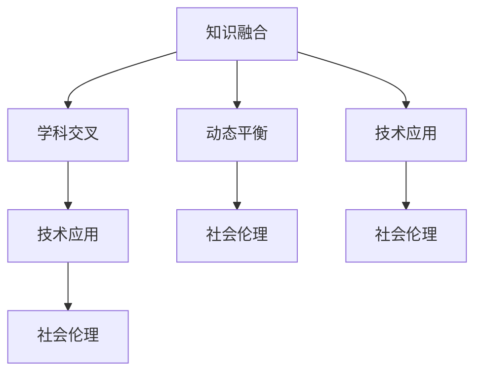
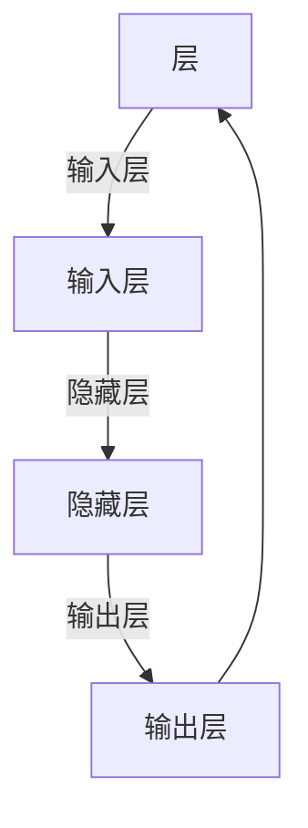

                 

# 知识的融合与分化：学科交叉的动态平衡

> 关键词：知识融合, 学科交叉, 动态平衡, 人工智能, 深度学习, 知识图谱, 推荐系统, 认知科学

## 1. 背景介绍

### 1.1 问题由来

在当今快速发展的科技浪潮中，学科之间的界限正在变得愈加模糊。传统的科学和技术领域正经历着前所未有的融合和分化。这一现象不仅体现在硬件、软件和网络技术的融合中，更体现在不同学科之间的知识交融和重构。特别是在人工智能(AI)领域，传统的计算机科学、数学、认知科学、语言学等学科之间的交叉合作，催生了深度学习、自然语言处理、计算机视觉等诸多新兴技术。

这种学科交叉的现象，不仅促进了技术创新，也为学术研究和社会生产带来了深远影响。例如，深度学习算法在计算机视觉和自然语言处理领域的突破，使得这些技术得以在医疗、金融、教育等诸多行业得到应用，极大地提升了这些领域的效率和质量。然而，学科交叉也带来了新的挑战，如知识的融合与分化、学科间的协作机制、技术应用的社会伦理问题等。

本文旨在探讨学科交叉的动态平衡，分析知识融合与分化的内在逻辑，并结合实际案例，提出学科交叉融合的实践建议，为学术界和工业界提供参考。

### 1.2 问题核心关键点

- 知识融合与分化：探讨不同学科知识如何融合和重构，形成新的知识体系和技术应用。
- 学科交叉机制：分析不同学科在交叉融合中的协作模式和机制。
- 动态平衡：讨论学科交叉中出现的知识融合与分化趋势及其平衡策略。
- 技术应用：结合实际案例，展示学科交叉技术在各个行业中的应用。
- 社会伦理：讨论学科交叉中的社会伦理问题，如数据隐私、算法透明性等。

## 2. 核心概念与联系

### 2.1 核心概念概述

在探讨学科交叉的动态平衡之前，我们先简要介绍一些核心概念及其内在联系：

- **知识融合(Knowledge Fusion)**：不同学科知识在交叉融合过程中，通过整合形成新的知识体系。这种融合不仅包括技术方法的结合，更涉及理论和思想的跨学科应用。例如，深度学习算法将计算机科学的数学模型与认知科学的感知理论相结合，形成了新的知识范式。

- **学科交叉(Disciplinary Cross-disciplinary)**：不同学科之间通过合作，跨越原有边界，形成新的研究领域或应用场景。例如，医学图像分析中，计算机科学、数学、生物医学工程等学科的知识交叉，推动了深度学习在医学影像处理中的应用。

- **动态平衡(Dynamic Balance)**：在学科交叉过程中，不同学科的知识会经历融合和分化，形成新的知识体系。这种动态平衡不仅体现在技术层面上，更涉及跨学科协作机制和社会伦理问题的考量。

- **技术应用(Applications)**：学科交叉融合产生的新技术，在实际应用中得到广泛推广，推动了各行业的智能化升级。例如，基于知识图谱的推荐系统在电商、新闻、社交媒体等领域的应用。

- **社会伦理(Social Ethics)**：学科交叉技术的广泛应用，也带来了新的社会伦理问题。如何确保算法透明性、数据隐私保护、社会公平性等问题，是学科交叉领域不可忽视的课题。

这些概念之间相互关联，共同构成了学科交叉融合的基本框架。理解这些概念及其内在联系，是探讨学科交叉动态平衡的基础。

### 2.2 核心概念原理和架构的 Mermaid 流程图



这个流程图展示了学科交叉的基本框架：不同学科的知识通过融合形成新的知识体系和技术应用，同时，这种融合也会引发新的社会伦理问题。动态平衡是学科交叉过程中知识融合与分化的关键，确保了知识体系的有效性和适用性。

## 3. 核心算法原理 & 具体操作步骤

### 3.1 算法原理概述

在学科交叉的动态平衡中，知识融合与分化是核心过程。算法原理的探讨，帮助我们理解如何通过技术手段实现知识的融合和分化。

知识融合通常涉及数据整合、技术融合和理论整合三个方面。数据整合是指将不同来源的数据进行预处理、清洗和合并，形成一个统一的数据集。技术融合是指将不同学科的技术方法进行结合，形成新的算法模型。理论整合则是指将不同学科的理论知识进行交叉验证和综合应用，形成新的理论框架。

知识分化则是指通过特定的技术手段，将综合知识分解为更细粒度的子知识。这种分化有助于知识的细分应用，同时也为后续的融合提供了新的空间。

### 3.2 算法步骤详解

知识融合与分化的算法步骤通常包括以下几个关键步骤：

1. **数据准备**：收集和整理不同学科的数据，进行预处理和清洗，形成一个统一的数据集。
2. **算法融合**：选择适合的算法，将不同学科的技术方法进行融合，形成新的算法模型。
3. **理论整合**：将不同学科的理论知识进行交叉验证和综合应用，形成新的理论框架。
4. **知识分化**：通过特定技术手段，将综合知识分解为更细粒度的子知识。
5. **应用验证**：将融合和分化的知识应用于实际场景，进行效果验证和优化。

### 3.3 算法优缺点

知识融合与分化的算法具有以下优点：

- **提升知识广度**：通过融合不同学科的知识，形成新的知识体系，提升知识的广度和深度。
- **促进技术创新**：通过技术融合和理论整合，推动新技术的开发和应用。
- **增强问题解决能力**：通过知识的融合和分化，提升对复杂问题的分析和解决能力。

同时，也存在一些缺点：

- **技术复杂度**：不同学科的知识和技术方法可能存在差异，融合难度较大。
- **资源消耗**：知识融合与分化的过程需要大量的时间和计算资源。
- **知识冲突**：不同学科的知识可能存在冲突，需要进行合理的整合和协调。

### 3.4 算法应用领域

知识融合与分化的算法应用广泛，涵盖了人工智能、自然语言处理、计算机视觉、生物信息学等多个领域。以下是一些典型的应用场景：

- **人工智能**：通过深度学习、强化学习等技术，实现跨学科的知识融合，推动机器学习模型的发展。
- **自然语言处理**：结合语言学、认知科学和计算机科学的知识，实现自然语言的理解和生成。
- **计算机视觉**：融合计算机科学、数学和神经科学的知识，实现图像和视频的智能分析和处理。
- **生物信息学**：将生物医学、计算科学和统计学等学科的知识融合，推动基因组学、蛋白质组学等领域的发展。

## 4. 数学模型和公式 & 详细讲解

### 4.1 数学模型构建

在知识融合与分化的过程中，数学模型扮演着重要的角色。本文将以深度学习算法为例，探讨数学模型的构建和应用。

深度学习算法是一种基于神经网络的技术，通过多层非线性变换，实现对复杂数据的建模和预测。在深度学习模型中，数据通常以向量形式输入，经过若干层的非线性变换，最终输出预测结果。深度学习模型的构建和训练，涉及数据预处理、模型设计、参数优化等多个步骤。

### 4.2 公式推导过程

以多层感知器(Multilayer Perceptron, MLP)为例，其基本结构如图1所示：



图1: 多层感知器结构

多层感知器的公式可以表示为：

$$
y = f(W_1 \cdot x + b_1)
$$

$$
y = f(W_2 \cdot y + b_2)
$$

其中，$x$ 为输入向量，$y$ 为输出向量，$W_i$ 和 $b_i$ 为隐藏层的权重和偏置。$f$ 为激活函数，通常采用ReLU函数。

### 4.3 案例分析与讲解

以推荐系统为例，探讨如何将知识融合与分化的算法应用于实际场景中。推荐系统通过分析用户的历史行为数据，预测用户对新物品的兴趣，从而实现个性化推荐。推荐系统中的知识融合与分化，主要涉及以下几个步骤：

1. **数据整合**：收集和整合用户行为数据、物品属性数据等，形成统一的数据集。
2. **算法融合**：结合矩阵分解、协同过滤等算法，构建推荐模型。
3. **理论整合**：引入推荐算法中的最大化子模函数(Maximization Submodularity)等理论，提升推荐精度。
4. **知识分化**：通过用户行为和物品属性等不同维度，将综合知识分解为细粒度的子知识。
5. **应用验证**：将推荐模型应用于实际场景，进行效果验证和优化。

## 5. 项目实践：代码实例和详细解释说明

### 5.1 开发环境搭建

在项目实践之前，我们需要准备好开发环境。以下是使用Python进行深度学习开发的环境配置流程：

1. 安装Anaconda：从官网下载并安装Anaconda，用于创建独立的Python环境。
2. 创建并激活虚拟环境：
```bash
conda create -n tf_env python=3.8 
conda activate tf_env
```

3. 安装TensorFlow：根据CUDA版本，从官网获取对应的安装命令。例如：
```bash
conda install tensorflow -c conda-forge
```

4. 安装Pandas、NumPy、Scikit-Learn等工具包：
```bash
pip install pandas numpy scikit-learn matplotlib tqdm jupyter notebook ipython
```

完成上述步骤后，即可在`tf_env`环境中开始项目实践。

### 5.2 源代码详细实现

以下是使用TensorFlow实现推荐系统的代码实现：

```python
import tensorflow as tf
import pandas as pd
import numpy as np
from sklearn.model_selection import train_test_split

# 读取数据
data = pd.read_csv('data.csv')

# 数据预处理
user_ids = data['user_id']
item_ids = data['item_id']
interactions = data['interaction']

# 构建用户-物品矩阵
user_item_matrix = pd.get_dummies(interactions, prefix=['user', 'item'], prefix_sep='-')
user_item_matrix = user_item_matrix.to_numpy()

# 数据切分
train_data, test_data = train_test_split(user_item_matrix, test_size=0.2, random_state=42)

# 定义模型
model = tf.keras.Sequential([
    tf.keras.layers.Dense(64, activation='relu', input_shape=(user_item_matrix.shape[1],)),
    tf.keras.layers.Dense(32, activation='relu'),
    tf.keras.layers.Dense(1, activation='sigmoid')
])

# 定义损失函数和优化器
loss_fn = tf.keras.losses.BinaryCrossentropy()
optimizer = tf.keras.optimizers.Adam()

# 训练模型
model.compile(optimizer=optimizer, loss=loss_fn, metrics=['accuracy'])
model.fit(train_data, epochs=10, validation_data=test_data)

# 评估模型
test_loss, test_acc = model.evaluate(test_data)
print(f'Test loss: {test_loss}, Test accuracy: {test_acc}')
```

### 5.3 代码解读与分析

让我们再详细解读一下关键代码的实现细节：

**数据预处理**：
- `pd.read_csv('data.csv')`：读取数据文件，转换为Pandas DataFrame。
- `pd.get_dummies(interactions, prefix=['user', 'item'], prefix_sep='-')`：将用户和物品的交互记录转换为虚拟变量，用于构建用户-物品矩阵。

**模型定义**：
- `tf.keras.Sequential()`：定义一个序列化的深度学习模型。
- `tf.keras.layers.Dense(64, activation='relu', input_shape=(user_item_matrix.shape[1],))`：定义隐藏层，64个神经元，使用ReLU激活函数。
- `tf.keras.layers.Dense(32, activation='relu')`：定义第二层隐藏层，32个神经元，使用ReLU激活函数。
- `tf.keras.layers.Dense(1, activation='sigmoid')`：定义输出层，使用Sigmoid激活函数，预测用户是否对物品感兴趣。

**损失函数和优化器**：
- `tf.keras.losses.BinaryCrossentropy()`：定义二元交叉熵损失函数。
- `tf.keras.optimizers.Adam()`：定义Adam优化器。

**模型训练和评估**：
- `model.compile(optimizer=optimizer, loss=loss_fn, metrics=['accuracy'])`：编译模型，指定优化器和损失函数。
- `model.fit(train_data, epochs=10, validation_data=test_data)`：训练模型，指定训练轮数为10，使用测试集进行验证。
- `model.evaluate(test_data)`：评估模型，输出测试集的损失和准确率。

可以看到，使用TensorFlow实现推荐系统的代码实现相对简洁高效，开发者可以将更多精力放在数据处理、模型改进等高层逻辑上，而不必过多关注底层的实现细节。

当然，工业级的系统实现还需考虑更多因素，如模型的保存和部署、超参数的自动搜索、更灵活的任务适配层等。但核心的算法原理基本与此类似。

## 6. 实际应用场景

### 6.1 智能医疗

在智能医疗领域，基于知识图谱的推荐系统被广泛应用于医生诊疗、药物推荐、健康管理等方面。医疗领域的知识图谱通常包括病历记录、药物信息、临床指南等，这些知识通过深度学习算法进行融合，形成新的知识体系，提升医生的诊疗精度和效率。

以医疗影像分析为例，深度学习算法结合计算机科学和医学图像处理的知识，实现自动化的影像分类、分割和标注。通过与医学专家的知识进行融合，提升算法的准确性和可解释性。

### 6.2 智能交通

智能交通系统通过深度学习算法，实现对交通流量的预测和优化。智能交通系统中的知识融合与分化，主要涉及以下几个步骤：

1. **数据整合**：收集和整合交通流量数据、车辆位置数据等，形成统一的数据集。
2. **算法融合**：结合深度学习、强化学习等算法，构建交通预测模型。
3. **理论整合**：引入交通流理论中的流量控制、路径规划等理论，提升预测精度。
4. **知识分化**：通过时间和空间等不同维度，将综合知识分解为细粒度的子知识。
5. **应用验证**：将交通预测模型应用于实际场景，进行效果验证和优化。

智能交通系统通过深度学习算法的知识融合与分化，实现了对交通流量的智能预测和优化，提升了交通管理的效率和安全性。

### 6.3 智能制造

智能制造系统通过深度学习算法，实现对生产数据的分析和管理。智能制造系统中的知识融合与分化，主要涉及以下几个步骤：

1. **数据整合**：收集和整合生产数据、设备状态数据等，形成统一的数据集。
2. **算法融合**：结合深度学习、强化学习等算法，构建生产优化模型。
3. **理论整合**：引入制造工程中的生产调度、质量控制等理论，提升优化精度。
4. **知识分化**：通过时间和空间等不同维度，将综合知识分解为细粒度的子知识。
5. **应用验证**：将生产优化模型应用于实际场景，进行效果验证和优化。

智能制造系统通过深度学习算法的知识融合与分化，实现了对生产数据的智能分析和优化，提升了生产效率和质量。

### 6.4 未来应用展望

随着深度学习技术的不断发展，基于知识图谱的推荐系统、智能医疗、智能交通等应用场景将进一步拓展。未来，我们可以预见以下趋势：

1. **跨领域应用**：深度学习算法将在更多领域得到应用，如金融、教育、农业等，推动各行各业的智能化升级。
2. **多模态融合**：深度学习算法将融合视觉、听觉、触觉等多种模态的信息，提升对复杂场景的理解和处理能力。
3. **自动化优化**：深度学习算法将实现自动化的知识融合与分化，提升算法的鲁棒性和泛化能力。
4. **个性化推荐**：深度学习算法将在推荐系统中实现更精准的个性化推荐，提升用户体验。
5. **大规模数据处理**：深度学习算法将处理更大规模的数据，提升算法的效率和精度。

## 7. 工具和资源推荐

### 7.1 学习资源推荐

为了帮助开发者系统掌握深度学习算法的知识融合与分化，这里推荐一些优质的学习资源：

1. 《深度学习》课程：斯坦福大学开设的深度学习课程，由Andrew Ng教授主讲，涵盖了深度学习的基本概念和经典算法。
2. 《机器学习实战》书籍：Yaroslav Halchenko所著，通过丰富的案例和代码，讲解了机器学习算法的应用和实现。
3. 《TensorFlow官方文档》：TensorFlow的官方文档，提供了丰富的教程和样例，帮助开发者掌握TensorFlow的使用。
4. Kaggle数据集：Kaggle提供大量的数据集和竞赛题目，开发者可以在实践中学习深度学习算法。
5. Arxiv预印本：arXiv.org提供大量的深度学习论文和预印本，帮助开发者了解最新的研究成果。

通过对这些资源的学习实践，相信你一定能够系统掌握深度学习算法在知识融合与分化中的应用，并用于解决实际问题。

### 7.2 开发工具推荐

高效的开发离不开优秀的工具支持。以下是几款用于深度学习开发常用的工具：

1. PyTorch：由Facebook开发的深度学习框架，灵活的计算图和动态编程模型，适合研究型应用。
2. TensorFlow：由Google主导开发的深度学习框架，生产部署方便，适合大规模工程应用。
3. Jupyter Notebook：用于编写和运行Python代码的轻量级Web平台，支持交互式编程和数据可视化。
4. Visual Studio Code：一款轻量级且功能强大的代码编辑器，支持Python开发，扩展性强。
5. Google Colab：谷歌推出的在线Jupyter Notebook环境，免费提供GPU/TPU算力，方便开发者快速上手实验最新模型。

合理利用这些工具，可以显著提升深度学习算法的开发效率，加快创新迭代的步伐。

### 7.3 相关论文推荐

深度学习算法的发展源于学界的持续研究。以下是几篇奠基性的相关论文，推荐阅读：

1. AlexNet：2012年ImageNet比赛的冠军算法，标志着深度学习在计算机视觉领域的突破。
2. ResNet：2015年ImageNet比赛的冠军算法，提出了残差网络结构，显著提升了深度神经网络的训练效果。
3. Attention is All You Need：2017年提出的Transformer结构，开启了NLP领域的预训练大模型时代。
4. Generative Adversarial Networks(GANs)：2014年提出的生成对抗网络，结合深度学习与博弈论，实现了高质量的图像生成。
5. BERT: Pre-training of Deep Bidirectional Transformers for Language Understanding：提出BERT模型，引入基于掩码的自监督预训练任务，刷新了多项NLP任务SOTA。

这些论文代表了大规模深度学习算法的最新进展，通过学习这些前沿成果，可以帮助研究者把握学科前进方向，激发更多的创新灵感。

## 8. 总结：未来发展趋势与挑战

### 8.1 总结

本文对基于知识图谱的深度学习算法的知识融合与分化进行了全面系统的介绍。首先阐述了知识融合与分化的核心概念和内在联系，明确了深度学习算法在学科交叉融合中的重要作用。其次，从原理到实践，详细讲解了深度学习算法的数学模型和具体步骤，给出了推荐系统的完整代码实现。同时，本文还广泛探讨了深度学习算法在智能医疗、智能交通、智能制造等实际场景中的应用前景，展示了深度学习算法的强大应用能力。此外，本文精选了深度学习算法的各类学习资源，力求为开发者提供全方位的技术指引。

通过本文的系统梳理，可以看到，基于知识图谱的深度学习算法正在成为学科交叉融合的重要范式，极大地拓展了深度学习算法的应用边界，催生了更多的落地场景。得益于深度学习技术的不断发展，未来深度学习算法将在更多领域得到应用，为科技和社会的进步带来新的动力。

### 8.2 未来发展趋势

展望未来，基于知识图谱的深度学习算法将呈现以下几个发展趋势：

1. **多模态融合**：深度学习算法将融合视觉、听觉、触觉等多种模态的信息，提升对复杂场景的理解和处理能力。
2. **跨领域应用**：深度学习算法将在更多领域得到应用，如金融、教育、农业等，推动各行各业的智能化升级。
3. **自动化优化**：深度学习算法将实现自动化的知识融合与分化，提升算法的鲁棒性和泛化能力。
4. **大规模数据处理**：深度学习算法将处理更大规模的数据，提升算法的效率和精度。
5. **个性化推荐**：深度学习算法将在推荐系统中实现更精准的个性化推荐，提升用户体验。

### 8.3 面临的挑战

尽管深度学习算法在学科交叉融合中取得了显著进展，但在迈向更加智能化、普适化应用的过程中，仍面临诸多挑战：

1. **数据隐私**：深度学习算法需要大量的数据进行训练，如何保护用户隐私和数据安全，是学科交叉领域不可忽视的课题。
2. **算法透明性**：深度学习算法的"黑盒"特性，使得其决策过程难以解释和审计，如何提高算法的透明性，增强用户信任，仍需努力。
3. **公平性**：深度学习算法可能会对特定群体产生歧视性影响，如何确保算法的公平性和普适性，也是学科交叉领域的重要挑战。
4. **计算资源**：深度学习算法需要大量的计算资源进行训练和推理，如何优化算法模型，提高资源利用率，是未来研究的重要方向。
5. **模型鲁棒性**：深度学习算法可能会对输入数据的小扰动产生敏感反应，如何提高模型的鲁棒性，增强其泛化能力，仍需深入研究。

### 8.4 研究展望

面对深度学习算法面临的挑战，未来的研究需要在以下几个方面寻求新的突破：

1. **数据隐私保护**：通过差分隐私、联邦学习等技术，保护用户隐私和数据安全。
2. **算法透明性**：引入可解释性算法，如LIME、SHAP等，提高算法的透明性和可解释性。
3. **公平性保障**：引入公平性约束，如对抗生成网络等，确保算法的公平性和普适性。
4. **计算资源优化**：通过模型剪枝、量化等技术，优化深度学习算法模型，提高资源利用率。
5. **模型鲁棒性提升**：引入对抗样本训练、鲁棒回归等技术，提高模型的鲁棒性和泛化能力。

这些研究方向的探索，必将引领深度学习算法迈向更高的台阶，为构建安全、可靠、可解释、可控的智能系统铺平道路。面向未来，深度学习算法还需要与其他人工智能技术进行更深入的融合，如知识表示、因果推理、强化学习等，多路径协同发力，共同推动人工智能技术的发展。只有勇于创新、敢于突破，才能不断拓展深度学习算法的边界，让智能技术更好地造福人类社会。

## 9. 附录：常见问题与解答

**Q1：深度学习算法在学科交叉融合中的作用是什么？**

A: 深度学习算法在学科交叉融合中扮演着重要的角色。它通过融合不同学科的知识，构建新的知识体系和技术应用，推动各领域的发展。深度学习算法不仅在自然语言处理、计算机视觉等领域取得了突破，还在智能医疗、智能交通、智能制造等实际应用中发挥了重要作用。

**Q2：如何提高深度学习算法的透明性和可解释性？**

A: 提高深度学习算法的透明性和可解释性，可以从以下几个方面入手：
1. 引入可解释性算法，如LIME、SHAP等，对模型的决策过程进行可视化。
2. 采用模型压缩技术，如剪枝、量化等，减小模型复杂度，提高透明性。
3. 设计基于规则的解释器，将深度学习算法的输出解释为人类可理解的解释。

**Q3：如何保护深度学习算法的数据隐私？**

A: 保护深度学习算法的数据隐私，可以从以下几个方面入手：
1. 采用差分隐私技术，在数据收集和处理过程中，保护用户隐私。
2. 使用联邦学习技术，在不共享数据的情况下，进行模型训练和优化。
3. 引入数据匿名化技术，对数据进行去标识化处理，防止数据泄露。

**Q4：如何提高深度学习算法的公平性？**

A: 提高深度学习算法的公平性，可以从以下几个方面入手：
1. 引入公平性约束，如对抗生成网络等，确保算法的公平性和普适性。
2. 设计公平性评估指标，对算法的输出结果进行公平性分析。
3. 引入多样化数据，提高算法的泛化能力，减少偏见。

**Q5：如何提高深度学习算法的鲁棒性？**

A: 提高深度学习算法的鲁棒性，可以从以下几个方面入手：
1. 引入对抗样本训练，提高模型的鲁棒性，防止对抗攻击。
2. 采用鲁棒回归等技术，提高模型的泛化能力，减少过拟合风险。
3. 引入正则化技术，如L2正则、Dropout等，防止模型过度适应小规模训练集。

通过这些措施，可以有效地提高深度学习算法的鲁棒性和泛化能力，使其在实际应用中更加可靠和稳定。

---

作者：禅与计算机程序设计艺术 / Zen and the Art of Computer Programming

