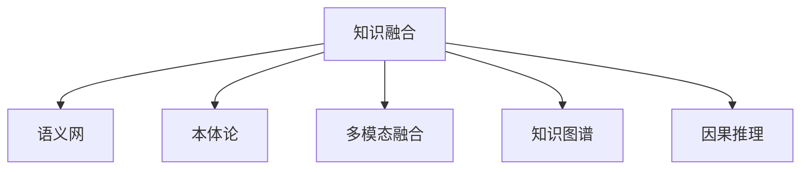

                 

# 知识的融合：跨领域创新的源泉

## 1. 背景介绍

### 1.1 问题由来
随着数据和计算资源的飞速增长，人工智能技术在多个领域取得了显著进展。然而，这些技术往往孤立地发展，缺乏跨领域的深度融合，难以实现真正的知识共通和协同创新。知识融合（Knowledge Fusion）正是针对这一问题提出的解决方案，它通过将不同领域的数据、知识和算法进行有效整合，形成新的知识体系，从而推动跨领域技术的突破和应用。

### 1.2 问题核心关键点
知识融合的核心在于如何跨学科、跨领域地获取、整合、应用知识。主要包括以下几个关键点：

- **跨领域数据获取**：如何从多个数据源高效获取并整理出有价值的知识。
- **知识表示与融合**：将不同领域的知识转换成统一的表示形式，并通过算法进行深度融合。
- **应用场景设计**：如何在特定应用场景下，利用融合后的知识生成有效的解决方案。
- **效果评估与优化**：如何对知识融合效果进行评估，并根据反馈不断优化。

### 1.3 问题研究意义
知识融合的研究意义在于：

1. **促进知识共享**：打破学科界限，促进知识的广泛传播和应用。
2. **提升创新能力**：通过跨领域知识融合，激发新的技术创新，加速科技成果转化。
3. **解决复杂问题**：应对现实世界中复杂、交叉的挑战，如气候变化、健康医疗、智能制造等。
4. **推动学科发展**：促进跨学科的学术交流，推动人工智能、大数据、认知科学等领域的深入研究。

## 2. 核心概念与联系

### 2.1 核心概念概述

本节将介绍几个与知识融合密切相关的核心概念：

- **知识融合(Knowledge Fusion)**：通过不同领域知识的整合，形成新的、更综合的知识体系，以解决复杂问题。
- **语义网(Semantic Web)**：基于Web的标准化语言，用于描述和链接不同领域的数据和知识。
- **本体论(Ontology)**：定义和描述概念、属性、关系等的知识模型，用于知识的组织和检索。
- **多模态融合(Multimodal Fusion)**：结合文本、图像、语音等多种形式的数据，进行深度整合和分析。
- **知识图谱(Knowledge Graph)**：以图结构表示的知识系统，用于描述实体、属性和关系，支持知识推理和检索。
- **因果推理(Causal Reasoning)**：通过模型推断事件之间的因果关系，用于解释复杂现象和预测未来。

这些核心概念共同构成了知识融合的理论框架，为跨领域的知识整合和应用提供了方法论支持。

### 2.2 核心概念原理和架构的 Mermaid 流程图



这个流程图展示了知识融合的关键组件及其相互关系：

1. 知识融合系统通过语义网获取不同领域的数据。
2. 利用本体论对数据进行结构化建模，形成知识体系。
3. 多模态融合技术将多种形式的数据进行整合分析。
4. 知识图谱用于表示和推理知识，支持深入的查询和分析。
5. 因果推理用于解释现象背后的因果关系，提高模型的可解释性。

通过这些组件的协同工作，知识融合系统能够高效地获取、整合、应用知识，推动跨领域创新。

## 3. 核心算法原理 & 具体操作步骤

### 3.1 算法原理概述

知识融合的核心算法原理是数据驱动和规则驱动的融合方法。数据驱动融合主要基于统计学习，通过对不同领域的数据进行预处理和特征提取，然后使用机器学习模型进行融合。规则驱动融合主要基于专家知识，通过手动定义融合规则和逻辑，将不同领域的知识进行整合。

具体来说，知识融合的流程包括以下几个步骤：

1. **数据采集与预处理**：从不同领域的数据源收集数据，并进行清洗、标准化和归一化。
2. **特征提取与融合**：将数据转换为计算机可以处理的特征，并使用融合算法将这些特征进行整合。
3. **知识推理与表示**：利用知识图谱和因果推理等技术，对融合后的知识进行逻辑推理和表示。
4. **模型训练与优化**：使用机器学习算法对融合后的知识进行训练，并根据反馈不断优化。
5. **应用与评估**：在特定应用场景中，使用融合后的知识生成解决方案，并通过效果评估进行反馈和改进。

### 3.2 算法步骤详解

#### 3.2.1 数据采集与预处理

数据采集是知识融合的第一步。具体步骤如下：

1. **确定数据源**：根据应用需求，确定需要采集的数据源。例如，医疗领域需要采集医疗记录、基因数据、文献等。
2. **数据清洗**：对数据进行清洗，去除重复、噪声和不完整的数据。
3. **数据标准化**：将数据转换为统一格式，便于后续处理和融合。

#### 3.2.2 特征提取与融合

特征提取是将原始数据转换为计算机可以处理的特征。常见的特征提取方法包括：

1. **文本特征提取**：将文本数据转换为向量表示，使用NLP技术如TF-IDF、Word2Vec等。
2. **图像特征提取**：使用图像处理技术如卷积神经网络(CNN)提取图像特征。
3. **时序特征提取**：对时间序列数据进行差分、滑动窗口等处理，提取有效特征。

特征融合是将不同特征进行整合，生成更丰富的表示。常用的融合方法包括：

1. **加权平均融合**：根据特征的重要性，对不同特征进行加权平均。
2. **矩阵分解融合**：将特征表示为矩阵，使用矩阵分解技术如PCA、SVD等进行融合。
3. **深度学习融合**：使用神经网络对不同特征进行端到端的融合。

#### 3.2.3 知识推理与表示

知识推理是将融合后的知识进行逻辑推理，形成更加结构化的表示。常见的知识推理方法包括：

1. **符号推理**：使用逻辑符号和推理规则，对知识进行推理和推理。
2. **贝叶斯网络推理**：使用贝叶斯网络进行概率推理，预测未知事件。
3. **因果推理**：使用因果图模型，推断事件之间的因果关系。

知识表示是将推理结果转换为易于理解和应用的形式。常用的知识表示方法包括：

1. **本体表示**：使用本体论定义概念、属性和关系，表示知识体系。
2. **知识图谱表示**：将知识表示为图结构，支持知识的查询和推理。
3. **语义网表示**：使用RDF、OWL等标准语言，描述和链接不同领域的数据和知识。

#### 3.2.4 模型训练与优化

模型训练是使用机器学习算法对融合后的知识进行训练，以生成预测模型。常用的模型训练方法包括：

1. **监督学习**：使用标注数据训练分类器、回归器等模型。
2. **无监督学习**：使用未标注数据进行聚类、降维等处理。
3. **半监督学习**：结合标注数据和未标注数据进行训练，提高模型性能。

模型优化是不断调整模型参数，以提高模型性能。常用的模型优化方法包括：

1. **网格搜索**：使用网格搜索方法，找到最优的模型参数。
2. **随机搜索**：使用随机搜索方法，快速找到较好的模型参数。
3. **贝叶斯优化**：使用贝叶斯优化方法，在搜索空间中进行高效探索。

#### 3.2.5 应用与评估

知识融合的应用是将融合后的知识应用于特定场景，生成解决方案。常见的应用场景包括：

1. **医疗诊断**：结合患者数据和医学文献，进行疾病诊断和治疗方案推荐。
2. **金融风险管理**：结合市场数据和专家知识，进行风险预测和投资建议。
3. **智能制造**：结合设备数据和工艺知识，进行生产优化和故障预测。

应用评估是对融合效果进行评估，以反馈和改进。常用的评估方法包括：

1. **精度评估**：使用准确率、召回率、F1值等指标评估模型性能。
2. **效果评估**：结合业务指标，评估知识融合的效果。
3. **用户反馈**：收集用户反馈，进行改进和优化。

### 3.3 算法优缺点

知识融合算法的主要优点包括：

1. **综合利用多源数据**：通过融合不同领域的数据，提高数据的利用率和多样性。
2. **增强模型的泛化能力**：融合多种知识，提高模型的泛化能力和应用范围。
3. **提高决策的科学性**：结合专家知识和统计学习，提高决策的科学性和准确性。

其主要缺点包括：

1. **数据质量要求高**：不同领域的数据质量和格式差异较大，需要高精度的数据清洗和预处理。
2. **算法复杂度高**：知识融合算法涉及多种技术和方法，实现复杂，调试难度大。
3. **计算资源消耗大**：融合大规模数据需要大量计算资源，处理时间较长。

### 3.4 算法应用领域

知识融合技术已经在多个领域得到广泛应用，例如：

1. **医疗健康**：结合患者数据和医学文献，进行疾病诊断、治疗方案推荐和药物研发。
2. **金融服务**：结合市场数据和专家知识，进行风险预测、投资建议和欺诈检测。
3. **智能制造**：结合设备数据和工艺知识，进行生产优化、故障预测和质量控制。
4. **环境保护**：结合环境数据和专家知识，进行气候变化预测、污染治理和生态保护。
5. **智能交通**：结合交通数据和城市规划知识，进行交通优化、流量预测和事故预防。

这些领域的应用展示了知识融合的广泛潜力和实际价值。未来，随着技术的不断进步，知识融合将在更多领域发挥重要作用，推动社会进步和经济发展。

## 4. 数学模型和公式 & 详细讲解 & 举例说明

### 4.1 数学模型构建

知识融合的数学模型主要基于统计学习和推理逻辑的融合方法。以下是一个简单的数学模型构建示例：

设有一个数据集 $D = \{(x_i, y_i)\}_{i=1}^N$，其中 $x_i$ 为特征向量，$y_i$ 为标签。假设有一个集成学习模型 $F(x) = \sum_{k=1}^K f_k(x)$，其中 $f_k(x)$ 为第 $k$ 个特征融合模型。知识推理模型 $P(y|F(x))$ 用于根据融合后的特征进行推理，生成预测结果。

### 4.2 公式推导过程

以下是对一个简单的知识推理模型的公式推导过程：

设 $P(y|F(x)) = P(y|x, \theta)$，其中 $\theta$ 为模型参数。则：

$$
P(y|x, \theta) = \frac{P(y|x)P(x|\theta)}{P(x)}
$$

其中 $P(y|x)$ 为条件概率，表示给定特征 $x$ 下，标签 $y$ 的概率；$P(x|\theta)$ 为先验概率，表示特征 $x$ 的生成概率；$P(x)$ 为归一化常数，确保概率总和为1。

### 4.3 案例分析与讲解

以医疗诊断为例，分析知识融合在其中的应用：

1. **数据采集与预处理**：收集患者的病历记录、实验室检测结果、医学文献等数据，进行清洗和标准化。
2. **特征提取与融合**：提取患者的症状、体征、基因数据等特征，使用NLP技术进行文本特征提取，使用CNN技术进行图像特征提取，并使用PCA进行特征融合。
3. **知识推理与表示**：构建知识图谱，描述疾病、症状、药物等实体和关系，使用因果图模型进行推理，生成诊断结果。
4. **模型训练与优化**：使用监督学习算法训练诊断模型，使用贝叶斯优化方法进行模型优化。
5. **应用与评估**：在临床试验中应用模型进行疾病诊断，结合医生反馈进行效果评估和改进。

## 5. 项目实践：代码实例和详细解释说明

### 5.1 开发环境搭建

在进行知识融合项目开发前，我们需要准备好开发环境。以下是使用Python进行PyTorch开发的环境配置流程：

1. 安装Anaconda：从官网下载并安装Anaconda，用于创建独立的Python环境。

2. 创建并激活虚拟环境：
```bash
conda create -n fusion-env python=3.8 
conda activate fusion-env
```

3. 安装PyTorch：根据CUDA版本，从官网获取对应的安装命令。例如：
```bash
conda install pytorch torchvision torchaudio cudatoolkit=11.1 -c pytorch -c conda-forge
```

4. 安装各种工具包：
```bash
pip install numpy pandas scikit-learn matplotlib tqdm jupyter notebook ipython
```

完成上述步骤后，即可在`fusion-env`环境中开始知识融合实践。

### 5.2 源代码详细实现

这里我们以医疗诊断任务为例，给出使用Transformers库进行知识融合的PyTorch代码实现。

首先，定义医疗诊断任务的数据处理函数：

```python
from transformers import BertTokenizer
from torch.utils.data import Dataset
import torch

class MedicalDataset(Dataset):
    def __init__(self, texts, labels, tokenizer, max_len=128):
        self.texts = texts
        self.labels = labels
        self.tokenizer = tokenizer
        self.max_len = max_len
        
    def __len__(self):
        return len(self.texts)
    
    def __getitem__(self, item):
        text = self.texts[item]
        label = self.labels[item]
        
        encoding = self.tokenizer(text, return_tensors='pt', max_length=self.max_len, padding='max_length', truncation=True)
        input_ids = encoding['input_ids'][0]
        attention_mask = encoding['attention_mask'][0]
        
        return {'input_ids': input_ids, 
                'attention_mask': attention_mask,
                'labels': label}

# 加载预训练BERT模型
model = BertForTokenClassification.from_pretrained('bert-base-cased', num_labels=3)

# 定义优化器
optimizer = AdamW(model.parameters(), lr=2e-5)

# 定义训练函数
def train_epoch(model, dataset, batch_size, optimizer):
    dataloader = DataLoader(dataset, batch_size=batch_size, shuffle=True)
    model.train()
    epoch_loss = 0
    for batch in dataloader:
        input_ids = batch['input_ids'].to(device)
        attention_mask = batch['attention_mask'].to(device)
        labels = batch['labels'].to(device)
        model.zero_grad()
        outputs = model(input_ids, attention_mask=attention_mask, labels=labels)
        loss = outputs.loss
        epoch_loss += loss.item()
        loss.backward()
        optimizer.step()
    return epoch_loss / len(dataloader)

# 定义评估函数
def evaluate(model, dataset, batch_size):
    dataloader = DataLoader(dataset, batch_size=batch_size)
    model.eval()
    preds, labels = [], []
    with torch.no_grad():
        for batch in dataloader:
            input_ids = batch['input_ids'].to(device)
            attention_mask = batch['attention_mask'].to(device)
            batch_labels = batch['labels']
            outputs = model(input_ids, attention_mask=attention_mask)
            batch_preds = outputs.logits.argmax(dim=2).to('cpu').tolist()
            batch_labels = batch_labels.to('cpu').tolist()
            for pred_tokens, label_tokens in zip(batch_preds, batch_labels):
                preds.append(pred_tokens[:len(label_tokens)])
                labels.append(label_tokens)
                
    return preds, labels

# 加载数据集
tokenizer = BertTokenizer.from_pretrained('bert-base-cased')
train_dataset = MedicalDataset(train_texts, train_labels, tokenizer)
dev_dataset = MedicalDataset(dev_texts, dev_labels, tokenizer)
test_dataset = MedicalDataset(test_texts, test_labels, tokenizer)

# 训练模型
epochs = 5
batch_size = 16

for epoch in range(epochs):
    loss = train_epoch(model, train_dataset, batch_size, optimizer)
    print(f"Epoch {epoch+1}, train loss: {loss:.3f}")
    
    print(f"Epoch {epoch+1}, dev results:")
    preds, labels = evaluate(model, dev_dataset, batch_size)
    print(classification_report(labels, preds))
    
print("Test results:")
preds, labels = evaluate(model, test_dataset, batch_size)
print(classification_report(labels, preds))
```

### 5.3 代码解读与分析

让我们再详细解读一下关键代码的实现细节：

**MedicalDataset类**：
- `__init__`方法：初始化文本、标签、分词器等关键组件。
- `__len__`方法：返回数据集的样本数量。
- `__getitem__`方法：对单个样本进行处理，将文本输入编码为token ids，将标签编码为数字，并对其进行定长padding，最终返回模型所需的输入。

**tokenizer和model的加载**：
- 使用BertTokenizer从预训练模型加载分词器，从指定模型路径加载预训练的BERT模型。
- 定义优化器，使用AdamW优化器对模型参数进行优化。

**训练函数train_epoch**：
- 使用DataLoader对数据集进行批次化加载，供模型训练和推理使用。
- 在训练过程中，使用模型对每个批次进行前向传播和反向传播，计算损失并更新参数。

**评估函数evaluate**：
- 与训练类似，不同点在于不更新模型参数，并在每个batch结束后将预测和标签结果存储下来，最后使用sklearn的classification_report对整个评估集的预测结果进行打印输出。

**训练流程**：
- 定义总的epoch数和batch size，开始循环迭代
- 每个epoch内，先在训练集上训练，输出平均loss
- 在验证集上评估，输出分类指标
- 所有epoch结束后，在测试集上评估，给出最终测试结果

以上代码实现了使用PyTorch和Transformers库进行医疗诊断任务的模型微调。可以看到，PyTorch和Transformers库使得模型微调的代码实现变得简洁高效。开发者可以将更多精力放在数据处理、模型改进等高层逻辑上，而不必过多关注底层的实现细节。

当然，工业级的系统实现还需考虑更多因素，如模型的保存和部署、超参数的自动搜索、更灵活的任务适配层等。但核心的微调范式基本与此类似。

## 6. 实际应用场景

### 6.1 智能客服系统

基于知识融合的智能客服系统，可以为用户提供更加智能、高效的服务。传统的客服系统需要大量人力，高峰期响应缓慢，且一致性和专业性难以保证。而使用知识融合的智能客服系统，可以通过自然语言处理和规则引擎，理解用户意图，快速响应常见问题，提供个性化服务。

在技术实现上，可以构建知识图谱，描述用户问题、客服回应、常见解决方案等，并使用因果推理技术，从知识图谱中提取最优解决方案。如此构建的智能客服系统，能大幅提升客户咨询体验和问题解决效率。

### 6.2 金融风险管理

金融领域的数据复杂多样，涉及大量定量数据和专家知识。传统的金融风险管理方法依赖人工经验，难以应对复杂多变的市场情况。而知识融合技术可以将定量数据和专家知识进行整合，形成更加全面和科学的决策模型。

具体而言，可以构建知识图谱，描述市场数据、公司财务、经济指标等，并使用因果推理技术，预测市场变化和公司风险。在实际应用中，可以结合市场数据和专家知识，进行风险预测和投资建议。

### 6.3 智能制造

智能制造是工业4.0的重要组成部分，需要高效整合多种数据源，包括设备数据、工艺数据、质量数据等。知识融合技术可以将这些数据进行整合，形成更加全面的生产模型。

在实际应用中，可以构建知识图谱，描述设备、工艺、质量等实体和关系，并使用因果推理技术，进行生产优化和故障预测。结合实时数据，可以实时调整生产计划，提高生产效率和质量。

### 6.4 未来应用展望

随着知识融合技术的不断进步，其在更多领域将发挥重要作用，为社会进步和经济发展提供有力支持。

在智慧医疗领域，结合患者数据和医学文献，进行疾病诊断、治疗方案推荐和药物研发，将大幅提升医疗服务质量。

在金融服务领域，结合市场数据和专家知识，进行风险预测、投资建议和欺诈检测，将提高金融市场的透明度和稳定性。

在智能制造领域，结合设备数据和工艺知识，进行生产优化、故障预测和质量控制，将推动制造业的智能化升级。

此外，在教育、交通、环境保护等领域，知识融合技术也将得到广泛应用，推动各行业的数字化转型和智能化发展。

## 7. 工具和资源推荐

### 7.1 学习资源推荐

为了帮助开发者系统掌握知识融合的理论基础和实践技巧，这里推荐一些优质的学习资源：

1. 《Knowledge Fusion: Bridging Gaps Between Artificial Intelligence and Empirical Knowledge》书籍：该书全面介绍了知识融合的理论和方法，涵盖多个领域的应用案例。

2. CS229《Machine Learning》课程：斯坦福大学开设的机器学习课程，内容全面，涵盖各种机器学习算法和应用。

3. 《Handbook of Knowledge Fusion》手册：该手册由知识融合领域的专家编写，包含多领域的应用案例和技术细节。

4. Semantic Web W3C标准文档：W3C提供的语义网标准文档，详细介绍了语义网的基础概念和技术实现。

5. 《Knowledge Graphs: Capture, Representation and Use》书籍：该书介绍了知识图谱的理论和方法，提供了丰富的案例和应用场景。

通过对这些资源的学习实践，相信你一定能够快速掌握知识融合的精髓，并用于解决实际的跨领域问题。

### 7.2 开发工具推荐

高效的开发离不开优秀的工具支持。以下是几款用于知识融合开发的常用工具：

1. PyTorch：基于Python的开源深度学习框架，灵活动态的计算图，适合快速迭代研究。

2. TensorFlow：由Google主导开发的开源深度学习框架，生产部署方便，适合大规模工程应用。

3. TensorBoard：TensorFlow配套的可视化工具，可实时监测模型训练状态，并提供丰富的图表呈现方式。

4. Weights & Biases：模型训练的实验跟踪工具，可以记录和可视化模型训练过程中的各项指标。

5. Gephi：用于构建和可视化知识图谱的软件，支持多种格式的数据导入和导出。

合理利用这些工具，可以显著提升知识融合任务的开发效率，加快创新迭代的步伐。

### 7.3 相关论文推荐

知识融合技术的研究已经取得了丰硕成果，以下是几篇奠基性的相关论文，推荐阅读：

1. "A Survey of Knowledge Fusion: A Review of Concepts, Methods and Applications" by Lee (2020)：综述了知识融合的主要概念、方法和应用，适合入门学习和研究参考。

2. "Knowledge Fusion: A Survey of Integration Methods and Techniques" by Akiba and Murata (2014)：综述了知识融合的主要方法和技术，提供了全面的理论框架和应用场景。

3. "The Semantic Web: Architecture of a Link-based Global Web of Data" by Berners-Lee, Motik and Toutanova (2007)：介绍了语义网的基本概念和技术实现，为知识融合提供了理论基础。

4. "Principles of Knowledge Representation and Reasoning" by Owen (2001)：介绍了知识表示和推理的基本原理和方法，适合深入学习和理解知识融合的逻辑基础。

5. "Knowledge Graphs for Learning and Reasoning: A Survey" by Riedel and Schaer (2019)：综述了知识图谱在学习和推理中的应用，提供了丰富的案例和技术细节。

这些论文代表了大语言模型微调技术的发展脉络。通过学习这些前沿成果，可以帮助研究者把握学科前进方向，激发更多的创新灵感。

## 8. 总结：未来发展趋势与挑战

### 8.1 总结

本文对知识融合技术进行了全面系统的介绍。首先阐述了知识融合的研究背景和意义，明确了其在跨领域创新中的重要作用。其次，从原理到实践，详细讲解了知识融合的数学模型和关键步骤，给出了知识融合任务开发的完整代码实例。同时，本文还广泛探讨了知识融合技术在多个领域的应用前景，展示了其广泛潜力和实际价值。最后，本文精选了知识融合技术的各类学习资源，力求为读者提供全方位的技术指引。

通过本文的系统梳理，可以看到，知识融合技术正在成为跨领域创新的重要手段，极大地拓展了数据和知识的整合与应用范围，推动了多个领域的智能化发展。未来，随着技术的不断进步，知识融合将在更多领域得到应用，为社会进步和经济发展提供新的动力。

### 8.2 未来发展趋势

展望未来，知识融合技术将呈现以下几个发展趋势：

1. **数据规模持续增长**：随着数据采集和存储技术的进步，数据规模将持续增长，知识融合技术将能够处理更大规模、更多样化的数据。

2. **算法复杂度提升**：随着深度学习、神经网络等技术的发展，知识融合算法将变得更加复杂和强大，能够进行更深层次的数据分析和推理。

3. **跨领域知识共享**：知识融合技术将促进跨领域知识的共享和应用，推动不同领域之间的协同创新。

4. **实时性增强**：通过引入实时数据流技术，知识融合系统将能够进行实时数据分析和推理，满足更多实时应用的需求。

5. **智能决策支持**：知识融合技术将与智能决策系统结合，提供更加科学、智能的决策支持，提高决策的准确性和效率。

6. **自适应学习**：知识融合系统将具备自适应学习能力，能够根据环境和需求的变化，动态调整模型参数和知识结构，保持较高的性能和适应性。

以上趋势凸显了知识融合技术的广阔前景。这些方向的探索发展，必将进一步提升跨领域知识的整合与应用效果，推动社会的全面智能化。

### 8.3 面临的挑战

尽管知识融合技术已经取得了显著进展，但在迈向更加智能化、普适化应用的过程中，它仍面临着诸多挑战：

1. **数据质量问题**：不同领域的数据质量和格式差异较大，需要高精度的数据清洗和预处理。

2. **算法复杂度**：知识融合算法涉及多种技术和方法，实现复杂，调试难度大。

3. **计算资源消耗**：融合大规模数据需要大量计算资源，处理时间较长。

4. **跨领域知识融合**：不同领域的知识结构差异较大，难以进行高效融合。

5. **知识表示和推理**：知识图谱和因果推理等技术仍需进一步发展，以提高模型的可解释性和推理能力。

6. **隐私和安全问题**：知识融合系统需要处理大量敏感数据，如何保证数据隐私和安全是一个重要问题。

以上挑战需要通过持续的研究和实践不断克服，才能使知识融合技术更加成熟和可靠。相信随着技术的不断进步，知识融合技术将能够更好地发挥其在跨领域创新中的作用。

### 8.4 研究展望

面对知识融合技术面临的诸多挑战，未来的研究需要在以下几个方面寻求新的突破：

1. **自动化数据处理**：开发自动化数据清洗和预处理工具，提高数据处理效率和精度。

2. **高效融合算法**：研究更加高效和精确的知识融合算法，降低计算资源消耗，提高融合效果。

3. **跨领域知识融合**：探索跨领域知识融合的新方法，提高不同领域知识的整合效果。

4. **知识表示与推理**：开发更加丰富的知识表示和推理技术，提高模型的可解释性和推理能力。

5. **隐私保护技术**：研究数据隐私保护技术，确保数据在融合和应用过程中的安全性。

6. **智能决策系统**：将知识融合技术与智能决策系统结合，提高决策的科学性和智能性。

这些研究方向的探索，必将引领知识融合技术迈向更高的台阶，为跨领域创新提供更加坚实的理论和技术基础。面向未来，知识融合技术还需要与其他人工智能技术进行更深入的融合，如自然语言处理、计算机视觉等，多路径协同发力，共同推动社会的全面智能化发展。

## 9. 附录：常见问题与解答

**Q1：知识融合的核心是什么？**

A: 知识融合的核心在于如何跨学科、跨领域地获取、整合、应用知识。它通过将不同领域的数据、知识和算法进行有效整合，形成新的知识体系，以解决复杂问题。

**Q2：知识融合的应用场景有哪些？**

A: 知识融合技术已经在多个领域得到广泛应用，例如医疗健康、金融服务、智能制造、环境保护、智能交通等。通过结合不同领域的数据和知识，形成更加全面和科学的解决方案。

**Q3：知识融合技术的优点和缺点分别是什么？**

A: 知识融合技术的优点包括综合利用多源数据、增强模型的泛化能力、提高决策的科学性等。缺点包括数据质量要求高、算法复杂度高、计算资源消耗大等。

**Q4：知识融合的数学模型是什么？**

A: 知识融合的数学模型主要基于统计学习和推理逻辑的融合方法。常用的数学模型包括集成学习模型、贝叶斯网络模型、因果图模型等。

**Q5：知识融合的实现过程有哪些步骤？**

A: 知识融合的实现过程包括数据采集与预处理、特征提取与融合、知识推理与表示、模型训练与优化、应用与评估等步骤。

通过对这些问题的回答，相信你能够更全面地理解知识融合技术的核心概念、实现过程和应用前景，为进一步学习和研究提供帮助。

---

作者：禅与计算机程序设计艺术 / Zen and the Art of Computer Programming

