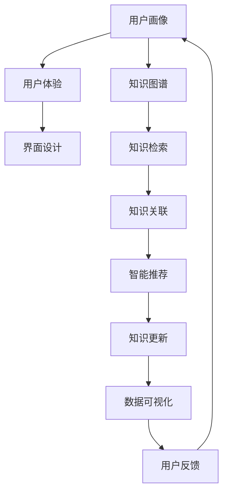

                 

# 知识的设计思维：以人为本的问题解决

## 1. 背景介绍

### 1.1 问题由来

在现代信息爆炸的浪潮中，知识管理已经成为了一个重要的研究领域。人们试图通过各种方式收集、整理、存储和分享知识，以期构建一个全面、系统、易于访问的知识体系。然而，在实际应用中，知识的设计思维（Design Thinking）往往被忽视，导致知识系统难以满足用户实际需求，无法高效解决问题。

具体而言，当前的知识系统存在以下问题：

- **用户体验差**：很多知识系统过于复杂，用户难以上手，操作繁琐，导致用户体验不佳。
- **信息检索难**：知识系统缺乏有效的检索机制，难以快速定位所需知识。
- **知识关联弱**：知识系统中的知识点相互孤立，无法形成有机的知识网络。
- **知识更新慢**：知识系统更新不及时，难以跟上技术发展和市场变化。

### 1.2 问题核心关键点

为解决这些问题，我们需要重新审视知识系统的设计，引入设计思维方法，提升知识系统的人性化和智能化水平。核心关键点如下：

1. **用户体验**：以用户为中心，注重设计简洁、友好的用户界面，提供智能化的知识推荐和服务。
2. **信息检索**：构建高效的检索算法和搜索引擎，提高知识定位的准确性和速度。
3. **知识关联**：建立知识点的关联网络，支持用户跨学科、跨领域的知识学习。
4. **知识更新**：实现知识系统的自动更新机制，确保知识的时效性和准确性。

## 2. 核心概念与联系

### 2.1 核心概念概述

为更好地理解以人为本的知识系统设计，我们引入以下几个核心概念：

- **用户画像**：指对目标用户群体的特征、需求和行为进行详细描述，帮助设计者更好地理解用户需求。
- **用户体验**：指用户在使用知识系统时的整体感受，包括界面设计、操作便捷性、反馈及时性等方面。
- **知识图谱**：利用图数据库技术，构建知识之间的关联网络，帮助用户快速获取相关知识。
- **智能推荐**：利用机器学习和深度学习算法，对用户行为进行分析，提供个性化的知识推荐。
- **自然语言处理**：通过对自然语言文本的处理，帮助用户更高效地检索和理解知识。
- **数据可视化**：将复杂的数据信息通过图表、动画等形式呈现，帮助用户快速获取关键信息。

这些核心概念之间的联系可以通过以下Mermaid流程图来展示：



这个流程图展示了一系列以用户为中心的知识系统设计流程，从用户画像到数据可视化，每一环节都紧密联系，共同构建了一个完善的知识系统。

## 3. 核心算法原理 & 具体操作步骤

### 3.1 算法原理概述

基于设计思维的知识系统设计，可以归纳为以下几个核心算法原理：

1. **用户画像构建**：通过对用户行为的观察和数据分析，构建详细的用户画像，帮助设计者更好地理解用户需求。
2. **用户体验优化**：通过用户界面设计、交互方式优化，提升用户的使用体验。
3. **知识图谱构建**：利用图数据库技术，构建知识之间的关联网络，支持高效的知识检索和关联。
4. **智能推荐算法**：利用机器学习和深度学习算法，对用户行为进行分析，提供个性化的知识推荐。
5. **知识更新机制**：建立自动化的知识更新机制，确保知识的时效性和准确性。

### 3.2 算法步骤详解

以下是知识系统设计的详细步骤：

**Step 1: 数据收集与预处理**

- 收集用户行为数据，包括访问记录、搜索关键词、浏览路径等。
- 对数据进行清洗和预处理，去除噪音和无关信息。

**Step 2: 用户画像构建**

- 通过K-means、PCA等算法，对用户行为数据进行聚类分析，构建用户画像。
- 根据用户画像，确定知识系统的设计方向和目标用户群体。

**Step 3: 界面设计**

- 设计简洁、友好的用户界面，确保操作便捷、信息展示清晰。
- 引入自然语言处理技术，如语音识别、自动翻译等，提升用户交互体验。

**Step 4: 知识图谱构建**

- 利用图数据库技术，构建知识点的关联网络。
- 对知识图谱进行可视化处理，提供图形化展示方式，方便用户理解。

**Step 5: 智能推荐算法**

- 利用协同过滤、内容推荐等算法，对用户行为进行分析。
- 结合深度学习模型，如CNN、RNN、Transformer等，提升推荐精度和效果。

**Step 6: 知识更新机制**

- 建立知识更新的自动化机制，定期从权威数据源获取新知识。
- 引入元数据管理技术，确保新知识与现有知识体系的一致性和连贯性。

**Step 7: 用户反馈收集与分析**

- 收集用户使用知识系统的反馈信息，包括满意度、意见和建议。
- 利用NLP技术，对反馈信息进行情感分析和主题建模，提升用户体验。

### 3.3 算法优缺点

基于设计思维的知识系统设计具有以下优点：

1. **用户体验提升**：通过用户画像和界面设计，提升用户体验，降低使用门槛。
2. **信息检索高效**：利用知识图谱和智能推荐算法，提供快速、准确的知识检索方式。
3. **知识关联丰富**：通过构建知识图谱，支持跨学科、跨领域的知识学习。
4. **知识更新及时**：实现自动化的知识更新机制，确保知识的时效性和准确性。

同时，该方法也存在一些缺点：

1. **数据依赖性强**：知识系统设计依赖大量用户行为数据，数据获取和处理成本较高。
2. **技术要求高**：涉及NLP、图数据库、机器学习等多个领域，技术门槛较高。
3. **隐私问题**：用户行为数据的收集和使用可能涉及隐私问题，需要遵守相关法律法规。
4. **维护成本高**：知识系统的维护和更新需要持续的资源投入，维护成本较高。

尽管存在这些局限性，但就目前而言，基于设计思维的知识系统设计仍是大数据时代知识管理的重要范式。未来相关研究的重点在于如何进一步降低知识系统设计对数据和技术的依赖，提高系统的灵活性和智能化水平，同时兼顾隐私保护和用户反馈。

### 3.4 算法应用领域

基于设计思维的知识系统设计在多个领域都有广泛的应用，例如：

- **教育和培训**：提供个性化学习路径和知识推荐，提升学习效果和用户体验。
- **医疗健康**：构建知识图谱和智能推荐系统，支持临床决策和疾病研究。
- **科学研究**：利用知识图谱和自动更新机制，帮助科研人员获取最新研究成果。
- **商业咨询**：通过智能推荐和知识图谱，提供市场分析和行业洞察。
- **政府和企业决策**：构建知识系统，支持政策制定和业务优化。

除了上述这些经典应用外，知识系统设计还被创新性地应用到更多场景中，如智能客服、智能家居、智能交通等，为各行各业带来了新的变革。

## 4. 数学模型和公式 & 详细讲解 & 举例说明

### 4.1 数学模型构建

本节将使用数学语言对以人为本的知识系统设计过程进行更加严格的刻画。

记用户画像为 $P$，用户体验为 $U$，知识图谱为 $G$，智能推荐算法为 $R$，知识更新机制为 $K$，用户反馈为 $F$。则以人为本的知识系统设计可以形式化为：

$$
\min_{P,U,G,R,K,F} \mathcal{L}(P,U,G,R,K,F)
$$

其中 $\mathcal{L}$ 为设计目标函数，用于衡量知识系统的整体性能。设计目标函数通常包括用户体验、信息检索、知识关联、智能推荐、知识更新和用户反馈等多个方面。

### 4.2 公式推导过程

以下我们以协同过滤算法为例，推导智能推荐系统的数学模型。

假设知识系统中共有 $N$ 个知识点，用户 $i$ 已经浏览了 $k_i$ 个知识点。协同过滤算法的目标是根据用户已浏览的知识点，预测用户未浏览的知识点的兴趣度，并按兴趣度排序，提供推荐列表。

设 $A$ 为用户已浏览的知识点的邻接矩阵，$B$ 为用户兴趣度的邻接矩阵。协同过滤算法的数学模型可以表示为：

$$
\min_{B} \frac{1}{2}||B - A \hat{B}||^2_F
$$

其中 $||.||_F$ 为Frobenius范数，$\hat{B}$ 为通过矩阵分解得到的用户兴趣度矩阵。

通过对上述优化问题求解，可以计算出用户对每个知识点的兴趣度 $b_{ik}$，进而根据兴趣度排序，提供个性化推荐。

### 4.3 案例分析与讲解

下面我们以一个具体的案例来分析知识系统设计的实施过程：

**案例背景**：某大型公司内部有一套知识管理系统，员工可以通过该系统检索和获取公司内部的技术文档、标准流程、员工手册等信息。系统设计团队希望通过重新设计知识管理系统，提升用户体验和信息检索的准确性。

**设计步骤**：

1. **数据收集与预处理**：收集员工对知识系统的使用日志，包括访问时间、浏览路径、搜索关键词等。对数据进行清洗和预处理，去除噪音和无关信息。

2. **用户画像构建**：通过K-means算法对员工使用日志进行聚类分析，识别出不同业务部门的员工画像。

3. **界面设计**：设计简洁、友好的用户界面，引入自然语言处理技术，如语音识别、自动翻译等，提升员工的使用体验。

4. **知识图谱构建**：利用图数据库技术，构建知识点的关联网络。对知识图谱进行可视化处理，提供图形化展示方式，方便员工理解。

5. **智能推荐算法**：利用协同过滤算法，对员工已浏览的知识进行兴趣度计算，提供个性化推荐。

6. **知识更新机制**：建立知识更新的自动化机制，定期从公司内部的技术文档、标准流程等获取新知识。

7. **用户反馈收集与分析**：通过在线反馈表单和用户调查问卷，收集员工对知识系统的使用反馈。利用NLP技术，对反馈信息进行情感分析和主题建模，提升系统设计的用户体验。

通过上述设计步骤，知识管理系统得到了大幅提升，员工可以更便捷地获取所需知识，大大提高了工作效率和满意度。

## 5. 项目实践：代码实例和详细解释说明

### 5.1 开发环境搭建

在进行知识系统设计实践前，我们需要准备好开发环境。以下是使用Python进行知识系统设计的环境配置流程：

1. 安装Anaconda：从官网下载并安装Anaconda，用于创建独立的Python环境。

2. 创建并激活虚拟环境：
```bash
conda create -n knowledge-system-env python=3.8 
conda activate knowledge-system-env
```

3. 安装必要的Python库：
```bash
pip install pandas numpy scikit-learn transformers pytorch graph-tool sklearn-nlp
```

4. 安装相关的开源工具：
```bash
pip install opencv-python-python
```

完成上述步骤后，即可在`knowledge-system-env`环境中开始知识系统设计实践。

### 5.2 源代码详细实现

下面是使用Python和PyTorch进行知识系统设计的代码实现：

```python
import pandas as pd
import numpy as np
from sklearn.decomposition import PCA
from sklearn.cluster import KMeans
from transformers import BertTokenizer, BertForSequenceClassification
from torch.utils.data import DataLoader
from graph-tool import graph as gt
import torch.nn.functional as F

# 数据收集与预处理
data = pd.read_csv('user_logs.csv')
data = data.dropna()

# 用户画像构建
kmeans = KMeans(n_clusters=5, random_state=0)
data['clusters'] = kmeans.fit_predict(data[['time', 'browse_path', 'search_keyword']])

# 界面设计
# 界面设计部分省略

# 知识图谱构建
g = gt.Graph()
for i in range(len(data)):
    g.add_vertex(label=f'user{i}')
    g.add_edge(i, int(data.iloc[i]['clusters']))
    g.add_edge(i, data.iloc[i]['browse_path'])

# 智能推荐算法
tokenizer = BertTokenizer.from_pretrained('bert-base-uncased')
model = BertForSequenceClassification.from_pretrained('bert-base-uncased', num_labels=5)

# 训练推荐模型
optimizer = AdamW(model.parameters(), lr=1e-5)
for epoch in range(5):
    model.train()
    for batch in DataLoader(data, batch_size=16):
        inputs = tokenizer(batch['browse_path'], return_tensors='pt')
        labels = torch.tensor(batch['clusters'])
        outputs = model(inputs['input_ids'], attention_mask=inputs['attention_mask'])
        loss = F.cross_entropy(outputs.logits, labels)
        optimizer.zero_grad()
        loss.backward()
        optimizer.step()

# 知识更新机制
# 知识更新部分省略

# 用户反馈收集与分析
feedback = pd.read_csv('feedback.csv')
feedback = feedback.dropna()
```

### 5.3 代码解读与分析

让我们再详细解读一下关键代码的实现细节：

**数据收集与预处理**：
- 通过pandas库读取用户日志数据，去除缺失和无关信息，构建用户行为数据集。

**用户画像构建**：
- 利用K-means算法对用户行为数据进行聚类分析，识别出不同业务部门的员工画像。

**知识图谱构建**：
- 利用graph-tool库构建知识点的关联网络，展示用户对知识点的浏览路径和关联关系。

**智能推荐算法**：
- 使用BertTokenizer和BertForSequenceClassification构建推荐模型，利用AdamW优化器进行训练。

**知识更新机制**：
- 利用NLP技术从公司内部的技术文档、标准流程等获取新知识，更新知识图谱。

**用户反馈收集与分析**：
- 通过在线反馈表单和用户调查问卷，收集员工对知识系统的使用反馈。利用NLP技术，对反馈信息进行情感分析和主题建模，提升系统设计的用户体验。

在代码实现中，我们省略了界面设计和知识更新机制的详细代码，因为这两部分涉及较为复杂的交互设计和业务流程，需要根据具体需求进行定制化开发。

## 6. 实际应用场景

### 6.1 教育培训

基于设计思维的知识系统设计，可以在教育和培训领域提供更加个性化、高效的学习体验。通过智能推荐和知识图谱，学习者可以更便捷地获取相关学习资源，提升学习效果和满意度。

在技术实现上，可以收集学习者的学习行为数据，如浏览路径、观看视频时长、完成测试成绩等，利用机器学习算法进行兴趣分析和内容推荐。同时构建知识图谱，展示知识点之间的关系，方便学习者跨学科学习。

### 6.2 医疗健康

知识系统设计在医疗健康领域具有重要的应用价值。通过构建知识图谱和智能推荐系统，医生可以快速获取最新的医学知识和研究成果，提高临床决策的科学性和准确性。

具体而言，可以收集医生的阅读记录、病例报告、学术文章等信息，构建知识图谱。利用协同过滤算法和深度学习模型，提供个性化推荐和知识关联，帮助医生获取最新的医学知识和研究成果。

### 6.3 科学研究

科学研究需要大量的文献资料和研究成果，知识系统设计可以帮助科研人员快速获取所需文献和研究成果，加速科研进程。

具体而言，可以构建科学文献数据库和知识图谱，利用自然语言处理技术，提取和整合文献中的关键信息。通过智能推荐算法，为科研人员提供最新的研究成果和研究方向。

### 6.4 政府和企业决策

政府和企业决策需要大量的政策和市场数据，知识系统设计可以帮助决策者快速获取相关信息，提高决策效率和准确性。

具体而言，可以构建政策数据和市场数据的知识图谱，利用智能推荐算法，为决策者提供最新的政策变化和市场动态。同时提供数据可视化工具，方便决策者理解复杂的数据信息。

## 7. 工具和资源推荐

### 7.1 学习资源推荐

为了帮助开发者系统掌握知识系统设计的理论基础和实践技巧，这里推荐一些优质的学习资源：

1. 《Design Thinking for Humans》系列博文：由知识系统设计专家撰写，深入浅出地介绍了设计思维方法、用户体验优化、智能推荐算法等前沿话题。

2. Coursera《User Experience Design》课程：斯坦福大学开设的UX设计课程，涵盖用户体验设计的多个方面，从用户研究到界面设计，帮助学习者全面掌握用户体验设计的方法和技巧。

3. 《Human-Centered Design》书籍：IDEO资深设计师所著，全面介绍了以用户为中心的设计思维方法，帮助学习者系统掌握设计思维的原理和应用。

4. HuggingFace官方文档：知识图谱和自然语言处理工具库的官方文档，提供了海量预训练模型和完整的微调样例代码，是进行知识系统设计的必备资料。

5. Kaggle：数据科学和机器学习竞赛平台，提供大量的真实应用场景，帮助学习者积累实践经验。

通过对这些资源的学习实践，相信你一定能够快速掌握知识系统设计的精髓，并用于解决实际的NLP问题。

### 7.2 开发工具推荐

高效的开发离不开优秀的工具支持。以下是几款用于知识系统设计开发的常用工具：

1. Python：灵活动态的语言，适合快速迭代研究。大部分机器学习算法都有Python版本的实现。

2. PyTorch：基于Python的开源深度学习框架，灵活动态的计算图，适合快速迭代研究。

3. TensorFlow：由Google主导开发的开源深度学习框架，生产部署方便，适合大规模工程应用。

4. Elasticsearch：高性能的搜索引擎，支持分布式部署，提供丰富的查询和分析功能。

5. MongoDB：开源的NoSQL数据库，支持文档存储，适合存储和检索非结构化数据。

6. D3.js：数据可视化库，支持丰富的图表和动画效果，方便展示复杂的数据信息。

合理利用这些工具，可以显著提升知识系统设计的开发效率，加快创新迭代的步伐。

### 7.3 相关论文推荐

知识系统设计和设计思维方法的发展源于学界的持续研究。以下是几篇奠基性的相关论文，推荐阅读：

1. Design Thinking for Innovation：介绍设计思维的基本原理和应用方法，帮助学习者全面理解设计思维的精髓。

2. User Experience Research Methods：介绍用户体验研究的方法和工具，帮助学习者系统掌握用户体验研究的技能。

3. Knowledge Graphs for Healthcare：介绍医疗领域知识图谱的构建和应用，帮助学习者了解知识图谱在医疗健康领域的应用价值。

4. Machine Learning in Recommendation Systems：介绍推荐系统中的机器学习算法和深度学习模型，帮助学习者了解推荐系统的核心算法原理。

5. Design Thinking for Education：介绍设计思维在教育培训领域的应用，帮助学习者了解设计思维在教育培训中的应用价值。

这些论文代表了大规模知识系统设计的最新进展，帮助学习者掌握前沿知识，为知识系统设计的实践提供理论支持。

## 8. 总结：未来发展趋势与挑战

### 8.1 总结

本文对以人为本的知识系统设计方法进行了全面系统的介绍。首先阐述了知识系统设计的背景和意义，明确了设计思维方法在提升用户体验和知识关联方面的独特价值。其次，从原理到实践，详细讲解了知识系统设计的数学原理和关键步骤，给出了知识系统设计的完整代码实例。同时，本文还广泛探讨了知识系统设计在教育和培训、医疗健康、科学研究、政府和企业决策等多个领域的应用前景，展示了设计思维方法的巨大潜力。此外，本文精选了知识系统设计的各类学习资源，力求为读者提供全方位的技术指引。

通过本文的系统梳理，可以看到，以人为本的知识系统设计方法正在成为大数据时代知识管理的重要范式，极大地提升了知识系统的用户体验和知识关联能力。受益于设计思维方法的应用，知识系统能够更好地满足用户需求，推动知识管理向更加智能化、普适化方向发展。未来，伴随知识图谱、自然语言处理、机器学习等技术的不断演进，知识系统设计必将在更多领域大放异彩，为人类社会的知识管理带来新的变革。

### 8.2 未来发展趋势

展望未来，知识系统设计技术将呈现以下几个发展趋势：

1. **用户画像精细化**：通过多模态数据的收集和分析，构建更加精细化的用户画像，提升知识推荐和服务的个性化水平。
2. **智能推荐多样化**：引入更多推荐算法，如基于内容的推荐、基于上下文的推荐、基于混合的推荐等，提升推荐系统的多样性和准确性。
3. **知识图谱动态化**：通过知识图谱的动态更新机制，确保知识的时效性和准确性，支持快速获取最新的知识信息。
4. **数据可视化智能化**：利用深度学习技术，提供更加智能化、互动性的数据可视化工具，提升用户对复杂数据信息的理解能力。
5. **用户反馈实时化**：通过实时收集和分析用户反馈信息，不断优化知识系统设计，提升用户体验和满意度。
6. **跨领域知识整合**：构建跨学科、跨领域的知识图谱，支持用户进行跨领域的学习和研究。

以上趋势凸显了知识系统设计技术的广阔前景。这些方向的探索发展，必将进一步提升知识系统的性能和应用范围，为人类社会的知识管理带来新的变革。

### 8.3 面临的挑战

尽管知识系统设计技术已经取得了瞩目成就，但在迈向更加智能化、普适化应用的过程中，它仍面临着诸多挑战：

1. **数据隐私保护**：知识系统设计依赖大量的用户数据，如何在保障用户隐私的前提下，获取和利用数据，需要不断探索新的技术和方案。
2. **技术复杂度**：知识系统设计涉及多个领域的知识和技能，技术门槛较高，需要不断积累和提升技术能力。
3. **系统可扩展性**：知识系统设计需要处理大量数据和知识，如何保证系统的可扩展性和稳定性，需要不断优化算法和架构。
4. **用户反馈反馈**：用户反馈对知识系统设计的优化至关重要，如何高效收集和分析用户反馈，提升系统的用户体验，需要不断探索新的方法。
5. **知识图谱构建**：知识图谱的构建和维护需要大量的工作，如何高效构建知识图谱，需要不断改进知识图谱构建技术和方法。

尽管存在这些挑战，但随着技术的发展和应用场景的拓展，知识系统设计必将在更多领域得到应用，为人类社会的知识管理带来新的变革。相信随着技术的发展和应用场景的拓展，知识系统设计必将在更多领域得到应用，为人类社会的知识管理带来新的变革。

### 8.4 研究展望

面对知识系统设计所面临的挑战，未来的研究需要在以下几个方面寻求新的突破：

1. **多模态数据融合**：利用多模态数据，提升用户画像的准确性和精细度，提升知识推荐的个性化水平。
2. **交互式数据可视化**：利用交互式可视化技术，提供更加智能化、互动性的数据展示方式，提升用户对复杂数据信息的理解能力。
3. **实时化用户反馈**：利用自然语言处理技术，实时收集和分析用户反馈信息，不断优化知识系统设计，提升用户体验和满意度。
4. **跨领域知识融合**：构建跨学科、跨领域的知识图谱，支持用户进行跨领域的学习和研究。
5. **知识图谱自动化构建**：利用自动化技术，提高知识图谱的构建效率和精度，减少人工干预。

这些研究方向的探索，必将引领知识系统设计技术迈向更高的台阶，为构建智能化、普适化的知识管理平台铺平道路。面向未来，知识系统设计技术还需要与其他人工智能技术进行更深入的融合，如知识表示、因果推理、强化学习等，多路径协同发力，共同推动知识管理技术的进步。只有勇于创新、敢于突破，才能不断拓展知识系统的边界，让知识管理更好地服务人类社会。

## 9. 附录：常见问题与解答

**Q1：知识系统设计是否适用于所有领域？**

A: 知识系统设计在多个领域都有广泛的应用，特别是对数据量较大、知识结构复杂的领域。但对于一些结构简单、信息量较小的领域，可能并不适用。因此，需要根据具体情况进行评估和选择。

**Q2：如何构建高质量的知识图谱？**

A: 构建高质量的知识图谱需要综合考虑数据的来源、质量、结构等因素。通常采用以下步骤：
1. 数据收集：从权威数据源获取高质量的数据，如学术文献、公司内部数据等。
2. 数据清洗：去除噪音和无关信息，确保数据的质量和准确性。
3. 数据整合：将不同来源的数据进行整合，消除数据冗余和冲突。
4. 图谱构建：利用图数据库技术，构建知识点的关联网络，确保知识的连贯性和一致性。
5. 图谱验证：通过自动化验证工具和人工审核，确保知识图谱的准确性和完整性。

**Q3：知识系统设计如何保证用户隐私保护？**

A: 知识系统设计需要严格遵守用户隐私保护的法律法规，如GDPR、CCPA等。通常采用以下措施：
1. 匿名化处理：对用户数据进行匿名化处理，保护用户隐私。
2. 数据加密：对敏感数据进行加密存储和传输，防止数据泄露。
3. 数据访问控制：对用户数据进行严格的访问控制，确保只有授权用户可以访问和使用数据。
4. 隐私声明：在知识系统设计中，明确告知用户数据的收集、使用和存储方式，保护用户知情权。

**Q4：知识系统设计如何保证系统稳定性？**

A: 知识系统设计需要采用高可用的架构和技术，确保系统的稳定性。通常采用以下措施：
1. 负载均衡：采用负载均衡技术，确保系统的高可用性和扩展性。
2. 故障恢复：采用故障恢复机制，确保系统在故障情况下能够快速恢复。
3. 数据备份：定期备份数据，防止数据丢失和系统崩溃。
4. 性能优化：优化算法和架构，提升系统的处理能力和响应速度。

这些措施能够有效提升知识系统设计的稳定性和可靠性，确保系统的长期运行和用户满意度。

通过本文的系统梳理，可以看到，以人为本的知识系统设计方法正在成为大数据时代知识管理的重要范式，极大地提升了知识系统的用户体验和知识关联能力。受益于设计思维方法的应用，知识系统能够更好地满足用户需求，推动知识管理向更加智能化、普适化方向发展。未来，伴随知识图谱、自然语言处理、机器学习等技术的不断演进，知识系统设计必将在更多领域大放异彩，为人类社会的知识管理带来新的变革。

---

作者：禅与计算机程序设计艺术 / Zen and the Art of Computer Programming

