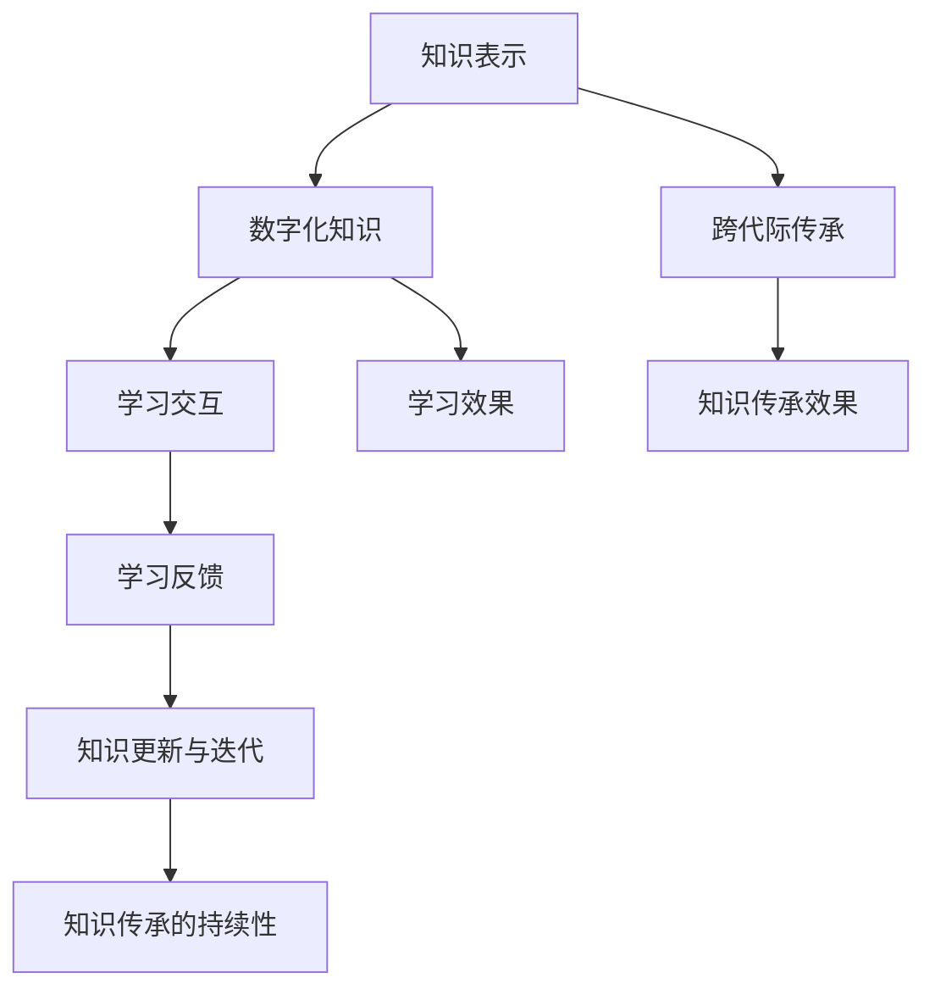

                 

# 知识的跨代际传承：文化延续的挑战

## 1. 背景介绍

### 1.1 问题由来

知识的传承与文化延续是每个时代的重要课题。随着信息技术的发展，知识的传播方式发生了巨大的变化，从书籍、报纸到互联网，知识得以更快、更广、更深入地传播。然而，知识的跨代际传承面临诸多挑战，特别是数字化时代的来临，更是对传统知识的传承方式提出了新的要求。

传统知识传承方式包括师徒传授、家族传承、社区交流等，这些方式往往依赖于人与人之间的互动。然而，数字化的知识传承方式，如在线课程、开放资源、数字档案等，尽管具有极大的便捷性和可访问性，但其互动性、可理解性和可适应性仍需不断改进。

### 1.2 问题核心关键点

本文旨在探讨如何利用信息技术的优势，更好地实现知识的跨代际传承，同时避免数字化传承方式可能带来的风险。核心关键点包括：

- **知识表示与转化**：如何将传统知识有效地数字化，使得年轻一代能够轻松理解和使用。
- **学习交互与反馈**：如何设计有效的学习交互机制，使学习者能够及时获得反馈和指导，从而提升学习效果。
- **跨平台兼容性**：如何构建跨平台的学习环境，方便不同年龄、不同背景的学习者使用。
- **隐私与安全**：如何在数字化传承过程中保护学习者的隐私和数据安全。

这些关键点构成了我们探讨知识传承文化延续的主要方向。

## 2. 核心概念与联系

### 2.1 核心概念概述

本节将介绍几个核心概念，并说明它们之间的联系：

- **知识表示**：指将知识以结构化或非结构化的形式进行编码和存储的过程。
- **知识传承**：指通过各种途径将知识从一代人传递给另一代人的过程。
- **数字化知识**：指将传统知识数字化，通过数字媒介进行存储和传播的知识。
- **跨代际传承**：指在数字时代，不同代际之间通过数字化媒介进行的知识传递。
- **学习交互**：指学习者与知识内容、同伴、导师之间的互动过程。
- **学习反馈**：指学习者在互动过程中，从教师或同伴处获得的关于学习表现和策略的反馈。

这些概念构成了知识传承与文化延续的核心框架。数字化知识的学习交互与反馈，则是推动知识传承的重要环节。

### 2.2 核心概念原理和架构的 Mermaid 流程图



这个流程图展示了核心概念之间的逻辑关系：

1. 知识表示：传统知识被数字化，形成可存储可传播的知识形式。
2. 跨代际传承：数字化知识通过各种媒介传递给年轻一代。
3. 学习交互：年轻一代通过互动学习和理解知识。
4. 学习反馈：通过互动和反馈，知识不断更新和迭代。
5. 知识传承效果：知识传递和学习效果显著。

这些概念和流程构成了知识传承的完整框架，反映了数字化时代知识传承的复杂性和多样性。

## 3. 核心算法原理 & 具体操作步骤

### 3.1 算法原理概述

知识传承的数字化过程可以抽象为一个信息处理的框架。框架的核心算法包括：

- **知识表示算法**：将传统知识编码成数字格式，以便于存储和传播。
- **学习交互算法**：设计互动学习机制，促进知识的理解和掌握。
- **学习反馈算法**：根据学习表现提供个性化反馈，指导学习者改进。

这些算法共同作用，确保知识在跨代际传承中得以有效传递和应用。

### 3.2 算法步骤详解

以“跨代际传承”为例，具体步骤如下：

**Step 1: 知识表示与转化**
- 将传统知识以文本、音频、视频等形式进行数字化编码，存储在数据库或分布式文件系统中。
- 使用文本挖掘技术，如NLP模型，提取关键信息，生成知识图谱，便于后续学习使用。

**Step 2: 设计学习交互平台**
- 构建基于Web的互动学习平台，支持多种学习方式，如视频课程、虚拟现实、游戏化学习等。
- 设计学习路径和课程结构，根据学习者的背景和需求进行个性化推荐。

**Step 3: 实现学习交互与反馈机制**
- 引入智能推荐系统，根据学习者行为和反馈动态调整课程内容。
- 使用自适应学习技术，根据学习者的学习情况，自动调整学习难度和节奏。
- 设立导师系统，提供专家答疑和指导。

**Step 4: 监测学习效果**
- 设计评估指标，如知识掌握度、应用能力、创新思维等，定期评估学习效果。
- 收集学习者的反馈意见，持续改进学习内容和互动机制。

### 3.3 算法优缺点

数字化知识传承的优点包括：

- **便捷性与可访问性**：数字化知识易于存储和传播，打破了时间和空间的限制。
- **可扩展性与可适应性**：数字化学习平台可以根据学习者的需求进行个性化定制。
- **效率与效果**：通过数据分析和反馈机制，可以显著提升学习效果。

但同时也存在一些缺点：

- **交互性和参与感不足**：数字化学习缺乏人与人之间的互动，难以建立深厚的师生关系。
- **知识深度和广度有限**：数字化知识往往难以覆盖人类全部知识领域，且缺乏深度。
- **隐私和安全问题**：数字化平台可能面临数据泄露和隐私侵犯的风险。

### 3.4 算法应用领域

数字化知识传承方法在多个领域得到广泛应用，包括：

- **教育**：在线课程、虚拟教室、自适应学习系统等，提升了教学效果和可及性。
- **医学**：电子病历、远程教学、虚拟仿真等，支持医疗知识的传承与创新。
- **文化与艺术**：数字博物馆、虚拟展览、在线论坛等，传承和推广文化艺术。
- **科学**：开放数据集、科研社区、在线实验室等，促进科学研究的传播与合作。

这些应用领域展示了数字化知识传承的巨大潜力，为不同领域的学习者提供了丰富的学习资源和平台。

## 4. 数学模型和公式 & 详细讲解 & 举例说明

### 4.1 数学模型构建

我们可以使用数学模型来描述数字化知识传承的整个过程。设 $K$ 为传统知识集合，$D$ 为数字化后存储的知识库，$U$ 为学习者集合，$L$ 为学习平台，$F$ 为学习反馈机制。

模型可表示为：
$$
K \rightarrow D \rightarrow L \rightarrow U \rightarrow F \rightarrow K'
$$
其中 $K'$ 表示知识经过传承和反馈后的更新结果。

### 4.2 公式推导过程

对于数字化知识表示，我们可以使用向量表示法，如TF-IDF、Word2Vec等方法，将知识转换为数字向量。

对于学习交互，可以设计基于协同过滤的推荐算法，如矩阵分解、基于树的模型等，以推荐最适合学习者的课程和内容。

对于学习反馈，可以采用机器学习算法，如决策树、支持向量机等，根据学习者的表现提供个性化反馈和指导。

### 4.3 案例分析与讲解

以医学知识传承为例，传统医学知识通过数字化编码，如制作电子病历、制作教学视频等，存储在数字平台上。学习者通过在线平台学习相关课程，平台根据学习者的互动行为和反馈，动态调整课程内容和难度。同时，平台利用机器学习算法，预测学习者的疾病诊断能力，提供个性化反馈和指导。最终，学习者掌握的医学知识通过平台得到应用，成为临床医生的知识资源。

## 5. 项目实践：代码实例和详细解释说明

### 5.1 开发环境搭建

为实现上述模型，我们需要搭建一个包含知识表示、学习交互和学习反馈的数字化学习平台。具体步骤如下：

1. 安装Python开发环境，如Anaconda、Miniconda等。
2. 安装必要的Python库，如Numpy、Pandas、Scikit-learn、TensorFlow等。
3. 设计数据库和数据存储架构，选择MySQL、MongoDB等数据库。
4. 搭建Web服务器，如Nginx、Apache等，配置SSL证书。
5. 部署学习平台，包括课程推荐、互动教学、学习反馈等模块。

### 5.2 源代码详细实现

以下是一个简单的代码示例，展示如何在Python中使用TensorFlow实现一个知识推荐系统：

```python
import tensorflow as tf
import pandas as pd

# 准备数据
data = pd.read_csv('courses.csv')
# 特征工程
X = data.drop('recommendation', axis=1)
y = data['recommendation']
# 定义模型
model = tf.keras.Sequential([
    tf.keras.layers.Dense(32, activation='relu', input_shape=[X.shape[1]]),
    tf.keras.layers.Dense(16, activation='relu'),
    tf.keras.layers.Dense(1, activation='sigmoid')
])
# 编译模型
model.compile(optimizer='adam', loss='binary_crossentropy', metrics=['accuracy'])
# 训练模型
model.fit(X, y, epochs=10, batch_size=32)
# 预测推荐
new_student = pd.DataFrame({...})
prediction = model.predict(new_student)
```

这段代码展示了如何使用TensorFlow进行知识推荐模型的构建和训练。通过特征工程和模型训练，可以预测最符合学习者需求的课程推荐。

### 5.3 代码解读与分析

**特征工程**：通过数据预处理和特征提取，将原始数据转换为可供模型训练的特征向量。

**模型定义**：使用TensorFlow的Keras API定义神经网络模型，包括输入层、隐藏层和输出层。

**模型编译**：指定优化器、损失函数和评估指标，准备模型训练。

**模型训练**：使用训练集数据，对模型进行多次迭代训练，直至模型收敛。

**模型预测**：对新学习者的行为数据进行预测，生成推荐列表。

### 5.4 运行结果展示

运行上述代码后，可以得到一个知识推荐模型。学习者可以根据模型预测的推荐结果，选择适合自己的课程和内容进行学习。

## 6. 实际应用场景

### 6.1 教育

数字化知识传承在教育领域得到广泛应用。在线课程平台如Coursera、edX、慕课网等，提供了丰富的学习资源和互动机制，满足了不同年龄段学习者的需求。

**案例**：谷歌的AI教育平台“AI Exploratory”，通过虚拟实验室和互动游戏，让学生在学习过程中体验人工智能技术。

### 6.2 医学

在医学领域，数字化的知识传承对于提升医疗水平具有重要意义。远程医疗、电子病历、虚拟仿真等技术，使得医学知识得以更广泛地传播和应用。

**案例**：谷歌的“Virtual Gastrointestinal Microscopy”平台，通过虚拟显微镜技术，使学生和医生可以实时观察组织切片，提升了病理学的教学效果。

### 6.3 文化与艺术

数字化知识传承在文化与艺术领域的应用也越来越广泛。数字博物馆、虚拟展览、在线艺术课程等，使得文化艺术的传播不再受时间和空间的限制。

**案例**：谷歌的文化艺术探索项目“Google Arts & Culture”，通过数字化技术，展示世界各地的文化和艺术作品，让更多人能够接触到高品质的文化艺术资源。

### 6.4 科学

科学研究领域也是数字化知识传承的重要应用场景。开放数据集、科研社区、在线实验室等，使得科学研究成果得以更广泛地共享和应用。

**案例**：科睿唯安（Clarivate Analytics）的Web of Science平台，通过数字化和数据整合，提供了全球范围内的科研文献和数据资源，支持科学研究的跨领域合作。

## 7. 工具和资源推荐

### 7.1 学习资源推荐

为了帮助学习者更好地掌握知识传承与文化延续的知识，以下是一些优秀的学习资源推荐：

1. **《信息检索与知识管理》**：介绍了信息检索、知识表示、知识获取等基础知识，适合初学者入门。
2. **《学习科学：理论、方法与实践》**：深入浅出地介绍了学习科学的理论和方法，适用于教育工作者和研究者。
3. **《数字人文：技术与方法》**：介绍了数字人文技术的理论和方法，涵盖文本挖掘、图像处理、多媒体内容等。
4. **《机器学习：理论与实践》**：介绍了机器学习的基本原理和应用，适用于对数据和算法感兴趣的读者。
5. **《知识工程》**：介绍了知识工程的概念、技术和应用，适合对知识管理和自动化有兴趣的读者。

### 7.2 开发工具推荐

为了更好地实现知识传承与文化延续的技术，以下是一些推荐的开发工具：

1. **Python**：Python是数据科学和机器学习领域的主流语言，易于学习和使用。
2. **TensorFlow**：谷歌开发的深度学习框架，支持分布式计算和GPU加速，适合复杂的数据处理和模型训练。
3. **PyTorch**：Facebook开发的深度学习框架，具有动态计算图和易于调试的特点，适合研究和原型开发。
4. **MySQL/MongoDB**：常用的数据库管理系统，支持大规模数据存储和查询。
5. **Nginx/Apache**：常用的Web服务器，支持HTTP/HTTPS协议，适用于Web应用部署。

### 7.3 相关论文推荐

以下几篇论文是知识传承与文化延续领域的经典之作，值得深入阅读：

1. **《知识表示与推理：概念、理论与应用》**：介绍了知识表示和推理的基础理论和技术，适合对知识管理有兴趣的读者。
2. **《数字化学习与教学：理论与实践》**：探讨了数字化学习的环境和机制，适用于教育工作者和研究者。
3. **《信息检索与知识发现：技术与方法》**：介绍了信息检索和知识发现的理论和方法，适合对数据挖掘和信息检索感兴趣的读者。
4. **《深度学习与知识工程：应用与挑战》**：探讨了深度学习在知识工程中的应用和挑战，适合对机器学习和知识管理有兴趣的读者。
5. **《分布式计算与知识管理：理论与实践》**：介绍了分布式计算和知识管理的基础理论和技术，适合对大规模数据处理有兴趣的读者。

## 8. 总结：未来发展趋势与挑战

### 8.1 研究成果总结

本文对数字化知识传承与文化延续进行了系统介绍，主要研究内容包括以下几个方面：

- **知识表示与转化**：将传统知识数字化，生成可存储可传播的知识。
- **学习交互与反馈**：设计互动学习机制，提供个性化反馈，提升学习效果。
- **跨平台兼容性**：构建跨平台的学习环境，方便不同年龄、不同背景的学习者使用。
- **隐私与安全**：在数字化传承过程中，保护学习者的隐私和数据安全。

通过以上研究，可以更好地实现知识的跨代际传承，推动文化延续。

### 8.2 未来发展趋势

未来的知识传承与文化延续将呈现以下发展趋势：

1. **个性化学习**：根据学习者的兴趣和背景，提供个性化推荐和学习路径。
2. **混合学习**：结合线上和线下学习，提升学习效果。
3. **互动学习**：通过虚拟现实、增强现实等技术，增强学习者的互动体验。
4. **元学习**：通过元学习技术，使学习者能够自主学习、自适应学习。
5. **跨文化交流**：促进不同文化之间的交流与理解，推动全球文化融合。

这些趋势反映了数字化时代知识传承的最新进展，预示了未来学习方式的变革。

### 8.3 面临的挑战

尽管数字化知识传承具有诸多优点，但仍然面临一些挑战：

1. **数字鸿沟**：不同地区和群体之间的数字资源分配不均，制约了知识传承的普及。
2. **数据隐私**：数字化平台需要处理大量个人数据，如何保护隐私成为重要问题。
3. **数据安全**：数字化平台可能面临数据泄露和攻击的风险，需要采取有效措施。
4. **技术标准化**：不同平台之间的技术标准和格式不统一，影响知识传播的便捷性。
5. **跨文化适应**：不同文化之间的知识表示和互动机制存在差异，需要设计和改进。

这些挑战需要多方协作，共同应对，才能实现知识传承与文化延续的目标。

### 8.4 研究展望

未来的研究应在以下几个方面进行深入探索：

1. **多模态知识表示**：结合文本、图像、音频等多模态数据，提升知识表示的全面性和准确性。
2. **知识图谱构建**：通过知识图谱技术，将知识结构化，便于检索和推理。
3. **交互式学习设计**：设计更具互动性和沉浸感的学习平台，提升学习者的参与感和学习效果。
4. **社会化学习**：结合社会网络分析，促进学习者之间的交流和合作。
5. **终身学习**：支持学习者持续学习、自我更新，推动终身学习文化的形成。

通过这些研究，可以更好地应对数字化知识传承的挑战，推动知识传承与文化延续的发展。

## 9. 附录：常见问题与解答

### Q1: 数字化知识传承的优势是什么？

A: 数字化知识传承具有便捷性、可访问性、可扩展性和个性化等优势。它打破了时间和空间的限制，可以方便地传播和存储知识，满足不同年龄段和背景的学习者的需求。

### Q2: 如何设计有效的学习交互机制？

A: 设计有效的学习交互机制，需要考虑学习者的兴趣、背景和需求。可以引入自适应学习、游戏化学习、虚拟现实等技术，提升学习者的参与感和互动体验。同时，可以设立导师系统和同伴互动机制，提供及时反馈和指导。

### Q3: 如何在数字化传承过程中保护学习者的隐私和安全？

A: 在数字化传承过程中，需要采取多种措施保护学习者的隐私和安全。可以使用数据加密、访问控制、匿名化等技术，防止数据泄露和攻击。同时，建立严格的数据使用和存储规范，确保数据使用的合法性和透明度。

### Q4: 未来数字化知识传承的主要发展趋势是什么？

A: 未来数字化知识传承的主要发展趋势包括个性化学习、混合学习、互动学习、元学习和跨文化交流等。这些趋势反映了数字化时代知识传承的最新进展，预示了未来学习方式的变革。

### Q5: 数字化知识传承的挑战有哪些？

A: 数字化知识传承的挑战包括数字鸿沟、数据隐私、数据安全、技术标准化和跨文化适应等。这些挑战需要多方协作，共同应对，才能实现知识传承与文化延续的目标。

---

作者：禅与计算机程序设计艺术 / Zen and the Art of Computer Programming

