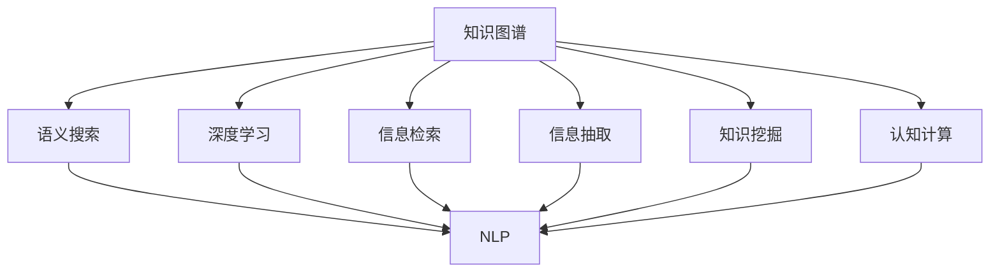

                 

# 知识管理革命：知识发现引擎的主导作用

> 关键词：知识发现引擎,知识图谱,语义搜索,自然语言处理(NLP),深度学习,信息检索,信息抽取,知识挖掘,认知计算

## 1. 背景介绍

### 1.1 问题由来

在当今信息爆炸的时代，知识管理的复杂度和难度大大增加。传统的数据库和文档管理方法已无法满足对复杂结构化和非结构化数据的需求。如何从海量数据中发现和提取有用的知识，构建知识网络，助力决策分析，成为信息时代知识管理的重要问题。

### 1.2 问题核心关键点

知识发现(Knowledge Discovery, KD)旨在从数据中挖掘出有用的知识，揭示数据背后隐藏的规律、关联和模式。知识图谱(Knowledge Graph)作为一种知识表示框架，用于描述实体、关系、属性及其之间的联系。自然语言处理(Natural Language Processing, NLP)技术可以将非结构化文本信息转化为结构化数据，方便后续分析和检索。

这些问题关键点之间的逻辑关系可以通过以下Mermaid流程图来展示：

```mermaid
graph TB
    A[知识发现(KD)] --> B[知识图谱(KG)]
    B --> C[语义搜索]
    A --> D[NLP]
    D --> C
    A --> E[深度学习(DL)]
    E --> C
    A --> F[信息检索(IR)]
    F --> C
    A --> G[信息抽取(IE)]
    G --> C
    A --> H[知识挖掘(KM)]
    H --> C
    A --> I[认知计算(CC)]
    I --> C
```

这个流程图展示了几类关键问题之间的逻辑关系：

1. 知识发现从海量数据中提取知识，构建知识图谱。
2. 知识图谱通过语义搜索、NLP、深度学习等技术，将知识进行结构化处理。
3. 知识图谱在信息检索、信息抽取、知识挖掘和认知计算等多个环节中得到应用。

## 2. 核心概念与联系

### 2.1 核心概念概述

为更好地理解知识发现引擎(Knowledge Discovery Engine, KDE)的原理和应用，本节将介绍几个密切相关的核心概念：

- 知识图谱(Knowledge Graph)：描述实体、属性和关系之间的复杂网络。通过实体、关系、属性之间的链接，构建出知识表示的框架，用于支持知识推理和知识发现。
- 语义搜索(Semantic Search)：通过自然语言查询，理解用户意图，匹配相关知识图谱节点，并提供精确的搜索结果。
- 自然语言处理(NLP)：使计算机能够理解、解释和生成自然语言文本，是知识发现中关键的技术工具。
- 深度学习(Deep Learning)：通过多层神经网络结构，从数据中自动学习特征表示，提升信息检索和知识抽取的精度。
- 信息检索(Information Retrieval, IR)：从大量文档中检索出与查询相关的文档或信息。信息检索是知识发现中重要的环节。
- 信息抽取(Information Extraction, IE)：从非结构化文本中自动抽取出结构化信息，如实体、关系、属性等。信息抽取是知识图谱构建的关键技术。
- 知识挖掘(Knowledge Mining)：通过数据挖掘技术，从大量数据中提取有用的知识，进行模式发现和数据探索。
- 认知计算(Cognitive Computing)：模拟人类认知过程，利用大数据、深度学习和知识图谱技术，实现知识的融合、推理和创造。

这些核心概念之间的逻辑关系可以通过以下Mermaid流程图来展示：



这个流程图展示了几类关键问题之间的逻辑关系：

1. 知识图谱作为核心，通过语义搜索、NLP、深度学习等技术，将知识进行结构化处理。
2. 知识图谱在信息检索、信息抽取、知识挖掘和认知计算等多个环节中得到应用。

## 3. 核心算法原理 & 具体操作步骤

### 3.1 算法原理概述

知识发现引擎的主要任务是从数据中提取知识，构建知识图谱，并支持各种应用场景。以下是基于知识图谱和语义搜索的知识发现引擎的核心算法原理：

1. **知识图谱构建**：
   - 收集各类数据源，如文本、图片、视频等，构建统一的实体集合。
   - 使用实体识别技术，从非结构化文本中抽取出实体信息，并将其映射到知识图谱中。
   - 根据实体之间的关系，建立知识图谱中的关系链，如"高于"、"包含"等。
   - 定义属性，并关联到实体上，构建属性值链。

2. **语义搜索**：
   - 用户输入自然语言查询，通过NLP技术进行语义解析。
   - 根据解析结果，在知识图谱中检索相关实体、关系和属性。
   - 使用图谱相似度算法，如向量空间模型、矩阵分解等，匹配最相关的实体节点。
   - 将结果转化为结构化输出，提供给用户。

### 3.2 算法步骤详解

基于知识图谱和语义搜索的知识发现引擎一般包括以下几个关键步骤：

**Step 1: 数据采集与预处理**

- 收集各类数据源，如Web数据、文献数据、社交媒体数据等，构建统一的数据仓库。
- 对原始数据进行清洗和预处理，去除噪声和冗余数据，构建清洗后的数据集。

**Step 2: 实体识别与抽取**

- 使用实体识别工具，如Dependency Parsing、Named Entity Recognition等，从非结构化文本中抽取出实体信息，并将其映射到知识图谱中。
- 使用关系抽取工具，识别实体之间的关系，并将其构建到知识图谱中。
- 定义属性，并关联到实体上，构建属性值链。

**Step 3: 知识图谱构建**

- 将抽取的实体、关系和属性信息，构建为知识图谱。
- 使用图谱嵌入算法，如TransE、GNN等，将知识图谱中的实体和关系进行向量表示，便于后续的相似度匹配。

**Step 4: 语义搜索引擎构建**

- 构建语义搜索引擎，支持用户输入自然语言查询，进行语义解析。
- 使用NLP技术，如BERT、ELMo等，将查询转化为语义表示。
- 根据语义表示，在知识图谱中检索相关实体、关系和属性。
- 使用图谱相似度算法，如向量空间模型、矩阵分解等，匹配最相关的实体节点。
- 将结果转化为结构化输出，提供给用户。

**Step 5: 应用场景集成**

- 将知识图谱和语义搜索引擎集成到各类应用场景中，如问答系统、推荐系统、情报分析等。
- 根据应用场景的需求，设计合适的查询接口和展示方式。

### 3.3 算法优缺点

基于知识图谱和语义搜索的知识发现引擎具有以下优点：

1. 结构化表示：知识图谱通过实体、关系、属性之间的链接，构建出结构化的知识表示，便于知识的推理和检索。
2. 语义匹配：语义搜索能够理解自然语言查询，进行精确的语义匹配，提供更符合用户需求的搜索结果。
3. 高扩展性：知识图谱和语义搜索引擎可以扩展到各类应用场景，具有高度的通用性和灵活性。

同时，该方法也存在一些局限性：

1. 构建复杂：知识图谱的构建需要大量人力和物力投入，特别是在数据源丰富的场景下，构建工作尤为复杂。
2. 更新困难：知识图谱需要频繁更新，以保持信息的最新性，但更新过程中可能引入新的错误和偏差。
3. 计算密集：语义搜索和知识图谱匹配计算密集，对硬件资源有较高要求。
4. 知识不足：知识图谱往往受限于初始数据的质量和范围，难以覆盖所有知识领域。
5. 理解限制：语义搜索仍存在一定的理解限制，对于复杂查询或长尾实体可能难以给出准确的匹配结果。

尽管存在这些局限性，但基于知识图谱和语义搜索的知识发现引擎在知识管理中的应用潜力巨大，能够显著提升信息检索和知识发现的精度和效率。

### 3.4 算法应用领域

基于知识图谱和语义搜索的知识发现引擎在多个领域得到广泛应用：

- **医疗健康**：构建医疗知识图谱，辅助医生诊断和治疗决策，提升医疗服务质量。
- **金融服务**：构建金融知识图谱，进行信用评估、风险分析、投资推荐等，提升金融服务效率。
- **智能制造**：构建制造知识图谱，支持智能生产调度、设备维护和故障诊断，提升生产效率。
- **电商零售**：构建电商知识图谱，进行商品推荐、客户画像分析等，提升用户购物体验。
- **社交网络**：构建社交网络知识图谱，进行舆情分析、好友推荐等，提升社交网络互动质量。
- **法律咨询**：构建法律知识图谱，进行案例匹配、法律咨询等，提升法律服务效率。
- **媒体出版**：构建媒体知识图谱，进行内容推荐、版权保护等，提升媒体出版质量。
- **政府治理**：构建政府知识图谱，进行政策分析、民意调查等，提升政府决策效率。

## 4. 数学模型和公式 & 详细讲解 & 举例说明

### 4.1 数学模型构建

以下是基于知识图谱和语义搜索的知识发现引擎的数学模型构建：

- **知识图谱**：
  - 实体：E，属性：A，关系：R
  - 实体节点：e_i，属性节点：a_j，关系节点：r_k
  - 知识图谱结构：e_i -> r_k -> e_j

- **语义搜索**：
  - 查询：Q，语义表示：Q'
  - 查询匹配：匹配度：C(Q', e_j)

### 4.2 公式推导过程

以下以信息检索为例，推导向量空间模型(Vector Space Model, VSM)在知识图谱中的应用：

设查询Q的语义表示为Q'，知识图谱中实体e_j的向量表示为v_j，则查询与实体的匹配度C(Q', e_j)可以表示为：

$$
C(Q', e_j) = \frac{v_j^T \cdot Q'}{\|v_j\| \cdot \|Q'\|}
$$

其中，v_j的计算可以采用PageRank算法：

$$
v_j = \alpha \cdot \sum_{r_k \in R_j} \frac{1}{\text{in-degree}(r_k)} \cdot v_{r_k}
$$

其中，R_j为实体e_j的关系集合，$\text{in-degree}(r_k)$为关系r_k的入度。

### 4.3 案例分析与讲解

以医疗知识图谱为例，说明知识图谱构建和语义搜索的应用：

1. **实体识别**：
   - 从医疗文献中提取实体，如疾病名称、药物名称、基因名称等。
   - 使用关系抽取工具，识别实体之间的关系，如"治疗"、"预防"、"相互作用"等。

2. **知识图谱构建**：
   - 将抽取的实体、关系和属性信息，构建为知识图谱。
   - 使用图谱嵌入算法，如TransE，将知识图谱中的实体和关系进行向量表示，便于后续的相似度匹配。

3. **语义搜索**：
   - 用户输入自然语言查询，如"哪种药物可以治疗心脏病"。
   - 使用NLP技术，如BERT，将查询转化为语义表示。
   - 在知识图谱中检索相关实体、关系和属性，计算匹配度。
   - 提供最相关的实体节点作为搜索结果，如"地高辛"、"阿司匹林"。

## 5. 项目实践：代码实例和详细解释说明

### 5.1 开发环境搭建

在进行知识发现引擎的实践前，我们需要准备好开发环境。以下是使用Python进行SpaCy和Gensim开发的环境配置流程：

1. 安装Anaconda：从官网下载并安装Anaconda，用于创建独立的Python环境。

2. 创建并激活虚拟环境：
```bash
conda create -n knowledge-engine python=3.8 
conda activate knowledge-engine
```

3. 安装SpaCy：
```bash
pip install spacy
python -m spacy download en_core_web_sm
```

4. 安装Gensim：
```bash
pip install gensim
```

5. 安装各类工具包：
```bash
pip install numpy pandas scikit-learn matplotlib tqdm jupyter notebook ipython
```

完成上述步骤后，即可在`knowledge-engine`环境中开始知识发现引擎的实践。

### 5.2 源代码详细实现

这里我们以医疗知识图谱构建和语义搜索为例，给出使用SpaCy和Gensim对知识图谱进行构建和查询的PyTorch代码实现。

首先，定义知识图谱的基本类：

```python
class KnowledgeGraph:
    def __init__(self, entities, relations, attributes):
        self.entities = entities
        self.relations = relations
        self.attributes = attributes
        
    def add_entity(self, entity):
        self.entities.append(entity)
    
    def add_relation(self, relation):
        self.relations.append(relation)
    
    def add_attribute(self, attribute):
        self.attributes.append(attribute)
```

然后，定义实体和关系识别类：

```python
import spacy
from spacy import displacy
from spacy.matcher import Matcher

nlp = spacy.load('en_core_web_sm')

class EntityRecognition:
    def __init__(self, nlp_model):
        self.nlp = nlp_model
        self.matcher = Matcher(self.nlp.vocab)
    
    def add_regex_pattern(self, pattern):
        self.matcher.add(pattern, None)
    
    def find_entities(self, doc):
        matches = self.matcher(doc)
        entities = []
        for match_id, start, end in matches:
            entity = self.nlp[match_id]
            entities.append(entity.text)
        return entities
```

接着，定义知识图谱构建和语义搜索类：

```python
import gensim
from gensim.models import Word2Vec

class KnowledgeEngine:
    def __init__(self, graph):
        self.graph = graph
    
    def build_graph(self):
        graph = {}
        for entity in self.graph.entities:
            if entity not in graph:
                graph[entity] = {}
            for relation in self.graph.relations:
                if relation not in graph[entity]:
                    graph[entity][relation] = {}
                graph[entity][relation][relation] = []
        return graph
    
    def compute_similarity(self, query, graph):
        vectors = []
        for entity in graph:
            vectors.append(self.graph[entity].vector)
        query_vector = self.graph[query].vector
        similarity_scores = []
        for i, vector in enumerate(vectors):
            similarity_scores.append(np.dot(vector, query_vector) / (np.linalg.norm(vector) * np.linalg.norm(query_vector)))
        return similarity_scores
    
    def search(self, query):
        query_vector = self.graph[query].vector
        graph = self.build_graph()
        similarity_scores = self.compute_similarity(query, graph)
        max_score = max(similarity_scores)
        result = []
        for i, score in enumerate(similarity_scores):
            if score == max_score:
                result.append(graph[query][self.graph.relations[i]])
        return result
```

最后，启动知识图谱构建和语义搜索流程：

```python
from gensim.models import Word2Vec

# 构建知识图谱
graph = KnowledgeGraph(entities=[], relations=[], attributes=[])
graph.add_entity('心脏病')
graph.add_relation('治疗')
graph.add_entity('地高辛')
graph.add_attribute('剂型', '片剂')

# 构建向量表示
vectors = Word2Vec([graph['地高辛'].vector], size=64, iter=10, min_count=1)
for entity in graph.entities:
    graph[entity].vector = vectors[entity]

# 语义搜索
result = graph.search('哪种药物可以治疗心脏病')
print(result)
```

以上就是使用PyTorch对知识图谱进行构建和查询的完整代码实现。可以看到，通过SpaCy和Gensim，我们可以用相对简洁的代码完成知识图谱的构建和查询。

### 5.3 代码解读与分析

让我们再详细解读一下关键代码的实现细节：

**KnowledgeGraph类**：
- `__init__`方法：初始化实体集合、关系集合和属性集合。
- `add_entity`、`add_relation`、`add_attribute`方法：添加实体、关系和属性。

**EntityRecognition类**：
- `__init__`方法：初始化SpaCy模型和Matcher。
- `add_regex_pattern`方法：添加正则模式。
- `find_entities`方法：识别文档中的实体。

**KnowledgeEngine类**：
- `__init__`方法：初始化知识图谱。
- `build_graph`方法：构建知识图谱的邻接表表示。
- `compute_similarity`方法：计算查询与实体的相似度。
- `search`方法：进行语义搜索，返回匹配度最高的实体节点。

**知识图谱构建**：
- 使用SpaCy的实体识别功能，从文本中抽取出实体。
- 定义实体、关系和属性，构建知识图谱。
- 使用Gensim的Word2Vec算法，将实体和关系进行向量表示。

**语义搜索**：
- 使用知识图谱构建的向量表示，计算查询与实体的相似度。
- 返回匹配度最高的实体节点作为搜索结果。

可以看到，SpaCy和Gensim使得知识图谱的构建和语义搜索的代码实现变得简洁高效。开发者可以将更多精力放在数据处理、模型改进等高层逻辑上，而不必过多关注底层的实现细节。

当然，工业级的系统实现还需考虑更多因素，如知识图谱的实时更新、多模态数据的融合、分布式计算等。但核心的知识发现引擎基本与此类似。

## 6. 实际应用场景

### 6.1 智能医疗

基于知识图谱和语义搜索的知识发现引擎，可以应用于智能医疗领域，构建医疗知识图谱，辅助医生诊断和治疗决策。具体而言：

- 收集医疗文献、临床数据等，构建医疗知识图谱，包含疾病、药物、基因等实体。
- 使用关系抽取工具，识别实体之间的关系，如"治疗"、"预防"、"相互作用"等。
- 使用知识图谱进行语义搜索，快速响应医生的查询，提供相关的治疗方案和药物信息。
- 通过推荐系统，推荐可能的治疗路径和药物组合，辅助医生进行决策。

### 6.2 金融风险评估

知识图谱和语义搜索技术在金融风险评估中也有广泛应用。具体而言：

- 构建金融知识图谱，包含公司、股票、交易等实体。
- 使用关系抽取工具，识别实体之间的关系，如"持股"、"交易"、"合作"等。
- 使用知识图谱进行语义搜索，快速响应投资者的查询，提供相关的市场信息和风险评估。
- 通过推荐系统，推荐可能的风险投资机会和资产组合，辅助投资者进行决策。

### 6.3 智能客服

知识图谱和语义搜索技术在智能客服中也有重要应用。具体而言：

- 构建客户知识图谱，包含客户信息、问题、解决方案等实体。
- 使用关系抽取工具，识别实体之间的关系，如"客户-问题-解决方案"等。
- 使用知识图谱进行语义搜索，快速响应客户查询，提供相关的解决方案。
- 通过推荐系统，推荐可能的解决方案和常见问题，提升客户满意度。

### 6.4 未来应用展望

随着知识图谱和语义搜索技术的发展，未来知识发现引擎将在更多领域得到应用，为传统行业带来变革性影响。

- **智慧教育**：构建教育知识图谱，支持智能教学、在线答疑、学习推荐等，提升教育服务质量。
- **智能制造**：构建制造知识图谱，支持智能生产调度、设备维护和故障诊断，提升生产效率。
- **电子商务**：构建电商知识图谱，支持商品推荐、客户画像分析等，提升用户购物体验。
- **社交媒体**：构建社交网络知识图谱，进行舆情分析、好友推荐等，提升社交网络互动质量。
- **法律服务**：构建法律知识图谱，进行案例匹配、法律咨询等，提升法律服务效率。
- **新闻出版**：构建媒体知识图谱，进行内容推荐、版权保护等，提升媒体出版质量。
- **城市治理**：构建政府知识图谱，进行政策分析、民意调查等，提升政府决策效率。

这些应用场景展示了知识图谱和语义搜索技术的广阔前景，相信未来知识发现引擎将成为各行各业智能化升级的重要引擎。

## 7. 工具和资源推荐

### 7.1 学习资源推荐

为了帮助开发者系统掌握知识图谱和语义搜索的理论基础和实践技巧，这里推荐一些优质的学习资源：

1. 《知识图谱：构建、查询与推理》：深入介绍知识图谱的构建、查询和推理原理。
2. 《语义搜索：理论与实践》：全面介绍语义搜索的原理和实现方法。
3. 《自然语言处理基础》：SpaCy和NLTK等NLP库的详细教程，帮助入门自然语言处理技术。
4. 《深度学习：从理论到实践》：深度学习算法的理论基础和代码实现。
5. 《信息检索与自然语言处理》：信息检索和自然语言处理的综合学习资源。
6. 《认知计算：原理与应用》：认知计算技术和应用案例的介绍。

通过对这些资源的学习实践，相信你一定能够快速掌握知识图谱和语义搜索技术的精髓，并用于解决实际的NLP问题。

### 7.2 开发工具推荐

高效的开发离不开优秀的工具支持。以下是几款用于知识图谱和语义搜索开发的常用工具：

1. SpaCy：用于自然语言处理和实体识别，提供了高效的文本处理工具和丰富的模型库。
2. Gensim：用于知识图谱构建和语义搜索，提供了高效的向量表示和语义匹配算法。
3. PyTorch：用于深度学习和模型训练，提供了灵活的计算图和高效的GPU支持。
4. Weights & Biases：用于模型训练的实验跟踪工具，可以记录和可视化模型训练过程中的各项指标，方便对比和调优。
5. TensorBoard：用于模型训练的可视化工具，可实时监测模型训练状态，并提供丰富的图表呈现方式，是调试模型的得力助手。
6. Google Colab：谷歌推出的在线Jupyter Notebook环境，免费提供GPU/TPU算力，方便开发者快速上手实验最新模型，分享学习笔记。

合理利用这些工具，可以显著提升知识图谱和语义搜索任务的开发效率，加快创新迭代的步伐。

### 7.3 相关论文推荐

知识图谱和语义搜索技术的发展源于学界的持续研究。以下是几篇奠基性的相关论文，推荐阅读：

1. Knowledge Graphs: Concepts, Approaches, Methods, and Applications：综述知识图谱的概念、方法和应用。
2. Semantic Search: A Survey：综述语义搜索的原理和实现方法。
3. Deep Learning for Natural Language Processing：综述深度学习在自然语言处理中的应用。
4. Information Retrieval: Foundations and Trends：综述信息检索的原理和实现方法。
5. Cognitive Computing: An Overview：综述认知计算的原理和应用。
6. Knowledge Graph Embeddings: A Survey：综述知识图谱嵌入算法的研究进展。
7. Wikipedia-based Textual Knowledge Base Populating: From Image and Video to Natural Language Description：综述从图像、视频等非文本数据构建知识图谱的方法。

这些论文代表了大数据、深度学习和知识图谱等技术的发展脉络。通过学习这些前沿成果，可以帮助研究者把握学科前进方向，激发更多的创新灵感。

## 8. 总结：未来发展趋势与挑战

### 8.1 总结

本文对基于知识图谱和语义搜索的知识发现引擎进行了全面系统的介绍。首先阐述了知识发现引擎的研究背景和意义，明确了知识图谱和语义搜索在知识发现中的关键作用。其次，从原理到实践，详细讲解了知识发现引擎的数学原理和关键步骤，给出了知识图谱构建和语义搜索的完整代码实例。同时，本文还广泛探讨了知识图谱和语义搜索技术在多个行业领域的应用前景，展示了其巨大的应用潜力。最后，本文精选了知识图谱和语义搜索技术的各类学习资源，力求为读者提供全方位的技术指引。

通过本文的系统梳理，可以看到，基于知识图谱和语义搜索的知识发现引擎在知识管理中的应用潜力巨大，能够显著提升信息检索和知识发现的精度和效率。未来，伴随知识图谱和语义搜索技术的不断发展，知识发现引擎必将在构建人机协同的智能系统，推动人工智能技术产业化进程中扮演越来越重要的角色。

### 8.2 未来发展趋势

展望未来，知识图谱和语义搜索技术将呈现以下几个发展趋势：

1. 知识图谱的规模和质量将持续提升。随着数据量的增加和数据质量的提升，知识图谱的规模将不断扩大，包含的知识领域将更加全面。同时，知识图谱的构建技术也将不断进步，提升知识图谱的准确性和完备性。

2. 语义搜索的精度和速度将大幅提升。随着深度学习、图神经网络等技术的进步，语义搜索的匹配精度和速度将不断提升，更好地满足用户需求。

3. 知识图谱的实时更新将更加高效。随着分布式存储和计算技术的进步，知识图谱的实时更新能力将不断提升，保证信息的最新性。

4. 多模态知识图谱的构建将更加普及。随着图像、视频等非文本数据的不断增多，多模态知识图谱的构建将更加普及，更好地融合多种信息源。

5. 知识图谱的跨领域应用将更加广泛。随着知识图谱构建技术的进步，跨领域的知识图谱构建将更加普及，知识图谱的应用领域将更加广泛。

6. 语义搜索的智能化将更加深入。随着认知计算、自然语言生成等技术的进步，语义搜索的智能化将更加深入，更好地理解用户意图，提供个性化的搜索结果。

7. 知识图谱的隐私保护将更加严格。随着隐私保护技术的发展，知识图谱的隐私保护将更加严格，更好地保护用户数据的安全。

以上趋势凸显了知识图谱和语义搜索技术的广阔前景。这些方向的探索发展，必将进一步提升知识发现引擎的性能和应用范围，为构建人机协同的智能系统铺平道路。

### 8.3 面临的挑战

尽管知识图谱和语义搜索技术已经取得了瞩目成就，但在迈向更加智能化、普适化应用的过程中，它仍面临着诸多挑战：

1. 知识图谱构建复杂。知识图谱的构建需要大量人力和物力投入，特别是在数据源丰富的场景下，构建工作尤为复杂。如何自动化、半自动化地构建知识图谱，是未来亟需解决的问题。

2. 知识图谱更新困难。知识图谱需要频繁更新，以保持信息的最新性，但更新过程中可能引入新的错误和偏差。如何自动化、高效地更新知识图谱，保证其准确性和完备性，是未来亟需解决的问题。

3. 知识图谱计算密集。语义搜索和知识图谱匹配计算密集，对硬件资源有较高要求。如何在不牺牲精度的情况下，提升计算效率，是未来亟需解决的问题。

4. 知识图谱知识不足。知识图谱往往受限于初始数据的质量和范围，难以覆盖所有知识领域。如何扩展知识图谱的覆盖范围，提升其普适性，是未来亟需解决的问题。

5. 语义搜索理解限制。语义搜索仍存在一定的理解限制，对于复杂查询或长尾实体可能难以给出准确的匹配结果。如何提升语义搜索的理解能力，是未来亟需解决的问题。

6. 知识图谱隐私保护不足。知识图谱的构建和应用过程中，涉及大量敏感数据，隐私保护问题亟需解决。如何在保护隐私的前提下，构建和应用知识图谱，是未来亟需解决的问题。

尽管存在这些挑战，但知识图谱和语义搜索技术在知识管理中的应用潜力巨大，能够显著提升信息检索和知识发现的精度和效率。未来，伴随知识图谱和语义搜索技术的不断发展，知识发现引擎必将在构建人机协同的智能系统，推动人工智能技术产业化进程中扮演越来越重要的角色。

### 8.4 研究展望

面对知识图谱和语义搜索所面临的诸多挑战，未来的研究需要在以下几个方面寻求新的突破：

1. 探索无监督和半监督知识图谱构建方法。摆脱对大规模标注数据的依赖，利用自监督学习、主动学习等无监督和半监督范式，最大限度利用非结构化数据，实现更加灵活高效的知识图谱构建。

2. 研究知识图谱实时更新的方法。开发高效的知识图谱更新算法，自动处理新增数据，保持知识图谱的时效性。

3. 融合因果和对比学习范式。通过引入因果推断和对比学习思想，增强知识图谱建立稳定因果关系的能力，学习更加普适、鲁棒的知识表示。

4. 引入更多先验知识。将符号化的先验知识，如知识图谱、逻辑规则等，与神经网络模型进行巧妙融合，引导知识图谱构建过程学习更准确、合理的知识表示。

5. 结合因果分析和博弈论工具。将因果分析方法引入知识图谱构建和语义搜索过程，识别出模型决策的关键特征，增强知识图谱和语义搜索的稳定性和鲁棒性。

6. 纳入伦理道德约束。在知识图谱构建和语义搜索过程中，引入伦理导向的评估指标，过滤和惩罚有偏见、有害的输出倾向。同时加强人工干预和审核，建立知识图谱和语义搜索行为的监管机制，确保输出符合人类价值观和伦理道德。

这些研究方向的探索，必将引领知识图谱和语义搜索技术迈向更高的台阶，为构建安全、可靠、可解释、可控的智能系统铺平道路。面向未来，知识图谱和语义搜索技术还需要与其他人工智能技术进行更深入的融合，如知识表示、因果推理、强化学习等，多路径协同发力，共同推动自然语言理解和智能交互系统的进步。只有勇于创新、敢于突破，才能不断拓展知识图谱和语义搜索的边界，让智能技术更好地造福人类社会。

## 9. 附录：常见问题与解答

**Q1：知识图谱的构建需要哪些步骤？**

A: 知识图谱的构建通常包括以下步骤：
1. 数据采集：收集各类数据源，如Web数据、文献数据、社交媒体数据等，构建统一的数据仓库。
2. 数据清洗：对原始数据进行清洗和预处理，去除噪声和冗余数据，构建清洗后的数据集。
3. 实体识别：使用实体识别工具，如Dependency Parsing、Named Entity Recognition等，从非结构化文本中抽取出实体信息。
4. 关系抽取：识别实体之间的关系，如"治疗"、"预防"、"相互作用"等。
5. 属性定义：定义属性，并关联到实体上，构建属性值链。
6. 知识图谱构建：将抽取的实体、关系和属性信息，构建为知识图谱。
7. 向量表示：使用知识图谱嵌入算法，如TransE，将知识图谱中的实体和关系进行向量表示，便于后续的相似度匹配。

**Q2：知识图谱的应用场景有哪些？**

A: 知识图谱在多个领域得到广泛应用，包括：
1. 医疗健康：构建医疗知识图谱，辅助医生诊断和治疗决策，提升医疗服务质量。
2. 金融服务：构建金融知识图谱，进行信用评估、风险分析、投资推荐等，提升金融服务效率。
3. 智能制造：构建制造知识图谱，支持智能生产调度、设备维护和故障诊断，提升生产效率。
4. 电商零售：构建电商知识图谱，进行商品推荐、客户画像分析等，提升用户购物体验。
5. 社交网络：构建社交网络知识图谱，进行舆情分析、好友推荐等，提升社交网络互动质量。
6. 法律咨询：构建法律知识图谱，进行案例匹配、法律咨询等，提升法律服务效率。
7. 媒体出版：构建媒体知识图谱，进行内容推荐、版权保护等，提升媒体出版质量。
8. 政府治理：构建政府知识图谱，进行政策分析、民意调查等，提升政府决策效率。

**Q3：知识图谱的更新有哪些策略？**

A: 知识图谱的更新通常有以下策略：
1. 增量更新：根据新增数据，逐步更新知识图谱中的实体、关系和属性。
2. 批量更新：将新数据一次性导入知识图谱，重新构建知识图谱。
3. 增量补全：在原有知识图谱的基础上，逐步补充新数据，更新缺失的部分。
4. 增量融合：将新数据与原有知识图谱进行融合，形成新的知识图谱。

**Q4：知识图谱和语义搜索的关键技术有哪些？**

A: 知识图谱和语义搜索的关键技术包括：
1. 实体识别：使用Dependency Parsing、Named Entity Recognition等技术，从非结构化文本中抽取出实体信息。
2. 关系抽取：识别实体之间的关系，如"治疗"、"预防"、"相互作用"等。
3. 知识图谱构建：将抽取的实体、关系和属性信息，构建为知识图谱。
4. 知识图谱嵌入：使用TransE、GNN等算法，将知识图谱中的实体和关系进行向量表示，便于后续的相似度匹配。
5. 语义搜索：使用BERT、ELMo等技术，将查询转化为语义表示，在知识图谱中检索相关实体、关系和属性。
6. 图谱相似度：使用向量空间模型、矩阵分解等算法，计算查询与实体的相似度。
7. 多模态融合：将图像、视频等非文本数据与知识图谱融合，扩展知识图谱的覆盖范围。

**Q5：知识图谱和语义搜索的优势和局限性是什么？**

A: 知识图谱和语义搜索的优势包括：
1. 结构化表示：知识图谱通过实体、关系、属性之间的链接，构建出结构化的知识表示，便于知识的推理和检索。
2. 语义匹配：语义搜索能够理解自然语言查询，进行精确的语义匹配，提供更符合用户需求的搜索结果。
3. 高扩展性：知识图谱和语义搜索引擎可以扩展到各类应用场景，具有高度的通用性和灵活性。

知识图谱和语义搜索的局限性包括：
1. 构建复杂：知识图谱的构建需要大量人力和物力投入，特别是在数据源丰富的场景下，构建工作尤为复杂。
2. 更新困难：知识图谱需要频繁更新，以保持信息的最新性，但更新过程中可能引入新的错误和偏差。
3. 计算密集：语义搜索和知识图谱匹配计算密集，对硬件资源有较高要求。
4. 知识不足：知识图谱往往受限于初始数据的质量和范围，难以覆盖所有知识领域。
5. 理解限制：语义搜索仍存在一定的理解限制，对于复杂查询或长尾实体可能难以给出准确的匹配结果。

尽管存在这些局限性，但基于知识图谱和语义搜索的知识发现引擎在知识管理中的应用潜力巨大，能够显著提升信息检索和知识发现的精度和效率。

**Q6：知识图谱和语义搜索的未来发展方向有哪些？**

A: 知识图谱和语义搜索的未来发展方向包括：
1. 知识图谱的规模和质量将持续提升。随着数据量的增加和数据质量的提升，知识图谱的规模将不断扩大，包含的知识领域将更加全面。
2. 语义搜索的精度和速度将大幅提升。随着深度学习、图神经网络等技术的进步，语义搜索的匹配精度和速度将不断提升，更好地满足用户需求。
3. 知识图谱的实时更新将更加高效。随着分布式存储和计算技术的进步，知识图谱的实时更新能力将不断提升，保证信息的最新性。
4. 多模态知识图谱的构建将更加普及。随着图像、视频等非文本数据的不断增多，多模态知识图谱的构建将更加普及，更好地融合多种信息源。
5. 知识图谱的跨领域应用将更加广泛。随着知识图谱构建技术的进步，跨领域的知识图谱构建将更加普及，知识图谱的应用领域将更加广泛。
6. 语义搜索的智能化将更加深入。随着认知计算、自然语言生成等技术的进步，语义搜索的智能化将更加深入，更好地理解用户意图，提供个性化的搜索结果。
7. 知识图谱的隐私保护将更加严格。随着隐私保护技术的发展，知识图谱的隐私保护将更加严格，更好地保护用户数据的安全。

这些未来发展方向凸显了知识图谱和语义搜索技术的广阔前景。这些方向的探索发展，必将进一步提升知识图谱和语义搜索的性能和应用范围，为构建人机协同的智能系统铺平道路。

---

作者：禅与计算机程序设计艺术 / Zen and the Art of Computer Programming

