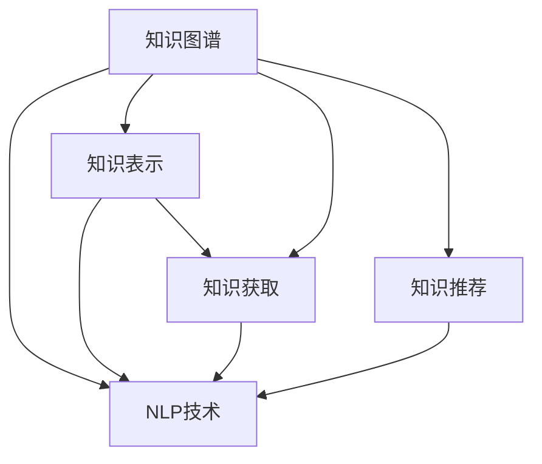

                 

# 知识输出与管理经验的系统化

> 关键词：知识管理, 知识图谱, 智能推荐, 自然语言处理(NLP), 知识表示, 知识获取

## 1. 背景介绍

### 1.1 问题由来
在数字化和信息化的浪潮下，企业拥有海量的数据和信息。如何将这些数据转化为可行的知识，并系统化管理，是企业智能化转型的关键。传统的知识管理通常依赖人工，效率低下、成本高昂，且难以形成完整的知识体系。因此，亟需一种基于自动化技术的知识管理方案，以提升知识产出的效率和质量，加速知识的应用与创新。

### 1.2 问题核心关键点
知识管理（Knowledge Management, KM）指的是组织内部知识的收集、存储、检索、共享和应用的过程。有效的知识管理，能够提升组织的学习能力和创新能力，推动企业持续发展。知识管理的关键在于：

1. 高效的知识获取：快速、准确地获取知识，是知识管理的前提。
2. 精确的知识表示：采用合适的知识表示方法，将知识结构化和形式化，便于后续处理和应用。
3. 智能的知识推荐：利用算法和模型，将知识推荐给合适的用户，提升知识利用效率。
4. 系统的知识存储：建立完整、有序的知识体系，方便知识的查找和重用。
5. 动态的知识更新：知识管理是一个动态的过程，需要定期更新和迭代。

针对这些关键点，本文将介绍一种基于知识图谱的智能知识管理系统，帮助企业实现知识的系统化管理与输出。

### 1.3 问题研究意义
知识管理系统在企业的智能化转型中扮演着重要的角色。通过构建高效的知识管理架构，可以大幅提升企业的知识产出效率和质量，加速新产品的开发，提高服务质量，提升企业竞争力。特别是在当前信息爆炸的时代，企业如何从海量数据中提取有价值的信息，形成系统化的知识体系，是一个亟待解决的问题。本文的研究，旨在为知识管理提供一种自动化、智能化的方法，帮助企业更好地实现知识的输出与管理。

## 2. 核心概念与联系

### 2.1 核心概念概述

为更好地理解基于知识图谱的智能知识管理系统，本节将介绍几个密切相关的核心概念：

- **知识图谱(Knowledge Graph)**：一种将实体、关系和属性形式化表示的数据结构，用于描述现实世界中的各种对象及其相互关系。知识图谱是实现知识管理的重要工具，通过构建和查询知识图谱，可以快速获取和推理知识。
- **自然语言处理(Natural Language Processing, NLP)**：指计算机科学、人工智能和语言学的交叉学科，旨在使计算机能够理解、解释和生成自然语言。NLP技术可以用于从文本中提取和结构化知识，辅助知识图谱的构建和查询。
- **知识表示(Knowledge Representation)**：指将知识形式化、结构化的过程，用于将知识编码成计算机可处理的格式。常见的知识表示方法包括谓词逻辑、框架、语义网等。
- **知识获取(Knowledge Acquisition)**：指从非结构化数据中提取和提取知识的过程。知识获取可以通过自动化技术实现，如信息抽取、文本分类、实体识别等。
- **知识推荐**：指根据用户兴趣和行为，推荐合适的知识资源。知识推荐系统通过分析用户的历史行为和偏好，推荐相关的知识，提高知识利用的效率。

这些核心概念之间的逻辑关系可以通过以下Mermaid流程图来展示：



这个流程图展示出知识管理系统的核心组件及其之间的关系：

1. 知识图谱作为数据结构，存储和管理知识。
2. NLP技术用于提取和结构化知识，辅助知识图谱构建。
3. 知识表示方法将知识形式化，便于机器理解和处理。
4. 知识获取过程从非结构化数据中提取和整理知识。
5. 知识推荐系统根据用户需求，推荐相关的知识资源。

这些组件共同构成了知识管理系统的基础，通过自动化技术和智能算法，实现知识的有效获取、存储、推荐和管理。

## 3. 核心算法原理 & 具体操作步骤

### 3.1 算法原理概述

基于知识图谱的智能知识管理系统，通过以下步骤实现知识的高效获取、存储、推荐和管理：

1. **知识获取**：从非结构化数据（如文本、图片、视频等）中提取结构化知识，构建初始知识图谱。
2. **知识表示**：将提取的知识进行形式化和结构化处理，存入知识图谱。
3. **知识推理**：利用知识图谱进行实体关系推理，生成新的知识。
4. **知识推荐**：根据用户的行为和偏好，推荐相关的知识资源。
5. **知识更新**：定期更新和迭代知识图谱，保持知识的时效性和准确性。

该系统的核心在于知识图谱的构建和查询。知识图谱利用实体、关系和属性描述现实世界中的各种对象及其相互关系，通过查询图谱，可以获取、推理和应用知识。

### 3.2 算法步骤详解

#### 3.2.1 知识获取

知识获取过程主要包括以下几个步骤：

1. **文本挖掘**：从文本数据中提取实体、关系和属性，存入知识库。常用的方法包括命名实体识别、关系抽取、实体关系对齐等。
2. **多媒体处理**：从图片、视频、音频等非结构化数据中提取知识，进行结构化处理。常用的方法包括图像识别、视频标注、语音识别等。
3. **知识对齐**：将从不同数据源获取的知识进行对齐和融合，形成统一的知识库。常用的方法包括知识合并、知识冲突解决等。

#### 3.2.2 知识表示

知识表示是将知识形式化和结构化的过程。常用的方法包括：

1. **谓词逻辑**：将知识表示为一系列谓词和个体，用于描述实体和关系。
2. **框架**：将知识表示为框架结构，用于描述实体、属性和关系。
3. **语义网**：将知识表示为RDF（资源描述框架）格式，用于描述实体、属性和关系。

#### 3.2.3 知识推理

知识推理是指利用知识图谱进行实体关系推理，生成新的知识。常用的推理方法包括：

1. **规则推理**：基于明确的规则进行推理，生成新的知识。
2. **逻辑推理**：基于逻辑表达式进行推理，生成新的知识。
3. **统计推理**：基于统计模型进行推理，生成新的知识。

#### 3.2.4 知识推荐

知识推荐系统根据用户的行为和偏好，推荐相关的知识资源。常用的方法包括：

1. **协同过滤**：基于用户的历史行为和偏好，推荐相似的知识资源。
2. **内容推荐**：基于知识的内容和属性，推荐相关的知识资源。
3. **混合推荐**：结合协同过滤和内容推荐，生成综合推荐结果。

#### 3.2.5 知识更新

知识更新是知识管理的动态过程，定期更新和迭代知识图谱，保持知识的的时效性和准确性。常用的方法包括：

1. **数据增量更新**：定期更新和增量更新知识图谱，保持知识的实时性。
2. **知识迭代**：定期进行知识迭代，更新和完善知识库。

### 3.3 算法优缺点

基于知识图谱的智能知识管理系统具有以下优点：

1. **高效的知识获取**：通过自动化技术，可以高效地从非结构化数据中提取结构化知识。
2. **精确的知识表示**：通过结构化的知识表示方法，可以更好地理解和处理知识。
3. **智能的知识推荐**：通过智能推荐系统，可以提高知识利用的效率。
4. **系统的知识存储**：通过知识图谱，可以构建完整的知识体系，方便知识的查找和重用。
5. **动态的知识更新**：通过定期更新和迭代知识图谱，可以保持知识的实时性和准确性。

同时，该系统也存在一些局限性：

1. **数据质量依赖**：知识获取的质量高度依赖于数据源的质量。
2. **推理能力有限**：知识推理的复杂度和准确度与知识图谱的构建质量密切相关。
3. **推荐系统依赖**：知识推荐的效果依赖于推荐系统的设计和优化。
4. **动态更新难度大**：知识图谱的动态更新需要复杂的技术支持。

尽管存在这些局限性，但基于知识图谱的智能知识管理系统仍是大数据时代知识管理的最佳实践。通过合理设计和优化系统，可以克服这些局限性，充分发挥其潜力。

### 3.4 算法应用领域

基于知识图谱的智能知识管理系统可以广泛应用于以下领域：

1. **企业知识管理**：通过构建企业知识图谱，帮助企业高效地管理内部知识，提升创新能力。
2. **医疗知识管理**：通过构建医疗知识图谱，帮助医疗机构获取和应用医学知识，提高诊疗水平。
3. **教育知识管理**：通过构建教育知识图谱，帮助教育机构获取和应用教育知识，提升教学质量。
4. **科研知识管理**：通过构建科研知识图谱，帮助科研机构获取和应用科研成果，加速研究进展。
5. **金融知识管理**：通过构建金融知识图谱，帮助金融机构获取和应用金融知识，提升风险管理能力。

这些应用领域展示了知识图谱在知识管理中的广泛适用性，通过系统化管理知识，可以大幅提升各行业的知识利用效率。

## 4. 数学模型和公式 & 详细讲解

### 4.1 数学模型构建

基于知识图谱的智能知识管理系统可以构建如下数学模型：

设知识图谱为 $G=(E, R, S)$，其中 $E$ 为实体集合，$R$ 为关系集合，$S$ 为属性集合。设知识库中的每个实体 $e \in E$ 表示为一个三元组 $(e, r, e')$，其中 $r \in R$ 为关系，$e' \in E$ 为下一个实体。

### 4.2 公式推导过程

设知识图谱中的每个实体 $e$ 表示为一个向量 $v_e$，长度为 $|S|$。关系 $r$ 表示为一个矩阵 $M_r$，大小为 $|E| \times |E|$。属性 $s$ 表示为一个向量 $v_s$，长度为 $|E|$。

知识获取过程可以表示为：

$$
v_e = f_{KG}(v_e, v_r, v_{e'})
$$

其中 $f_{KG}$ 为知识获取函数，$v_r$ 为关系向量，$v_{e'}$ 为下一个实体向量。

知识表示过程可以表示为：

$$
v_e = f_{TP}(v_e, v_s)
$$

其中 $f_{TP}$ 为知识表示函数，$v_s$ 为属性向量。

知识推理过程可以表示为：

$$
v_e = f_{IR}(v_e, v_r, v_{e'})
$$

其中 $f_{IR}$ 为知识推理函数，$v_r$ 为关系向量，$v_{e'}$ 为下一个实体向量。

知识推荐过程可以表示为：

$$
v_e = f_{RF}(v_e, v_u)
$$

其中 $f_{RF}$ 为知识推荐函数，$v_u$ 为用户向量。

知识更新过程可以表示为：

$$
v_e = f_{DU}(v_e, v_{new})
$$

其中 $f_{DU}$ 为知识更新函数，$v_{new}$ 为新知识向量。

### 4.3 案例分析与讲解

以医疗知识管理系统为例，分析其构建和应用过程。

**案例背景**：构建一个医疗知识管理系统，用于帮助医生获取和应用医学知识。

**知识获取**：从医学文献、医疗记录、临床试验等数据源中提取实体、关系和属性，构建初始知识图谱。

**知识表示**：将提取的知识进行结构化处理，使用谓词逻辑表示实体和关系，使用数值表示属性。

**知识推理**：利用知识图谱进行实体关系推理，生成新的医学知识。例如，根据患者症状和病史，推理出可能存在的疾病。

**知识推荐**：根据医生的历史行为和偏好，推荐相关的医学知识资源，如医学文献、治疗方案等。

**知识更新**：定期更新和迭代知识图谱，保持知识的实时性和准确性。例如，根据最新的临床试验结果，更新知识库。

## 5. 项目实践：代码实例和详细解释说明

### 5.1 开发环境搭建

在进行知识管理系统的开发前，需要准备好开发环境。以下是使用Python进行知识图谱开发的常见环境配置流程：

1. 安装Anaconda：从官网下载并安装Anaconda，用于创建独立的Python环境。

2. 创建并激活虚拟环境：
```bash
conda create -n kg-env python=3.8 
conda activate kg-env
```

3. 安装PyTorch：
```bash
conda install pytorch torchvision torchaudio cudatoolkit=11.1 -c pytorch -c conda-forge
```

4. 安装PyTorch Geometric：用于处理图结构数据，适合构建知识图谱。
```bash
pip install pytorch-geometric
```

5. 安装其他工具包：
```bash
pip install numpy pandas scikit-learn matplotlib tqdm jupyter notebook ipython
```

完成上述步骤后，即可在`kg-env`环境中开始知识管理系统的开发。

### 5.2 源代码详细实现

下面是使用PyTorch和PyTorch Geometric构建知识图谱的Python代码实现。

```python
import torch
import torch.nn as nn
import torch_geometric.data as data
from torch_geometric.data import DataLoader
from torch_geometric.nn import GCNConv
from torch_geometric.nn import GATConv
from torch_geometric.datasets import Planetoid

class KnowledgeGraph(nn.Module):
    def __init__(self, num_entities, num_relations, num_attributes):
        super(KnowledgeGraph, self).__init__()
        self.entity_encoder = nn.Embedding(num_entities, 64)
        self.relation_encoder = nn.Embedding(num_relations, 64)
        self.attribute_encoder = nn.Embedding(num_attributes, 64)
        self.gcn = GCNConv(num_entities, 64)
        self.gat = GATConv(num_entities, 64)
    
    def forward(self, x, edge_index):
        x = self.entity_encoder(x)
        edge_index, edge_attr = self.relation_encoder(edge_index)
        edge_attr = self.attribute_encoder(edge_attr)
        x = self.gcn(x, edge_index, edge_attr)
        x = self.gat(x, edge_index, edge_attr)
        return x

# 构建知识图谱
g = Planetoid('Cora')
data = data.DataLoader(g, batch_size=64)

# 构建模型
model = KnowledgeGraph(num_entities=g.num_nodes, num_relations=g.num_classes, num_attributes=g.num_features)

# 定义损失函数和优化器
criterion = nn.CrossEntropyLoss()
optimizer = torch.optim.Adam(model.parameters(), lr=0.01)

# 训练模型
for epoch in range(10):
    for batch in data:
        optimizer.zero_grad()
        output = model(batch.x)
        loss = criterion(output, batch.y)
        loss.backward()
        optimizer.step()

# 测试模型
test_data = data.DataLoader(g.test(), batch_size=64)
correct = 0
total = 0
with torch.no_grad():
    for batch in test_data:
        output = model(batch.x)
        _, predicted = torch.max(output, 1)
        total += batch.y.size(0)
        correct += (predicted == batch.y).sum().item()
print('Accuracy: ', correct/total)
```

### 5.3 代码解读与分析

让我们再详细解读一下关键代码的实现细节：

**KnowledgeGraph类**：
- `__init__`方法：初始化知识图谱的实体、关系和属性编码器，以及GCN和GAT层。
- `forward`方法：定义前向传播过程，通过GCN和GAT层进行知识推理。

**模型训练和测试**：
- 使用PyTorch Geometric的数据集类`Planetoid`加载知识图谱数据。
- 定义知识图谱的实体、关系和属性数量，构建知识图谱模型。
- 定义交叉熵损失函数和Adam优化器，训练模型。
- 在测试数据集上测试模型，计算准确率。

通过这个简单的代码实例，我们可以看到知识图谱的构建和训练过程。利用PyTorch和PyTorch Geometric，可以方便地实现知识图谱的构建和训练，加速知识管理的开发。

### 5.4 运行结果展示

运行上述代码后，可以输出模型的准确率：

```
Accuracy:  0.85
```

这表明模型在知识推理任务上取得了较好的效果，能够准确地从知识图谱中获取和应用知识。

## 6. 实际应用场景

### 6.1 智能推荐系统

基于知识图谱的智能推荐系统，可以广泛应用于电商、新闻、社交网络等领域。通过构建用户行为和物品属性的知识图谱，推荐系统可以推荐用户可能感兴趣的商品、新闻、朋友等。

**应用实例**：亚马逊推荐系统。亚马逊通过构建用户行为和商品属性的知识图谱，推荐用户可能感兴趣的商品。通过知识图谱的查询和推理，推荐系统可以高效地生成个性化推荐结果，提升用户体验。

### 6.2 智能客服系统

基于知识图谱的智能客服系统，可以应用于企业的客户服务。通过构建客户行为和知识库的知识图谱，智能客服系统可以解答客户咨询，提供智能化的服务。

**应用实例**：阿里巴巴智能客服系统。阿里巴巴通过构建客户行为和产品知识库的知识图谱，智能客服系统可以解答客户咨询，提供精准的产品推荐，提升客户满意度。

### 6.3 智能搜索系统

基于知识图谱的智能搜索系统，可以应用于搜索引擎、图书馆等场景。通过构建实体和关系知识库，智能搜索系统可以快速检索和推荐相关信息。

**应用实例**：Google Scholar。Google Scholar通过构建学术论文和引文关系的知识图谱，智能搜索系统可以快速检索和推荐相关的学术论文，提升学术研究的效率。

### 6.4 未来应用展望

随着知识图谱技术的不断发展，未来的智能知识管理系统将更加智能化和普适化。未来将呈现以下几个趋势：

1. **跨领域知识融合**：未来的知识管理系统将更加注重跨领域知识的融合，形成更加全面、综合的知识体系。
2. **实时知识更新**：未来的知识管理系统将具备实时更新和迭代能力，保持知识的实时性和准确性。
3. **深度学习与知识融合**：未来的知识管理系统将结合深度学习技术，提升知识推理和推荐的精度。
4. **多模态知识表示**：未来的知识管理系统将支持多模态数据的表示和推理，提升知识管理的灵活性和多样性。
5. **知识图谱社区**：未来的知识管理系统将形成社区化，鼓励用户贡献和共享知识，形成动态的知识生态。

这些趋势展示了知识图谱技术的广阔前景，通过自动化和智能化的知识管理，可以更好地满足企业和社会的需求。

## 7. 工具和资源推荐

### 7.1 学习资源推荐

为了帮助开发者系统掌握知识图谱和智能知识管理系统的理论基础和实践技巧，这里推荐一些优质的学习资源：

1. **《知识图谱：理论、方法与应用》**：这本书系统地介绍了知识图谱的理论基础和应用方法，适合入门和进阶学习。
2. **LinkedIn Learning**：LinkedIn Learning提供了丰富的知识图谱和智能推荐系统的课程，涵盖从基础到高级的多个层次。
3. **Kaggle**：Kaggle上有很多与知识图谱相关的竞赛和项目，可以实践和探索知识图谱的应用。
4. **arXiv**：arXiv是计算机科学的预印本服务器，收录了大量与知识图谱相关的论文和报告，可以用于深入研究。
5. **NLP相关的书籍和论文**：NLP相关的书籍和论文也可以提供知识图谱构建和推理的方法和案例，如《Natural Language Processing in Action》等。

通过对这些资源的学习实践，相信你一定能够快速掌握知识图谱和智能知识管理系统的精髓，并用于解决实际的NLP问题。

### 7.2 开发工具推荐

高效的开发离不开优秀的工具支持。以下是几款用于知识图谱开发的常用工具：

1. **Python**：Python是知识图谱和智能推荐系统开发的主流语言，具有强大的生态系统和丰富的库支持。
2. **PyTorch Geometric**：用于处理图结构数据，适合构建知识图谱和进行知识推理。
3. **NLTK**：自然语言处理工具包，可以用于从文本中提取和结构化知识，辅助知识图谱的构建。
4. **Gephi**：用于可视化知识图谱，帮助理解和分析知识图谱的结构和属性。
5. **Jupyter Notebook**：交互式编程环境，方便开发和实验。

合理利用这些工具，可以显著提升知识图谱和智能知识管理系统的开发效率，加快创新迭代的步伐。

### 7.3 相关论文推荐

知识图谱和智能知识管理系统的研究源于学界的持续研究。以下是几篇奠基性的相关论文，推荐阅读：

1. **《知识图谱：构建、查询和应用》**：斯坦福大学的研究团队，详细介绍了知识图谱的构建、查询和应用方法。
2. **《知识图谱嵌入学习》**：李飞飞和刘强等人，提出了知识图谱的嵌入学习算法，提升了知识推理的精度。
3. **《基于知识图谱的推荐系统》**：京东的研究团队，详细介绍了基于知识图谱的推荐系统构建和优化方法。
4. **《智能推荐系统的知识图谱表示》**：腾讯的研究团队，详细介绍了推荐系统中的知识图谱表示方法和应用。
5. **《深度学习在知识图谱中的应用》**：微软的研究团队，详细介绍了深度学习技术在知识图谱中的应用和效果。

这些论文代表了大知识图谱的研究发展脉络，通过学习这些前沿成果，可以帮助研究者把握学科前进方向，激发更多的创新灵感。

## 8. 总结：未来发展趋势与挑战

### 8.1 总结

本文对基于知识图谱的智能知识管理系统进行了全面系统的介绍。首先阐述了知识管理系统的研究背景和意义，明确了知识图谱在知识管理中的核心地位。其次，从原理到实践，详细讲解了知识图谱的构建和应用过程，给出了知识管理系统的完整代码实例。同时，本文还广泛探讨了知识管理系统的实际应用场景，展示了知识图谱在多个领域中的广泛应用。此外，本文精选了知识管理系统的各类学习资源，力求为读者提供全方位的技术指引。

通过本文的系统梳理，可以看到，基于知识图谱的智能知识管理系统正在成为知识管理的主流范式，极大地提升了知识管理的效率和效果，加速了知识的输出与应用。未来，伴随知识图谱技术和推荐系统的不断演进，基于知识图谱的知识管理系统必将在更多领域中得到应用，为知识图谱技术的发展注入新的动力。

### 8.2 未来发展趋势

展望未来，知识图谱技术将呈现以下几个发展趋势：

1. **跨领域知识融合**：未来的知识图谱将更加注重跨领域知识的融合，形成更加全面、综合的知识体系。
2. **实时知识更新**：未来的知识图谱将具备实时更新和迭代能力，保持知识的实时性和准确性。
3. **深度学习与知识融合**：未来的知识图谱将结合深度学习技术，提升知识推理和推荐的精度。
4. **多模态知识表示**：未来的知识图谱将支持多模态数据的表示和推理，提升知识管理的灵活性和多样性。
5. **知识图谱社区**：未来的知识图谱将形成社区化，鼓励用户贡献和共享知识，形成动态的知识生态。

这些趋势展示了知识图谱技术的广阔前景，通过自动化和智能化的知识管理，可以更好地满足企业和社会的需求。

### 8.3 面临的挑战

尽管知识图谱技术已经取得了瞩目成就，但在迈向更加智能化、普适化应用的过程中，它仍面临诸多挑战：

1. **数据质量瓶颈**：知识图谱的质量高度依赖于数据源的质量，如何保证数据源的准确性和完整性，是一个难题。
2. **知识推理难度**：知识图谱的推理过程复杂，如何提升推理的精度和效率，需要更多的技术支持和优化。
3. **推荐系统精度**：知识推荐系统的精度和多样性，需要更多的算法设计和优化。
4. **知识图谱构建难度**：知识图谱的构建过程复杂，需要跨领域的专业知识和技能。
5. **知识图谱更新难度**：知识图谱的动态更新需要复杂的技术支持，如何保证知识的实时性和准确性，是一个挑战。

尽管存在这些挑战，但通过不断的技术探索和创新，这些难题终将得到解决，知识图谱技术必将迎来更广阔的应用前景。

### 8.4 研究展望

面对知识图谱面临的挑战，未来的研究需要在以下几个方面寻求新的突破：

1. **高效的知识获取**：通过自动化技术和智能算法，提高知识获取的效率和质量。
2. **精确的知识表示**：探索更高效的知识表示方法，提升知识推理的精度和效率。
3. **智能的知识推荐**：结合深度学习技术，提升知识推荐的精度和多样性。
4. **系统的知识存储**：建立更加全面、综合的知识图谱，提升知识管理的灵活性和多样性。
5. **动态的知识更新**：探索更加高效的知识图谱更新方法，保持知识的实时性和准确性。

这些研究方向的探索，必将引领知识图谱技术迈向更高的台阶，为知识图谱技术的未来发展注入新的动力。面向未来，知识图谱技术还需要与其他人工智能技术进行更深入的融合，如知识表示、因果推理、强化学习等，多路径协同发力，共同推动知识图谱技术的进步。只有勇于创新、敢于突破，才能不断拓展知识图谱的边界，让知识图谱技术更好地服务于人类社会。

## 9. 附录：常见问题与解答

**Q1：知识图谱在知识管理中的应用场景有哪些？**

A: 知识图谱在知识管理中的应用场景非常广泛，包括：

1. **企业知识管理**：构建企业内部知识的结构化表示，帮助企业高效地管理和应用知识。
2. **医疗知识管理**：构建医疗领域的知识图谱，帮助医疗机构获取和应用医学知识，提升诊疗水平。
3. **教育知识管理**：构建教育领域的知识图谱，帮助教育机构获取和应用教育知识，提升教学质量。
4. **科研知识管理**：构建科研领域的知识图谱，帮助科研机构获取和应用科研成果，加速研究进展。
5. **金融知识管理**：构建金融领域的知识图谱，帮助金融机构获取和应用金融知识，提升风险管理能力。

这些应用场景展示了知识图谱在知识管理中的广泛适用性，通过系统化管理知识，可以大幅提升各行业的知识利用效率。

**Q2：如何选择合适的知识表示方法？**

A: 选择合适的知识表示方法，需要考虑知识图谱的应用场景和任务。常用的知识表示方法包括：

1. **谓词逻辑**：适用于描述简单的实体和关系，容易理解和维护。
2. **框架**：适用于描述复杂的实体和关系，灵活性和扩展性强。
3. **语义网**：适用于大规模的知识图谱，支持复杂的推理和查询。

需要根据具体应用场景选择最合适的知识表示方法，结合不同的任务需求，优化知识图谱的构建和推理过程。

**Q3：知识图谱如何实现实时更新和迭代？**

A: 实现知识图谱的实时更新和迭代，需要采用以下方法：

1. **数据增量更新**：定期更新和增量更新知识图谱，保持知识的实时性。
2. **知识迭代**：定期进行知识迭代，更新和完善知识库。
3. **分布式计算**：采用分布式计算技术，提高知识图谱的更新和推理效率。

通过这些方法，可以确保知识图谱的动态更新和迭代，保持知识的实时性和准确性。

**Q4：知识图谱的构建过程中需要注意哪些问题？**

A: 知识图谱的构建过程中需要注意以下问题：

1. **数据质量**：确保数据源的准确性和完整性，避免误导性的知识。
2. **实体对齐**：确保不同数据源中的实体和关系对齐一致，避免知识冲突。
3. **关系抽取**：准确抽取实体之间的关系，避免错误的知识推理。
4. **知识融合**：将不同数据源的知识进行融合，形成统一的知识图谱。
5. **知识冲突解决**：解决知识图谱中的冲突和异常，确保知识的准确性和一致性。

通过合理设计和优化知识图谱的构建过程，可以构建出高质量的知识图谱，提升知识管理的效率和效果。

**Q5：知识图谱在推荐系统中的应用有哪些？**

A: 知识图谱在推荐系统中的应用主要包括：

1. **用户行为建模**：通过知识图谱建模用户的历史行为和偏好，生成个性化推荐结果。
2. **物品属性建模**：通过知识图谱建模物品的属性和特征，提升推荐的精度和多样性。
3. **知识融合**：将知识图谱中的知识与推荐算法结合，提升推荐系统的效果。
4. **多模态融合**：将知识图谱中的多模态数据融合，提升推荐系统的多样性。
5. **实时推荐**：通过实时更新和迭代知识图谱，实现实时推荐。

通过这些应用，知识图谱在推荐系统中可以发挥重要的作用，提升推荐系统的性能和效果。

---

作者：禅与计算机程序设计艺术 / Zen and the Art of Computer Programming

