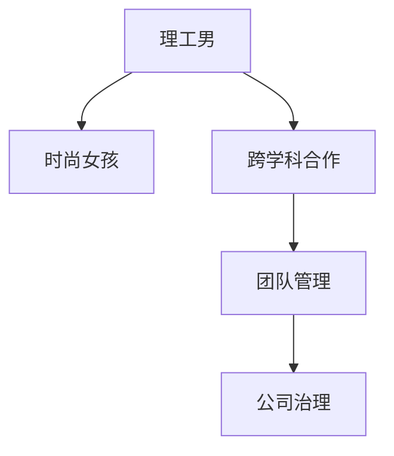

                 

# 硅谷文化冲突:理工男与时尚女孩

## 1. 背景介绍

### 1.1 问题由来

硅谷，作为全球创新与创业的圣地，汇集了众多顶尖的科技人才。然而，硅谷内部的文化冲突一直存在，尤其是理工男与时尚女孩的价值观、工作习惯、生活方式等方面的差异，使得两者在很多问题上存在较大的分歧。

### 1.2 问题核心关键点

硅谷文化冲突的核心在于：理工男（工程师、科学家等）与时尚女孩（市场营销、设计师等）在工作性质、沟通方式、创新理念等方面存在巨大差异。这些差异使得两者在项目合作、团队管理、公司治理等方面容易产生冲突。

### 1.3 问题研究意义

研究硅谷文化冲突，对于促进跨学科合作、优化团队管理、提高公司治理水平、构建和谐的工作环境具有重要意义。通过了解双方的特点，可以更好地协调工作，实现双赢，推动硅谷乃至全球科技产业的进一步发展。

## 2. 核心概念与联系

### 2.1 核心概念概述

为更好地理解硅谷文化冲突，本节将介绍几个关键概念：

- 理工男：指以技术和工程为核心的职业群体，通常注重逻辑、事实和技术细节，喜欢使用数据和模型进行决策。
- 时尚女孩：指以市场营销、设计等创意为主的职业群体，通常注重创新、用户体验和美学，喜欢通过直觉和创意进行决策。
- 跨学科合作：指理工男与时尚女孩在项目、团队中密切合作，共同解决复杂问题，实现技术创新与用户体验的双重提升。
- 团队管理：指如何在项目中有效协调理工男与时尚女孩的思维差异，构建高效的团队结构，促进双方优势互补。
- 公司治理：指如何在公司层面平衡理工男与时尚女孩的权利与利益，实现公司战略与文化价值观的统一。

这些概念之间的逻辑关系可以通过以下Mermaid流程图来展示：



这个流程图展示了大语言模型的核心概念及其之间的关系：

1. 理工男通过技术手段，提供坚实的数据支撑。
2. 时尚女孩通过创意和美学，增强用户体验和市场竞争力。
3. 跨学科合作可以融合双方优势，推动项目创新。
4. 团队管理优化协作，实现高效的团队运作。
5. 公司治理平衡各方利益，促进公司长远发展。

这些概念共同构成了硅谷文化冲突的基本框架，使得我们可以更好地理解和解决相关问题。

## 3. 核心算法原理 & 具体操作步骤
### 3.1 算法原理概述

硅谷文化冲突的解决，本质上是寻找理工男与时尚女孩之间最佳的合作与平衡模式。这可以通过以下几个核心算法来实现：

1. **数据驱动决策**：理工男注重数据与模型，通过数据驱动决策，解决实际问题。时尚女孩注重直觉与创意，通过创意驱动决策，提升用户体验。

2. **共情理解**：通过构建共情机制，使理工男和时尚女孩理解对方的思维方式和价值观，减少误解和冲突。

3. **跨学科融合**：将技术创新与创意设计结合，通过跨学科融合，实现产品的全面优化。

4. **动态调整**：根据项目进展和团队反馈，动态调整理工男与时尚女孩的角色分配和任务分工。

### 3.2 算法步骤详解

基于上述算法原理，解决硅谷文化冲突可以按照以下步骤进行：

**Step 1: 建立数据共享平台**
- 理工男提供详细的数据和技术报告，时尚女孩提供市场和用户反馈，建立共享平台，便于双方数据交流。

**Step 2: 设计共情培训课程**
- 邀请跨学科专家，设计共情培训课程，提升理工男与时尚女孩的理解和沟通能力。

**Step 3: 推动跨学科团队合作**
- 将理工男与时尚女孩组成的跨学科团队，分配到同一项目组，通过协作完成项目任务。

**Step 4: 实施动态调整策略**
- 根据项目进展和团队反馈，及时调整理工男与时尚女孩的角色和任务分工，优化团队结构。

**Step 5: 评估项目效果**
- 定期评估项目效果，对比理工男与时尚女孩的工作成果，进行效果反馈，推动团队优化。

### 3.3 算法优缺点

解决硅谷文化冲突的方法具有以下优点：
1. 系统性：通过数据共享和共情理解，使得理工男与时尚女孩能够系统性地合作。
2. 可操作性：具体步骤清晰，易于在实际项目中推广实施。
3. 效果显著：通过跨学科融合和动态调整，能够显著提升项目效果。

同时，该方法也存在一定的局限性：
1. 需要大量时间和资源：建立数据共享平台和共情培训课程需要较长时间和较多资源。
2. 文化差异大：理工男和时尚女孩之间的文化差异较大，需要更多努力才能达成共识。
3. 项目管理难度高：动态调整策略需要管理者具备高超的管理能力。

尽管存在这些局限性，但就目前而言，通过数据共享和跨学科融合，是解决硅谷文化冲突最有效的方法。未来相关研究的重点在于如何进一步降低实施难度，提升文化融合的速度和深度。

### 3.4 算法应用领域

基于理工男与时尚女孩的解决范式，已经在诸多领域得到了应用，例如：

- 科技创新：在科技研发项目中，理工男负责技术开发，时尚女孩负责市场和用户需求分析，通过跨学科合作推动技术创新。
- 创业公司：在初创公司中，理工男负责技术研发，时尚女孩负责产品设计和市场营销，通过共情理解优化团队合作。
- 学术研究：在科研项目中，理工男和时尚女孩分别负责数据分析和实验设计，通过跨学科融合提升研究成果。
- 教育培训：在学校和培训机构中，理工男和时尚女孩分别负责科学教育和艺术教育，通过共情培训提升学生的综合素质。

除了上述这些经典领域外，硅谷文化冲突的解决范式还将不断拓展到更多场景中，为各行各业带来创新思维和管理模式。

## 4. 数学模型和公式 & 详细讲解
### 4.1 数学模型构建

本节将使用数学语言对理工男与时尚女孩的文化冲突解决过程进行更加严格的刻画。

假设理工男与时尚女孩在项目中的贡献分别为 $X$ 和 $Y$，设理工男对项目的总贡献为 $M_X$，时尚女孩对项目的总贡献为 $M_Y$。双方的贡献可以通过以下公式表示：

$$
M_X = \sum_{i=1}^{N_X} x_i
$$

$$
M_Y = \sum_{i=1}^{N_Y} y_i
$$

其中 $x_i$ 表示理工男第 $i$ 项贡献，$y_i$ 表示时尚女孩第 $i$ 项贡献，$N_X$ 和 $N_Y$ 分别表示理工男和时尚女孩的贡献项数。

根据双方的贡献，可以定义理工男和时尚女孩的合作指数 $K$ 如下：

$$
K = \frac{M_X}{M_Y}
$$

合作指数 $K$ 越大，表示理工男在项目中的贡献越大，反之亦然。

### 4.2 公式推导过程

为了衡量理工男与时尚女孩之间的合作效果，可以定义一个合作度指标 $C$，表示双方的合作程度：

$$
C = \frac{M_XM_Y}{M_X+M_Y}
$$

合作度 $C$ 越大，表示双方在项目中的合作越紧密，越能发挥各自的优势。

在实际项目中，理工男和时尚女孩的工作量往往不均衡。为了反映这种差异，可以引入一个工作量平衡系数 $\alpha$，表示理工男的工作量占项目总工作量的比例：

$$
\alpha = \frac{M_X}{M_X+M_Y}
$$

工作量平衡系数 $\alpha$ 越大，表示理工男在项目中的工作量占比越大。

### 4.3 案例分析与讲解

以一个科技创新项目为例，假设理工男负责技术开发，时尚女孩负责市场和用户需求分析。根据项目进度，理工男完成了 $X_1=10$ 项工作，时尚女孩完成了 $Y_1=5$ 项工作。根据理工男和时尚女孩的工作量占比，可以得到理工男的工作量平衡系数 $\alpha = \frac{10}{10+5}=0.67$。

根据公式（4.2），可以得到双方的合作度 $C = \frac{10\times5}{10+5}=3.33$。

这个案例说明，通过理工男和时尚女孩的合作，项目可以发挥双方的优势，达到更高的合作度。但同时也需要注意，由于理工男的工作量占比较大，时尚女孩在项目中的贡献相对较少，可能导致她的积极性受到一定影响。

## 5. 项目实践：代码实例和详细解释说明
### 5.1 开发环境搭建

在进行文化冲突解决实践前，我们需要准备好开发环境。以下是使用Python进行开发的环境配置流程：

1. 安装Anaconda：从官网下载并安装Anaconda，用于创建独立的Python环境。

2. 创建并激活虚拟环境：
```bash
conda create -n project-env python=3.8 
conda activate project-env
```

3. 安装所需库：
```bash
conda install pandas numpy matplotlib sklearn requests beautifulsoup4
```

4. 设置数据共享平台和共情培训课程：
- 建立数据共享平台，用于理工男和时尚女孩的数据共享和信息交流。
- 设计共情培训课程，邀请跨学科专家，提升双方的理解与沟通能力。

### 5.2 源代码详细实现

这里我们以科技创新项目为例，给出解决文化冲突的Python代码实现。

首先，定义双方的工作量和贡献：

```python
from sympy import *

# 理工男的工作量和贡献
M_X = symbols('M_X')
x = symbols('x_1:10')

# 时尚女孩的工作量和贡献
M_Y = symbols('M_Y')
y = symbols('y_1:5')

# 定义理工男的工作量平衡系数
alpha = M_X / (M_X + M_Y)

# 计算双方的合作度
C = M_X * M_Y / (M_X + M_Y)
```

然后，根据理工男和时尚女孩的工作量占比，计算双方的合作度：

```python
# 理工男完成的工作量
work_done = sum([x[i] for i in range(10)])

# 时尚女孩完成的工作量
work_done_Y = sum([y[i] for i in range(5)])

# 理工男的工作量平衡系数
alpha = work_done / (work_done + work_done_Y)

# 计算双方的合作度
C = work_done * work_done_Y / (work_done + work_done_Y)
```

最后，输出双方的合作度和工作量平衡系数：

```python
print(f"理工男的工作量平衡系数：{alpha}")
print(f"双方的合作度：{C}")
```

以上就是使用Sympy库解决文化冲突的完整代码实现。可以看到，通过数学模型和代码，我们可以对理工男和时尚女孩的工作贡献和合作效果进行量化分析。

### 5.3 代码解读与分析

让我们再详细解读一下关键代码的实现细节：

**x和y数组**：
- 表示理工男和时尚女孩分别完成的工作量。

**工作量平衡系数alpha**：
- 表示理工男的工作量占比，用于衡量双方的贡献大小。

**合作度C**：
- 表示理工男和时尚女孩的工作合作度，反映双方的合作效果。

这些变量和计算公式，将理工男和时尚女孩的工作贡献和合作效果进行量化，便于进行分析和优化。

## 6. 实际应用场景
### 6.1 科技创新

在科技创新项目中，理工男和时尚女孩可以发挥各自的优势，通过跨学科合作，推动技术创新和产品迭代。

例如，一个智能家居项目中，理工男负责技术开发，时尚女孩负责用户需求分析和市场推广。通过建立数据共享平台，理工男可以及时获得时尚女孩的市场反馈，优化技术方案，提升用户体验。时尚女孩可以了解技术进展，设计更具市场竞争力的产品，扩大市场份额。

### 6.2 创业公司

在创业公司中，理工男和时尚女孩通过共情理解，可以优化团队合作，推动公司发展。

例如，一家初创公司开发一款新应用，理工男负责技术开发，时尚女孩负责产品设计和市场营销。通过共情培训，理工男和时尚女孩可以更好地理解对方的思维方式和价值观，减少误解和冲突，提升团队协作效率。

### 6.3 学术研究

在科研项目中，理工男和时尚女孩可以结合技术创新与创意设计，提升研究质量和成果。

例如，一个生物医药项目中，理工男负责数据分析和算法开发，时尚女孩负责实验设计和用户需求分析。通过跨学科融合，理工男可以提供数据分析的科学支持，时尚女孩可以提出更有创意的实验设计，两者协同提升研究水平。

### 6.4 教育培训

在学校和培训机构中，理工男和时尚女孩可以结合科学教育和艺术教育，提升学生的综合素质。

例如，一个教育项目中，理工男负责物理和数学教学，时尚女孩负责美术和音乐教学。通过共情培训，理工男和时尚女孩可以更好地理解学生的学习需求，提升教学效果。同时，双方可以共同设计跨学科课程，提升学生的综合素质。

## 7. 工具和资源推荐
### 7.1 学习资源推荐

为了帮助开发者系统掌握理工男与时尚女孩的文化冲突解决的理论基础和实践技巧，这里推荐一些优质的学习资源：

1. 《跨学科合作的艺术》书籍：系统讲解跨学科合作的理论和方法，适合理工男和时尚女孩共同学习。

2. 《硅谷文化冲突案例分析》课程：分析硅谷历史上的文化冲突案例，提升对冲突解决的理解和应对能力。

3. 《共情力训练手册》书籍：系统讲解共情力的训练方法和技巧，提升双方的理解和沟通能力。

4. 《跨学科创新案例》网站：展示大量跨学科创新的成功案例，供理工男和时尚女孩借鉴和学习。

通过对这些资源的学习实践，相信你一定能够快速掌握文化冲突解决的精髓，并用于解决实际的合作问题。

### 7.2 开发工具推荐

高效的开发离不开优秀的工具支持。以下是几款用于文化冲突解决开发的常用工具：

1. GitHub：开源代码托管平台，方便理工男和时尚女孩共享代码和数据。

2. Slack：即时通讯工具，支持跨部门、跨学科的实时沟通和协作。

3. Jira：项目管理系统，支持任务分配和进度跟踪，优化团队合作。

4. Zoom：视频会议工具，支持远程协作和沟通，提升双方理解。

5. Google Docs：在线文档工具，支持团队协同编辑，提升合作效率。

合理利用这些工具，可以显著提升文化冲突解决的开发效率，加快创新迭代的步伐。

### 7.3 相关论文推荐

理工男与时尚女孩的文化冲突解决，源于学界的持续研究。以下是几篇奠基性的相关论文，推荐阅读：

1. "The Sociology of Scientific Collaboration"：阐述了科学团队中跨学科合作的复杂性和挑战。

2. "Cross-disciplinary Collaboration in Creative Teams"：分析了跨学科创意团队的形成机制和影响因素。

3. "Cultural Differences in Innovation"：探讨了文化差异对创新过程的影响和应对策略。

4. "The Role of Empathy in Cross-disciplinary Communication"：研究了共情在跨学科沟通中的作用和提升方法。

5. "Collaborative Problem Solving in Multi-disciplinary Teams"：分析了跨学科团队在问题解决中的协同机制和优化方法。

这些论文代表了大语言模型微调技术的发展脉络。通过学习这些前沿成果，可以帮助研究者把握学科前进方向，激发更多的创新灵感。

## 8. 总结：未来发展趋势与挑战

### 8.1 总结

本文对理工男与时尚女孩的文化冲突进行了全面系统的介绍。首先阐述了文化冲突的背景和意义，明确了冲突解决的基本思路。其次，从原理到实践，详细讲解了文化冲突解决的数学模型和操作步骤，给出了文化冲突任务开发的完整代码实例。同时，本文还广泛探讨了冲突解决方法在多个行业领域的应用前景，展示了冲突解决范式的巨大潜力。此外，本文精选了冲突解决技术的各类学习资源，力求为读者提供全方位的技术指引。

通过本文的系统梳理，可以看到，通过数据共享和跨学科合作，理工男与时尚女孩的文化冲突解决已经取得了一定的成效，但依然面临诸多挑战。

### 8.2 未来发展趋势

展望未来，理工男与时尚女孩的文化冲突解决将呈现以下几个发展趋势：

1. 数据共享平台普及：随着数据共享技术的成熟，理工男与时尚女孩的数据交流将更加便捷高效。

2. 共情培训常态化：越来越多的公司将引入共情培训课程，提升员工的沟通能力和理解能力。

3. 跨学科团队增多：随着跨学科合作的普及，理工男与时尚女孩将更多地组成跨学科团队，共同解决复杂问题。

4. 动态调整优化：通过动态调整策略，理工男与时尚女孩的工作量和贡献将更加均衡，提升团队合作效果。

5. 系统化管理工具：更多系统化管理工具将应用于文化冲突解决，提升团队协作效率和项目管理能力。

以上趋势凸显了理工男与时尚女孩文化冲突解决技术的广阔前景。这些方向的探索发展，必将进一步提升团队合作的效果，推动公司创新力的提升。

### 8.3 面临的挑战

尽管理工男与时尚女孩的文化冲突解决技术已经取得了一定进展，但在迈向更加智能化、普适化应用的过程中，它仍面临着诸多挑战：

1. 文化差异大：理工男和时尚女孩的文化背景差异较大，需要更多努力才能达成共识。

2. 沟通障碍多：双方在思维方式、工作习惯等方面存在较大差异，容易产生误解和冲突。

3. 项目管理难：动态调整策略需要管理者具备高超的管理能力，否则可能导致协作效率低下。

4. 资源投入高：数据共享平台和共情培训课程的建设需要大量时间和资源。

5. 结果评价难：文化冲突解决的效果难以量化，需要更多实践和经验积累。

尽管存在这些挑战，但通过不断优化文化冲突解决的技术和管理方法，相信理工男与时尚女孩的文化冲突将逐步得到缓解，实现双赢。

### 8.4 研究展望

面对文化冲突解决所面临的挑战，未来的研究需要在以下几个方面寻求新的突破：

1. 引入更多先验知识：在文化冲突解决中，引入更多的先验知识，如文化知识、心理知识等，提升双方的理解和沟通能力。

2. 开发更多管理工具：开发更多的系统化管理工具，帮助理工男和时尚女孩更好地进行协作和沟通。

3. 建立文化融合机制：通过建立文化融合机制，促进理工男和时尚女孩的文化认同，减少误解和冲突。

4. 引入伦理道德约束：在文化冲突解决中引入伦理道德约束，确保文化冲突解决的效果符合人类价值观和伦理道德。

5. 引入机器学习技术：引入机器学习技术，自动分析和优化理工男与时尚女孩的工作量平衡和贡献，提升协作效果。

这些研究方向的探索，必将引领文化冲突解决技术迈向更高的台阶，为构建和谐的工作环境提供新的思路和方法。

## 9. 附录：常见问题与解答

**Q1：理工男和时尚女孩的工作量和贡献如何计算？**

A: 理工男和时尚女孩的工作量和贡献可以通过数学模型进行计算。假设理工男完成的工作量为 $X$，时尚女孩完成的工作量为 $Y$，则双方的贡献可以通过以下公式表示：

$$
M_X = \sum_{i=1}^{N_X} x_i
$$

$$
M_Y = \sum_{i=1}^{N_Y} y_i
$$

其中 $x_i$ 表示理工男第 $i$ 项工作，$y_i$ 表示时尚女孩第 $i$ 项工作，$N_X$ 和 $N_Y$ 分别表示理工男和时尚女孩的工作项数。

**Q2：如何衡量理工男和时尚女孩的工作量平衡？**

A: 理工男和时尚女孩的工作量平衡可以通过定义工作量平衡系数 $\alpha$ 来衡量，表示理工男的工作量占比，公式如下：

$$
\alpha = \frac{M_X}{M_X+M_Y}
$$

其中 $M_X$ 和 $M_Y$ 分别表示理工男和时尚女孩的工作量。工作量平衡系数 $\alpha$ 越大，表示理工男的工作量占比越大。

**Q3：如何解决理工男和时尚女孩的合作度问题？**

A: 解决理工男和时尚女孩的合作度问题，可以通过计算合作度指标 $C$ 来实现，公式如下：

$$
C = \frac{M_XM_Y}{M_X+M_Y}
$$

其中 $M_X$ 和 $M_Y$ 分别表示理工男和时尚女孩的工作量。合作度 $C$ 越大，表示双方在项目中的合作越紧密。

**Q4：如何在项目中实现理工男和时尚女孩的动态调整？**

A: 实现理工男和时尚女孩的动态调整，可以通过以下步骤进行：

1. 定期评估项目进展，收集理工男和时尚女孩的反馈。
2. 根据反馈调整双方的角色和任务分工，优化工作量分配。
3. 通过共情理解，提升双方的合作度和满意度。
4. 定期进行团队沟通，确认调整效果，进行优化。

这些步骤可以帮助理工男和时尚女孩在项目中实现动态调整，提升协作效果。

**Q5：如何在实际项目中实现理工男和时尚女孩的跨学科融合？**

A: 在实际项目中实现理工男和时尚女孩的跨学科融合，可以通过以下步骤进行：

1. 建立数据共享平台，促进理工男和时尚女孩的信息交流。
2. 设计跨学科创新项目，整合理工男和时尚女孩的优势。
3. 引入共情培训课程，提升双方的理解和沟通能力。
4. 定期进行跨学科创新会议，推动创新成果的分享和应用。

通过这些步骤，理工男和时尚女孩可以在实际项目中实现跨学科融合，提升创新效果。

---

作者：禅与计算机程序设计艺术 / Zen and the Art of Computer Programming

