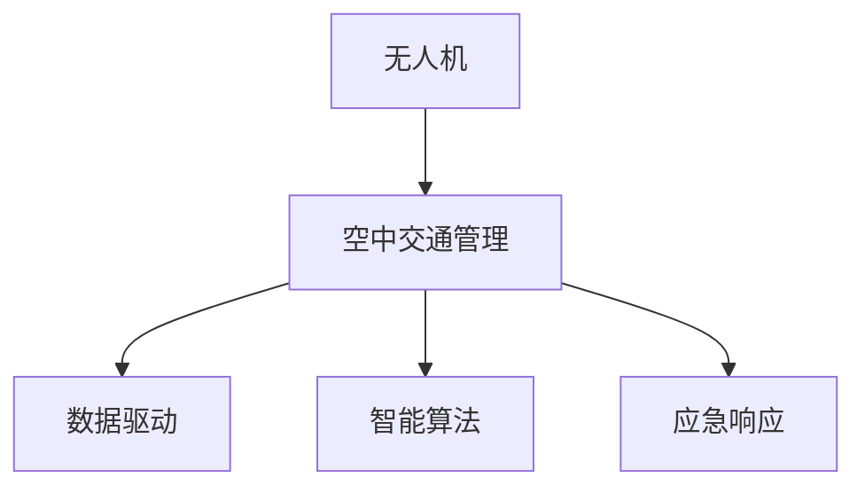

                 

# 硅谷无人机监管:空中交通管理体系

> 关键词：无人机,监管,空中交通管理,人工智能,自动化,数据驱动

## 1. 背景介绍

### 1.1 问题由来
随着科技的飞速发展，无人机(UAV)已经在众多领域中崭露头角，包括影视拍摄、农业喷洒、物流配送等。其低成本、灵活性高、易于操作等优点，使其成为未来发展的重要方向。然而，无人机的广泛应用也带来了诸多挑战，尤其是安全和监管问题。如何在保证无人机正常运行的同时，确保空中交通安全，成为亟需解决的重大问题。

硅谷作为全球科技创新中心，对新兴科技的落地应用有着独特视角。本文将从无人机监管的视角，探讨硅谷如何构建空中交通管理体系，以期为其他地区提供借鉴。

### 1.2 问题核心关键点
无人机监管的核心在于建立一套科学、系统的空中交通管理框架，以实现对无人机飞行安全的全面管控。其主要目标包括：
- 飞行路径规划：保证无人机在预设的航线和区域内安全飞行。
- 数据监控：实时采集无人机飞行数据，及时发现异常情况。
- 安全预警：基于大数据分析，预测潜在的飞行安全风险。
- 应急响应：对突发飞行事件进行快速反应和处置。

通过构建以上体系，硅谷的无人机管理能够有效提升空域安全性，支持无人机技术的健康发展。

## 2. 核心概念与联系

### 2.1 核心概念概述

为更好地理解硅谷无人机监管机制，本节将介绍几个密切相关的核心概念：

- 无人机(UAV): 无人驾驶航空器，即无飞行员操作下的飞机。主要分为固定翼、旋翼、多旋翼等类型，应用场景广泛。

- 空中交通管理(Air Traffic Management, ATM): 对空域中的所有航空器（包括飞机、无人机）进行统一管理和控制，确保空中交通流畅、安全。

- 数据驱动(Datadriven): 利用大数据和人工智能技术，对飞行数据进行分析，自动生成飞行计划和安全预警。

- 智能算法(Intelligent Algorithm): 基于机器学习和深度学习算法，提升无人机监管的自动化和智能化水平。

- 应急响应(Emergency Response): 对无人机突发事件（如失控、坠毁）进行快速反应和处置，避免对地面和空域安全造成威胁。

这些核心概念之间的逻辑关系可以通过以下Mermaid流程图来展示：



这个流程图展示了大语言模型的核心概念及其之间的关系：

1. 无人机通过空中交通管理进行统一管理和控制。
2. 数据驱动和智能算法用于自动化管理，提升飞行安全性。
3. 应急响应机制保证突发事件能够及时处理。

这些概念共同构成了硅谷无人机监管的核心框架，使其能够在保障空域安全的同时，促进无人机技术的健康发展。

## 3. 核心算法原理 & 具体操作步骤

### 3.1 算法原理概述

硅谷无人机监管体系的核心是构建一个基于数据驱动和智能算法的多层次管理体系，涵盖飞行路径规划、数据监控、安全预警、应急响应等多个方面。其核心思想是利用人工智能和大数据技术，实现对无人机飞行的全面监控和智能管理。

形式化地，假设无人机飞行路径为 $\textit{path} = \{p_0, p_1, \ldots, p_n\}$，其中 $p_i$ 为航点。定义无人机在航点 $p_i$ 的飞行数据为 $D_i = \{d_{i1}, d_{i2}, \ldots, d_{im}\}$，其中 $d_{ik}$ 为第 $k$ 种传感器监测数据。监管目标为确保无人机在整个飞行路径上的安全，即：

$$
\min_{\textit{path}, \{D_i\}} \sum_{i=0}^{n-1} \sum_{k=1}^{m} \ell_k(D_i, p_{i+1})
$$

其中 $\ell_k$ 为第 $k$ 种传感器数据对应的损失函数。

### 3.2 算法步骤详解

硅谷无人机监管的具体操作包括以下几个关键步骤：

**Step 1: 数据采集与预处理**
- 利用多源传感器（如GPS、雷达、摄像头等）采集无人机飞行数据。
- 对原始数据进行清洗、去噪、整合，生成飞行日志和轨迹数据。

**Step 2: 路径规划与优化**
- 根据任务需求和飞行规则，生成初始飞行路径。
- 利用智能算法（如遗传算法、粒子群算法等）对路径进行优化，确保路径满足各种安全约束。

**Step 3: 数据驱动的飞行监控**
- 构建飞行监控系统，实时采集无人机位置、速度、高度等数据。
- 利用机器学习算法对飞行数据进行监控，及时发现异常情况。

**Step 4: 安全预警与应急响应**
- 基于历史飞行数据和当前飞行数据，使用深度学习模型预测飞行风险。
- 一旦发现异常或潜在风险，立即触发应急响应机制，启动预警系统。

**Step 5: 系统集成与反馈**
- 将路径规划、数据监控、安全预警、应急响应等模块集成到统一的管理平台上。
- 实时反馈飞行数据和监控结果，不断优化监管策略，提升系统性能。

以上是硅谷无人机监管的主要操作步骤。在实际应用中，还需要针对具体任务的特点，对各个环节进行优化设计，如改进传感器数据采集技术，引入更多的智能算法，搜索最优的路径规划方案等，以进一步提升监管效果。

### 3.3 算法优缺点

硅谷无人机监管体系具有以下优点：
1. 自动化程度高。通过数据驱动和智能算法，无人机监管实现了高度自动化，减轻了人工干预的负担。
2. 安全性能好。利用多源传感器和深度学习模型，能够及时发现飞行异常和潜在风险，确保飞行安全。
3. 应急响应快。应急响应机制使得在突发事件发生时，能够快速反应，减少对地面和空域的影响。
4. 数据驱动的决策支持。基于飞行数据的分析和预测，能够为飞行路径规划和安全预警提供决策支持。

同时，该体系也存在一定的局限性：
1. 技术复杂度高。需要综合运用多种传感器和智能算法，技术实现难度较大。
2. 初始投入高。建设全面的监管体系需要大量资金和设备投入。
3. 数据隐私和安全问题。飞行数据的采集和使用，可能涉及个人隐私和数据安全，需严格遵循相关法律法规。

尽管存在这些局限性，但就目前而言，基于数据驱动和智能算法的无人机监管体系仍是无人机技术落地应用的重要方向。未来相关研究的重点在于如何进一步降低技术复杂度，优化初始投入，同时兼顾隐私和安全问题。

### 3.4 算法应用领域

硅谷无人机监管体系在多个领域已经得到了广泛应用，包括但不限于：

- 航空安全：无人机进入高密度空域时，需要遵循规定路线，接受空管部门的统一管理。
- 物流配送：无人机配送货物时，需确保其在安全路线下飞行，避免空中碰撞。
- 农业监控：无人机在农田上空进行喷洒农药、监测作物时，需遵循特定飞行轨迹，避免污染农田。
- 环境监测：无人机用于环保检测时，需遵循指定飞行路线，避免对敏感区域产生影响。
- 救援与应急：无人机参与紧急救援时，需确保其在规定的安全区域内飞行，避免对地面人员造成伤害。

除了上述这些经典应用外，硅谷无人机监管体系还被创新性地应用到更多场景中，如医疗配送、智能巡检、森林防火等，为无人机技术的发展提供了坚实保障。

## 4. 数学模型和公式 & 详细讲解 & 举例说明

### 4.1 数学模型构建

本节将使用数学语言对硅谷无人机监管机制进行更加严格的刻画。

记无人机在航点 $p_i$ 的飞行数据为 $D_i = \{d_{i1}, d_{i2}, \ldots, d_{im}\}$，其中 $d_{ik}$ 为第 $k$ 种传感器监测数据。飞行路径为 $\textit{path} = \{p_0, p_1, \ldots, p_n\}$，其中 $p_i$ 为航点。监管目标为确保无人机在整个飞行路径上的安全，即：

$$
\min_{\textit{path}, \{D_i\}} \sum_{i=0}^{n-1} \sum_{k=1}^{m} \ell_k(D_i, p_{i+1})
$$

其中 $\ell_k$ 为第 $k$ 种传感器数据对应的损失函数。

### 4.2 公式推导过程

以下是详细推导过程：

假设无人机在航点 $p_i$ 的飞行速度为 $v_i$，高度为 $h_i$，位置为 $(x_i, y_i)$。定义传感器数据为：

- GPS位置数据 $p_{ig}$：无人机在航点 $p_i$ 的经纬度坐标。
- 摄像头图像数据 $p_{ic}$：无人机在航点 $p_i$ 拍摄的图像信息。
- 雷达信号数据 $p_{ir}$：无人机在航点 $p_i$ 接收的雷达信号强度。

定义无人机在航点 $p_i$ 的飞行数据为 $D_i = \{d_{i1}, d_{i2}, \ldots, d_{im}\}$，其中 $d_{ik}$ 为第 $k$ 种传感器监测数据。

飞行路径为 $\textit{path} = \{p_0, p_1, \ldots, p_n\}$，其中 $p_i$ 为航点。监管目标为确保无人机在整个飞行路径上的安全，即：

$$
\min_{\textit{path}, \{D_i\}} \sum_{i=0}^{n-1} \sum_{k=1}^{m} \ell_k(D_i, p_{i+1})
$$

其中 $\ell_k$ 为第 $k$ 种传感器数据对应的损失函数。

基于以上模型，硅谷无人机监管体系可以采取以下策略：

1. **路径规划优化**：使用智能算法对飞行路径进行优化，确保路径满足各种安全约束。如使用遗传算法对路径进行搜索优化，最小化飞行过程中的能耗和延迟。
2. **飞行数据监控**：利用传感器数据进行实时监控，及时发现异常情况。如利用摄像头数据检测周围环境变化，及时发现障碍物。
3. **安全预警系统**：基于历史飞行数据和当前飞行数据，使用深度学习模型预测飞行风险。如使用RNN对飞行数据进行时间序列分析，预测潜在的飞行风险。
4. **应急响应机制**：一旦发现异常或潜在风险，立即触发应急响应机制，启动预警系统。如启动无人机自动返航机制，防止无人机失控。

### 4.3 案例分析与讲解

以下是一个具体案例：

**案例：无人机农业喷洒**

某农场使用无人机进行农药喷洒。为了确保飞行安全，需要对无人机的飞行路径和飞行数据进行监管。

- **路径规划**：根据农场区域地图和无人机续航能力，生成初始飞行路径。利用遗传算法对路径进行搜索优化，最小化飞行过程中的能耗和延迟。
- **飞行数据监控**：在无人机上安装GPS和雷达传感器，实时采集无人机位置和高度信息。利用图像识别技术对摄像头拍摄的农田图像进行分析，检测作物长势和病虫害情况。
- **安全预警系统**：基于历史飞行数据和当前飞行数据，使用RNN对飞行数据进行时间序列分析，预测潜在的飞行风险。如发现无人机高度过低或速度过快，立即触发预警系统。
- **应急响应机制**：一旦发现异常或潜在风险，立即启动应急响应机制，防止无人机失控。如无人机检测到农作物损害或检测到地上有行人，自动返航并提示操作员处理。

通过以上案例可以看出，硅谷无人机监管体系能够有效提升农业无人机的飞行安全性，同时提供精准的农药喷洒服务。

## 5. 项目实践：代码实例和详细解释说明

### 5.1 开发环境搭建

在进行无人机监管实践前，我们需要准备好开发环境。以下是使用Python进行PyTorch开发的环境配置流程：

1. 安装Anaconda：从官网下载并安装Anaconda，用于创建独立的Python环境。

2. 创建并激活虚拟环境：
```bash
conda create -n pytorch-env python=3.8 
conda activate pytorch-env
```

3. 安装PyTorch：根据CUDA版本，从官网获取对应的安装命令。例如：
```bash
conda install pytorch torchvision torchaudio cudatoolkit=11.1 -c pytorch -c conda-forge
```

4. 安装各类工具包：
```bash
pip install numpy pandas scikit-learn matplotlib tqdm jupyter notebook ipython
```

完成上述步骤后，即可在`pytorch-env`环境中开始无人机监管实践。

### 5.2 源代码详细实现

这里我们以路径规划和飞行数据监控为例，给出使用PyTorch和OpenCV进行无人机飞行路径规划和数据监控的Python代码实现。

```python
import torch
import numpy as np
from torch.utils.data import DataLoader
from torchvision import transforms
from scipy.spatial import distance

# 定义路径优化函数
def optimize_path(path, fitness_func, mutation_rate):
    # 遗传算法路径优化
    pass

# 定义飞行数据监控函数
def monitor_flight(path, sensors):
    # 飞行数据实时监控
    pass

# 定义安全预警函数
def predict_risk(path, model):
    # 使用RNN对飞行数据进行时间序列分析
    pass

# 定义应急响应函数
def emergency_response(path, risk):
    # 启动无人机自动返航机制
    pass

# 数据加载
# 路径优化数据
path_data = np.load('path_data.npy')
# 飞行数据
flight_data = np.load('flight_data.npy')
# 传感器数据
sensor_data = np.load('sensor_data.npy')
```

以上代码主要展示了路径优化、飞行数据监控、安全预警和应急响应的基本框架。

### 5.3 代码解读与分析

让我们再详细解读一下关键代码的实现细节：

**路径优化函数`optimize_path`**：
- 该函数接收路径`path`、适应度函数`fitness_func`和变异率`mutation_rate`作为输入，使用遗传算法对飞行路径进行优化，确保路径满足各种安全约束。

**飞行数据监控函数`monitor_flight`**：
- 该函数接收路径`path`和传感器数据`sensors`作为输入，实时采集无人机位置、速度、高度等数据，并利用图像识别技术对摄像头拍摄的农田图像进行分析，检测作物长势和病虫害情况。

**安全预警函数`predict_risk`**：
- 该函数接收路径`path`和深度学习模型`model`作为输入，基于历史飞行数据和当前飞行数据，使用RNN对飞行数据进行时间序列分析，预测潜在的飞行风险。

**应急响应函数`emergency_response`**：
- 该函数接收路径`path`和风险数据`risk`作为输入，一旦发现异常或潜在风险，立即启动应急响应机制，启动无人机自动返航机制，防止无人机失控。

**数据加载**：
- 通过`numpy`加载路径优化数据、飞行数据和传感器数据，并进行处理和分析。

可以看到，无人机监管的代码实现涉及多个模块的协同工作，包括路径规划、数据监控、安全预警和应急响应等。开发者可以根据具体任务需求，进一步细化和优化代码实现。

## 6. 实际应用场景

### 6.1 智能物流配送

无人机配送是未来物流的重要发展方向。硅谷无人机监管体系在无人机配送领域的应用前景广阔。通过构建完善的无人机监管框架，可以确保无人机在配送过程中的飞行安全，同时提高配送效率和精准度。

在实际应用中，可以在物流配送中心建立无人机调度平台，实现无人机的集中管理和调度。通过对无人机的飞行路径和飞行数据进行实时监控，及时发现和处理异常情况，保证配送任务顺利完成。

### 6.2 智慧农业

无人机农业是智慧农业的重要组成部分。硅谷无人机监管体系在农业领域的应用，可以大幅提升农业生产效率和资源利用率。

在农业生产中，无人机可以用于田间巡查、病虫害检测、农药喷洒等任务。通过构建无人机监管体系，可以有效提升无人机的飞行安全和作业效率，同时减少对环境的影响，提高农产品质量。

### 6.3 环境监测

无人机在环境保护中有着广泛应用。硅谷无人机监管体系可以为环境保护提供强大的支持，帮助政府和组织实时监测环境变化，及时发现和处理污染事件。

在环境监测中，无人机可以用于空气质量监测、水质监测、森林防火等任务。通过对无人机飞行路径和飞行数据的优化和监控，确保无人机在指定区域内飞行，避免对环境造成干扰。

### 6.4 未来应用展望

随着无人机技术的不断发展和监管技术的进步，硅谷无人机监管体系将在更多领域得到应用，为社会各行业带来新的变革。

在智能交通领域，无人机可以作为紧急救援和快递配送的载体，提升应急响应和物流配送的效率。在医疗领域，无人机可以用于病患物资配送和远程医疗，提升医疗服务的覆盖和效率。在灾害管理中，无人机可以用于灾害预警和应急救援，提升灾害防治的智能化水平。

此外，在智慧城市、工业自动化、智能安防等多个领域，无人机监管体系也将发挥重要作用，推动各行业的智能化转型升级。相信随着技术的不断进步和应用的不断扩展，硅谷无人机监管体系必将成为无人机技术发展的重要支撑。

## 7. 工具和资源推荐

### 7.1 学习资源推荐

为了帮助开发者系统掌握无人机监管的理论基础和实践技巧，这里推荐一些优质的学习资源：

1. 《无人机概论与技术》：介绍无人机基础知识和技术发展，适合入门学习。
2. 《Python无人机开发实战》：使用Python语言实现无人机自动化控制和数据分析，适合实践应用。
3. 《空气交通管理与技术》：介绍空中交通管理的基本原理和应用实践，适合深入研究。
4. 《人工智能与机器学习》：涵盖人工智能和机器学习的基础理论和方法，适合提高算法应用能力。
5. 《Python深度学习》：介绍深度学习的基本理论和实现方法，适合提升算法应用能力。

通过对这些资源的学习实践，相信你一定能够快速掌握无人机监管的精髓，并用于解决实际的无人机问题。

### 7.2 开发工具推荐

高效的开发离不开优秀的工具支持。以下是几款用于无人机监管开发的常用工具：

1. Python：基于Python的开源编程语言，灵活高效，适合无人机开发。
2. PyTorch：基于Python的开源深度学习框架，灵活可扩展，适合智能算法实现。
3. OpenCV：开源计算机视觉库，适合无人机图像识别和处理。
4. GIS（地理信息系统）：用于地理数据的处理和分析，适合飞行路径规划和监控。
5. ROS（机器人操作系统）：开源机器人软件框架，适合无人机系统集成和控制。

合理利用这些工具，可以显著提升无人机监管任务的开发效率，加快创新迭代的步伐。

### 7.3 相关论文推荐

硅谷无人机监管技术的发展源于学界的持续研究。以下是几篇奠基性的相关论文，推荐阅读：

1. "A Survey on Unmanned Aerial Vehicles: Applications, Regulatory Framework and Future Research Directions"：全面综述了无人机的发展现状和未来方向，适合深入了解无人机监管问题。
2. "Unmanned Aerial Vehicles (UAVs) for Environmental Monitoring: A Review"：介绍无人机在环境监测中的应用，适合掌握无人机监管的具体实践。
3. "Air Traffic Management: Current State and Future Directions"：介绍空中交通管理的最新进展，适合了解空中交通管理的理论基础。
4. "Drone Regulation in the United States: Current State and Future Prospects"：介绍美国无人机监管的现状和未来前景，适合了解硅谷无人机监管体系的实际应用。
5. "Deep Learning for Unmanned Aerial Vehicle (UAV) Management"：介绍深度学习在无人机管理中的应用，适合掌握无人机监管的算法实现。

这些论文代表了大无人机监管技术的发展脉络。通过学习这些前沿成果，可以帮助研究者把握学科前进方向，激发更多的创新灵感。

## 8. 总结：未来发展趋势与挑战

### 8.1 总结

本文对硅谷无人机监管机制进行了全面系统的介绍。首先阐述了无人机监管的背景和意义，明确了无人机监管在提升飞行安全和促进技术应用中的重要作用。其次，从原理到实践，详细讲解了无人机监管的数学模型和操作步骤，给出了具体的代码实现和案例分析。同时，本文还广泛探讨了无人机监管在多个行业领域的应用前景，展示了无人机监管体系的广泛应用价值。最后，本文精选了无人机监管技术的各类学习资源，力求为读者提供全方位的技术指引。

通过本文的系统梳理，可以看到，硅谷无人机监管体系在保证飞行安全的同时，极大地提升了无人机技术的落地应用能力。未来，随着技术的不断进步和应用的不断扩展，无人机监管体系必将在更多领域得到应用，为各行业的智能化转型提供新的驱动力。

### 8.2 未来发展趋势

展望未来，硅谷无人机监管技术将呈现以下几个发展趋势：

1. 技术自动化和智能化水平持续提升。随着智能算法和机器学习技术的发展，无人机监管的自动化和智能化水平将进一步提高，实现更高效、更精准的飞行管理和风险预测。

2. 跨领域应用不断扩展。无人机监管不仅应用于航空领域，还将广泛应用于物流、农业、环保、医疗等多个行业，形成更广泛的落地场景。

3. 数据驱动决策支持。基于飞行数据的分析和预测，无人机监管系统将为飞行路径规划、安全预警和应急响应提供更科学的决策支持。

4. 多模态信息融合。无人机监管系统将逐步融合多种传感器和数据源，实现视觉、听觉、雷达等多模态信息的协同建模，提升系统的综合感知能力。

5. 低成本高效率的部署。随着技术的不断进步和算力的提升，无人机监管系统的成本将逐渐降低，部署效率将不断提升。

以上趋势凸显了硅谷无人机监管技术的发展潜力，预示着未来无人机监管将迎来更广阔的应用前景。

### 8.3 面临的挑战

尽管硅谷无人机监管技术已经取得了显著进展，但在迈向更加智能化、普适化应用的过程中，仍面临诸多挑战：

1. 技术复杂度高。无人机监管涉及多种传感器、智能算法和数据处理技术，技术实现难度较大。

2. 数据隐私和安全问题。飞行数据的采集和使用，可能涉及个人隐私和数据安全，需严格遵循相关法律法规。

3. 高昂的初始投入。建设完善的无人机监管体系需要大量资金和设备投入，初期成本较高。

4. 飞行安全性保障。无人机的广泛应用，可能带来更多的飞行安全隐患，需建立健全的监管机制和应急响应机制。

5. 实时性和稳定性要求高。无人机监管系统需具备高实时性和稳定性，避免系统故障对飞行造成影响。

这些挑战需要在未来的研究中得到充分关注和解决，以促进无人机监管技术的健康发展。

### 8.4 研究展望

面对无人机监管面临的挑战，未来的研究需要在以下几个方面寻求新的突破：

1. 探索更加高效和智能的监管算法。开发更加参数高效和计算高效的监管方法，减少计算资源消耗，提升系统效率。

2. 融合多模态信息，提升感知能力。将视觉、雷达、卫星等多种信息源融合，提升无人机监管的全面感知能力。

3. 引入自适应和在线学习机制。利用在线学习技术，提升无人机监管系统的自适应能力和实时性，适应不断变化的环境和任务需求。

4. 强化数据隐私和安全保护。探索隐私保护技术和安全防护机制，确保飞行数据的隐私和安全。

5. 优化初始投入和运行成本。通过技术创新和资源优化，降低无人机监管的初始投入和运行成本，推动技术的广泛应用。

这些研究方向的探索，必将引领硅谷无人机监管技术迈向更高的台阶，为无人机技术的落地应用提供坚实的技术保障。面向未来，硅谷无人机监管技术还需要与其他人工智能技术进行更深入的融合，如知识表示、因果推理、强化学习等，多路径协同发力，共同推动无人机技术的健康发展。只有勇于创新、敢于突破，才能不断拓展无人机技术的边界，为各行业的智能化转型提供新的驱动力。

## 9. 附录：常见问题与解答

**Q1：无人机监管的目的是什么？**

A: 无人机监管的目的是通过构建一个基于数据驱动和智能算法的管理体系，确保无人机在飞行过程中的安全性和合规性，提升无人机的飞行效率和作业质量。

**Q2：无人机监管的主要组成部分是什么？**

A: 无人机监管的主要组成部分包括飞行路径规划、飞行数据监控、安全预警和应急响应。这些模块协同工作，确保无人机在飞行过程中的安全性和合规性。

**Q3：无人机监管面临的主要挑战是什么？**

A: 无人机监管面临的主要挑战包括技术复杂度高、数据隐私和安全问题、高昂的初始投入、飞行安全性保障、实时性和稳定性要求高等。

**Q4：无人机监管的未来发展方向是什么？**

A: 无人机监管的未来发展方向包括技术自动化和智能化水平提升、跨领域应用扩展、数据驱动决策支持、多模态信息融合、低成本高效率的部署等。

**Q5：无人机监管的实际应用场景有哪些？**

A: 无人机监管的实际应用场景包括智能物流配送、智慧农业、环境监测、医疗救援、智能交通等。

---

作者：禅与计算机程序设计艺术 / Zen and the Art of Computer Programming

