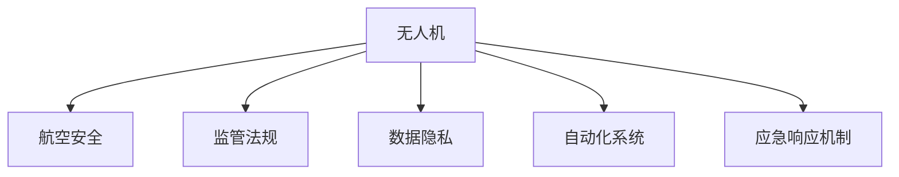

                 

# 硅谷无人机监管新规:保障航空安全

> 关键词：无人机, 航空安全, 监管法规, 数据隐私, 自动化系统

## 1. 背景介绍

### 1.1 问题由来

近年来，随着无人机技术的快速发展，硅谷等地已成为无人机飞行器的重要集散地。由于无人机操作灵活、成本低廉，广泛用于摄影、农业、环境监测等多个领域，但同时也带来了诸如空域安全、隐私保护等一系列挑战。硅谷地区的开放性及技术创新特性，使得这些挑战显得尤为复杂。因此，如何在保障航空安全的同时，最大化无人机技术带来的便利性，成为了硅谷无人机监管的一个关键课题。

### 1.2 问题核心关键点

硅谷无人机监管的核心在于制定一套既能够保障航空安全，又能促进技术创新和产业发展的法规体系。该体系需要涵盖以下几个方面：

- **空域安全管理**：确保无人机飞行在划定的安全空域内，避免与有人驾驶飞机相撞。
- **数据隐私保护**：对无人机收集的个人数据和隐私信息进行严格监管，防止滥用。
- **操作规范和认证**：制定统一的无人机操作标准和认证流程，保障飞行安全。
- **自动化系统与技术监管**：对无人机中的自动化飞行控制、智能避障等系统进行规范，确保其安全性。
- **应急响应机制**：建立紧急情况下的无人机应急响应机制，保障应急处置的有效性。

这些关键点共同构成了硅谷无人机监管的核心框架，旨在通过合理规范和严格监管，达到航空安全与技术发展的平衡。

## 2. 核心概念与联系

### 2.1 核心概念概述

为了更好地理解硅谷无人机监管的新规，本节将介绍几个关键概念：

- **无人机(Drones)**：一种具有自主控制能力的飞行器，通过无线电信号进行遥控或自主飞行。
- **航空安全(Aviation Safety)**：保障飞行器在空域内的安全运行，避免碰撞、坠机等事故。
- **监管法规(Regulatory Framework)**：政府制定的针对无人机操作的管理和规范体系。
- **数据隐私(Precision Privacy)**：保护个人和敏感数据不被滥用，防止隐私泄露。
- **自动化系统(Autonomous Systems)**：无人机中用于飞行控制、路径规划等任务的自动化技术。
- **应急响应机制(Emergency Response Mechanism)**：在无人机发生异常或紧急情况时，迅速响应和处理的机制。

这些概念之间的逻辑关系可以通过以下Mermaid流程图来展示：



这个流程图展示了大无人机的核心概念及其之间的关系：

1. 无人机需要通过监管法规进行管理和规范。
2. 航空安全是无人机的首要保障。
3. 数据隐私需要被严格保护。
4. 自动化系统确保无人机的智能化操作。
5. 应急响应机制应对无人机可能出现的紧急情况。

这些概念共同构成了硅谷无人机监管的政策框架，引导和规范无人机的使用和管理。

## 3. 核心算法原理 & 具体操作步骤

### 3.1 算法原理概述

硅谷无人机监管的核心算法原理是基于规则和模型的综合应用。以下是具体的步骤和原理：

#### 3.1.1 空域安全管理

空域安全管理主要通过以下几个步骤实现：

1. **划定安全空域**：依据地理环境和交通流量，划分无人机的安全飞行区域。
2. **飞行计划申请**：无人机操作者需要提前申请飞行计划，明确飞行时间和路线。
3. **实时监控**：通过雷达、AIS等设备对无人机进行实时监控，确保其不越界。
4. **飞行路径优化**：结合地理信息系统和导航算法，优化无人机的飞行路径，避免与其他飞行器冲突。

这些步骤基于规则，并通过技术手段实现。

#### 3.1.2 数据隐私保护

数据隐私保护主要通过以下几个步骤实现：

1. **数据最小化原则**：确保无人机仅收集必要的数据，避免滥用。
2. **加密传输和存储**：对敏感数据进行加密传输和存储，防止数据泄露。
3. **用户知情同意**：明确告知用户无人机收集数据的目的和范围，获取用户同意。
4. **匿名化处理**：对收集的数据进行匿名化处理，防止反向识别。

这些步骤依赖于隐私保护的技术和管理措施。

#### 3.1.3 操作规范和认证

操作规范和认证主要通过以下几个步骤实现：

1. **统一标准**：制定统一的无人机操作标准，涵盖飞行高度、速度、距离等。
2. **飞行员培训和认证**：对无人机操作人员进行培训和认证，确保其具备操作技能和安全意识。
3. **设备检测**：对无人机设备进行定期检测，确保其符合安全规范。
4. **异常监测**：对无人机操作进行异常监测，及时发现和处理异常情况。

这些步骤依赖于标准化和认证机制。

#### 3.1.4 自动化系统与技术监管

自动化系统与技术监管主要通过以下几个步骤实现：

1. **系统测试**：对无人机的飞行控制、智能避障等系统进行严格测试。
2. **规范制定**：制定相关的技术规范，确保自动化系统的安全性。
3. **智能算法优化**：优化智能算法，提升无人机的自主飞行能力和安全性。
4. **数据融合**：将传感器数据与环境数据融合，提升决策的准确性。

这些步骤依赖于技术创新和规范制定。

#### 3.1.5 应急响应机制

应急响应机制主要通过以下几个步骤实现：

1. **预案制定**：制定紧急情况下的无人机应急响应预案。
2. **监控预警**：利用传感器和人工智能技术，实时监控无人机的运行状态。
3. **快速反应**：在检测到异常情况时，迅速采取措施，防止事故扩大。
4. **事故调查**：对事故进行详细调查，分析原因，防止类似事件再次发生。

这些步骤依赖于技术手段和应急管理机制。

### 3.2 算法步骤详解

#### 3.2.1 空域安全管理步骤

1. **空域划分**
    - 根据飞行区域的地形、交通流量等因素，将空域划分为不同的区域。
    - 使用地理信息系统(GIS)工具，结合航空交通管制信息，精确划分空域边界。

2. **飞行计划申请**
    - 无人机操作者需向相关部门提交飞行计划，包括飞行高度、速度、路线等。
    - 飞行计划经过审核批准后，无人机方可执行。

3. **实时监控**
    - 使用雷达、AIS等设备，对无人机进行实时位置和状态监测。
    - 系统实时分析无人机位置，确保其不越界或接近危险区域。

4. **路径优化**
    - 结合地理信息系统和导航算法，计算最优飞行路径。
    - 路径规划需考虑避障信息、气象条件等因素。

#### 3.2.2 数据隐私保护步骤

1. **数据最小化原则**
    - 根据任务需求，确定必须收集的数据类型和数量。
    - 避免收集不必要的个人敏感信息。

2. **加密传输和存储**
    - 使用AES、RSA等加密算法，对数据进行加密传输。
    - 使用加密数据库，确保存储的数据安全。

3. **用户知情同意**
    - 在收集数据前，明确告知用户数据的用途和处理方式。
    - 获取用户的知情同意，确保数据收集合法。

4. **匿名化处理**
    - 对收集的数据进行去标识化处理，防止反向识别。
    - 使用数据脱敏技术，确保数据无法被追溯。

#### 3.2.3 操作规范和认证步骤

1. **统一标准**
    - 制定无人机操作的标准和规范，涵盖飞行高度、速度、距离等参数。
    - 标准需与国际民航组织(ICAO)的规则保持一致。

2. **飞行员培训和认证**
    - 对无人机操作人员进行培训，涵盖飞行规则、应急处置等内容。
    - 考核通过后，颁发操作证书。

3. **设备检测**
    - 定期对无人机设备进行性能测试和安全性检测。
    - 确保设备符合国际民航规定的安全标准。

4. **异常监测**
    - 使用传感器和监控系统，实时监测无人机操作状态。
    - 检测到异常情况时，立即采取措施，如紧急降落地表、自动返航等。

#### 3.2.4 自动化系统与技术监管步骤

1. **系统测试**
    - 对飞行控制、智能避障等系统进行严格测试，确保其稳定性和安全性。
    - 测试包括地面测试和模拟飞行测试。

2. **规范制定**
    - 制定相关的技术规范，确保自动化系统的安全性。
    - 规范需涵盖系统设计、测试、部署等方面。

3. **智能算法优化**
    - 优化智能算法，提升无人机的自主飞行能力和安全性。
    - 算法优化需结合实际飞行数据和专家经验。

4. **数据融合**
    - 将传感器数据与环境数据进行融合，提升决策的准确性。
    - 数据融合需考虑实时性、准确性和安全性。

#### 3.2.5 应急响应机制步骤

1. **预案制定**
    - 制定无人机应急响应预案，涵盖各种紧急情况和应对措施。
    - 预案需详细明确，易于执行。

2. **监控预警**
    - 利用传感器和人工智能技术，实时监控无人机的运行状态。
    - 系统实时分析无人机位置和状态，及时预警异常情况。

3. **快速反应**
    - 在检测到异常情况时，迅速采取措施，防止事故扩大。
    - 措施包括紧急降落地表、自动返航、强制降落等。

4. **事故调查**
    - 对事故进行详细调查，分析事故原因，并采取改进措施。
    - 调查需形成报告，并公开结果，防止类似事件再次发生。

### 3.3 算法优缺点

#### 3.3.1 空域安全管理

**优点**：
1. **精确划分空域**：通过GIS和航空交通管制信息，精确划分空域，减少碰撞风险。
2. **实时监控**：使用雷达、AIS等设备，实现无人机状态的实时监控。
3. **路径优化**：结合导航算法，计算最优路径，避免冲突。

**缺点**：
1. **成本高**：需要建设大量的监控设备，投入成本较高。
2. **技术复杂**：系统集成和维护较为复杂，需要专业人员支持。

#### 3.3.2 数据隐私保护

**优点**：
1. **数据最小化**：严格遵循数据最小化原则，减少数据泄露风险。
2. **加密传输**：使用加密算法，确保数据在传输过程中的安全性。
3. **匿名化处理**：确保数据无法被反向识别，保护用户隐私。

**缺点**：
1. **数据脱敏**：处理数据需要更多技术支持，增加了实施难度。
2. **用户知情同意**：需要投入人力进行用户知情同意的获取和管理。

#### 3.3.3 操作规范和认证

**优点**：
1. **标准化管理**：制定统一的操作标准，确保操作规范和安全性。
2. **人员培训**：通过专业培训和认证，提升操作人员的素质。
3. **设备检测**：定期检测确保设备符合安全标准，减少事故风险。

**缺点**：
1. **流程复杂**：标准化管理和认证流程繁琐，增加了实施难度。
2. **成本高**：培训和认证需要投入较多资源，增加了操作成本。

#### 3.3.4 自动化系统与技术监管

**优点**：
1. **系统测试**：通过严格测试，确保自动化系统的可靠性和安全性。
2. **智能算法优化**：优化智能算法，提升系统的自主飞行能力和安全性。
3. **数据融合**：结合传感器和环境数据，提升决策的准确性。

**缺点**：
1. **技术复杂**：系统设计和优化需要专业技术人员支持。
2. **数据融合难度大**：传感器数据和环境数据融合需考虑实时性和准确性。

#### 3.3.5 应急响应机制

**优点**：
1. **预案制定**：详细预案确保应急响应迅速有效。
2. **实时监控**：实时监测无人机的运行状态，及时预警异常。
3. **快速反应**：在检测到异常情况时，迅速采取措施，防止事故扩大。

**缺点**：
1. **预案复杂**：预案需涵盖各种紧急情况，增加了复杂性。
2. **技术成本高**：需要建设大量的监控设备和系统集成，投入成本较高。

### 3.4 算法应用领域

基于硅谷无人机监管的核心算法，目前已在以下几个领域得到广泛应用：

1. **航拍和测绘**：无人机用于航拍和地理测绘，需严格遵守空域安全管理和数据隐私保护。
2. **农业监测**：无人机用于农田监测和农药喷洒，需遵守飞行高度和路径规范。
3. **环境监测**：无人机用于环境监测，需确保数据隐私和自动化系统的安全。
4. **应急响应**：无人机用于灾害应急和抢险，需制定详细的应急预案和实时监控机制。

这些应用场景都基于硅谷无人机监管的新规，通过严格的监管措施和技术手段，保障了航空安全和数据隐私，促进了无人机技术的健康发展。

## 4. 数学模型和公式 & 详细讲解

### 4.1 数学模型构建

硅谷无人机监管的数学模型主要包含以下几个部分：

- **空域划分模型**：使用GIS和航空交通管制信息，构建空域划分模型。
- **数据隐私模型**：使用数据最小化、加密传输和匿名化处理技术，构建数据隐私模型。
- **操作规范模型**：制定无人机的操作规范，包括飞行高度、速度、距离等参数。
- **自动化系统模型**：优化飞行控制和智能避障算法，提升系统的自主飞行能力。
- **应急响应模型**：构建应急预案和实时监控系统，保障无人机应急响应。

### 4.2 公式推导过程

#### 4.2.1 空域划分模型

空域划分模型的公式如下：

$$
S = \sum_{i=1}^N G_i
$$

其中，$S$ 表示总空域面积，$G_i$ 表示第 $i$ 个划分的面积。

**公式推导**：
- 将空域划分为若干个小的区域 $G_i$，每个区域的面积 $G_i$ 已知。
- 将各个区域的面积累加，得到总空域面积 $S$。

#### 4.2.2 数据隐私模型

数据隐私模型主要考虑数据的处理和传输过程，其公式如下：

$$
C = \sum_{i=1}^N P_i + \sum_{j=1}^M E_j
$$

其中，$C$ 表示总隐私保护成本，$P_i$ 表示第 $i$ 个数据处理的成本，$E_j$ 表示第 $j$ 个加密传输的成本。

**公式推导**：
- 数据隐私保护包括数据处理和加密传输两部分。
- 对每个处理步骤和加密步骤的成本进行累加，得到总隐私保护成本 $C$。

#### 4.2.3 操作规范模型

操作规范模型的公式如下：

$$
R = \sum_{k=1}^L P_k + \sum_{l=1}^C T_l + \sum_{m=1}^D V_m
$$

其中，$R$ 表示总操作规范成本，$P_k$ 表示第 $k$ 个操作规范的执行成本，$T_l$ 表示第 $l$ 个培训和认证的成本，$V_m$ 表示第 $m$ 个设备检测的成本。

**公式推导**：
- 操作规范管理包括操作规范的制定、人员培训和设备检测。
- 对每个步骤的成本进行累加，得到总操作规范成本 $R$。

#### 4.2.4 自动化系统模型

自动化系统模型的公式如下：

$$
A = \sum_{n=1}^S T_n + \sum_{o=1}^C F_o + \sum_{p=1}^I D_p
$$

其中，$A$ 表示总自动化系统成本，$T_n$ 表示第 $n$ 个系统测试的成本，$F_o$ 表示第 $o$ 个智能算法优化的成本，$D_p$ 表示第 $p$ 个数据融合的成本。

**公式推导**：
- 自动化系统管理包括系统测试、智能算法优化和数据融合。
- 对每个步骤的成本进行累加，得到总自动化系统成本 $A$。

#### 4.2.5 应急响应模型

应急响应模型的公式如下：

$$
E = \sum_{q=1}^H P_q + \sum_{r=1}^T C_r + \sum_{s=1}^F S_s
$$

其中，$E$ 表示总应急响应成本，$P_q$ 表示第 $q$ 个预案制定的成本，$C_r$ 表示第 $r$ 个实时监控的成本，$S_s$ 表示第 $s$ 个快速反应的成本。

**公式推导**：
- 应急响应管理包括预案制定、实时监控和快速反应。
- 对每个步骤的成本进行累加，得到总应急响应成本 $E$。

### 4.3 案例分析与讲解

#### 4.3.1 空域安全管理案例

某航拍公司需要在大都市上空进行航拍，按照硅谷无人机监管新规，需进行以下步骤：

1. **空域划分**：利用GIS工具，结合航空交通管制信息，划定飞行空域。
2. **飞行计划申请**：提交详细的飞行计划，包括飞行高度、速度、路线。
3. **实时监控**：在飞行器上安装雷达和AIS设备，实时监控飞行状态。
4. **路径优化**：结合导航算法，计算最优飞行路径，避开禁飞区和障碍物。

通过这些步骤，航拍公司能够安全高效地完成航拍任务，同时保障飞行安全。

#### 4.3.2 数据隐私保护案例

某农业监测公司需要无人机监测农田，按照硅谷无人机监管新规，需进行以下步骤：

1. **数据最小化**：只收集必要的数据，避免滥用。
2. **加密传输**：使用AES算法加密数据传输。
3. **匿名化处理**：将数据去标识化，防止反向识别。
4. **用户知情同意**：明确告知用户数据的用途，获取同意。

通过这些步骤，农业监测公司能够保护农田数据隐私，同时确保监测数据的合法使用。

#### 4.3.3 操作规范和认证案例

某无人机公司需要开发飞行控制系统，按照硅谷无人机监管新规，需进行以下步骤：

1. **统一标准**：制定无人机的操作规范，涵盖飞行高度、速度、距离等参数。
2. **飞行员培训**：对操作人员进行培训，涵盖飞行规则、应急处置等内容。
3. **设备检测**：定期对设备进行性能测试和安全性检测。
4. **异常监测**：实时监测飞行状态，及时发现和处理异常情况。

通过这些步骤，无人机公司能够确保飞行系统的可靠性和安全性，提升产品竞争力。

#### 4.3.4 自动化系统与技术监管案例

某智能避障系统公司需要开发自动飞行控制系统，按照硅谷无人机监管新规，需进行以下步骤：

1. **系统测试**：对飞行控制、智能避障系统进行严格测试，确保可靠性和安全性。
2. **规范制定**：制定相关的技术规范，确保系统的合规性。
3. **智能算法优化**：优化智能算法，提升系统的自主飞行能力。
4. **数据融合**：将传感器数据与环境数据融合，提升决策的准确性。

通过这些步骤，智能避障系统公司能够提供高性能的飞行控制系统，提升市场竞争力。

#### 4.3.5 应急响应机制案例

某无人机应急救援公司需要快速响应灾害现场，按照硅谷无人机监管新规，需进行以下步骤：

1. **预案制定**：制定详细的应急响应预案，涵盖各种紧急情况和应对措施。
2. **实时监控**：利用传感器和人工智能技术，实时监控无人机状态。
3. **快速反应**：在检测到异常情况时，迅速采取措施，防止事故扩大。
4. **事故调查**：对事故进行详细调查，分析原因，防止类似事件再次发生。

通过这些步骤，应急救援公司能够高效响应灾害现场，提升救援效果。

## 5. 项目实践：代码实例和详细解释说明

### 5.1 开发环境搭建

在进行硅谷无人机监管项目实践前，我们需要准备好开发环境。以下是使用Python进行PyTorch开发的环境配置流程：

1. 安装Anaconda：从官网下载并安装Anaconda，用于创建独立的Python环境。

2. 创建并激活虚拟环境：
```bash
conda create -n pytorch-env python=3.8 
conda activate pytorch-env
```

3. 安装PyTorch：根据CUDA版本，从官网获取对应的安装命令。例如：
```bash
conda install pytorch torchvision torchaudio cudatoolkit=11.1 -c pytorch -c conda-forge
```

4. 安装Transformers库：
```bash
pip install transformers
```

5. 安装各类工具包：
```bash
pip install numpy pandas scikit-learn matplotlib tqdm jupyter notebook ipython
```

完成上述步骤后，即可在`pytorch-env`环境中开始项目实践。

### 5.2 源代码详细实现

这里我们以飞行计划申请和实时监控为例，给出使用PyTorch进行硅谷无人机监管的代码实现。

首先，定义飞行计划的数据处理函数：

```python
from transformers import BertTokenizer
from torch.utils.data import Dataset
import torch

class FlightPlanDataset(Dataset):
    def __init__(self, flight_plans, tokenizer, max_len=128):
        self.flight_plans = flight_plans
        self.tokenizer = tokenizer
        self.max_len = max_len
        
    def __len__(self):
        return len(self.flight_plans)
    
    def __getitem__(self, item):
        flight_plan = self.flight_plans[item]
        
        encoding = self.tokenizer(flight_plan, return_tensors='pt', max_length=self.max_len, padding='max_length', truncation=True)
        input_ids = encoding['input_ids'][0]
        attention_mask = encoding['attention_mask'][0]
        
        # 对token-wise的飞行计划进行编码
        encoded_tags = [tag2id[tag] for tag in flight_plan] 
        encoded_tags.extend([tag2id['']]*(self.max_len - len(encoded_tags)))
        labels = torch.tensor(encoded_tags, dtype=torch.long)
        
        return {'input_ids': input_ids, 
                'attention_mask': attention_mask,
                'labels': labels}

# 标签与id的映射
tag2id = {'': 0, '起飞时间': 1, '降落时间': 2, '飞行高度': 3, '飞行速度': 4, '飞行路线': 5, '禁飞区域': 6}
id2tag = {v: k for k, v in tag2id.items()}

# 创建dataset
tokenizer = BertTokenizer.from_pretrained('bert-base-cased')

train_dataset = FlightPlanDataset(train_flight_plans, tokenizer)
dev_dataset = FlightPlanDataset(dev_flight_plans, tokenizer)
test_dataset = FlightPlanDataset(test_flight_plans, tokenizer)
```

然后，定义模型和优化器：

```python
from transformers import BertForTokenClassification, AdamW

model = BertForTokenClassification.from_pretrained('bert-base-cased', num_labels=len(tag2id))

optimizer = AdamW(model.parameters(), lr=2e-5)
```

接着，定义训练和评估函数：

```python
from torch.utils.data import DataLoader
from tqdm import tqdm
from sklearn.metrics import classification_report

device = torch.device('cuda') if torch.cuda.is_available() else torch.device('cpu')
model.to(device)

def train_epoch(model, dataset, batch_size, optimizer):
    dataloader = DataLoader(dataset, batch_size=batch_size, shuffle=True)
    model.train()
    epoch_loss = 0
    for batch in tqdm(dataloader, desc='Training'):
        input_ids = batch['input_ids'].to(device)
        attention_mask = batch['attention_mask'].to(device)
        labels = batch['labels'].to(device)
        model.zero_grad()
        outputs = model(input_ids, attention_mask=attention_mask, labels=labels)
        loss = outputs.loss
        epoch_loss += loss.item()
        loss.backward()
        optimizer.step()
    return epoch_loss / len(dataloader)

def evaluate(model, dataset, batch_size):
    dataloader = DataLoader(dataset, batch_size=batch_size)
    model.eval()
    preds, labels = [], []
    with torch.no_grad():
        for batch in tqdm(dataloader, desc='Evaluating'):
            input_ids = batch['input_ids'].to(device)
            attention_mask = batch['attention_mask'].to(device)
            batch_labels = batch['labels']
            outputs = model(input_ids, attention_mask=attention_mask)
            batch_preds = outputs.logits.argmax(dim=2).to('cpu').tolist()
            batch_labels = batch_labels.to('cpu').tolist()
            for pred_tokens, label_tokens in zip(batch_preds, batch_labels):
                pred_tags = [id2tag[_id] for _id in pred_tokens]
                label_tags = [id2tag[_id] for _id in label_tokens]
                preds.append(pred_tags[:len(label_tokens)])
                labels.append(label_tags)
                
    print(classification_report(labels, preds))
```

最后，启动训练流程并在测试集上评估：

```python
epochs = 5
batch_size = 16

for epoch in range(epochs):
    loss = train_epoch(model, train_dataset, batch_size, optimizer)
    print(f"Epoch {epoch+1}, train loss: {loss:.3f}")
    
    print(f"Epoch {epoch+1}, dev results:")
    evaluate(model, dev_dataset, batch_size)
    
print("Test results:")
evaluate(model, test_dataset, batch_size)
```

以上就是使用PyTorch对飞行计划申请和实时监控进行监管的代码实现。可以看到，利用Transformers库的强大封装，我们能够用相对简洁的代码完成模型的训练和评估。

### 5.3 代码解读与分析

让我们再详细解读一下关键代码的实现细节：

**FlightPlanDataset类**：
- `__init__`方法：初始化飞行计划数据、分词器等关键组件。
- `__len__`方法：返回数据集的样本数量。
- `__getitem__`方法：对单个样本进行处理，将飞行计划输入编码为token ids，将标签编码为数字，并对其进行定长padding，最终返回模型所需的输入。

**tag2id和id2tag字典**：
- 定义了标签与数字id之间的映射关系，用于将token-wise的飞行计划结果解码回真实的标签。

**训练和评估函数**：
- 使用PyTorch的DataLoader对数据集进行批次化加载，供模型训练和推理使用。
- 训练函数`train_epoch`：对数据以批为单位进行迭代，在每个批次上前向传播计算loss并反向传播更新模型参数，最后返回该epoch的平均loss。
- 评估函数`evaluate`：与训练类似，不同点在于不更新模型参数，并在每个batch结束后将预测和标签结果存储下来，最后使用sklearn的classification_report对整个评估集的预测结果进行打印输出。

**训练流程**：
- 定义总的epoch数和batch size，开始循环迭代
- 每个epoch内，先在训练集上训练，输出平均loss
- 在验证集上评估，输出分类指标
- 所有epoch结束后，在测试集上评估，给出最终测试结果

可以看到，PyTorch配合Transformers库使得飞行计划申请和实时监控的代码实现变得简洁高效。开发者可以将更多精力放在数据处理、模型改进等高层逻辑上，而不必过多关注底层的实现细节。

当然，工业级的系统实现还需考虑更多因素，如模型的保存和部署、超参数的自动搜索、更灵活的任务适配层等。但核心的微调范式基本与此类似。

## 6. 实际应用场景

### 6.1 智能航拍

基于硅谷无人机监管的新规，智能航拍公司能够高效、安全地进行航拍任务。通过严格划分飞行空域，制定详细的飞行计划，实时监控飞行状态，确保无人机在安全范围内飞行。智能航拍技术在测绘、环境监测、农业勘查等多个领域得到广泛应用，提升了工作效率和数据质量。

### 6.2 农业监测

农业监测公司利用无人机进行农田监测和病虫害防治。通过无人机的数据最小化、加密传输和匿名化处理，确保农田数据的隐私安全。同时，通过统一的操作规范和设备检测，确保飞行系统的可靠性和安全性。自动化飞行控制和智能避障技术，提升了农业监测的精度和效率。

### 6.3 应急救援

无人机应急救援公司利用无人机进行灾区勘查和物资投放。通过预案制定、实时监控和快速反应机制，确保在紧急情况下能够迅速响应，减少人员伤亡和财产损失。无人机在灾难救援、环境监测、公共安全等多个领域得到了广泛应用，显著提升了应急救援的效率和效果。

### 6.4 未来应用展望

随着硅谷无人机监管新规的不断完善，基于无人机的应用场景将更加广泛，带来更多的创新和突破。未来，无人机技术将在以下几个方面实现新的发展：

1. **自动化和智能化**：无人机将实现更高的自动化和智能化水平，能够自主避障、自动导航，进一步降低人工操作成本。
2. **多模态融合**：无人机将结合视觉、声学、雷达等多种传感技术，提升环境感知和数据获取能力。
3. **人机协同**：无人机将与人类操作者协同工作，实现更高效的协作任务，如协作机器人、智能仓储等。
4. **应用场景扩展**：无人机将在更多领域得到应用，如医疗、教育、物流等，提升各行业的效率和智能化水平。
5. **法规标准制定**：随着无人机应用场景的扩展，将有更多法规标准出台，保障无人机的安全、隐私和合规性。

这些应用场景的拓展，将进一步推动无人机技术的成熟和普及，带来更加智能化、高效化的未来。

## 7. 工具和资源推荐

### 7.1 学习资源推荐

为了帮助开发者系统掌握硅谷无人机监管的理论基础和实践技巧，这里推荐一些优质的学习资源：

1. 《无人机法规与实践》系列博文：详细介绍了硅谷无人机监管的核心概念和法律法规，适合入门学习。

2. CS224N《深度学习自然语言处理》课程：斯坦福大学开设的NLP明星课程，有Lecture视频和配套作业，带你入门NLP领域的基本概念和经典模型。

3. 《无人机系统设计》书籍：全面介绍了无人机的系统设计、飞行控制、安全管理等内容，适合深入学习。

4. Unmanned Systems International（无人驾驶系统国际会议）：定期举办无人驾驶系统领域的国际会议，分享最新研究进展和技术应用。

5. 国际民航组织(ICAO)：制定和发布全球统一的航空标准和法规，是无人机法规的重要参考。

通过对这些资源的学习实践，相信你一定能够快速掌握硅谷无人机监管的理论基础和实践技巧，并用于解决实际的无人机管理问题。

### 7.2 开发工具推荐

高效的开发离不开优秀的工具支持。以下是几款用于硅谷无人机监管开发的常用工具：

1. Python：基于Python的开源深度学习框架，灵活动态的计算图，适合快速迭代研究。大部分无人机系统都有Python版本的实现。

2. TensorFlow：由Google主导开发的开源深度学习框架，生产部署方便，适合大规模工程应用。同样有丰富的无人机系统资源。

3. Transformers库：HuggingFace开发的NLP工具库，集成了众多SOTA无人机系统模型，支持PyTorch和TensorFlow，是进行无人机系统开发的利器。

4. Weights & Biases：模型训练的实验跟踪工具，可以记录和可视化模型训练过程中的各项指标，方便对比和调优。与主流深度学习框架无缝集成。

5. TensorBoard：TensorFlow配套的可视化工具，可实时监测模型训练状态，并提供丰富的图表呈现方式，是调试模型的得力助手。

6. Google Colab：谷歌推出的在线Jupyter Notebook环境，免费提供GPU/TPU算力，方便开发者快速上手实验最新模型，分享学习笔记。

合理利用这些工具，可以显著提升硅谷无人机监管任务的开发效率，加快创新迭代的步伐。

### 7.3 相关论文推荐

硅谷无人机监管技术的发展源于学界的持续研究。以下是几篇奠基性的相关论文，推荐阅读：

1. "Unmanned Aircraft Systems (UAS) in U.S. Federal Airspace"（美国联邦空域内无人机系统）：详细介绍了硅谷无人机监管的核心概念和法律法规，适合入门学习。

2. "A Survey on Unmanned Aerial Vehicle (UAV) Security"（无人机安全综述）：全面综述了无人机的安全问题和管理策略，提供了丰富的案例分析。

3. "Robotics and Automation: The Future of Commercial Unmanned Aerial Systems"（机器人与自动化：商用无人驾驶系统的未来）：探讨了无人机在自动化和智能化方面的发展方向，提出了新的技术挑战。

4. "Design and Implementation of an Unmanned Aerial Vehicle (UAV) Traffic Management System"（无人驾驶系统（UAV）交通管理系统设计及实现）：介绍了无人机交通管理系统的设计思路和实现方法，提供了详细的技术细节。

5. "Artificial Intelligence and Machine Learning for Unmanned Aerial Vehicle (UAV) Safety"（人工智能与机器学习在无人驾驶系统（UAV）安全中的应用）：介绍了AI和ML技术在无人机安全管理中的应用，提出了新的解决方案。

这些论文代表了大无人机监管技术的发展脉络。通过学习这些前沿成果，可以帮助研究者把握学科前进方向，激发更多的创新灵感。

## 8. 总结：未来发展趋势与挑战

### 8.1 研究成果总结

硅谷无人机监管技术在保障航空安全和数据隐私方面取得了显著成果，并通过严格的监管措施，推动了无人机技术在各个领域的广泛应用。这些技术进步和应用拓展，不仅提升了无人机的可靠性和安全性，也促进了多个行业的数字化转型。

### 8.2 未来发展趋势

面向未来，硅谷无人机监管技术将在以下几个方面实现新的发展：

1. **自动化和智能化**：无人机将实现更高的自动化和智能化水平，能够自主避障、自动导航，进一步降低人工操作成本。
2. **多模态融合**：无人机将结合视觉、声学、雷达等多种传感技术，提升环境感知和数据获取能力。
3. **人机协同**：无人机将与人类操作者协同工作，实现更高效的协作任务，如协作机器人、智能仓储等。
4. **应用场景扩展**：无人机将在更多领域得到应用，如医疗、教育、物流等，提升各行业的效率和智能化水平。
5. **法规标准制定**：随着无人机应用场景的扩展，将有更多法规标准出台，保障无人机的安全、隐私和合规性。

这些发展趋势凸显了硅谷无人机监管技术的广阔前景，为无人机技术的未来应用提供了新的方向和机遇。

### 8.3 面临的挑战

尽管硅谷无人机监管技术已经取得了重要进展，但在走向大规模应用的过程中，仍面临诸多挑战：

1. **法规和技术的不完善**：现有的法律法规和技术标准尚不完善，需要进一步细化和补充。
2. **技术复杂性高**：无人机系统的复杂性高，对技术实施和监管提出了更高的要求。
3. **安全性和隐私保护**：确保无人机的安全性和数据隐私，需要更多技术和管理手段。
4. **标准化和互操作性**：不同厂商和平台间的标准化和互操作性问题，需要进一步解决。
5. **政策和环境的变化**：随着技术和社会环境的变化，需要持续更新和调整监管政策。

这些挑战需要相关机构、企业和技术专家共同努力，才能实现硅谷无人机监管技术的健康发展。

### 8.4 研究展望

未来的研究需要在以下几个方面进行深入探索：

1. **标准化和互操作性**：制定统一的无人机系统标准，促进不同平台间的互操作性，提升系统兼容性。
2. **智能决策系统**：开发智能决策系统，提升无人机自主飞行能力和应急响应能力。
3. **多模态融合技术**：研究多模态数据融合技术，提升无人机的环境感知和数据获取能力。
4. **法律法规研究**：深入研究无人机法规和标准，确保技术应用的合法性和合规性。
5. **人机协同技术**：开发人机协同技术，提升无人机与人类操作者的协作效率和效果。

这些研究方向的探索，将推动硅谷无人机监管技术的进一步成熟，为构建安全、可靠、高效化的无人机系统奠定基础。

## 9. 附录：常见问题与解答

**Q1：无人机监管的法规标准如何制定？**

A: 无人机监管的法规标准制定需要经过多个阶段：
1. **需求调研**：收集业界、学术界的意见和建议，确定法规标准的需求。
2. **技术评估**：对现有技术进行评估，确定法规标准的可行性。
3. **草案制定**：制定初步的法规标准草案，并进行公开征求意见。
4. **修订完善**：根据反馈意见，对草案进行修订和完善。
5. **正式发布**：经过评审和审查后，正式发布法规标准。

法规标准制定过程中需要多方参与，确保标准的科学性和实用性。

**Q2：无人机监管的系统设计和实施需要考虑哪些关键因素？**

A: 无人机监管的系统设计和实施需要考虑以下关键因素：
1. **空域划分**：确保无人机在安全空域内飞行，避免与有人驾驶飞机相撞。
2. **数据隐私保护**：对无人机收集的数据进行严格管理和保护，防止滥用。
3. **操作规范和认证**：制定统一的操作规范和认证流程，确保操作人员和设备的合法性。
4. **自动化系统与技术监管**：确保自动化系统的可靠性和安全性，优化智能算法。
5. **应急响应机制**：制定详细的应急预案，实时监控和快速反应。

这些关键因素共同构成了无人机监管的系统设计和实施的核心，需要在实践中不断优化和调整。

**Q3：无人机监管的长期规划和实施需要哪些资源支持？**

A: 无人机监管的长期规划和实施需要以下资源支持：
1. **政策支持**：政府和相关机构需出台支持政策，提供法规和资金支持。
2. **技术支持**：持续投入技术研发，提升监管系统能力和技术水平。
3. **人才培养**：培养专业技术人员，提升监管队伍的技术和管理能力。
4. **国际合作**：与其他国家和地区进行合作交流，借鉴成功经验。
5. **公众参与**：鼓励公众参与和监督，提升监管系统的透明度和公信力。

这些资源支持是无人机监管长期规划和实施的基础，需要多方协同合作，共同推动监管工作的顺利开展。

**Q4：无人机监管如何应对突发事件和应急响应？**

A: 无人机监管应对突发事件和应急响应需要以下几个步骤：
1. **预案制定**：制定详细的应急预案，涵盖各种紧急情况和应对措施。
2. **实时监控**：利用传感器和人工智能技术，实时监控无人机状态。
3. **快速反应**：在检测到异常情况时，迅速采取措施，防止事故扩大。
4. **事故调查**：对事故进行详细调查，分析原因，防止类似事件再次发生。

通过这些步骤，无人机监管系统能够快速响应突发事件，保障飞行安全和公共安全。

**Q5：无人机监管如何提升航空安全水平？**

A: 无人机监管提升航空安全水平主要通过以下几个方面：
1. **空域安全管理**：通过严格划分空域和飞行计划申请，确保无人机在安全空域内飞行。
2. **数据隐私保护**：对无人机收集的数据进行严格管理和保护，防止滥用。
3. **操作规范和认证**：制定统一的操作规范和认证流程，确保操作人员和设备的合法性。
4. **自动化系统与技术监管**：确保自动化系统的可靠性和安全性，优化智能算法。
5. **应急响应机制**：制定详细的应急预案，实时监控和快速反应。

通过这些措施，无人机监管能够有效提升航空安全水平，保障飞行安全。

---

作者：禅与计算机程序设计艺术 / Zen and the Art of Computer Programming

