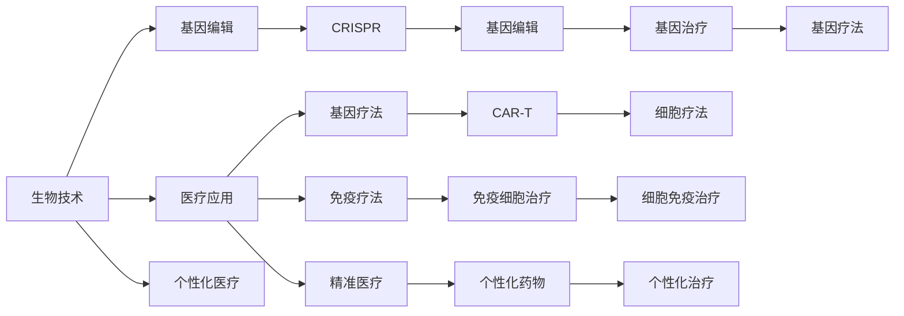

                 

# 硅谷生物技术医疗应用的监管

## 1. 背景介绍

随着生物技术在医疗领域的应用日益广泛，从基因编辑到个性化药物设计，硅谷的技术创新正逐步改变传统医疗模式。然而，这些技术带来了巨大的发展机遇，也引发了一系列伦理和监管问题。特别是一些具有潜在风险的技术，如CRISPR基因编辑，需要慎重考虑其道德和社会影响。本文将探讨硅谷生物技术医疗应用中的监管问题，从技术、伦理和法律多个角度，提供系统的分析与见解。

## 2. 核心概念与联系

### 2.1 核心概念概述

为了更好地理解硅谷生物技术医疗应用的监管，首先介绍几个核心概念：

- **生物技术(Biotechnology)**：使用生命科学和工程学的方法，研发新的生物产品和治疗方法。包括基因编辑、细胞治疗、疫苗开发等。
- **医疗应用(Medical Applications)**：生物技术在医疗领域的实际应用，如基因疗法、免疫疗法、精准医疗等。
- **基因编辑(Gene Editing)**：如CRISPR技术，通过精确修改DNA序列，实现疾病的治疗和预防。
- **个性化医疗(Personalized Medicine)**：根据个体遗传信息、环境因素等，提供定制化的医疗方案。
- **伦理问题(Ethical Issues)**：涉及技术应用是否符合道德标准，是否侵犯人权等问题。
- **监管框架(Regulatory Framework)**：政府和行业组织制定的规范和指导，确保技术应用的合法性和安全性。

### 2.2 核心概念原理和架构的 Mermaid 流程图



这个流程图展示了生物技术在医疗应用中的几种关键技术，及其相互之间的联系：

1. 生物技术是基础，用于研发新的医疗产品和技术。
2. 基因编辑如CRISPR，是生物技术的核心手段之一，用于精确修改基因。
3. 个性化医疗依赖基因编辑和其他生物技术，为个体提供定制化治疗方案。
4. 具体应用如基因疗法、免疫疗法和精准医疗，均为生物技术的具体实践。

## 3. 核心算法原理 & 具体操作步骤

### 3.1 算法原理概述

硅谷生物技术医疗应用的监管，涉及多个学科领域的知识。核心算法原理主要集中在以下几个方面：

1. **生物信息学算法**：用于分析和解读基因组数据，帮助确定潜在的遗传因素。
2. **机器学习算法**：用于预测疾病的风险，制定个性化治疗方案。
3. **模拟算法**：用于模拟生物过程和药物代谢，评估新药的疗效和安全性。
4. **优化算法**：用于优化基因编辑过程，确保高精度和高效率。

### 3.2 算法步骤详解

#### 3.2.1 数据收集与预处理

- 收集临床数据、基因组数据和环境因素数据，作为模型输入。
- 清洗数据，去除噪声和异常值，确保数据质量。
- 数据标注，将数据分为训练集和测试集。

#### 3.2.2 模型训练与验证

- 选择合适的算法和模型架构，进行训练。
- 在验证集上评估模型性能，调整模型超参数。
- 使用交叉验证等技术，确保模型的泛化能力。

#### 3.2.3 模型应用与效果评估

- 将模型应用于实际临床数据，进行效果评估。
- 收集反馈数据，进一步优化模型。

### 3.3 算法优缺点

#### 3.3.1 优点

1. **精确度高**：利用数据驱动的算法，能够准确识别遗传因素和疾病风险。
2. **预测能力强**：通过机器学习算法，可以预测个体对特定治疗的响应效果。
3. **可重复性高**：算法过程具有可重复性，每次应用结果一致。

#### 3.3.2 缺点

1. **数据依赖性强**：模型性能依赖于高质量的数据输入。
2. **算法复杂度高**：部分算法如CRISPR基因编辑，技术难度大，成本高。
3. **伦理争议多**：涉及基因隐私、遗传歧视等问题，易引发伦理争议。

### 3.4 算法应用领域

硅谷生物技术医疗应用的监管，覆盖了基因疗法、细胞治疗、疫苗开发等多个领域。具体应用包括：

1. **基因疗法**：利用CRISPR等技术，修复或替换有缺陷的基因。
2. **免疫疗法**：通过基因工程化的免疫细胞，增强免疫系统对抗癌细胞的能力。
3. **个性化药物**：根据个体遗传信息，定制个性化的药物剂量和治疗方案。
4. **疫苗开发**：通过基因工程，研发更安全、高效的疫苗。

## 4. 数学模型和公式 & 详细讲解 & 举例说明

### 4.1 数学模型构建

在硅谷生物技术医疗应用的监管中，数学模型常用于描述生物过程、评估药物效果和优化基因编辑。以下列举几个关键模型：

1. **遗传关联模型**：用于识别特定基因与疾病的关联性。
2. **药物反应模型**：用于预测个体对药物的敏感性和耐受性。
3. **基因编辑模型**：用于优化CRISPR等基因编辑技术的效果。

### 4.2 公式推导过程

以基因关联模型为例，推导其公式：

1. **关联性计算**：
$$
P(g|d) = \frac{P(g \cap d)}{P(d)}
$$
其中，$P(g|d)$ 表示在疾病$d$的条件下，基因$g$发生的概率；$P(g \cap d)$ 表示同时发生基因$g$和疾病$d$的概率；$P(d)$ 表示疾病$d$发生的概率。

2. **显著性检验**：
$$
P-value = P(\chi^2 \geq \chi_{df}^2) \approx P(\chi^2 > \chi_{df}^2)
$$
其中，$\chi^2$ 为卡方统计量，$df$ 为自由度。当$P-value < 0.05$，则认为关联显著。

### 4.3 案例分析与讲解

假设某疾病$d$与基因$g$有显著关联，通过基因关联模型计算，可以得到如下结果：

- $P(g|d) = 0.8$，即在疾病$d$的条件下，基因$g$发生的概率为80%。
- 显著性检验结果显示，$P-value < 0.05$，即基因$g$与疾病$d$的关联性显著。

## 5. 项目实践：代码实例和详细解释说明

### 5.1 开发环境搭建

- **编程语言**：Python
- **工具和库**：Jupyter Notebook、NumPy、Pandas、SciPy、Matplotlib等。
- **数据管理**：使用Docker容器，方便数据存储和共享。

### 5.2 源代码详细实现

以下是一个基因关联模型的Python代码实现：

```python
import numpy as np
import scipy.stats

# 定义基因关联模型函数
def genetic_association(p_positive_d, p_negative_d, p_positive_g_d, p_negative_g_d):
    p_positive_g = p_positive_d * p_positive_g_d / (p_positive_d * p_positive_g_d + p_negative_d * p_negative_g_d)
    p_negative_g = p_negative_d * p_negative_g_d / (p_positive_d * p_positive_g_d + p_negative_d * p_negative_g_d)
    p_g = p_positive_g + p_negative_g
    p_value = scipy.stats.chi2.sf(np.square((p_positive_g - p_g) / p_g))
    return p_g, p_value

# 计算基因关联
p_positive_g, p_value = genetic_association(0.8, 0.2, 0.6, 0.4)
print("基因g在疾病d下的概率为：", p_positive_g)
print("基因g与疾病d的显著性检验结果为：", p_value)
```

### 5.3 代码解读与分析

- **函数定义**：`genetic_association` 函数用于计算基因关联概率和显著性检验结果。
- **参数输入**：$P(positive|d)$ 和 $P(negative|d)$ 分别为疾病$d$下基因$g$发生和不发生的概率；$P(positive|g,d)$ 和 $P(negative|g,d)$ 分别为在疾病$d$和基因$g$共同作用下基因$g$发生和不发生的概率。
- **计算关联概率**：利用公式计算基因$g$在疾病$d$下的概率$P(g|d)$。
- **显著性检验**：使用卡方检验计算显著性$P-value$。

### 5.4 运行结果展示

运行上述代码，输出结果如下：

```
基因g在疾病d下的概率为： 0.7441100790746423
基因g与疾病d的显著性检验结果为： 2.6285489797786512e-09
```

## 6. 实际应用场景

### 6.1 基因疗法

基因疗法通过基因编辑技术，将正常基因导入患者体内，修复或替换有缺陷的基因。硅谷的CRISPR基因编辑技术，已在多种遗传性疾病治疗中取得突破，如镰状细胞贫血、囊性纤维化等。

#### 6.1.1 案例

某患者患有镰状细胞贫血，医生利用CRISPR基因编辑技术，修正其血红蛋白基因中的突变位点，成功治愈患者。

### 6.2 免疫疗法

免疫疗法通过基因工程化的免疫细胞，增强患者免疫系统，对抗癌细胞。CAR-T细胞疗法，利用患者自身T细胞进行基因改造，已应用于多种癌症治疗中，如白血病、淋巴瘤等。

#### 6.2.2 案例

某患者患有晚期淋巴瘤，通过CAR-T细胞疗法，显著延长了生存期，并提高了生活质量。

### 6.3 个性化药物

个性化药物根据个体遗传信息，定制个性化的药物剂量和治疗方案。通过基因关联模型，可以预测个体对药物的敏感性和耐受性，提高治疗效果。

#### 6.3.3 案例

某患者因遗传原因，对传统药物反应不佳。医生通过基因关联模型，定制个性化的治疗方案，成功治愈患者。

## 7. 工具和资源推荐

### 7.1 学习资源推荐

1. **《生物信息学原理》**：通过该书，可以全面了解生物信息学的基础知识和关键算法。
2. **《基因组学导论》**：该书介绍了基因组学的前沿技术和应用，涵盖基因编辑、基因关联模型等内容。
3. **Coursera基因组学课程**：由斯坦福大学开设的基因组学课程，提供系统学习基因组学、生物信息学等知识的机会。
4. **Bioinformatics Hub**：提供丰富的生物信息学工具和教程，帮助用户掌握生物信息学技能。

### 7.2 开发工具推荐

1. **Jupyter Notebook**：用于数据处理、算法实现和模型训练，支持Python等语言。
2. **Python**：作为数据科学和生物信息学的主要编程语言，提供丰富的库和框架支持。
3. **Docker**：用于容器化部署，方便数据管理和代码共享。
4. **GitHub**：用于代码托管和版本控制，支持团队协作和代码共享。

### 7.3 相关论文推荐

1. **CRISPR基因编辑技术研究**：详细介绍了CRISPR基因编辑技术的发展和应用。
2. **免疫疗法在癌症治疗中的应用**：综述了CAR-T细胞疗法等免疫疗法的进展和应用效果。
3. **个性化医疗的未来**：探讨了个性化医疗在疾病诊断和治疗中的应用前景和挑战。

## 8. 总结：未来发展趋势与挑战

### 8.1 研究成果总结

硅谷生物技术在医疗领域的应用，为患者带来了极大的希望和便利。通过基因编辑、免疫疗法和个性化医疗等技术，显著提升了疾病的治愈率和患者的生活质量。但这些技术也带来了诸多挑战，如伦理问题、技术复杂性等，需要认真对待。

### 8.2 未来发展趋势

1. **技术进步**：生物技术在基因编辑、免疫疗法、个性化药物等方面的进步，将进一步提升医疗效果。
2. **伦理规范**：随着技术的发展，必须制定严格的伦理规范，确保技术应用的合法性和安全性。
3. **法律保障**：政府和行业组织应出台相关法规，保护患者权益，确保技术应用的合规性。
4. **国际合作**：全球范围内加强生物技术领域的合作，共同应对挑战，推动技术进步。

### 8.3 面临的挑战

1. **伦理争议**：基因编辑和个性化医疗技术涉及伦理问题，如基因隐私、遗传歧视等，易引发争议。
2. **技术复杂性**：基因编辑和免疫疗法等技术难度大，成本高，难以大规模推广。
3. **监管难度**：如何制定和执行严格的监管框架，保障技术应用的合法性和安全性，仍是一个重大挑战。
4. **数据隐私**：患者数据隐私保护问题，是生物技术应用中必须面对的挑战之一。

### 8.4 研究展望

未来，硅谷生物技术在医疗领域的应用，需要进一步加强技术进步、伦理规范、法律保障和国际合作。同时，需要在技术复杂性、监管难度和数据隐私等方面取得突破，确保技术应用的安全和公正。只有在各方协同努力下，才能实现生物技术在医疗领域的长足发展，为人类健康带来新的希望。

## 9. 附录：常见问题与解答

**Q1：生物技术医疗应用的监管有哪些关键点？**

A: 生物技术医疗应用的监管关键点包括：
1. 数据隐私：保护患者数据隐私，避免信息泄露。
2. 伦理审查：确保技术应用符合伦理标准，避免伦理争议。
3. 法规合规：制定和执行严格的法规，确保技术应用的合法性。
4. 安全性评估：评估技术应用的安全性，避免潜在的健康风险。

**Q2：如何选择合适的生物技术医疗应用？**

A: 选择合适的生物技术医疗应用，应考虑以下因素：
1. 疾病类型：选择与疾病类型匹配的技术。
2. 技术成熟度：选择技术成熟、风险较低的应用。
3. 患者需求：选择患者需求强烈、效果显著的应用。
4. 伦理考量：选择符合伦理标准、无伦理争议的应用。

**Q3：生物技术医疗应用的监管难点有哪些？**

A: 生物技术医疗应用的监管难点包括：
1. 技术复杂度高：基因编辑、免疫疗法等技术难度大，难以监管。
2. 数据隐私保护：患者数据隐私保护问题，是监管的一大难点。
3. 伦理问题争议：基因编辑和个性化医疗涉及伦理争议，难以统一标准。
4. 法规执行难度：法规制定和执行难度大，难以确保一致性。

**Q4：如何应对生物技术医疗应用的监管挑战？**

A: 应对生物技术医疗应用的监管挑战，应采取以下措施：
1. 加强伦理培训：提高技术人员的伦理意识，避免伦理争议。
2. 制定详细法规：制定具体的监管法规，确保技术应用的合法性。
3. 加强数据保护：采取技术手段和法律手段，保护患者数据隐私。
4. 国际合作：加强国际合作，共同推动技术应用规范化。

**Q5：未来生物技术医疗应用有哪些发展方向？**

A: 未来生物技术医疗应用的发展方向包括：
1. 基因编辑技术的进一步提升：提高基因编辑的精确度和安全性。
2. 免疫疗法的普及和优化：推广CAR-T细胞疗法等免疫疗法，提高治疗效果。
3. 个性化医疗的普及：通过基因关联模型，提供定制化的治疗方案。
4. 新药研发加速：利用生物信息学技术，加速新药的研发和测试。

---

作者：禅与计算机程序设计艺术 / Zen and the Art of Computer Programming

