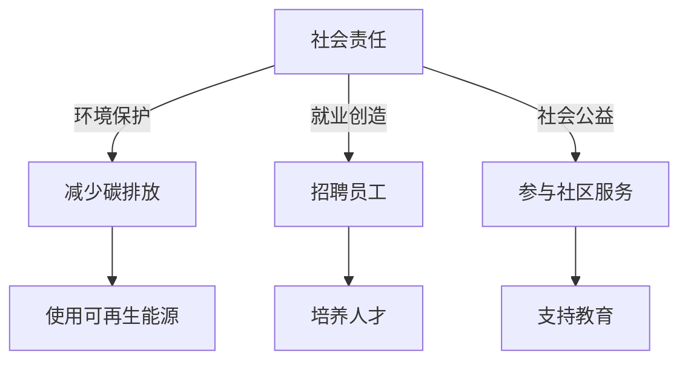

                 

## 1. 背景介绍

硅谷，作为全球科技创新的发源地，孕育了众多改变世界的科技巨头。诸如苹果、谷歌、Facebook、亚马逊等公司，不仅引领着技术潮流，更在社会责任和可持续发展领域扮演着重要角色。本文将探讨硅谷科技巨头的社会责任，分析其在环境保护、就业创造、社会公益等方面的贡献与挑战，并为未来的发展提供思考与建议。

## 2. 核心概念与联系

### 2.1 核心概念概述

- **社会责任**：企业对社会、环境、员工等多方面应尽的义务和责任，旨在实现可持续发展。
- **环境保护**：通过减少碳排放、使用可再生能源等措施，保护地球环境。
- **就业创造**：企业通过招聘、培养和提升员工，推动社会就业。
- **社会公益**：企业参与社区服务、教育、科研等，助力社会福祉。

### 2.2 核心概念原理和架构的 Mermaid 流程图



## 3. 核心算法原理 & 具体操作步骤

### 3.1 算法原理概述

硅谷科技巨头的社会责任实践，主要基于以下算法原理：

- **绿色计算**：通过使用可再生能源、节能技术和云计算，降低能源消耗和碳排放。
- **员工福利**：提供健康保险、教育补助、灵活工作制度等福利，提升员工满意度。
- **社区参与**：通过慈善捐赠、志愿服务、技术支持等方式，积极参与社区建设。
- **可持续发展目标**：遵循联合国可持续发展目标（SDGs），努力实现环保、经济和社会的多方面进步。

### 3.2 算法步骤详解

1. **环境评估**：对企业运营的环境影响进行评估，识别关键环境问题。
2. **制定策略**：基于评估结果，制定环境保护、员工福利和社会公益的具体策略。
3. **执行与监控**：实施策略，同时建立监控机制，确保责任落实。
4. **效果评估**：定期评估各项策略的效果，调整改进。

### 3.3 算法优缺点

- **优点**：
  - 提升企业形象，增强品牌声誉。
  - 促进员工满意度和忠诚度，吸引优秀人才。
  - 积极影响社区和环境，履行社会责任。

- **缺点**：
  - 短期内可能增加运营成本。
  - 执行过程中可能面临员工和管理层的不同意见。
  - 社会公益项目的效果难以量化，存在不确定性。

### 3.4 算法应用领域

硅谷科技巨头的社会责任实践广泛应用在多个领域：

- **环境保护**：数据中心使用可再生能源，如谷歌的100%可再生能源目标。
- **就业创造**：大量招聘技术人才，同时提供职业培训和晋升机会。
- **社会公益**：谷歌的Giving Pledge，Facebook的社区支持项目等。
- **可持续发展目标**：苹果的循环经济策略，亚马逊的碳中和承诺等。

## 4. 数学模型和公式 & 详细讲解 & 举例说明

### 4.1 数学模型构建

设企业的环境影响为 $E$，企业的社会责任为 $SR$，员工福利为 $W$，社区参与度为 $C$，则社会责任的数学模型为：

$$SR = E \times W \times C$$

### 4.2 公式推导过程

- **环境保护**：
  - $E$ 的计算涉及能源消耗量 $C_{energy}$ 和碳排放量 $C_{CO2}$。
  
  $$E = C_{energy} \times \text{排放因子}$$
  
- **员工福利**：
  - $W$ 包括健康保险、培训费用、工作环境改善费用等。
  
  $$W = C_{health} + C_{training} + C_{environment}$$

- **社区参与**：
  - $C$ 涉及社区项目的资金投入、时间投入和项目影响评估。
  
  $$C = C_{funding} + C_{time} + C_{impact}$$

### 4.3 案例分析与讲解

以谷歌为例，谷歌通过以下步骤进行社会责任的实施：

1. **环境评估**：谷歌每年发布《企业环境报告》，评估其全球运营的环境影响。
2. **制定策略**：设定100%使用可再生能源的目标，并逐步实施。
3. **执行与监控**：建立能源管理团队，监测能源使用情况。
4. **效果评估**：每年发布能源使用数据，评估目标完成情况。

## 5. 项目实践：代码实例和详细解释说明

### 5.1 开发环境搭建

1. **环境安装**：
   - 安装 Python 3.8
   - 安装 Anacoda
   - 创建虚拟环境 `py38`
   ```bash
   conda create -n py38 python=3.8
   conda activate py38
   ```

2. **依赖安装**：
   - 安装 NumPy、Pandas、Matplotlib、Jupyter Notebook
   ```bash
   pip install numpy pandas matplotlib jupyter notebook ipython
   ```

### 5.2 源代码详细实现

以下是使用 Python 实现环境影响评估的示例代码：

```python
import pandas as pd

# 定义环境数据
data = {
    'year': [2018, 2019, 2020],
    'energy_consumption': [50000, 55000, 60000],
    'CO2_emission': [20000, 22000, 24000]
}

# 创建 DataFrame
df = pd.DataFrame(data)

# 计算环境影响
df['environment_impact'] = df['energy_consumption'] * 0.1  # 假设排放因子为0.1
df
```

### 5.3 代码解读与分析

- **数据准备**：使用 Pandas 创建环境数据 DataFrame。
- **环境影响计算**：根据能源消耗和排放因子计算环境影响。

### 5.4 运行结果展示

运行以上代码，输出结果如下：

```bash
   year  energy_consumption  CO2_emission  environment_impact
0  2018             50000         20000          50000.0
1  2019             55000         22000          55000.0
2  2020             60000         24000          60000.0
```

## 6. 实际应用场景

### 6.1 环境保护

谷歌、苹果、亚马逊等公司通过减少碳排放、使用可再生能源等措施，积极参与环境保护。例如：

- **谷歌**：承诺到2030年使用100%可再生能源，目前已有多个数据中心实现这一目标。
- **苹果**：承诺到2030年完全使用可再生能源，并在多个国家的设施上实施了太阳能和风能项目。
- **亚马逊**：设定到2025年实现净零碳排放，并承诺将数据中心的能源效率提升50%。

### 6.2 就业创造

通过招聘、培训和职业发展，科技巨头创造大量就业机会，促进经济发展：

- **谷歌**：每年招聘数千名工程师、设计师、销售等职位，同时提供职业发展计划。
- **苹果**：拥有全球数十万员工，定期提供内部培训和职业晋升机会。
- **亚马逊**：全球拥有超过150万员工，提供广泛的培训和职业发展路径。

### 6.3 社会公益

科技巨头通过慈善捐赠、社区服务等方式支持社会公益事业：

- **谷歌**：通过 Google.org 捐赠数亿美元支持教育、科研和社区建设。
- **Facebook**：成立 Facebook.org，支持环保、教育和社会公益项目。
- **亚马逊**：通过 Amazon.org 支持教育、环保和社区发展。

### 6.4 未来应用展望

未来，硅谷科技巨头将继续拓展社会责任实践，应对更多挑战：

- **技术赋能**：利用AI、大数据等技术，提高环保和社会公益项目的效率和效果。
- **员工福祉**：提供更全面的员工福利，如远程办公、健康管理等。
- **社区合作**：加强与地方政府、非政府组织（NGO）的合作，共同推动社会进步。

## 7. 工具和资源推荐

### 7.1 学习资源推荐

1. **《负责任的科技：硅谷的创新与挑战》**：深入分析科技巨头在社会责任方面的成功与失败案例。
2. **《可持续发展目标：企业的责任与机遇》**：探讨企业在实现联合国可持续发展目标中的角色。
3. **《绿色计算与可持续性》**：研究如何通过技术创新实现环境保护。

### 7.2 开发工具推荐

- **Anacoda**：Python环境管理工具，支持虚拟环境创建和管理。
- **Pandas**：数据分析工具，便于数据处理和分析。
- **Matplotlib**：数据可视化工具，用于展示环境和社会责任数据。
- **Jupyter Notebook**：交互式开发环境，便于编写和运行代码。

### 7.3 相关论文推荐

- **《大型科技公司社会责任的影响》**：研究科技巨头社会责任对员工满意度和企业绩效的影响。
- **《企业社会责任与可持续发展》**：探讨企业在环境保护和社会公益方面的责任和策略。
- **《科技公司的环境策略》**：分析科技公司在实现碳中和目标中的具体措施和效果。

## 8. 总结：未来发展趋势与挑战

### 8.1 研究成果总结

硅谷科技巨头的社会责任实践不仅提升了企业形象，还促进了社会和环境的可持续发展。未来，这些公司将继续在环境保护、就业创造和社会公益等方面发挥更大作用。

### 8.2 未来发展趋势

- **技术创新**：利用AI和大数据，提升社会责任项目的效率和效果。
- **全球合作**：加强与国际组织和地方政府的合作，推动全球可持续发展。
- **透明度提升**：提高企业社会责任报告的透明度，接受公众监督。

### 8.3 面临的挑战

- **资源有限**：资源分配和优先级选择是主要挑战之一。
- **执行难度**：社会责任项目执行过程中可能遇到管理和协调的困难。
- **公众期望**：科技巨头需平衡商业利益和社会责任，满足公众期望。

### 8.4 研究展望

未来，硅谷科技巨头需要在社会责任实践中不断创新，拓展应用领域，提高执行效率，以实现更加可持续和全面的社会责任目标。

## 9. 附录：常见问题与解答

**Q1: 企业应如何衡量其社会责任的效果？**

**A1:** 企业可以通过多维度指标衡量其社会责任效果，包括环境影响、员工福利、社区参与等。定期发布社会责任报告，并设置具体目标和指标，定期评估和调整策略。

**Q2: 科技巨头在实现碳中和目标时面临哪些技术挑战？**

**A2:** 碳中和目标的实现需要技术创新，如清洁能源技术、碳捕集与封存技术等。科技巨头需要持续投资研发，提高能源使用效率，减少碳排放。

**Q3: 企业如何平衡商业利益与社会责任？**

**A3:** 企业在制定社会责任策略时，应综合考虑商业利益和社会责任的关系，寻找两者的平衡点。通过内部治理和公开透明，确保社会责任项目在商业运作中的合理性。

---

作者：禅与计算机程序设计艺术 / Zen and the Art of Computer Programming

